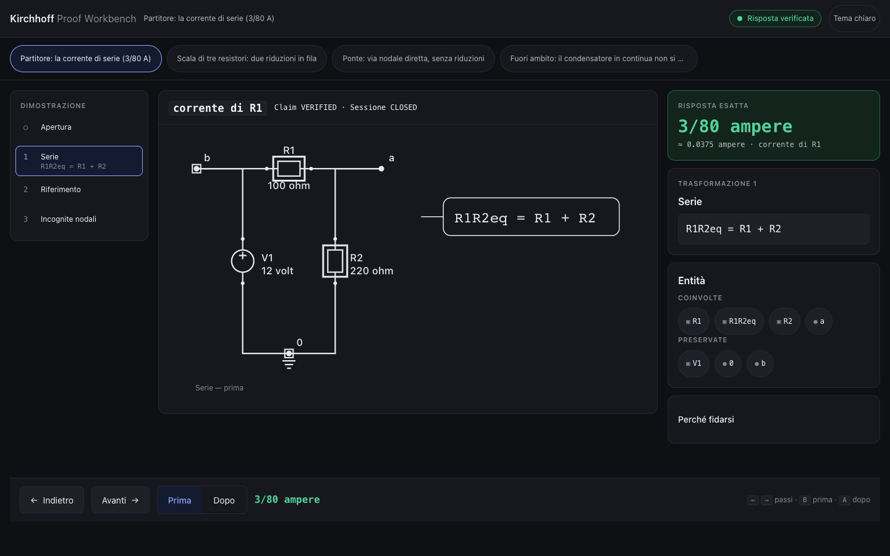

# Kirchhoff

Risolutore di circuiti verificato. Il valore non è la risposta: è che la risposta ha superato
cinque controlli indipendenti prima di essere mostrata.

Il piano completo è in `docs/00-fonte-piano-kirchhoff.md` (decisioni **D1–D12** in testa, sono il
contratto). Gli artefatti BMAD stanno in `_bmad-output/`.

## Stato

**Kirchhoff Proof Workbench 0.1** — una radice applicativa canonica, una
proiezione visuale certificata, una superficie studente navigabile nel browser.



| Cosa | Stato |
|---|---|
| Radice canonica (R3) | `run_proof_session`: ogni richiesta di prodotto passa di qui, una sola orchestrazione e una sola certificazione; `resolve` e' compatibilita' che delega |
| Verita' visuale singola (H5) | `render/` non riesegue `transform()`: proietta `TransformExecution` certificata (0 chiamate produttive, testato) |
| Contratto di presentazione | `StudentSessionView` (student-session.v0.1): esatto prima del decimale, Claim VERIFIED vs sessione CLOSED, mai Product Verified |
| Superficie | React 19 + TS strict + Vite (solo react/react-dom a runtime): 3 esercizi veri + 1 rifiuto onesto, 32 E2E verdi |
| Backend storico | Epic 1 chiusa, P1-J/K/L integrati, H2.5/O0 fusi; H2.75 in review (stack sotto questo lavoro) |

## Il banco in 2 comandi

```bash
cd web && npm install && npm run dev
```

poi apri l'URL stampato (le viste in `web/public/sessions/` sono gia'
versionate; si rigenerano dal kernel con
`uv run --no-sync python scripts/generate_workbench.py` e il drift test
`tests/test_workbench_generation.py` ne prova la byte-identita').

## Cosa e' verificato e cosa no

- Verificato e pubblicato: continua DC con domande esplicite, via percorso
  didattico certificato (Claim elettrico VERIFIED + sessione CLOSED).
- Verificato a livello di dominio ma NON pubblicato dal prodotto: fasori,
  sorgenti controllate, transitori (i solutori `mna`/tableau e l'eval
  restano intatti; il prodotto risponde con un `Refusal` onesto).
- Mai affermato: Product Verified (riservato a un gate futuro, H5 prodotto).
- Non supportato nel disegno: autolayout generale (solo maglia singola
  calcolata + disposizioni a mano riesaminate per scala e ponte).

## Uso storico (CLI ed eval)

Il CLI (`kirchhoff <netlist> [--svg ...] [--pdf ...]`) attraversa la stessa
radice canonica del banco e ne proietta le chiusure; codici: 0 ok,
3 RIFIUTATO, 65/66 netlist, 70 guasto.

```bash
uv run kirchhoff-eval build --n 60 --out reference-set
uv run kirchhoff-eval report --root reference-set --split dev
uv run --with pytest python -m pytest tests -q
```

La parte trattenuta dell'insieme non è leggibile dal flusso di sviluppo: serve `--allow-holdout`,
e usarla durante lo sviluppo invalida ogni misura successiva.

## I gate

Tre controlli che falliscono da soli, senza che qualcuno debba ricordarsene:

```bash
uv run python scripts/check_domain_coverage.py   # domain/ al 100%, righe e rami
uv run python scripts/check_boundaries.py        # domain/ isolato; domain/ e render/ mai verso il frontend
uv run --with pytest --with pytest-cov python -m pytest   # copertura globale >= 95%
```

Il banco aggiunge i propri gate (`web/`: `npm run typecheck`, `npm run test`,
`npm run build`, `npm run test:e2e` sulla build di produzione).

Il controllo dei confini legge l'albero sintattico, non il testo: `import kirchhoff.adapters as a`
e `from kirchhoff import pipeline` sono viste come `from ..adapters import x`, e un percorso
sbagliato solleva invece di dichiarare tutto pulito.

La configurazione (`src/kirchhoff/config.py`) valida all'avvio e **impedisce di partire** se
qualcosa non torna. Tre vincoli del piano vivono lì come condizioni di avvio invece che come prosa:
almeno 3 passi di estrazione (D4, AD-12), immagini cancellate entro 72 ore (FR-30), dati in Unione
Europea (NFR-14). Le soglie stanno sul tipo `Settings`, non nel lettore: costruirlo a mano non le
aggira.

## Come è verificato l'oracolo

Un oracolo che si autocertifica non è un oracolo. Per ogni classe, chi genera un caso e chi lo
verifica partono da estremi opposti e devono incontrarsi **esattamente**:

| Classe | Costruzione | Verifica indipendente |
|---|---|---|
| `dc_resistive` | albero serie/parallelo, tensioni propagate sulle foglie | analisi nodale sull'IR appiattito, che dell'albero non sa nulla |
| `ac_sinusoidal` | stesso albero, ma con impedenze complesse | analisi nodale complessa |
| `three_phase` | circuito monofase equivalente più rotazione di 120° | analisi nodale sull'intera rete, che della simmetria non sa nulla |
| `transient` | si scelgono le radici caratteristiche, si derivano i componenti | la matrice MNA a sorgenti spente deve essere singolare in quelle radici |

Tutta l'aritmetica è esatta: `Fraction`, e per fasori e trifase il campo ciclotomico `Q(ζ₁₂)`, che
contiene insieme `j` e `√3`. Un float non entra: né in un valore di componente, né nel campo — e il
tentativo è un errore, non un arrotondamento. Quindi la somma delle tre correnti di fase è **zero**,
non "circa zero", e un residuo diverso da zero è sempre un bug.

## Attribuzioni

Il materiale esterno usato e le sue licenze sono in `docs/01-fonti-esterne.md`.
