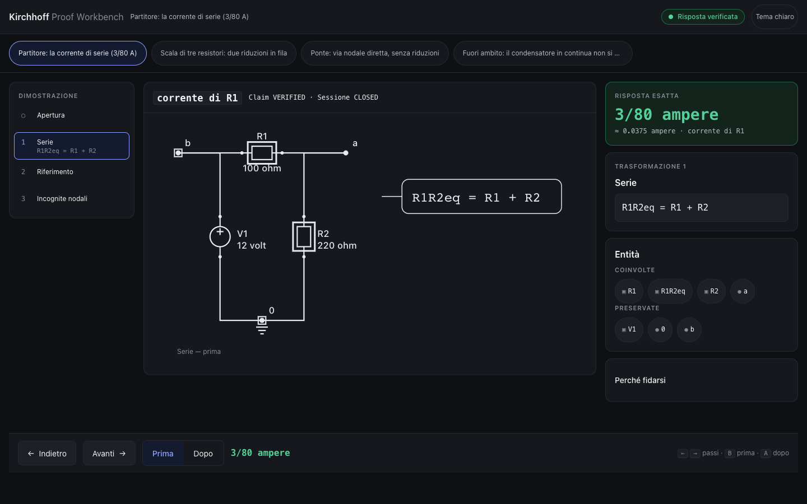

# Kirchhoff

Risolutore di circuiti con verifiche ispezionabili. Il risultato numerico
viene controllato insieme alle equazioni e alla derivazione; questi controlli
non sono cinque oracoli statisticamente indipendenti.

Il piano completo è in `docs/00-fonte-piano-kirchhoff.md` (decisioni **D1–D12** in testa, sono il
contratto). Gli artefatti BMAD stanno in `_bmad-output/`.

## Stato

**CircuitCheck, versione locale in sviluppo** — una radice applicativa canonica,
una lezione visuale per circuiti DC resistivi e un banco tecnico di prova.



| Cosa | Stato |
|---|---|
| Radice canonica (R3) | `run_proof_session`: ogni richiesta di prodotto passa di qui, una sola orchestrazione e una sola certificazione; `resolve` e' compatibilita' che delega |
| Verita' visuale singola (H5) | `render/` non riesegue `transform()`: proietta `TransformExecution` certificata (0 chiamate produttive, testato) |
| Contratto di presentazione | `StudentSessionView` (student-session.v0.1): esatto prima del decimale, Claim VERIFIED vs sessione CLOSED, mai Product Verified |
| Superficie | React 19 + TS strict + Vite: lo studente apre `/`, il banco tecnico `/?view=proof`; foto automatica solo con provider configurato |
| Lavagna e procedimento | Schema a componenti con incroci distinti dalle giunzioni; StudentTrace verifica le riduzioni R in serie/parallelo e si astiene sugli altri metodi |
| MCP | Tool stdio senza UI + risorsa MCP App interattiva; la compatibilita' con un host reale richiede ancora prova |
| Backend storico | Epic 1 chiusa, P1-J/K/L integrati, H2.5/O0/H2.75 fusi in `main` |

## Avvio locale dello studente

```bash
uv sync --frozen
cd web && npm ci && npm run build && cd ..
uv run --no-sync python scripts/serve_student.py --port 43921
```

Apri `http://127.0.0.1:43921/`. Il catalogo e' disponibile anche senza un
provider foto; il server risolve circuiti nuovi nel perimetro DC dichiarato.
La trascrizione di fotografie richiede `OPENAI_API_KEY` e
`KIRCHHOFF_VISION_MODEL` sul server e un invio esplicito dalla pagina; il
risultato deve essere corretto e confermato prima del calcolo. Il disegno libero
produce un'immagine che richiede la stessa trascrizione confermata.
Anche senza riconoscimento automatico puoi trascrivere manualmente una foto: il
server convalida l'immagine, firma una ricevuta temporanea e lega la conferma
all'impronta esatta del circuito. Una modifica successiva richiede una nuova
conferma; foto e chiavi non sono salvate dal server. La ricevuta non dimostra
la fedelta' della trascrizione e scade dopo un'ora o al riavvio del server.

Per il banco tecnico statico: `cd web && npm run dev`, poi `/?view=proof`.
Le sue sessioni versionate si rigenerano con
`uv run --no-sync python scripts/generate_workbench.py`; il test
`tests/test_workbench_generation.py` ne controlla il contenuto.

## MCP locale

```bash
uv sync --frozen --extra mcp
cd web && npm ci && npm run build && cd ..
uv run --no-sync python -m kirchhoff.api.mcp_server
```

Configura il client MCP con trasporto `stdio` e l'ultimo comando come processo.
`solve_circuit` restituisce la lezione canonica, `diagnose_steps` controlla una
`student-trace.v1` legata allo SHA-256 della netlist, `circuit_capabilities`
dichiara i limiti. Il tool di soluzione pubblica `_meta.ui.resourceUri` e la
risorsa `ui://kirchhoff/circuit-lesson.html` per host MCP App compatibili. Un
client headless usa gli stessi tool senza la vista. La verifica locale usa il
client ufficiale in-process e via stdio; non equivale a una prova in un host
MCP App di produzione.

## SPICE DC controllato

La pagina e gli strumenti MCP importano/esportano il sottoinsieme
`kirchhoff-spice-dc.v1`: R/C/L, sorgenti V/I indipendenti DC, E/G controllate
da tensione, `.op`, `.end` e domanda in commento `* KIRCHHOFF_REQUEST`.
Valori e nodi sono preservati; `M` significa milli e `MEG` mega. Le frazioni
che non hanno un decimale finito e le direttive/modelli non previsti vengono
rifiutati esplicitamente. L'importazione non equivale al supporto didattico
di C/L o AC. Il round trip e un punto di lavoro indipendente sono verificati
con ngspice dove installato.

## CircuitikZ a etichette di rete

La pagina, l'API locale e il tool MCP `export_circuitikz` esportano un documento
`.tex` deterministico da un circuito DC canonico. Ogni componente mostra i due
terminali nell'ordine originale; etichette di nodo uguali indicano una
connessione, evitando incroci grafici ambigui. Valori, unita', nodi di controllo
E/G e domanda sono inclusi; etichette non sicure vengono rifiutate. Il file
richiede il pacchetto LaTeX CircuitikZ per la compilazione. Il test locale di
compilazione e' ancora bloccato: la cache TeX disponibile non include il formato
LaTeX e non e' stato installato un runtime aggiuntivo.

## Quaderno portabile locale

**Salva quaderno** scarica un JSON versionato con circuito, metodo, passaggio
selezionato, lavagna Excalidraw e passaggi scritti dallo studente. La lavagna
viene letta nell'istante del salvataggio e deve appartenere alla revisione del
circuito; il pulsante nella lavagna consente un'associazione esplicita. **Apri
quaderno** richiede il server locale, convalida il file e ricalcola la lezione:
un'impronta o un risultato diverso blocca il caricamento. La foto originale, le
chiavi e la precedente autorizzazione fotografica non sono nel JSON. Se il
quaderno proveniva da una foto, la riapertura mostra il circuito ricostruito
come testo e chiede una nuova foto/conferma per ristabilire la provenienza.
Questo file non sostituisce la persistenza di una lezione Ardesia.

## Cosa e' verificato e cosa no

- Verificato nel percorso locale: continua DC con domande esplicite, via percorso
  didattico certificato (Claim elettrico VERIFIED + sessione CLOSED).
- Verificato a livello di dominio ma NON pubblicato dal prodotto: fasori,
  sorgenti controllate, transitori (i solutori `mna`/tableau e l'eval
  restano intatti; il prodotto risponde con un `Refusal` onesto).
- Mai affermato: Product Verified (riservato a un gate futuro, H5 prodotto).
- Non supportato nel disegno: autolayout generale (solo maglia singola
  calcolata + disposizioni a mano riesaminate per scala e ponte).

## Uso storico (CLI ed eval)

Il CLI (`kirchhoff <netlist> [--svg ...] [--pdf ...]`) attraversa la stessa
radice canonica del banco e ne proietta le chiusure; codici: 0 ok,
3 RIFIUTATO, 65/66 netlist, 70 guasto.

```bash
uv run kirchhoff-eval build --n 60 --out reference-set
uv run kirchhoff-eval report --root reference-set --split dev
uv run --with pytest python -m pytest tests -q
```

La parte trattenuta dell'insieme non è leggibile dal flusso di sviluppo: serve `--allow-holdout`,
e usarla durante lo sviluppo invalida ogni misura successiva.

## I gate

Tre controlli che falliscono da soli, senza che qualcuno debba ricordarsene:

```bash
uv run python scripts/check_domain_coverage.py   # domain/ al 100%, righe e rami
uv run python scripts/check_boundaries.py        # domain/ isolato; domain/ e render/ mai verso il frontend
uv run --with pytest --with pytest-cov python -m pytest   # copertura globale >= 95%
```

Il banco aggiunge i propri gate (`web/`: `npm run typecheck`, `npm run test`,
`npm run build`, `npm run test:e2e` sulla build di produzione).

Il controllo dei confini legge l'albero sintattico, non il testo: `import kirchhoff.adapters as a`
e `from kirchhoff import pipeline` sono viste come `from ..adapters import x`, e un percorso
sbagliato solleva invece di dichiarare tutto pulito.

La configurazione (`src/kirchhoff/config.py`) valida all'avvio e **impedisce di partire** se
qualcosa non torna. Tre vincoli del piano vivono lì come condizioni di avvio invece che come prosa:
almeno 3 passi di estrazione (D4, AD-12), immagini cancellate entro 72 ore (FR-30), dati in Unione
Europea (NFR-14). Le soglie stanno sul tipo `Settings`, non nel lettore: costruirlo a mano non le
aggira.

## Come è verificato l'oracolo

Un oracolo che si autocertifica non è un oracolo. Per ogni classe, chi genera un caso e chi lo
verifica partono da estremi opposti e devono incontrarsi **esattamente**:

| Classe | Costruzione | Verifica indipendente |
|---|---|---|
| `dc_resistive` | albero serie/parallelo, tensioni propagate sulle foglie | analisi nodale sull'IR appiattito, che dell'albero non sa nulla |
| `ac_sinusoidal` | stesso albero, ma con impedenze complesse | analisi nodale complessa |
| `three_phase` | circuito monofase equivalente più rotazione di 120° | analisi nodale sull'intera rete, che della simmetria non sa nulla |
| `transient` | si scelgono le radici caratteristiche, si derivano i componenti | la matrice MNA a sorgenti spente deve essere singolare in quelle radici |

Tutta l'aritmetica è esatta: `Fraction`, e per fasori e trifase il campo ciclotomico `Q(ζ₁₂)`, che
contiene insieme `j` e `√3`. Un float non entra: né in un valore di componente, né nel campo — e il
tentativo è un errore, non un arrotondamento. Quindi la somma delle tre correnti di fase è **zero**,
non "circa zero", e un residuo diverso da zero è sempre un bug.

## Attribuzioni

Il materiale esterno usato e le sue licenze sono in `docs/01-fonti-esterne.md`.
