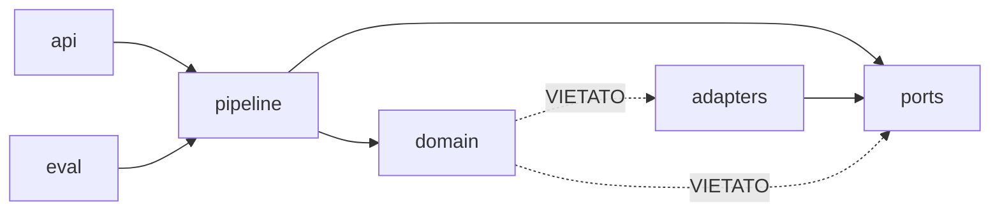
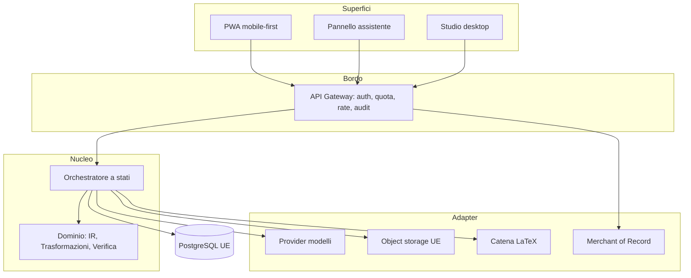
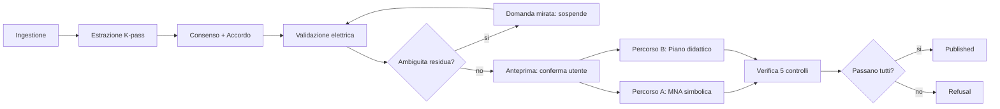
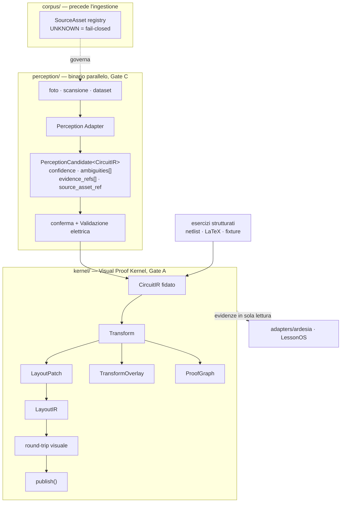
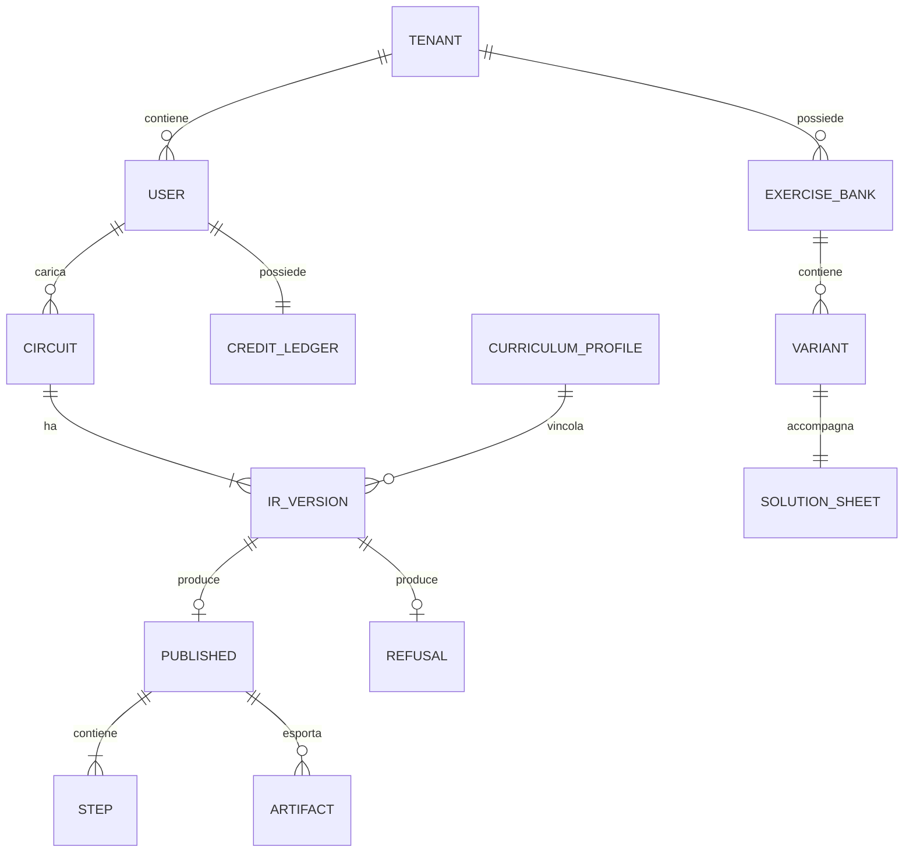

# Architecture Spine — Kirchhoff

## Design Paradigm

**Ports-and-adapters con nucleo a pipeline deterministica.**

Il nucleo è una catena di stadi puri sull'IR. Tutto ciò che è non deterministico — modelli di
visione e linguaggio, storage, pagamenti, host assistente — sta fuori, dietro *port*, e non è mai
importato dal dominio.

> **v2 — 15 agosto 2026. Il paradigma non cambia, guadagna un secondo asse.**
>
> La v1 aveva **un** contratto interno, l'IR, e la percezione dentro la pipeline principale. La v3
> del PRD porta due cambi strutturali che uno spine a IR singolo non può reggere:
>
> 1. **Quattro rappresentazioni disgiunte** invece di una — `CircuitIR`, `LayoutIR`,
>    `TransformOverlay`, `InteractionState`. Non sono viste della stessa cosa: hanno cicli di vita
>    diversi e la separazione è ciò che rende verificabile **A-0**. Se collassano, l'invariante di
>    conservazione diventa indistinguibile da una convenzione di stile (AD-21).
> 2. **La percezione esce dal nucleo** e passa su un binario parallelo dietro
>    `PerceptionCandidate<CircuitIR>`. Non è un rinvio: è la condizione perché il lavoro sulla foto
>    proceda in parallelo senza contaminare il verdetto di Gate A (AD-24).
>
> Il resto della v1 regge intatto — `port` per il non deterministico, stadi puri, gate unico — e
> **nessun `AD-1…AD-20` è stato rinumerato o ritirato**: **dieci sono emendati in loco**
> (AD-1, AD-2, AD-4, AD-5, AD-8, AD-10, AD-11, AD-15, AD-18, AD-19); gli altri dieci valgono come
> scritti.
>
> *Corretto il 15 agosto: questa frase ne dichiarava **quattro**. Le sei omesse non erano dettagli —
> fra loro **AD-18**, la cui Rule è cassata perché `Drawing` è ritirato, e **AD-11**, che nella
> forma v1 vieta Gate A. Il preambolo dichiarava «valide come scritte» due regole che non lo sono.*
>
> `epics.md` e `implementation-readiness.md` li citano tutti e venti, ma **nel significato v1**: è
> la ragione per cui il passo 6 è una rigenerazione e non un aggiornamento di conteggi.

La scelta non è stilistica: il prodotto vende il fatto che il calcolo **non** dipende da un
modello. Se quella separazione vive solo nella disciplina di chi scrive, si rompe al primo
"aggiungo qui una chiamata all'LLM per fare prima". Il paradigma la rende strutturale — un
adapter importato dal dominio è un errore di compilazione, non un rilievo di code review.

```
kirchhoff/
  domain/      # IR, Trasformazioni, Validazione, Solver, Verifica. Zero I/O.
  ports/       # ModelPort, BlobPort, LedgerPort, ClockPort, SpicePort, ObservationPort (AD-34)
  adapters/    # implementazioni concrete dei port
  pipeline/    # orchestratore: macchina a stati sugli stadi
  api/         # HTTP + superficie assistente
  eval/        # harness sul gold set, usa gli stessi port
```

Regola di dipendenza, che è essa stessa un invariante:



`domain` non dipende da nulla del progetto. `ports` dichiara solo interfacce. `adapters` implementa
`ports` e non è mai importato se non dalla composizione radice.

## Invariants & Rules

### AD-1 — L'IR è l'unico contratto fra stadi

- **Binds:** tutti gli stadi della pipeline, FR-1…FR-19, FR-22
- **Prevents:** che due stadi costruiti separatamente si scambino strutture ad hoc, rendendo
  impossibile riprodurre una soluzione dalla sola IR e mandando in pezzi la tracciabilità.
- **Rule:** ogni stadio ha firma `(CircuitIR, ctx) → CircuitIR | Refusal`. Il `CircuitIR` porta
  `ir_version` semantica. Nessuno stadio a valle dell'estrazione legge l'immagine sorgente: se un
  dato serve, sta nel `CircuitIR` o non esiste.
  **Emendata il 15 agosto (v2):** dove diceva «IR» si legge **`CircuitIR`**. Il `LayoutIR` è
  rappresentazione **pari grado**, non un campo dell'IR e non una vista: **non compare mai nella
  firma di uno stadio di calcolo** (AD-21). Uno stadio che leggesse il layout starebbe facendo
  dipendere il circuito da come è disegnato, che è l'inversione esatta della promessa.

### AD-2 — Le Trasformazioni sono funzioni pure

- **Binds:** Catalogo trasformazioni, Percorso B, FR-14, FR-15
- **Prevents:** che una Trasformazione acceda a rete, DB o modello, rendendo il Percorso B non
  riproducibile e quindi inutile come controllo indipendente del Percorso A.
- **Rule:** `transform(CircuitIR, params) → (CircuitIR, TransformResult) | Refusal`. Nessuna I/O,
  nessuna sorgente di casualità, nessun orologio. Stesso input, stesso output, sempre. Il catalogo
  è un registro chiuso caricato all'avvio: non si estende a runtime.
  **Emendata il 15 agosto (v2):** il secondo membro non è più un `Drawing`. È un
  **`TransformResult`** che porta `PreserveSet + Delta + Boundary + LayoutPatch + Equation +
  Certificate` (AD-22). Il disegno **non è un'uscita della Trasformazione**: è ciò che il renderer
  produce applicando il `LayoutPatch` al `LayoutIR` precedente. La Trasformazione dice *cosa
  cambia*; il renderer dice *come appare*. Confonderli rimetterebbe il `preserve set` nelle mani di
  chi disegna.
  **`LayoutPatch` non contiene geometria, e per questo non contraddice AD-1.** I suoi campi nominano
  **entità**, non coordinate: `preserve`, `remove`, `create` sono insiemi di identificatori,
  `node_mapping` è una mappa fra identificatori, `reroute_scope` è l'insieme dei rami la cui
  instradatura è libera. Nessun numero, nessuna posizione. Ne segue la ripartizione:
  - `domain/transform/check` verifica **massimalità, identità e boundary** senza mai leggere il
    `LayoutIR` — sono proprietà di insiemi di entità;
  - `render/layout` traduce il patch in geometria ed è l'unico a conoscere `p_k`;
  - `eval/` misura lo scostamento `p_{k+1} ≈ p_k` a posteriori (AD-15).

  Senza questa distinzione la Validazione avrebbe dovuto leggere il layout — vietato da AD-1 — o il
  controllo sarebbe sceso in `render/`, restituendo al renderer il potere che AD-22 gli toglie.

### AD-3 — I modelli si raggiungono solo attraverso `ModelPort`

- **Binds:** estrazione, pianificatore didattico, narrazione, FR-2, FR-14
- **Prevents:** che un SDK di provider si infili nel dominio, legando il calcolo a un fornitore e
  rendendo impossibile la cascata economico→frontier e l'indipendenza multi-provider.
- **Rule:** nessun modulo sotto `domain/` importa un SDK di provider. `ModelPort` espone
  `extract`, `plan`, `narrate` con schemi di uscita vincolati e validazione rigida. Almeno due
  adapter registrati; la selezione è configurazione, non codice.

### AD-4 — Nessun numero mostrato all'utente proviene da un modello linguistico

- **Binds:** narrazione, rendering, export, FR-13
- **Prevents:** l'errore silenzioso più costoso del prodotto — un testo che riformula, arrotonda o
  inventa un valore che il solver aveva calcolato correttamente.
- **Rule:** il generatore di testo riceve e restituisce **segnaposto** in sintassi
  `[[q1.value]]`, mai cifre. Il renderer sostituisce dai risultati calcolati. Un testo generato
  che contiene una cifra letterale è respinto prima della pubblicazione.

  **Emendata il 15 agosto (v2) — la regola era sintattica, il difetto è semantico.** Cercare cifre
  impedisce che il numero sia **inventato**; non impedisce che sia **quello sbagliato**. Un
  `[[q2.value]]` in un passo che parla di `q1` passa ogni controllo, e la clausola di FR-13 «la
  coerenza fra i due è verificata» è **vacua per costruzione**: se il testo non contiene numeri,
  non esiste la coppia da verificare. Dalla v2:
  - ogni segnaposto è **legato al passo che lo possiede**: `[[q.value]]` risolve solo dentro
    l'insieme delle grandezze in scope per quel nodo del `ProofGraph`;
  - un segnaposto che nomina una grandezza fuori scope è **respinto**, non risolto al valore
    globale — è il modo in cui un errore di riferimento diventerebbe invisibile;
  - un segnaposto non risolto non degrada a stringa vuota né al proprio nome letterale: produce
    `Refusal`.

  **L'ordine dei passi lo determina `ModelPort.plan`**, ed è vincolato solo sul risultato finale.
  È accettabile — `AD-2` rende ogni Trasformazione pura e verificabile a sé, quindi un ordine
  sciocco produce una derivazione brutta, non una falsa. Ma va detto: **il modello sceglie il
  percorso, mai il valore né la topologia.**

### AD-5 — Il gate di pubblicazione è un unico punto di codice

- **Binds:** ogni percorso che produce una Soluzione o una Variante, FR-11, FR-12, FR-22
- **Prevents:** che una superficie (assistente, Studio, export, cache, anteprima di sviluppo)
  aggiri la Verifica e mostri un risultato non certificato — il fallimento che distrugge la
  promessa del prodotto.
- **Rule:** una Soluzione esce solo da `publish(solution) → Published | Refusal`, che esegue i
  cinque controlli. Nessun tipo `Solution` è serializzabile verso l'esterno: solo `Published` lo
  è. Il gate non ha flag di bypass, nemmeno amministrativo o di test.
  **Emendata il 15 agosto (v2):** i controlli sono **cinque più il round-trip visuale**. Il Badge
  Verificata è applicato **se e solo se** tutti e cinque passano **e** l'SVG semantico, riparsato e
  canonicalizzato, riproduce esattamente il `CircuitIR` atteso (FR-11, FR-41). Il round-trip è
  **dentro `publish()`**, non un controllo a valle: K-0 dice che il disegno fa parte della prova, e
  un gate che lo lascia fuori delega la promessa più protetta del prodotto a un altro punto di
  codice. Nessun VLM partecipa alla certificazione della topologia.

  **Seconda correzione, stesso giorno — il gate certificava un disegno e la derivazione ne ha *N*.**
  La firma era `publish(solution)` e AD-29 dice che la soluzione è **l'ultimo nodo** del
  `ProofGraph`: un'unità che eseguisse il round-trip sul solo stato finale sarebbe stata pienamente
  conforme, e i **passi intermedi — che `EXPERIENCE.md` dichiara essere il prodotto** — sarebbero
  rimasti la parte meno coperta del sistema. Dalla v2 la firma è **`publish(proof_graph)`** e il
  Badge Verificata è applicato **se e solo se ogni nodo** supera l'intera batteria:

  | # | Controllo | Da |
  |---|---|---|
  | 1-5 | KCL · KVL · bilancio di potenza · accordo fra percorsi · sanità fisica | v1 |
  | 6 | **incidenza geometrica** — il disegno tocca ciò che dichiara di toccare | AD-31 |
  | 7 | **round-trip visuale** — SVG riparsato ≡ `CircuitIR` atteso | FR-41 |
  | 8 | **`TruthfulnessGate`** su ogni `Claim` | AD-32 |

  Otto controlli, ogni nodo, un solo punto di codice, nessun flag di bypass.

### AD-6 — Il server è stateless per richiesta

- **Binds:** API HTTP, superficie assistente, MRTR, FR-8, FR-20
- **Prevents:** sticky session e store di sessione condiviso, che romperebbero lo scaling
  orizzontale e il core stateless del protocollo assistente.
- **Rule:** nessuno stato in memoria fra richieste. Lo stato di una conversazione multi-giro vive
  in `resume_ref` — identificatore opaco **firmato HMAC**, legato al `subject_id` (AD-20), TTL 15
  minuti, monouso — più la riga corrispondente a DB. Un `resume_ref` non firmato o non legato al
  soggetto è un IDOR sugli esercizi altrui.

### AD-7 — Idempotenza per costruzione su tutto ciò che consuma Crediti

- **Binds:** billing, ripresa MRTR, retry di rete, FR-8, FR-26
- **Prevents:** doppio addebito quando un client ripete una chiamata — inevitabile su MRTR, dove
  il protocollo *prevede* che la chiamata originale sia ri-emessa.
- **Rule:** ogni operazione addebitabile porta una chiave di idempotenza derivata da
  `(subject_id, circuit_id, request_hash)` — `subject_id` per AD-20, mai `user_id`, che per
  l'utente anonimo non esiste. Il ledger ha vincolo di unicità su quella chiave: il doppio
  addebito è impossibile a livello di schema, non evitato a livello di codice.

### AD-8 — Un solo modulo scrive ciascuna entità

- **Binds:** tutti i moduli di persistenza
- **Prevents:** due scrittori dello stesso record che divergono su invarianti — il caso classico
  in cui `solve` e `export` aggiornano entrambi lo stato di una Soluzione e si sovrascrivono.
- **Rule:** `IR` scritto solo da `ingest`; `Solution`/`Published` solo da `solve`; `CreditLedger`
  solo da `billing`; `Variant` solo da `studio`. Gli altri leggono. Enforcement a livello di
  permessi DB, non di convenzione.
  **Caso di confine chiuso esplicitamente:** una Variante ha una soluzione verificata, ma
  `Published` resta di proprietà di `solve`. `studio` **chiama** `publish()` e scrive solo
  `Variant`, che referenzia il `Published` per id. `studio` non scrive mai un `Published`.

  **Emendata il 15 agosto (v2) — sette entità erano senza proprietario.** Il gate avversariale ha
  rilevato che la v2 aggiungeva `LayoutIR`, `TransformOverlay`, `ProofGraph`, `Claim`,
  `SourceAsset`, `ProofSession` e `InteractionState` senza estendere questa regola: una tabella
  senza proprietario rende **inapplicabile** l'enforcement a permessi DB che la Rule prescrive.

  | Entità | Scrittore unico |
  |---|---|
  | `CircuitIR` | `ingest` |
  | `LayoutIR` | `render/layout` — **mai** `domain/` |
  | `TransformOverlay` | `render/overlay`, derivato dal `boundary` della `Transform`; non persistito |
  | `ProofGraph` | `domain/proof` |
  | `Claim` | `domain/truthfulness` |
  | `SourceAsset` | `corpus/` — nessun altro modulo apre un file del corpus |
  | `ProofSession` | `domain/proof`, come proiezione di sola lettura verso gli adapter |
  | `InteractionState` | **client**. Non è persistito lato server: non ha riga, quindi non ha scrittore |

  **Emendata il 24 agosto (v2.1) — mancava la ritenzione, e senza VCER non è calcolabile.** La
  tabella nomina lo scrittore del `LayoutIR` e tace su quanto vive: `CV6` di
  `reviews/review-continuita-visuale.md` mostra che, nella lettura naturale — applicare un
  `LayoutPatch` aggiorna il layout in luogo — *«`p_k` non esiste più nel momento in cui servirebbe
  misurarlo»*, e `eval/` potrebbe solo ricostruirlo rieseguendo la derivazione, il che dipende da
  SM-20, che a sua volta va letto **prima** di VCER. Dipendenza circolare, mai scritta.

  Dalla v2.1: **un `LayoutIR` per nodo del `ProofGraph`, append-only, mai sovrascritto** per la
  durata della `ProofSession`. Il proprietario del riferimento è **il nodo**, non la sessione: AD-29
  definisce i nodi come **stati circuitali**, e il `LayoutIR` è lo stato visuale di quello stato
  circuitale. Il nodo porta **l'identificatore** del proprio layout, mai la struttura — AD-21 ammette
  il riferimento per identificatore e vieta il contenimento — e `render/layout` resta **scrittore
  unico** del `LayoutIR`. Ne segue che `eval/` risolve la coppia `(LayoutIR_k, LayoutIR_{k+1})` dai
  due nodi adiacenti senza rieseguire nulla, e VCER diventa calcolabile.

  Questa ritenzione è tecnica e **non ha rapporto con la retention dei dati** di
  `Confini owner-locked`, che è un limite di conservazione di dati personali e resta owner-locked.

  **Il `LayoutIR` del braccio 0 non è un secondo `LayoutIR` dello stesso `Cₖ₊₁`.** È un artefatto di
  `experiment/`, con identità propria e prefisso proprio, e non entra mai nella `ProofSession`
  consegnata. Senza questa riga il braccio 0 e `render/layout` sarebbero due scrittori legittimi
  della stessa entità.

### AD-9 — Il TTL dell'immagine è imposto dallo storage, non dall'applicazione

- **Binds:** ingestione, conformità, FR-30
- **Prevents:** che la cancellazione dipenda da un job applicativo che può fallire in silenzio —
  e che un controllo di conformità trovi immagini di sei mesi fa.
- **Rule:** le immagini sorgente stanno in un bucket con lifecycle policy a **72 ore** lato
  provider. L'applicazione non è autorizzata a scriverle altrove né a copiarle. Un test di
  conformità fallisce se trova un oggetto oltre TTL.

### AD-10 — Un solo punto produce artefatti esportabili

- **Binds:** export PDF/LaTeX/SVG, Fogli soluzione, pagine pubbliche, FR-18, FR-19
- **Prevents:** che un modulo serializzi per conto proprio e produca un artefatto **privo di
  Marcatura di provenienza** — che è una non conformità, non un difetto estetico.
- **Rule:** ogni artefatto passa da `export(published, format) → Artifact`, che applica marcatura
  leggibile dalla macchina e visibile. Nessun altro modulo scrive file destinati all'utente.
  **Emendata il 15 agosto (v2) — l'artefatto certificato non era quello consegnato.** Il gate
  avversariale ha rilevato che `export()` riceve un `Published`, che esiste **solo dopo** il
  round-trip: la marcatura veniva quindi applicata **dopo** la certificazione, e il byte-stream
  verificato non era mai quello che l'utente riceveva. Peggio: PDF e CircuiTikZ non possono portare
  `data-component-id`, quindi uscivano col Badge Verificata **senza aver mai attraversato alcun
  round-trip**. K-0 dice che il disegno fa parte della prova; così il disegno provato e il disegno
  consegnato erano due oggetti prodotti da due unità diverse.
  Dalla v2: **l'SVG semantico verificato è la sorgente unica di ogni altro formato.** `export()`
  **non ri-renderizza**: applica la marcatura e trasforma l'SVG già certificato. Ogni formato non
  semantico è **derivato** da quello, e porta l'impronta dell'SVG da cui deriva. Un artefatto la cui
  impronta non corrisponde a un SVG che ha superato il round-trip non è esportabile.

### AD-11 — Il punteggio per persona non esiste nel dominio

- **Binds:** modalità Studio, telemetria, API, Studio B2B, §6 Non-Goals del PRD, **`experiment/` e
  SM-21**
- **Prevents:** la deriva verso l'Allegato III dell'AI Act, che avviene per accumulo di richieste
  ragionevoli di clienti B2B, non per una decisione esplicita.
- **Rule:** non esiste alcun tipo che associi una misura di rendimento a un identificatore di
  persona. Le risposte in modalità Studio sono transitorie e non persistite. Un test di contratto
  verifica che nessuna risposta API contenga un campo di punteggio associato a un utente.

  **Emendata il 15 agosto (v2) — il protocollo di Gate A entrava in rotta di collisione.** SM-21
  richiede **tempi ed errori per partecipante** con assegnazione controbilanciata: letta alla
  lettera, la vecchia Rule la vietava e il *Binds* non nominava l'esperimento, così due letture
  entrambe legittime mettevano il deliverable dell'MVP contro il confine più protetto del prodotto.
  **La risoluzione non è un'esenzione** — sarebbe esattamente la prima delle «richieste ragionevoli»
  che il *Prevents* teme. È strutturale:

  - `experiment/` misura contro un **`ParticipantToken`** generato per sessione sperimentale.
  - Il token **non è congiungibile** con `subject_id`, account, email o tenant: non esiste tabella,
    vista o percorso di codice che li metta in relazione, e un test di contratto lo verifica.
  - Il token **non entra mai in un'API di prodotto**, in un artefatto esportato o in un `Claim`.
    Vive in `experiment/` e in nessun altro modulo.
  - La reportistica è **aggregata per braccio**. Nessuna vista rende una riga per persona.
  - Il token è **cancellato alla chiusura dell'analisi**, e la cancellazione è verificata come il
    TTL delle immagini (AD-9): da un controllo che fallisce, non da una procedura.

  **Il confine resta quello di sempre:** non si valuta una persona. Si misura **un braccio di
  rendering**, e il partecipante è lo strumento di misura, non l'oggetto.

### AD-12 — La cascata di costo non può abbassare la qualità sotto il minimo

- **Binds:** selezione modello, estrazione, FR-2, SM-C3
- **Prevents:** che un'ottimizzazione di costo riduca K sotto la soglia e degradi la misura
  dell'Accordo — cioè peggiori SER per risparmiare centesimi.
- **Rule:** la cascata economico→frontier può cambiare *quali* modelli si usano, mai *quanti*
  Pass. `K ≥ 3` è un limite inferiore imposto dal codice. Una configurazione che lo viola non si
  avvia.

### AD-13 — `Refusal` e `Failure` sono tipi diversi

- **Binds:** dominio, API, UI, FR-12
- **Prevents:** che il Rifiuto di certificazione arrivi all'interfaccia sullo stesso canale di un
  guasto e venga reso come errore — l'errore di prodotto che trasforma un atto di onestà in un
  fallimento percepito.
- **Rule:** `Refusal` è un esito di dominio con controllo fallito, elemento coinvolto e diagnosi;
  **non consuma Crediti**. `Failure` è un guasto tecnico. Non condividono gerarchia di tipi, non
  condividono canale di trasporto, non condividono trattamento in UI.

### AD-14 — L'isolamento fra tenant è a livello di database

- **Binds:** Studio, banco esercizi, Profili curricolari, FR-25
- **Prevents:** che una query dimenticata in un modulo esponga il banco di un tenant a un altro.
- **Rule:** row-level security sulle tabelle multi-tenant, con il tenant preso dal contesto di
  autenticazione. Un filtro applicativo non sostituisce la policy: è ridondanza, non difesa.

### AD-15 — L'eval harness gira sul codice di produzione

- **Binds:** eval, FR-34, SM-1, SM-2
- **Prevents:** che le metriche misurino un percorso che gli utenti non attraversano — il modo
  più efficace di ottenere un SER basso e falso.
- **Rule:** `eval/` invoca la stessa pipeline attraverso gli stessi port, sostituendo solo gli
  adapter. Nessun ramo `if testing`. La parte trattenuta del gold set è in uno store separato che
  la pipeline di sviluppo non può leggere.
  **Emendata il 15 agosto (v2, corretta due volte):** l'harness calcola **ogni** metrica di §8 del
  PRD — **tutte e trenta**, a ogni esecuzione, con o senza soglia fissata. La prima formulazione
  glossava «ogni» con un inciso — «le quattro storiche più le nove della v3» — che sono **tredici**:
  un inciso che enumera è una restrizione travestita da chiarimento, e un costruttore legge
  l'inciso, non l'intenzione. Nessuna enumerazione abbreviata: §8 del PRD è l'unica fonte.
  Una metrica di §8 che l'harness non calcola è un difetto dell'harness, non una metrica
  facoltativa. **Ogni metrica di §8 ha una fonte dichiarata** — quale stadio la emette, su quale
  rappresentazione — e una metrica senza fonte è un difetto *di questo documento*, perché al momento
  della verifica verrebbe calcolata a mano. Vale in particolare per **VVDR**, che è la metrica nord
  del prodotto e in tutta questa Spine non compariva **mai**, e per **VCER**: è la grandezza su cui
  Gate A decide se il prodotto continua, e un gate senza ingresso non è un gate. Le famiglie di test obbligatorie — unit, integration,
  property-based, metamorfiche, mutation, golden `ProofGraph`, visual round-trip — sono verificate
  da un controllo che **fallisce se una famiglia manca** (FR-46), e ogni fallimento sfuggito in
  produzione diventa fixture o invariante permanente prima che il difetto sia dichiarato chiuso.

### AD-16 — La superficie assistente è un contratto pubblico versionato

- **Binds:** superficie assistente, FR-20, FR-21, §15 del PRD
- **Prevents:** rotture osservabili da host di terzi che non si possono ritirare.
- **Rule:** versione dichiarata; deprecazione con periodo di sovrapposizione annunciato.
  La risorsa UI usa lo schema `ui://` e `mimeType` **deve** essere `text/html;profile=mcp-app`;
  l'associazione al tool passa da `_meta.ui.resourceUri`; la comunicazione è JSON-RPC 2.0 su
  postMessage. Ogni risposta di tool con UI porta **due campi distinti e non intercambiabili**:
  `content` — rappresentazione testuale per il contesto del modello e per gli host senza UI — e
  `structuredContent` — dati strutturati per il rendering. La specifica lo impone: *«Tools MUST
  return meaningful content array even when UI is available»*. Senza `content`, l'assistente non
  sa cosa l'utente ha confermato. Il pannello non conserva stato locale.
  Fonte: `modelcontextprotocol/ext-apps`, `specification/2026-01-26/apps.mdx`.

### AD-17 — Un solo orologio, iniettato

- **Binds:** transitori, TTL, idempotenza, eval
- **Prevents:** che due unità leggano l'ora da sorgenti diverse, rendendo i transitori non
  riproducibili e l'eval non deterministico.
- **Rule:** nessun modulo chiama direttamente l'orologio di sistema. `ClockPort` è iniettato. Il
  tempo del circuito (`t` nelle commutazioni) è dato di dominio e non ha alcun rapporto con il
  tempo reale.

### AD-18 — `Drawing` è descrizione dichiarativa, non file

- **Binds:** `domain/transform`, `render/`, FR-15, AD-2, AD-10
- **Prevents:** che `domain/transform` e `render/` definiscano due forme diverse di disegno. AD-2
  dice che una Trasformazione produce `(IR, Drawing)`; AD-10 dice che solo `export()` produce
  artefatti. Senza questa regola le due unità rispettano entrambe la lettera degli AD e producono
  strutture incompatibili — il dominio finisce per generare SVG, oppure il renderer per re-inferire
  la topologia.
- **Rule:** ~~`Drawing` è una struttura dichiarativa di dominio — nodi, rami, posizioni logiche,
  etichette.~~ **Riscritta il 15 agosto (v2): `Drawing` non esiste più.** La Trasformazione
  restituisce un `TransformResult` (AD-2 emendato) che porta `LayoutPatch` e `boundary`, **mai
  posizioni**. Il dominio non produce alcuna geometria: `p_k` e `p_{k+1}` vivono nel `LayoutIR`, di
  cui `render/layout` è **scrittore unico** (AD-8 emendato).
  **Non contiene markup, unità di misura di schermo, colori o font.** La rasterizzazione e la
  serializzazione (SVG, CircuiTikZ) appartengono esclusivamente a `render/`. Il dominio non sa cosa
  sia un pixel — **e dalla v2 non sa nemmeno cosa sia una posizione.**
  > Il *Prevents* qui sopra cita ancora `(IR, Drawing)`, che AD-2 non produce più. Resta scritto
  > perché nomina il difetto che la regola previene, ma **la premessa è storica**: la protezione
  > oggi è AD-21 più questa riga. Senza, il dominio avrebbe potuto continuare a emettere «posizioni
  > logiche» e sarebbe nata una quinta rappresentazione — due autorità sulla posizione, una
  > misurata da VCER e l'altra vista dallo studente.

### AD-19 — `Refusal` ha un insieme chiuso di cause con payload discriminato

- **Binds:** `domain/validate`, `domain/verify`, `pipeline/`, `api/`, AD-13
- **Prevents:** che lo stadio di Validazione elettrica e quello di Verifica costruiscano payload
  di rifiuto di forma diversa — entrambi rispettando AD-13 alla lettera — costringendo la UI a
  gestire due schemi e il messaggio all'utente a divergere fra i due casi.
- **Rule:** `Refusal.cause` appartiene a un'enumerazione chiusa, e ogni causa ha un payload
  tipizzato che porta **sempre** `subject` (l'elemento coinvolto, secondo la convenzione sulla forma
  degli errori). Aggiungere una causa è una modifica dello spine, non di un modulo.

  | Causa | Emessa da | Introdotta |
  |---|---|---|
  | `topology` · `units` · `unsolvable` | `domain/validate` | v1 |
  | `path_disagreement` · `residual` · `sanity` | `domain/verify` | v1 |
  | `identity_violation` — `id_{k+1}(x) ≠ id_k(x)` per un `x ∈ Pₖ` | `domain/transform/check` | **v2** |
  | `preserve_nonmaximal` — `preserve` non massimale, o `node_mapping` che dichiara «creata» un'entità sopravvissuta | `domain/transform/check` | **v2** |
  | `empty_boundary` — `∂Tₖ = ∅` | `domain/transform/check` | **v2** |
  | `render_roundtrip` — l'SVG riparsato non riproduce il `CircuitIR` atteso | `render/roundtrip` | **v2** |
  | `overlay_occlusion` — R-Visual-1 violata | `render/roundtrip` | **v2** |
  | `claim_unsupported` — `Claim` senza evidenza | `domain/truthfulness` | **v2** |
  | `placeholder_unbound` — segnaposto fuori scope o non risolto | `render/serialize` | **v2** |
  | `candidate_unconfirmed` — `PerceptionCandidate` promosso senza conferma | `perception/` | **v2** |
  | `source_unlicensed` — `SourceAsset` in `UNKNOWN` o `PROHIBITED` | `corpus/` | **v2** |

  **Emendata il 15 agosto (v2).** Il gate ha rilevato che la v2 **imponeva rifiuti che il tipo non
  poteva esprimere**: AD-22 e AD-53 ordinavano di rifiutare un `boundary` vuoto e un `preserve` non
  conforme, e nessuna delle sei cause li copriva. Uno stadio obbligato a rifiutare senza una causa
  legale degrada a eccezione generica o a `sanity` — e in entrambi i casi l'utente perde la
  localizzazione, che è ciò che K-3 promette. **`domain/transform/check` è lo stadio nuovo** che
  emette le tre cause di trasformazione: non esisteva, perché `domain/validate` sta *prima* che una
  trasformazione esista.

### AD-20 — L'identità è un soggetto opaco, anonimo incluso

- **Binds:** `api/`, `pipeline/`, `billing`, AD-6, AD-7, FR-21, FR-26
- **Prevents:** che moduli diversi risolvano diversamente l'utente non autenticato — uno sul token
  di sessione, un altro sull'indirizzo IP, un terzo sull'identificativo dell'host assistente. AD-7
  deriva la chiave di idempotenza da `user_id`, che per un utente anonimo non esiste: due unità
  conformi produrrebbero chiavi incompatibili e il doppio addebito tornerebbe possibile proprio
  nel flusso di prova, che è il primo che ogni utente attraversa.
- **Rule:** ogni richiesta porta un `subject_id` opaco. Un utente autenticato ne ha uno stabile;
  un utente anonimo ne ha uno legato alla sessione, con la stessa forma. Firma, quota, ledger e
  chiave di idempotenza usano **solo** `subject_id`. Il collegamento di un account (FR-21) è una
  fusione esplicita di soggetti, con la cronologia trasferita, non una riscrittura di identità.

### AD-21 — Quattro rappresentazioni disgiunte, quattro cicli di vita

- **Binds:** `domain/`, `render/`, `ui/`, FR-37, FR-50, FR-53, A-0
- **Prevents:** che `CircuitIR` e `LayoutIR` collassino in una struttura sola. Se collassano, un
  `LayoutPatch` non è più distinguibile da una modifica del circuito, l'invariante di conservazione
  diventa una convenzione di stile e **A-0 smette di essere verificabile**.
- **Rule:** `CircuitIR` (cosa il circuito è) · `LayoutIR` (dove ogni cosa sta) · `TransformOverlay`
  (cosa la trasformazione annota) · `InteractionState` (cosa l'utente sta facendo). Nessuno dei
  quattro contiene un riferimento a un altro se non per identificatore. **Nessuno scrive in un
  altro.** `CircuitIR` resta l'unico contratto fra stadi di calcolo (AD-1); gli altri tre non
  entrano mai in una firma di stadio.

  **Emendata il 15 agosto (v2) — la regola vietava il contenimento reciproco e non il quinto
  contenitore.** `ProofSession` (FR-48) è `CircuitIR + LayoutIR + ProofGraph + ProofCertificates +
  capacità di interazione`, e AD-27 la vuole «serializzabile e ricostruibile senza il codice di
  alcuna superficie». Letta per valore, è l'envelope unico dentro cui i quattro cicli di vita
  sopravvivono come pura nomenclatura — cioè il collasso, ottenuto rispettando ogni parola.
  Dalla v2: **`ProofSession` è una proiezione per riferimento**, non un aggregato per valore. Porta
  gli identificatori dei quattro e un'istantanea immutabile di ciò che serve a renderla, mai i
  tipi mutabili. Ricostruirla significa risolvere gli identificatori, non deserializzare uno stato.
  **Precisata il 24 agosto (v2.1):** dei `LayoutIR` porta **un identificatore per nodo del
  `ProofGraph`**, non un identificatore singolo. Un riferimento solo renderebbe incalcolabile VCER,
  che confronta due stati visuali adiacenti (AD-8 em., CV6). Resta una proiezione per riferimento:
  gli identificatori sono molti, le strutture nessuna.
  `InteractionState` **non vi appartiene**: vive nel client (AD-8), e la sessione non lo trasporta.

  **I recinti, per nome.** «Un test fallisce sulla dipendenza inversa» era una promessa ripetuta in
  tre AD senza soggetto. `scripts/check_boundaries.py` ha oggi **un solo** recinto (`RECINTO =
  "domain"`). Deve averne cinque, ciascuno una freccia vietata:

  | # | Vietato | Ordinato da |
  |---|---|---|
  | 1 | `domain/` → qualunque cosa fuori da `domain/` | AD-1, paradigma *(già attivo)* |
  | 2 | `domain/` → `render/` | AD-18, AD-21 |
  | 3 | `domain/` → `perception/` | AD-24 |
  | 4 | `domain/` ∪ `render/` → `adapters/` | AD-27 |
  | 5 | qualunque cosa fuori da `corpus/` → il filesystem del corpus | AD-25 |

  **Non è un errore di compilazione.** Lo stack è Python senza type checker: la frase «un adapter
  importato dal dominio è un errore di compilazione» del paradigma è **falsa**, ed è il controllo
  `ast` di `check_boundaries.py` a essere l'unica difesa reale. Estenderlo ai cinque recinti è la
  prima storia di Epic 1, non un lavoro di rifinitura.

### AD-22 — Il `preserve set` deriva dalla `Transform`, mai dal renderer

- **Binds:** `domain/transform`, `render/layout`, FR-38, FR-47, A-0
- **Prevents:** che il produttore del layout scelga cosa dichiarare conservato — cioè che il
  soggetto misurato scelga la propria misura. Con `preserve` dichiarabile, `preserve = {}` prende
  VCER perfetto conservando zero, e il kill criterion si autocertifica.
- **Rule:** `Pₖ = Entities(Cₖ) ∩ Entities(Cₖ₊₁)` dopo `node_mapping`. Il renderer **non espone
  alcuna funzione** per proporre un `preserve` proprio: lo riceve. Un `LayoutPatch` con `preserve`
  diverso da `Pₖ` è **non conforme** e viene rifiutato da `domain/transform/check`
  (`preserve_nonmaximal`), non ottimizzato.
  `Transform ⇒ PreserveSet + Delta + Boundary + LayoutPatch + Equation + Certificate`; un
  `boundary` vuoto è rifiutato (`empty_boundary`). **Ogni campo è non-vuoto o il prodotto non è
  costruibile**, non solo `Certificate`.

  **Emendata il 15 agosto (v2) — restava un punto di autocertificazione, e non era `preserve`.**
  Era **`node_mapping`**. `Pₖ` è un'intersezione presa *dopo* una mappatura che la `Transform`
  misurata dichiara da sé: bastava dichiarare «creata» un'entità in realtà sopravvissuta perché
  `Pₖ` si restringesse, il `preserve` risultasse conforme — il riferimento si era ristretto con lui
  — e VCER tornasse perfetto. La regola precedente enunciava un'uguaglianza e applicava solo `⊇`.
  Dalla v2:
  - **`node_mapping` è totale e iniettiva sui sopravvissuti.**
  - **La massimalità è verificata indipendentemente dal `Transform`** che la dichiara: un
    controllore struttturale confronta `Cₖ` e `Cₖ₊₁` per identità e rifiuta se un'entità presente
    in entrambi compare in `create`. **Chi è misurato non definisce il proprio riferimento.**
  - **`id_{k+1}(x) = id_k(x)` per ogni `x ∈ Pₖ`, senza tolleranza**, verificato *fra un passo e il
    successivo*. Il round-trip **non lo cattura**: è un controllo *intra*-passo — SVG(`Cₖ₊₁`) contro
    `CircuitIR(Cₖ₊₁)` — mentre questo è *inter*-passo, e una rinomina coerente su entrambi i lati vi
    passerebbe pulita. Violazione ⇒ `identity_violation`.

  **Emendata il 24 agosto (v2.1) — `Pₖ` era ancora un'intersezione per identificatore.** Le due
  clausole sopra chiudono il verso «una sopravvissuta dichiarata creata». Il verso opposto —
  `preserve ⊋ Pₖ`, nominato in `reviews/review-invarianti.md` R3 come *«non nominato»* da alcun
  documento — restava aperto, e per la stessa ragione: `Entities(C)` si confronta per `id`, quindi
  una `Transform` che battezza col nome di un'entità consumata un'entità nuova la fa entrare in
  `Pₖ`. Dimostrato eseguendo il controllo su una riduzione in parallelo: `R1 (a,b) 10Ω` e
  `R2 (a,b) 20Ω` fondono in una equivalente battezzata `R1 (a,b) 6⅔Ω`; tipo e terminali coincidono,
  cambia il solo valore, e `R1 ∈ Pₖ` risulta vero. In serie i terminali cambierebbero e il difetto
  non si presenterebbe: **un discriminante che regge su un caso solo non è un discriminante.**

  Dalla v2.1, la coincidenza dell'identificatore è **necessaria e non sufficiente**:

  - **Il Catalogo dichiara, per ciascuna operazione, quali attributi di un'entità possono cambiare
    mentre la sua identità sopravvive.** L'insieme predefinito è **vuoto**: chi non dichiara nulla
    non muta nulla.
  - `x ∈ Pₖ` **solo se** `id_k(x) = id_{k+1}(x)` **e** ogni attributo che l'operazione non dichiara
    mutabile coincide fra `Cₖ` e `Cₖ₊₁`. Un'entità che fallisce la seconda condizione non è
    preservata: è una rimozione più una creazione, e come tale deve comparire nel `Delta`.
  - `serie` e `parallelo` non dichiarano alcun attributo mutabile, quindi la `R1` dell'esempio non
    entra in `Pₖ`, e un `preserve` che la contenga risulta **diverso da `Pₖ`** ⇒
    `preserve_nonmaximal`. **Nessuna causa nuova serve**: la Rule qui sotto dice già «diverso da»,
    non «più piccolo di».
  - La dichiarazione preserva CV3 — *preservato non significa immutato*. Un'operazione che modifica
    in luogo conservando l'identità dichiara l'attributo che le serve, e il controllo lo consente
    **per quella operazione soltanto**.
    > *Illustrativo, non normativo:* la disattivazione di un generatore indipendente **potrebbe**
    > essere una di queste — stessa entità, stato cambiato — oppure una sostituzione strutturale con
    > identità nuova e lineage nel `Delta`. Quale delle due sia dipende dal vocabolario delle
    > primitive strutturali, che non esiste ancora. La regola generale di AD-22 vale in entrambi i
    > casi e **non** dipende da come quell'esempio verrà modellato.

  Il discriminante è quindi **dichiarato dal Catalogo, non dedotto dalla `Transform` misurata**:
  chi è misurato continua a non definire il proprio riferimento. Decisione owner del 24 agosto 2026;
  istruttoria in `implementation-artifacts/R2A-discriminante-mancante-identita.md`.

### AD-23 — R-Visual-1: l'ordine dei layer è dato, non emergente

- **Binds:** `render/`, FR-53, FR-46
- **Prevents:** che un'annotazione di trasformazione occluda un'entità semantica preservata — il
  difetto che cancella visivamente proprio ciò che A-0 promette di non toccare, e che nessun test
  di correttezza del grafo vedrebbe.
- **Rule:** ordine fisso `0` sfondo · `1` regione di trasformazione · `2` fili · `3` componenti ·
  `4` **nodi ed etichette semantiche** · `5` enfasi sul cambiato · `6` annotazioni di boundary ·
  `7` interazione · `8` debug. Il renderer non compone layer fuori da questa scala.
  **Emendata il 15 agosto: l'ordine da solo non impedisce l'occlusione — la rende possibile.**
  Il livello 6 dipinge sopra il 4, quindi un'annotazione di boundary può coprire un'etichetta
  preservata *proprio perché* sta più in alto: la scala fissa chi vince, non chi si sovrappone. La
  clausola *Prevents* è retta da un **predicato geometrico**, non dalla scala — nessun riquadro di
  livello ≥ 5 interseca il riquadro di un'entità di livello 4 appartenente a `Pₖ`. Deterministico,
  si calcola sui riquadri come AD-31 si calcola sui segmenti, nessun modello coinvolto. Violazione
  ⇒ `overlay_occlusion`, emesso da `render/roundtrip` e verificato **dentro il controllo di
  round-trip** di `publish()`: non un nono controllo, un'estensione del settimo.
  **Il test permanente è per braccio** (famiglie obbligatorie, AD-15): nei bracci **0 e A**, rimosso
  il `TransformOverlay`, il rendering delle entità sottostanti è identico a quello senza
  trasformazione in corso. Nei bracci **B e C non si applica** — marcatura e attenuazione cambiano
  il rendering delle entità preservate *per definizione del braccio*, ed è la variabile che Gate A
  manipola. Un test senza qualificatore ucciderebbe in CI due dei quattro deliverable.

### AD-24 — La percezione sta fuori dal nucleo, dietro `PerceptionCandidate`

- **Binds:** `perception/`, `domain/`, FR-52, FR-44, FR-1…FR-9
- **Prevents:** che un circuito letto male entri nel kernel come verità. Nel merito di Gate A:
  che la confusione dello studente venga attribuita alla continuità del disegno quando era un
  errore di lettura — cioè che il verdetto diventi non interpretabile.
- **Rule:** `perception/` produce `PerceptionCandidate<CircuitIR>` con `confidence`,
  `ambiguities[]`, `evidence_refs[]`, **`source_asset_ref`** — il riferimento alla voce di
  `SourceAsset` (AD-25).
  **Emendata il 15 agosto: il campo si chiamava `source_provenance` e va rinominato.** Il nome
  `provenance` è **già occupato** in `domain/ir/schema.py` da un concetto scorrelato: un riquadro
  normalizzato in `[0,1]`, l'*area* dell'immagine da cui il componente è stato letto — ancoraggio
  geometrico all'evidenza, non catena giuridica. Peggio, quel campo è **obbligatorio proprio sul
  percorso da immagine** e vietato altrove, cioè è già presente e già soddisfatto esattamente dove
  la provenienza della *fonte* serve di più. Una storia che chiede «la provenienza sopravvive fino
  al `ProofGraph`» risulterebbe chiusa da un rettangolo. Due nomi distinti, due controlli distinti:
  `provenance` resta l'ancoraggio geometrico, `source_asset_ref` porta la licenza.
  `source_asset_ref` **sopravvive alla promozione** e viaggia fino al `ProofGraph` pubblicato: un
  Badge la cui origine non è più tracciabile certifica un circuito che nessuno può ricondurre a una
  licenza. La promozione a `CircuitIR` fidato passa
  per conferma e Validazione elettrica ed è un **passaggio esplicito con esito di fallimento
  proprio**, mai un cast. `domain/` non importa nulla da `perception/`. Vale identico per
  `StudentTrace` (FR-44): ingresso semantico, mai immagine.

### AD-25 — Nessun artefatto entra nel corpus senza `SourceAsset`; `UNKNOWN` è fail-closed

- **Binds:** `corpus/`, `eval/`, `perception/`, FR-51, FR-34
- **Prevents:** un corpus non ripulibile. Le prove di licenza si raccolgono all'acquisizione o non
  esistono più: un registro ricostruito a posteriori non prova niente, e il materiale già mescolato
  non si separa.
- **Rule:** il registro **precede** l'ingestione, non la segue. Stato in
  `ALLOWED · RESTRICTED · REVIEW_REQUIRED · PROHIBITED · UNKNOWN`; **`UNKNOWN` è fail-closed per
  ogni uso** — assenza di licenza nota non è permesso d'uso.
  **Emendata il 15 agosto:** la formulazione precedente limitava il fail-closed a «addestramento e
  ridistribuzione», lasciando scoperti gli altri usi enumerati da `allowed_uses` (FR-51) — fra cui
  la valutazione, e `eval/` è nel *Binds* di questo AD. Cioè: l'held-out, l'insieme che decide se
  il prodotto spedisce, poteva girare su materiale a licenza ignota senza violare alcuna regola.
  Il chiamante **dichiara l'uso** e il registro risponde per quell'uso; nessun uso ha un default
  permissivo.
  **L'assenza di voce nel registro non è uno stato di licenza**: un artefatto senza `SourceAsset`
  è trattato come `UNKNOWN`, non come non-ancora-verificato — altrimenti il fail-closed è definito
  su un valore che il percorso più comune non produce mai. Vale retroattivamente sui **60 casi già
  presenti** in `reference-set/{dev,holdout}`, ingeriti prima che il registro esistesse: finché non
  hanno una voce, sono `UNKNOWN`.
  `evidence.license_snapshot_hash` cattura il testo di licenza al prelievo. **Un agente può
  proporre in `REVIEW_REQUIRED`, mai promuovere ad `ALLOWED`**: la promozione richiede una
  decisione umana registrata.

### AD-26 — I quattro bracci sono modalità di rendering di un solo `LayoutIR`

- **Binds:** `render/`, `experiment/`, FR-47, SM-14, SM-21
- **Prevents:** che i bracci B e C nascano da un layout diverso da A. Se il layout cambia insieme
  alla codifica, il confronto misura due variabili insieme e non risponde a nessuna delle due
  domande.
- **Rule:** A, B, C condividono `LayoutIR` e differiscono **solo** nel `TransformOverlay` e
  nell'**`ArmEncoding`**.
  **Emendata il 15 agosto:** la versione precedente diceva «e nella codifica visiva», che è la
  variabile stessa che Gate A manipola e non era **nessuna** delle quattro rappresentazioni di
  AD-21 — senza proprietario, senza tipo, senza casa. Due unità la collocavano in due posti diversi,
  e uno dei due è velenoso: implementata dentro `render/serialize`, obbliga il renderer a
  ricalcolarsi `Pₖ` per sapere cosa marcare, riaprendo l'autocertificazione che AD-22 chiude.
  L'`ArmEncoding` ha ora un proprietario dichiarato: è un **parametro di rendering** costruito da
  `experiment/` e passato a `render/`, mai dedotto dal renderer. È una mappa da **ruolo**
  (`preservato · cambiato · confine`) a stile, e i ruoli le arrivano dal `TransformResult`:
  `render/` non ricalcola mai `Pₖ`. Nel braccio A la mappa è **vuota** — A-0 è per l'appunto
  l'ipotesi che l'assenza di codifica basti. Non è una quinta rappresentazione: è un parametro, non
  uno stato, e non sopravvive alla chiamata.
  Il braccio 0 è l'unico che rigenera il layout e **non riceve `Layout(Cₖ)` nella propria firma**.
  Il vincolo **non è nel tipo**: lo stack è Python senza type checker, e affermare il contrario
  ripeteva qui la stessa figura che AD-21 dichiara esplicitamente falsa. È il **sesto recinto** di
  `check_boundaries.py` — `experiment/arm0 ↛` il `LayoutIR` del passo precedente — accanto ai cinque
  di AD-21, ed è l'unica difesa reale. I quattro bracci usano gli **stessi token** di `DESIGN.md`:
  una differenza estetica fra bracci è un difetto dell'esperimento.

### AD-27 — Un kernel, tre adapter, dipendenza a senso unico

- **Binds:** `kernel/`, `adapters/pwa`, `adapters/mcp`, `adapters/ardesia`, FR-45, FR-48
- **Prevents:** il fork «Kirchhoff per Ardesia». Un fork non si scopre alla fine: si previene con
  un test all'inizio.
- **Rule:** nessun modulo del kernel importa codice specifico di una superficie; un test di
  architettura fallisce sulla dipendenza inversa. Una funzionalità che esiste in una sola
  superficie **sta nell'adapter**, mai nel kernel. La `ProofSession` è serializzabile e
  ricostruibile senza il codice di alcuna superficie, e **funziona senza MCP Apps**: il degrado a
  superficie non interattiva è un percorso previsto, non un guasto.

### AD-28 — Ardesia e LessonOS consumano evidenze, non possiedono la verità circuitale

- **Binds:** `adapters/ardesia`, FR-42, FR-45
- **Prevents:** che l'integrazione ospite diventi una seconda autorità sul circuito, con due
  sistemi che rispondono diversamente sullo stesso esercizio e nessun modo di dire quale ha
  ragione.
- **Rule:** Ardesia consuma `ProofSession`, `ProofCertificates` e `Claim` come **evidenze in sola
  lettura**. ToolHost, Simulation Plugin, LessonOS e la memoria di Ardesia non producono, non
  modificano e non certificano `CircuitIR`. Il `TruthfulnessGate` resta in Kirchhoff, componente
  proprietaria e non skill esterna (FR-42). In una conversazione l'host possiede il contesto
  linguistico; **Kirchhoff possiede il circuito**.

### AD-29 — Il `ProofGraph` è un grafo dal primo commit

- **Binds:** `domain/proof`, persistenza, FR-40
- **Prevents:** una migrazione. Con tre trasformazioni la derivazione è quasi lineare e una lista
  basterebbe: adottarla adesso costerebbe la riscrittura del formato persistito appena arriva la
  prima derivazione a diramazione.
- **Rule:** nodi = stati circuitali, archi = `Transform`. Diramazione e ricongiungimento sono
  supportati dallo schema e dalla persistenza fin da subito, anche se l'MVP non li produce. La
  soluzione finale è **l'ultimo nodo del grafo**, non un campo a parte.

### AD-30 — Il `Claim` è il tipo del gate di veridicità, e il gate è nostro

- **Binds:** `domain/truthfulness`, ogni testo pubblicato, FR-42, FR-13
- **Prevents:** che la veridicità venga delegata a una skill esterna o a un modello, cioè che lo
  standard di verità del prodotto stia fuori dal prodotto.
- **Rule:** ogni affermazione pubblicabile è un `Claim` tipizzato con la propria evidenza. Il
  `TruthfulnessGate` è componente proprietaria del dominio, versionata col codice; nessun adapter e
  nessun `ModelPort` può emetterlo o aggirarlo. Un `Claim` senza evidenza non è pubblicabile —
  stesso trattamento del Rifiuto, non un avviso.

### AD-31 — L'incidenza geometrica è controllata, o il round-trip si autocertifica

- **Binds:** `render/roundtrip`, `render/serialize`, FR-41, K-0, K-1
- **Prevents:** **il difetto più grave trovato dal gate del 15 agosto.** `render/` produce sia la
  geometria sia le annotazioni `data-component-id` / `data-terminal-*`; il round-trip riparsa **le
  annotazioni** e confronta grafi, «non pixel». Nessun controllo confronta ciò che `render/`
  *disegna* con ciò che `render/` *dichiara*: **un filo attaccato al piedino sbagliato, con
  l'attributo giusto, prende il Badge Verificata.** È l'autocertificazione che AD-22 vieta al
  layout, lasciata aperta sul renderer — e cade proprio sul meccanismo che il prodotto vende.
- **Rule:** prima del confronto di grafi, un **controllo di incidenza geometrica deterministico**
  verifica che ogni estremo di filo tocchi il terminale che l'annotazione dichiara, entro
  tolleranza dichiarata; che due terminali distinti non siano coincidenti; che nessun filo passi
  per un terminale che non dichiara di toccare. **Nessun modello è coinvolto** — è geometria di
  segmenti, non percezione. È il **sesto controllo di `publish()`**, non un controllo di qualità a
  parte. Fallimento ⇒ `Refusal.cause = render_roundtrip`.
  L'annotazione è **derivata** dalla geometria dove possibile, mai il contrario: chi genera il
  disegno non scrive a mano l'attributo che lo certifica.

### AD-32 — Il `TruthfulnessGate` è cablato all'uscita, non solo definito

- **Binds:** `domain/truthfulness`, `publish()`, AD-5, AD-30, FR-42
- **Prevents:** due gate definiti e uno solo collegato. AD-30 dice **cos'è** il `TruthfulnessGate`
  e AD-5 enumera i controlli di `publish()` **senza nominarlo**: un'unità conforme a entrambi
  costruisce il gate e non lo attraversa mai.
- **Rule:** `publish()` esegue il `TruthfulnessGate` su ogni `Claim` della derivazione, insieme ai
  cinque controlli, al round-trip e all'incidenza. Un `Claim` senza evidenza produce
  `Refusal.cause = claim_unsupported` — causa aggiunta all'enumerazione di AD-19. Nessun percorso
  pubblica un `Claim` non attraversato.

### AD-33 — Il Badge non esiste senza la prova che lo apre

- **Binds:** `adapters/`, superficie assistente, degrado non interattivo, AD-16, AD-27, K-4
- **Prevents:** il «meglio di niente» progettato. AD-27 dichiara **previsto** il degrado a
  superficie non interattiva e AD-16 impone che `content` esista senza dire cosa contenga:
  mostrare il Badge **senza portare la prova** è conforme a entrambi, e viola K-4.
- **Rule:** il Badge Verificata e i residui ispezionabili viaggiano **insieme o non viaggiano**. In
  una superficie che non può renderli ispezionabili, l'artefatto porta i residui in forma testuale
  strutturata; se non può nemmeno quello, **non porta il Badge** — porta il risultato con un
  rimando esplicito alla superficie che regge la prova. Un Badge che non si apre è
  un'affermazione, ed è la sola cosa che il prodotto non vende.

### AD-34 — Ogni metrica nasce da un canale di osservazione tipizzato, mai da un log

- **Binds:** `ports/`, `pipeline/`, `eval/`, `experiment/`, FR-34, FR-46, AD-15, AD-11, §8 del PRD
- **Prevents:** che §8 sia misurabile solo a mano. Questo documento dichiarava **chi** calcola le
  metriche — `eval/` — e mai da dove arrivassero i dati. L'unica uscita esistente era il log
  strutturato con `ir_id` e `stage` delle Consistency Conventions, e un log è testo: si cerca, non
  si somma. **Venti metriche di §8 su trenta** non avevano fonte, fra cui **VVDR**, che è la
  metrica nord del prodotto e in tutta questa Spine non compariva mai. Una metrica senza canale, al
  momento della verifica, viene calcolata a mano o stimata — ed è il modo più economico di far
  passare un gate senza che nessuno abbia mentito.
- **Rule:** esiste un **`ObservationPort`**, e ogni stadio della pipeline vi emette un record
  **tipizzato**, non una riga di log. Il record porta `ir_id`, `stage`, esito, durata e i campi che
  le metriche di §8 richiedono per quello stadio; l'associazione **metrica → stadio emittente** è
  dichiarata, e una metrica di §8 senza stadio emittente è un difetto di questo documento (AD-15).
  Tre vincoli lo tengono onesto:
  **(a) nessuno stadio legge il canale.** L'osservazione è a senso unico. Uno stadio che leggesse
  la propria telemetria potrebbe ramificarvi sopra e la pipeline smetterebbe di essere
  deterministica: la scrittura sola è ciò che rende il canale irrilevante per il risultato.
  **(b) `eval/` legge lo stesso canale della produzione**, non uno strumentato a parte — stessa
  regola di AD-15, nessun ramo `if testing`, altrimenti si misura un percorso che nessuno attraversa.
  **(c) non è una quinta rappresentazione.** Non descrive il circuito, descrive l'esecuzione: non
  entra in nessuna firma di stadio, non è persistito nel `ProofGraph`, e la sua perdita non cambia
  alcun risultato — cambia solo cosa si può sapere. AD-21 resta intatto.
  Contenuto: mai l'immagine, mai un identificatore di persona. Il `ParticipantToken` vi entra solo
  alle condizioni che AD-11 gli impone già.

### AD-35 — Il rendering è deterministico per costruzione, non per disciplina

- **Binds:** `render/`, `eval/`, SM-20, AD-2, AD-5, AD-23, AD-31, FR-46
- **Prevents:** che round-trip, incidenza geometrica e non-occlusione siano test intermittenti.
  AD-2 vincola alla purezza le **Trasformazioni** e nient'altro: `render/` non era coperto da alcun
  AD. Un rendering che varia fra due esecuzioni identiche rende rosso a caso ogni controllo che
  confronta due rendering, e la reazione naturale a un test intermittente è spegnerlo — che è il
  modo in cui si perde il controllo di round-trip senza mai decidere di perderlo. Il PRD impone di
  leggere SM-20 **prima** di RRC, VCER e SEC: senza determinismo imposto, quelle tre misurano rumore.
- **Rule:** `render(LayoutIR, TransformOverlay, ArmEncoding) → SVG` è **pura**: stessi ingressi,
  stessi byte. Niente orologio, niente identificatori generati a runtime, niente casualità senza
  seme esplicito **fra gli ingressi**, nessun ordinamento che dipenda dall'ordine d'inserimento in
  una mappa — ogni collezione si ordina su una chiave dichiarata. Il determinismo è **verificato**,
  non promesso: due esecuzioni sullo stesso ingresso, confrontate byte per byte, sono una delle
  famiglie obbligatorie (AD-15, FR-46). Il fallimento è di CI, **non** un `Refusal` a runtime: il
  non determinismo non è un caso che l'utente incontra, è un difetto che solo la CI può vedere.
  È anche ciò che rende implementabile il «byte per byte» che il PRD chiede al confronto fra
  rendering: senza purezza, quel confronto non sarebbe scrivibile.

## Consistency Conventions

| Concern | Convention |
| --- | --- |
| Nomi di dominio | I termini del Glossario del PRD sono i nomi dei tipi, in inglese nel codice e in italiano in UI. `IR`, `Solution`, `Published`, `Refusal`, `Transformation`, `Plan`, `CurriculumProfile`, `Variant`, `SolutionSheet`, `Credit`. Nessun sinonimo. |
| File e moduli | `snake_case` per moduli Python, `PascalCase` per i tipi, `kebab-case` per i file frontend. Un modulo per stadio della pipeline. |
| Identificatori | ULID con prefisso per tipo (`ir_`, `sol_`, `var_`, `evt_`; dalla v2.1 anche `lay_` per il `LayoutIR` e `patch_` per il `LayoutPatch`, che senza identità non sono citabili da evidenza, replay ed eval). Mai interi auto-incrementali su entità esposte. |
| Date e tempo | UTC, ISO 8601 con offset esplicito, ovunque. Il tempo di dominio dei transitori è in secondi con unità esplicita nel tipo. |
| Grandezze fisiche | Sempre coppia magnitudine + unità, mai numero nudo. SI internamente; la conversione è cosa del rendering. |
| Forma degli errori | `{code, message, subject}` dove `subject` nomina l'elemento coinvolto (nodo, ramo, componente). Il messaggio è per l'utente e segue le regole di microcopy di `EXPERIENCE.md`. |
| Mutazione di stato | Gli stadi restituiscono un nuovo IR, non mutano quello ricevuto. La persistenza è append-only sugli IR: una correzione produce una nuova versione, non una sovrascrittura. |
| Configurazione | Da ambiente, validata all'avvio con schema. Una configurazione non valida impedisce l'avvio; non degrada in silenzio. |
| Log e telemetria | Strutturati, con `ir_id` e `stage` su ogni evento della pipeline. Mai il contenuto dell'immagine, mai dati identificativi. **Il log non è il canale di misura**: le metriche di §8 vengono dall'`ObservationPort` (AD-34), il log serve a diagnosticare. |
| Autenticazione | Un solo middleware; il contesto utente/tenant è iniettato e mai ricavato dai parametri di richiesta. |
| Test | Ogni Trasformazione ha un test di proprietà (il `CircuitIR` risultante resta valido) più casi noti. Il Percorso A è l'oracolo del Percorso B. |
| Le quattro rappresentazioni (v2) | `CircuitIR` · `LayoutIR` · `TransformOverlay` · `InteractionState`. Mai «IR» nudo nel codice nuovo: il termine è ambiguo dalla v2 e sopravvive solo dove `AD-1…AD-20` lo usavano. Un tipo che ne contenesse un altro è un errore di modellazione, non un'ottimizzazione. |
| Layer di rendering (v2) | Ogni primitiva dichiara il proprio layer `0…8` (AD-23). Un disegno che compone fuori scala non passa il controllo di R-Visual-1. |
| Provenienza degli artefatti (v2) | Nessun percorso legge un file del corpus senza passare dal `SourceAsset` (AD-25). L'accesso diretto al filesystem del corpus è vietato al di fuori di `corpus/`. |
| Bracci dell'esperimento (v2) | `arm ∈ {0, A, B, C}` è un parametro di rendering, mai una variante di build o un ramo. Il braccio è registrato per sessione insieme all'ordine di presentazione. |
| Confine dell'agente (v2) | Un agente propone in `REVIEW_REQUIRED`, non promuove; non estende il Catalogo trasformazioni; non tocca soglie né held-out. Le tre cose sono controlli, non convenzioni sociali. |

## Stack

> ⚠️ **Versioni non verificate sul web in questa esecuzione.** Provengono dal documento sorgente
> dell'utente. Vanno confermate contro le release correnti prima di essere pinnate — vedi
> *Deferred*.

| Name | Version |
| --- | --- |
| Python | 3.12+ |
| FastAPI + Pydantic | da confermare |
| SymPy | da confermare |
| lcapy | da confermare |
| NetworkX | da confermare |
| ngspice (via PySpice) | v2, differito |
| SDK MCP Python | revisione protocollo 2026-07-28 |
| PostgreSQL (Supabase, regione UE) | da confermare |
| Redis + RQ | da confermare |
| React + Vite + Tailwind (PWA) | da confermare |
| CircuiTikZ + pdflatex | da confermare |
| OpenTelemetry | adapter candidato dell'`ObservationPort` (AD-34), non il canale stesso — la scelta del vettore resta seed, l'esistenza del canale è invariante |

Vincoli d'ambiente LaTeX noti e non negoziabili: niente `lmodern`, niente babel italiano, label
CircuiTikZ con `=` racchiusi in graffe.

## Structural Seed

### Vista dei contenitori



### Stadi della pipeline



### Il confine `CircuitIR` e il binario parallelo della percezione

La percezione avanza in parallelo a Gate A senza toccarlo. Il confine è un tipo, non una regola di
condotta.



**Le due frecce che contano.** `CONF → TRUST` è l'unico ingresso della percezione nel kernel, ed è
un passaggio con esito di fallimento proprio. `kern ⇢ ARD` è tratteggiata perché va in una
direzione sola: Ardesia legge, non scrive (AD-28). **L'esperimento di Gate A parte da `STRUCT`,
mai da `CONF`.**

### Entità di dominio



### Albero sorgente

```text
kirchhoff/
  domain/                # non conosce pixel, e dalla v2 nemmeno posizioni (AD-18)
    ir/                  # schema CircuitIR, versioning, canonicalizzazione
    validate/            # Validazione elettrica — PRIMA che esista una trasformazione
    transform/           # Catalogo, funzioni pure
      check/             # v2 · massimalità di preserve, identità, boundary (AD-22, AD-19)
    solve/               # Percorso A (MNA), Percorso B (esecutore del Piano)
    verify/              # i cinque controlli, calcolo dei residui
    proof/               # v2 · ProofGraph, ProofSession (AD-29, AD-8)
    truthfulness/        # v2 · Claim e TruthfulnessGate, proprietari (AD-30)
  render/                # v2 · scrittore unico del LayoutIR (AD-8)
    layout/              # v2 · applica LayoutPatch, non ricompone (AD-22)
    overlay/             # v2 · TransformOverlay, layer 5-6 (AD-23)
    roundtrip/           # v2 · riparsa, canonicalizza, confronta (AD-5)
    serialize/           # SVG semantico → sorgente unica di PDF e CircuiTikZ (AD-10)
  perception/            # v2 · binario parallelo Gate C, fuori dal kernel (AD-24)
  corpus/                # v2 · SourceAsset registry; unico ad aprire file del corpus (AD-25)
  experiment/            # v2 · quattro bracci, ParticipantToken (AD-26, AD-11)
  ports/                 # ModelPort, BlobPort, LedgerPort, ClockPort, SpicePort, ObservationPort
                         # v2 · elenco unico: il Design Paradigm ne dava un altro (con RenderPort,
                         # senza ClockPort) e nessuno dei due era autorevole. RenderPort è ritirato:
                         # i port isolano il non deterministico e AD-35 rende `render/` puro.
  adapters/              # un pacchetto per port e per superficie; mai importati dal kernel (AD-27)
    pwa/ · mcp/ · ardesia/
  pipeline/              # orchestratore a stati, resume_ref, idempotenza
  api/
    http/                # PWA e Studio
    assistant/           # superficie assistente, contratto versionato
  eval/                  # gold set, TUTTE le metriche di §8 incluso VCER (AD-15)
```

> **Riscritto il 15 agosto (v2).** L'albero era rimasto alla v1 mentre `AD-21…AD-30` vincolavano
> `kernel/`, `perception/`, `corpus/`, `experiment/`, `domain/proof` — **pacchetti che non
> esistevano**. I tre test di architettura ordinati da AD-21, AD-24 e AD-27 non avevano un confine
> da controllare: erano promesse senza soggetto.
>
> Nota di nomenclatura: **non esiste un pacchetto `kernel/`**. Il *Visual Proof Kernel* è
> `domain/` + `render/`, e il confine che AD-27 protegge è «niente sotto `domain/` o `render/`
> importa da `adapters/`». Introdurre una cartella `kernel/` avrebbe creato una terza autorità sul
> significato della parola.

## Capability → Architecture Map

| Capability / Area | Lives in | Governed by |
| --- | --- | --- |
| Ingestione e ricostruzione (FR-1…FR-5) | `pipeline/`, `domain/ir`, `adapters/model` | AD-1, AD-3, AD-9, AD-12 |
| Disambiguazione guidata (FR-6…FR-9) | `pipeline/`, `api/` | AD-6, AD-7, AD-1 |
| Risoluzione e Verifica (FR-10…FR-13) | `domain/solve`, `domain/verify` | AD-2, AD-4, AD-5, AD-13 |
| Spiegazione didattica (FR-14…FR-17) | `domain/transform`, `render/` | AD-2, AD-4, AD-11 |
| Export e provenienza (FR-18, FR-19) | `render/` | AD-10 |
| Superficie assistente (FR-20, FR-21) | `api/assistant` | AD-6, AD-16, AD-5 |
| Studio e Varianti (FR-22…FR-25) | `domain/transform`, `pipeline/` | AD-5, AD-8, AD-14 |
| Account, Crediti (FR-26…FR-28) | `billing` sotto `api/` | AD-7, AD-8, AD-13 |
| Trasparenza e dati (FR-29…FR-33) | `api/`, `adapters/blob`, `render/` | AD-9, AD-10, AD-11 |
| Misurazione qualità (FR-34, FR-35) | `eval/` | AD-15, AD-1 |

## Deferred

- **Versioni pinnate dello Stack.** Vanno verificate contro le release correnti prima del primo
  commit. Rimandato perché nessuna decisione di questo spine cambia in base al numero di versione;
  il rischio è di obsolescenza, non di divergenza.
- **Percorso C (ngspice).** Terzo motore di verifica, v2 nel PRD. Lo spine ne prevede il port
  (`SpicePort`) perché AD-5 confronta *n* percorsi, non due — aggiungerlo dopo non cambierà il
  gate.
- ~~**Layout engine dei disegni.** Scelta interna a `render/`, non osservabile da altre unità.~~
  **Ritirato dal Deferred il 15 agosto: la premessa è falsa in v3.** Il motore di layout è oggi
  l'unità **più** osservata del sistema — deve applicare `LayoutPatch` invece di ricomporre,
  rispettare `Pₖ` che riceve e non sceglie (AD-22), obbedire all'ordine dei layer (AD-23) e
  produrre quattro bracci dallo stesso `LayoutIR` (AD-26). Non è più una scelta interna: è
  vincolata da tre AD. Quello che **resta** differito è solo l'algoritmo di piazzamento del
  **braccio 0**, che va nominato e congelato prima di eseguire Gate A ma non prima di costruirlo.
- **Strategia di caching dei Pass di estrazione.** Ottimizzazione di costo, sotto AD-12. Nessuna
  altra unità la percepisce.
- **Schema completo dell'IR.** Il seed fissa che l'IR è il contratto e che porta provenienza e
  forma simbolica (AD-1, e §4.2 del documento sorgente); il campo per campo lo possiede il codice.
- **Topologia di deploy e ambienti.** Un solo VPS UE più object storage UE è sufficiente al primo
  anno e lo scaling è orizzontale per AD-6. La scelta fra container e serverless non è vincolante
  finché AD-6 regge. **Da rivedere quando compare il primo cliente Dipartimento**, che porta con
  sé SSO e requisiti operativi.
- **Localizzazione.** v2 nel PRD. Nessun AD la ostacola purché i messaggi restino fuori dai tipi
  di dominio (convenzione sulla forma degli errori).

