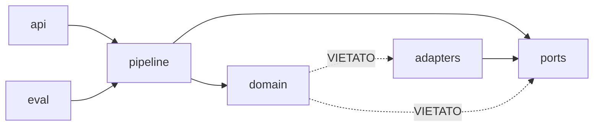
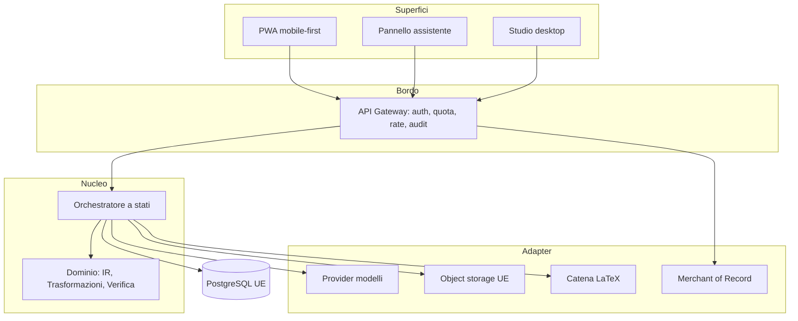
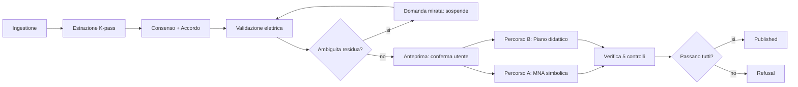
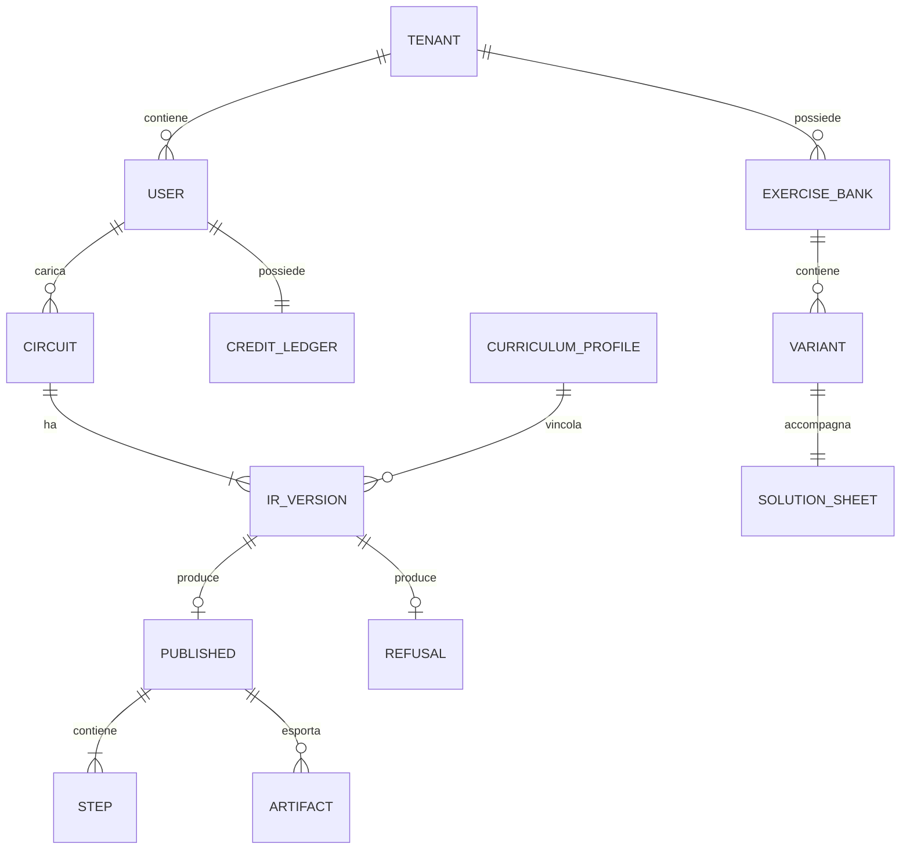

# Kirchhoff / MCP / Ardesia — corpus integrale delle fonti consegnate

**Data di consolidamento:** 14 agosto 2026  
**Scopo:** preservare integralmente, senza sintesi o correzioni silenziose, i file incollati/allegati usati come base per il ripensamento di Kirchhoff e per il rapporto con MCP Apps e Ardesia.

> Questo file è un **archivio**, non un documento di decisione. Contiene anche duplicati, contraddizioni, ipotesi superate, output intermedi BMAD e affermazioni di ricerca che in alcuni casi richiedono ri-verifica prima di essere usate come requisito di produzione. I documenti decisionali separati distinguono fatti, decisioni, assunzioni e open question.

## Regole di conservazione

- Ogni allegato è riportato integralmente.
- I duplicati esatti non sono eliminati.
- Per ogni file è indicato SHA-256, così è possibile riconoscere copie identiche.
- Il contenuto è racchiuso in un fence Markdown a cinque backtick per evitare che i code block interni rompano il corpus.
- Nessun typo, claim, URL o formulazione è stato corretto nel corpo delle fonti.

## Indice degli allegati e duplicati

- **Pasted markdown (10).md** — 1495 righe — SHA-256 `da789d7e218f14982f81e1fa5e3aa5595cc4fde49cf7737343616cb7bbe8d6bb` — duplicato esatto di: Pasted markdown (12).md, Pasted markdown (13).md, Pasted markdown (15).md, Pasted markdown (9).md
- **Pasted markdown (11).md** — 330 righe — SHA-256 `b7fcd195d25fa9efb6e67087a1618b8abde9305cbf07ad950939b1be0c09cdb7` — duplicato esatto di: Pasted markdown (16).md
- **Pasted markdown (12).md** — 1495 righe — SHA-256 `da789d7e218f14982f81e1fa5e3aa5595cc4fde49cf7737343616cb7bbe8d6bb` — duplicato esatto di: Pasted markdown (10).md, Pasted markdown (13).md, Pasted markdown (15).md, Pasted markdown (9).md
- **Pasted markdown (13).md** — 1495 righe — SHA-256 `da789d7e218f14982f81e1fa5e3aa5595cc4fde49cf7737343616cb7bbe8d6bb` — duplicato esatto di: Pasted markdown (10).md, Pasted markdown (12).md, Pasted markdown (15).md, Pasted markdown (9).md
- **Pasted markdown (14).md** — 252 righe — SHA-256 `c0f81ce9477d0c67667be977c5391518327a4f7778e1889d6d2ea98b77268366`
- **Pasted markdown (15).md** — 1495 righe — SHA-256 `da789d7e218f14982f81e1fa5e3aa5595cc4fde49cf7737343616cb7bbe8d6bb` — duplicato esatto di: Pasted markdown (10).md, Pasted markdown (12).md, Pasted markdown (13).md, Pasted markdown (9).md
- **Pasted markdown (16).md** — 330 righe — SHA-256 `b7fcd195d25fa9efb6e67087a1618b8abde9305cbf07ad950939b1be0c09cdb7` — duplicato esatto di: Pasted markdown (11).md
- **Pasted markdown (3).md** — 1091 righe — SHA-256 `a677008729e5a6b94bd90c615358cfb9434e03fd5988ed6a705374a25b6232d1`
- **Pasted markdown (4).md** — 445 righe — SHA-256 `e7d24a9c16d2c6586101dc4abe70f0ea80ab2cde976058b8e7f55d03b9fbe926`
- **Pasted markdown (5).md** — 1084 righe — SHA-256 `089a3c58933b499e6bf32413f8c3bb78f8f3833541d0e92de59803352c363058`
- **Pasted markdown (7).md** — 344 righe — SHA-256 `76da26b11aaa82c5c90b27d469d5654c578da1cc4bb7b9f18f2535df1b8e7fa1`
- **Pasted markdown (8).md** — 432 righe — SHA-256 `be8725a33863751c80781c11169de587800bc057d49b52941f614110b4fb5a43`
- **Pasted markdown (9).md** — 1495 righe — SHA-256 `da789d7e218f14982f81e1fa5e3aa5595cc4fde49cf7737343616cb7bbe8d6bb` — duplicato esatto di: Pasted markdown (10).md, Pasted markdown (12).md, Pasted markdown (13).md, Pasted markdown (15).md
- **Pasted text (2)(1).txt** — 1867 righe — SHA-256 `5d3ae8d744190b95eab77ea6240c10bc761b03ec2a868667a1e28a3f601ba1c9`
- **Pasted text (6).txt** — 1037 righe — SHA-256 `e4bdceb55f2dd7f0b3879faf33e8156ec9d5f6780b42eb6a5b2ad8c1cf3f51e8`
- **Pasted text(20260814-023504).txt** — 1299 righe — SHA-256 `b5e9dcae419fad477097d436c555f1a31770d3509ac52797ff6debb17e917ead`

## Registro URL estratto dalle fonti

Il seguente registro è meccanico: elenca URL presenti nei file senza certificarne da solo correttezza, attualità o licenza.

### Pasted text(20260814-023504).txt

- https://api.ardesia.app/mcp

**URL unici estratti:** 1.


---

# Fonti integrali


## Fonte: `Pasted markdown (10).md`

- SHA-256: `da789d7e218f14982f81e1fa5e3aa5595cc4fde49cf7737343616cb7bbe8d6bb`
- Dimensione: 66569 byte
- Righe: 1495

`````markdown
---
stepsCompleted: ['step-01-validate-prerequisites', 'step-02-design-epics', 'step-03-create-stories', 'step-04-final-validation']
inputDocuments:
  - prds/prd-Kirchhoff-2026-08-13/prd.md
  - architecture/architecture-Kirchhoff-2026-08-13/ARCHITECTURE-SPINE.md
  - ux-designs/ux-Kirchhoff-2026-08-13/DESIGN.md
  - ux-designs/ux-Kirchhoff-2026-08-13/EXPERIENCE.md
  - ../../docs/00-fonte-piano-kirchhoff.md
---

# Kirchhoff - Epic Breakdown

## Overview

Scomposizione completa in epiche e storie per Kirchhoff, derivata dal PRD (35 FR, 7 UJ, status
final), dallo spine di architettura (20 AD, lint pulito) e dal contratto UX (DESIGN.md +
EXPERIENCE.md, entrambi final).

**Gli ID sono quelli dei documenti a monte e non vengono rinumerati.** `FR-n` viene dal PRD,
`AD-n` dallo spine, `UJ-n` dal PRD, `KF-n` da EXPERIENCE.md. La tracciabilità vale più
dell'uniformità di formato.

**Nessun template starter è specificato dall'architettura.** Lo spine fissa il paradigma
(ports-and-adapters con nucleo a pipeline deterministica) e l'albero sorgente, ma non appoggia il
progetto su uno scaffold preconfezionato. Epic 1 Story 1.1 crea quindi la struttura a mano
secondo l'albero dello spine.

## Requirements Inventory

### Functional Requirements

| ID | Requisito |
|---|---|
| FR-1 | Ingestione multi-formato (immagine, LaTeX, netlist) |
| FR-2 | Estrazione multi-pass con misura dell'Accordo (K ≥ 3, ≥ 2 assi di variazione) |
| FR-3 | Ridondanza testuale come secondo canale |
| FR-4 | Validazione elettrica come gate, con diagnosi localizzata |
| FR-5 | Anteprima di ricostruzione, sempre, con conferma esplicita |
| FR-6 | Domanda mirata su Ambiguità residua, con ritaglio ingrandito |
| FR-7 | Tetto di due giri e degrado all'editor |
| FR-8 | Ripresa senza perdita e senza doppio addebito |
| FR-9 | Editor del circuito |
| FR-10 | Risoluzione a percorsi indipendenti (A e B) con confronto |
| FR-11 | Verifica a cinque controlli come gate di pubblicazione |
| FR-12 | Rifiuto di certificazione come esito progettato |
| FR-13 | Nessun valore numerico generato da modello linguistico |
| FR-14 | Piano didattico da Catalogo chiuso, eseguito e verificato |
| FR-15 | Disegno del circuito a ogni passo |
| FR-16 | Profilo curricolare che restringe le Trasformazioni ammesse |
| FR-17 | Modalità Studio a rivelazione progressiva |
| FR-18 | Export multiformato (PDF, LaTeX, SVG, e-learning) |
| FR-19 | Marcatura di provenienza su ogni artefatto |
| FR-20 | Superficie assistente con conferma in conversazione |
| FR-21 | Collegamento dell'account dalla superficie assistente |
| FR-22 | Generazione di Varianti verificate |
| FR-23 | Vincoli di generazione |
| FR-24 | Fogli soluzione separati e verificabili |
| FR-25 | Banco esercizi del tenant |
| FR-26 | Consumo di Crediti solo alla Soluzione consegnata |
| FR-27 | Acquisto di Crediti e piani |
| FR-28 | Registrazione con dichiarazione di età |
| FR-29 | Dichiarazione d'uso dell'IA al primo contatto |
| FR-30 | Cancellazione automatica delle immagini entro 72 ore |
| FR-31 | Offuscamento delle regioni personali |
| FR-32 | Consenso esplicito all'uso dei contenuti per il miglioramento |
| FR-33 | Esercizio dei diritti dell'interessato |
| FR-34 | Eval harness sul gold set |
| FR-35 | Segnalazione di errore dall'utente |

### NonFunctional Requirements

| ID | Requisito | Origine |
|---|---|---|
| NFR-1 | Latenza end-to-end < 45 s al 90° percentile, domande incluse | PRD §9 |
| NFR-2 | Anteprima entro 5 s per immagine fino a 5 MP | PRD §5.1 |
| NFR-3 | Determinismo: a parità di IR confermato, soluzione e passaggi riproducibili | PRD §9 |
| NFR-4 | Tracciabilità: ogni Soluzione ricostruibile da IR + versione del sistema | PRD §9 |
| NFR-5 | Indipendenza dal fornitore: ≥ 2 fornitori intercambiabili; la caduta di uno degrada la qualità, non la disponibilità | PRD §9 |
| NFR-6 | Accessibilità WCAG 2.2 AA su tutte e tre le superfici, pannello assistente incluso | PRD §9, EXPERIENCE.md |
| NFR-7 | Mobile-first: flusso B2C completabile a 360 px senza scorrimento orizzontale | PRD §9 |
| NFR-8 | Isolamento fra tenant a livello di database | PRD §9, AD-14 |
| NFR-9 | Osservabilità: SER, VSR, QPS, TTV, tasso di Rifiuto e correzioni strumentati in produzione | PRD §9 |
| NFR-10 | Non-regressione: nessuna modifica al nucleo raggiunge la produzione senza eval harness | PRD §9 |
| NFR-11 | Il gate di pubblicazione non ha bypass, nemmeno amministrativo o di test | PRD §10.1, AD-5 |
| NFR-12 | Precedenza fra metriche in conflitto: SER prevale su QPS, TTV e VSR, sempre | PRD §10.1 |
| NFR-13 | Costo di elaborazione per Soluzione consegnata sotto il 10% del prezzo effettivo | PRD §10.3 |
| NFR-14 | Residenza dei dati e degli artefatti nell'Unione Europea | PRD §12 |
| NFR-15 | Etichette nei disegni ≥ 11 px effettivi a 360 px di viewport | PRD §5.4, DESIGN.md |
| NFR-16 | Nessuna soluzione parziale mostrata come completa | PRD §10.1 |

### Additional Requirements

Dallo spine di architettura. Ognuno è un vincolo che le storie devono rispettare, non un'attività
a sé — le storie che li implementano sono indicate nella mappa di copertura.

- **AD-1** — L'IR è l'unico contratto fra stadi; firma `(IR, ctx) → IR | Refusal`; nessuno stadio
  a valle dell'estrazione legge l'immagine sorgente.
- **AD-2** — Le Trasformazioni sono funzioni pure `transform(IR, params) → (IR, Drawing)`; nessuna
  I/O, nessun orologio, nessuna casualità; catalogo chiuso caricato all'avvio.
- **AD-3** — I modelli si raggiungono solo attraverso `ModelPort`; nessun SDK di provider sotto
  `domain/`; almeno due adapter registrati.
- **AD-4** — Il generatore di testo produce segnaposto `[[q1.value]]`, mai cifre; un testo con
  cifra letterale è respinto prima della pubblicazione.
- **AD-5** — Gate di pubblicazione in un unico punto: solo `publish()` produce `Published`; nessun
  `Solution` è serializzabile verso l'esterno.
- **AD-6** — Server stateless per richiesta; lo stato multi-giro vive in `resume_ref` firmato
  HMAC, legato al `subject_id`, TTL 15 min, monouso.
- **AD-7** — Chiave di idempotenza da `(subject_id, circuit_id, request_hash)` con vincolo di
  unicità a schema.
- **AD-8** — Un solo modulo scrive ciascuna entità; `studio` chiama `publish()` ma non scrive mai
  un `Published`.
- **AD-9** — TTL immagini imposto dalla lifecycle policy dello storage, non da un job applicativo.
- **AD-10** — Un solo punto produce artefatti esportabili, e applica la Marcatura di provenienza.
- **AD-11** — Nessun tipo associa una misura di rendimento a un identificatore di persona.
- **AD-12** — La cascata di costo può cambiare quali modelli, mai quanti Pass; `K ≥ 3` imposto dal
  codice.
- **AD-13** — `Refusal` e `Failure` sono tipi diversi, su canali diversi.
- **AD-14** — Isolamento tenant via row-level security a livello DB.
- **AD-15** — L'eval harness gira sul codice di produzione attraverso gli stessi port; nessun ramo
  `if testing`.
- **AD-16** — La superficie assistente è un contratto pubblico versionato; ogni risposta con
  pannello porta anche il riassunto testuale strutturato.
- **AD-17** — Un solo orologio, iniettato via `ClockPort`.
- **AD-18** — `Drawing` è descrizione dichiarativa: niente markup, pixel, colori o font nel
  dominio.
- **AD-19** — `Refusal.cause` da enumerazione chiusa con payload tipizzato che porta sempre
  `subject`.
- **AD-20** — Identità come `subject_id` opaco, anonimo incluso; il collegamento account è una
  fusione esplicita di soggetti.

Requisiti infrastrutturali derivati:

- Bucket object storage in regione UE con lifecycle policy a 72 ore (AD-9, FR-30, NFR-14).
- PostgreSQL in regione UE con row-level security attiva (AD-14, NFR-8, NFR-14).
- Registrazione di almeno due adapter di modello prima del primo rilascio (AD-3, NFR-5).
- Catena LaTeX vincolata: niente `lmodern`, niente babel italiano, label CircuiTikZ con `=` in
  graffe.
- **Nessun template starter**: la struttura è creata a mano secondo l'albero sorgente dello spine.

### UX Design Requirements

| ID | Requisito |
|---|---|
| UX-DR1 | Sistema di token colore: 32 token, coppie chiaro/scuro complete, tutti esadecimali |
| UX-DR2 | Scala tipografica a 7 ruoli: `display`, `title`, `body`, `meta`, `quantity`, `residual`, `label-drawing` |
| UX-DR3 | Cifre tabulari (`font-variant-numeric: tabular-nums`) su ogni quantità, residuo ed etichetta di disegno |
| UX-DR4 | Componente `badge-verified`: pillola, spunta in cerchio pieno, etichetta "Verificata", apribile sul pannello dei residui |
| UX-DR5 | Componente `badge-suspended`: pillola, cerchio barrato, etichetta "Non certificata", **mai rosso, mai icona di allarme**, apribile sulla diagnosi |
| UX-DR6 | Componente `provenance-anchor`: riquadro 2 px sull'immagine sorgente, attivabile da entrambi i lati del confronto |
| UX-DR7 | Componente `quantity-chip` |
| UX-DR8 | Componente `residual-row`: cinque righe, ordine fisso e non riordinabile |
| UX-DR9 | Componente `step-card`: nome Trasformazione, formula letterale, sostituzione numerica, disegno — il disegno è obbligatorio |
| UX-DR10 | Componente `question-card`: ritaglio ingrandito in cima, alternative grandi, campo libero sempre in coda, contatore giri visibile |
| UX-DR11 | Componente `disclosure-bar`: persistente, non chiudibile, presente su tutte e tre le superfici |
| UX-DR12 | Verifica di accessibilità cromatica: ogni schermata resta interpretabile in scala di grigi; nessuno stato portato dal solo colore |
| UX-DR13 | `Refusal` e `Failure` distinti da colore **e** icona **e** parole, mai da uno solo dei tre |
| UX-DR14 | Alternativa testuale topologica per ogni disegno (non "schema del circuito", ma la struttura) |
| UX-DR15 | Percorso completo da tastiera su tutte le superfici, con focus visibile non portato dal solo colore |
| UX-DR16 | Bersagli di tocco ≥ 44 × 44 px, incluse le alternative nelle Domande mirate |
| UX-DR17 | Rispetto di `prefers-reduced-motion`: rimozione di ogni transizione non essenziale |
| UX-DR18 | Progresso a fasi con etichette reali degli stadi, non barra generica |
| UX-DR19 | Layout responsive: < 768 px colonna singola con controllo a due stati (mai accordion); ≥ 768 px Anteprima a due colonne |
| UX-DR20 | Modalità scura pari grado alla chiara, non tema secondario |
| UX-DR21 | Foglio di stile di stampa con Marcatura di provenienza non rimovibile via CSS |
| UX-DR22 | Superficie "Non certificata" con indirizzo proprio, condivisibile, che sopravvive al ricaricamento |
| UX-DR23 | Vocabolario UI vincolato ai termini del Glossario del PRD; nessun sinonimo |
| UX-DR24 | Microcopy secondo le 7 regole di `EXPERIENCE.md` e lista di parole vietate |
| UX-DR25 | Stati vuoti con un esempio reale caricabile con un tocco, non un'illustrazione |
| UX-DR26 | Rendering delle formule come matematica accessibile, non come immagini |

### FR Coverage Map

| FR | Epic | Come vi atterra |
|---|---|---|
| FR-1 | Epic 2 (netlist/LaTeX) + Epic 3 (immagine) | L'ingestione strutturata arriva col motore; quella da foto con la ricostruzione |
| FR-2 | Epic 3 | Estrazione multi-pass e misura dell'Accordo |
| FR-3 | Epic 3 | Ridondanza testuale come secondo canale |
| FR-4 | Epic 2 | Validazione elettrica come gate, puro codice |
| FR-5 | Epic 3 | Anteprima di ricostruzione, sempre |
| FR-6 | Epic 3 | Domanda mirata su Ambiguità residua |
| FR-7 | Epic 3 | Tetto di due giri e degrado all'editor |
| FR-8 | Epic 3 | Ripresa senza perdita né doppio addebito |
| FR-9 | Epic 3 | Editor del circuito |
| FR-10 | Epic 2 | Percorsi A e B con confronto obbligatorio |
| FR-11 | Epic 2 | Verifica a cinque controlli, gate di pubblicazione |
| FR-12 | Epic 2 | Rifiuto di certificazione come esito di dominio |
| FR-13 | Epic 2 | Nessun numero da modello linguistico |
| FR-14 | Epic 2 | Piano didattico da Catalogo chiuso |
| FR-15 | Epic 4 | Disegno del circuito a ogni passo |
| FR-16 | Epic 2 | Profilo curricolare che restringe il Catalogo |
| FR-17 | Epic 4 | Modalità Studio a rivelazione progressiva |
| FR-18 | Epic 4 | Export multiformato |
| FR-19 | Epic 4 | Marcatura di provenienza |
| FR-20 | Epic 7 | Superficie assistente con pannello di conferma |
| FR-21 | Epic 7 | Collegamento dell'account |
| FR-22 | Epic 6 | Generazione di Varianti verificate |
| FR-23 | Epic 6 | Vincoli di generazione |
| FR-24 | Epic 6 | Fogli soluzione con checksum |
| FR-25 | Epic 6 | Banco esercizi del tenant |
| FR-26 | Epic 5 | Consumo alla Soluzione consegnata |
| FR-27 | Epic 5 | Acquisto di Crediti e piani |
| FR-28 | Epic 5 | Dichiarazione di età al signup |
| FR-29 | Epic 5 | Dichiarazione d'uso dell'IA |
| FR-30 | Epic 5 | Cancellazione automatica delle immagini |
| FR-31 | Epic 5 | Offuscamento delle regioni personali |
| FR-32 | Epic 5 | Consenso al miglioramento, OFF di default |
| FR-33 | Epic 5 | Diritti dell'interessato |
| FR-34 | Epic 1 (harness + insieme strutturato) + Epic 2 (metriche del pipeline) | La struttura di misura precede il pipeline che misura. **Copertura parziale: esclude l'estrazione** |
| FR-35 | Epic 5 | Segnalazione di errore dall'utente |
| FR-36 | Epic 5 | Quota per soggetto anonimo — prerequisito di 7.2 in produzione |

Copertura: **35/35 FR mappati**, nessun buco.

## Epic List

Sette epiche. Architettura e UX sono già validate, quindi le epiche sono poche e larghe: si divide
solo dove esiste un vero confine di rischio o dove un riscontro precoce può cambiare direzione a
ciò che segue.

Il confine di rischio dominante è **Epic 1**: se la baseline dei modelli frontier è troppo alta, il
piano cambia e le epiche 3, 4, 5 e 7 vengono riscritte. Per questo Epic 1 è piccola, prima, e
autonoma.

### Epic 1: La struttura di misura

Il progetto ottiene l'apparato che misura la qualità del motore per il resto della sua vita: un
insieme di riferimento di circuiti a risposta nota, e un comando che produce VSR, SER, QPS e TTV
più la ripartizione degli errori per tipo. Nessuna riga di prodotto dipende da questa epica, ma
ogni affermazione sulla qualità sì.

**FRs covered:** FR-34 (struttura di misura, copertura piena con 1.3)
**Vincoli portanti:** AD-15, NFR-9, NFR-10
**Autonomia:** completa. Non dipende da nessuna epica e non richiede che il prodotto esista.

> **Limite di copertura, dichiarato.** L'insieme di riferimento è **strutturato**, non fotografico:
> misura la catena a valle dell'IR — solver, Trasformazioni, Verifica — e **non** l'estrazione.
> SER resta la metrica bloccante ma è cieca sul tratto dove l'errore silenzioso nasce quasi tutto.
> Conseguenza accettata con la decisione del 13 agosto 2026 (vedi `sprint-change-proposal-2026-08-13.md`).

### Epic 2: Motore verificato da riga di comando

Dato un circuito in forma strutturata, il sistema lo valida, lo risolve per due percorsi
indipendenti, sottopone il risultato ai cinque controlli, e o consegna una soluzione certificata o
rifiuta di certificarla dicendo dove si rompe. È il nucleo che nessun concorrente può copiare, ed è
utilizzabile — da riga di comando — prima che esista qualunque interfaccia.

**FRs covered:** FR-1 (netlist/LaTeX), FR-4, FR-10, FR-11, FR-12, FR-13, FR-14, FR-16, FR-34
(metriche sul pipeline)
**Vincoli portanti:** AD-1, AD-2, AD-4, AD-5, AD-8, AD-13, AD-17, AD-18, AD-19; NFR-3, NFR-11,
NFR-12, NFR-16
**Autonomia:** completa. Usa la struttura di misura di Epic 1 ma funziona senza.

### Epic 3: Dalla foto al circuito confermato

Uno studente fotografa un esercizio e ottiene una ricostruzione che può verificare con un tocco. Il
sistema legge più volte in modo indipendente, misura quanto le letture divergono, chiede solo ciò
che resta davvero ambiguo, e non calcola mai prima che l'utente abbia confermato.

**FRs covered:** FR-1 (immagine), FR-2, FR-3, FR-5, FR-6, FR-7, FR-8, FR-9
**Vincoli portanti:** AD-3, AD-6, AD-12, AD-20; NFR-1, NFR-2, NFR-5
**Autonomia:** completa sul proprio dominio. Costruisce sul motore di Epic 2.

### Epic 4: La soluzione che si può mostrare e portare via

La soluzione diventa un documento: passi con il circuito ridisegnato a ogni riduzione, modalità di
studio a rivelazione progressiva, ed export in PDF, LaTeX e SVG con la marcatura di provenienza che
li rende riconoscibili.

**FRs covered:** FR-15, FR-17, FR-18, FR-19
**Vincoli portanti:** AD-10, AD-18, AD-4; NFR-6, NFR-7, NFR-15
**Autonomia:** completa. Costruisce su Epic 2 (e su Epic 3 quando l'ingresso è una foto).

### Epic 5: Account, Crediti e conformità in prodotto

Un utente si registra, compra Crediti, e paga solo per ciò che ha ottenuto davvero. Gli obblighi di
trasparenza e i controlli sui dati sono funzionalità implementate e testate, non una pagina legale.

**FRs covered:** FR-26, FR-27, FR-28, FR-29, FR-30, FR-31, FR-32, FR-33, FR-35
**Vincoli portanti:** AD-7, AD-9, AD-11, AD-20; NFR-13, NFR-14
**Autonomia:** completa. Richiede da Epic 2 il concetto di Soluzione consegnata.

### Epic 6: Studio — varianti verificate per chi insegna

Un tutor prende un esercizio e ne ottiene N varianti con valori diversi, ognuna con soluzione
completa verificata e foglio soluzione separato. Le varianti scartate perché non verificate sono
mostrate, non nascoste.

**FRs covered:** FR-22, FR-23, FR-24, FR-25
**Vincoli portanti:** AD-5, AD-8, AD-14; NFR-8
**Autonomia:** completa. Riusa `publish()` di Epic 2 e il rendering di Epic 4.

### Epic 7: Kirchhoff dentro l'assistente

Lo studente risolve senza uscire dalla conversazione che ha già aperto: pannello di conferma reso
in conversazione, e l'assistente che sa cosa l'utente ha confermato perché riceve anche il
riassunto testuale.

**FRs covered:** FR-20, FR-21
**Vincoli portanti:** AD-6, AD-16, AD-20, AD-5
**Autonomia:** completa. Espone su una superficie nuova ciò che Epic 3 e 4 già fanno.

---

**Verifica di sovrapposizione sui file.** Le sette epiche toccano zone distinte dell'albero
sorgente: Epic 1 e 2 → `eval/` e `domain/`; Epic 3 → `pipeline/` e `adapters/model`; Epic 4 →
`render/`; Epic 5 → `api/` e `billing`; Epic 6 → `studio`; Epic 7 → `api/assistant`. La condivisione
è incidentale (tutte leggono l'IR), non "stesso componente end-to-end": nessun consolidamento
necessario.

**Dipendenze naturali.** 1 → nessuna · 2 → nessuna (usa 1 per misurarsi) · 3 → 2 · 4 → 2 · 5 → 2 ·
6 → 2, 4 · 7 → 3, 4. Nessuna epica richiede un'epica *successiva* per funzionare.

---

## Ordine di esecuzione — MCP-first (14 agosto 2026)

**I numeri delle epiche non cambiano** — PRD e spine li referenziano e rinumerarli romperebbe ogni
riferimento. Cambia **l'ordine in cui si costruiscono**.

**Perché.** La monetizzazione dentro gli assistenti è chiusa ai servizi digitali: su ChatGPT
l'approvazione è limitata ai beni fisici, su Claude non esiste rail di pagamento. Ma il piano Free
di Claude dà **un** connettore, e la directory è self-serve. Per un fondatore senza pubblico, che
non può permettersi advertising e ha sei mesi di rampa SEO davanti, **la superficie assistente è il
miglior canale di acquisizione disponibile** — e non serve a niente se arriva ultima.

```
1  struttura di misura
2  motore verificato
3  dalla foto al circuito confermato
4  soluzione mostrabile
   ├─ 7.1  contratto della superficie assistente     ← anticipate
   └─ 7.2  pannello di conferma in conversazione     ← anticipate
5  account, crediti, conformità   (5.1 identità · 5.8 quota anonima obbligatorie qui)
   └─ 7.3  collegamento account                      ← dipende da 5.1
6  Studio
```

**Vincoli di precedenza, non opinioni.**

| Storia | Non prima di | Perché |
|---|---|---|
| 7.1, 7.2 | Epic 4 completa | Il pannello mostra Anteprima e Soluzione renderizzata: senza, non c'è cosa mostrare |
| 5.8 | 5.1 | La quota si conta su `subject_id`, che 5.1 introduce |
| 7.2 in produzione | 5.8 | Una superficie pubblica senza quota è compute gratuito per sconosciuti |
| 7.3 | 5.1 | Il collegamento è una fusione di soggetti |

**Effetto collaterale che vale l'anticipo.** Il connettore singolo del piano Free lo installa anche
il **tutor**, che è il cliente Studio da 390 €/anno. La directory non è solo acquisizione B2C: è
generazione di lead B2B a costo marginale zero.

**La metrica che governa la scelta è SM-11** — conversione da soluzione in conversazione ad account
collegato. Se resta bassa, la superficie assistente è una perdita e va ridimensionata: porta uso e
non porta clienti.

---

## Epic 1: La struttura di misura

Il progetto ottiene l'apparato che misura la qualità del motore per il resto della sua vita.

### Story 1.1: Insieme di riferimento strutturato a risposta nota

As a fondatore,
I want un insieme di circuiti in forma strutturata con risultato corretto noto, generabile invece
che raccolto,
So that esista un oracolo contro cui misurare il motore senza dipendere da una campagna di
raccolta.

**Acceptance Criteria:**

**Given** un generatore parametrico di circuiti
**When** l'insieme di riferimento è prodotto
**Then** copre le quattro classi di dominio in scope — reti resistive in DC, transitori RL/RC/RLC,
regime sinusoidale, trifase
**And** ogni elemento porta IR, risultato numerico corretto e sequenza di Trasformazioni di
riferimento (FR-34).

> **Chiusa il 13 agosto 2026.** Tutte e quattro le classi di dominio implementate e verificate.
> La metà **fotografica** è stata spostata nella Story 1.3, che è dove vive adesso: qui restava
> come criterio orfano e contraddiceva `sprint-change-proposal-2026-08-13.md`.

**Given** l'insieme prodotto
**When** viene diviso
**Then** esiste uno split fra parte di sviluppo e parte trattenuta
**And** la parte trattenuta è in uno store separato che il flusso di sviluppo non può leggere.

**Given** un circuito la cui soluzione corretta è ricavata dal generatore stesso
**When** viene inserito nell'insieme
**Then** il risultato è verificato in modo indipendente dal generatore che l'ha prodotto — un
oracolo che si autocertifica non è un oracolo.

### Story 1.2: Script di valutazione con metriche e matrice degli errori

As a fondatore,
I want un comando che, dato l'insieme di riferimento, produca VSR, SER, QPS e TTV più la
ripartizione degli errori per tipo,
So that ogni discussione sulla qualità si faccia sui numeri e sia riproducibile.

**Acceptance Criteria:**

**Given** l'insieme di riferimento e il gold corrispondente
**When** lo script viene eseguito
**Then** produce le quattro metriche e una ripartizione degli errori per tipo (topologia, valore,
unità, grandezza richiesta, irrisolvibile)
**And** l'esecuzione è riproducibile: stessi input, stesse metriche.

**Given** una configurazione che punta alla parte trattenuta
**When** lo script viene eseguito in modalità di sviluppo
**Then** l'esecuzione fallisce con un messaggio esplicito
**And** nessuna metrica viene prodotta.

**Given** un rapporto prodotto dallo script
**When** viene letto
**Then** dichiara esplicitamente che la copertura esclude l'estrazione da immagine, così che
nessuna lettura successiva scambi SER parziale per SER complessivo.

---

### Story 1.3: Metà fotografica dell'insieme di riferimento

As a fondatore,
I want un sottoinsieme di fotografie reali di circuiti disegnati a mano, annotate con IR e
risultato,
So that SER smetta di essere cieca sull'estrazione — il tratto dove nasce quasi tutto l'errore
silenzioso.

**Acceptance Criteria:**

**Given** i due dataset a licenza aperta verificati in `docs/01-fonti-esterne.md` — CGHD
(`cc-by-4.0`, 3.173 immagini, 32 disegnatori) e Digitize-HCD (`CC BY 4.0`, 1.277 immagini, oltre
150 volontari, con **posizioni dei terminali**)
**When** si costruisce la metà fotografica
**Then** almeno 30 immagini portano IR e risultato numerico annotati a mano
**And** la stratificazione dichiarata è rispettata: le immagini vengono da almeno 10 disegnatori
diversi, così che il campione non misuri la calligrafia di una persona sola
**And** nessuna immagine proviene da una fonte con licenza non commerciale — Image2Net
(`CC BY-NC-ND`) e Fiore (`CC BY-NC-SA`) restano esclusi.

**Given** un artefatto che usa o cita i dataset
**When** viene prodotto
**Then** porta l'attribuzione richiesta dalla licenza CC-BY, testualmente come indicato in
`docs/01-fonti-esterne.md`
**And** l'assenza dell'attribuzione fa fallire un controllo automatico, perché è un obbligo di
licenza e non una cortesia.

**Given** la metà fotografica presente nell'insieme di riferimento
**When** `kirchhoff-eval report` viene eseguito
**Then** il campo `coverage` smette di dichiarare `PARZIALE` per l'estrazione
**And** il rapporto riporta VSR e SER separatamente per la metà strutturata e per quella
fotografica, perché mediarle nasconderebbe esattamente il numero che interessa.

**Given** la metrica di distanza fra grafi definita in Image2Net — NED, distanza di edit fra il
grafo ricostruito e quello vero, normalizzata su dispositivi, net e porte
**When** si misura la qualità dell'estrazione
**Then** il rapporto riporta anche NED accanto a SER
**And** la formula è reimplementata da noi: si adotta una definizione pubblicata, non si copia un
dataset con licenza incompatibile.

> **Riferimento pubblicato contro cui misurarsi:** Image2Net dichiara 80,77% di successo e 0,116
> di NED medio. Non è un obiettivo di v1, è il metro esistente.

---

## Epic 2: Motore verificato da riga di comando

Dato un circuito in forma strutturata, il sistema lo valida, lo risolve per due percorsi
indipendenti, e o consegna una soluzione certificata o rifiuta di certificarla dicendo dove si
rompe.

### Story 2.1: Struttura del progetto con confini di dipendenza verificati

As a sviluppatore,
I want una struttura di progetto in cui la regola di dipendenza dello spine è verificata
automaticamente,
So that la separazione fra dominio e adapter non dipenda dalla disciplina di chi scrive.

**Acceptance Criteria:**

**Given** l'albero sorgente dello spine (`domain/`, `ports/`, `adapters/`, `pipeline/`, `api/`,
`render/`, `eval/`)
**When** il progetto viene creato
**Then** ogni directory esiste con il proprio pacchetto inizializzato
**And** la configurazione valida all'avvio con schema, e una configurazione non valida impedisce
l'avvio invece di degradare in silenzio (AD-17, convenzioni).

**Given** un modulo sotto `domain/` che importa qualcosa da `adapters/` o da `ports/`
**When** il controllo dei confini gira in integrazione continua
**Then** il controllo fallisce nominando file e import
**And** il fallimento blocca la fusione (AD-1, paradigma).

### Story 2.2: Schema IR e canonicalizzazione

As a sviluppatore,
I want un IR versionato con provenienza e forma simbolica accanto a ogni valore,
So that ogni stadio a valle abbia un contratto unico e una soluzione sia riproducibile dal solo IR.

**Acceptance Criteria:**

**Given** un IR costruito da qualunque sorgente
**When** viene validato contro lo schema
**Then** porta `ir_version` semantica, e ogni componente ha valore con magnitudine **e** unità **e**
forma simbolica
**And** ogni componente porta la propria area di provenienza quando la sorgente è un'immagine
**And** un valore numerico senza unità è respinto dallo schema (convenzione sulle grandezze fisiche).

**Given** due IR che descrivono lo stesso circuito con ordine di nodi e componenti diverso
**When** vengono canonicalizzati
**Then** producono la stessa forma canonica
**And** il confronto fra i due risulta identico.

### Story 2.3: Ingestione da netlist e da LaTeX

As a sviluppatore,
I want fornire un circuito in forma strutturata e ottenere un IR valido,
So that il motore sia esercitabile e misurabile prima che esista qualunque lettura da immagine.

**Acceptance Criteria:**

**Given** una netlist ben formata
**When** viene ingerita
**Then** produce un IR che supera la validazione dello schema
**And** le grandezze richieste dichiarate nella sorgente compaiono in `requests`.

**Given** una sorgente LaTeX che descrive più di un esercizio
**When** viene ingerita
**Then** il sistema restituisce l'elenco degli esercizi trovati e richiede una selezione
**And** non ne sceglie uno d'ufficio e non li fonde (FR-1).

### Story 2.4: Validazione elettrica con diagnosi localizzata

As a sviluppatore,
I want che ogni IR passi da una batteria di controlli deterministici che, fallendo, nominano
l'elemento coinvolto,
So that un fallimento sia un'informazione utilizzabile e non un rifiuto generico.

**Acceptance Criteria:**

**Given** un IR con un grafo non connesso, un nodo di grado 1, un loop di soli generatori di
tensione, un taglio di soli generatori di corrente, un'unità incompatibile col tipo, o un valore
richiesto inesistente
**When** la validazione gira
**Then** produce un `Refusal` con causa dall'enumerazione chiusa e payload che porta `subject` —
il nodo, il ramo o il componente coinvolto (FR-4, AD-19)
**And** nessun IR raggiunge lo stato confermato.

**Given** un valore resistivo fuori dalle serie E12/E24 in un esercizio manoscritto
**When** la validazione gira
**Then** l'elemento è segnalato come sospetto senza bloccare
**And** il sospetto è disponibile a valle come possibile Ambiguità residua.

**Given** un IR valido
**When** la validazione gira
**Then** l'IR è promosso e nessun falso positivo è emesso sul gold set di sviluppo.

### Story 2.5: Percorso A — analisi nodale modificata simbolica

As a sviluppatore,
I want risolvere qualunque IR valido per analisi nodale modificata in forma simbolica,
So that esista un oracolo generale e robusto contro cui misurare ogni altro metodo.

**Acceptance Criteria:**

**Given** un IR valido in regime continuo, sinusoidale, transitorio o trifase
**When** il Percorso A gira
**Then** produce un valore per **ogni** grandezza richiesta, non solo per la prima (FR-10)
**And** la risoluzione avviene prima in forma simbolica e poi per sostituzione dei valori.

**Given** lo stesso IR risolto due volte
**When** i risultati vengono confrontati
**Then** coincidono esattamente (NFR-3).

### Story 2.6: Catalogo delle Trasformazioni e Percorso B

As a sviluppatore,
I want un catalogo chiuso di Trasformazioni pure che producono un nuovo IR e una descrizione di
disegno,
So that esista un secondo percorso risolutivo indipendente, e i passaggi siano quelli che uno
studente scriverebbe a mano.

**Acceptance Criteria:**

**Given** una Trasformazione del catalogo applicata a un IR
**When** viene eseguita
**Then** restituisce `(IR, Drawing)` senza alcuna I/O, senza lettura dell'orologio e senza
casualità (AD-2)
**And** `Drawing` è dichiarativo: nessun markup, nessun pixel, nessun colore, nessun font (AD-18)
**And** l'IR risultante supera la validazione elettrica.

**Given** una richiesta di applicare una Trasformazione non presente nel catalogo
**When** l'esecuzione viene tentata
**Then** fallisce prima di eseguire qualunque calcolo
**And** il catalogo non è estendibile a runtime.

**Given** un IR e una sequenza di Trasformazioni che arriva alla grandezza richiesta
**When** il Percorso B gira
**Then** il risultato coincide con quello del Percorso A entro tolleranza relativa 1e-9 simbolica
e 1e-6 numerica (FR-10)
**And** nessun valore mostrato all'utente proviene da un modello linguistico: il testo dei passi
porta segnaposto risolti dal renderer (FR-13, AD-4).

### Story 2.7: Verifica a cinque controlli

As a sviluppatore,
I want sottoporre ogni soluzione a cinque controlli indipendenti con residui numerici,
So that la promessa del prodotto sia dimostrabile e non asserita.

**Acceptance Criteria:**

**Given** una soluzione calcolata
**When** la Verifica gira
**Then** produce cinque residui — KCL per nodo, KVL per maglia indipendente, bilancio di potenza,
accordo fra percorsi, sanità fisica — calcolati **sostituendo** la soluzione ottenuta e non
ri-derivandola (FR-11)
**And** ogni residuo è ispezionabile con il proprio valore numerico.

**Given** una soluzione con un errore di segno che soddisfa KCL e KVL
**When** la Verifica gira
**Then** il bilancio di potenza lo rileva e la Verifica fallisce.

**Given** una rete puramente passiva
**When** la sanità fisica gira
**Then** rileva ogni elemento passivo con potenza negativa e ogni tensione di nodo fuori
dall'inviluppo dei generatori.

### Story 2.8: Gate di pubblicazione unico e Rifiuto tipizzato

As a sviluppatore,
I want che una soluzione possa uscire dal sistema solo attraverso un unico punto che esegue la
Verifica,
So that nessuna superficie possa mostrare un risultato non certificato, ora o in futuro.

**Acceptance Criteria:**

**Given** una soluzione che supera tutti e cinque i controlli
**When** `publish()` viene chiamata
**Then** restituisce un `Published` con i residui allegati, e il Badge Verificata è applicato se e
solo se tutti e cinque i controlli sono passati (FR-11)
**And** `Published` è l'unico tipo serializzabile verso l'esterno (AD-5).

**Given** una soluzione che fallisce almeno un controllo
**When** `publish()` viene chiamata
**Then** restituisce un `Refusal` con causa dall'enumerazione chiusa e `subject` popolato
**And** nessun valore di risultato è incluso nella risposta
**And** `Refusal` non condivide gerarchia di tipi né canale con `Failure` (AD-13, AD-19).

**Given** un tentativo di serializzare un `Solution` non pubblicato da qualunque modulo
**When** il codice viene compilato o il test di contratto gira
**Then** fallisce
**And** non esiste alcun flag che disattivi il gate, nemmeno in configurazione di test (NFR-11).

### Story 2.9: Profilo curricolare che restringe il Catalogo

As a docente o tutor,
I want che il sistema usi solo i metodi che il mio corso ha già svolto e le mie convenzioni di
segno,
So that la soluzione sia utilizzabile dai miei studenti invece di introdurre strumenti che non
conoscono.

**Acceptance Criteria:**

**Given** un Profilo curricolare che esclude Thévenin
**When** viene prodotto un Piano didattico sotto quel Profilo
**Then** nessun passo usa Thévenin (FR-16)
**And** se nessun piano è raggiungibile con le Trasformazioni ammesse, il sistema lo dichiara
invece di violare il Profilo.

**Given** un Profilo con convenzione di segno dichiarata
**When** la soluzione viene prodotta
**Then** la convenzione è applicata coerentemente a risultato, disegni e testo.

**Given** nessun Profilo associato
**When** la soluzione viene prodotta
**Then** viene usato un profilo predefinito dichiarato ed esplicito, non un comportamento implicito.

### Story 2.10: Piano didattico proposto, eseguito e verificato

As a studente,
I want che i passaggi seguano una sequenza sensata e non una derivazione meccanica,
So that il procedimento sia quello che il professore si aspetta di vedere sul foglio.

**Acceptance Criteria:**

**Given** un IR validato e un Profilo curricolare
**When** il pianificatore propone una sequenza
**Then** ogni elemento appartiene al Catalogo, e il sistema la esegue deterministicamente (FR-14)
**And** il risultato ottenuto coincide con il Percorso A entro tolleranza, altrimenti la soluzione
non è pubblicabile.

**Given** una sequenza proposta che non converge o non è applicabile
**When** l'esecuzione la incontra
**Then** il sistema ripiega sul piano canonico nodale senza intervento manuale
**And** l'evento è registrato per l'analisi di qualità.

### Story 2.11: Metriche del pipeline nell'harness

As a fondatore,
I want che l'harness misuri il nostro pipeline attraverso lo stesso percorso che attraversano gli
utenti,
So that VSR e SER non descrivano un codice che nessuno esegue.

**Acceptance Criteria:**

**Given** l'harness di Epic 1 e il pipeline di questa epica
**When** l'eval gira
**Then** invoca la stessa pipeline degli utenti sostituendo solo gli adapter, e produce VSR, SER,
QPS e TTV più la ripartizione degli errori per tipo (FR-34, AD-15)
**And** non esiste alcun ramo condizionale di test nel percorso di dominio.

**Given** una modifica a estrazione, validazione, Trasformazioni o Piano didattico
**When** l'integrazione continua gira
**Then** l'eval viene eseguito e il risultato è confrontato con la soglia corrente
**And** una regressione di SER blocca la fusione (NFR-10).

---

## Epic 3: Dalla foto al circuito confermato

Uno studente fotografa un esercizio e ottiene una ricostruzione che può verificare con un tocco.

### Story 3.1: Ingestione dell'immagine e selezione dell'esercizio

As a studente,
I want caricare la foto del mio esercizio anche se storta e in penombra,
So that non debba rifarla o ritagliarla prima di ottenere una risposta.

**Acceptance Criteria:**

**Given** una foto JPEG, PNG, HEIC o un PDF a pagina singola fino a 20 MB
**When** viene caricata
**Then** è accettata e normalizzata — correzione prospettica, raddrizzamento, normalizzazione del
contrasto, ingrandimento delle regioni ad alta densità di testo
**And** vengono prodotte tre versioni deliberatamente diverse per l'estrazione a valle.

**Given** una foto che contiene due esercizi
**When** viene caricata
**Then** il sistema mostra i candidati e chiede quale
**And** non ne sceglie uno d'ufficio e non li fonde (FR-1).

**Given** un file che non è interpretabile come esercizio
**When** viene caricato
**Then** il messaggio dice cosa manca, non "errore generico" (voce e tono).

### Story 3.2: ModelPort e due adapter di fornitore

As a sviluppatore,
I want raggiungere i modelli solo attraverso un'interfaccia astratta con almeno due
implementazioni,
So that la caduta o il rincaro di un fornitore degradi la qualità e non la disponibilità.

**Acceptance Criteria:**

**Given** l'interfaccia `ModelPort` con `extract`, `plan`, `narrate`
**When** il progetto viene compilato
**Then** almeno due adapter di fornitore sono registrati e selezionabili da configurazione
**And** nessun modulo sotto `domain/` importa un SDK di fornitore (AD-3).

**Given** un fornitore che restituisce un JSON non conforme allo schema d'uscita
**When** la risposta viene ricevuta
**Then** viene rifiutata e ritentata con vincolo esplicito
**And** dopo i tentativi previsti l'esito è un `Failure`, non un IR parziale.

**Given** un fornitore non raggiungibile
**When** l'estrazione gira
**Then** il sistema usa i restanti adapter registrati e prosegue
**And** l'evento di degrado è strumentato (NFR-5).

### Story 3.3: Estrazione multi-pass e misura dell'Accordo

As a studente,
I want che il sistema legga il mio circuito più volte e sappia dove le letture divergono,
So that mi venga chiesto solo ciò di cui è davvero incerto.

**Acceptance Criteria:**

**Given** le tre versioni dell'immagine
**When** l'estrazione gira
**Then** esegue almeno tre Pass che differiscono per almeno due assi fra modello, preprocessing e
inquadratura del prompt
**And** produce un Accordo per componente e complessivo, calcolato confrontando gli IR
canonicalizzati e **mai** leggendo un campo di confidence emesso da un modello (FR-2, AD-12).

**Given** una configurazione che imposta K minore di 3
**When** il sistema si avvia
**Then** l'avvio fallisce con messaggio esplicito (AD-12).

**Given** un valore illeggibile nell'immagine
**When** l'estrazione lo incontra
**Then** lo emette come assente con le alternative osservate
**And** non emette un valore plausibile inventato — verificato da un caso del gold set con un
valore deliberatamente cancellato.

**Given** due fili che si incrociano senza punto di giunzione
**When** l'estrazione li legge
**Then** non li collega.

### Story 3.4: Ridondanza testuale come secondo canale

As a studente,
I want che il sistema usi i valori scritti nel testo dell'esercizio per confermare quelli letti nel
disegno,
So that non mi chieda cose che erano già scritte nero su bianco.

**Acceptance Criteria:**

**Given** un esercizio in cui i valori compaiono sia nel disegno sia nel testo
**When** l'estrazione gira
**Then** i valori testuali sono conservati in un campo distinto e non fusi con le letture dal
disegno (FR-3)
**And** una lettura con Accordo basso confermata dal testo non genera Domanda mirata.

**Given** un disaccordo fra testo e disegno
**When** viene rilevato
**Then** genera sempre una Domanda mirata, qualunque sia l'Accordo.

### Story 3.5: Fondamenta del sistema di design

As a sviluppatore frontend,
I want token, scala tipografica e componenti di base implementati secondo il contratto UX,
So that ogni schermata successiva erediti coerenza e accessibilità invece di ricostruirle.

**Acceptance Criteria:**

**Given** il frontmatter di `DESIGN.md`
**When** il sistema di design è implementato
**Then** i 32 token colore esistono con le coppie chiaro/scuro complete, e i 7 ruoli tipografici
sono definiti (UX-DR1, UX-DR2)
**And** ogni quantità, residuo ed etichetta di disegno è resa con cifre tabulari (UX-DR3)
**And** la modalità scura è pari grado alla chiara, non un tema secondario (UX-DR20).

**Given** qualunque schermata costruita sulle fondamenta
**When** viene resa in scala di grigi
**Then** resta interpretabile: nessuno stato è portato dal solo colore (UX-DR12).

**Given** il vocabolario del Glossario del PRD
**When** l'interfaccia mostra un termine di dominio
**Then** usa esattamente quel termine, senza sinonimi (UX-DR23)
**And** i testi rispettano le sette regole di microcopy e non contengono parole della lista vietata
(UX-DR24).

**Given** una superficie con contenuto assente
**When** viene mostrata
**Then** offre un esempio reale caricabile con un tocco, non un'illustrazione (UX-DR25).

**Given** navigazione da tastiera su qualunque superficie
**When** il focus si sposta
**Then** è sempre visibile e non è portato dal solo colore (UX-DR15)
**And** ogni bersaglio di tocco misura almeno 44 × 44 px (UX-DR16)
**And** con `prefers-reduced-motion` attivo ogni transizione non essenziale è rimossa (UX-DR17).

### Story 3.6: Anteprima di ricostruzione con ancoraggio di provenienza

As a studente,
I want vedere il circuito che il sistema ha letto accanto alla mia foto, con ogni componente legato
al punto da cui viene,
So that possa accorgermi di un errore prima che il sistema calcoli qualcosa.

**Acceptance Criteria:**

**Given** un IR ricostruito, con o senza Ambiguità residua
**When** l'elaborazione arriva a questo punto
**Then** l'Anteprima è mostrata **sempre** e la conferma esplicita è richiesta
**And** nessuna soluzione è calcolata prima della conferma (FR-5).

**Given** l'Anteprima mostrata
**When** l'utente tocca un componente nella ricostruzione o una regione nella foto
**Then** l'ancoraggio si accende nell'altra vista, in entrambe le direzioni (UX-DR6).

**Given** nessuna correzione da fare
**When** l'utente conferma
**Then** la conferma è una singola azione.

**Given** un viewport di 360 px
**When** l'Anteprima è mostrata
**Then** usa una colonna singola con controllo a due stati, mai un accordion; a 768 px o più
passa a due colonne affiancate (UX-DR19).

**Given** l'elaborazione in corso
**When** l'utente attende
**Then** il progresso mostra le etichette reali degli stadi, non una barra generica (UX-DR18).

### Story 3.7: Domanda mirata, tetto di due giri e ripresa

As a studente,
I want che il sistema mi chieda solo ciò di cui è incerto, mostrandomi il pezzo di foto in
questione, e riprenda da dove era,
So that la correzione costi un tocco e non una ripartenza.

**Acceptance Criteria:**

**Given** un'Ambiguità residua sopravvissuta ad Accordo, Validazione elettrica e Ridondanza
testuale
**When** la Domanda mirata viene posta
**Then** mostra il ritaglio ingrandito della regione, le alternative osservate e sempre un campo
libero
**And** il contatore dei giri è visibile (UX-DR10)
**And** nessuna Domanda è posta per un elemento che ha superato i tre filtri (FR-6).

**Given** due giri di domande già posti e ambiguità ancora aperte
**When** il sistema dovrebbe porre un terzo giro
**Then** apre invece l'editor con l'IR corrente precaricato, preservando tutte le risposte già
date (FR-7).

**Given** un `resume_ref` valido
**When** la stessa chiamata viene ri-emessa
**Then** l'elaborazione riprende dallo stesso punto e produce lo stesso risultato
**And** un solo addebito è registrato (FR-8, AD-7).

**Given** un `resume_ref` appartenente a un altro soggetto o non firmato
**When** viene usato
**Then** la richiesta è rifiutata e nessun dato altrui è esposto (AD-6, AD-20).

**Given** un `resume_ref` scaduto
**When** viene usato
**Then** il messaggio offre di ripartire, non un errore opaco.

### Story 3.8: Editor del circuito

As a studente,
I want correggere direttamente ciò che il sistema ha letto male,
So that un'ambiguità che non si chiude con una domanda non mi blocchi.

**Acceptance Criteria:**

**Given** un IR ricostruito
**When** l'utente modifica valore, tipo, collegamento, polarità o grandezza richiesta
**Then** la modifica è registrata nell'IR come manuale, distinta da una lettura automatica (FR-9)
**And** è visibile come tale nell'Anteprima.

**Given** una modifica applicata
**When** l'utente prova a risolvere
**Then** la Validazione elettrica è rieseguita e il suo esito è mostrato prima che la risoluzione
parta.

**Given** l'editor aperto
**When** l'utente usa solo la tastiera
**Then** ogni modifica è raggiungibile e completabile (NFR-6).

---

## Epic 4: La soluzione che si può mostrare e portare via

La soluzione diventa un documento: passi con il circuito ridisegnato, studio progressivo, ed export
riconoscibili.

### Story 4.1: Passi con il circuito ridisegnato

As a studente,
I want vedere il circuito ridisegnato dopo ogni riduzione, non solo la formula,
So that possa ricopiare il procedimento come lo vuole il professore.

**Acceptance Criteria:**

**Given** un Piano didattico eseguito
**When** la soluzione è mostrata
**Then** ogni passo ha nome della Trasformazione, formula letterale, sostituzione numerica e
disegno del circuito risultante (UX-DR9)
**And** un passo senza disegno non esiste: è fuso con il precedente.

**Given** un viewport di 360 px
**When** un disegno è mostrato
**Then** è interamente visibile senza scorrimento orizzontale della pagina
**And** le etichette dei componenti restano a non meno di 11 px effettivi (FR-15, NFR-15).

**Given** un disegno qualsiasi
**When** viene letto da uno screen reader
**Then** l'alternativa testuale descrive la topologia risultante, non "schema del circuito"
(UX-DR14).

**Given** una formula
**When** viene resa
**Then** è composta come matematica accessibile e selezionabile, non come immagine (UX-DR26).

### Story 4.2: Badge di stato e pannello dei residui

As a studente,
I want poter controllare la prova con un tocco invece di fidarmi di un'etichetta,
So that la promessa di verifica sia dimostrata e non affermata.

**Acceptance Criteria:**

**Given** una soluzione con Badge Verificata
**When** l'utente tocca il badge
**Then** si apre il pannello con cinque righe — sempre le stesse cinque, sempre nello stesso
ordine, non riordinabili — ciascuna con nome del controllo, residuo in cifre tabulari ed esito
(UX-DR4, UX-DR8).

**Given** un Rifiuto di certificazione
**When** viene mostrato
**Then** usa la pillola "Non certificata" con cerchio barrato, **mai** rosso e **mai** icona di
allarme (UX-DR5)
**And** si distingue da un Guasto per colore **e** icona **e** parole, non per uno solo dei tre
(UX-DR13)
**And** nessun valore di risultato è mostrato.

**Given** un Rifiuto di certificazione
**When** l'utente arriva alla superficie
**Then** questa ha un indirizzo proprio, è condivisibile e sopravvive al ricaricamento (UX-DR22)
**And** nessun Credito risulta addebitato (FR-12).

### Story 4.3: Modalità Studio a rivelazione progressiva

As a studente che vuole capire,
I want provare a indovinare il passo successivo prima di vederlo, e capire perché sbaglio,
So that studiare mi serva più che copiare.

**Acceptance Criteria:**

**Given** una soluzione aperta in modalità Studio
**When** un passo è stato mostrato
**Then** il successivo non è visibile finché l'utente non ha risposto o esplicitamente saltato
(FR-17)
**And** nessuno stato avanza da solo dopo un tempo.

**Given** una risposta errata
**When** viene inviata
**Then** il sistema spiega *perché* è errata, evidenziando l'elemento sul disegno, prima di
rivelare il passo corretto.

**Given** qualunque risposta data in modalità Studio
**When** la sessione termina
**Then** nessun punteggio, percentuale o misura di rendimento è associato all'utente né persistito
(FR-17, AD-11).

### Story 4.4: Export multiformato

As a studente o tutor,
I want portare via la soluzione in PDF, LaTeX o SVG,
So that possa stamparla, allegarla o riusarla nei miei materiali.

**Acceptance Criteria:**

**Given** una Soluzione consegnata
**When** viene esportata
**Then** il PDF conserva i disegni come grafica vettoriale, e il LaTeX compila senza intervento
manuale nell'ambiente di riferimento documentato (FR-18)
**And** il LaTeX prodotto rispetta i vincoli d'ambiente: niente `lmodern`, niente babel italiano,
label CircuiTikZ con `=` racchiusi in graffe.

**Given** un export che fallisce
**When** l'errore si verifica
**Then** la causa è dichiarata e nessun file parziale è prodotto.

**Given** un artefatto prodotto da qualunque modulo
**When** il controllo di architettura gira
**Then** verifica che sia passato dall'unico punto di export (AD-10).

### Story 4.5: Marcatura di provenienza e stampa

As a docente,
I want riconoscere a colpo d'occhio un elaborato prodotto con Kirchhoff,
So that l'onestà sia facile e la disonestà visibile.

**Acceptance Criteria:**

**Given** un artefatto esportato in qualunque formato
**When** viene ispezionato
**Then** contiene metadati leggibili dalla macchina che dichiarano origine assistita da IA,
versione del sistema, momento di generazione e riferimento verificabile all'IR
**And** contiene un elemento visibile che dichiara la stessa cosa in linguaggio naturale (FR-19).

**Given** un PDF marcato
**When** viene copiato o ristampato in PDF
**Then** la marcatura sopravvive.

**Given** una soluzione stampata dal browser
**When** il foglio di stile di stampa si applica
**Then** la marcatura è presente e non rimovibile via CSS (UX-DR21).

---

## Epic 5: Account, Crediti e conformità in prodotto

Un utente si registra, compra Crediti, e paga solo per ciò che ha ottenuto davvero.

### Story 5.1: Identità come soggetto opaco, anonimo incluso

As a studente al primo contatto,
I want provare il prodotto senza registrarmi, e poi conservare quello che ho fatto se decido di
registrarmi,
So that l'iscrizione arrivi dopo il valore e non prima.

**Acceptance Criteria:**

**Given** una richiesta da un utente non autenticato
**When** entra nel sistema
**Then** porta un `subject_id` opaco legato alla sessione, della stessa forma di quello di un
utente autenticato (AD-20)
**And** firma, quota, ledger e chiave di idempotenza usano solo `subject_id`.

**Given** un utente anonimo che ha già ottenuto soluzioni
**When** collega un account
**Then** i soggetti sono fusi esplicitamente e la cronologia è trasferita
**And** nessun Credito o soluzione va perso nella fusione.

### Story 5.2: Registrazione con dichiarazione di età

As a operatore del servizio,
I want che ogni utente dichiari di avere l'età minima al momento della registrazione,
So that l'obbligo sull'accesso dei minori sia soddisfatto e documentabile.

**Acceptance Criteria:**

**Given** un modulo di registrazione
**When** l'utente non dichiara l'età minima
**Then** la registrazione non si completa (FR-28).

**Given** un account che risulta non conforme
**When** viene segnalato
**Then** esiste una procedura documentata di rimozione, ed è eseguibile.

### Story 5.3: Ledger dei Crediti idempotente

As a studente,
I want pagare solo quando ottengo davvero una soluzione certificata,
So that un rifiuto, un guasto o una domanda intermedia non mi costino nulla.

**Acceptance Criteria:**

**Given** una Soluzione consegnata con Badge Verificata
**When** viene mostrata
**Then** un Credito è consumato e il saldo aggiornato (FR-26).

**Given** un Rifiuto di certificazione, un guasto di sistema, o una ripresa dopo Domanda mirata
**When** l'operazione si conclude
**Then** nessun Credito è consumato.

**Given** la stessa operazione addebitabile ripetuta con la stessa chiave di idempotenza
**When** arriva al ledger
**Then** il vincolo di unicità a livello di schema impedisce il secondo addebito (AD-7)
**And** la risposta è identica alla prima.

**Given** un saldo insufficiente
**When** l'utente sta per iniziare un'elaborazione
**Then** il saldo e le opzioni sono mostrati **prima** dell'elaborazione, mai dopo aver fatto
lavorare l'utente.

### Story 5.4: Acquisto di Crediti e piani

As a studente sotto esame,
I want comprare quello che mi serve in pochi secondi,
So that l'acquisto non sia l'ostacolo alle due di notte.

**Acceptance Criteria:**

**Given** il listino
**When** i prezzi sono mostrati a un consumatore
**Then** includono le imposte applicabili (FR-27)
**And** un piano a tempo dichiara il proprio limite di uso equo prima dell'acquisto.

**Given** un acquisto completato
**When** l'utente lo cerca
**Then** la ricevuta o fattura è disponibile.

### Story 5.5: Dichiarazione d'uso dell'IA su ogni superficie

As a utente,
I want sapere subito che sto usando un sistema di intelligenza artificiale,
So that possa valutare quello che leggo con il giusto criterio.

**Acceptance Criteria:**

**Given** il primo contatto con qualunque superficie — web, Studio, pannello assistente
**When** la superficie viene mostrata
**Then** la dichiarazione è visibile senza alcuna interazione, prima di qualunque caricamento
(FR-29, UX-DR11)
**And** non è chiudibile.

**Given** i soli termini di servizio che contengono la dichiarazione
**When** la conformità viene verificata
**Then** questo non è sufficiente: la dichiarazione in prodotto è richiesta.

### Story 5.6: Ciclo di vita e minimizzazione dei dati dell'immagine

As a studente,
I want che la foto del mio compito sparisca appena non serve più,
So that il mio nome e la mia matricola non restino su un server.

**Acceptance Criteria:**

**Given** un'immagine sorgente caricata
**When** sono trascorse 72 ore dall'estrazione dell'IR
**Then** l'oggetto non esiste più, per effetto della lifecycle policy dello storage e non di un job
applicativo (FR-30, AD-9)
**And** un controllo automatico fallisce se trova un oggetto oltre TTL.

**Given** l'IR e la Soluzione
**When** l'immagine è stata cancellata
**Then** restano disponibili.

**Given** un'immagine con regioni testuali non circuitali
**When** l'utente sceglie di offuscarle
**Then** l'offuscamento avviene **prima** della trasmissione a qualunque fornitore esterno (FR-31)
**And** l'avviso a non includere dati identificativi è mostrato al caricamento.

**Given** un nuovo account
**When** l'impostazione di uso dei contenuti per il miglioramento viene letta
**Then** è disattivata (FR-32)
**And** la revoca ha effetto sugli usi successivi ed è ispezionabile dall'utente.

### Story 5.7: Diritti dell'interessato e segnalazione di errore

As a utente,
I want poter accedere ai miei dati, portarli via, cancellarli, e dire quando una soluzione è
sbagliata,
So that il controllo resti mio e gli errori del sistema diventino misurabili.

**Acceptance Criteria:**

**Given** una richiesta di accesso, portabilità o cancellazione
**When** viene presentata
**Then** è evasa entro il termine di legge (FR-33)
**And** la cancellazione dell'account rimuove IR e Soluzioni entro il termine dichiarato.

**Given** una Soluzione consegnata che l'utente ritiene sbagliata
**When** la segnala dall'artefatto stesso
**Then** la segnalazione allega automaticamente l'IR e l'identificativo della soluzione (FR-35)
**And** le segnalazioni sono conteggiate per mille Soluzioni consegnate come indicatore
anticipatore di SER.

### Story 5.8: Quota per soggetto anonimo

As a studente che incontra Kirchhoff dentro una conversazione,
I want provare il prodotto senza registrarmi e capire chiaramente quando la prova finisce,
So that l'iscrizione arrivi dopo che il valore è atterrato, non prima.

**Acceptance Criteria:**

**Given** un `subject_id` anonimo senza account
**When** chiede la prima soluzione
**Then** la riceve **completa** — badge, residui, passaggi, disegni (FR-36)
**And** nessun limite gli è mostrato prima di quel momento.

**Given** una quota esaurita
**When** il soggetto chiede un'altra soluzione
**Then** la superficie mostra il collegamento al dominio proprio, non un modale di pagamento
**And** il conteggio è **per soggetto**, non per mese di calendario: in conversazione non esiste
un account su cui contare un ciclo.

**Given** un soggetto anonimo che ricrea la sessione per azzerare la quota
**When** torna
**Then** il sistema lo rileva e la quota non riparte.

**Given** una fusione di soggetti al collegamento dell'account (FR-21)
**When** avviene
**Then** la quota consumata segue il soggetto e non si azzera.

---

## Epic 6: Studio — varianti verificate per chi insegna

Un tutor prende un esercizio e ne ottiene N varianti con soluzione completa verificata.

### Story 6.1: Banco esercizi del tenant con isolamento a livello di database

As a tutor,
I want un archivio dei miei esercizi che nessun altro possa vedere,
So that il mio materiale resti mio.

**Acceptance Criteria:**

**Given** due tenant distinti
**When** uno interroga il proprio banco
**Then** nessun record dell'altro è raggiungibile, per effetto della row-level security e non del
solo filtro applicativo (FR-25, AD-14).

**Given** un esercizio nel banco
**When** viene etichettato
**Then** supporta almeno corso, ateneo, argomento e difficoltà, ed è ritrovabile per ciascuno.

### Story 6.2: Generazione di Varianti verificate

As a tutor,
I want dodici versioni dello stesso esercizio con valori diversi,
So that i miei studenti non possano passarsi la soluzione.

**Acceptance Criteria:**

**Given** un esercizio sorgente e un numero N di Varianti richieste
**When** la generazione gira
**Then** ogni Variante consegnata ha superato la Verifica esattamente come una Soluzione consegnata
(FR-22, AD-5)
**And** le Varianti differiscono nei valori e coincidono nella struttura simbolica.

**Given** una Variante che non supera la Verifica
**When** la generazione si conclude
**Then** non è consegnata, non è conteggiata verso N, ed è **mostrata** nella rassegna con il
motivo dello scarto — non nascosta.

**Given** una Variante verificata
**When** viene persistita
**Then** `studio` scrive solo il record `Variant`, che referenzia il `Published` per id, e non
scrive mai un `Published` (AD-8).

### Story 6.3: Vincoli di generazione

As a tutor,
I want che i valori generati siano realistici e i risultati leggibili,
So that le varianti sembrino esercizi veri e non numeri casuali.

**Acceptance Criteria:**

**Given** un vincolo di serie di valori, un intervallo, o una proprietà del risultato
**When** la generazione gira
**Then** nessuna Variante che li viola è consegnata (FR-23).

**Given** un insieme di vincoli insoddisfacibile
**When** la generazione gira
**Then** il sistema lo dichiara esplicitamente
**And** non produce in silenzio meno Varianti del richiesto.

### Story 6.4: Fogli soluzione separati e verificabili

As a tutor,
I want un foglio soluzione distinto per ogni variante, con un modo di verificare che sia il suo,
So that non consegni per errore la soluzione della variante sbagliata.

**Acceptance Criteria:**

**Given** una Variante consegnata
**When** viene esportata
**Then** il Foglio soluzione è un artefatto distinto dal testo dell'esercizio ed è esportabile
separatamente (FR-24).

**Given** un Foglio soluzione e una Variante
**When** il checksum viene confrontato
**Then** conferma o smentisce che appartengano alla stessa generazione.

**Given** un insieme di Varianti generate
**When** l'utente esporta in blocco
**Then** ottiene testi e fogli soluzione in un'unica operazione, con la Marcatura di provenienza su
ognuno (AD-10).

---

## Epic 7: Kirchhoff dentro l'assistente

Lo studente risolve senza uscire dalla conversazione che ha già aperto.

### Story 7.1: Contratto della superficie assistente

As a sviluppatore di un host assistente,
I want un contratto minimo, versionato e stabile,
So that l'integrazione non si rompa senza preavviso.

**Acceptance Criteria:**

**Given** la superficie esposta
**When** viene ispezionata
**Then** espone il numero minimo di operazioni che copre il flusso, non il massimo possibile
(AD-16)
**And** dichiara la propria versione.

**Given** una modifica che rompe la compatibilità
**When** viene rilasciata
**Then** è preceduta da una deprecazione annunciata con periodo di sovrapposizione.

**Given** una risposta che alimenta un pannello
**When** viene prodotta
**Then** porta **anche** un riassunto testuale strutturato di ciò che l'utente sta guardando
(AD-16, FR-20).

### Story 7.2: Pannello di conferma in conversazione

As a studente,
I want confermare la ricostruzione senza uscire dalla conversazione,
So that non debba cambiare applicazione a metà di un problema.

**Acceptance Criteria:**

**Given** un'immagine inviata attraverso un assistente
**When** il flusso parte
**Then** l'Anteprima e le Domande mirate sono utilizzabili dentro il pannello (FR-20)
**And** il pannello non conserva alcuno stato locale fra un giro e l'altro (AD-6).

**Given** il pannello in conversazione
**When** l'utente lo usa
**Then** la dichiarazione d'uso dell'IA è presente anche qui (FR-29)
**And** l'accessibilità è pari a quella della superficie web (NFR-6).

**Given** una soluzione prodotta su questa superficie
**When** attraversa il sistema
**Then** anteprima obbligatoria, tetto di due giri, gate di verifica e Rifiuto valgono identici,
senza scorciatoie (FR-20).

### Story 7.3: Collegamento dell'account dalla conversazione

As a studente arrivato da un assistente,
I want conservare cronologia e Crediti se decido di restare,
So that il canale mi porti un prodotto e non solo una risposta.

**Acceptance Criteria:**

**Given** un utente non collegato
**When** ottiene la prima Soluzione consegnata
**Then** solo allora il collegamento dell'account è proposto, mai prima (FR-21).

**Given** un utente non collegato
**When** opera sulla superficie
**Then** vale una quota di prova legata alla sessione.

**Given** un collegamento completato
**When** l'utente apre la propria cronologia
**Then** ciò che ha prodotto nella sessione è presente (AD-20).

---

## Copertura dei requisiti UX

| UX-DR | Storia che lo copre |
|---|---|
| UX-DR1, UX-DR2, UX-DR3, UX-DR20 | 3.5 |
| UX-DR4, UX-DR8 | 4.2 |
| UX-DR5, UX-DR13 | 4.2 |
| UX-DR6, UX-DR19 | 3.6 |
| UX-DR7 | 3.5 |
| UX-DR9, UX-DR14, UX-DR26 | 4.1 |
| UX-DR10 | 3.7 |
| UX-DR11 | 5.5 |
| UX-DR12, UX-DR15, UX-DR16, UX-DR17 | 3.5 |
| UX-DR18 | 3.6 |
| UX-DR21 | 4.5 |
| UX-DR22 | 4.2 |
| UX-DR23, UX-DR24, UX-DR25 | 3.5 |

Copertura: **26/26 UX-DR** assegnati ad almeno una storia.

## Totali

**7 epiche · 40 storie.**

| Epica | Storie |
|---|---|
| 1 — La struttura di misura | 2 |
| 2 — Motore verificato da riga di comando | 11 |
| 3 — Dalla foto al circuito confermato | 8 |
| 4 — La soluzione che si può mostrare e portare via | 5 |
| 5 — Account, Crediti e conformità in prodotto | 7 |
| 6 — Studio: varianti verificate per chi insegna | 4 |
| 7 — Kirchhoff dentro l'assistente | 3 |

Nessuna storia dipende da una storia successiva della stessa epica; nessuna epica richiede
un'epica successiva per funzionare.

---

## Validazione finale

Eseguita secondo `step-04-final-validation.md`.

**Copertura FR.** 35/35 citati dentro il corpo delle storie, non solo nella mappa. Otto FR
(FR-3, FR-4, FR-10, FR-11, FR-13, FR-14, FR-16, FR-34) erano coperti dalla mappa ma non
richiamati nei criteri di accettazione: **corretto in questa validazione**, perché lo sviluppatore
legge la storia, non la mappa.

**Copertura UX-DR.** 26/26 assegnati ad almeno una storia.

**Copertura AD.** Tutti e 20 gli AD dello spine sono richiamati da almeno un criterio di
accettazione. Nessun invariante di architettura resta senza una storia che lo renda verificabile.

**Template starter.** L'architettura non ne specifica nessuno. La struttura è quindi creata a mano
nella Story 2.1, che include il controllo automatico dei confini di dipendenza — senza quello, il
paradigma dello spine sarebbe una raccomandazione anziché un vincolo.

**Creazione di entità.** Nessuna storia crea schema in anticipo. Ogni entità nasce nella prima
storia che ne ha bisogno: `IR` in 2.2, `Published` in 2.8, `CreditLedger` in 5.3, banco e
`Variant` in 6.1 e 6.2. Non esiste una storia "crea tutte le tabelle".

**Criteri di accettazione.** Tutte le 40 storie hanno almeno un blocco Given/When/Then. Le
condizioni negative — quelle che verificano che il sistema *non* faccia qualcosa — sono presenti
dove contano: assenza di bypass del gate (2.8), nessun valore inventato (3.3), nessun punteggio
persistito (4.3), nessun doppio addebito (5.3), nessun accesso cross-tenant (6.1).

**Dipendenze in avanti.** Nessuna storia richiede una storia successiva della propria epica.
Verifica per campione sui punti più a rischio: la 3.6 (Anteprima) non richiede la 3.7 (Domanda
mirata), perché l'Anteprima si mostra anche quando non ci sono ambiguità — ed è precisamente il
requisito FR-5. La 2.7 (Verifica) non richiede la 2.8 (gate), perché i cinque controlli sono
calcolabili e testabili prima che esista il punto unico di pubblicazione.

**Indipendenza delle epiche.** Ogni epica funziona senza le successive. Il caso limite è Epic 2,
che usa la struttura di misura di Epic 1: se Epic 1 non fosse fatta, Epic 2 funzionerebbe comunque
e resterebbe soltanto non misurata.

**Sovrapposizione sui file.** Le sette epiche insistono su zone distinte dell'albero sorgente. La
condivisione è incidentale — tutte leggono l'IR — e non è "stesso componente end-to-end": nessun
consolidamento richiesto.

**Rilievo aperto, non risolvibile qui.** Epic 1 non ha valore per un utente finale: il suo utente è
il fondatore. È una deviazione consapevole dal principio "ogni epica deve abilitare un risultato
utente", accettata perché senza apparato di misura nessuna affermazione sulla qualità è
verificabile.

**Cambio del 13 agosto 2026.** Epic 1 originariamente misurava anche la baseline dei modelli
frontier ed era il gate di kill del piano. L'utente ha deciso di saltare quella misura. Epic 1 è
stata ridefinita e tre storie sono state rimosse; il dettaglio, l'impatto e il prezzo della scelta
sono in `sprint-change-proposal-2026-08-13.md`.
`````


## Fonte: `Pasted markdown (11).md`

- SHA-256: `b7fcd195d25fa9efb6e67087a1618b8abde9305cbf07ad950939b1be0c09cdb7`
- Dimensione: 16659 byte
- Righe: 330

`````markdown
# Sprint Change Proposal — 13 agosto 2026

**Portata del cambio: Moderate** (riorganizzazione di backlog).
Approvata dall'utente il 13 agosto 2026.

---

## 1. Issue Summary

**Trigger.** Prima dell'inizio di Epic 1, l'utente dichiara: *"saltiamo la parte foto reali, non
sono sufficientemente buoni i modelli di frontiera"*.

**Tipo di problema:** limitazione tecnica nota a priori — non emersa in implementazione, ma
portata dall'esperienza diretta dell'utente sul dominio.

**Contesto.** Epic 1 era stata costruita per *misurare* invece che assumere: raccogliere 200 foto
reali dagli studenti, annotarle, e misurare la baseline dei modelli frontier sullo stesso insieme.
L'utente esercita giudizio anticipato su quell'esito e chiede di saltare la misura.

**Evidenza.** Valutazione dell'utente basata sull'esperienza di dominio come tutor. Non esiste una
misura registrata: è precisamente ciò a cui si rinuncia con questa decisione, ed è registrato qui
perché la scelta resti riconoscibile come tale.

**Decisione dell'utente sulla portata**, presa esplicitamente: *si salta solo la misura; l'ingresso
da foto resta nel prodotto come pianificato.* Le due alternative offerte — degradare la foto ad
acceleratore con l'editor come ingresso primario, oppure rimandare la foto a v2 — sono state
scartate.

---

## 2. Impact Analysis

### Epic Impact

| Epica | Impatto |
|---|---|
| **Epic 1** | **Ridefinita.** Perde raccolta foto, annotazione del gold set fotografico e misura della baseline. Sopravvive come struttura di misura, con un gold set *strutturato* al posto di quello fotografico. Da 4 storie a 2. |
| Epic 2 | Nessun cambio strutturale. Guadagna rilievo: diventa la prima epica con valore di prodotto. |
| Epic 3 | **Nessun cambio**, per decisione esplicita dell'utente. Costruita senza sapere quanto renda l'estrazione. |
| Epic 4, 5, 6, 7 | Nessun impatto. |

### Story Impact

**Rimosse:** 1.1 (raccolta foto reali), 1.2 (annotazione del gold set), 1.4 (baseline frontier e
verdetto).

**Aggiunta:** una storia per il gold set strutturato — circuiti con risposta nota, generabili
invece che raccolti. Necessaria perché FR-34 richiede comunque un insieme di riferimento annotato,
e senza di esso l'harness non ha nulla da misurare.

**Rinumerate:** l'ex 1.3 (script di valutazione) diventa 1.2.

**Non toccate:** le 8 storie di Epic 3, incluse 3.3 (estrazione multi-pass) e 3.4 (ridondanza
testuale), che restano come scritte.

### Artifact Conflicts

| Artefatto | Conflitto | Azione |
|---|---|---|
| **PRD §7 callout** | Dichiara lo scope condizionato alla misura della baseline. La misura non avverrà: il callout diventa falso. | Riscrivere: la condizione è stata risolta per giudizio, non per misura. |
| **PRD §16 Q8** | "Se la baseline supera l'85%…" — domanda ormai chiusa. | Sostituire con la decisione presa e la sua data. |
| **PRD FR-34** | Richiede un gold set annotato con split sviluppo/trattenuto. Regge, ma la composizione cambia. | Amendare: l'insieme di riferimento è strutturato; annotare il limite di copertura. |
| **PRD SM-1 (SER)** | Resta la metrica bloccante ma diventa **parzialmente cieca**. | Aggiungere il limite esplicito. |
| **ARCHITECTURE-SPINE AD-15** | "L'eval harness gira sul codice di produzione" — invariante intatta. | Nessun cambio. |
| **DESIGN.md / EXPERIENCE.md** | Nessun conflitto: nessuna decisione UX dipendeva dalla baseline. | Nessun cambio. |
| **sprint-status.yaml** | Contiene le tre storie rimosse. | Rigenerare dallo script dopo l'aggiornamento delle epiche. |
| **implementation-readiness.md** | C1 (Profilo curricolare) era motivata dall'annotazione del gold set fotografico. | Aggiornare: resta aperta, ma non blocca più Epic 1. |

### Technical Impact

Nessun impatto su codice o infrastruttura: nulla è ancora implementato. L'impatto è sulla
**capacità di misurare**, non sulla capacità di costruire.

### 🔴 La conseguenza che questa scelta porta con sé

**SER diventa non misurabile sul tratto dove vive il rischio.** Con un gold set strutturato,
l'harness misura solver, Trasformazioni e Verifica — tutta la catena a valle dell'IR. Non misura
l'estrazione, perché non ci sono immagini.

E l'errore silenzioso che il prodotto esiste per prevenire nasce quasi tutto lì: leggere 30 Ω dove
c'è 20 Ω, poi risolvere impeccabilmente il circuito sbagliato. I cinque controlli non lo
intercettano — un circuito letto male è internamente coerente e supera KCL, KVL e bilancio di
potenza senza battere ciglio.

SM-1 resta la metrica bloccante del PRD e resterà cieca sul suo tratto più pericoloso finché non
esisterà un insieme di riferimento fotografico.

**Non è un'obiezione alla decisione: è il suo prezzo, scritto perché sia visibile.**

---

## 3. Recommended Approach

**Percorso scelto: Direct Adjustment** — modifica delle storie dentro la struttura di epiche
esistente.

**Opzioni valutate:**

| Opzione | Esito |
|---|---|
| **1. Direct Adjustment** | ✅ **Viable, scelta.** Sforzo basso, rischio medio. Le epiche restano sette; cambia solo Epic 1. Il rischio residuo è la cecità di SER, documentata sopra. |
| **2. Rollback** | ❌ Non applicabile: nessun lavoro completato da revertire. |
| **3. PRD MVP Review** | ⚠️ Viable ma non scelta. L'utente ha esplicitamente rifiutato di ridurre lo scope: la foto resta nell'MVP. Il PRD si amenda nei punti resi falsi, non si rifà. |

**Giustificazione.** La decisione dell'utente è sulla misura, non sullo scope. Rifare il PRD
sarebbe sproporzionato: tre storie escono, una entra, e quattro punti del PRD diventano falsi e
vanno corretti. Il resto della catena — 34 storie su 42, 20 AD, due spine UX — non è toccato.

**Impatto su tempi.** Epic 1 passa da circa due settimane (raccolta + annotazione manuale di 100
IR gold + misura) a pochi giorni. Il piano guadagna tempo e perde una garanzia.

---

## 4. Detailed Change Proposals

### 4.1 — epics.md · Epic 1 ridefinita

**OLD**

> ## Epic 1: Il gate che decide se costruire
> Il fondatore ottiene il numero che stabilisce se il prodotto ha senso nella forma prevista: un
> gold set di foto reali annotate, una misura della baseline dei modelli frontier sullo stesso
> insieme, e la struttura di misura che accompagnerà il progetto per sempre.
> — Storie 1.1, 1.2, 1.3, 1.4

**NEW**

> ## Epic 1: La struttura di misura
> Il progetto ottiene l'apparato che misura la qualità del motore per il resto della sua vita: un
> insieme di riferimento di circuiti a risposta nota, e un comando che produce VSR, SER, QPS e
> TTV più la ripartizione degli errori.
> — Storie 1.1 (gold set strutturato), 1.2 (script di valutazione)

**Rationale.** L'utente rinuncia alla misura della baseline; la struttura di misura resta
necessaria per FR-34, AD-15 e SM-1. Cambia la natura dell'insieme di riferimento, non la sua
esistenza.

### 4.2 — epics.md · Storie 1.1, 1.2 e 1.4 rimosse

Escono: raccolta di 200 foto dagli studenti, annotazione manuale degli IR gold, misura della
baseline e verdetto sul criterio di kill.

**Rationale.** Decisione dell'utente del 13 agosto 2026.

### 4.3 — epics.md · Nuova storia 1.1, gold set strutturato

Un insieme di circuiti in forma strutturata con risposta nota, con split
sviluppo/trattenuto conservato, generabile da parametri invece che raccolto e annotato a mano.

**Rationale.** FR-34 richiede un insieme di riferimento; senza, l'harness non ha nulla da
misurare e Story 2.11 non è completabile.

### 4.4 — prd.md §7 · Callout dello scope condizionato

**OLD** — lo scope è condizionato alla misura della baseline; se supera l'85% il PRD viene
riscritto.

**NEW** — la condizione è stata risolta per giudizio dell'utente il 13 agosto 2026, non per
misura. Il B2C foto-based resta nell'MVP. Il rischio che il callout serviva a coprire — che i
modelli frontier rendano superflua l'estrazione — resta aperto e non monitorato.

**Rationale.** Un callout che promette una misura che non avverrà è peggio di nessun callout.

### 4.5 — prd.md §16 Q8 · Domanda aperta chiusa

**OLD** — "Se la baseline dei modelli frontier supera l'85% sul gold set, questo PRD viene
rivisto in modo sostanziale…"

**NEW** — Chiusa il 13 agosto 2026 per decisione dell'utente, senza misura. Con la nota che il
ricontrollo trimestrale della baseline previsto dal registro rischi (R2) non ha più uno strumento.

### 4.6 — prd.md FR-34 e SM-1 · Limite di copertura dichiarato

Aggiunta a entrambi di una nota che dichiara: l'insieme di riferimento è strutturato, quindi VSR
e SER coprono la catena a valle dell'IR e **non** l'estrazione. SER resta la metrica bloccante, con
questo limite esplicito.

**Rationale.** Una metrica bloccante con un punto cieco non dichiarato è peggio di una metrica
assente: dà fiducia dove non ce n'è.

### 4.7 — sprint-status.yaml · Rigenerazione

Rigenerato dallo script dopo l'aggiornamento delle epiche. Le tre storie rimosse compaiono come
`dropped_orphans` e non vengono trapiantate.

---

## 5. Implementation Handoff

**Portata: Moderate** → Product Owner / Developer. Riorganizzazione di backlog senza replan
strategico.

| Deliverable | Stato |
|---|---|
| `epics.md` con Epic 1 ridefinita | Applicato in questa esecuzione |
| `prd.md` con i quattro punti corretti | Applicato in questa esecuzione |
| `sprint-status.yaml` rigenerato | Applicato in questa esecuzione |
| `implementation-readiness.md` aggiornato | Applicato in questa esecuzione |

**Criteri di successo.** Nessun artefatto contiene più un riferimento alla misura della baseline
come se dovesse avvenire. `sprint-status.yaml` non contiene le tre storie rimosse. FR-34 e SM-1
dichiarano il proprio limite di copertura.

**Prima storia in coda dopo il cambio:** 1.1 — gold set strutturato.

---

## Raccomandazione non richiesta, da tenere o scartare

Il punto cieco su SER si chiude a un costo molto minore di quello rifiutato. Non serve una
campagna con 200 studenti: **30–40 foto dai materiali di ripetizione già esistenti**, annotate una
volta, misurano il tasso di errore silenzioso sull'estrazione abbastanza da distinguere l'1% dal
10%.

È la differenza fra sapere e sperare sul punto in cui il prodotto vive o muore. Costa un
pomeriggio.

Non è una condizione: la decisione presa resta quella eseguita in questa proposta.


---

# ADDENDUM — 13 agosto 2026, sera · inversione parziale

## Cosa cambia

La proposta sopra ha rimosso da Epic 1 la raccolta e l'annotazione fotografica, sul presupposto
che richiedessero una campagna con gli studenti. **Quel presupposto è caduto.** La ricerca del 13
agosto sera ha trovato due dataset con licenza commercialmente compatibile, verificata alla fonte:

- **CGHD** — `cc-by-4.0` (verificata dall'API Zenodo del record 14042961), 3.173 immagini, 32 disegnatori
- **Digitize-HCD** — `CC BY 4.0` (verificata sulla pagina Mendeley Data, versione 2), 1.277 immagini,
  oltre 150 volontari, con **posizioni dei terminali** che a CGHD mancano

**~4.450 immagini, oltre 180 disegnatori, nessuna campagna di raccolta.** La ragione economica che
giustificava la rinuncia non esiste più. L'utente ha deciso di eseguire.

## Perché una storia nuova invece di riaprire la 1.1

La Story 1.1 è `done` e ha consegnato ciò che prometteva: le quattro classi di dominio strutturate,
con verifica indipendente. La metà fotografica ha input diversi (scaricare, annotare a mano),
rischio diverso e criteri diversi. Riaprire una storia chiusa avrebbe reso illeggibile lo storico.

**Nuova Story 1.3 — Metà fotografica dell'insieme di riferimento.** I criteri CGHD che stavano
orfani dentro la 1.1 sono stati spostati lì, il che **risolve il conflitto R5** della retrospettiva
di Epic 1: `epics.md` e questa proposta non si contraddicono più.

Epic 1 torna `in-progress`. È corretto: non era finita.

## Esclusi, con motivo

- **Image2Net** (arXiv 2508.13157) — `CC BY-NC-ND 4.0`. Non commerciale *e* senza derivate. Ha
  104 coppie di netlist verificate a mano, che sarebbero state preziose. Escluso.
  **La sua metrica NED resta adottabile**: una formula pubblicata non è un'opera coperta. Il
  riferimento contro cui misurarsi è 80,77% di successo e 0,116 di NED medio.
- **Fiore, DC/AC Electrical Circuit Analysis** — `CC BY-NC-SA`. Escluso.
- **JUHCCR-v1** — licenza non verificata. Non usare finché non lo è.

## Correzione indipendente su MCP Apps

Verificata la specifica ufficiale (`modelcontextprotocol/ext-apps`, `specification/2026-01-26/apps.mdx`),
FR-20 e AD-16 dicevano una cosa imprecisa. La norma prescrive **due campi distinti**:

> «Tools MUST return meaningful content array even when UI is available»
> `content` — testo per il contesto del modello e per gli host senza UI
> `structuredContent` — dati strutturati per il rendering

Più: `URI MUST start with ui://`, `mimeType MUST be text/html;profile=mcp-app`, associazione via
`_meta.ui.resourceUri`, trasporto JSON-RPC 2.0 su postMessage. Applicato in entrambi i documenti.

## Impatto sulla cecità di SER

Il punto cieco dichiarato in SM-1 passa da 🔴 a 🟠: **in chiusura, non chiuso**. Resta cieco finché
la Story 1.3 non è `done`. Il rapporto dovrà riportare VSR e SER **separati** per metà strutturata e
metà fotografica — mediarli nasconderebbe esattamente il numero che interessa.


---

# ADDENDUM 2 — 14 agosto 2026 · riorganizzazione MCP-first

**Trigger.** L'utente: *«quanto è centrale mcp2.0, mcp apps, chatgptapps, claude apps? Per me deve
essere il nuovo cardine totale.»* Ripetuto due volte, con richiesta di ricerca su entrambi i lati.

## Cosa dice l'evidenza, verificata alla fonte

| Fatto | Fonte | Conseguenza |
|---|---|---|
| Monetizzazione ChatGPT «limited to plugins for **physical goods** purchases» | `developers.openai.com/apps-sdk/build/monetization` | Kirchhoff non è monetizzabile in-host |
| External Checkout: «Payment, billing, taxes, refunds, and compliance handled **entirely on your domain**» | idem | Il dominio proprio è obbligatorio, non preferito |
| Claude: connettori disponibili sul piano **Free**, limite **uno** | `support.claude.com` — custom connectors | Il target raggiungibile a costo zero; uno slot è un fossato |
| Claude: nessun rail di pagamento nativo | idem | Stessa conclusione |
| Stripe Managed Payments **è** merchant of record, beni digitali coperti, 75+ paesi | `stripe.com/managed-payments` + `stripe.com/pricing` | Paddle e Lemon Squeezy escono dal piano |
| Managed Payments **+3,5%** su 1,5% + 0,25 € (std SEE) | `stripe.com/pricing` | 5,0% + 0,25 € tutto compreso |

**Verdetto.** Cardine dell'**acquisizione**: sì, totale. Cardine della **monetizzazione**:
impossibile per regola di piattaforma. La superficie assistente è la porta; il dominio è la cassa;
FR-21 e FR-36 sono la cerniera; SM-11 la misura.

## Modifiche applicate

1. **`epics.md` — ordine di esecuzione MCP-first.** I numeri delle epiche **non cambiano** (PRD e
   spine li referenziano). Cambia l'ordine: 7.1 e 7.2 salgono subito dopo Epic 4; 7.3 resta dopo
   5.1. Tabella di precedenza inclusa.
2. **`epics.md` — nuova Story 5.8**, quota per soggetto anonimo. Buco reale: il listino diceva
   «3 soluzioni al mese», che su un utente in conversazione non è applicabile perché non c'è account
   su cui contare un ciclo.
3. **`prd.md` — nuovo FR-36**, quota per soggetto anonimo.
4. **`prd.md` — nuova SM-11**, conversione conversazione → account. Non esisteva, ed è la metrica
   che decide se il canale è un cardine o una perdita.
5. **`prd.md` — §13 riscritta**: vincolo di piattaforma esplicito, rail a due configurazioni,
   tariffe verificate. Paddle e Lemon Squeezy rimossi.

## Non verificato

- **Ritiro dell'Instant Checkout** (4 marzo 2026, ~30 merchant) — solo fonte di settore, la pagina
  OpenAI risponde 403. Non cambia la conclusione: i beni digitali non erano eleggibili comunque.
- **Volume di scoperta** nelle directory di Claude e ChatGPT. Nessun dato da nessuna delle due.
- **Criteri di approvazione** di Anthropic per la directory.
- **Stripe Billing 0,5–0,8% e 15 $ per contestazione** — solo fonti terze.

## Scartati, con motivo

- **Shopify** — non è merchant of record: riporta addosso l'IVA europea che il MoR toglie. Ha senso
  solo per beni fisici, che non vendiamo. La via Shopify-in-chat via ACP non è comunque disponibile.
- **x402** (micropagamenti in stablecoin per chiamata) — l'utente è uno studente italiano senza
  wallet. L'attrito supera il prezzo.
- **Attendere l'Agentic Commerce Protocol** — i servizi digitali non erano eleggibili nemmeno
  quando era attivo.
`````


## Fonte: `Pasted markdown (12).md`

- SHA-256: `da789d7e218f14982f81e1fa5e3aa5595cc4fde49cf7737343616cb7bbe8d6bb`
- Dimensione: 66569 byte
- Righe: 1495

`````markdown
---
stepsCompleted: ['step-01-validate-prerequisites', 'step-02-design-epics', 'step-03-create-stories', 'step-04-final-validation']
inputDocuments:
  - prds/prd-Kirchhoff-2026-08-13/prd.md
  - architecture/architecture-Kirchhoff-2026-08-13/ARCHITECTURE-SPINE.md
  - ux-designs/ux-Kirchhoff-2026-08-13/DESIGN.md
  - ux-designs/ux-Kirchhoff-2026-08-13/EXPERIENCE.md
  - ../../docs/00-fonte-piano-kirchhoff.md
---

# Kirchhoff - Epic Breakdown

## Overview

Scomposizione completa in epiche e storie per Kirchhoff, derivata dal PRD (35 FR, 7 UJ, status
final), dallo spine di architettura (20 AD, lint pulito) e dal contratto UX (DESIGN.md +
EXPERIENCE.md, entrambi final).

**Gli ID sono quelli dei documenti a monte e non vengono rinumerati.** `FR-n` viene dal PRD,
`AD-n` dallo spine, `UJ-n` dal PRD, `KF-n` da EXPERIENCE.md. La tracciabilità vale più
dell'uniformità di formato.

**Nessun template starter è specificato dall'architettura.** Lo spine fissa il paradigma
(ports-and-adapters con nucleo a pipeline deterministica) e l'albero sorgente, ma non appoggia il
progetto su uno scaffold preconfezionato. Epic 1 Story 1.1 crea quindi la struttura a mano
secondo l'albero dello spine.

## Requirements Inventory

### Functional Requirements

| ID | Requisito |
|---|---|
| FR-1 | Ingestione multi-formato (immagine, LaTeX, netlist) |
| FR-2 | Estrazione multi-pass con misura dell'Accordo (K ≥ 3, ≥ 2 assi di variazione) |
| FR-3 | Ridondanza testuale come secondo canale |
| FR-4 | Validazione elettrica come gate, con diagnosi localizzata |
| FR-5 | Anteprima di ricostruzione, sempre, con conferma esplicita |
| FR-6 | Domanda mirata su Ambiguità residua, con ritaglio ingrandito |
| FR-7 | Tetto di due giri e degrado all'editor |
| FR-8 | Ripresa senza perdita e senza doppio addebito |
| FR-9 | Editor del circuito |
| FR-10 | Risoluzione a percorsi indipendenti (A e B) con confronto |
| FR-11 | Verifica a cinque controlli come gate di pubblicazione |
| FR-12 | Rifiuto di certificazione come esito progettato |
| FR-13 | Nessun valore numerico generato da modello linguistico |
| FR-14 | Piano didattico da Catalogo chiuso, eseguito e verificato |
| FR-15 | Disegno del circuito a ogni passo |
| FR-16 | Profilo curricolare che restringe le Trasformazioni ammesse |
| FR-17 | Modalità Studio a rivelazione progressiva |
| FR-18 | Export multiformato (PDF, LaTeX, SVG, e-learning) |
| FR-19 | Marcatura di provenienza su ogni artefatto |
| FR-20 | Superficie assistente con conferma in conversazione |
| FR-21 | Collegamento dell'account dalla superficie assistente |
| FR-22 | Generazione di Varianti verificate |
| FR-23 | Vincoli di generazione |
| FR-24 | Fogli soluzione separati e verificabili |
| FR-25 | Banco esercizi del tenant |
| FR-26 | Consumo di Crediti solo alla Soluzione consegnata |
| FR-27 | Acquisto di Crediti e piani |
| FR-28 | Registrazione con dichiarazione di età |
| FR-29 | Dichiarazione d'uso dell'IA al primo contatto |
| FR-30 | Cancellazione automatica delle immagini entro 72 ore |
| FR-31 | Offuscamento delle regioni personali |
| FR-32 | Consenso esplicito all'uso dei contenuti per il miglioramento |
| FR-33 | Esercizio dei diritti dell'interessato |
| FR-34 | Eval harness sul gold set |
| FR-35 | Segnalazione di errore dall'utente |

### NonFunctional Requirements

| ID | Requisito | Origine |
|---|---|---|
| NFR-1 | Latenza end-to-end < 45 s al 90° percentile, domande incluse | PRD §9 |
| NFR-2 | Anteprima entro 5 s per immagine fino a 5 MP | PRD §5.1 |
| NFR-3 | Determinismo: a parità di IR confermato, soluzione e passaggi riproducibili | PRD §9 |
| NFR-4 | Tracciabilità: ogni Soluzione ricostruibile da IR + versione del sistema | PRD §9 |
| NFR-5 | Indipendenza dal fornitore: ≥ 2 fornitori intercambiabili; la caduta di uno degrada la qualità, non la disponibilità | PRD §9 |
| NFR-6 | Accessibilità WCAG 2.2 AA su tutte e tre le superfici, pannello assistente incluso | PRD §9, EXPERIENCE.md |
| NFR-7 | Mobile-first: flusso B2C completabile a 360 px senza scorrimento orizzontale | PRD §9 |
| NFR-8 | Isolamento fra tenant a livello di database | PRD §9, AD-14 |
| NFR-9 | Osservabilità: SER, VSR, QPS, TTV, tasso di Rifiuto e correzioni strumentati in produzione | PRD §9 |
| NFR-10 | Non-regressione: nessuna modifica al nucleo raggiunge la produzione senza eval harness | PRD §9 |
| NFR-11 | Il gate di pubblicazione non ha bypass, nemmeno amministrativo o di test | PRD §10.1, AD-5 |
| NFR-12 | Precedenza fra metriche in conflitto: SER prevale su QPS, TTV e VSR, sempre | PRD §10.1 |
| NFR-13 | Costo di elaborazione per Soluzione consegnata sotto il 10% del prezzo effettivo | PRD §10.3 |
| NFR-14 | Residenza dei dati e degli artefatti nell'Unione Europea | PRD §12 |
| NFR-15 | Etichette nei disegni ≥ 11 px effettivi a 360 px di viewport | PRD §5.4, DESIGN.md |
| NFR-16 | Nessuna soluzione parziale mostrata come completa | PRD §10.1 |

### Additional Requirements

Dallo spine di architettura. Ognuno è un vincolo che le storie devono rispettare, non un'attività
a sé — le storie che li implementano sono indicate nella mappa di copertura.

- **AD-1** — L'IR è l'unico contratto fra stadi; firma `(IR, ctx) → IR | Refusal`; nessuno stadio
  a valle dell'estrazione legge l'immagine sorgente.
- **AD-2** — Le Trasformazioni sono funzioni pure `transform(IR, params) → (IR, Drawing)`; nessuna
  I/O, nessun orologio, nessuna casualità; catalogo chiuso caricato all'avvio.
- **AD-3** — I modelli si raggiungono solo attraverso `ModelPort`; nessun SDK di provider sotto
  `domain/`; almeno due adapter registrati.
- **AD-4** — Il generatore di testo produce segnaposto `[[q1.value]]`, mai cifre; un testo con
  cifra letterale è respinto prima della pubblicazione.
- **AD-5** — Gate di pubblicazione in un unico punto: solo `publish()` produce `Published`; nessun
  `Solution` è serializzabile verso l'esterno.
- **AD-6** — Server stateless per richiesta; lo stato multi-giro vive in `resume_ref` firmato
  HMAC, legato al `subject_id`, TTL 15 min, monouso.
- **AD-7** — Chiave di idempotenza da `(subject_id, circuit_id, request_hash)` con vincolo di
  unicità a schema.
- **AD-8** — Un solo modulo scrive ciascuna entità; `studio` chiama `publish()` ma non scrive mai
  un `Published`.
- **AD-9** — TTL immagini imposto dalla lifecycle policy dello storage, non da un job applicativo.
- **AD-10** — Un solo punto produce artefatti esportabili, e applica la Marcatura di provenienza.
- **AD-11** — Nessun tipo associa una misura di rendimento a un identificatore di persona.
- **AD-12** — La cascata di costo può cambiare quali modelli, mai quanti Pass; `K ≥ 3` imposto dal
  codice.
- **AD-13** — `Refusal` e `Failure` sono tipi diversi, su canali diversi.
- **AD-14** — Isolamento tenant via row-level security a livello DB.
- **AD-15** — L'eval harness gira sul codice di produzione attraverso gli stessi port; nessun ramo
  `if testing`.
- **AD-16** — La superficie assistente è un contratto pubblico versionato; ogni risposta con
  pannello porta anche il riassunto testuale strutturato.
- **AD-17** — Un solo orologio, iniettato via `ClockPort`.
- **AD-18** — `Drawing` è descrizione dichiarativa: niente markup, pixel, colori o font nel
  dominio.
- **AD-19** — `Refusal.cause` da enumerazione chiusa con payload tipizzato che porta sempre
  `subject`.
- **AD-20** — Identità come `subject_id` opaco, anonimo incluso; il collegamento account è una
  fusione esplicita di soggetti.

Requisiti infrastrutturali derivati:

- Bucket object storage in regione UE con lifecycle policy a 72 ore (AD-9, FR-30, NFR-14).
- PostgreSQL in regione UE con row-level security attiva (AD-14, NFR-8, NFR-14).
- Registrazione di almeno due adapter di modello prima del primo rilascio (AD-3, NFR-5).
- Catena LaTeX vincolata: niente `lmodern`, niente babel italiano, label CircuiTikZ con `=` in
  graffe.
- **Nessun template starter**: la struttura è creata a mano secondo l'albero sorgente dello spine.

### UX Design Requirements

| ID | Requisito |
|---|---|
| UX-DR1 | Sistema di token colore: 32 token, coppie chiaro/scuro complete, tutti esadecimali |
| UX-DR2 | Scala tipografica a 7 ruoli: `display`, `title`, `body`, `meta`, `quantity`, `residual`, `label-drawing` |
| UX-DR3 | Cifre tabulari (`font-variant-numeric: tabular-nums`) su ogni quantità, residuo ed etichetta di disegno |
| UX-DR4 | Componente `badge-verified`: pillola, spunta in cerchio pieno, etichetta "Verificata", apribile sul pannello dei residui |
| UX-DR5 | Componente `badge-suspended`: pillola, cerchio barrato, etichetta "Non certificata", **mai rosso, mai icona di allarme**, apribile sulla diagnosi |
| UX-DR6 | Componente `provenance-anchor`: riquadro 2 px sull'immagine sorgente, attivabile da entrambi i lati del confronto |
| UX-DR7 | Componente `quantity-chip` |
| UX-DR8 | Componente `residual-row`: cinque righe, ordine fisso e non riordinabile |
| UX-DR9 | Componente `step-card`: nome Trasformazione, formula letterale, sostituzione numerica, disegno — il disegno è obbligatorio |
| UX-DR10 | Componente `question-card`: ritaglio ingrandito in cima, alternative grandi, campo libero sempre in coda, contatore giri visibile |
| UX-DR11 | Componente `disclosure-bar`: persistente, non chiudibile, presente su tutte e tre le superfici |
| UX-DR12 | Verifica di accessibilità cromatica: ogni schermata resta interpretabile in scala di grigi; nessuno stato portato dal solo colore |
| UX-DR13 | `Refusal` e `Failure` distinti da colore **e** icona **e** parole, mai da uno solo dei tre |
| UX-DR14 | Alternativa testuale topologica per ogni disegno (non "schema del circuito", ma la struttura) |
| UX-DR15 | Percorso completo da tastiera su tutte le superfici, con focus visibile non portato dal solo colore |
| UX-DR16 | Bersagli di tocco ≥ 44 × 44 px, incluse le alternative nelle Domande mirate |
| UX-DR17 | Rispetto di `prefers-reduced-motion`: rimozione di ogni transizione non essenziale |
| UX-DR18 | Progresso a fasi con etichette reali degli stadi, non barra generica |
| UX-DR19 | Layout responsive: < 768 px colonna singola con controllo a due stati (mai accordion); ≥ 768 px Anteprima a due colonne |
| UX-DR20 | Modalità scura pari grado alla chiara, non tema secondario |
| UX-DR21 | Foglio di stile di stampa con Marcatura di provenienza non rimovibile via CSS |
| UX-DR22 | Superficie "Non certificata" con indirizzo proprio, condivisibile, che sopravvive al ricaricamento |
| UX-DR23 | Vocabolario UI vincolato ai termini del Glossario del PRD; nessun sinonimo |
| UX-DR24 | Microcopy secondo le 7 regole di `EXPERIENCE.md` e lista di parole vietate |
| UX-DR25 | Stati vuoti con un esempio reale caricabile con un tocco, non un'illustrazione |
| UX-DR26 | Rendering delle formule come matematica accessibile, non come immagini |

### FR Coverage Map

| FR | Epic | Come vi atterra |
|---|---|---|
| FR-1 | Epic 2 (netlist/LaTeX) + Epic 3 (immagine) | L'ingestione strutturata arriva col motore; quella da foto con la ricostruzione |
| FR-2 | Epic 3 | Estrazione multi-pass e misura dell'Accordo |
| FR-3 | Epic 3 | Ridondanza testuale come secondo canale |
| FR-4 | Epic 2 | Validazione elettrica come gate, puro codice |
| FR-5 | Epic 3 | Anteprima di ricostruzione, sempre |
| FR-6 | Epic 3 | Domanda mirata su Ambiguità residua |
| FR-7 | Epic 3 | Tetto di due giri e degrado all'editor |
| FR-8 | Epic 3 | Ripresa senza perdita né doppio addebito |
| FR-9 | Epic 3 | Editor del circuito |
| FR-10 | Epic 2 | Percorsi A e B con confronto obbligatorio |
| FR-11 | Epic 2 | Verifica a cinque controlli, gate di pubblicazione |
| FR-12 | Epic 2 | Rifiuto di certificazione come esito di dominio |
| FR-13 | Epic 2 | Nessun numero da modello linguistico |
| FR-14 | Epic 2 | Piano didattico da Catalogo chiuso |
| FR-15 | Epic 4 | Disegno del circuito a ogni passo |
| FR-16 | Epic 2 | Profilo curricolare che restringe il Catalogo |
| FR-17 | Epic 4 | Modalità Studio a rivelazione progressiva |
| FR-18 | Epic 4 | Export multiformato |
| FR-19 | Epic 4 | Marcatura di provenienza |
| FR-20 | Epic 7 | Superficie assistente con pannello di conferma |
| FR-21 | Epic 7 | Collegamento dell'account |
| FR-22 | Epic 6 | Generazione di Varianti verificate |
| FR-23 | Epic 6 | Vincoli di generazione |
| FR-24 | Epic 6 | Fogli soluzione con checksum |
| FR-25 | Epic 6 | Banco esercizi del tenant |
| FR-26 | Epic 5 | Consumo alla Soluzione consegnata |
| FR-27 | Epic 5 | Acquisto di Crediti e piani |
| FR-28 | Epic 5 | Dichiarazione di età al signup |
| FR-29 | Epic 5 | Dichiarazione d'uso dell'IA |
| FR-30 | Epic 5 | Cancellazione automatica delle immagini |
| FR-31 | Epic 5 | Offuscamento delle regioni personali |
| FR-32 | Epic 5 | Consenso al miglioramento, OFF di default |
| FR-33 | Epic 5 | Diritti dell'interessato |
| FR-34 | Epic 1 (harness + insieme strutturato) + Epic 2 (metriche del pipeline) | La struttura di misura precede il pipeline che misura. **Copertura parziale: esclude l'estrazione** |
| FR-35 | Epic 5 | Segnalazione di errore dall'utente |
| FR-36 | Epic 5 | Quota per soggetto anonimo — prerequisito di 7.2 in produzione |

Copertura: **35/35 FR mappati**, nessun buco.

## Epic List

Sette epiche. Architettura e UX sono già validate, quindi le epiche sono poche e larghe: si divide
solo dove esiste un vero confine di rischio o dove un riscontro precoce può cambiare direzione a
ciò che segue.

Il confine di rischio dominante è **Epic 1**: se la baseline dei modelli frontier è troppo alta, il
piano cambia e le epiche 3, 4, 5 e 7 vengono riscritte. Per questo Epic 1 è piccola, prima, e
autonoma.

### Epic 1: La struttura di misura

Il progetto ottiene l'apparato che misura la qualità del motore per il resto della sua vita: un
insieme di riferimento di circuiti a risposta nota, e un comando che produce VSR, SER, QPS e TTV
più la ripartizione degli errori per tipo. Nessuna riga di prodotto dipende da questa epica, ma
ogni affermazione sulla qualità sì.

**FRs covered:** FR-34 (struttura di misura, copertura piena con 1.3)
**Vincoli portanti:** AD-15, NFR-9, NFR-10
**Autonomia:** completa. Non dipende da nessuna epica e non richiede che il prodotto esista.

> **Limite di copertura, dichiarato.** L'insieme di riferimento è **strutturato**, non fotografico:
> misura la catena a valle dell'IR — solver, Trasformazioni, Verifica — e **non** l'estrazione.
> SER resta la metrica bloccante ma è cieca sul tratto dove l'errore silenzioso nasce quasi tutto.
> Conseguenza accettata con la decisione del 13 agosto 2026 (vedi `sprint-change-proposal-2026-08-13.md`).

### Epic 2: Motore verificato da riga di comando

Dato un circuito in forma strutturata, il sistema lo valida, lo risolve per due percorsi
indipendenti, sottopone il risultato ai cinque controlli, e o consegna una soluzione certificata o
rifiuta di certificarla dicendo dove si rompe. È il nucleo che nessun concorrente può copiare, ed è
utilizzabile — da riga di comando — prima che esista qualunque interfaccia.

**FRs covered:** FR-1 (netlist/LaTeX), FR-4, FR-10, FR-11, FR-12, FR-13, FR-14, FR-16, FR-34
(metriche sul pipeline)
**Vincoli portanti:** AD-1, AD-2, AD-4, AD-5, AD-8, AD-13, AD-17, AD-18, AD-19; NFR-3, NFR-11,
NFR-12, NFR-16
**Autonomia:** completa. Usa la struttura di misura di Epic 1 ma funziona senza.

### Epic 3: Dalla foto al circuito confermato

Uno studente fotografa un esercizio e ottiene una ricostruzione che può verificare con un tocco. Il
sistema legge più volte in modo indipendente, misura quanto le letture divergono, chiede solo ciò
che resta davvero ambiguo, e non calcola mai prima che l'utente abbia confermato.

**FRs covered:** FR-1 (immagine), FR-2, FR-3, FR-5, FR-6, FR-7, FR-8, FR-9
**Vincoli portanti:** AD-3, AD-6, AD-12, AD-20; NFR-1, NFR-2, NFR-5
**Autonomia:** completa sul proprio dominio. Costruisce sul motore di Epic 2.

### Epic 4: La soluzione che si può mostrare e portare via

La soluzione diventa un documento: passi con il circuito ridisegnato a ogni riduzione, modalità di
studio a rivelazione progressiva, ed export in PDF, LaTeX e SVG con la marcatura di provenienza che
li rende riconoscibili.

**FRs covered:** FR-15, FR-17, FR-18, FR-19
**Vincoli portanti:** AD-10, AD-18, AD-4; NFR-6, NFR-7, NFR-15
**Autonomia:** completa. Costruisce su Epic 2 (e su Epic 3 quando l'ingresso è una foto).

### Epic 5: Account, Crediti e conformità in prodotto

Un utente si registra, compra Crediti, e paga solo per ciò che ha ottenuto davvero. Gli obblighi di
trasparenza e i controlli sui dati sono funzionalità implementate e testate, non una pagina legale.

**FRs covered:** FR-26, FR-27, FR-28, FR-29, FR-30, FR-31, FR-32, FR-33, FR-35
**Vincoli portanti:** AD-7, AD-9, AD-11, AD-20; NFR-13, NFR-14
**Autonomia:** completa. Richiede da Epic 2 il concetto di Soluzione consegnata.

### Epic 6: Studio — varianti verificate per chi insegna

Un tutor prende un esercizio e ne ottiene N varianti con valori diversi, ognuna con soluzione
completa verificata e foglio soluzione separato. Le varianti scartate perché non verificate sono
mostrate, non nascoste.

**FRs covered:** FR-22, FR-23, FR-24, FR-25
**Vincoli portanti:** AD-5, AD-8, AD-14; NFR-8
**Autonomia:** completa. Riusa `publish()` di Epic 2 e il rendering di Epic 4.

### Epic 7: Kirchhoff dentro l'assistente

Lo studente risolve senza uscire dalla conversazione che ha già aperto: pannello di conferma reso
in conversazione, e l'assistente che sa cosa l'utente ha confermato perché riceve anche il
riassunto testuale.

**FRs covered:** FR-20, FR-21
**Vincoli portanti:** AD-6, AD-16, AD-20, AD-5
**Autonomia:** completa. Espone su una superficie nuova ciò che Epic 3 e 4 già fanno.

---

**Verifica di sovrapposizione sui file.** Le sette epiche toccano zone distinte dell'albero
sorgente: Epic 1 e 2 → `eval/` e `domain/`; Epic 3 → `pipeline/` e `adapters/model`; Epic 4 →
`render/`; Epic 5 → `api/` e `billing`; Epic 6 → `studio`; Epic 7 → `api/assistant`. La condivisione
è incidentale (tutte leggono l'IR), non "stesso componente end-to-end": nessun consolidamento
necessario.

**Dipendenze naturali.** 1 → nessuna · 2 → nessuna (usa 1 per misurarsi) · 3 → 2 · 4 → 2 · 5 → 2 ·
6 → 2, 4 · 7 → 3, 4. Nessuna epica richiede un'epica *successiva* per funzionare.

---

## Ordine di esecuzione — MCP-first (14 agosto 2026)

**I numeri delle epiche non cambiano** — PRD e spine li referenziano e rinumerarli romperebbe ogni
riferimento. Cambia **l'ordine in cui si costruiscono**.

**Perché.** La monetizzazione dentro gli assistenti è chiusa ai servizi digitali: su ChatGPT
l'approvazione è limitata ai beni fisici, su Claude non esiste rail di pagamento. Ma il piano Free
di Claude dà **un** connettore, e la directory è self-serve. Per un fondatore senza pubblico, che
non può permettersi advertising e ha sei mesi di rampa SEO davanti, **la superficie assistente è il
miglior canale di acquisizione disponibile** — e non serve a niente se arriva ultima.

```
1  struttura di misura
2  motore verificato
3  dalla foto al circuito confermato
4  soluzione mostrabile
   ├─ 7.1  contratto della superficie assistente     ← anticipate
   └─ 7.2  pannello di conferma in conversazione     ← anticipate
5  account, crediti, conformità   (5.1 identità · 5.8 quota anonima obbligatorie qui)
   └─ 7.3  collegamento account                      ← dipende da 5.1
6  Studio
```

**Vincoli di precedenza, non opinioni.**

| Storia | Non prima di | Perché |
|---|---|---|
| 7.1, 7.2 | Epic 4 completa | Il pannello mostra Anteprima e Soluzione renderizzata: senza, non c'è cosa mostrare |
| 5.8 | 5.1 | La quota si conta su `subject_id`, che 5.1 introduce |
| 7.2 in produzione | 5.8 | Una superficie pubblica senza quota è compute gratuito per sconosciuti |
| 7.3 | 5.1 | Il collegamento è una fusione di soggetti |

**Effetto collaterale che vale l'anticipo.** Il connettore singolo del piano Free lo installa anche
il **tutor**, che è il cliente Studio da 390 €/anno. La directory non è solo acquisizione B2C: è
generazione di lead B2B a costo marginale zero.

**La metrica che governa la scelta è SM-11** — conversione da soluzione in conversazione ad account
collegato. Se resta bassa, la superficie assistente è una perdita e va ridimensionata: porta uso e
non porta clienti.

---

## Epic 1: La struttura di misura

Il progetto ottiene l'apparato che misura la qualità del motore per il resto della sua vita.

### Story 1.1: Insieme di riferimento strutturato a risposta nota

As a fondatore,
I want un insieme di circuiti in forma strutturata con risultato corretto noto, generabile invece
che raccolto,
So that esista un oracolo contro cui misurare il motore senza dipendere da una campagna di
raccolta.

**Acceptance Criteria:**

**Given** un generatore parametrico di circuiti
**When** l'insieme di riferimento è prodotto
**Then** copre le quattro classi di dominio in scope — reti resistive in DC, transitori RL/RC/RLC,
regime sinusoidale, trifase
**And** ogni elemento porta IR, risultato numerico corretto e sequenza di Trasformazioni di
riferimento (FR-34).

> **Chiusa il 13 agosto 2026.** Tutte e quattro le classi di dominio implementate e verificate.
> La metà **fotografica** è stata spostata nella Story 1.3, che è dove vive adesso: qui restava
> come criterio orfano e contraddiceva `sprint-change-proposal-2026-08-13.md`.

**Given** l'insieme prodotto
**When** viene diviso
**Then** esiste uno split fra parte di sviluppo e parte trattenuta
**And** la parte trattenuta è in uno store separato che il flusso di sviluppo non può leggere.

**Given** un circuito la cui soluzione corretta è ricavata dal generatore stesso
**When** viene inserito nell'insieme
**Then** il risultato è verificato in modo indipendente dal generatore che l'ha prodotto — un
oracolo che si autocertifica non è un oracolo.

### Story 1.2: Script di valutazione con metriche e matrice degli errori

As a fondatore,
I want un comando che, dato l'insieme di riferimento, produca VSR, SER, QPS e TTV più la
ripartizione degli errori per tipo,
So that ogni discussione sulla qualità si faccia sui numeri e sia riproducibile.

**Acceptance Criteria:**

**Given** l'insieme di riferimento e il gold corrispondente
**When** lo script viene eseguito
**Then** produce le quattro metriche e una ripartizione degli errori per tipo (topologia, valore,
unità, grandezza richiesta, irrisolvibile)
**And** l'esecuzione è riproducibile: stessi input, stesse metriche.

**Given** una configurazione che punta alla parte trattenuta
**When** lo script viene eseguito in modalità di sviluppo
**Then** l'esecuzione fallisce con un messaggio esplicito
**And** nessuna metrica viene prodotta.

**Given** un rapporto prodotto dallo script
**When** viene letto
**Then** dichiara esplicitamente che la copertura esclude l'estrazione da immagine, così che
nessuna lettura successiva scambi SER parziale per SER complessivo.

---

### Story 1.3: Metà fotografica dell'insieme di riferimento

As a fondatore,
I want un sottoinsieme di fotografie reali di circuiti disegnati a mano, annotate con IR e
risultato,
So that SER smetta di essere cieca sull'estrazione — il tratto dove nasce quasi tutto l'errore
silenzioso.

**Acceptance Criteria:**

**Given** i due dataset a licenza aperta verificati in `docs/01-fonti-esterne.md` — CGHD
(`cc-by-4.0`, 3.173 immagini, 32 disegnatori) e Digitize-HCD (`CC BY 4.0`, 1.277 immagini, oltre
150 volontari, con **posizioni dei terminali**)
**When** si costruisce la metà fotografica
**Then** almeno 30 immagini portano IR e risultato numerico annotati a mano
**And** la stratificazione dichiarata è rispettata: le immagini vengono da almeno 10 disegnatori
diversi, così che il campione non misuri la calligrafia di una persona sola
**And** nessuna immagine proviene da una fonte con licenza non commerciale — Image2Net
(`CC BY-NC-ND`) e Fiore (`CC BY-NC-SA`) restano esclusi.

**Given** un artefatto che usa o cita i dataset
**When** viene prodotto
**Then** porta l'attribuzione richiesta dalla licenza CC-BY, testualmente come indicato in
`docs/01-fonti-esterne.md`
**And** l'assenza dell'attribuzione fa fallire un controllo automatico, perché è un obbligo di
licenza e non una cortesia.

**Given** la metà fotografica presente nell'insieme di riferimento
**When** `kirchhoff-eval report` viene eseguito
**Then** il campo `coverage` smette di dichiarare `PARZIALE` per l'estrazione
**And** il rapporto riporta VSR e SER separatamente per la metà strutturata e per quella
fotografica, perché mediarle nasconderebbe esattamente il numero che interessa.

**Given** la metrica di distanza fra grafi definita in Image2Net — NED, distanza di edit fra il
grafo ricostruito e quello vero, normalizzata su dispositivi, net e porte
**When** si misura la qualità dell'estrazione
**Then** il rapporto riporta anche NED accanto a SER
**And** la formula è reimplementata da noi: si adotta una definizione pubblicata, non si copia un
dataset con licenza incompatibile.

> **Riferimento pubblicato contro cui misurarsi:** Image2Net dichiara 80,77% di successo e 0,116
> di NED medio. Non è un obiettivo di v1, è il metro esistente.

---

## Epic 2: Motore verificato da riga di comando

Dato un circuito in forma strutturata, il sistema lo valida, lo risolve per due percorsi
indipendenti, e o consegna una soluzione certificata o rifiuta di certificarla dicendo dove si
rompe.

### Story 2.1: Struttura del progetto con confini di dipendenza verificati

As a sviluppatore,
I want una struttura di progetto in cui la regola di dipendenza dello spine è verificata
automaticamente,
So that la separazione fra dominio e adapter non dipenda dalla disciplina di chi scrive.

**Acceptance Criteria:**

**Given** l'albero sorgente dello spine (`domain/`, `ports/`, `adapters/`, `pipeline/`, `api/`,
`render/`, `eval/`)
**When** il progetto viene creato
**Then** ogni directory esiste con il proprio pacchetto inizializzato
**And** la configurazione valida all'avvio con schema, e una configurazione non valida impedisce
l'avvio invece di degradare in silenzio (AD-17, convenzioni).

**Given** un modulo sotto `domain/` che importa qualcosa da `adapters/` o da `ports/`
**When** il controllo dei confini gira in integrazione continua
**Then** il controllo fallisce nominando file e import
**And** il fallimento blocca la fusione (AD-1, paradigma).

### Story 2.2: Schema IR e canonicalizzazione

As a sviluppatore,
I want un IR versionato con provenienza e forma simbolica accanto a ogni valore,
So that ogni stadio a valle abbia un contratto unico e una soluzione sia riproducibile dal solo IR.

**Acceptance Criteria:**

**Given** un IR costruito da qualunque sorgente
**When** viene validato contro lo schema
**Then** porta `ir_version` semantica, e ogni componente ha valore con magnitudine **e** unità **e**
forma simbolica
**And** ogni componente porta la propria area di provenienza quando la sorgente è un'immagine
**And** un valore numerico senza unità è respinto dallo schema (convenzione sulle grandezze fisiche).

**Given** due IR che descrivono lo stesso circuito con ordine di nodi e componenti diverso
**When** vengono canonicalizzati
**Then** producono la stessa forma canonica
**And** il confronto fra i due risulta identico.

### Story 2.3: Ingestione da netlist e da LaTeX

As a sviluppatore,
I want fornire un circuito in forma strutturata e ottenere un IR valido,
So that il motore sia esercitabile e misurabile prima che esista qualunque lettura da immagine.

**Acceptance Criteria:**

**Given** una netlist ben formata
**When** viene ingerita
**Then** produce un IR che supera la validazione dello schema
**And** le grandezze richieste dichiarate nella sorgente compaiono in `requests`.

**Given** una sorgente LaTeX che descrive più di un esercizio
**When** viene ingerita
**Then** il sistema restituisce l'elenco degli esercizi trovati e richiede una selezione
**And** non ne sceglie uno d'ufficio e non li fonde (FR-1).

### Story 2.4: Validazione elettrica con diagnosi localizzata

As a sviluppatore,
I want che ogni IR passi da una batteria di controlli deterministici che, fallendo, nominano
l'elemento coinvolto,
So that un fallimento sia un'informazione utilizzabile e non un rifiuto generico.

**Acceptance Criteria:**

**Given** un IR con un grafo non connesso, un nodo di grado 1, un loop di soli generatori di
tensione, un taglio di soli generatori di corrente, un'unità incompatibile col tipo, o un valore
richiesto inesistente
**When** la validazione gira
**Then** produce un `Refusal` con causa dall'enumerazione chiusa e payload che porta `subject` —
il nodo, il ramo o il componente coinvolto (FR-4, AD-19)
**And** nessun IR raggiunge lo stato confermato.

**Given** un valore resistivo fuori dalle serie E12/E24 in un esercizio manoscritto
**When** la validazione gira
**Then** l'elemento è segnalato come sospetto senza bloccare
**And** il sospetto è disponibile a valle come possibile Ambiguità residua.

**Given** un IR valido
**When** la validazione gira
**Then** l'IR è promosso e nessun falso positivo è emesso sul gold set di sviluppo.

### Story 2.5: Percorso A — analisi nodale modificata simbolica

As a sviluppatore,
I want risolvere qualunque IR valido per analisi nodale modificata in forma simbolica,
So that esista un oracolo generale e robusto contro cui misurare ogni altro metodo.

**Acceptance Criteria:**

**Given** un IR valido in regime continuo, sinusoidale, transitorio o trifase
**When** il Percorso A gira
**Then** produce un valore per **ogni** grandezza richiesta, non solo per la prima (FR-10)
**And** la risoluzione avviene prima in forma simbolica e poi per sostituzione dei valori.

**Given** lo stesso IR risolto due volte
**When** i risultati vengono confrontati
**Then** coincidono esattamente (NFR-3).

### Story 2.6: Catalogo delle Trasformazioni e Percorso B

As a sviluppatore,
I want un catalogo chiuso di Trasformazioni pure che producono un nuovo IR e una descrizione di
disegno,
So that esista un secondo percorso risolutivo indipendente, e i passaggi siano quelli che uno
studente scriverebbe a mano.

**Acceptance Criteria:**

**Given** una Trasformazione del catalogo applicata a un IR
**When** viene eseguita
**Then** restituisce `(IR, Drawing)` senza alcuna I/O, senza lettura dell'orologio e senza
casualità (AD-2)
**And** `Drawing` è dichiarativo: nessun markup, nessun pixel, nessun colore, nessun font (AD-18)
**And** l'IR risultante supera la validazione elettrica.

**Given** una richiesta di applicare una Trasformazione non presente nel catalogo
**When** l'esecuzione viene tentata
**Then** fallisce prima di eseguire qualunque calcolo
**And** il catalogo non è estendibile a runtime.

**Given** un IR e una sequenza di Trasformazioni che arriva alla grandezza richiesta
**When** il Percorso B gira
**Then** il risultato coincide con quello del Percorso A entro tolleranza relativa 1e-9 simbolica
e 1e-6 numerica (FR-10)
**And** nessun valore mostrato all'utente proviene da un modello linguistico: il testo dei passi
porta segnaposto risolti dal renderer (FR-13, AD-4).

### Story 2.7: Verifica a cinque controlli

As a sviluppatore,
I want sottoporre ogni soluzione a cinque controlli indipendenti con residui numerici,
So that la promessa del prodotto sia dimostrabile e non asserita.

**Acceptance Criteria:**

**Given** una soluzione calcolata
**When** la Verifica gira
**Then** produce cinque residui — KCL per nodo, KVL per maglia indipendente, bilancio di potenza,
accordo fra percorsi, sanità fisica — calcolati **sostituendo** la soluzione ottenuta e non
ri-derivandola (FR-11)
**And** ogni residuo è ispezionabile con il proprio valore numerico.

**Given** una soluzione con un errore di segno che soddisfa KCL e KVL
**When** la Verifica gira
**Then** il bilancio di potenza lo rileva e la Verifica fallisce.

**Given** una rete puramente passiva
**When** la sanità fisica gira
**Then** rileva ogni elemento passivo con potenza negativa e ogni tensione di nodo fuori
dall'inviluppo dei generatori.

### Story 2.8: Gate di pubblicazione unico e Rifiuto tipizzato

As a sviluppatore,
I want che una soluzione possa uscire dal sistema solo attraverso un unico punto che esegue la
Verifica,
So that nessuna superficie possa mostrare un risultato non certificato, ora o in futuro.

**Acceptance Criteria:**

**Given** una soluzione che supera tutti e cinque i controlli
**When** `publish()` viene chiamata
**Then** restituisce un `Published` con i residui allegati, e il Badge Verificata è applicato se e
solo se tutti e cinque i controlli sono passati (FR-11)
**And** `Published` è l'unico tipo serializzabile verso l'esterno (AD-5).

**Given** una soluzione che fallisce almeno un controllo
**When** `publish()` viene chiamata
**Then** restituisce un `Refusal` con causa dall'enumerazione chiusa e `subject` popolato
**And** nessun valore di risultato è incluso nella risposta
**And** `Refusal` non condivide gerarchia di tipi né canale con `Failure` (AD-13, AD-19).

**Given** un tentativo di serializzare un `Solution` non pubblicato da qualunque modulo
**When** il codice viene compilato o il test di contratto gira
**Then** fallisce
**And** non esiste alcun flag che disattivi il gate, nemmeno in configurazione di test (NFR-11).

### Story 2.9: Profilo curricolare che restringe il Catalogo

As a docente o tutor,
I want che il sistema usi solo i metodi che il mio corso ha già svolto e le mie convenzioni di
segno,
So that la soluzione sia utilizzabile dai miei studenti invece di introdurre strumenti che non
conoscono.

**Acceptance Criteria:**

**Given** un Profilo curricolare che esclude Thévenin
**When** viene prodotto un Piano didattico sotto quel Profilo
**Then** nessun passo usa Thévenin (FR-16)
**And** se nessun piano è raggiungibile con le Trasformazioni ammesse, il sistema lo dichiara
invece di violare il Profilo.

**Given** un Profilo con convenzione di segno dichiarata
**When** la soluzione viene prodotta
**Then** la convenzione è applicata coerentemente a risultato, disegni e testo.

**Given** nessun Profilo associato
**When** la soluzione viene prodotta
**Then** viene usato un profilo predefinito dichiarato ed esplicito, non un comportamento implicito.

### Story 2.10: Piano didattico proposto, eseguito e verificato

As a studente,
I want che i passaggi seguano una sequenza sensata e non una derivazione meccanica,
So that il procedimento sia quello che il professore si aspetta di vedere sul foglio.

**Acceptance Criteria:**

**Given** un IR validato e un Profilo curricolare
**When** il pianificatore propone una sequenza
**Then** ogni elemento appartiene al Catalogo, e il sistema la esegue deterministicamente (FR-14)
**And** il risultato ottenuto coincide con il Percorso A entro tolleranza, altrimenti la soluzione
non è pubblicabile.

**Given** una sequenza proposta che non converge o non è applicabile
**When** l'esecuzione la incontra
**Then** il sistema ripiega sul piano canonico nodale senza intervento manuale
**And** l'evento è registrato per l'analisi di qualità.

### Story 2.11: Metriche del pipeline nell'harness

As a fondatore,
I want che l'harness misuri il nostro pipeline attraverso lo stesso percorso che attraversano gli
utenti,
So that VSR e SER non descrivano un codice che nessuno esegue.

**Acceptance Criteria:**

**Given** l'harness di Epic 1 e il pipeline di questa epica
**When** l'eval gira
**Then** invoca la stessa pipeline degli utenti sostituendo solo gli adapter, e produce VSR, SER,
QPS e TTV più la ripartizione degli errori per tipo (FR-34, AD-15)
**And** non esiste alcun ramo condizionale di test nel percorso di dominio.

**Given** una modifica a estrazione, validazione, Trasformazioni o Piano didattico
**When** l'integrazione continua gira
**Then** l'eval viene eseguito e il risultato è confrontato con la soglia corrente
**And** una regressione di SER blocca la fusione (NFR-10).

---

## Epic 3: Dalla foto al circuito confermato

Uno studente fotografa un esercizio e ottiene una ricostruzione che può verificare con un tocco.

### Story 3.1: Ingestione dell'immagine e selezione dell'esercizio

As a studente,
I want caricare la foto del mio esercizio anche se storta e in penombra,
So that non debba rifarla o ritagliarla prima di ottenere una risposta.

**Acceptance Criteria:**

**Given** una foto JPEG, PNG, HEIC o un PDF a pagina singola fino a 20 MB
**When** viene caricata
**Then** è accettata e normalizzata — correzione prospettica, raddrizzamento, normalizzazione del
contrasto, ingrandimento delle regioni ad alta densità di testo
**And** vengono prodotte tre versioni deliberatamente diverse per l'estrazione a valle.

**Given** una foto che contiene due esercizi
**When** viene caricata
**Then** il sistema mostra i candidati e chiede quale
**And** non ne sceglie uno d'ufficio e non li fonde (FR-1).

**Given** un file che non è interpretabile come esercizio
**When** viene caricato
**Then** il messaggio dice cosa manca, non "errore generico" (voce e tono).

### Story 3.2: ModelPort e due adapter di fornitore

As a sviluppatore,
I want raggiungere i modelli solo attraverso un'interfaccia astratta con almeno due
implementazioni,
So that la caduta o il rincaro di un fornitore degradi la qualità e non la disponibilità.

**Acceptance Criteria:**

**Given** l'interfaccia `ModelPort` con `extract`, `plan`, `narrate`
**When** il progetto viene compilato
**Then** almeno due adapter di fornitore sono registrati e selezionabili da configurazione
**And** nessun modulo sotto `domain/` importa un SDK di fornitore (AD-3).

**Given** un fornitore che restituisce un JSON non conforme allo schema d'uscita
**When** la risposta viene ricevuta
**Then** viene rifiutata e ritentata con vincolo esplicito
**And** dopo i tentativi previsti l'esito è un `Failure`, non un IR parziale.

**Given** un fornitore non raggiungibile
**When** l'estrazione gira
**Then** il sistema usa i restanti adapter registrati e prosegue
**And** l'evento di degrado è strumentato (NFR-5).

### Story 3.3: Estrazione multi-pass e misura dell'Accordo

As a studente,
I want che il sistema legga il mio circuito più volte e sappia dove le letture divergono,
So that mi venga chiesto solo ciò di cui è davvero incerto.

**Acceptance Criteria:**

**Given** le tre versioni dell'immagine
**When** l'estrazione gira
**Then** esegue almeno tre Pass che differiscono per almeno due assi fra modello, preprocessing e
inquadratura del prompt
**And** produce un Accordo per componente e complessivo, calcolato confrontando gli IR
canonicalizzati e **mai** leggendo un campo di confidence emesso da un modello (FR-2, AD-12).

**Given** una configurazione che imposta K minore di 3
**When** il sistema si avvia
**Then** l'avvio fallisce con messaggio esplicito (AD-12).

**Given** un valore illeggibile nell'immagine
**When** l'estrazione lo incontra
**Then** lo emette come assente con le alternative osservate
**And** non emette un valore plausibile inventato — verificato da un caso del gold set con un
valore deliberatamente cancellato.

**Given** due fili che si incrociano senza punto di giunzione
**When** l'estrazione li legge
**Then** non li collega.

### Story 3.4: Ridondanza testuale come secondo canale

As a studente,
I want che il sistema usi i valori scritti nel testo dell'esercizio per confermare quelli letti nel
disegno,
So that non mi chieda cose che erano già scritte nero su bianco.

**Acceptance Criteria:**

**Given** un esercizio in cui i valori compaiono sia nel disegno sia nel testo
**When** l'estrazione gira
**Then** i valori testuali sono conservati in un campo distinto e non fusi con le letture dal
disegno (FR-3)
**And** una lettura con Accordo basso confermata dal testo non genera Domanda mirata.

**Given** un disaccordo fra testo e disegno
**When** viene rilevato
**Then** genera sempre una Domanda mirata, qualunque sia l'Accordo.

### Story 3.5: Fondamenta del sistema di design

As a sviluppatore frontend,
I want token, scala tipografica e componenti di base implementati secondo il contratto UX,
So that ogni schermata successiva erediti coerenza e accessibilità invece di ricostruirle.

**Acceptance Criteria:**

**Given** il frontmatter di `DESIGN.md`
**When** il sistema di design è implementato
**Then** i 32 token colore esistono con le coppie chiaro/scuro complete, e i 7 ruoli tipografici
sono definiti (UX-DR1, UX-DR2)
**And** ogni quantità, residuo ed etichetta di disegno è resa con cifre tabulari (UX-DR3)
**And** la modalità scura è pari grado alla chiara, non un tema secondario (UX-DR20).

**Given** qualunque schermata costruita sulle fondamenta
**When** viene resa in scala di grigi
**Then** resta interpretabile: nessuno stato è portato dal solo colore (UX-DR12).

**Given** il vocabolario del Glossario del PRD
**When** l'interfaccia mostra un termine di dominio
**Then** usa esattamente quel termine, senza sinonimi (UX-DR23)
**And** i testi rispettano le sette regole di microcopy e non contengono parole della lista vietata
(UX-DR24).

**Given** una superficie con contenuto assente
**When** viene mostrata
**Then** offre un esempio reale caricabile con un tocco, non un'illustrazione (UX-DR25).

**Given** navigazione da tastiera su qualunque superficie
**When** il focus si sposta
**Then** è sempre visibile e non è portato dal solo colore (UX-DR15)
**And** ogni bersaglio di tocco misura almeno 44 × 44 px (UX-DR16)
**And** con `prefers-reduced-motion` attivo ogni transizione non essenziale è rimossa (UX-DR17).

### Story 3.6: Anteprima di ricostruzione con ancoraggio di provenienza

As a studente,
I want vedere il circuito che il sistema ha letto accanto alla mia foto, con ogni componente legato
al punto da cui viene,
So that possa accorgermi di un errore prima che il sistema calcoli qualcosa.

**Acceptance Criteria:**

**Given** un IR ricostruito, con o senza Ambiguità residua
**When** l'elaborazione arriva a questo punto
**Then** l'Anteprima è mostrata **sempre** e la conferma esplicita è richiesta
**And** nessuna soluzione è calcolata prima della conferma (FR-5).

**Given** l'Anteprima mostrata
**When** l'utente tocca un componente nella ricostruzione o una regione nella foto
**Then** l'ancoraggio si accende nell'altra vista, in entrambe le direzioni (UX-DR6).

**Given** nessuna correzione da fare
**When** l'utente conferma
**Then** la conferma è una singola azione.

**Given** un viewport di 360 px
**When** l'Anteprima è mostrata
**Then** usa una colonna singola con controllo a due stati, mai un accordion; a 768 px o più
passa a due colonne affiancate (UX-DR19).

**Given** l'elaborazione in corso
**When** l'utente attende
**Then** il progresso mostra le etichette reali degli stadi, non una barra generica (UX-DR18).

### Story 3.7: Domanda mirata, tetto di due giri e ripresa

As a studente,
I want che il sistema mi chieda solo ciò di cui è incerto, mostrandomi il pezzo di foto in
questione, e riprenda da dove era,
So that la correzione costi un tocco e non una ripartenza.

**Acceptance Criteria:**

**Given** un'Ambiguità residua sopravvissuta ad Accordo, Validazione elettrica e Ridondanza
testuale
**When** la Domanda mirata viene posta
**Then** mostra il ritaglio ingrandito della regione, le alternative osservate e sempre un campo
libero
**And** il contatore dei giri è visibile (UX-DR10)
**And** nessuna Domanda è posta per un elemento che ha superato i tre filtri (FR-6).

**Given** due giri di domande già posti e ambiguità ancora aperte
**When** il sistema dovrebbe porre un terzo giro
**Then** apre invece l'editor con l'IR corrente precaricato, preservando tutte le risposte già
date (FR-7).

**Given** un `resume_ref` valido
**When** la stessa chiamata viene ri-emessa
**Then** l'elaborazione riprende dallo stesso punto e produce lo stesso risultato
**And** un solo addebito è registrato (FR-8, AD-7).

**Given** un `resume_ref` appartenente a un altro soggetto o non firmato
**When** viene usato
**Then** la richiesta è rifiutata e nessun dato altrui è esposto (AD-6, AD-20).

**Given** un `resume_ref` scaduto
**When** viene usato
**Then** il messaggio offre di ripartire, non un errore opaco.

### Story 3.8: Editor del circuito

As a studente,
I want correggere direttamente ciò che il sistema ha letto male,
So that un'ambiguità che non si chiude con una domanda non mi blocchi.

**Acceptance Criteria:**

**Given** un IR ricostruito
**When** l'utente modifica valore, tipo, collegamento, polarità o grandezza richiesta
**Then** la modifica è registrata nell'IR come manuale, distinta da una lettura automatica (FR-9)
**And** è visibile come tale nell'Anteprima.

**Given** una modifica applicata
**When** l'utente prova a risolvere
**Then** la Validazione elettrica è rieseguita e il suo esito è mostrato prima che la risoluzione
parta.

**Given** l'editor aperto
**When** l'utente usa solo la tastiera
**Then** ogni modifica è raggiungibile e completabile (NFR-6).

---

## Epic 4: La soluzione che si può mostrare e portare via

La soluzione diventa un documento: passi con il circuito ridisegnato, studio progressivo, ed export
riconoscibili.

### Story 4.1: Passi con il circuito ridisegnato

As a studente,
I want vedere il circuito ridisegnato dopo ogni riduzione, non solo la formula,
So that possa ricopiare il procedimento come lo vuole il professore.

**Acceptance Criteria:**

**Given** un Piano didattico eseguito
**When** la soluzione è mostrata
**Then** ogni passo ha nome della Trasformazione, formula letterale, sostituzione numerica e
disegno del circuito risultante (UX-DR9)
**And** un passo senza disegno non esiste: è fuso con il precedente.

**Given** un viewport di 360 px
**When** un disegno è mostrato
**Then** è interamente visibile senza scorrimento orizzontale della pagina
**And** le etichette dei componenti restano a non meno di 11 px effettivi (FR-15, NFR-15).

**Given** un disegno qualsiasi
**When** viene letto da uno screen reader
**Then** l'alternativa testuale descrive la topologia risultante, non "schema del circuito"
(UX-DR14).

**Given** una formula
**When** viene resa
**Then** è composta come matematica accessibile e selezionabile, non come immagine (UX-DR26).

### Story 4.2: Badge di stato e pannello dei residui

As a studente,
I want poter controllare la prova con un tocco invece di fidarmi di un'etichetta,
So that la promessa di verifica sia dimostrata e non affermata.

**Acceptance Criteria:**

**Given** una soluzione con Badge Verificata
**When** l'utente tocca il badge
**Then** si apre il pannello con cinque righe — sempre le stesse cinque, sempre nello stesso
ordine, non riordinabili — ciascuna con nome del controllo, residuo in cifre tabulari ed esito
(UX-DR4, UX-DR8).

**Given** un Rifiuto di certificazione
**When** viene mostrato
**Then** usa la pillola "Non certificata" con cerchio barrato, **mai** rosso e **mai** icona di
allarme (UX-DR5)
**And** si distingue da un Guasto per colore **e** icona **e** parole, non per uno solo dei tre
(UX-DR13)
**And** nessun valore di risultato è mostrato.

**Given** un Rifiuto di certificazione
**When** l'utente arriva alla superficie
**Then** questa ha un indirizzo proprio, è condivisibile e sopravvive al ricaricamento (UX-DR22)
**And** nessun Credito risulta addebitato (FR-12).

### Story 4.3: Modalità Studio a rivelazione progressiva

As a studente che vuole capire,
I want provare a indovinare il passo successivo prima di vederlo, e capire perché sbaglio,
So that studiare mi serva più che copiare.

**Acceptance Criteria:**

**Given** una soluzione aperta in modalità Studio
**When** un passo è stato mostrato
**Then** il successivo non è visibile finché l'utente non ha risposto o esplicitamente saltato
(FR-17)
**And** nessuno stato avanza da solo dopo un tempo.

**Given** una risposta errata
**When** viene inviata
**Then** il sistema spiega *perché* è errata, evidenziando l'elemento sul disegno, prima di
rivelare il passo corretto.

**Given** qualunque risposta data in modalità Studio
**When** la sessione termina
**Then** nessun punteggio, percentuale o misura di rendimento è associato all'utente né persistito
(FR-17, AD-11).

### Story 4.4: Export multiformato

As a studente o tutor,
I want portare via la soluzione in PDF, LaTeX o SVG,
So that possa stamparla, allegarla o riusarla nei miei materiali.

**Acceptance Criteria:**

**Given** una Soluzione consegnata
**When** viene esportata
**Then** il PDF conserva i disegni come grafica vettoriale, e il LaTeX compila senza intervento
manuale nell'ambiente di riferimento documentato (FR-18)
**And** il LaTeX prodotto rispetta i vincoli d'ambiente: niente `lmodern`, niente babel italiano,
label CircuiTikZ con `=` racchiusi in graffe.

**Given** un export che fallisce
**When** l'errore si verifica
**Then** la causa è dichiarata e nessun file parziale è prodotto.

**Given** un artefatto prodotto da qualunque modulo
**When** il controllo di architettura gira
**Then** verifica che sia passato dall'unico punto di export (AD-10).

### Story 4.5: Marcatura di provenienza e stampa

As a docente,
I want riconoscere a colpo d'occhio un elaborato prodotto con Kirchhoff,
So that l'onestà sia facile e la disonestà visibile.

**Acceptance Criteria:**

**Given** un artefatto esportato in qualunque formato
**When** viene ispezionato
**Then** contiene metadati leggibili dalla macchina che dichiarano origine assistita da IA,
versione del sistema, momento di generazione e riferimento verificabile all'IR
**And** contiene un elemento visibile che dichiara la stessa cosa in linguaggio naturale (FR-19).

**Given** un PDF marcato
**When** viene copiato o ristampato in PDF
**Then** la marcatura sopravvive.

**Given** una soluzione stampata dal browser
**When** il foglio di stile di stampa si applica
**Then** la marcatura è presente e non rimovibile via CSS (UX-DR21).

---

## Epic 5: Account, Crediti e conformità in prodotto

Un utente si registra, compra Crediti, e paga solo per ciò che ha ottenuto davvero.

### Story 5.1: Identità come soggetto opaco, anonimo incluso

As a studente al primo contatto,
I want provare il prodotto senza registrarmi, e poi conservare quello che ho fatto se decido di
registrarmi,
So that l'iscrizione arrivi dopo il valore e non prima.

**Acceptance Criteria:**

**Given** una richiesta da un utente non autenticato
**When** entra nel sistema
**Then** porta un `subject_id` opaco legato alla sessione, della stessa forma di quello di un
utente autenticato (AD-20)
**And** firma, quota, ledger e chiave di idempotenza usano solo `subject_id`.

**Given** un utente anonimo che ha già ottenuto soluzioni
**When** collega un account
**Then** i soggetti sono fusi esplicitamente e la cronologia è trasferita
**And** nessun Credito o soluzione va perso nella fusione.

### Story 5.2: Registrazione con dichiarazione di età

As a operatore del servizio,
I want che ogni utente dichiari di avere l'età minima al momento della registrazione,
So that l'obbligo sull'accesso dei minori sia soddisfatto e documentabile.

**Acceptance Criteria:**

**Given** un modulo di registrazione
**When** l'utente non dichiara l'età minima
**Then** la registrazione non si completa (FR-28).

**Given** un account che risulta non conforme
**When** viene segnalato
**Then** esiste una procedura documentata di rimozione, ed è eseguibile.

### Story 5.3: Ledger dei Crediti idempotente

As a studente,
I want pagare solo quando ottengo davvero una soluzione certificata,
So that un rifiuto, un guasto o una domanda intermedia non mi costino nulla.

**Acceptance Criteria:**

**Given** una Soluzione consegnata con Badge Verificata
**When** viene mostrata
**Then** un Credito è consumato e il saldo aggiornato (FR-26).

**Given** un Rifiuto di certificazione, un guasto di sistema, o una ripresa dopo Domanda mirata
**When** l'operazione si conclude
**Then** nessun Credito è consumato.

**Given** la stessa operazione addebitabile ripetuta con la stessa chiave di idempotenza
**When** arriva al ledger
**Then** il vincolo di unicità a livello di schema impedisce il secondo addebito (AD-7)
**And** la risposta è identica alla prima.

**Given** un saldo insufficiente
**When** l'utente sta per iniziare un'elaborazione
**Then** il saldo e le opzioni sono mostrati **prima** dell'elaborazione, mai dopo aver fatto
lavorare l'utente.

### Story 5.4: Acquisto di Crediti e piani

As a studente sotto esame,
I want comprare quello che mi serve in pochi secondi,
So that l'acquisto non sia l'ostacolo alle due di notte.

**Acceptance Criteria:**

**Given** il listino
**When** i prezzi sono mostrati a un consumatore
**Then** includono le imposte applicabili (FR-27)
**And** un piano a tempo dichiara il proprio limite di uso equo prima dell'acquisto.

**Given** un acquisto completato
**When** l'utente lo cerca
**Then** la ricevuta o fattura è disponibile.

### Story 5.5: Dichiarazione d'uso dell'IA su ogni superficie

As a utente,
I want sapere subito che sto usando un sistema di intelligenza artificiale,
So that possa valutare quello che leggo con il giusto criterio.

**Acceptance Criteria:**

**Given** il primo contatto con qualunque superficie — web, Studio, pannello assistente
**When** la superficie viene mostrata
**Then** la dichiarazione è visibile senza alcuna interazione, prima di qualunque caricamento
(FR-29, UX-DR11)
**And** non è chiudibile.

**Given** i soli termini di servizio che contengono la dichiarazione
**When** la conformità viene verificata
**Then** questo non è sufficiente: la dichiarazione in prodotto è richiesta.

### Story 5.6: Ciclo di vita e minimizzazione dei dati dell'immagine

As a studente,
I want che la foto del mio compito sparisca appena non serve più,
So that il mio nome e la mia matricola non restino su un server.

**Acceptance Criteria:**

**Given** un'immagine sorgente caricata
**When** sono trascorse 72 ore dall'estrazione dell'IR
**Then** l'oggetto non esiste più, per effetto della lifecycle policy dello storage e non di un job
applicativo (FR-30, AD-9)
**And** un controllo automatico fallisce se trova un oggetto oltre TTL.

**Given** l'IR e la Soluzione
**When** l'immagine è stata cancellata
**Then** restano disponibili.

**Given** un'immagine con regioni testuali non circuitali
**When** l'utente sceglie di offuscarle
**Then** l'offuscamento avviene **prima** della trasmissione a qualunque fornitore esterno (FR-31)
**And** l'avviso a non includere dati identificativi è mostrato al caricamento.

**Given** un nuovo account
**When** l'impostazione di uso dei contenuti per il miglioramento viene letta
**Then** è disattivata (FR-32)
**And** la revoca ha effetto sugli usi successivi ed è ispezionabile dall'utente.

### Story 5.7: Diritti dell'interessato e segnalazione di errore

As a utente,
I want poter accedere ai miei dati, portarli via, cancellarli, e dire quando una soluzione è
sbagliata,
So that il controllo resti mio e gli errori del sistema diventino misurabili.

**Acceptance Criteria:**

**Given** una richiesta di accesso, portabilità o cancellazione
**When** viene presentata
**Then** è evasa entro il termine di legge (FR-33)
**And** la cancellazione dell'account rimuove IR e Soluzioni entro il termine dichiarato.

**Given** una Soluzione consegnata che l'utente ritiene sbagliata
**When** la segnala dall'artefatto stesso
**Then** la segnalazione allega automaticamente l'IR e l'identificativo della soluzione (FR-35)
**And** le segnalazioni sono conteggiate per mille Soluzioni consegnate come indicatore
anticipatore di SER.

### Story 5.8: Quota per soggetto anonimo

As a studente che incontra Kirchhoff dentro una conversazione,
I want provare il prodotto senza registrarmi e capire chiaramente quando la prova finisce,
So that l'iscrizione arrivi dopo che il valore è atterrato, non prima.

**Acceptance Criteria:**

**Given** un `subject_id` anonimo senza account
**When** chiede la prima soluzione
**Then** la riceve **completa** — badge, residui, passaggi, disegni (FR-36)
**And** nessun limite gli è mostrato prima di quel momento.

**Given** una quota esaurita
**When** il soggetto chiede un'altra soluzione
**Then** la superficie mostra il collegamento al dominio proprio, non un modale di pagamento
**And** il conteggio è **per soggetto**, non per mese di calendario: in conversazione non esiste
un account su cui contare un ciclo.

**Given** un soggetto anonimo che ricrea la sessione per azzerare la quota
**When** torna
**Then** il sistema lo rileva e la quota non riparte.

**Given** una fusione di soggetti al collegamento dell'account (FR-21)
**When** avviene
**Then** la quota consumata segue il soggetto e non si azzera.

---

## Epic 6: Studio — varianti verificate per chi insegna

Un tutor prende un esercizio e ne ottiene N varianti con soluzione completa verificata.

### Story 6.1: Banco esercizi del tenant con isolamento a livello di database

As a tutor,
I want un archivio dei miei esercizi che nessun altro possa vedere,
So that il mio materiale resti mio.

**Acceptance Criteria:**

**Given** due tenant distinti
**When** uno interroga il proprio banco
**Then** nessun record dell'altro è raggiungibile, per effetto della row-level security e non del
solo filtro applicativo (FR-25, AD-14).

**Given** un esercizio nel banco
**When** viene etichettato
**Then** supporta almeno corso, ateneo, argomento e difficoltà, ed è ritrovabile per ciascuno.

### Story 6.2: Generazione di Varianti verificate

As a tutor,
I want dodici versioni dello stesso esercizio con valori diversi,
So that i miei studenti non possano passarsi la soluzione.

**Acceptance Criteria:**

**Given** un esercizio sorgente e un numero N di Varianti richieste
**When** la generazione gira
**Then** ogni Variante consegnata ha superato la Verifica esattamente come una Soluzione consegnata
(FR-22, AD-5)
**And** le Varianti differiscono nei valori e coincidono nella struttura simbolica.

**Given** una Variante che non supera la Verifica
**When** la generazione si conclude
**Then** non è consegnata, non è conteggiata verso N, ed è **mostrata** nella rassegna con il
motivo dello scarto — non nascosta.

**Given** una Variante verificata
**When** viene persistita
**Then** `studio` scrive solo il record `Variant`, che referenzia il `Published` per id, e non
scrive mai un `Published` (AD-8).

### Story 6.3: Vincoli di generazione

As a tutor,
I want che i valori generati siano realistici e i risultati leggibili,
So that le varianti sembrino esercizi veri e non numeri casuali.

**Acceptance Criteria:**

**Given** un vincolo di serie di valori, un intervallo, o una proprietà del risultato
**When** la generazione gira
**Then** nessuna Variante che li viola è consegnata (FR-23).

**Given** un insieme di vincoli insoddisfacibile
**When** la generazione gira
**Then** il sistema lo dichiara esplicitamente
**And** non produce in silenzio meno Varianti del richiesto.

### Story 6.4: Fogli soluzione separati e verificabili

As a tutor,
I want un foglio soluzione distinto per ogni variante, con un modo di verificare che sia il suo,
So that non consegni per errore la soluzione della variante sbagliata.

**Acceptance Criteria:**

**Given** una Variante consegnata
**When** viene esportata
**Then** il Foglio soluzione è un artefatto distinto dal testo dell'esercizio ed è esportabile
separatamente (FR-24).

**Given** un Foglio soluzione e una Variante
**When** il checksum viene confrontato
**Then** conferma o smentisce che appartengano alla stessa generazione.

**Given** un insieme di Varianti generate
**When** l'utente esporta in blocco
**Then** ottiene testi e fogli soluzione in un'unica operazione, con la Marcatura di provenienza su
ognuno (AD-10).

---

## Epic 7: Kirchhoff dentro l'assistente

Lo studente risolve senza uscire dalla conversazione che ha già aperto.

### Story 7.1: Contratto della superficie assistente

As a sviluppatore di un host assistente,
I want un contratto minimo, versionato e stabile,
So that l'integrazione non si rompa senza preavviso.

**Acceptance Criteria:**

**Given** la superficie esposta
**When** viene ispezionata
**Then** espone il numero minimo di operazioni che copre il flusso, non il massimo possibile
(AD-16)
**And** dichiara la propria versione.

**Given** una modifica che rompe la compatibilità
**When** viene rilasciata
**Then** è preceduta da una deprecazione annunciata con periodo di sovrapposizione.

**Given** una risposta che alimenta un pannello
**When** viene prodotta
**Then** porta **anche** un riassunto testuale strutturato di ciò che l'utente sta guardando
(AD-16, FR-20).

### Story 7.2: Pannello di conferma in conversazione

As a studente,
I want confermare la ricostruzione senza uscire dalla conversazione,
So that non debba cambiare applicazione a metà di un problema.

**Acceptance Criteria:**

**Given** un'immagine inviata attraverso un assistente
**When** il flusso parte
**Then** l'Anteprima e le Domande mirate sono utilizzabili dentro il pannello (FR-20)
**And** il pannello non conserva alcuno stato locale fra un giro e l'altro (AD-6).

**Given** il pannello in conversazione
**When** l'utente lo usa
**Then** la dichiarazione d'uso dell'IA è presente anche qui (FR-29)
**And** l'accessibilità è pari a quella della superficie web (NFR-6).

**Given** una soluzione prodotta su questa superficie
**When** attraversa il sistema
**Then** anteprima obbligatoria, tetto di due giri, gate di verifica e Rifiuto valgono identici,
senza scorciatoie (FR-20).

### Story 7.3: Collegamento dell'account dalla conversazione

As a studente arrivato da un assistente,
I want conservare cronologia e Crediti se decido di restare,
So that il canale mi porti un prodotto e non solo una risposta.

**Acceptance Criteria:**

**Given** un utente non collegato
**When** ottiene la prima Soluzione consegnata
**Then** solo allora il collegamento dell'account è proposto, mai prima (FR-21).

**Given** un utente non collegato
**When** opera sulla superficie
**Then** vale una quota di prova legata alla sessione.

**Given** un collegamento completato
**When** l'utente apre la propria cronologia
**Then** ciò che ha prodotto nella sessione è presente (AD-20).

---

## Copertura dei requisiti UX

| UX-DR | Storia che lo copre |
|---|---|
| UX-DR1, UX-DR2, UX-DR3, UX-DR20 | 3.5 |
| UX-DR4, UX-DR8 | 4.2 |
| UX-DR5, UX-DR13 | 4.2 |
| UX-DR6, UX-DR19 | 3.6 |
| UX-DR7 | 3.5 |
| UX-DR9, UX-DR14, UX-DR26 | 4.1 |
| UX-DR10 | 3.7 |
| UX-DR11 | 5.5 |
| UX-DR12, UX-DR15, UX-DR16, UX-DR17 | 3.5 |
| UX-DR18 | 3.6 |
| UX-DR21 | 4.5 |
| UX-DR22 | 4.2 |
| UX-DR23, UX-DR24, UX-DR25 | 3.5 |

Copertura: **26/26 UX-DR** assegnati ad almeno una storia.

## Totali

**7 epiche · 40 storie.**

| Epica | Storie |
|---|---|
| 1 — La struttura di misura | 2 |
| 2 — Motore verificato da riga di comando | 11 |
| 3 — Dalla foto al circuito confermato | 8 |
| 4 — La soluzione che si può mostrare e portare via | 5 |
| 5 — Account, Crediti e conformità in prodotto | 7 |
| 6 — Studio: varianti verificate per chi insegna | 4 |
| 7 — Kirchhoff dentro l'assistente | 3 |

Nessuna storia dipende da una storia successiva della stessa epica; nessuna epica richiede
un'epica successiva per funzionare.

---

## Validazione finale

Eseguita secondo `step-04-final-validation.md`.

**Copertura FR.** 35/35 citati dentro il corpo delle storie, non solo nella mappa. Otto FR
(FR-3, FR-4, FR-10, FR-11, FR-13, FR-14, FR-16, FR-34) erano coperti dalla mappa ma non
richiamati nei criteri di accettazione: **corretto in questa validazione**, perché lo sviluppatore
legge la storia, non la mappa.

**Copertura UX-DR.** 26/26 assegnati ad almeno una storia.

**Copertura AD.** Tutti e 20 gli AD dello spine sono richiamati da almeno un criterio di
accettazione. Nessun invariante di architettura resta senza una storia che lo renda verificabile.

**Template starter.** L'architettura non ne specifica nessuno. La struttura è quindi creata a mano
nella Story 2.1, che include il controllo automatico dei confini di dipendenza — senza quello, il
paradigma dello spine sarebbe una raccomandazione anziché un vincolo.

**Creazione di entità.** Nessuna storia crea schema in anticipo. Ogni entità nasce nella prima
storia che ne ha bisogno: `IR` in 2.2, `Published` in 2.8, `CreditLedger` in 5.3, banco e
`Variant` in 6.1 e 6.2. Non esiste una storia "crea tutte le tabelle".

**Criteri di accettazione.** Tutte le 40 storie hanno almeno un blocco Given/When/Then. Le
condizioni negative — quelle che verificano che il sistema *non* faccia qualcosa — sono presenti
dove contano: assenza di bypass del gate (2.8), nessun valore inventato (3.3), nessun punteggio
persistito (4.3), nessun doppio addebito (5.3), nessun accesso cross-tenant (6.1).

**Dipendenze in avanti.** Nessuna storia richiede una storia successiva della propria epica.
Verifica per campione sui punti più a rischio: la 3.6 (Anteprima) non richiede la 3.7 (Domanda
mirata), perché l'Anteprima si mostra anche quando non ci sono ambiguità — ed è precisamente il
requisito FR-5. La 2.7 (Verifica) non richiede la 2.8 (gate), perché i cinque controlli sono
calcolabili e testabili prima che esista il punto unico di pubblicazione.

**Indipendenza delle epiche.** Ogni epica funziona senza le successive. Il caso limite è Epic 2,
che usa la struttura di misura di Epic 1: se Epic 1 non fosse fatta, Epic 2 funzionerebbe comunque
e resterebbe soltanto non misurata.

**Sovrapposizione sui file.** Le sette epiche insistono su zone distinte dell'albero sorgente. La
condivisione è incidentale — tutte leggono l'IR — e non è "stesso componente end-to-end": nessun
consolidamento richiesto.

**Rilievo aperto, non risolvibile qui.** Epic 1 non ha valore per un utente finale: il suo utente è
il fondatore. È una deviazione consapevole dal principio "ogni epica deve abilitare un risultato
utente", accettata perché senza apparato di misura nessuna affermazione sulla qualità è
verificabile.

**Cambio del 13 agosto 2026.** Epic 1 originariamente misurava anche la baseline dei modelli
frontier ed era il gate di kill del piano. L'utente ha deciso di saltare quella misura. Epic 1 è
stata ridefinita e tre storie sono state rimosse; il dettaglio, l'impatto e il prezzo della scelta
sono in `sprint-change-proposal-2026-08-13.md`.
`````


## Fonte: `Pasted markdown (13).md`

- SHA-256: `da789d7e218f14982f81e1fa5e3aa5595cc4fde49cf7737343616cb7bbe8d6bb`
- Dimensione: 66569 byte
- Righe: 1495

`````markdown
---
stepsCompleted: ['step-01-validate-prerequisites', 'step-02-design-epics', 'step-03-create-stories', 'step-04-final-validation']
inputDocuments:
  - prds/prd-Kirchhoff-2026-08-13/prd.md
  - architecture/architecture-Kirchhoff-2026-08-13/ARCHITECTURE-SPINE.md
  - ux-designs/ux-Kirchhoff-2026-08-13/DESIGN.md
  - ux-designs/ux-Kirchhoff-2026-08-13/EXPERIENCE.md
  - ../../docs/00-fonte-piano-kirchhoff.md
---

# Kirchhoff - Epic Breakdown

## Overview

Scomposizione completa in epiche e storie per Kirchhoff, derivata dal PRD (35 FR, 7 UJ, status
final), dallo spine di architettura (20 AD, lint pulito) e dal contratto UX (DESIGN.md +
EXPERIENCE.md, entrambi final).

**Gli ID sono quelli dei documenti a monte e non vengono rinumerati.** `FR-n` viene dal PRD,
`AD-n` dallo spine, `UJ-n` dal PRD, `KF-n` da EXPERIENCE.md. La tracciabilità vale più
dell'uniformità di formato.

**Nessun template starter è specificato dall'architettura.** Lo spine fissa il paradigma
(ports-and-adapters con nucleo a pipeline deterministica) e l'albero sorgente, ma non appoggia il
progetto su uno scaffold preconfezionato. Epic 1 Story 1.1 crea quindi la struttura a mano
secondo l'albero dello spine.

## Requirements Inventory

### Functional Requirements

| ID | Requisito |
|---|---|
| FR-1 | Ingestione multi-formato (immagine, LaTeX, netlist) |
| FR-2 | Estrazione multi-pass con misura dell'Accordo (K ≥ 3, ≥ 2 assi di variazione) |
| FR-3 | Ridondanza testuale come secondo canale |
| FR-4 | Validazione elettrica come gate, con diagnosi localizzata |
| FR-5 | Anteprima di ricostruzione, sempre, con conferma esplicita |
| FR-6 | Domanda mirata su Ambiguità residua, con ritaglio ingrandito |
| FR-7 | Tetto di due giri e degrado all'editor |
| FR-8 | Ripresa senza perdita e senza doppio addebito |
| FR-9 | Editor del circuito |
| FR-10 | Risoluzione a percorsi indipendenti (A e B) con confronto |
| FR-11 | Verifica a cinque controlli come gate di pubblicazione |
| FR-12 | Rifiuto di certificazione come esito progettato |
| FR-13 | Nessun valore numerico generato da modello linguistico |
| FR-14 | Piano didattico da Catalogo chiuso, eseguito e verificato |
| FR-15 | Disegno del circuito a ogni passo |
| FR-16 | Profilo curricolare che restringe le Trasformazioni ammesse |
| FR-17 | Modalità Studio a rivelazione progressiva |
| FR-18 | Export multiformato (PDF, LaTeX, SVG, e-learning) |
| FR-19 | Marcatura di provenienza su ogni artefatto |
| FR-20 | Superficie assistente con conferma in conversazione |
| FR-21 | Collegamento dell'account dalla superficie assistente |
| FR-22 | Generazione di Varianti verificate |
| FR-23 | Vincoli di generazione |
| FR-24 | Fogli soluzione separati e verificabili |
| FR-25 | Banco esercizi del tenant |
| FR-26 | Consumo di Crediti solo alla Soluzione consegnata |
| FR-27 | Acquisto di Crediti e piani |
| FR-28 | Registrazione con dichiarazione di età |
| FR-29 | Dichiarazione d'uso dell'IA al primo contatto |
| FR-30 | Cancellazione automatica delle immagini entro 72 ore |
| FR-31 | Offuscamento delle regioni personali |
| FR-32 | Consenso esplicito all'uso dei contenuti per il miglioramento |
| FR-33 | Esercizio dei diritti dell'interessato |
| FR-34 | Eval harness sul gold set |
| FR-35 | Segnalazione di errore dall'utente |

### NonFunctional Requirements

| ID | Requisito | Origine |
|---|---|---|
| NFR-1 | Latenza end-to-end < 45 s al 90° percentile, domande incluse | PRD §9 |
| NFR-2 | Anteprima entro 5 s per immagine fino a 5 MP | PRD §5.1 |
| NFR-3 | Determinismo: a parità di IR confermato, soluzione e passaggi riproducibili | PRD §9 |
| NFR-4 | Tracciabilità: ogni Soluzione ricostruibile da IR + versione del sistema | PRD §9 |
| NFR-5 | Indipendenza dal fornitore: ≥ 2 fornitori intercambiabili; la caduta di uno degrada la qualità, non la disponibilità | PRD §9 |
| NFR-6 | Accessibilità WCAG 2.2 AA su tutte e tre le superfici, pannello assistente incluso | PRD §9, EXPERIENCE.md |
| NFR-7 | Mobile-first: flusso B2C completabile a 360 px senza scorrimento orizzontale | PRD §9 |
| NFR-8 | Isolamento fra tenant a livello di database | PRD §9, AD-14 |
| NFR-9 | Osservabilità: SER, VSR, QPS, TTV, tasso di Rifiuto e correzioni strumentati in produzione | PRD §9 |
| NFR-10 | Non-regressione: nessuna modifica al nucleo raggiunge la produzione senza eval harness | PRD §9 |
| NFR-11 | Il gate di pubblicazione non ha bypass, nemmeno amministrativo o di test | PRD §10.1, AD-5 |
| NFR-12 | Precedenza fra metriche in conflitto: SER prevale su QPS, TTV e VSR, sempre | PRD §10.1 |
| NFR-13 | Costo di elaborazione per Soluzione consegnata sotto il 10% del prezzo effettivo | PRD §10.3 |
| NFR-14 | Residenza dei dati e degli artefatti nell'Unione Europea | PRD §12 |
| NFR-15 | Etichette nei disegni ≥ 11 px effettivi a 360 px di viewport | PRD §5.4, DESIGN.md |
| NFR-16 | Nessuna soluzione parziale mostrata come completa | PRD §10.1 |

### Additional Requirements

Dallo spine di architettura. Ognuno è un vincolo che le storie devono rispettare, non un'attività
a sé — le storie che li implementano sono indicate nella mappa di copertura.

- **AD-1** — L'IR è l'unico contratto fra stadi; firma `(IR, ctx) → IR | Refusal`; nessuno stadio
  a valle dell'estrazione legge l'immagine sorgente.
- **AD-2** — Le Trasformazioni sono funzioni pure `transform(IR, params) → (IR, Drawing)`; nessuna
  I/O, nessun orologio, nessuna casualità; catalogo chiuso caricato all'avvio.
- **AD-3** — I modelli si raggiungono solo attraverso `ModelPort`; nessun SDK di provider sotto
  `domain/`; almeno due adapter registrati.
- **AD-4** — Il generatore di testo produce segnaposto `[[q1.value]]`, mai cifre; un testo con
  cifra letterale è respinto prima della pubblicazione.
- **AD-5** — Gate di pubblicazione in un unico punto: solo `publish()` produce `Published`; nessun
  `Solution` è serializzabile verso l'esterno.
- **AD-6** — Server stateless per richiesta; lo stato multi-giro vive in `resume_ref` firmato
  HMAC, legato al `subject_id`, TTL 15 min, monouso.
- **AD-7** — Chiave di idempotenza da `(subject_id, circuit_id, request_hash)` con vincolo di
  unicità a schema.
- **AD-8** — Un solo modulo scrive ciascuna entità; `studio` chiama `publish()` ma non scrive mai
  un `Published`.
- **AD-9** — TTL immagini imposto dalla lifecycle policy dello storage, non da un job applicativo.
- **AD-10** — Un solo punto produce artefatti esportabili, e applica la Marcatura di provenienza.
- **AD-11** — Nessun tipo associa una misura di rendimento a un identificatore di persona.
- **AD-12** — La cascata di costo può cambiare quali modelli, mai quanti Pass; `K ≥ 3` imposto dal
  codice.
- **AD-13** — `Refusal` e `Failure` sono tipi diversi, su canali diversi.
- **AD-14** — Isolamento tenant via row-level security a livello DB.
- **AD-15** — L'eval harness gira sul codice di produzione attraverso gli stessi port; nessun ramo
  `if testing`.
- **AD-16** — La superficie assistente è un contratto pubblico versionato; ogni risposta con
  pannello porta anche il riassunto testuale strutturato.
- **AD-17** — Un solo orologio, iniettato via `ClockPort`.
- **AD-18** — `Drawing` è descrizione dichiarativa: niente markup, pixel, colori o font nel
  dominio.
- **AD-19** — `Refusal.cause` da enumerazione chiusa con payload tipizzato che porta sempre
  `subject`.
- **AD-20** — Identità come `subject_id` opaco, anonimo incluso; il collegamento account è una
  fusione esplicita di soggetti.

Requisiti infrastrutturali derivati:

- Bucket object storage in regione UE con lifecycle policy a 72 ore (AD-9, FR-30, NFR-14).
- PostgreSQL in regione UE con row-level security attiva (AD-14, NFR-8, NFR-14).
- Registrazione di almeno due adapter di modello prima del primo rilascio (AD-3, NFR-5).
- Catena LaTeX vincolata: niente `lmodern`, niente babel italiano, label CircuiTikZ con `=` in
  graffe.
- **Nessun template starter**: la struttura è creata a mano secondo l'albero sorgente dello spine.

### UX Design Requirements

| ID | Requisito |
|---|---|
| UX-DR1 | Sistema di token colore: 32 token, coppie chiaro/scuro complete, tutti esadecimali |
| UX-DR2 | Scala tipografica a 7 ruoli: `display`, `title`, `body`, `meta`, `quantity`, `residual`, `label-drawing` |
| UX-DR3 | Cifre tabulari (`font-variant-numeric: tabular-nums`) su ogni quantità, residuo ed etichetta di disegno |
| UX-DR4 | Componente `badge-verified`: pillola, spunta in cerchio pieno, etichetta "Verificata", apribile sul pannello dei residui |
| UX-DR5 | Componente `badge-suspended`: pillola, cerchio barrato, etichetta "Non certificata", **mai rosso, mai icona di allarme**, apribile sulla diagnosi |
| UX-DR6 | Componente `provenance-anchor`: riquadro 2 px sull'immagine sorgente, attivabile da entrambi i lati del confronto |
| UX-DR7 | Componente `quantity-chip` |
| UX-DR8 | Componente `residual-row`: cinque righe, ordine fisso e non riordinabile |
| UX-DR9 | Componente `step-card`: nome Trasformazione, formula letterale, sostituzione numerica, disegno — il disegno è obbligatorio |
| UX-DR10 | Componente `question-card`: ritaglio ingrandito in cima, alternative grandi, campo libero sempre in coda, contatore giri visibile |
| UX-DR11 | Componente `disclosure-bar`: persistente, non chiudibile, presente su tutte e tre le superfici |
| UX-DR12 | Verifica di accessibilità cromatica: ogni schermata resta interpretabile in scala di grigi; nessuno stato portato dal solo colore |
| UX-DR13 | `Refusal` e `Failure` distinti da colore **e** icona **e** parole, mai da uno solo dei tre |
| UX-DR14 | Alternativa testuale topologica per ogni disegno (non "schema del circuito", ma la struttura) |
| UX-DR15 | Percorso completo da tastiera su tutte le superfici, con focus visibile non portato dal solo colore |
| UX-DR16 | Bersagli di tocco ≥ 44 × 44 px, incluse le alternative nelle Domande mirate |
| UX-DR17 | Rispetto di `prefers-reduced-motion`: rimozione di ogni transizione non essenziale |
| UX-DR18 | Progresso a fasi con etichette reali degli stadi, non barra generica |
| UX-DR19 | Layout responsive: < 768 px colonna singola con controllo a due stati (mai accordion); ≥ 768 px Anteprima a due colonne |
| UX-DR20 | Modalità scura pari grado alla chiara, non tema secondario |
| UX-DR21 | Foglio di stile di stampa con Marcatura di provenienza non rimovibile via CSS |
| UX-DR22 | Superficie "Non certificata" con indirizzo proprio, condivisibile, che sopravvive al ricaricamento |
| UX-DR23 | Vocabolario UI vincolato ai termini del Glossario del PRD; nessun sinonimo |
| UX-DR24 | Microcopy secondo le 7 regole di `EXPERIENCE.md` e lista di parole vietate |
| UX-DR25 | Stati vuoti con un esempio reale caricabile con un tocco, non un'illustrazione |
| UX-DR26 | Rendering delle formule come matematica accessibile, non come immagini |

### FR Coverage Map

| FR | Epic | Come vi atterra |
|---|---|---|
| FR-1 | Epic 2 (netlist/LaTeX) + Epic 3 (immagine) | L'ingestione strutturata arriva col motore; quella da foto con la ricostruzione |
| FR-2 | Epic 3 | Estrazione multi-pass e misura dell'Accordo |
| FR-3 | Epic 3 | Ridondanza testuale come secondo canale |
| FR-4 | Epic 2 | Validazione elettrica come gate, puro codice |
| FR-5 | Epic 3 | Anteprima di ricostruzione, sempre |
| FR-6 | Epic 3 | Domanda mirata su Ambiguità residua |
| FR-7 | Epic 3 | Tetto di due giri e degrado all'editor |
| FR-8 | Epic 3 | Ripresa senza perdita né doppio addebito |
| FR-9 | Epic 3 | Editor del circuito |
| FR-10 | Epic 2 | Percorsi A e B con confronto obbligatorio |
| FR-11 | Epic 2 | Verifica a cinque controlli, gate di pubblicazione |
| FR-12 | Epic 2 | Rifiuto di certificazione come esito di dominio |
| FR-13 | Epic 2 | Nessun numero da modello linguistico |
| FR-14 | Epic 2 | Piano didattico da Catalogo chiuso |
| FR-15 | Epic 4 | Disegno del circuito a ogni passo |
| FR-16 | Epic 2 | Profilo curricolare che restringe il Catalogo |
| FR-17 | Epic 4 | Modalità Studio a rivelazione progressiva |
| FR-18 | Epic 4 | Export multiformato |
| FR-19 | Epic 4 | Marcatura di provenienza |
| FR-20 | Epic 7 | Superficie assistente con pannello di conferma |
| FR-21 | Epic 7 | Collegamento dell'account |
| FR-22 | Epic 6 | Generazione di Varianti verificate |
| FR-23 | Epic 6 | Vincoli di generazione |
| FR-24 | Epic 6 | Fogli soluzione con checksum |
| FR-25 | Epic 6 | Banco esercizi del tenant |
| FR-26 | Epic 5 | Consumo alla Soluzione consegnata |
| FR-27 | Epic 5 | Acquisto di Crediti e piani |
| FR-28 | Epic 5 | Dichiarazione di età al signup |
| FR-29 | Epic 5 | Dichiarazione d'uso dell'IA |
| FR-30 | Epic 5 | Cancellazione automatica delle immagini |
| FR-31 | Epic 5 | Offuscamento delle regioni personali |
| FR-32 | Epic 5 | Consenso al miglioramento, OFF di default |
| FR-33 | Epic 5 | Diritti dell'interessato |
| FR-34 | Epic 1 (harness + insieme strutturato) + Epic 2 (metriche del pipeline) | La struttura di misura precede il pipeline che misura. **Copertura parziale: esclude l'estrazione** |
| FR-35 | Epic 5 | Segnalazione di errore dall'utente |
| FR-36 | Epic 5 | Quota per soggetto anonimo — prerequisito di 7.2 in produzione |

Copertura: **35/35 FR mappati**, nessun buco.

## Epic List

Sette epiche. Architettura e UX sono già validate, quindi le epiche sono poche e larghe: si divide
solo dove esiste un vero confine di rischio o dove un riscontro precoce può cambiare direzione a
ciò che segue.

Il confine di rischio dominante è **Epic 1**: se la baseline dei modelli frontier è troppo alta, il
piano cambia e le epiche 3, 4, 5 e 7 vengono riscritte. Per questo Epic 1 è piccola, prima, e
autonoma.

### Epic 1: La struttura di misura

Il progetto ottiene l'apparato che misura la qualità del motore per il resto della sua vita: un
insieme di riferimento di circuiti a risposta nota, e un comando che produce VSR, SER, QPS e TTV
più la ripartizione degli errori per tipo. Nessuna riga di prodotto dipende da questa epica, ma
ogni affermazione sulla qualità sì.

**FRs covered:** FR-34 (struttura di misura, copertura piena con 1.3)
**Vincoli portanti:** AD-15, NFR-9, NFR-10
**Autonomia:** completa. Non dipende da nessuna epica e non richiede che il prodotto esista.

> **Limite di copertura, dichiarato.** L'insieme di riferimento è **strutturato**, non fotografico:
> misura la catena a valle dell'IR — solver, Trasformazioni, Verifica — e **non** l'estrazione.
> SER resta la metrica bloccante ma è cieca sul tratto dove l'errore silenzioso nasce quasi tutto.
> Conseguenza accettata con la decisione del 13 agosto 2026 (vedi `sprint-change-proposal-2026-08-13.md`).

### Epic 2: Motore verificato da riga di comando

Dato un circuito in forma strutturata, il sistema lo valida, lo risolve per due percorsi
indipendenti, sottopone il risultato ai cinque controlli, e o consegna una soluzione certificata o
rifiuta di certificarla dicendo dove si rompe. È il nucleo che nessun concorrente può copiare, ed è
utilizzabile — da riga di comando — prima che esista qualunque interfaccia.

**FRs covered:** FR-1 (netlist/LaTeX), FR-4, FR-10, FR-11, FR-12, FR-13, FR-14, FR-16, FR-34
(metriche sul pipeline)
**Vincoli portanti:** AD-1, AD-2, AD-4, AD-5, AD-8, AD-13, AD-17, AD-18, AD-19; NFR-3, NFR-11,
NFR-12, NFR-16
**Autonomia:** completa. Usa la struttura di misura di Epic 1 ma funziona senza.

### Epic 3: Dalla foto al circuito confermato

Uno studente fotografa un esercizio e ottiene una ricostruzione che può verificare con un tocco. Il
sistema legge più volte in modo indipendente, misura quanto le letture divergono, chiede solo ciò
che resta davvero ambiguo, e non calcola mai prima che l'utente abbia confermato.

**FRs covered:** FR-1 (immagine), FR-2, FR-3, FR-5, FR-6, FR-7, FR-8, FR-9
**Vincoli portanti:** AD-3, AD-6, AD-12, AD-20; NFR-1, NFR-2, NFR-5
**Autonomia:** completa sul proprio dominio. Costruisce sul motore di Epic 2.

### Epic 4: La soluzione che si può mostrare e portare via

La soluzione diventa un documento: passi con il circuito ridisegnato a ogni riduzione, modalità di
studio a rivelazione progressiva, ed export in PDF, LaTeX e SVG con la marcatura di provenienza che
li rende riconoscibili.

**FRs covered:** FR-15, FR-17, FR-18, FR-19
**Vincoli portanti:** AD-10, AD-18, AD-4; NFR-6, NFR-7, NFR-15
**Autonomia:** completa. Costruisce su Epic 2 (e su Epic 3 quando l'ingresso è una foto).

### Epic 5: Account, Crediti e conformità in prodotto

Un utente si registra, compra Crediti, e paga solo per ciò che ha ottenuto davvero. Gli obblighi di
trasparenza e i controlli sui dati sono funzionalità implementate e testate, non una pagina legale.

**FRs covered:** FR-26, FR-27, FR-28, FR-29, FR-30, FR-31, FR-32, FR-33, FR-35
**Vincoli portanti:** AD-7, AD-9, AD-11, AD-20; NFR-13, NFR-14
**Autonomia:** completa. Richiede da Epic 2 il concetto di Soluzione consegnata.

### Epic 6: Studio — varianti verificate per chi insegna

Un tutor prende un esercizio e ne ottiene N varianti con valori diversi, ognuna con soluzione
completa verificata e foglio soluzione separato. Le varianti scartate perché non verificate sono
mostrate, non nascoste.

**FRs covered:** FR-22, FR-23, FR-24, FR-25
**Vincoli portanti:** AD-5, AD-8, AD-14; NFR-8
**Autonomia:** completa. Riusa `publish()` di Epic 2 e il rendering di Epic 4.

### Epic 7: Kirchhoff dentro l'assistente

Lo studente risolve senza uscire dalla conversazione che ha già aperto: pannello di conferma reso
in conversazione, e l'assistente che sa cosa l'utente ha confermato perché riceve anche il
riassunto testuale.

**FRs covered:** FR-20, FR-21
**Vincoli portanti:** AD-6, AD-16, AD-20, AD-5
**Autonomia:** completa. Espone su una superficie nuova ciò che Epic 3 e 4 già fanno.

---

**Verifica di sovrapposizione sui file.** Le sette epiche toccano zone distinte dell'albero
sorgente: Epic 1 e 2 → `eval/` e `domain/`; Epic 3 → `pipeline/` e `adapters/model`; Epic 4 →
`render/`; Epic 5 → `api/` e `billing`; Epic 6 → `studio`; Epic 7 → `api/assistant`. La condivisione
è incidentale (tutte leggono l'IR), non "stesso componente end-to-end": nessun consolidamento
necessario.

**Dipendenze naturali.** 1 → nessuna · 2 → nessuna (usa 1 per misurarsi) · 3 → 2 · 4 → 2 · 5 → 2 ·
6 → 2, 4 · 7 → 3, 4. Nessuna epica richiede un'epica *successiva* per funzionare.

---

## Ordine di esecuzione — MCP-first (14 agosto 2026)

**I numeri delle epiche non cambiano** — PRD e spine li referenziano e rinumerarli romperebbe ogni
riferimento. Cambia **l'ordine in cui si costruiscono**.

**Perché.** La monetizzazione dentro gli assistenti è chiusa ai servizi digitali: su ChatGPT
l'approvazione è limitata ai beni fisici, su Claude non esiste rail di pagamento. Ma il piano Free
di Claude dà **un** connettore, e la directory è self-serve. Per un fondatore senza pubblico, che
non può permettersi advertising e ha sei mesi di rampa SEO davanti, **la superficie assistente è il
miglior canale di acquisizione disponibile** — e non serve a niente se arriva ultima.

```
1  struttura di misura
2  motore verificato
3  dalla foto al circuito confermato
4  soluzione mostrabile
   ├─ 7.1  contratto della superficie assistente     ← anticipate
   └─ 7.2  pannello di conferma in conversazione     ← anticipate
5  account, crediti, conformità   (5.1 identità · 5.8 quota anonima obbligatorie qui)
   └─ 7.3  collegamento account                      ← dipende da 5.1
6  Studio
```

**Vincoli di precedenza, non opinioni.**

| Storia | Non prima di | Perché |
|---|---|---|
| 7.1, 7.2 | Epic 4 completa | Il pannello mostra Anteprima e Soluzione renderizzata: senza, non c'è cosa mostrare |
| 5.8 | 5.1 | La quota si conta su `subject_id`, che 5.1 introduce |
| 7.2 in produzione | 5.8 | Una superficie pubblica senza quota è compute gratuito per sconosciuti |
| 7.3 | 5.1 | Il collegamento è una fusione di soggetti |

**Effetto collaterale che vale l'anticipo.** Il connettore singolo del piano Free lo installa anche
il **tutor**, che è il cliente Studio da 390 €/anno. La directory non è solo acquisizione B2C: è
generazione di lead B2B a costo marginale zero.

**La metrica che governa la scelta è SM-11** — conversione da soluzione in conversazione ad account
collegato. Se resta bassa, la superficie assistente è una perdita e va ridimensionata: porta uso e
non porta clienti.

---

## Epic 1: La struttura di misura

Il progetto ottiene l'apparato che misura la qualità del motore per il resto della sua vita.

### Story 1.1: Insieme di riferimento strutturato a risposta nota

As a fondatore,
I want un insieme di circuiti in forma strutturata con risultato corretto noto, generabile invece
che raccolto,
So that esista un oracolo contro cui misurare il motore senza dipendere da una campagna di
raccolta.

**Acceptance Criteria:**

**Given** un generatore parametrico di circuiti
**When** l'insieme di riferimento è prodotto
**Then** copre le quattro classi di dominio in scope — reti resistive in DC, transitori RL/RC/RLC,
regime sinusoidale, trifase
**And** ogni elemento porta IR, risultato numerico corretto e sequenza di Trasformazioni di
riferimento (FR-34).

> **Chiusa il 13 agosto 2026.** Tutte e quattro le classi di dominio implementate e verificate.
> La metà **fotografica** è stata spostata nella Story 1.3, che è dove vive adesso: qui restava
> come criterio orfano e contraddiceva `sprint-change-proposal-2026-08-13.md`.

**Given** l'insieme prodotto
**When** viene diviso
**Then** esiste uno split fra parte di sviluppo e parte trattenuta
**And** la parte trattenuta è in uno store separato che il flusso di sviluppo non può leggere.

**Given** un circuito la cui soluzione corretta è ricavata dal generatore stesso
**When** viene inserito nell'insieme
**Then** il risultato è verificato in modo indipendente dal generatore che l'ha prodotto — un
oracolo che si autocertifica non è un oracolo.

### Story 1.2: Script di valutazione con metriche e matrice degli errori

As a fondatore,
I want un comando che, dato l'insieme di riferimento, produca VSR, SER, QPS e TTV più la
ripartizione degli errori per tipo,
So that ogni discussione sulla qualità si faccia sui numeri e sia riproducibile.

**Acceptance Criteria:**

**Given** l'insieme di riferimento e il gold corrispondente
**When** lo script viene eseguito
**Then** produce le quattro metriche e una ripartizione degli errori per tipo (topologia, valore,
unità, grandezza richiesta, irrisolvibile)
**And** l'esecuzione è riproducibile: stessi input, stesse metriche.

**Given** una configurazione che punta alla parte trattenuta
**When** lo script viene eseguito in modalità di sviluppo
**Then** l'esecuzione fallisce con un messaggio esplicito
**And** nessuna metrica viene prodotta.

**Given** un rapporto prodotto dallo script
**When** viene letto
**Then** dichiara esplicitamente che la copertura esclude l'estrazione da immagine, così che
nessuna lettura successiva scambi SER parziale per SER complessivo.

---

### Story 1.3: Metà fotografica dell'insieme di riferimento

As a fondatore,
I want un sottoinsieme di fotografie reali di circuiti disegnati a mano, annotate con IR e
risultato,
So that SER smetta di essere cieca sull'estrazione — il tratto dove nasce quasi tutto l'errore
silenzioso.

**Acceptance Criteria:**

**Given** i due dataset a licenza aperta verificati in `docs/01-fonti-esterne.md` — CGHD
(`cc-by-4.0`, 3.173 immagini, 32 disegnatori) e Digitize-HCD (`CC BY 4.0`, 1.277 immagini, oltre
150 volontari, con **posizioni dei terminali**)
**When** si costruisce la metà fotografica
**Then** almeno 30 immagini portano IR e risultato numerico annotati a mano
**And** la stratificazione dichiarata è rispettata: le immagini vengono da almeno 10 disegnatori
diversi, così che il campione non misuri la calligrafia di una persona sola
**And** nessuna immagine proviene da una fonte con licenza non commerciale — Image2Net
(`CC BY-NC-ND`) e Fiore (`CC BY-NC-SA`) restano esclusi.

**Given** un artefatto che usa o cita i dataset
**When** viene prodotto
**Then** porta l'attribuzione richiesta dalla licenza CC-BY, testualmente come indicato in
`docs/01-fonti-esterne.md`
**And** l'assenza dell'attribuzione fa fallire un controllo automatico, perché è un obbligo di
licenza e non una cortesia.

**Given** la metà fotografica presente nell'insieme di riferimento
**When** `kirchhoff-eval report` viene eseguito
**Then** il campo `coverage` smette di dichiarare `PARZIALE` per l'estrazione
**And** il rapporto riporta VSR e SER separatamente per la metà strutturata e per quella
fotografica, perché mediarle nasconderebbe esattamente il numero che interessa.

**Given** la metrica di distanza fra grafi definita in Image2Net — NED, distanza di edit fra il
grafo ricostruito e quello vero, normalizzata su dispositivi, net e porte
**When** si misura la qualità dell'estrazione
**Then** il rapporto riporta anche NED accanto a SER
**And** la formula è reimplementata da noi: si adotta una definizione pubblicata, non si copia un
dataset con licenza incompatibile.

> **Riferimento pubblicato contro cui misurarsi:** Image2Net dichiara 80,77% di successo e 0,116
> di NED medio. Non è un obiettivo di v1, è il metro esistente.

---

## Epic 2: Motore verificato da riga di comando

Dato un circuito in forma strutturata, il sistema lo valida, lo risolve per due percorsi
indipendenti, e o consegna una soluzione certificata o rifiuta di certificarla dicendo dove si
rompe.

### Story 2.1: Struttura del progetto con confini di dipendenza verificati

As a sviluppatore,
I want una struttura di progetto in cui la regola di dipendenza dello spine è verificata
automaticamente,
So that la separazione fra dominio e adapter non dipenda dalla disciplina di chi scrive.

**Acceptance Criteria:**

**Given** l'albero sorgente dello spine (`domain/`, `ports/`, `adapters/`, `pipeline/`, `api/`,
`render/`, `eval/`)
**When** il progetto viene creato
**Then** ogni directory esiste con il proprio pacchetto inizializzato
**And** la configurazione valida all'avvio con schema, e una configurazione non valida impedisce
l'avvio invece di degradare in silenzio (AD-17, convenzioni).

**Given** un modulo sotto `domain/` che importa qualcosa da `adapters/` o da `ports/`
**When** il controllo dei confini gira in integrazione continua
**Then** il controllo fallisce nominando file e import
**And** il fallimento blocca la fusione (AD-1, paradigma).

### Story 2.2: Schema IR e canonicalizzazione

As a sviluppatore,
I want un IR versionato con provenienza e forma simbolica accanto a ogni valore,
So that ogni stadio a valle abbia un contratto unico e una soluzione sia riproducibile dal solo IR.

**Acceptance Criteria:**

**Given** un IR costruito da qualunque sorgente
**When** viene validato contro lo schema
**Then** porta `ir_version` semantica, e ogni componente ha valore con magnitudine **e** unità **e**
forma simbolica
**And** ogni componente porta la propria area di provenienza quando la sorgente è un'immagine
**And** un valore numerico senza unità è respinto dallo schema (convenzione sulle grandezze fisiche).

**Given** due IR che descrivono lo stesso circuito con ordine di nodi e componenti diverso
**When** vengono canonicalizzati
**Then** producono la stessa forma canonica
**And** il confronto fra i due risulta identico.

### Story 2.3: Ingestione da netlist e da LaTeX

As a sviluppatore,
I want fornire un circuito in forma strutturata e ottenere un IR valido,
So that il motore sia esercitabile e misurabile prima che esista qualunque lettura da immagine.

**Acceptance Criteria:**

**Given** una netlist ben formata
**When** viene ingerita
**Then** produce un IR che supera la validazione dello schema
**And** le grandezze richieste dichiarate nella sorgente compaiono in `requests`.

**Given** una sorgente LaTeX che descrive più di un esercizio
**When** viene ingerita
**Then** il sistema restituisce l'elenco degli esercizi trovati e richiede una selezione
**And** non ne sceglie uno d'ufficio e non li fonde (FR-1).

### Story 2.4: Validazione elettrica con diagnosi localizzata

As a sviluppatore,
I want che ogni IR passi da una batteria di controlli deterministici che, fallendo, nominano
l'elemento coinvolto,
So that un fallimento sia un'informazione utilizzabile e non un rifiuto generico.

**Acceptance Criteria:**

**Given** un IR con un grafo non connesso, un nodo di grado 1, un loop di soli generatori di
tensione, un taglio di soli generatori di corrente, un'unità incompatibile col tipo, o un valore
richiesto inesistente
**When** la validazione gira
**Then** produce un `Refusal` con causa dall'enumerazione chiusa e payload che porta `subject` —
il nodo, il ramo o il componente coinvolto (FR-4, AD-19)
**And** nessun IR raggiunge lo stato confermato.

**Given** un valore resistivo fuori dalle serie E12/E24 in un esercizio manoscritto
**When** la validazione gira
**Then** l'elemento è segnalato come sospetto senza bloccare
**And** il sospetto è disponibile a valle come possibile Ambiguità residua.

**Given** un IR valido
**When** la validazione gira
**Then** l'IR è promosso e nessun falso positivo è emesso sul gold set di sviluppo.

### Story 2.5: Percorso A — analisi nodale modificata simbolica

As a sviluppatore,
I want risolvere qualunque IR valido per analisi nodale modificata in forma simbolica,
So that esista un oracolo generale e robusto contro cui misurare ogni altro metodo.

**Acceptance Criteria:**

**Given** un IR valido in regime continuo, sinusoidale, transitorio o trifase
**When** il Percorso A gira
**Then** produce un valore per **ogni** grandezza richiesta, non solo per la prima (FR-10)
**And** la risoluzione avviene prima in forma simbolica e poi per sostituzione dei valori.

**Given** lo stesso IR risolto due volte
**When** i risultati vengono confrontati
**Then** coincidono esattamente (NFR-3).

### Story 2.6: Catalogo delle Trasformazioni e Percorso B

As a sviluppatore,
I want un catalogo chiuso di Trasformazioni pure che producono un nuovo IR e una descrizione di
disegno,
So that esista un secondo percorso risolutivo indipendente, e i passaggi siano quelli che uno
studente scriverebbe a mano.

**Acceptance Criteria:**

**Given** una Trasformazione del catalogo applicata a un IR
**When** viene eseguita
**Then** restituisce `(IR, Drawing)` senza alcuna I/O, senza lettura dell'orologio e senza
casualità (AD-2)
**And** `Drawing` è dichiarativo: nessun markup, nessun pixel, nessun colore, nessun font (AD-18)
**And** l'IR risultante supera la validazione elettrica.

**Given** una richiesta di applicare una Trasformazione non presente nel catalogo
**When** l'esecuzione viene tentata
**Then** fallisce prima di eseguire qualunque calcolo
**And** il catalogo non è estendibile a runtime.

**Given** un IR e una sequenza di Trasformazioni che arriva alla grandezza richiesta
**When** il Percorso B gira
**Then** il risultato coincide con quello del Percorso A entro tolleranza relativa 1e-9 simbolica
e 1e-6 numerica (FR-10)
**And** nessun valore mostrato all'utente proviene da un modello linguistico: il testo dei passi
porta segnaposto risolti dal renderer (FR-13, AD-4).

### Story 2.7: Verifica a cinque controlli

As a sviluppatore,
I want sottoporre ogni soluzione a cinque controlli indipendenti con residui numerici,
So that la promessa del prodotto sia dimostrabile e non asserita.

**Acceptance Criteria:**

**Given** una soluzione calcolata
**When** la Verifica gira
**Then** produce cinque residui — KCL per nodo, KVL per maglia indipendente, bilancio di potenza,
accordo fra percorsi, sanità fisica — calcolati **sostituendo** la soluzione ottenuta e non
ri-derivandola (FR-11)
**And** ogni residuo è ispezionabile con il proprio valore numerico.

**Given** una soluzione con un errore di segno che soddisfa KCL e KVL
**When** la Verifica gira
**Then** il bilancio di potenza lo rileva e la Verifica fallisce.

**Given** una rete puramente passiva
**When** la sanità fisica gira
**Then** rileva ogni elemento passivo con potenza negativa e ogni tensione di nodo fuori
dall'inviluppo dei generatori.

### Story 2.8: Gate di pubblicazione unico e Rifiuto tipizzato

As a sviluppatore,
I want che una soluzione possa uscire dal sistema solo attraverso un unico punto che esegue la
Verifica,
So that nessuna superficie possa mostrare un risultato non certificato, ora o in futuro.

**Acceptance Criteria:**

**Given** una soluzione che supera tutti e cinque i controlli
**When** `publish()` viene chiamata
**Then** restituisce un `Published` con i residui allegati, e il Badge Verificata è applicato se e
solo se tutti e cinque i controlli sono passati (FR-11)
**And** `Published` è l'unico tipo serializzabile verso l'esterno (AD-5).

**Given** una soluzione che fallisce almeno un controllo
**When** `publish()` viene chiamata
**Then** restituisce un `Refusal` con causa dall'enumerazione chiusa e `subject` popolato
**And** nessun valore di risultato è incluso nella risposta
**And** `Refusal` non condivide gerarchia di tipi né canale con `Failure` (AD-13, AD-19).

**Given** un tentativo di serializzare un `Solution` non pubblicato da qualunque modulo
**When** il codice viene compilato o il test di contratto gira
**Then** fallisce
**And** non esiste alcun flag che disattivi il gate, nemmeno in configurazione di test (NFR-11).

### Story 2.9: Profilo curricolare che restringe il Catalogo

As a docente o tutor,
I want che il sistema usi solo i metodi che il mio corso ha già svolto e le mie convenzioni di
segno,
So that la soluzione sia utilizzabile dai miei studenti invece di introdurre strumenti che non
conoscono.

**Acceptance Criteria:**

**Given** un Profilo curricolare che esclude Thévenin
**When** viene prodotto un Piano didattico sotto quel Profilo
**Then** nessun passo usa Thévenin (FR-16)
**And** se nessun piano è raggiungibile con le Trasformazioni ammesse, il sistema lo dichiara
invece di violare il Profilo.

**Given** un Profilo con convenzione di segno dichiarata
**When** la soluzione viene prodotta
**Then** la convenzione è applicata coerentemente a risultato, disegni e testo.

**Given** nessun Profilo associato
**When** la soluzione viene prodotta
**Then** viene usato un profilo predefinito dichiarato ed esplicito, non un comportamento implicito.

### Story 2.10: Piano didattico proposto, eseguito e verificato

As a studente,
I want che i passaggi seguano una sequenza sensata e non una derivazione meccanica,
So that il procedimento sia quello che il professore si aspetta di vedere sul foglio.

**Acceptance Criteria:**

**Given** un IR validato e un Profilo curricolare
**When** il pianificatore propone una sequenza
**Then** ogni elemento appartiene al Catalogo, e il sistema la esegue deterministicamente (FR-14)
**And** il risultato ottenuto coincide con il Percorso A entro tolleranza, altrimenti la soluzione
non è pubblicabile.

**Given** una sequenza proposta che non converge o non è applicabile
**When** l'esecuzione la incontra
**Then** il sistema ripiega sul piano canonico nodale senza intervento manuale
**And** l'evento è registrato per l'analisi di qualità.

### Story 2.11: Metriche del pipeline nell'harness

As a fondatore,
I want che l'harness misuri il nostro pipeline attraverso lo stesso percorso che attraversano gli
utenti,
So that VSR e SER non descrivano un codice che nessuno esegue.

**Acceptance Criteria:**

**Given** l'harness di Epic 1 e il pipeline di questa epica
**When** l'eval gira
**Then** invoca la stessa pipeline degli utenti sostituendo solo gli adapter, e produce VSR, SER,
QPS e TTV più la ripartizione degli errori per tipo (FR-34, AD-15)
**And** non esiste alcun ramo condizionale di test nel percorso di dominio.

**Given** una modifica a estrazione, validazione, Trasformazioni o Piano didattico
**When** l'integrazione continua gira
**Then** l'eval viene eseguito e il risultato è confrontato con la soglia corrente
**And** una regressione di SER blocca la fusione (NFR-10).

---

## Epic 3: Dalla foto al circuito confermato

Uno studente fotografa un esercizio e ottiene una ricostruzione che può verificare con un tocco.

### Story 3.1: Ingestione dell'immagine e selezione dell'esercizio

As a studente,
I want caricare la foto del mio esercizio anche se storta e in penombra,
So that non debba rifarla o ritagliarla prima di ottenere una risposta.

**Acceptance Criteria:**

**Given** una foto JPEG, PNG, HEIC o un PDF a pagina singola fino a 20 MB
**When** viene caricata
**Then** è accettata e normalizzata — correzione prospettica, raddrizzamento, normalizzazione del
contrasto, ingrandimento delle regioni ad alta densità di testo
**And** vengono prodotte tre versioni deliberatamente diverse per l'estrazione a valle.

**Given** una foto che contiene due esercizi
**When** viene caricata
**Then** il sistema mostra i candidati e chiede quale
**And** non ne sceglie uno d'ufficio e non li fonde (FR-1).

**Given** un file che non è interpretabile come esercizio
**When** viene caricato
**Then** il messaggio dice cosa manca, non "errore generico" (voce e tono).

### Story 3.2: ModelPort e due adapter di fornitore

As a sviluppatore,
I want raggiungere i modelli solo attraverso un'interfaccia astratta con almeno due
implementazioni,
So that la caduta o il rincaro di un fornitore degradi la qualità e non la disponibilità.

**Acceptance Criteria:**

**Given** l'interfaccia `ModelPort` con `extract`, `plan`, `narrate`
**When** il progetto viene compilato
**Then** almeno due adapter di fornitore sono registrati e selezionabili da configurazione
**And** nessun modulo sotto `domain/` importa un SDK di fornitore (AD-3).

**Given** un fornitore che restituisce un JSON non conforme allo schema d'uscita
**When** la risposta viene ricevuta
**Then** viene rifiutata e ritentata con vincolo esplicito
**And** dopo i tentativi previsti l'esito è un `Failure`, non un IR parziale.

**Given** un fornitore non raggiungibile
**When** l'estrazione gira
**Then** il sistema usa i restanti adapter registrati e prosegue
**And** l'evento di degrado è strumentato (NFR-5).

### Story 3.3: Estrazione multi-pass e misura dell'Accordo

As a studente,
I want che il sistema legga il mio circuito più volte e sappia dove le letture divergono,
So that mi venga chiesto solo ciò di cui è davvero incerto.

**Acceptance Criteria:**

**Given** le tre versioni dell'immagine
**When** l'estrazione gira
**Then** esegue almeno tre Pass che differiscono per almeno due assi fra modello, preprocessing e
inquadratura del prompt
**And** produce un Accordo per componente e complessivo, calcolato confrontando gli IR
canonicalizzati e **mai** leggendo un campo di confidence emesso da un modello (FR-2, AD-12).

**Given** una configurazione che imposta K minore di 3
**When** il sistema si avvia
**Then** l'avvio fallisce con messaggio esplicito (AD-12).

**Given** un valore illeggibile nell'immagine
**When** l'estrazione lo incontra
**Then** lo emette come assente con le alternative osservate
**And** non emette un valore plausibile inventato — verificato da un caso del gold set con un
valore deliberatamente cancellato.

**Given** due fili che si incrociano senza punto di giunzione
**When** l'estrazione li legge
**Then** non li collega.

### Story 3.4: Ridondanza testuale come secondo canale

As a studente,
I want che il sistema usi i valori scritti nel testo dell'esercizio per confermare quelli letti nel
disegno,
So that non mi chieda cose che erano già scritte nero su bianco.

**Acceptance Criteria:**

**Given** un esercizio in cui i valori compaiono sia nel disegno sia nel testo
**When** l'estrazione gira
**Then** i valori testuali sono conservati in un campo distinto e non fusi con le letture dal
disegno (FR-3)
**And** una lettura con Accordo basso confermata dal testo non genera Domanda mirata.

**Given** un disaccordo fra testo e disegno
**When** viene rilevato
**Then** genera sempre una Domanda mirata, qualunque sia l'Accordo.

### Story 3.5: Fondamenta del sistema di design

As a sviluppatore frontend,
I want token, scala tipografica e componenti di base implementati secondo il contratto UX,
So that ogni schermata successiva erediti coerenza e accessibilità invece di ricostruirle.

**Acceptance Criteria:**

**Given** il frontmatter di `DESIGN.md`
**When** il sistema di design è implementato
**Then** i 32 token colore esistono con le coppie chiaro/scuro complete, e i 7 ruoli tipografici
sono definiti (UX-DR1, UX-DR2)
**And** ogni quantità, residuo ed etichetta di disegno è resa con cifre tabulari (UX-DR3)
**And** la modalità scura è pari grado alla chiara, non un tema secondario (UX-DR20).

**Given** qualunque schermata costruita sulle fondamenta
**When** viene resa in scala di grigi
**Then** resta interpretabile: nessuno stato è portato dal solo colore (UX-DR12).

**Given** il vocabolario del Glossario del PRD
**When** l'interfaccia mostra un termine di dominio
**Then** usa esattamente quel termine, senza sinonimi (UX-DR23)
**And** i testi rispettano le sette regole di microcopy e non contengono parole della lista vietata
(UX-DR24).

**Given** una superficie con contenuto assente
**When** viene mostrata
**Then** offre un esempio reale caricabile con un tocco, non un'illustrazione (UX-DR25).

**Given** navigazione da tastiera su qualunque superficie
**When** il focus si sposta
**Then** è sempre visibile e non è portato dal solo colore (UX-DR15)
**And** ogni bersaglio di tocco misura almeno 44 × 44 px (UX-DR16)
**And** con `prefers-reduced-motion` attivo ogni transizione non essenziale è rimossa (UX-DR17).

### Story 3.6: Anteprima di ricostruzione con ancoraggio di provenienza

As a studente,
I want vedere il circuito che il sistema ha letto accanto alla mia foto, con ogni componente legato
al punto da cui viene,
So that possa accorgermi di un errore prima che il sistema calcoli qualcosa.

**Acceptance Criteria:**

**Given** un IR ricostruito, con o senza Ambiguità residua
**When** l'elaborazione arriva a questo punto
**Then** l'Anteprima è mostrata **sempre** e la conferma esplicita è richiesta
**And** nessuna soluzione è calcolata prima della conferma (FR-5).

**Given** l'Anteprima mostrata
**When** l'utente tocca un componente nella ricostruzione o una regione nella foto
**Then** l'ancoraggio si accende nell'altra vista, in entrambe le direzioni (UX-DR6).

**Given** nessuna correzione da fare
**When** l'utente conferma
**Then** la conferma è una singola azione.

**Given** un viewport di 360 px
**When** l'Anteprima è mostrata
**Then** usa una colonna singola con controllo a due stati, mai un accordion; a 768 px o più
passa a due colonne affiancate (UX-DR19).

**Given** l'elaborazione in corso
**When** l'utente attende
**Then** il progresso mostra le etichette reali degli stadi, non una barra generica (UX-DR18).

### Story 3.7: Domanda mirata, tetto di due giri e ripresa

As a studente,
I want che il sistema mi chieda solo ciò di cui è incerto, mostrandomi il pezzo di foto in
questione, e riprenda da dove era,
So that la correzione costi un tocco e non una ripartenza.

**Acceptance Criteria:**

**Given** un'Ambiguità residua sopravvissuta ad Accordo, Validazione elettrica e Ridondanza
testuale
**When** la Domanda mirata viene posta
**Then** mostra il ritaglio ingrandito della regione, le alternative osservate e sempre un campo
libero
**And** il contatore dei giri è visibile (UX-DR10)
**And** nessuna Domanda è posta per un elemento che ha superato i tre filtri (FR-6).

**Given** due giri di domande già posti e ambiguità ancora aperte
**When** il sistema dovrebbe porre un terzo giro
**Then** apre invece l'editor con l'IR corrente precaricato, preservando tutte le risposte già
date (FR-7).

**Given** un `resume_ref` valido
**When** la stessa chiamata viene ri-emessa
**Then** l'elaborazione riprende dallo stesso punto e produce lo stesso risultato
**And** un solo addebito è registrato (FR-8, AD-7).

**Given** un `resume_ref` appartenente a un altro soggetto o non firmato
**When** viene usato
**Then** la richiesta è rifiutata e nessun dato altrui è esposto (AD-6, AD-20).

**Given** un `resume_ref` scaduto
**When** viene usato
**Then** il messaggio offre di ripartire, non un errore opaco.

### Story 3.8: Editor del circuito

As a studente,
I want correggere direttamente ciò che il sistema ha letto male,
So that un'ambiguità che non si chiude con una domanda non mi blocchi.

**Acceptance Criteria:**

**Given** un IR ricostruito
**When** l'utente modifica valore, tipo, collegamento, polarità o grandezza richiesta
**Then** la modifica è registrata nell'IR come manuale, distinta da una lettura automatica (FR-9)
**And** è visibile come tale nell'Anteprima.

**Given** una modifica applicata
**When** l'utente prova a risolvere
**Then** la Validazione elettrica è rieseguita e il suo esito è mostrato prima che la risoluzione
parta.

**Given** l'editor aperto
**When** l'utente usa solo la tastiera
**Then** ogni modifica è raggiungibile e completabile (NFR-6).

---

## Epic 4: La soluzione che si può mostrare e portare via

La soluzione diventa un documento: passi con il circuito ridisegnato, studio progressivo, ed export
riconoscibili.

### Story 4.1: Passi con il circuito ridisegnato

As a studente,
I want vedere il circuito ridisegnato dopo ogni riduzione, non solo la formula,
So that possa ricopiare il procedimento come lo vuole il professore.

**Acceptance Criteria:**

**Given** un Piano didattico eseguito
**When** la soluzione è mostrata
**Then** ogni passo ha nome della Trasformazione, formula letterale, sostituzione numerica e
disegno del circuito risultante (UX-DR9)
**And** un passo senza disegno non esiste: è fuso con il precedente.

**Given** un viewport di 360 px
**When** un disegno è mostrato
**Then** è interamente visibile senza scorrimento orizzontale della pagina
**And** le etichette dei componenti restano a non meno di 11 px effettivi (FR-15, NFR-15).

**Given** un disegno qualsiasi
**When** viene letto da uno screen reader
**Then** l'alternativa testuale descrive la topologia risultante, non "schema del circuito"
(UX-DR14).

**Given** una formula
**When** viene resa
**Then** è composta come matematica accessibile e selezionabile, non come immagine (UX-DR26).

### Story 4.2: Badge di stato e pannello dei residui

As a studente,
I want poter controllare la prova con un tocco invece di fidarmi di un'etichetta,
So that la promessa di verifica sia dimostrata e non affermata.

**Acceptance Criteria:**

**Given** una soluzione con Badge Verificata
**When** l'utente tocca il badge
**Then** si apre il pannello con cinque righe — sempre le stesse cinque, sempre nello stesso
ordine, non riordinabili — ciascuna con nome del controllo, residuo in cifre tabulari ed esito
(UX-DR4, UX-DR8).

**Given** un Rifiuto di certificazione
**When** viene mostrato
**Then** usa la pillola "Non certificata" con cerchio barrato, **mai** rosso e **mai** icona di
allarme (UX-DR5)
**And** si distingue da un Guasto per colore **e** icona **e** parole, non per uno solo dei tre
(UX-DR13)
**And** nessun valore di risultato è mostrato.

**Given** un Rifiuto di certificazione
**When** l'utente arriva alla superficie
**Then** questa ha un indirizzo proprio, è condivisibile e sopravvive al ricaricamento (UX-DR22)
**And** nessun Credito risulta addebitato (FR-12).

### Story 4.3: Modalità Studio a rivelazione progressiva

As a studente che vuole capire,
I want provare a indovinare il passo successivo prima di vederlo, e capire perché sbaglio,
So that studiare mi serva più che copiare.

**Acceptance Criteria:**

**Given** una soluzione aperta in modalità Studio
**When** un passo è stato mostrato
**Then** il successivo non è visibile finché l'utente non ha risposto o esplicitamente saltato
(FR-17)
**And** nessuno stato avanza da solo dopo un tempo.

**Given** una risposta errata
**When** viene inviata
**Then** il sistema spiega *perché* è errata, evidenziando l'elemento sul disegno, prima di
rivelare il passo corretto.

**Given** qualunque risposta data in modalità Studio
**When** la sessione termina
**Then** nessun punteggio, percentuale o misura di rendimento è associato all'utente né persistito
(FR-17, AD-11).

### Story 4.4: Export multiformato

As a studente o tutor,
I want portare via la soluzione in PDF, LaTeX o SVG,
So that possa stamparla, allegarla o riusarla nei miei materiali.

**Acceptance Criteria:**

**Given** una Soluzione consegnata
**When** viene esportata
**Then** il PDF conserva i disegni come grafica vettoriale, e il LaTeX compila senza intervento
manuale nell'ambiente di riferimento documentato (FR-18)
**And** il LaTeX prodotto rispetta i vincoli d'ambiente: niente `lmodern`, niente babel italiano,
label CircuiTikZ con `=` racchiusi in graffe.

**Given** un export che fallisce
**When** l'errore si verifica
**Then** la causa è dichiarata e nessun file parziale è prodotto.

**Given** un artefatto prodotto da qualunque modulo
**When** il controllo di architettura gira
**Then** verifica che sia passato dall'unico punto di export (AD-10).

### Story 4.5: Marcatura di provenienza e stampa

As a docente,
I want riconoscere a colpo d'occhio un elaborato prodotto con Kirchhoff,
So that l'onestà sia facile e la disonestà visibile.

**Acceptance Criteria:**

**Given** un artefatto esportato in qualunque formato
**When** viene ispezionato
**Then** contiene metadati leggibili dalla macchina che dichiarano origine assistita da IA,
versione del sistema, momento di generazione e riferimento verificabile all'IR
**And** contiene un elemento visibile che dichiara la stessa cosa in linguaggio naturale (FR-19).

**Given** un PDF marcato
**When** viene copiato o ristampato in PDF
**Then** la marcatura sopravvive.

**Given** una soluzione stampata dal browser
**When** il foglio di stile di stampa si applica
**Then** la marcatura è presente e non rimovibile via CSS (UX-DR21).

---

## Epic 5: Account, Crediti e conformità in prodotto

Un utente si registra, compra Crediti, e paga solo per ciò che ha ottenuto davvero.

### Story 5.1: Identità come soggetto opaco, anonimo incluso

As a studente al primo contatto,
I want provare il prodotto senza registrarmi, e poi conservare quello che ho fatto se decido di
registrarmi,
So that l'iscrizione arrivi dopo il valore e non prima.

**Acceptance Criteria:**

**Given** una richiesta da un utente non autenticato
**When** entra nel sistema
**Then** porta un `subject_id` opaco legato alla sessione, della stessa forma di quello di un
utente autenticato (AD-20)
**And** firma, quota, ledger e chiave di idempotenza usano solo `subject_id`.

**Given** un utente anonimo che ha già ottenuto soluzioni
**When** collega un account
**Then** i soggetti sono fusi esplicitamente e la cronologia è trasferita
**And** nessun Credito o soluzione va perso nella fusione.

### Story 5.2: Registrazione con dichiarazione di età

As a operatore del servizio,
I want che ogni utente dichiari di avere l'età minima al momento della registrazione,
So that l'obbligo sull'accesso dei minori sia soddisfatto e documentabile.

**Acceptance Criteria:**

**Given** un modulo di registrazione
**When** l'utente non dichiara l'età minima
**Then** la registrazione non si completa (FR-28).

**Given** un account che risulta non conforme
**When** viene segnalato
**Then** esiste una procedura documentata di rimozione, ed è eseguibile.

### Story 5.3: Ledger dei Crediti idempotente

As a studente,
I want pagare solo quando ottengo davvero una soluzione certificata,
So that un rifiuto, un guasto o una domanda intermedia non mi costino nulla.

**Acceptance Criteria:**

**Given** una Soluzione consegnata con Badge Verificata
**When** viene mostrata
**Then** un Credito è consumato e il saldo aggiornato (FR-26).

**Given** un Rifiuto di certificazione, un guasto di sistema, o una ripresa dopo Domanda mirata
**When** l'operazione si conclude
**Then** nessun Credito è consumato.

**Given** la stessa operazione addebitabile ripetuta con la stessa chiave di idempotenza
**When** arriva al ledger
**Then** il vincolo di unicità a livello di schema impedisce il secondo addebito (AD-7)
**And** la risposta è identica alla prima.

**Given** un saldo insufficiente
**When** l'utente sta per iniziare un'elaborazione
**Then** il saldo e le opzioni sono mostrati **prima** dell'elaborazione, mai dopo aver fatto
lavorare l'utente.

### Story 5.4: Acquisto di Crediti e piani

As a studente sotto esame,
I want comprare quello che mi serve in pochi secondi,
So that l'acquisto non sia l'ostacolo alle due di notte.

**Acceptance Criteria:**

**Given** il listino
**When** i prezzi sono mostrati a un consumatore
**Then** includono le imposte applicabili (FR-27)
**And** un piano a tempo dichiara il proprio limite di uso equo prima dell'acquisto.

**Given** un acquisto completato
**When** l'utente lo cerca
**Then** la ricevuta o fattura è disponibile.

### Story 5.5: Dichiarazione d'uso dell'IA su ogni superficie

As a utente,
I want sapere subito che sto usando un sistema di intelligenza artificiale,
So that possa valutare quello che leggo con il giusto criterio.

**Acceptance Criteria:**

**Given** il primo contatto con qualunque superficie — web, Studio, pannello assistente
**When** la superficie viene mostrata
**Then** la dichiarazione è visibile senza alcuna interazione, prima di qualunque caricamento
(FR-29, UX-DR11)
**And** non è chiudibile.

**Given** i soli termini di servizio che contengono la dichiarazione
**When** la conformità viene verificata
**Then** questo non è sufficiente: la dichiarazione in prodotto è richiesta.

### Story 5.6: Ciclo di vita e minimizzazione dei dati dell'immagine

As a studente,
I want che la foto del mio compito sparisca appena non serve più,
So that il mio nome e la mia matricola non restino su un server.

**Acceptance Criteria:**

**Given** un'immagine sorgente caricata
**When** sono trascorse 72 ore dall'estrazione dell'IR
**Then** l'oggetto non esiste più, per effetto della lifecycle policy dello storage e non di un job
applicativo (FR-30, AD-9)
**And** un controllo automatico fallisce se trova un oggetto oltre TTL.

**Given** l'IR e la Soluzione
**When** l'immagine è stata cancellata
**Then** restano disponibili.

**Given** un'immagine con regioni testuali non circuitali
**When** l'utente sceglie di offuscarle
**Then** l'offuscamento avviene **prima** della trasmissione a qualunque fornitore esterno (FR-31)
**And** l'avviso a non includere dati identificativi è mostrato al caricamento.

**Given** un nuovo account
**When** l'impostazione di uso dei contenuti per il miglioramento viene letta
**Then** è disattivata (FR-32)
**And** la revoca ha effetto sugli usi successivi ed è ispezionabile dall'utente.

### Story 5.7: Diritti dell'interessato e segnalazione di errore

As a utente,
I want poter accedere ai miei dati, portarli via, cancellarli, e dire quando una soluzione è
sbagliata,
So that il controllo resti mio e gli errori del sistema diventino misurabili.

**Acceptance Criteria:**

**Given** una richiesta di accesso, portabilità o cancellazione
**When** viene presentata
**Then** è evasa entro il termine di legge (FR-33)
**And** la cancellazione dell'account rimuove IR e Soluzioni entro il termine dichiarato.

**Given** una Soluzione consegnata che l'utente ritiene sbagliata
**When** la segnala dall'artefatto stesso
**Then** la segnalazione allega automaticamente l'IR e l'identificativo della soluzione (FR-35)
**And** le segnalazioni sono conteggiate per mille Soluzioni consegnate come indicatore
anticipatore di SER.

### Story 5.8: Quota per soggetto anonimo

As a studente che incontra Kirchhoff dentro una conversazione,
I want provare il prodotto senza registrarmi e capire chiaramente quando la prova finisce,
So that l'iscrizione arrivi dopo che il valore è atterrato, non prima.

**Acceptance Criteria:**

**Given** un `subject_id` anonimo senza account
**When** chiede la prima soluzione
**Then** la riceve **completa** — badge, residui, passaggi, disegni (FR-36)
**And** nessun limite gli è mostrato prima di quel momento.

**Given** una quota esaurita
**When** il soggetto chiede un'altra soluzione
**Then** la superficie mostra il collegamento al dominio proprio, non un modale di pagamento
**And** il conteggio è **per soggetto**, non per mese di calendario: in conversazione non esiste
un account su cui contare un ciclo.

**Given** un soggetto anonimo che ricrea la sessione per azzerare la quota
**When** torna
**Then** il sistema lo rileva e la quota non riparte.

**Given** una fusione di soggetti al collegamento dell'account (FR-21)
**When** avviene
**Then** la quota consumata segue il soggetto e non si azzera.

---

## Epic 6: Studio — varianti verificate per chi insegna

Un tutor prende un esercizio e ne ottiene N varianti con soluzione completa verificata.

### Story 6.1: Banco esercizi del tenant con isolamento a livello di database

As a tutor,
I want un archivio dei miei esercizi che nessun altro possa vedere,
So that il mio materiale resti mio.

**Acceptance Criteria:**

**Given** due tenant distinti
**When** uno interroga il proprio banco
**Then** nessun record dell'altro è raggiungibile, per effetto della row-level security e non del
solo filtro applicativo (FR-25, AD-14).

**Given** un esercizio nel banco
**When** viene etichettato
**Then** supporta almeno corso, ateneo, argomento e difficoltà, ed è ritrovabile per ciascuno.

### Story 6.2: Generazione di Varianti verificate

As a tutor,
I want dodici versioni dello stesso esercizio con valori diversi,
So that i miei studenti non possano passarsi la soluzione.

**Acceptance Criteria:**

**Given** un esercizio sorgente e un numero N di Varianti richieste
**When** la generazione gira
**Then** ogni Variante consegnata ha superato la Verifica esattamente come una Soluzione consegnata
(FR-22, AD-5)
**And** le Varianti differiscono nei valori e coincidono nella struttura simbolica.

**Given** una Variante che non supera la Verifica
**When** la generazione si conclude
**Then** non è consegnata, non è conteggiata verso N, ed è **mostrata** nella rassegna con il
motivo dello scarto — non nascosta.

**Given** una Variante verificata
**When** viene persistita
**Then** `studio` scrive solo il record `Variant`, che referenzia il `Published` per id, e non
scrive mai un `Published` (AD-8).

### Story 6.3: Vincoli di generazione

As a tutor,
I want che i valori generati siano realistici e i risultati leggibili,
So that le varianti sembrino esercizi veri e non numeri casuali.

**Acceptance Criteria:**

**Given** un vincolo di serie di valori, un intervallo, o una proprietà del risultato
**When** la generazione gira
**Then** nessuna Variante che li viola è consegnata (FR-23).

**Given** un insieme di vincoli insoddisfacibile
**When** la generazione gira
**Then** il sistema lo dichiara esplicitamente
**And** non produce in silenzio meno Varianti del richiesto.

### Story 6.4: Fogli soluzione separati e verificabili

As a tutor,
I want un foglio soluzione distinto per ogni variante, con un modo di verificare che sia il suo,
So that non consegni per errore la soluzione della variante sbagliata.

**Acceptance Criteria:**

**Given** una Variante consegnata
**When** viene esportata
**Then** il Foglio soluzione è un artefatto distinto dal testo dell'esercizio ed è esportabile
separatamente (FR-24).

**Given** un Foglio soluzione e una Variante
**When** il checksum viene confrontato
**Then** conferma o smentisce che appartengano alla stessa generazione.

**Given** un insieme di Varianti generate
**When** l'utente esporta in blocco
**Then** ottiene testi e fogli soluzione in un'unica operazione, con la Marcatura di provenienza su
ognuno (AD-10).

---

## Epic 7: Kirchhoff dentro l'assistente

Lo studente risolve senza uscire dalla conversazione che ha già aperto.

### Story 7.1: Contratto della superficie assistente

As a sviluppatore di un host assistente,
I want un contratto minimo, versionato e stabile,
So that l'integrazione non si rompa senza preavviso.

**Acceptance Criteria:**

**Given** la superficie esposta
**When** viene ispezionata
**Then** espone il numero minimo di operazioni che copre il flusso, non il massimo possibile
(AD-16)
**And** dichiara la propria versione.

**Given** una modifica che rompe la compatibilità
**When** viene rilasciata
**Then** è preceduta da una deprecazione annunciata con periodo di sovrapposizione.

**Given** una risposta che alimenta un pannello
**When** viene prodotta
**Then** porta **anche** un riassunto testuale strutturato di ciò che l'utente sta guardando
(AD-16, FR-20).

### Story 7.2: Pannello di conferma in conversazione

As a studente,
I want confermare la ricostruzione senza uscire dalla conversazione,
So that non debba cambiare applicazione a metà di un problema.

**Acceptance Criteria:**

**Given** un'immagine inviata attraverso un assistente
**When** il flusso parte
**Then** l'Anteprima e le Domande mirate sono utilizzabili dentro il pannello (FR-20)
**And** il pannello non conserva alcuno stato locale fra un giro e l'altro (AD-6).

**Given** il pannello in conversazione
**When** l'utente lo usa
**Then** la dichiarazione d'uso dell'IA è presente anche qui (FR-29)
**And** l'accessibilità è pari a quella della superficie web (NFR-6).

**Given** una soluzione prodotta su questa superficie
**When** attraversa il sistema
**Then** anteprima obbligatoria, tetto di due giri, gate di verifica e Rifiuto valgono identici,
senza scorciatoie (FR-20).

### Story 7.3: Collegamento dell'account dalla conversazione

As a studente arrivato da un assistente,
I want conservare cronologia e Crediti se decido di restare,
So that il canale mi porti un prodotto e non solo una risposta.

**Acceptance Criteria:**

**Given** un utente non collegato
**When** ottiene la prima Soluzione consegnata
**Then** solo allora il collegamento dell'account è proposto, mai prima (FR-21).

**Given** un utente non collegato
**When** opera sulla superficie
**Then** vale una quota di prova legata alla sessione.

**Given** un collegamento completato
**When** l'utente apre la propria cronologia
**Then** ciò che ha prodotto nella sessione è presente (AD-20).

---

## Copertura dei requisiti UX

| UX-DR | Storia che lo copre |
|---|---|
| UX-DR1, UX-DR2, UX-DR3, UX-DR20 | 3.5 |
| UX-DR4, UX-DR8 | 4.2 |
| UX-DR5, UX-DR13 | 4.2 |
| UX-DR6, UX-DR19 | 3.6 |
| UX-DR7 | 3.5 |
| UX-DR9, UX-DR14, UX-DR26 | 4.1 |
| UX-DR10 | 3.7 |
| UX-DR11 | 5.5 |
| UX-DR12, UX-DR15, UX-DR16, UX-DR17 | 3.5 |
| UX-DR18 | 3.6 |
| UX-DR21 | 4.5 |
| UX-DR22 | 4.2 |
| UX-DR23, UX-DR24, UX-DR25 | 3.5 |

Copertura: **26/26 UX-DR** assegnati ad almeno una storia.

## Totali

**7 epiche · 40 storie.**

| Epica | Storie |
|---|---|
| 1 — La struttura di misura | 2 |
| 2 — Motore verificato da riga di comando | 11 |
| 3 — Dalla foto al circuito confermato | 8 |
| 4 — La soluzione che si può mostrare e portare via | 5 |
| 5 — Account, Crediti e conformità in prodotto | 7 |
| 6 — Studio: varianti verificate per chi insegna | 4 |
| 7 — Kirchhoff dentro l'assistente | 3 |

Nessuna storia dipende da una storia successiva della stessa epica; nessuna epica richiede
un'epica successiva per funzionare.

---

## Validazione finale

Eseguita secondo `step-04-final-validation.md`.

**Copertura FR.** 35/35 citati dentro il corpo delle storie, non solo nella mappa. Otto FR
(FR-3, FR-4, FR-10, FR-11, FR-13, FR-14, FR-16, FR-34) erano coperti dalla mappa ma non
richiamati nei criteri di accettazione: **corretto in questa validazione**, perché lo sviluppatore
legge la storia, non la mappa.

**Copertura UX-DR.** 26/26 assegnati ad almeno una storia.

**Copertura AD.** Tutti e 20 gli AD dello spine sono richiamati da almeno un criterio di
accettazione. Nessun invariante di architettura resta senza una storia che lo renda verificabile.

**Template starter.** L'architettura non ne specifica nessuno. La struttura è quindi creata a mano
nella Story 2.1, che include il controllo automatico dei confini di dipendenza — senza quello, il
paradigma dello spine sarebbe una raccomandazione anziché un vincolo.

**Creazione di entità.** Nessuna storia crea schema in anticipo. Ogni entità nasce nella prima
storia che ne ha bisogno: `IR` in 2.2, `Published` in 2.8, `CreditLedger` in 5.3, banco e
`Variant` in 6.1 e 6.2. Non esiste una storia "crea tutte le tabelle".

**Criteri di accettazione.** Tutte le 40 storie hanno almeno un blocco Given/When/Then. Le
condizioni negative — quelle che verificano che il sistema *non* faccia qualcosa — sono presenti
dove contano: assenza di bypass del gate (2.8), nessun valore inventato (3.3), nessun punteggio
persistito (4.3), nessun doppio addebito (5.3), nessun accesso cross-tenant (6.1).

**Dipendenze in avanti.** Nessuna storia richiede una storia successiva della propria epica.
Verifica per campione sui punti più a rischio: la 3.6 (Anteprima) non richiede la 3.7 (Domanda
mirata), perché l'Anteprima si mostra anche quando non ci sono ambiguità — ed è precisamente il
requisito FR-5. La 2.7 (Verifica) non richiede la 2.8 (gate), perché i cinque controlli sono
calcolabili e testabili prima che esista il punto unico di pubblicazione.

**Indipendenza delle epiche.** Ogni epica funziona senza le successive. Il caso limite è Epic 2,
che usa la struttura di misura di Epic 1: se Epic 1 non fosse fatta, Epic 2 funzionerebbe comunque
e resterebbe soltanto non misurata.

**Sovrapposizione sui file.** Le sette epiche insistono su zone distinte dell'albero sorgente. La
condivisione è incidentale — tutte leggono l'IR — e non è "stesso componente end-to-end": nessun
consolidamento richiesto.

**Rilievo aperto, non risolvibile qui.** Epic 1 non ha valore per un utente finale: il suo utente è
il fondatore. È una deviazione consapevole dal principio "ogni epica deve abilitare un risultato
utente", accettata perché senza apparato di misura nessuna affermazione sulla qualità è
verificabile.

**Cambio del 13 agosto 2026.** Epic 1 originariamente misurava anche la baseline dei modelli
frontier ed era il gate di kill del piano. L'utente ha deciso di saltare quella misura. Epic 1 è
stata ridefinita e tre storie sono state rimosse; il dettaglio, l'impatto e il prezzo della scelta
sono in `sprint-change-proposal-2026-08-13.md`.
`````


## Fonte: `Pasted markdown (14).md`

- SHA-256: `c0f81ce9477d0c67667be977c5391518327a4f7778e1889d6d2ea98b77268366`
- Dimensione: 12957 byte
- Righe: 252

`````markdown
# Loop di costruzione — Kirchhoff (v2)

Completa la fase *ship* **una storia per iterazione**, attraverso BMAD, fino a esaurire il backlog.
Il piano è scritto e validato: **non ripianificare, esegui.**

La v1 di questo file ha prodotto Epic 1 e la Story 2.1 in ~1h40m, con 159 test e copertura piena.
La sua retrospettiva ha però trovato due difetti nel *processo*, non nel codice. **Questa versione
esiste per correggerli.** Sono le sezioni marcate 🔧.

## Condizione di uscita

Quando `_bmad-output/implementation-artifacts/sprint-status.yaml` non ha più storie in `backlog`,
`ready-for-dev`, `in-progress` o `review`: `ScheduleWakeup(stop: true)` e riepilogo.
Fermati anche, sempre con `stop: true`, in ogni caso di **arresto duro**.

---

## Il ciclo di ogni iterazione

### 1. Orientati — `bmad-sprint-planning`, azione `status`

`sprint-status.yaml` è la verità: il contesto viene compattato fra iterazioni, ciò che non è su
disco è perso. Prendi la **prima** storia non completata in ordine di epica e numero.

Leggi anche `action_items` nello stesso file: la retrospettiva di Epic 1 ne ha lasciati aperti, e
alcuni sono indirizzati proprio a te.

### 2. Costruisci — `bmad-build`

Portagli il contesto minimo: la storia e i suoi criteri da `epics.md`; gli `AD-n` citati, dallo
spine; il blocco **D1–D12** di `docs/00-fonte-piano-kirchhoff.md`. **Non caricare il PRD intero.**

**Test per primi.** Un test per blocco `Given/When/Then`. I criteri **negativi** sono i più
importanti: gate non aggirabile, nessun valore inventato, nessun punteggio persistito, nessun
doppio addebito, nessuna perdita di isolamento fra tenant.

🔧 **Prima di passare oltre, scrivi nella spec della storia la mappa `criterio di accettazione →
test che lo copre`.** Una riga per criterio, col nome del test. Un criterio senza riga è un criterio
non implementato — non entra in `review`. *(azione 3 della retrospettiva di Epic 1)*

### 3. 🔧 Rivedi in un contesto che non ha scritto il codice

**Questo è il difetto che la v1 ha prodotto e che qui va chiuso.** Nella prima esecuzione entrambe
le storie di Epic 1 sono state riviste dallo stesso contesto che le aveva scritte — precisamente la
condizione che uno strato di revisione esiste per rompere.

Non rivedere il tuo lavoro da solo. **Delega a sottoagenti con contesto pulito**, in parallelo:

- **`ecc:python-reviewer`** — idiomi, tipi, sicurezza, correttezza
- **`ecc:silent-failure-hunter`** — errori inghiottiti, fallback silenziosi, propagazione mancante.
  È la lente tematicamente esatta: il prodotto esiste per impedire il fallimento silenzioso, e
  sarebbe assurdo che il codice che lo impedisce ne contenesse.
- **`ecc:type-design-analyzer`** — solo quando la storia introduce tipi di dominio nuovi

Passa a ciascuno: il diff della storia, i criteri di accettazione, gli `AD-n` che vincolano.
**Non passare il tuo ragionamento** — se sanno come hai pensato, smettono di essere indipendenti.

Poi `bmad-code-review` sul diff, come strato di metodo BMAD sopra i sottoagenti.

Risolvi i rilievi. Quelli che decidi di non correggere vanno scritti nel riepilogo **con il
motivo**, non lasciati cadere.

### 4. Se la storia tocca l'interfaccia — `ui-ux-pro-max`

Vale per Epic 3 (3.5, 3.6, 3.7, 3.8), Epic 4 e Epic 7.

- **`ui-ux-pro-max:design-system`** sulla Story 3.5, che è la fondazione: token, scala tipografica,
  componenti base. Tutto ciò che viene dopo eredita da lì.
- **`ui-ux-pro-max:ui-styling`** sui componenti singoli (badge, pannello residui, question-card).
- **`ui-ux-pro-max:design`** sulle schermate intere (Anteprima, Non certificata).

**`DESIGN.md` e `EXPERIENCE.md` restano il contratto e vincono sempre.** `ui-ux-pro-max` esegue
dentro quei vincoli, non li rinegozia. In particolare non tocca: il Rifiuto non è rosso; lo stato
non è mai portato dal solo colore; cifre tabulari ovunque; nessuna animazione celebrativa.

Verifica di accessibilità obbligatoria su ogni storia di interfaccia: la schermata resta
interpretabile **in scala di grigi**, il percorso è completabile da **tastiera**, ogni disegno ha
un'**alternativa testuale topologica**.

### 5. Verifica

```bash
uv run --with pytest --with pytest-cov python -m pytest
uv run --with pytest --with pytest-cov python -m pytest --cov-report=json -q
uv run python scripts/check_domain_coverage.py
uv run python scripts/check_boundaries.py
uv run kirchhoff-eval build --n 60 --out reference-set
uv run kirchhoff-eval report --root reference-set --split dev
```

Una storia è **fatta** quando, tutte insieme:

- ogni criterio ha un test che passa, e la mappa criterio → test è nella spec;
- l'intera suite è verde;
- 🔧 **la copertura globale non scende rispetto all'iterazione precedente.** Non basta restare sopra
  il 95%: dopo Epic 1 il progetto è al 100% righe e rami, e quello è il nuovo pavimento. Una
  copertura che scende è una regressione, anche se il gate numerico passa;
- `check_domain_coverage.py` esce 0 — `domain/` al 100%, righe **e** rami;
- `check_boundaries.py` esce 0;
- l'eval non peggiora, **e SER non sale, mai**.

Leggi gli exit code senza pipe: `cmd > file 2>&1; echo $?`. Dopo una pipe `$?` è l'exit di `tail`,
non del comando che ti interessa.

### 6. Chiudi l'epica — `bmad-retrospective`

Quando l'ultima storia di un'epica passa a `done`. Le azioni che produce finiscono in
`sprint-status.yaml` e vanno lette all'iterazione dopo. Se l'epica ha prodotto superficie API o
interfaccia, anche `bmad-qa-generate-e2e-tests`.

### 7. Registra

Aggiorna **con lo script, mai a mano**:

```bash
uv run /Users/andreamarro/.claude/plugins/cache/bmad-method/bmad-method-analyze-plan-build/6.11.0/src/bmm-skills/plan/bmad-sprint-planning/scripts/sprint_plan.py generate \
  --epic-file _bmad-output/planning-artifacts/epics.md \
  --status-file _bmad-output/implementation-artifacts/sprint-status.yaml \
  --stories-dir _bmad-output/implementation-artifacts \
  --project "Kirchhoff" --date "<MM-DD-YYYY HH:MM>" \
  --set <chiave-storia>=done
```

Riepilogo in una riga: storia, test aggiunti, copertura globale e `domain/`, VSR, SER, rilievi dei
revisori indipendenti non corretti.

Poi `ScheduleWakeup`: `delaySeconds: 60`, `noop: false`, `reason` che nomina la storia successiva.

---

## 🔧 Azioni aperte dalla retrospettiva di Epic 1

Indirizzate a te. Applicale quando arrivi alla storia indicata, senza aspettare che qualcuno te lo
ricordi.

| Alla storia | Cosa fare |
|---|---|
| **2.5** | Riconcilia l'ambito prima di iniziare: `solve_phasor` e `mna_matrix_at` **esistono già** in `domain/mna.py`. Non riscriverli; restringi la storia a ciò che manca. |
| **2.7** | Il quinto controllo (sanità fisica) oggi non copre regime sinusoidale e trifase. Estendilo lì. |
| **2.11** | Allarga le grandezze richieste dei casi di transitorio a costante di tempo e radici caratteristiche, quando il motore sa produrle. |
| **ovunque** | Traduci in gate eseguibili i vincoli D1–D12 che toccano il codice e non ne hanno ancora uno. Un vincolo senza gate è una raccomandazione. |

---

## Story 1.3 — la metà fotografica, in dettaglio

È la prima in coda e ha caratteristiche che nessun'altra ha.

**Dataset, entrambi verificati alla fonte, entrambi utilizzabili commercialmente:**

- **CGHD** — `cc-by-4.0` (verificata dall'API Zenodo, record 14042961). 3.173 immagini, 32
  disegnatori, bounding box PASCAL VOC, netlist ASC per una parte. `cghd-zenodo-14.zip`,
  4.375.895.985 byte.
- **Digitize-HCD** — `CC BY 4.0` (verificata sulla pagina Mendeley Data, versione 2). 1.277
  immagini, oltre 150 volontari, 17 classi, **posizioni dei terminali** — che a CGHD mancano e che
  sono l'informazione da cui si ricostruisce la connettività.

**Esclusi, e non vanno riaperti:** Image2Net `CC BY-NC-ND`, Fiore `CC BY-NC-SA`, JUHCCR-v1
(licenza non verificata). La clausola NC è incompatibile con un prodotto a pagamento.

**Vincoli propri della storia:**

- L'attribuzione CC-BY è un **obbligo di licenza**: un controllo automatico deve fallire se manca
  negli artefatti che usano i dataset. Il testo esatto è in `docs/01-fonti-esterne.md`.
- Almeno **30 immagini** annotate a mano con IR e risultato, da **almeno 10 disegnatori diversi** —
  altrimenti stai misurando la calligrafia di una persona sola.
- Il rapporto deve riportare VSR e SER **separati** per metà strutturata e metà fotografica.
  Mediarli nasconde esattamente il numero che interessa.
- Implementa **NED** (distanza di edit fra grafi normalizzata su dispositivi + net + porte) accanto
  a SER. La formula è pubblicata e adottabile; il dataset di Image2Net no. Riferimento contro cui
  misurarsi: 80,77% di successo, 0,116 di NED medio.
- Il download è grande. Se la rete non è disponibile o lo spazio non basta, **fermati e dillo** —
  non ripiegare su un campione inventato.

---

## Quando qualcosa non funziona — `superpowers:systematic-debugging`

**Al primo test che fallisce e non si sistema con la correzione ovvia.** Non tentare la seconda
ipotesi a caso: in un loop il tentativo casuale si moltiplica per il numero di iterazioni.

Vale anche per: un test che passa da solo e fallisce nella suite; una copertura che scende senza
aver tolto test; **un residuo di Verifica non nullo** dove l'aritmetica è esatta — lì un residuo
diverso da zero è *sempre* un bug; SER che sale dopo una modifica innocua.

Scrivi la causa radice nel riepilogo. Una causa trovata e non scritta viene ritrovata da capo tre
iterazioni dopo.

---

## Vincoli che non si negoziano mai

Da D1–D12 e dagli AD. Codice che li viola è sbagliato anche se i test passano.

1. **Nessun numero mostrato all'utente esce da un modello linguistico** (D5, AD-4). Segnaposto
   `[[q1.value]]`; il renderer sostituisce dai valori calcolati.
2. **Gate di pubblicazione in un solo punto, nessun bypass** (AD-5). Solo `publish()` produce
   `Published`. Nessun flag lo disattiva, nemmeno in test.
3. **`domain/` non importa nulla del progetto** (paradigma ports-and-adapters).
4. **Trasformazioni pure** (AD-2): niente I/O, orologio, casualità.
5. **Nessun tipo associa una misura di rendimento a una persona** (D9, AD-11).
6. **`Refusal` e `Failure`: tipi e canali distinti** (AD-13).
7. **Aritmetica dell'oracolo esatta**, `Fraction`, mai float.
8. **Niente confidence auto-dichiarate** (D4): l'ambiguità è disaccordo fra K ≥ 3 pass, e `K ≥ 3` è
   imposto dal codice (AD-12).
9. **`subject_id` ovunque, mai `user_id`** (AD-20): l'utente anonimo esiste ed è il primo che ogni
   persona attraversa.
10. **Superficie assistente, norma verificata** (AD-16, spec `ext-apps` 2026-01-26): `ui://` per la
    risorsa; `mimeType` **deve** essere `text/html;profile=mcp-app`; associazione via
    `_meta.ui.resourceUri`; JSON-RPC 2.0 su postMessage. Ogni risposta di tool con UI porta **due
    campi distinti**: `content` (testo per il modello e per host senza UI) e `structuredContent`
    (dati per il rendering). *«Tools MUST return meaningful content array even when UI is available»*.

---

## Arresto duro — fermati e chiedi

`ScheduleWakeup(stop: true)` e spiega, quando:

- **La storia dipende da una decisione aperta.** In `implementation-readiness.md`: profilo
  curricolare (C1, blocca 2.9), ambiente LaTeX (C2, blocca 4.4), formato e-learning (C3, blocca 4.4
  e 6.4), soglia di uso equo (C4, blocca 5.4). **Non inventarle.** Salta a una storia che non ne
  dipende e segnalalo; se non ce n'è, fermati.
- **SER sale**, o **la copertura scende**, e `systematic-debugging` non ha trovato la causa.
- **Gli stessi test falliscono dopo un'indagine sistematica completa.** Riporta cosa hai escluso.
- **Un criterio richiede di violare un vincolo.** È un conflitto di piano: `bmad-correct-course`,
  non codice.
- **Due artefatti di piano si contraddicono.** È già successo una volta. Non scegliere tu quale ha
  ragione: fermati e nominali entrambi.
- **Servono chiave, account o servizio esterno** non configurati.
- **Un revisore indipendente solleva un rilievo che non sai risolvere** senza cambiare un `AD`.

---

## Cosa non fare

- Non ripianificare, non riscrivere epiche o PRD, non aggiungere storie.
- Non più di una storia per iterazione.
- Non rivedere il proprio codice da soli — è il difetto che questa versione esiste per correggere.
- Non toccare `docs/00-fonte-piano-kirchhoff.md`.
- Non abbassare una soglia di copertura per far passare una storia.
- Non pubblicare, push, pagare, registrare account.
- Non usare materiale con licenza non commerciale. Fonti e licenze in `docs/01-fonti-esterne.md`.

---

## Contesto in una riga

Kirchhoff vende **la certezza che il numero è giusto**: ogni soluzione supera cinque controlli
indipendenti prima di essere mostrata, e quando non li supera il sistema lo dice invece di
pubblicare. Se una scelta di implementazione indebolisce quella promessa, è la scelta sbagliata
anche quando è la più comoda.
`````


## Fonte: `Pasted markdown (15).md`

- SHA-256: `da789d7e218f14982f81e1fa5e3aa5595cc4fde49cf7737343616cb7bbe8d6bb`
- Dimensione: 66569 byte
- Righe: 1495

`````markdown
---
stepsCompleted: ['step-01-validate-prerequisites', 'step-02-design-epics', 'step-03-create-stories', 'step-04-final-validation']
inputDocuments:
  - prds/prd-Kirchhoff-2026-08-13/prd.md
  - architecture/architecture-Kirchhoff-2026-08-13/ARCHITECTURE-SPINE.md
  - ux-designs/ux-Kirchhoff-2026-08-13/DESIGN.md
  - ux-designs/ux-Kirchhoff-2026-08-13/EXPERIENCE.md
  - ../../docs/00-fonte-piano-kirchhoff.md
---

# Kirchhoff - Epic Breakdown

## Overview

Scomposizione completa in epiche e storie per Kirchhoff, derivata dal PRD (35 FR, 7 UJ, status
final), dallo spine di architettura (20 AD, lint pulito) e dal contratto UX (DESIGN.md +
EXPERIENCE.md, entrambi final).

**Gli ID sono quelli dei documenti a monte e non vengono rinumerati.** `FR-n` viene dal PRD,
`AD-n` dallo spine, `UJ-n` dal PRD, `KF-n` da EXPERIENCE.md. La tracciabilità vale più
dell'uniformità di formato.

**Nessun template starter è specificato dall'architettura.** Lo spine fissa il paradigma
(ports-and-adapters con nucleo a pipeline deterministica) e l'albero sorgente, ma non appoggia il
progetto su uno scaffold preconfezionato. Epic 1 Story 1.1 crea quindi la struttura a mano
secondo l'albero dello spine.

## Requirements Inventory

### Functional Requirements

| ID | Requisito |
|---|---|
| FR-1 | Ingestione multi-formato (immagine, LaTeX, netlist) |
| FR-2 | Estrazione multi-pass con misura dell'Accordo (K ≥ 3, ≥ 2 assi di variazione) |
| FR-3 | Ridondanza testuale come secondo canale |
| FR-4 | Validazione elettrica come gate, con diagnosi localizzata |
| FR-5 | Anteprima di ricostruzione, sempre, con conferma esplicita |
| FR-6 | Domanda mirata su Ambiguità residua, con ritaglio ingrandito |
| FR-7 | Tetto di due giri e degrado all'editor |
| FR-8 | Ripresa senza perdita e senza doppio addebito |
| FR-9 | Editor del circuito |
| FR-10 | Risoluzione a percorsi indipendenti (A e B) con confronto |
| FR-11 | Verifica a cinque controlli come gate di pubblicazione |
| FR-12 | Rifiuto di certificazione come esito progettato |
| FR-13 | Nessun valore numerico generato da modello linguistico |
| FR-14 | Piano didattico da Catalogo chiuso, eseguito e verificato |
| FR-15 | Disegno del circuito a ogni passo |
| FR-16 | Profilo curricolare che restringe le Trasformazioni ammesse |
| FR-17 | Modalità Studio a rivelazione progressiva |
| FR-18 | Export multiformato (PDF, LaTeX, SVG, e-learning) |
| FR-19 | Marcatura di provenienza su ogni artefatto |
| FR-20 | Superficie assistente con conferma in conversazione |
| FR-21 | Collegamento dell'account dalla superficie assistente |
| FR-22 | Generazione di Varianti verificate |
| FR-23 | Vincoli di generazione |
| FR-24 | Fogli soluzione separati e verificabili |
| FR-25 | Banco esercizi del tenant |
| FR-26 | Consumo di Crediti solo alla Soluzione consegnata |
| FR-27 | Acquisto di Crediti e piani |
| FR-28 | Registrazione con dichiarazione di età |
| FR-29 | Dichiarazione d'uso dell'IA al primo contatto |
| FR-30 | Cancellazione automatica delle immagini entro 72 ore |
| FR-31 | Offuscamento delle regioni personali |
| FR-32 | Consenso esplicito all'uso dei contenuti per il miglioramento |
| FR-33 | Esercizio dei diritti dell'interessato |
| FR-34 | Eval harness sul gold set |
| FR-35 | Segnalazione di errore dall'utente |

### NonFunctional Requirements

| ID | Requisito | Origine |
|---|---|---|
| NFR-1 | Latenza end-to-end < 45 s al 90° percentile, domande incluse | PRD §9 |
| NFR-2 | Anteprima entro 5 s per immagine fino a 5 MP | PRD §5.1 |
| NFR-3 | Determinismo: a parità di IR confermato, soluzione e passaggi riproducibili | PRD §9 |
| NFR-4 | Tracciabilità: ogni Soluzione ricostruibile da IR + versione del sistema | PRD §9 |
| NFR-5 | Indipendenza dal fornitore: ≥ 2 fornitori intercambiabili; la caduta di uno degrada la qualità, non la disponibilità | PRD §9 |
| NFR-6 | Accessibilità WCAG 2.2 AA su tutte e tre le superfici, pannello assistente incluso | PRD §9, EXPERIENCE.md |
| NFR-7 | Mobile-first: flusso B2C completabile a 360 px senza scorrimento orizzontale | PRD §9 |
| NFR-8 | Isolamento fra tenant a livello di database | PRD §9, AD-14 |
| NFR-9 | Osservabilità: SER, VSR, QPS, TTV, tasso di Rifiuto e correzioni strumentati in produzione | PRD §9 |
| NFR-10 | Non-regressione: nessuna modifica al nucleo raggiunge la produzione senza eval harness | PRD §9 |
| NFR-11 | Il gate di pubblicazione non ha bypass, nemmeno amministrativo o di test | PRD §10.1, AD-5 |
| NFR-12 | Precedenza fra metriche in conflitto: SER prevale su QPS, TTV e VSR, sempre | PRD §10.1 |
| NFR-13 | Costo di elaborazione per Soluzione consegnata sotto il 10% del prezzo effettivo | PRD §10.3 |
| NFR-14 | Residenza dei dati e degli artefatti nell'Unione Europea | PRD §12 |
| NFR-15 | Etichette nei disegni ≥ 11 px effettivi a 360 px di viewport | PRD §5.4, DESIGN.md |
| NFR-16 | Nessuna soluzione parziale mostrata come completa | PRD §10.1 |

### Additional Requirements

Dallo spine di architettura. Ognuno è un vincolo che le storie devono rispettare, non un'attività
a sé — le storie che li implementano sono indicate nella mappa di copertura.

- **AD-1** — L'IR è l'unico contratto fra stadi; firma `(IR, ctx) → IR | Refusal`; nessuno stadio
  a valle dell'estrazione legge l'immagine sorgente.
- **AD-2** — Le Trasformazioni sono funzioni pure `transform(IR, params) → (IR, Drawing)`; nessuna
  I/O, nessun orologio, nessuna casualità; catalogo chiuso caricato all'avvio.
- **AD-3** — I modelli si raggiungono solo attraverso `ModelPort`; nessun SDK di provider sotto
  `domain/`; almeno due adapter registrati.
- **AD-4** — Il generatore di testo produce segnaposto `[[q1.value]]`, mai cifre; un testo con
  cifra letterale è respinto prima della pubblicazione.
- **AD-5** — Gate di pubblicazione in un unico punto: solo `publish()` produce `Published`; nessun
  `Solution` è serializzabile verso l'esterno.
- **AD-6** — Server stateless per richiesta; lo stato multi-giro vive in `resume_ref` firmato
  HMAC, legato al `subject_id`, TTL 15 min, monouso.
- **AD-7** — Chiave di idempotenza da `(subject_id, circuit_id, request_hash)` con vincolo di
  unicità a schema.
- **AD-8** — Un solo modulo scrive ciascuna entità; `studio` chiama `publish()` ma non scrive mai
  un `Published`.
- **AD-9** — TTL immagini imposto dalla lifecycle policy dello storage, non da un job applicativo.
- **AD-10** — Un solo punto produce artefatti esportabili, e applica la Marcatura di provenienza.
- **AD-11** — Nessun tipo associa una misura di rendimento a un identificatore di persona.
- **AD-12** — La cascata di costo può cambiare quali modelli, mai quanti Pass; `K ≥ 3` imposto dal
  codice.
- **AD-13** — `Refusal` e `Failure` sono tipi diversi, su canali diversi.
- **AD-14** — Isolamento tenant via row-level security a livello DB.
- **AD-15** — L'eval harness gira sul codice di produzione attraverso gli stessi port; nessun ramo
  `if testing`.
- **AD-16** — La superficie assistente è un contratto pubblico versionato; ogni risposta con
  pannello porta anche il riassunto testuale strutturato.
- **AD-17** — Un solo orologio, iniettato via `ClockPort`.
- **AD-18** — `Drawing` è descrizione dichiarativa: niente markup, pixel, colori o font nel
  dominio.
- **AD-19** — `Refusal.cause` da enumerazione chiusa con payload tipizzato che porta sempre
  `subject`.
- **AD-20** — Identità come `subject_id` opaco, anonimo incluso; il collegamento account è una
  fusione esplicita di soggetti.

Requisiti infrastrutturali derivati:

- Bucket object storage in regione UE con lifecycle policy a 72 ore (AD-9, FR-30, NFR-14).
- PostgreSQL in regione UE con row-level security attiva (AD-14, NFR-8, NFR-14).
- Registrazione di almeno due adapter di modello prima del primo rilascio (AD-3, NFR-5).
- Catena LaTeX vincolata: niente `lmodern`, niente babel italiano, label CircuiTikZ con `=` in
  graffe.
- **Nessun template starter**: la struttura è creata a mano secondo l'albero sorgente dello spine.

### UX Design Requirements

| ID | Requisito |
|---|---|
| UX-DR1 | Sistema di token colore: 32 token, coppie chiaro/scuro complete, tutti esadecimali |
| UX-DR2 | Scala tipografica a 7 ruoli: `display`, `title`, `body`, `meta`, `quantity`, `residual`, `label-drawing` |
| UX-DR3 | Cifre tabulari (`font-variant-numeric: tabular-nums`) su ogni quantità, residuo ed etichetta di disegno |
| UX-DR4 | Componente `badge-verified`: pillola, spunta in cerchio pieno, etichetta "Verificata", apribile sul pannello dei residui |
| UX-DR5 | Componente `badge-suspended`: pillola, cerchio barrato, etichetta "Non certificata", **mai rosso, mai icona di allarme**, apribile sulla diagnosi |
| UX-DR6 | Componente `provenance-anchor`: riquadro 2 px sull'immagine sorgente, attivabile da entrambi i lati del confronto |
| UX-DR7 | Componente `quantity-chip` |
| UX-DR8 | Componente `residual-row`: cinque righe, ordine fisso e non riordinabile |
| UX-DR9 | Componente `step-card`: nome Trasformazione, formula letterale, sostituzione numerica, disegno — il disegno è obbligatorio |
| UX-DR10 | Componente `question-card`: ritaglio ingrandito in cima, alternative grandi, campo libero sempre in coda, contatore giri visibile |
| UX-DR11 | Componente `disclosure-bar`: persistente, non chiudibile, presente su tutte e tre le superfici |
| UX-DR12 | Verifica di accessibilità cromatica: ogni schermata resta interpretabile in scala di grigi; nessuno stato portato dal solo colore |
| UX-DR13 | `Refusal` e `Failure` distinti da colore **e** icona **e** parole, mai da uno solo dei tre |
| UX-DR14 | Alternativa testuale topologica per ogni disegno (non "schema del circuito", ma la struttura) |
| UX-DR15 | Percorso completo da tastiera su tutte le superfici, con focus visibile non portato dal solo colore |
| UX-DR16 | Bersagli di tocco ≥ 44 × 44 px, incluse le alternative nelle Domande mirate |
| UX-DR17 | Rispetto di `prefers-reduced-motion`: rimozione di ogni transizione non essenziale |
| UX-DR18 | Progresso a fasi con etichette reali degli stadi, non barra generica |
| UX-DR19 | Layout responsive: < 768 px colonna singola con controllo a due stati (mai accordion); ≥ 768 px Anteprima a due colonne |
| UX-DR20 | Modalità scura pari grado alla chiara, non tema secondario |
| UX-DR21 | Foglio di stile di stampa con Marcatura di provenienza non rimovibile via CSS |
| UX-DR22 | Superficie "Non certificata" con indirizzo proprio, condivisibile, che sopravvive al ricaricamento |
| UX-DR23 | Vocabolario UI vincolato ai termini del Glossario del PRD; nessun sinonimo |
| UX-DR24 | Microcopy secondo le 7 regole di `EXPERIENCE.md` e lista di parole vietate |
| UX-DR25 | Stati vuoti con un esempio reale caricabile con un tocco, non un'illustrazione |
| UX-DR26 | Rendering delle formule come matematica accessibile, non come immagini |

### FR Coverage Map

| FR | Epic | Come vi atterra |
|---|---|---|
| FR-1 | Epic 2 (netlist/LaTeX) + Epic 3 (immagine) | L'ingestione strutturata arriva col motore; quella da foto con la ricostruzione |
| FR-2 | Epic 3 | Estrazione multi-pass e misura dell'Accordo |
| FR-3 | Epic 3 | Ridondanza testuale come secondo canale |
| FR-4 | Epic 2 | Validazione elettrica come gate, puro codice |
| FR-5 | Epic 3 | Anteprima di ricostruzione, sempre |
| FR-6 | Epic 3 | Domanda mirata su Ambiguità residua |
| FR-7 | Epic 3 | Tetto di due giri e degrado all'editor |
| FR-8 | Epic 3 | Ripresa senza perdita né doppio addebito |
| FR-9 | Epic 3 | Editor del circuito |
| FR-10 | Epic 2 | Percorsi A e B con confronto obbligatorio |
| FR-11 | Epic 2 | Verifica a cinque controlli, gate di pubblicazione |
| FR-12 | Epic 2 | Rifiuto di certificazione come esito di dominio |
| FR-13 | Epic 2 | Nessun numero da modello linguistico |
| FR-14 | Epic 2 | Piano didattico da Catalogo chiuso |
| FR-15 | Epic 4 | Disegno del circuito a ogni passo |
| FR-16 | Epic 2 | Profilo curricolare che restringe il Catalogo |
| FR-17 | Epic 4 | Modalità Studio a rivelazione progressiva |
| FR-18 | Epic 4 | Export multiformato |
| FR-19 | Epic 4 | Marcatura di provenienza |
| FR-20 | Epic 7 | Superficie assistente con pannello di conferma |
| FR-21 | Epic 7 | Collegamento dell'account |
| FR-22 | Epic 6 | Generazione di Varianti verificate |
| FR-23 | Epic 6 | Vincoli di generazione |
| FR-24 | Epic 6 | Fogli soluzione con checksum |
| FR-25 | Epic 6 | Banco esercizi del tenant |
| FR-26 | Epic 5 | Consumo alla Soluzione consegnata |
| FR-27 | Epic 5 | Acquisto di Crediti e piani |
| FR-28 | Epic 5 | Dichiarazione di età al signup |
| FR-29 | Epic 5 | Dichiarazione d'uso dell'IA |
| FR-30 | Epic 5 | Cancellazione automatica delle immagini |
| FR-31 | Epic 5 | Offuscamento delle regioni personali |
| FR-32 | Epic 5 | Consenso al miglioramento, OFF di default |
| FR-33 | Epic 5 | Diritti dell'interessato |
| FR-34 | Epic 1 (harness + insieme strutturato) + Epic 2 (metriche del pipeline) | La struttura di misura precede il pipeline che misura. **Copertura parziale: esclude l'estrazione** |
| FR-35 | Epic 5 | Segnalazione di errore dall'utente |
| FR-36 | Epic 5 | Quota per soggetto anonimo — prerequisito di 7.2 in produzione |

Copertura: **35/35 FR mappati**, nessun buco.

## Epic List

Sette epiche. Architettura e UX sono già validate, quindi le epiche sono poche e larghe: si divide
solo dove esiste un vero confine di rischio o dove un riscontro precoce può cambiare direzione a
ciò che segue.

Il confine di rischio dominante è **Epic 1**: se la baseline dei modelli frontier è troppo alta, il
piano cambia e le epiche 3, 4, 5 e 7 vengono riscritte. Per questo Epic 1 è piccola, prima, e
autonoma.

### Epic 1: La struttura di misura

Il progetto ottiene l'apparato che misura la qualità del motore per il resto della sua vita: un
insieme di riferimento di circuiti a risposta nota, e un comando che produce VSR, SER, QPS e TTV
più la ripartizione degli errori per tipo. Nessuna riga di prodotto dipende da questa epica, ma
ogni affermazione sulla qualità sì.

**FRs covered:** FR-34 (struttura di misura, copertura piena con 1.3)
**Vincoli portanti:** AD-15, NFR-9, NFR-10
**Autonomia:** completa. Non dipende da nessuna epica e non richiede che il prodotto esista.

> **Limite di copertura, dichiarato.** L'insieme di riferimento è **strutturato**, non fotografico:
> misura la catena a valle dell'IR — solver, Trasformazioni, Verifica — e **non** l'estrazione.
> SER resta la metrica bloccante ma è cieca sul tratto dove l'errore silenzioso nasce quasi tutto.
> Conseguenza accettata con la decisione del 13 agosto 2026 (vedi `sprint-change-proposal-2026-08-13.md`).

### Epic 2: Motore verificato da riga di comando

Dato un circuito in forma strutturata, il sistema lo valida, lo risolve per due percorsi
indipendenti, sottopone il risultato ai cinque controlli, e o consegna una soluzione certificata o
rifiuta di certificarla dicendo dove si rompe. È il nucleo che nessun concorrente può copiare, ed è
utilizzabile — da riga di comando — prima che esista qualunque interfaccia.

**FRs covered:** FR-1 (netlist/LaTeX), FR-4, FR-10, FR-11, FR-12, FR-13, FR-14, FR-16, FR-34
(metriche sul pipeline)
**Vincoli portanti:** AD-1, AD-2, AD-4, AD-5, AD-8, AD-13, AD-17, AD-18, AD-19; NFR-3, NFR-11,
NFR-12, NFR-16
**Autonomia:** completa. Usa la struttura di misura di Epic 1 ma funziona senza.

### Epic 3: Dalla foto al circuito confermato

Uno studente fotografa un esercizio e ottiene una ricostruzione che può verificare con un tocco. Il
sistema legge più volte in modo indipendente, misura quanto le letture divergono, chiede solo ciò
che resta davvero ambiguo, e non calcola mai prima che l'utente abbia confermato.

**FRs covered:** FR-1 (immagine), FR-2, FR-3, FR-5, FR-6, FR-7, FR-8, FR-9
**Vincoli portanti:** AD-3, AD-6, AD-12, AD-20; NFR-1, NFR-2, NFR-5
**Autonomia:** completa sul proprio dominio. Costruisce sul motore di Epic 2.

### Epic 4: La soluzione che si può mostrare e portare via

La soluzione diventa un documento: passi con il circuito ridisegnato a ogni riduzione, modalità di
studio a rivelazione progressiva, ed export in PDF, LaTeX e SVG con la marcatura di provenienza che
li rende riconoscibili.

**FRs covered:** FR-15, FR-17, FR-18, FR-19
**Vincoli portanti:** AD-10, AD-18, AD-4; NFR-6, NFR-7, NFR-15
**Autonomia:** completa. Costruisce su Epic 2 (e su Epic 3 quando l'ingresso è una foto).

### Epic 5: Account, Crediti e conformità in prodotto

Un utente si registra, compra Crediti, e paga solo per ciò che ha ottenuto davvero. Gli obblighi di
trasparenza e i controlli sui dati sono funzionalità implementate e testate, non una pagina legale.

**FRs covered:** FR-26, FR-27, FR-28, FR-29, FR-30, FR-31, FR-32, FR-33, FR-35
**Vincoli portanti:** AD-7, AD-9, AD-11, AD-20; NFR-13, NFR-14
**Autonomia:** completa. Richiede da Epic 2 il concetto di Soluzione consegnata.

### Epic 6: Studio — varianti verificate per chi insegna

Un tutor prende un esercizio e ne ottiene N varianti con valori diversi, ognuna con soluzione
completa verificata e foglio soluzione separato. Le varianti scartate perché non verificate sono
mostrate, non nascoste.

**FRs covered:** FR-22, FR-23, FR-24, FR-25
**Vincoli portanti:** AD-5, AD-8, AD-14; NFR-8
**Autonomia:** completa. Riusa `publish()` di Epic 2 e il rendering di Epic 4.

### Epic 7: Kirchhoff dentro l'assistente

Lo studente risolve senza uscire dalla conversazione che ha già aperto: pannello di conferma reso
in conversazione, e l'assistente che sa cosa l'utente ha confermato perché riceve anche il
riassunto testuale.

**FRs covered:** FR-20, FR-21
**Vincoli portanti:** AD-6, AD-16, AD-20, AD-5
**Autonomia:** completa. Espone su una superficie nuova ciò che Epic 3 e 4 già fanno.

---

**Verifica di sovrapposizione sui file.** Le sette epiche toccano zone distinte dell'albero
sorgente: Epic 1 e 2 → `eval/` e `domain/`; Epic 3 → `pipeline/` e `adapters/model`; Epic 4 →
`render/`; Epic 5 → `api/` e `billing`; Epic 6 → `studio`; Epic 7 → `api/assistant`. La condivisione
è incidentale (tutte leggono l'IR), non "stesso componente end-to-end": nessun consolidamento
necessario.

**Dipendenze naturali.** 1 → nessuna · 2 → nessuna (usa 1 per misurarsi) · 3 → 2 · 4 → 2 · 5 → 2 ·
6 → 2, 4 · 7 → 3, 4. Nessuna epica richiede un'epica *successiva* per funzionare.

---

## Ordine di esecuzione — MCP-first (14 agosto 2026)

**I numeri delle epiche non cambiano** — PRD e spine li referenziano e rinumerarli romperebbe ogni
riferimento. Cambia **l'ordine in cui si costruiscono**.

**Perché.** La monetizzazione dentro gli assistenti è chiusa ai servizi digitali: su ChatGPT
l'approvazione è limitata ai beni fisici, su Claude non esiste rail di pagamento. Ma il piano Free
di Claude dà **un** connettore, e la directory è self-serve. Per un fondatore senza pubblico, che
non può permettersi advertising e ha sei mesi di rampa SEO davanti, **la superficie assistente è il
miglior canale di acquisizione disponibile** — e non serve a niente se arriva ultima.

```
1  struttura di misura
2  motore verificato
3  dalla foto al circuito confermato
4  soluzione mostrabile
   ├─ 7.1  contratto della superficie assistente     ← anticipate
   └─ 7.2  pannello di conferma in conversazione     ← anticipate
5  account, crediti, conformità   (5.1 identità · 5.8 quota anonima obbligatorie qui)
   └─ 7.3  collegamento account                      ← dipende da 5.1
6  Studio
```

**Vincoli di precedenza, non opinioni.**

| Storia | Non prima di | Perché |
|---|---|---|
| 7.1, 7.2 | Epic 4 completa | Il pannello mostra Anteprima e Soluzione renderizzata: senza, non c'è cosa mostrare |
| 5.8 | 5.1 | La quota si conta su `subject_id`, che 5.1 introduce |
| 7.2 in produzione | 5.8 | Una superficie pubblica senza quota è compute gratuito per sconosciuti |
| 7.3 | 5.1 | Il collegamento è una fusione di soggetti |

**Effetto collaterale che vale l'anticipo.** Il connettore singolo del piano Free lo installa anche
il **tutor**, che è il cliente Studio da 390 €/anno. La directory non è solo acquisizione B2C: è
generazione di lead B2B a costo marginale zero.

**La metrica che governa la scelta è SM-11** — conversione da soluzione in conversazione ad account
collegato. Se resta bassa, la superficie assistente è una perdita e va ridimensionata: porta uso e
non porta clienti.

---

## Epic 1: La struttura di misura

Il progetto ottiene l'apparato che misura la qualità del motore per il resto della sua vita.

### Story 1.1: Insieme di riferimento strutturato a risposta nota

As a fondatore,
I want un insieme di circuiti in forma strutturata con risultato corretto noto, generabile invece
che raccolto,
So that esista un oracolo contro cui misurare il motore senza dipendere da una campagna di
raccolta.

**Acceptance Criteria:**

**Given** un generatore parametrico di circuiti
**When** l'insieme di riferimento è prodotto
**Then** copre le quattro classi di dominio in scope — reti resistive in DC, transitori RL/RC/RLC,
regime sinusoidale, trifase
**And** ogni elemento porta IR, risultato numerico corretto e sequenza di Trasformazioni di
riferimento (FR-34).

> **Chiusa il 13 agosto 2026.** Tutte e quattro le classi di dominio implementate e verificate.
> La metà **fotografica** è stata spostata nella Story 1.3, che è dove vive adesso: qui restava
> come criterio orfano e contraddiceva `sprint-change-proposal-2026-08-13.md`.

**Given** l'insieme prodotto
**When** viene diviso
**Then** esiste uno split fra parte di sviluppo e parte trattenuta
**And** la parte trattenuta è in uno store separato che il flusso di sviluppo non può leggere.

**Given** un circuito la cui soluzione corretta è ricavata dal generatore stesso
**When** viene inserito nell'insieme
**Then** il risultato è verificato in modo indipendente dal generatore che l'ha prodotto — un
oracolo che si autocertifica non è un oracolo.

### Story 1.2: Script di valutazione con metriche e matrice degli errori

As a fondatore,
I want un comando che, dato l'insieme di riferimento, produca VSR, SER, QPS e TTV più la
ripartizione degli errori per tipo,
So that ogni discussione sulla qualità si faccia sui numeri e sia riproducibile.

**Acceptance Criteria:**

**Given** l'insieme di riferimento e il gold corrispondente
**When** lo script viene eseguito
**Then** produce le quattro metriche e una ripartizione degli errori per tipo (topologia, valore,
unità, grandezza richiesta, irrisolvibile)
**And** l'esecuzione è riproducibile: stessi input, stesse metriche.

**Given** una configurazione che punta alla parte trattenuta
**When** lo script viene eseguito in modalità di sviluppo
**Then** l'esecuzione fallisce con un messaggio esplicito
**And** nessuna metrica viene prodotta.

**Given** un rapporto prodotto dallo script
**When** viene letto
**Then** dichiara esplicitamente che la copertura esclude l'estrazione da immagine, così che
nessuna lettura successiva scambi SER parziale per SER complessivo.

---

### Story 1.3: Metà fotografica dell'insieme di riferimento

As a fondatore,
I want un sottoinsieme di fotografie reali di circuiti disegnati a mano, annotate con IR e
risultato,
So that SER smetta di essere cieca sull'estrazione — il tratto dove nasce quasi tutto l'errore
silenzioso.

**Acceptance Criteria:**

**Given** i due dataset a licenza aperta verificati in `docs/01-fonti-esterne.md` — CGHD
(`cc-by-4.0`, 3.173 immagini, 32 disegnatori) e Digitize-HCD (`CC BY 4.0`, 1.277 immagini, oltre
150 volontari, con **posizioni dei terminali**)
**When** si costruisce la metà fotografica
**Then** almeno 30 immagini portano IR e risultato numerico annotati a mano
**And** la stratificazione dichiarata è rispettata: le immagini vengono da almeno 10 disegnatori
diversi, così che il campione non misuri la calligrafia di una persona sola
**And** nessuna immagine proviene da una fonte con licenza non commerciale — Image2Net
(`CC BY-NC-ND`) e Fiore (`CC BY-NC-SA`) restano esclusi.

**Given** un artefatto che usa o cita i dataset
**When** viene prodotto
**Then** porta l'attribuzione richiesta dalla licenza CC-BY, testualmente come indicato in
`docs/01-fonti-esterne.md`
**And** l'assenza dell'attribuzione fa fallire un controllo automatico, perché è un obbligo di
licenza e non una cortesia.

**Given** la metà fotografica presente nell'insieme di riferimento
**When** `kirchhoff-eval report` viene eseguito
**Then** il campo `coverage` smette di dichiarare `PARZIALE` per l'estrazione
**And** il rapporto riporta VSR e SER separatamente per la metà strutturata e per quella
fotografica, perché mediarle nasconderebbe esattamente il numero che interessa.

**Given** la metrica di distanza fra grafi definita in Image2Net — NED, distanza di edit fra il
grafo ricostruito e quello vero, normalizzata su dispositivi, net e porte
**When** si misura la qualità dell'estrazione
**Then** il rapporto riporta anche NED accanto a SER
**And** la formula è reimplementata da noi: si adotta una definizione pubblicata, non si copia un
dataset con licenza incompatibile.

> **Riferimento pubblicato contro cui misurarsi:** Image2Net dichiara 80,77% di successo e 0,116
> di NED medio. Non è un obiettivo di v1, è il metro esistente.

---

## Epic 2: Motore verificato da riga di comando

Dato un circuito in forma strutturata, il sistema lo valida, lo risolve per due percorsi
indipendenti, e o consegna una soluzione certificata o rifiuta di certificarla dicendo dove si
rompe.

### Story 2.1: Struttura del progetto con confini di dipendenza verificati

As a sviluppatore,
I want una struttura di progetto in cui la regola di dipendenza dello spine è verificata
automaticamente,
So that la separazione fra dominio e adapter non dipenda dalla disciplina di chi scrive.

**Acceptance Criteria:**

**Given** l'albero sorgente dello spine (`domain/`, `ports/`, `adapters/`, `pipeline/`, `api/`,
`render/`, `eval/`)
**When** il progetto viene creato
**Then** ogni directory esiste con il proprio pacchetto inizializzato
**And** la configurazione valida all'avvio con schema, e una configurazione non valida impedisce
l'avvio invece di degradare in silenzio (AD-17, convenzioni).

**Given** un modulo sotto `domain/` che importa qualcosa da `adapters/` o da `ports/`
**When** il controllo dei confini gira in integrazione continua
**Then** il controllo fallisce nominando file e import
**And** il fallimento blocca la fusione (AD-1, paradigma).

### Story 2.2: Schema IR e canonicalizzazione

As a sviluppatore,
I want un IR versionato con provenienza e forma simbolica accanto a ogni valore,
So that ogni stadio a valle abbia un contratto unico e una soluzione sia riproducibile dal solo IR.

**Acceptance Criteria:**

**Given** un IR costruito da qualunque sorgente
**When** viene validato contro lo schema
**Then** porta `ir_version` semantica, e ogni componente ha valore con magnitudine **e** unità **e**
forma simbolica
**And** ogni componente porta la propria area di provenienza quando la sorgente è un'immagine
**And** un valore numerico senza unità è respinto dallo schema (convenzione sulle grandezze fisiche).

**Given** due IR che descrivono lo stesso circuito con ordine di nodi e componenti diverso
**When** vengono canonicalizzati
**Then** producono la stessa forma canonica
**And** il confronto fra i due risulta identico.

### Story 2.3: Ingestione da netlist e da LaTeX

As a sviluppatore,
I want fornire un circuito in forma strutturata e ottenere un IR valido,
So that il motore sia esercitabile e misurabile prima che esista qualunque lettura da immagine.

**Acceptance Criteria:**

**Given** una netlist ben formata
**When** viene ingerita
**Then** produce un IR che supera la validazione dello schema
**And** le grandezze richieste dichiarate nella sorgente compaiono in `requests`.

**Given** una sorgente LaTeX che descrive più di un esercizio
**When** viene ingerita
**Then** il sistema restituisce l'elenco degli esercizi trovati e richiede una selezione
**And** non ne sceglie uno d'ufficio e non li fonde (FR-1).

### Story 2.4: Validazione elettrica con diagnosi localizzata

As a sviluppatore,
I want che ogni IR passi da una batteria di controlli deterministici che, fallendo, nominano
l'elemento coinvolto,
So that un fallimento sia un'informazione utilizzabile e non un rifiuto generico.

**Acceptance Criteria:**

**Given** un IR con un grafo non connesso, un nodo di grado 1, un loop di soli generatori di
tensione, un taglio di soli generatori di corrente, un'unità incompatibile col tipo, o un valore
richiesto inesistente
**When** la validazione gira
**Then** produce un `Refusal` con causa dall'enumerazione chiusa e payload che porta `subject` —
il nodo, il ramo o il componente coinvolto (FR-4, AD-19)
**And** nessun IR raggiunge lo stato confermato.

**Given** un valore resistivo fuori dalle serie E12/E24 in un esercizio manoscritto
**When** la validazione gira
**Then** l'elemento è segnalato come sospetto senza bloccare
**And** il sospetto è disponibile a valle come possibile Ambiguità residua.

**Given** un IR valido
**When** la validazione gira
**Then** l'IR è promosso e nessun falso positivo è emesso sul gold set di sviluppo.

### Story 2.5: Percorso A — analisi nodale modificata simbolica

As a sviluppatore,
I want risolvere qualunque IR valido per analisi nodale modificata in forma simbolica,
So that esista un oracolo generale e robusto contro cui misurare ogni altro metodo.

**Acceptance Criteria:**

**Given** un IR valido in regime continuo, sinusoidale, transitorio o trifase
**When** il Percorso A gira
**Then** produce un valore per **ogni** grandezza richiesta, non solo per la prima (FR-10)
**And** la risoluzione avviene prima in forma simbolica e poi per sostituzione dei valori.

**Given** lo stesso IR risolto due volte
**When** i risultati vengono confrontati
**Then** coincidono esattamente (NFR-3).

### Story 2.6: Catalogo delle Trasformazioni e Percorso B

As a sviluppatore,
I want un catalogo chiuso di Trasformazioni pure che producono un nuovo IR e una descrizione di
disegno,
So that esista un secondo percorso risolutivo indipendente, e i passaggi siano quelli che uno
studente scriverebbe a mano.

**Acceptance Criteria:**

**Given** una Trasformazione del catalogo applicata a un IR
**When** viene eseguita
**Then** restituisce `(IR, Drawing)` senza alcuna I/O, senza lettura dell'orologio e senza
casualità (AD-2)
**And** `Drawing` è dichiarativo: nessun markup, nessun pixel, nessun colore, nessun font (AD-18)
**And** l'IR risultante supera la validazione elettrica.

**Given** una richiesta di applicare una Trasformazione non presente nel catalogo
**When** l'esecuzione viene tentata
**Then** fallisce prima di eseguire qualunque calcolo
**And** il catalogo non è estendibile a runtime.

**Given** un IR e una sequenza di Trasformazioni che arriva alla grandezza richiesta
**When** il Percorso B gira
**Then** il risultato coincide con quello del Percorso A entro tolleranza relativa 1e-9 simbolica
e 1e-6 numerica (FR-10)
**And** nessun valore mostrato all'utente proviene da un modello linguistico: il testo dei passi
porta segnaposto risolti dal renderer (FR-13, AD-4).

### Story 2.7: Verifica a cinque controlli

As a sviluppatore,
I want sottoporre ogni soluzione a cinque controlli indipendenti con residui numerici,
So that la promessa del prodotto sia dimostrabile e non asserita.

**Acceptance Criteria:**

**Given** una soluzione calcolata
**When** la Verifica gira
**Then** produce cinque residui — KCL per nodo, KVL per maglia indipendente, bilancio di potenza,
accordo fra percorsi, sanità fisica — calcolati **sostituendo** la soluzione ottenuta e non
ri-derivandola (FR-11)
**And** ogni residuo è ispezionabile con il proprio valore numerico.

**Given** una soluzione con un errore di segno che soddisfa KCL e KVL
**When** la Verifica gira
**Then** il bilancio di potenza lo rileva e la Verifica fallisce.

**Given** una rete puramente passiva
**When** la sanità fisica gira
**Then** rileva ogni elemento passivo con potenza negativa e ogni tensione di nodo fuori
dall'inviluppo dei generatori.

### Story 2.8: Gate di pubblicazione unico e Rifiuto tipizzato

As a sviluppatore,
I want che una soluzione possa uscire dal sistema solo attraverso un unico punto che esegue la
Verifica,
So that nessuna superficie possa mostrare un risultato non certificato, ora o in futuro.

**Acceptance Criteria:**

**Given** una soluzione che supera tutti e cinque i controlli
**When** `publish()` viene chiamata
**Then** restituisce un `Published` con i residui allegati, e il Badge Verificata è applicato se e
solo se tutti e cinque i controlli sono passati (FR-11)
**And** `Published` è l'unico tipo serializzabile verso l'esterno (AD-5).

**Given** una soluzione che fallisce almeno un controllo
**When** `publish()` viene chiamata
**Then** restituisce un `Refusal` con causa dall'enumerazione chiusa e `subject` popolato
**And** nessun valore di risultato è incluso nella risposta
**And** `Refusal` non condivide gerarchia di tipi né canale con `Failure` (AD-13, AD-19).

**Given** un tentativo di serializzare un `Solution` non pubblicato da qualunque modulo
**When** il codice viene compilato o il test di contratto gira
**Then** fallisce
**And** non esiste alcun flag che disattivi il gate, nemmeno in configurazione di test (NFR-11).

### Story 2.9: Profilo curricolare che restringe il Catalogo

As a docente o tutor,
I want che il sistema usi solo i metodi che il mio corso ha già svolto e le mie convenzioni di
segno,
So that la soluzione sia utilizzabile dai miei studenti invece di introdurre strumenti che non
conoscono.

**Acceptance Criteria:**

**Given** un Profilo curricolare che esclude Thévenin
**When** viene prodotto un Piano didattico sotto quel Profilo
**Then** nessun passo usa Thévenin (FR-16)
**And** se nessun piano è raggiungibile con le Trasformazioni ammesse, il sistema lo dichiara
invece di violare il Profilo.

**Given** un Profilo con convenzione di segno dichiarata
**When** la soluzione viene prodotta
**Then** la convenzione è applicata coerentemente a risultato, disegni e testo.

**Given** nessun Profilo associato
**When** la soluzione viene prodotta
**Then** viene usato un profilo predefinito dichiarato ed esplicito, non un comportamento implicito.

### Story 2.10: Piano didattico proposto, eseguito e verificato

As a studente,
I want che i passaggi seguano una sequenza sensata e non una derivazione meccanica,
So that il procedimento sia quello che il professore si aspetta di vedere sul foglio.

**Acceptance Criteria:**

**Given** un IR validato e un Profilo curricolare
**When** il pianificatore propone una sequenza
**Then** ogni elemento appartiene al Catalogo, e il sistema la esegue deterministicamente (FR-14)
**And** il risultato ottenuto coincide con il Percorso A entro tolleranza, altrimenti la soluzione
non è pubblicabile.

**Given** una sequenza proposta che non converge o non è applicabile
**When** l'esecuzione la incontra
**Then** il sistema ripiega sul piano canonico nodale senza intervento manuale
**And** l'evento è registrato per l'analisi di qualità.

### Story 2.11: Metriche del pipeline nell'harness

As a fondatore,
I want che l'harness misuri il nostro pipeline attraverso lo stesso percorso che attraversano gli
utenti,
So that VSR e SER non descrivano un codice che nessuno esegue.

**Acceptance Criteria:**

**Given** l'harness di Epic 1 e il pipeline di questa epica
**When** l'eval gira
**Then** invoca la stessa pipeline degli utenti sostituendo solo gli adapter, e produce VSR, SER,
QPS e TTV più la ripartizione degli errori per tipo (FR-34, AD-15)
**And** non esiste alcun ramo condizionale di test nel percorso di dominio.

**Given** una modifica a estrazione, validazione, Trasformazioni o Piano didattico
**When** l'integrazione continua gira
**Then** l'eval viene eseguito e il risultato è confrontato con la soglia corrente
**And** una regressione di SER blocca la fusione (NFR-10).

---

## Epic 3: Dalla foto al circuito confermato

Uno studente fotografa un esercizio e ottiene una ricostruzione che può verificare con un tocco.

### Story 3.1: Ingestione dell'immagine e selezione dell'esercizio

As a studente,
I want caricare la foto del mio esercizio anche se storta e in penombra,
So that non debba rifarla o ritagliarla prima di ottenere una risposta.

**Acceptance Criteria:**

**Given** una foto JPEG, PNG, HEIC o un PDF a pagina singola fino a 20 MB
**When** viene caricata
**Then** è accettata e normalizzata — correzione prospettica, raddrizzamento, normalizzazione del
contrasto, ingrandimento delle regioni ad alta densità di testo
**And** vengono prodotte tre versioni deliberatamente diverse per l'estrazione a valle.

**Given** una foto che contiene due esercizi
**When** viene caricata
**Then** il sistema mostra i candidati e chiede quale
**And** non ne sceglie uno d'ufficio e non li fonde (FR-1).

**Given** un file che non è interpretabile come esercizio
**When** viene caricato
**Then** il messaggio dice cosa manca, non "errore generico" (voce e tono).

### Story 3.2: ModelPort e due adapter di fornitore

As a sviluppatore,
I want raggiungere i modelli solo attraverso un'interfaccia astratta con almeno due
implementazioni,
So that la caduta o il rincaro di un fornitore degradi la qualità e non la disponibilità.

**Acceptance Criteria:**

**Given** l'interfaccia `ModelPort` con `extract`, `plan`, `narrate`
**When** il progetto viene compilato
**Then** almeno due adapter di fornitore sono registrati e selezionabili da configurazione
**And** nessun modulo sotto `domain/` importa un SDK di fornitore (AD-3).

**Given** un fornitore che restituisce un JSON non conforme allo schema d'uscita
**When** la risposta viene ricevuta
**Then** viene rifiutata e ritentata con vincolo esplicito
**And** dopo i tentativi previsti l'esito è un `Failure`, non un IR parziale.

**Given** un fornitore non raggiungibile
**When** l'estrazione gira
**Then** il sistema usa i restanti adapter registrati e prosegue
**And** l'evento di degrado è strumentato (NFR-5).

### Story 3.3: Estrazione multi-pass e misura dell'Accordo

As a studente,
I want che il sistema legga il mio circuito più volte e sappia dove le letture divergono,
So that mi venga chiesto solo ciò di cui è davvero incerto.

**Acceptance Criteria:**

**Given** le tre versioni dell'immagine
**When** l'estrazione gira
**Then** esegue almeno tre Pass che differiscono per almeno due assi fra modello, preprocessing e
inquadratura del prompt
**And** produce un Accordo per componente e complessivo, calcolato confrontando gli IR
canonicalizzati e **mai** leggendo un campo di confidence emesso da un modello (FR-2, AD-12).

**Given** una configurazione che imposta K minore di 3
**When** il sistema si avvia
**Then** l'avvio fallisce con messaggio esplicito (AD-12).

**Given** un valore illeggibile nell'immagine
**When** l'estrazione lo incontra
**Then** lo emette come assente con le alternative osservate
**And** non emette un valore plausibile inventato — verificato da un caso del gold set con un
valore deliberatamente cancellato.

**Given** due fili che si incrociano senza punto di giunzione
**When** l'estrazione li legge
**Then** non li collega.

### Story 3.4: Ridondanza testuale come secondo canale

As a studente,
I want che il sistema usi i valori scritti nel testo dell'esercizio per confermare quelli letti nel
disegno,
So that non mi chieda cose che erano già scritte nero su bianco.

**Acceptance Criteria:**

**Given** un esercizio in cui i valori compaiono sia nel disegno sia nel testo
**When** l'estrazione gira
**Then** i valori testuali sono conservati in un campo distinto e non fusi con le letture dal
disegno (FR-3)
**And** una lettura con Accordo basso confermata dal testo non genera Domanda mirata.

**Given** un disaccordo fra testo e disegno
**When** viene rilevato
**Then** genera sempre una Domanda mirata, qualunque sia l'Accordo.

### Story 3.5: Fondamenta del sistema di design

As a sviluppatore frontend,
I want token, scala tipografica e componenti di base implementati secondo il contratto UX,
So that ogni schermata successiva erediti coerenza e accessibilità invece di ricostruirle.

**Acceptance Criteria:**

**Given** il frontmatter di `DESIGN.md`
**When** il sistema di design è implementato
**Then** i 32 token colore esistono con le coppie chiaro/scuro complete, e i 7 ruoli tipografici
sono definiti (UX-DR1, UX-DR2)
**And** ogni quantità, residuo ed etichetta di disegno è resa con cifre tabulari (UX-DR3)
**And** la modalità scura è pari grado alla chiara, non un tema secondario (UX-DR20).

**Given** qualunque schermata costruita sulle fondamenta
**When** viene resa in scala di grigi
**Then** resta interpretabile: nessuno stato è portato dal solo colore (UX-DR12).

**Given** il vocabolario del Glossario del PRD
**When** l'interfaccia mostra un termine di dominio
**Then** usa esattamente quel termine, senza sinonimi (UX-DR23)
**And** i testi rispettano le sette regole di microcopy e non contengono parole della lista vietata
(UX-DR24).

**Given** una superficie con contenuto assente
**When** viene mostrata
**Then** offre un esempio reale caricabile con un tocco, non un'illustrazione (UX-DR25).

**Given** navigazione da tastiera su qualunque superficie
**When** il focus si sposta
**Then** è sempre visibile e non è portato dal solo colore (UX-DR15)
**And** ogni bersaglio di tocco misura almeno 44 × 44 px (UX-DR16)
**And** con `prefers-reduced-motion` attivo ogni transizione non essenziale è rimossa (UX-DR17).

### Story 3.6: Anteprima di ricostruzione con ancoraggio di provenienza

As a studente,
I want vedere il circuito che il sistema ha letto accanto alla mia foto, con ogni componente legato
al punto da cui viene,
So that possa accorgermi di un errore prima che il sistema calcoli qualcosa.

**Acceptance Criteria:**

**Given** un IR ricostruito, con o senza Ambiguità residua
**When** l'elaborazione arriva a questo punto
**Then** l'Anteprima è mostrata **sempre** e la conferma esplicita è richiesta
**And** nessuna soluzione è calcolata prima della conferma (FR-5).

**Given** l'Anteprima mostrata
**When** l'utente tocca un componente nella ricostruzione o una regione nella foto
**Then** l'ancoraggio si accende nell'altra vista, in entrambe le direzioni (UX-DR6).

**Given** nessuna correzione da fare
**When** l'utente conferma
**Then** la conferma è una singola azione.

**Given** un viewport di 360 px
**When** l'Anteprima è mostrata
**Then** usa una colonna singola con controllo a due stati, mai un accordion; a 768 px o più
passa a due colonne affiancate (UX-DR19).

**Given** l'elaborazione in corso
**When** l'utente attende
**Then** il progresso mostra le etichette reali degli stadi, non una barra generica (UX-DR18).

### Story 3.7: Domanda mirata, tetto di due giri e ripresa

As a studente,
I want che il sistema mi chieda solo ciò di cui è incerto, mostrandomi il pezzo di foto in
questione, e riprenda da dove era,
So that la correzione costi un tocco e non una ripartenza.

**Acceptance Criteria:**

**Given** un'Ambiguità residua sopravvissuta ad Accordo, Validazione elettrica e Ridondanza
testuale
**When** la Domanda mirata viene posta
**Then** mostra il ritaglio ingrandito della regione, le alternative osservate e sempre un campo
libero
**And** il contatore dei giri è visibile (UX-DR10)
**And** nessuna Domanda è posta per un elemento che ha superato i tre filtri (FR-6).

**Given** due giri di domande già posti e ambiguità ancora aperte
**When** il sistema dovrebbe porre un terzo giro
**Then** apre invece l'editor con l'IR corrente precaricato, preservando tutte le risposte già
date (FR-7).

**Given** un `resume_ref` valido
**When** la stessa chiamata viene ri-emessa
**Then** l'elaborazione riprende dallo stesso punto e produce lo stesso risultato
**And** un solo addebito è registrato (FR-8, AD-7).

**Given** un `resume_ref` appartenente a un altro soggetto o non firmato
**When** viene usato
**Then** la richiesta è rifiutata e nessun dato altrui è esposto (AD-6, AD-20).

**Given** un `resume_ref` scaduto
**When** viene usato
**Then** il messaggio offre di ripartire, non un errore opaco.

### Story 3.8: Editor del circuito

As a studente,
I want correggere direttamente ciò che il sistema ha letto male,
So that un'ambiguità che non si chiude con una domanda non mi blocchi.

**Acceptance Criteria:**

**Given** un IR ricostruito
**When** l'utente modifica valore, tipo, collegamento, polarità o grandezza richiesta
**Then** la modifica è registrata nell'IR come manuale, distinta da una lettura automatica (FR-9)
**And** è visibile come tale nell'Anteprima.

**Given** una modifica applicata
**When** l'utente prova a risolvere
**Then** la Validazione elettrica è rieseguita e il suo esito è mostrato prima che la risoluzione
parta.

**Given** l'editor aperto
**When** l'utente usa solo la tastiera
**Then** ogni modifica è raggiungibile e completabile (NFR-6).

---

## Epic 4: La soluzione che si può mostrare e portare via

La soluzione diventa un documento: passi con il circuito ridisegnato, studio progressivo, ed export
riconoscibili.

### Story 4.1: Passi con il circuito ridisegnato

As a studente,
I want vedere il circuito ridisegnato dopo ogni riduzione, non solo la formula,
So that possa ricopiare il procedimento come lo vuole il professore.

**Acceptance Criteria:**

**Given** un Piano didattico eseguito
**When** la soluzione è mostrata
**Then** ogni passo ha nome della Trasformazione, formula letterale, sostituzione numerica e
disegno del circuito risultante (UX-DR9)
**And** un passo senza disegno non esiste: è fuso con il precedente.

**Given** un viewport di 360 px
**When** un disegno è mostrato
**Then** è interamente visibile senza scorrimento orizzontale della pagina
**And** le etichette dei componenti restano a non meno di 11 px effettivi (FR-15, NFR-15).

**Given** un disegno qualsiasi
**When** viene letto da uno screen reader
**Then** l'alternativa testuale descrive la topologia risultante, non "schema del circuito"
(UX-DR14).

**Given** una formula
**When** viene resa
**Then** è composta come matematica accessibile e selezionabile, non come immagine (UX-DR26).

### Story 4.2: Badge di stato e pannello dei residui

As a studente,
I want poter controllare la prova con un tocco invece di fidarmi di un'etichetta,
So that la promessa di verifica sia dimostrata e non affermata.

**Acceptance Criteria:**

**Given** una soluzione con Badge Verificata
**When** l'utente tocca il badge
**Then** si apre il pannello con cinque righe — sempre le stesse cinque, sempre nello stesso
ordine, non riordinabili — ciascuna con nome del controllo, residuo in cifre tabulari ed esito
(UX-DR4, UX-DR8).

**Given** un Rifiuto di certificazione
**When** viene mostrato
**Then** usa la pillola "Non certificata" con cerchio barrato, **mai** rosso e **mai** icona di
allarme (UX-DR5)
**And** si distingue da un Guasto per colore **e** icona **e** parole, non per uno solo dei tre
(UX-DR13)
**And** nessun valore di risultato è mostrato.

**Given** un Rifiuto di certificazione
**When** l'utente arriva alla superficie
**Then** questa ha un indirizzo proprio, è condivisibile e sopravvive al ricaricamento (UX-DR22)
**And** nessun Credito risulta addebitato (FR-12).

### Story 4.3: Modalità Studio a rivelazione progressiva

As a studente che vuole capire,
I want provare a indovinare il passo successivo prima di vederlo, e capire perché sbaglio,
So that studiare mi serva più che copiare.

**Acceptance Criteria:**

**Given** una soluzione aperta in modalità Studio
**When** un passo è stato mostrato
**Then** il successivo non è visibile finché l'utente non ha risposto o esplicitamente saltato
(FR-17)
**And** nessuno stato avanza da solo dopo un tempo.

**Given** una risposta errata
**When** viene inviata
**Then** il sistema spiega *perché* è errata, evidenziando l'elemento sul disegno, prima di
rivelare il passo corretto.

**Given** qualunque risposta data in modalità Studio
**When** la sessione termina
**Then** nessun punteggio, percentuale o misura di rendimento è associato all'utente né persistito
(FR-17, AD-11).

### Story 4.4: Export multiformato

As a studente o tutor,
I want portare via la soluzione in PDF, LaTeX o SVG,
So that possa stamparla, allegarla o riusarla nei miei materiali.

**Acceptance Criteria:**

**Given** una Soluzione consegnata
**When** viene esportata
**Then** il PDF conserva i disegni come grafica vettoriale, e il LaTeX compila senza intervento
manuale nell'ambiente di riferimento documentato (FR-18)
**And** il LaTeX prodotto rispetta i vincoli d'ambiente: niente `lmodern`, niente babel italiano,
label CircuiTikZ con `=` racchiusi in graffe.

**Given** un export che fallisce
**When** l'errore si verifica
**Then** la causa è dichiarata e nessun file parziale è prodotto.

**Given** un artefatto prodotto da qualunque modulo
**When** il controllo di architettura gira
**Then** verifica che sia passato dall'unico punto di export (AD-10).

### Story 4.5: Marcatura di provenienza e stampa

As a docente,
I want riconoscere a colpo d'occhio un elaborato prodotto con Kirchhoff,
So that l'onestà sia facile e la disonestà visibile.

**Acceptance Criteria:**

**Given** un artefatto esportato in qualunque formato
**When** viene ispezionato
**Then** contiene metadati leggibili dalla macchina che dichiarano origine assistita da IA,
versione del sistema, momento di generazione e riferimento verificabile all'IR
**And** contiene un elemento visibile che dichiara la stessa cosa in linguaggio naturale (FR-19).

**Given** un PDF marcato
**When** viene copiato o ristampato in PDF
**Then** la marcatura sopravvive.

**Given** una soluzione stampata dal browser
**When** il foglio di stile di stampa si applica
**Then** la marcatura è presente e non rimovibile via CSS (UX-DR21).

---

## Epic 5: Account, Crediti e conformità in prodotto

Un utente si registra, compra Crediti, e paga solo per ciò che ha ottenuto davvero.

### Story 5.1: Identità come soggetto opaco, anonimo incluso

As a studente al primo contatto,
I want provare il prodotto senza registrarmi, e poi conservare quello che ho fatto se decido di
registrarmi,
So that l'iscrizione arrivi dopo il valore e non prima.

**Acceptance Criteria:**

**Given** una richiesta da un utente non autenticato
**When** entra nel sistema
**Then** porta un `subject_id` opaco legato alla sessione, della stessa forma di quello di un
utente autenticato (AD-20)
**And** firma, quota, ledger e chiave di idempotenza usano solo `subject_id`.

**Given** un utente anonimo che ha già ottenuto soluzioni
**When** collega un account
**Then** i soggetti sono fusi esplicitamente e la cronologia è trasferita
**And** nessun Credito o soluzione va perso nella fusione.

### Story 5.2: Registrazione con dichiarazione di età

As a operatore del servizio,
I want che ogni utente dichiari di avere l'età minima al momento della registrazione,
So that l'obbligo sull'accesso dei minori sia soddisfatto e documentabile.

**Acceptance Criteria:**

**Given** un modulo di registrazione
**When** l'utente non dichiara l'età minima
**Then** la registrazione non si completa (FR-28).

**Given** un account che risulta non conforme
**When** viene segnalato
**Then** esiste una procedura documentata di rimozione, ed è eseguibile.

### Story 5.3: Ledger dei Crediti idempotente

As a studente,
I want pagare solo quando ottengo davvero una soluzione certificata,
So that un rifiuto, un guasto o una domanda intermedia non mi costino nulla.

**Acceptance Criteria:**

**Given** una Soluzione consegnata con Badge Verificata
**When** viene mostrata
**Then** un Credito è consumato e il saldo aggiornato (FR-26).

**Given** un Rifiuto di certificazione, un guasto di sistema, o una ripresa dopo Domanda mirata
**When** l'operazione si conclude
**Then** nessun Credito è consumato.

**Given** la stessa operazione addebitabile ripetuta con la stessa chiave di idempotenza
**When** arriva al ledger
**Then** il vincolo di unicità a livello di schema impedisce il secondo addebito (AD-7)
**And** la risposta è identica alla prima.

**Given** un saldo insufficiente
**When** l'utente sta per iniziare un'elaborazione
**Then** il saldo e le opzioni sono mostrati **prima** dell'elaborazione, mai dopo aver fatto
lavorare l'utente.

### Story 5.4: Acquisto di Crediti e piani

As a studente sotto esame,
I want comprare quello che mi serve in pochi secondi,
So that l'acquisto non sia l'ostacolo alle due di notte.

**Acceptance Criteria:**

**Given** il listino
**When** i prezzi sono mostrati a un consumatore
**Then** includono le imposte applicabili (FR-27)
**And** un piano a tempo dichiara il proprio limite di uso equo prima dell'acquisto.

**Given** un acquisto completato
**When** l'utente lo cerca
**Then** la ricevuta o fattura è disponibile.

### Story 5.5: Dichiarazione d'uso dell'IA su ogni superficie

As a utente,
I want sapere subito che sto usando un sistema di intelligenza artificiale,
So that possa valutare quello che leggo con il giusto criterio.

**Acceptance Criteria:**

**Given** il primo contatto con qualunque superficie — web, Studio, pannello assistente
**When** la superficie viene mostrata
**Then** la dichiarazione è visibile senza alcuna interazione, prima di qualunque caricamento
(FR-29, UX-DR11)
**And** non è chiudibile.

**Given** i soli termini di servizio che contengono la dichiarazione
**When** la conformità viene verificata
**Then** questo non è sufficiente: la dichiarazione in prodotto è richiesta.

### Story 5.6: Ciclo di vita e minimizzazione dei dati dell'immagine

As a studente,
I want che la foto del mio compito sparisca appena non serve più,
So that il mio nome e la mia matricola non restino su un server.

**Acceptance Criteria:**

**Given** un'immagine sorgente caricata
**When** sono trascorse 72 ore dall'estrazione dell'IR
**Then** l'oggetto non esiste più, per effetto della lifecycle policy dello storage e non di un job
applicativo (FR-30, AD-9)
**And** un controllo automatico fallisce se trova un oggetto oltre TTL.

**Given** l'IR e la Soluzione
**When** l'immagine è stata cancellata
**Then** restano disponibili.

**Given** un'immagine con regioni testuali non circuitali
**When** l'utente sceglie di offuscarle
**Then** l'offuscamento avviene **prima** della trasmissione a qualunque fornitore esterno (FR-31)
**And** l'avviso a non includere dati identificativi è mostrato al caricamento.

**Given** un nuovo account
**When** l'impostazione di uso dei contenuti per il miglioramento viene letta
**Then** è disattivata (FR-32)
**And** la revoca ha effetto sugli usi successivi ed è ispezionabile dall'utente.

### Story 5.7: Diritti dell'interessato e segnalazione di errore

As a utente,
I want poter accedere ai miei dati, portarli via, cancellarli, e dire quando una soluzione è
sbagliata,
So that il controllo resti mio e gli errori del sistema diventino misurabili.

**Acceptance Criteria:**

**Given** una richiesta di accesso, portabilità o cancellazione
**When** viene presentata
**Then** è evasa entro il termine di legge (FR-33)
**And** la cancellazione dell'account rimuove IR e Soluzioni entro il termine dichiarato.

**Given** una Soluzione consegnata che l'utente ritiene sbagliata
**When** la segnala dall'artefatto stesso
**Then** la segnalazione allega automaticamente l'IR e l'identificativo della soluzione (FR-35)
**And** le segnalazioni sono conteggiate per mille Soluzioni consegnate come indicatore
anticipatore di SER.

### Story 5.8: Quota per soggetto anonimo

As a studente che incontra Kirchhoff dentro una conversazione,
I want provare il prodotto senza registrarmi e capire chiaramente quando la prova finisce,
So that l'iscrizione arrivi dopo che il valore è atterrato, non prima.

**Acceptance Criteria:**

**Given** un `subject_id` anonimo senza account
**When** chiede la prima soluzione
**Then** la riceve **completa** — badge, residui, passaggi, disegni (FR-36)
**And** nessun limite gli è mostrato prima di quel momento.

**Given** una quota esaurita
**When** il soggetto chiede un'altra soluzione
**Then** la superficie mostra il collegamento al dominio proprio, non un modale di pagamento
**And** il conteggio è **per soggetto**, non per mese di calendario: in conversazione non esiste
un account su cui contare un ciclo.

**Given** un soggetto anonimo che ricrea la sessione per azzerare la quota
**When** torna
**Then** il sistema lo rileva e la quota non riparte.

**Given** una fusione di soggetti al collegamento dell'account (FR-21)
**When** avviene
**Then** la quota consumata segue il soggetto e non si azzera.

---

## Epic 6: Studio — varianti verificate per chi insegna

Un tutor prende un esercizio e ne ottiene N varianti con soluzione completa verificata.

### Story 6.1: Banco esercizi del tenant con isolamento a livello di database

As a tutor,
I want un archivio dei miei esercizi che nessun altro possa vedere,
So that il mio materiale resti mio.

**Acceptance Criteria:**

**Given** due tenant distinti
**When** uno interroga il proprio banco
**Then** nessun record dell'altro è raggiungibile, per effetto della row-level security e non del
solo filtro applicativo (FR-25, AD-14).

**Given** un esercizio nel banco
**When** viene etichettato
**Then** supporta almeno corso, ateneo, argomento e difficoltà, ed è ritrovabile per ciascuno.

### Story 6.2: Generazione di Varianti verificate

As a tutor,
I want dodici versioni dello stesso esercizio con valori diversi,
So that i miei studenti non possano passarsi la soluzione.

**Acceptance Criteria:**

**Given** un esercizio sorgente e un numero N di Varianti richieste
**When** la generazione gira
**Then** ogni Variante consegnata ha superato la Verifica esattamente come una Soluzione consegnata
(FR-22, AD-5)
**And** le Varianti differiscono nei valori e coincidono nella struttura simbolica.

**Given** una Variante che non supera la Verifica
**When** la generazione si conclude
**Then** non è consegnata, non è conteggiata verso N, ed è **mostrata** nella rassegna con il
motivo dello scarto — non nascosta.

**Given** una Variante verificata
**When** viene persistita
**Then** `studio` scrive solo il record `Variant`, che referenzia il `Published` per id, e non
scrive mai un `Published` (AD-8).

### Story 6.3: Vincoli di generazione

As a tutor,
I want che i valori generati siano realistici e i risultati leggibili,
So that le varianti sembrino esercizi veri e non numeri casuali.

**Acceptance Criteria:**

**Given** un vincolo di serie di valori, un intervallo, o una proprietà del risultato
**When** la generazione gira
**Then** nessuna Variante che li viola è consegnata (FR-23).

**Given** un insieme di vincoli insoddisfacibile
**When** la generazione gira
**Then** il sistema lo dichiara esplicitamente
**And** non produce in silenzio meno Varianti del richiesto.

### Story 6.4: Fogli soluzione separati e verificabili

As a tutor,
I want un foglio soluzione distinto per ogni variante, con un modo di verificare che sia il suo,
So that non consegni per errore la soluzione della variante sbagliata.

**Acceptance Criteria:**

**Given** una Variante consegnata
**When** viene esportata
**Then** il Foglio soluzione è un artefatto distinto dal testo dell'esercizio ed è esportabile
separatamente (FR-24).

**Given** un Foglio soluzione e una Variante
**When** il checksum viene confrontato
**Then** conferma o smentisce che appartengano alla stessa generazione.

**Given** un insieme di Varianti generate
**When** l'utente esporta in blocco
**Then** ottiene testi e fogli soluzione in un'unica operazione, con la Marcatura di provenienza su
ognuno (AD-10).

---

## Epic 7: Kirchhoff dentro l'assistente

Lo studente risolve senza uscire dalla conversazione che ha già aperto.

### Story 7.1: Contratto della superficie assistente

As a sviluppatore di un host assistente,
I want un contratto minimo, versionato e stabile,
So that l'integrazione non si rompa senza preavviso.

**Acceptance Criteria:**

**Given** la superficie esposta
**When** viene ispezionata
**Then** espone il numero minimo di operazioni che copre il flusso, non il massimo possibile
(AD-16)
**And** dichiara la propria versione.

**Given** una modifica che rompe la compatibilità
**When** viene rilasciata
**Then** è preceduta da una deprecazione annunciata con periodo di sovrapposizione.

**Given** una risposta che alimenta un pannello
**When** viene prodotta
**Then** porta **anche** un riassunto testuale strutturato di ciò che l'utente sta guardando
(AD-16, FR-20).

### Story 7.2: Pannello di conferma in conversazione

As a studente,
I want confermare la ricostruzione senza uscire dalla conversazione,
So that non debba cambiare applicazione a metà di un problema.

**Acceptance Criteria:**

**Given** un'immagine inviata attraverso un assistente
**When** il flusso parte
**Then** l'Anteprima e le Domande mirate sono utilizzabili dentro il pannello (FR-20)
**And** il pannello non conserva alcuno stato locale fra un giro e l'altro (AD-6).

**Given** il pannello in conversazione
**When** l'utente lo usa
**Then** la dichiarazione d'uso dell'IA è presente anche qui (FR-29)
**And** l'accessibilità è pari a quella della superficie web (NFR-6).

**Given** una soluzione prodotta su questa superficie
**When** attraversa il sistema
**Then** anteprima obbligatoria, tetto di due giri, gate di verifica e Rifiuto valgono identici,
senza scorciatoie (FR-20).

### Story 7.3: Collegamento dell'account dalla conversazione

As a studente arrivato da un assistente,
I want conservare cronologia e Crediti se decido di restare,
So that il canale mi porti un prodotto e non solo una risposta.

**Acceptance Criteria:**

**Given** un utente non collegato
**When** ottiene la prima Soluzione consegnata
**Then** solo allora il collegamento dell'account è proposto, mai prima (FR-21).

**Given** un utente non collegato
**When** opera sulla superficie
**Then** vale una quota di prova legata alla sessione.

**Given** un collegamento completato
**When** l'utente apre la propria cronologia
**Then** ciò che ha prodotto nella sessione è presente (AD-20).

---

## Copertura dei requisiti UX

| UX-DR | Storia che lo copre |
|---|---|
| UX-DR1, UX-DR2, UX-DR3, UX-DR20 | 3.5 |
| UX-DR4, UX-DR8 | 4.2 |
| UX-DR5, UX-DR13 | 4.2 |
| UX-DR6, UX-DR19 | 3.6 |
| UX-DR7 | 3.5 |
| UX-DR9, UX-DR14, UX-DR26 | 4.1 |
| UX-DR10 | 3.7 |
| UX-DR11 | 5.5 |
| UX-DR12, UX-DR15, UX-DR16, UX-DR17 | 3.5 |
| UX-DR18 | 3.6 |
| UX-DR21 | 4.5 |
| UX-DR22 | 4.2 |
| UX-DR23, UX-DR24, UX-DR25 | 3.5 |

Copertura: **26/26 UX-DR** assegnati ad almeno una storia.

## Totali

**7 epiche · 40 storie.**

| Epica | Storie |
|---|---|
| 1 — La struttura di misura | 2 |
| 2 — Motore verificato da riga di comando | 11 |
| 3 — Dalla foto al circuito confermato | 8 |
| 4 — La soluzione che si può mostrare e portare via | 5 |
| 5 — Account, Crediti e conformità in prodotto | 7 |
| 6 — Studio: varianti verificate per chi insegna | 4 |
| 7 — Kirchhoff dentro l'assistente | 3 |

Nessuna storia dipende da una storia successiva della stessa epica; nessuna epica richiede
un'epica successiva per funzionare.

---

## Validazione finale

Eseguita secondo `step-04-final-validation.md`.

**Copertura FR.** 35/35 citati dentro il corpo delle storie, non solo nella mappa. Otto FR
(FR-3, FR-4, FR-10, FR-11, FR-13, FR-14, FR-16, FR-34) erano coperti dalla mappa ma non
richiamati nei criteri di accettazione: **corretto in questa validazione**, perché lo sviluppatore
legge la storia, non la mappa.

**Copertura UX-DR.** 26/26 assegnati ad almeno una storia.

**Copertura AD.** Tutti e 20 gli AD dello spine sono richiamati da almeno un criterio di
accettazione. Nessun invariante di architettura resta senza una storia che lo renda verificabile.

**Template starter.** L'architettura non ne specifica nessuno. La struttura è quindi creata a mano
nella Story 2.1, che include il controllo automatico dei confini di dipendenza — senza quello, il
paradigma dello spine sarebbe una raccomandazione anziché un vincolo.

**Creazione di entità.** Nessuna storia crea schema in anticipo. Ogni entità nasce nella prima
storia che ne ha bisogno: `IR` in 2.2, `Published` in 2.8, `CreditLedger` in 5.3, banco e
`Variant` in 6.1 e 6.2. Non esiste una storia "crea tutte le tabelle".

**Criteri di accettazione.** Tutte le 40 storie hanno almeno un blocco Given/When/Then. Le
condizioni negative — quelle che verificano che il sistema *non* faccia qualcosa — sono presenti
dove contano: assenza di bypass del gate (2.8), nessun valore inventato (3.3), nessun punteggio
persistito (4.3), nessun doppio addebito (5.3), nessun accesso cross-tenant (6.1).

**Dipendenze in avanti.** Nessuna storia richiede una storia successiva della propria epica.
Verifica per campione sui punti più a rischio: la 3.6 (Anteprima) non richiede la 3.7 (Domanda
mirata), perché l'Anteprima si mostra anche quando non ci sono ambiguità — ed è precisamente il
requisito FR-5. La 2.7 (Verifica) non richiede la 2.8 (gate), perché i cinque controlli sono
calcolabili e testabili prima che esista il punto unico di pubblicazione.

**Indipendenza delle epiche.** Ogni epica funziona senza le successive. Il caso limite è Epic 2,
che usa la struttura di misura di Epic 1: se Epic 1 non fosse fatta, Epic 2 funzionerebbe comunque
e resterebbe soltanto non misurata.

**Sovrapposizione sui file.** Le sette epiche insistono su zone distinte dell'albero sorgente. La
condivisione è incidentale — tutte leggono l'IR — e non è "stesso componente end-to-end": nessun
consolidamento richiesto.

**Rilievo aperto, non risolvibile qui.** Epic 1 non ha valore per un utente finale: il suo utente è
il fondatore. È una deviazione consapevole dal principio "ogni epica deve abilitare un risultato
utente", accettata perché senza apparato di misura nessuna affermazione sulla qualità è
verificabile.

**Cambio del 13 agosto 2026.** Epic 1 originariamente misurava anche la baseline dei modelli
frontier ed era il gate di kill del piano. L'utente ha deciso di saltare quella misura. Epic 1 è
stata ridefinita e tre storie sono state rimosse; il dettaglio, l'impatto e il prezzo della scelta
sono in `sprint-change-proposal-2026-08-13.md`.
`````


## Fonte: `Pasted markdown (16).md`

- SHA-256: `b7fcd195d25fa9efb6e67087a1618b8abde9305cbf07ad950939b1be0c09cdb7`
- Dimensione: 16659 byte
- Righe: 330

`````markdown
# Sprint Change Proposal — 13 agosto 2026

**Portata del cambio: Moderate** (riorganizzazione di backlog).
Approvata dall'utente il 13 agosto 2026.

---

## 1. Issue Summary

**Trigger.** Prima dell'inizio di Epic 1, l'utente dichiara: *"saltiamo la parte foto reali, non
sono sufficientemente buoni i modelli di frontiera"*.

**Tipo di problema:** limitazione tecnica nota a priori — non emersa in implementazione, ma
portata dall'esperienza diretta dell'utente sul dominio.

**Contesto.** Epic 1 era stata costruita per *misurare* invece che assumere: raccogliere 200 foto
reali dagli studenti, annotarle, e misurare la baseline dei modelli frontier sullo stesso insieme.
L'utente esercita giudizio anticipato su quell'esito e chiede di saltare la misura.

**Evidenza.** Valutazione dell'utente basata sull'esperienza di dominio come tutor. Non esiste una
misura registrata: è precisamente ciò a cui si rinuncia con questa decisione, ed è registrato qui
perché la scelta resti riconoscibile come tale.

**Decisione dell'utente sulla portata**, presa esplicitamente: *si salta solo la misura; l'ingresso
da foto resta nel prodotto come pianificato.* Le due alternative offerte — degradare la foto ad
acceleratore con l'editor come ingresso primario, oppure rimandare la foto a v2 — sono state
scartate.

---

## 2. Impact Analysis

### Epic Impact

| Epica | Impatto |
|---|---|
| **Epic 1** | **Ridefinita.** Perde raccolta foto, annotazione del gold set fotografico e misura della baseline. Sopravvive come struttura di misura, con un gold set *strutturato* al posto di quello fotografico. Da 4 storie a 2. |
| Epic 2 | Nessun cambio strutturale. Guadagna rilievo: diventa la prima epica con valore di prodotto. |
| Epic 3 | **Nessun cambio**, per decisione esplicita dell'utente. Costruita senza sapere quanto renda l'estrazione. |
| Epic 4, 5, 6, 7 | Nessun impatto. |

### Story Impact

**Rimosse:** 1.1 (raccolta foto reali), 1.2 (annotazione del gold set), 1.4 (baseline frontier e
verdetto).

**Aggiunta:** una storia per il gold set strutturato — circuiti con risposta nota, generabili
invece che raccolti. Necessaria perché FR-34 richiede comunque un insieme di riferimento annotato,
e senza di esso l'harness non ha nulla da misurare.

**Rinumerate:** l'ex 1.3 (script di valutazione) diventa 1.2.

**Non toccate:** le 8 storie di Epic 3, incluse 3.3 (estrazione multi-pass) e 3.4 (ridondanza
testuale), che restano come scritte.

### Artifact Conflicts

| Artefatto | Conflitto | Azione |
|---|---|---|
| **PRD §7 callout** | Dichiara lo scope condizionato alla misura della baseline. La misura non avverrà: il callout diventa falso. | Riscrivere: la condizione è stata risolta per giudizio, non per misura. |
| **PRD §16 Q8** | "Se la baseline supera l'85%…" — domanda ormai chiusa. | Sostituire con la decisione presa e la sua data. |
| **PRD FR-34** | Richiede un gold set annotato con split sviluppo/trattenuto. Regge, ma la composizione cambia. | Amendare: l'insieme di riferimento è strutturato; annotare il limite di copertura. |
| **PRD SM-1 (SER)** | Resta la metrica bloccante ma diventa **parzialmente cieca**. | Aggiungere il limite esplicito. |
| **ARCHITECTURE-SPINE AD-15** | "L'eval harness gira sul codice di produzione" — invariante intatta. | Nessun cambio. |
| **DESIGN.md / EXPERIENCE.md** | Nessun conflitto: nessuna decisione UX dipendeva dalla baseline. | Nessun cambio. |
| **sprint-status.yaml** | Contiene le tre storie rimosse. | Rigenerare dallo script dopo l'aggiornamento delle epiche. |
| **implementation-readiness.md** | C1 (Profilo curricolare) era motivata dall'annotazione del gold set fotografico. | Aggiornare: resta aperta, ma non blocca più Epic 1. |

### Technical Impact

Nessun impatto su codice o infrastruttura: nulla è ancora implementato. L'impatto è sulla
**capacità di misurare**, non sulla capacità di costruire.

### 🔴 La conseguenza che questa scelta porta con sé

**SER diventa non misurabile sul tratto dove vive il rischio.** Con un gold set strutturato,
l'harness misura solver, Trasformazioni e Verifica — tutta la catena a valle dell'IR. Non misura
l'estrazione, perché non ci sono immagini.

E l'errore silenzioso che il prodotto esiste per prevenire nasce quasi tutto lì: leggere 30 Ω dove
c'è 20 Ω, poi risolvere impeccabilmente il circuito sbagliato. I cinque controlli non lo
intercettano — un circuito letto male è internamente coerente e supera KCL, KVL e bilancio di
potenza senza battere ciglio.

SM-1 resta la metrica bloccante del PRD e resterà cieca sul suo tratto più pericoloso finché non
esisterà un insieme di riferimento fotografico.

**Non è un'obiezione alla decisione: è il suo prezzo, scritto perché sia visibile.**

---

## 3. Recommended Approach

**Percorso scelto: Direct Adjustment** — modifica delle storie dentro la struttura di epiche
esistente.

**Opzioni valutate:**

| Opzione | Esito |
|---|---|
| **1. Direct Adjustment** | ✅ **Viable, scelta.** Sforzo basso, rischio medio. Le epiche restano sette; cambia solo Epic 1. Il rischio residuo è la cecità di SER, documentata sopra. |
| **2. Rollback** | ❌ Non applicabile: nessun lavoro completato da revertire. |
| **3. PRD MVP Review** | ⚠️ Viable ma non scelta. L'utente ha esplicitamente rifiutato di ridurre lo scope: la foto resta nell'MVP. Il PRD si amenda nei punti resi falsi, non si rifà. |

**Giustificazione.** La decisione dell'utente è sulla misura, non sullo scope. Rifare il PRD
sarebbe sproporzionato: tre storie escono, una entra, e quattro punti del PRD diventano falsi e
vanno corretti. Il resto della catena — 34 storie su 42, 20 AD, due spine UX — non è toccato.

**Impatto su tempi.** Epic 1 passa da circa due settimane (raccolta + annotazione manuale di 100
IR gold + misura) a pochi giorni. Il piano guadagna tempo e perde una garanzia.

---

## 4. Detailed Change Proposals

### 4.1 — epics.md · Epic 1 ridefinita

**OLD**

> ## Epic 1: Il gate che decide se costruire
> Il fondatore ottiene il numero che stabilisce se il prodotto ha senso nella forma prevista: un
> gold set di foto reali annotate, una misura della baseline dei modelli frontier sullo stesso
> insieme, e la struttura di misura che accompagnerà il progetto per sempre.
> — Storie 1.1, 1.2, 1.3, 1.4

**NEW**

> ## Epic 1: La struttura di misura
> Il progetto ottiene l'apparato che misura la qualità del motore per il resto della sua vita: un
> insieme di riferimento di circuiti a risposta nota, e un comando che produce VSR, SER, QPS e
> TTV più la ripartizione degli errori.
> — Storie 1.1 (gold set strutturato), 1.2 (script di valutazione)

**Rationale.** L'utente rinuncia alla misura della baseline; la struttura di misura resta
necessaria per FR-34, AD-15 e SM-1. Cambia la natura dell'insieme di riferimento, non la sua
esistenza.

### 4.2 — epics.md · Storie 1.1, 1.2 e 1.4 rimosse

Escono: raccolta di 200 foto dagli studenti, annotazione manuale degli IR gold, misura della
baseline e verdetto sul criterio di kill.

**Rationale.** Decisione dell'utente del 13 agosto 2026.

### 4.3 — epics.md · Nuova storia 1.1, gold set strutturato

Un insieme di circuiti in forma strutturata con risposta nota, con split
sviluppo/trattenuto conservato, generabile da parametri invece che raccolto e annotato a mano.

**Rationale.** FR-34 richiede un insieme di riferimento; senza, l'harness non ha nulla da
misurare e Story 2.11 non è completabile.

### 4.4 — prd.md §7 · Callout dello scope condizionato

**OLD** — lo scope è condizionato alla misura della baseline; se supera l'85% il PRD viene
riscritto.

**NEW** — la condizione è stata risolta per giudizio dell'utente il 13 agosto 2026, non per
misura. Il B2C foto-based resta nell'MVP. Il rischio che il callout serviva a coprire — che i
modelli frontier rendano superflua l'estrazione — resta aperto e non monitorato.

**Rationale.** Un callout che promette una misura che non avverrà è peggio di nessun callout.

### 4.5 — prd.md §16 Q8 · Domanda aperta chiusa

**OLD** — "Se la baseline dei modelli frontier supera l'85% sul gold set, questo PRD viene
rivisto in modo sostanziale…"

**NEW** — Chiusa il 13 agosto 2026 per decisione dell'utente, senza misura. Con la nota che il
ricontrollo trimestrale della baseline previsto dal registro rischi (R2) non ha più uno strumento.

### 4.6 — prd.md FR-34 e SM-1 · Limite di copertura dichiarato

Aggiunta a entrambi di una nota che dichiara: l'insieme di riferimento è strutturato, quindi VSR
e SER coprono la catena a valle dell'IR e **non** l'estrazione. SER resta la metrica bloccante, con
questo limite esplicito.

**Rationale.** Una metrica bloccante con un punto cieco non dichiarato è peggio di una metrica
assente: dà fiducia dove non ce n'è.

### 4.7 — sprint-status.yaml · Rigenerazione

Rigenerato dallo script dopo l'aggiornamento delle epiche. Le tre storie rimosse compaiono come
`dropped_orphans` e non vengono trapiantate.

---

## 5. Implementation Handoff

**Portata: Moderate** → Product Owner / Developer. Riorganizzazione di backlog senza replan
strategico.

| Deliverable | Stato |
|---|---|
| `epics.md` con Epic 1 ridefinita | Applicato in questa esecuzione |
| `prd.md` con i quattro punti corretti | Applicato in questa esecuzione |
| `sprint-status.yaml` rigenerato | Applicato in questa esecuzione |
| `implementation-readiness.md` aggiornato | Applicato in questa esecuzione |

**Criteri di successo.** Nessun artefatto contiene più un riferimento alla misura della baseline
come se dovesse avvenire. `sprint-status.yaml` non contiene le tre storie rimosse. FR-34 e SM-1
dichiarano il proprio limite di copertura.

**Prima storia in coda dopo il cambio:** 1.1 — gold set strutturato.

---

## Raccomandazione non richiesta, da tenere o scartare

Il punto cieco su SER si chiude a un costo molto minore di quello rifiutato. Non serve una
campagna con 200 studenti: **30–40 foto dai materiali di ripetizione già esistenti**, annotate una
volta, misurano il tasso di errore silenzioso sull'estrazione abbastanza da distinguere l'1% dal
10%.

È la differenza fra sapere e sperare sul punto in cui il prodotto vive o muore. Costa un
pomeriggio.

Non è una condizione: la decisione presa resta quella eseguita in questa proposta.


---

# ADDENDUM — 13 agosto 2026, sera · inversione parziale

## Cosa cambia

La proposta sopra ha rimosso da Epic 1 la raccolta e l'annotazione fotografica, sul presupposto
che richiedessero una campagna con gli studenti. **Quel presupposto è caduto.** La ricerca del 13
agosto sera ha trovato due dataset con licenza commercialmente compatibile, verificata alla fonte:

- **CGHD** — `cc-by-4.0` (verificata dall'API Zenodo del record 14042961), 3.173 immagini, 32 disegnatori
- **Digitize-HCD** — `CC BY 4.0` (verificata sulla pagina Mendeley Data, versione 2), 1.277 immagini,
  oltre 150 volontari, con **posizioni dei terminali** che a CGHD mancano

**~4.450 immagini, oltre 180 disegnatori, nessuna campagna di raccolta.** La ragione economica che
giustificava la rinuncia non esiste più. L'utente ha deciso di eseguire.

## Perché una storia nuova invece di riaprire la 1.1

La Story 1.1 è `done` e ha consegnato ciò che prometteva: le quattro classi di dominio strutturate,
con verifica indipendente. La metà fotografica ha input diversi (scaricare, annotare a mano),
rischio diverso e criteri diversi. Riaprire una storia chiusa avrebbe reso illeggibile lo storico.

**Nuova Story 1.3 — Metà fotografica dell'insieme di riferimento.** I criteri CGHD che stavano
orfani dentro la 1.1 sono stati spostati lì, il che **risolve il conflitto R5** della retrospettiva
di Epic 1: `epics.md` e questa proposta non si contraddicono più.

Epic 1 torna `in-progress`. È corretto: non era finita.

## Esclusi, con motivo

- **Image2Net** (arXiv 2508.13157) — `CC BY-NC-ND 4.0`. Non commerciale *e* senza derivate. Ha
  104 coppie di netlist verificate a mano, che sarebbero state preziose. Escluso.
  **La sua metrica NED resta adottabile**: una formula pubblicata non è un'opera coperta. Il
  riferimento contro cui misurarsi è 80,77% di successo e 0,116 di NED medio.
- **Fiore, DC/AC Electrical Circuit Analysis** — `CC BY-NC-SA`. Escluso.
- **JUHCCR-v1** — licenza non verificata. Non usare finché non lo è.

## Correzione indipendente su MCP Apps

Verificata la specifica ufficiale (`modelcontextprotocol/ext-apps`, `specification/2026-01-26/apps.mdx`),
FR-20 e AD-16 dicevano una cosa imprecisa. La norma prescrive **due campi distinti**:

> «Tools MUST return meaningful content array even when UI is available»
> `content` — testo per il contesto del modello e per gli host senza UI
> `structuredContent` — dati strutturati per il rendering

Più: `URI MUST start with ui://`, `mimeType MUST be text/html;profile=mcp-app`, associazione via
`_meta.ui.resourceUri`, trasporto JSON-RPC 2.0 su postMessage. Applicato in entrambi i documenti.

## Impatto sulla cecità di SER

Il punto cieco dichiarato in SM-1 passa da 🔴 a 🟠: **in chiusura, non chiuso**. Resta cieco finché
la Story 1.3 non è `done`. Il rapporto dovrà riportare VSR e SER **separati** per metà strutturata e
metà fotografica — mediarli nasconderebbe esattamente il numero che interessa.


---

# ADDENDUM 2 — 14 agosto 2026 · riorganizzazione MCP-first

**Trigger.** L'utente: *«quanto è centrale mcp2.0, mcp apps, chatgptapps, claude apps? Per me deve
essere il nuovo cardine totale.»* Ripetuto due volte, con richiesta di ricerca su entrambi i lati.

## Cosa dice l'evidenza, verificata alla fonte

| Fatto | Fonte | Conseguenza |
|---|---|---|
| Monetizzazione ChatGPT «limited to plugins for **physical goods** purchases» | `developers.openai.com/apps-sdk/build/monetization` | Kirchhoff non è monetizzabile in-host |
| External Checkout: «Payment, billing, taxes, refunds, and compliance handled **entirely on your domain**» | idem | Il dominio proprio è obbligatorio, non preferito |
| Claude: connettori disponibili sul piano **Free**, limite **uno** | `support.claude.com` — custom connectors | Il target raggiungibile a costo zero; uno slot è un fossato |
| Claude: nessun rail di pagamento nativo | idem | Stessa conclusione |
| Stripe Managed Payments **è** merchant of record, beni digitali coperti, 75+ paesi | `stripe.com/managed-payments` + `stripe.com/pricing` | Paddle e Lemon Squeezy escono dal piano |
| Managed Payments **+3,5%** su 1,5% + 0,25 € (std SEE) | `stripe.com/pricing` | 5,0% + 0,25 € tutto compreso |

**Verdetto.** Cardine dell'**acquisizione**: sì, totale. Cardine della **monetizzazione**:
impossibile per regola di piattaforma. La superficie assistente è la porta; il dominio è la cassa;
FR-21 e FR-36 sono la cerniera; SM-11 la misura.

## Modifiche applicate

1. **`epics.md` — ordine di esecuzione MCP-first.** I numeri delle epiche **non cambiano** (PRD e
   spine li referenziano). Cambia l'ordine: 7.1 e 7.2 salgono subito dopo Epic 4; 7.3 resta dopo
   5.1. Tabella di precedenza inclusa.
2. **`epics.md` — nuova Story 5.8**, quota per soggetto anonimo. Buco reale: il listino diceva
   «3 soluzioni al mese», che su un utente in conversazione non è applicabile perché non c'è account
   su cui contare un ciclo.
3. **`prd.md` — nuovo FR-36**, quota per soggetto anonimo.
4. **`prd.md` — nuova SM-11**, conversione conversazione → account. Non esisteva, ed è la metrica
   che decide se il canale è un cardine o una perdita.
5. **`prd.md` — §13 riscritta**: vincolo di piattaforma esplicito, rail a due configurazioni,
   tariffe verificate. Paddle e Lemon Squeezy rimossi.

## Non verificato

- **Ritiro dell'Instant Checkout** (4 marzo 2026, ~30 merchant) — solo fonte di settore, la pagina
  OpenAI risponde 403. Non cambia la conclusione: i beni digitali non erano eleggibili comunque.
- **Volume di scoperta** nelle directory di Claude e ChatGPT. Nessun dato da nessuna delle due.
- **Criteri di approvazione** di Anthropic per la directory.
- **Stripe Billing 0,5–0,8% e 15 $ per contestazione** — solo fonti terze.

## Scartati, con motivo

- **Shopify** — non è merchant of record: riporta addosso l'IVA europea che il MoR toglie. Ha senso
  solo per beni fisici, che non vendiamo. La via Shopify-in-chat via ACP non è comunque disponibile.
- **x402** (micropagamenti in stablecoin per chiamata) — l'utente è uno studente italiano senza
  wallet. L'attrito supera il prezzo.
- **Attendere l'Agentic Commerce Protocol** — i servizi digitali non erano eleggibili nemmeno
  quando era attivo.
`````


## Fonte: `Pasted markdown (3).md`

- SHA-256: `a677008729e5a6b94bd90c615358cfb9434e03fd5988ed6a705374a25b6232d1`
- Dimensione: 87267 byte
- Righe: 1091

`````markdown
# GRAFITE

## Piano v2 — completo, dopo ricerca competitiva profonda

*Supersede il documento v1 del 13 agosto 2026. Le sezioni dove ho sbagliato sono segnate esplicitamente.*

---

## 0. Cosa ho sbagliato nella v1

Hai ragione. Non avevo capito il punto. Metto per iscritto i tre errori prima di tutto il resto, perché il piano che segue è diverso proprio per questo.

**Errore 1 — Ho trattato il disegno come output, non come contenuto.** La v1 metteva la *verifica* al centro e la sequenza didattica come feature secondaria. È rovesciato. Il bene scarso non è il numero e non è nemmeno la garanzia che il numero sia giusto: è **la derivazione disegnata**. Circuito → trasformazione → *circuito ridisegnato* → equazione → ripeti. Un libro di testo con 500 esercizi ne ha 20 svolti così. Un LLM non lo fa affatto: produce prosa e un numero, e se gli chiedi il disegno intermedio produce ASCII art sbagliata o un TikZ che non compila. **Questo è il vero vuoto di mercato, ed è un vuoto di contenuto prima che di tecnologia.**

**Errore 2 — Ho raccomandato come motore di acquisizione esattamente il modello di business che è appena morto.** La v1 diceva: 300 pagine SEO con esercizi svolti. Quello era il motore di Chegg. \<cite index="151-1">L'intero motore di crescita di Chegg era SEO a pagamento — Google che instradava studenti verso pagine Study a pagamento da 19,95 $/mese. ChatGPT ha fatto la stessa cosa gratis. Poi le AI Overviews di Google hanno catturato il traffico prima di qualunque clic. Nessuna innovazione di prodotto ha risolto, perché il problema non era il prodotto.\</cite> \<cite index="150-1">Il titolo è passato da 14,7 miliardi di dollari a febbraio 2021 a circa 115 milioni ad aprile 2026 — il caso documentato più rapido di disruption da AI generativa: 39 mesi.\</cite> Costruire oggi un content farm SEO di esercizi svolti significa costruire un cadavere. Correggo in §13.

**Errore 3 — Non avevo fatto la competitive intelligence.** E c'era una cosa grossa da trovare. §2.

Una precisazione onesta anche sull'altro lato: la verifica deterministica resta necessaria, ma **non è più differenziante come claim**, perché i concorrenti lo dichiarano già. \<cite index="148-1">AskSia dichiara accuratezza da "modelli specializzati per materia, un passaggio di verifica simbolica che intercetta gli errori aritmetici, e un self-check che ri-deriva la risposta prima di mostrarla", con oltre 2 milioni di studenti.\</cite> Dichiararlo non costa niente. Dimostrarlo con artefatti ispezionabili sì — ma il claim da solo non ti compra più niente.

---

# 1. Il problema, ridefinito

## 1.1 La formulazione corretta

> Uno studente di ingegneria che deve preparare un esame di teoria dei circuiti ha accesso a centinaia di esercizi e a quasi nessuna soluzione svolta come la svolgerebbe un umano competente: con il circuito ridisegnato a ogni riduzione, la formula scelta motivata dalla topologia visibile in quel momento, e il ragionamento leggibile con gli occhi invece che decifrabile dalla prosa.

Le tre alternative esistenti e perché falliscono:

| Fonte Cosa dà Cosa manca        |                                            |                                                                                                                                                        |
| ------------------------------- | ------------------------------------------ | ------------------------------------------------------------------------------------------------------------------------------------------------------ |
| Libro di testo                  | 500 esercizi, \~20 svolti, disegni statici | Copertura. Il tuo esercizio non è tra i 20.                                                                                                            |
| Chatbot (ChatGPT/Claude/Gemini) | Prosa + numero, spesso corretto            | **Il disegno intermedio.** Non sa ridisegnare il circuito ridotto in modo topologicamente corretto e visivamente continuo. Se glielo chiedi, allucina. |
| Solutori dedicati               | Numero + passaggi testuali numerati        | Idem: i passaggi sono testo, non circuiti.                                                                                                             |

**La differenza operativa.** Prendi `R₃∥R₄ = R₃R₄/(R₃+R₄)`. Un LLM la scrive correttamente. Ma non dimostra che R₃ e R₄ fossero effettivamente sugli stessi due nodi. Il disegno lo dimostra:

```
PRIMA                          DOPO
        ┌── R3 ──┐
   A ───┤        ├─── B        A ────── R34 ────── B
        └── R4 ──┘

```

E soprattutto A e B devono restare **nella stessa posizione sullo schermo**. Se il renderer ridisegna tutto da capo con un layout diverso, non stai mostrando "cosa è successo al circuito": stai mostrando "ecco un altro circuito". È una differenza percettiva enorme e nessuno la implementa. §6.

## 1.2 Perché è difficile davvero (e quindi difendibile)

Il collo di bottiglia non è il solver. Il solver è matematica lineare risolta da cinquant'anni. Il collo di bottiglia è:

1. **Layout incrementale con ancoraggio.** Ridisegnare N circuiti in modo che il passo k+1 sia visivamente il passo k con una sola modifica localizzata. Problema di graph drawing con vincoli duri, non risolto in letteratura per questo caso.
2. **Verifica visiva.** Garantire che il disegno rappresenti *esattamente* il grafo che il solver crede di rappresentare — render → riparsing → isomorfismo. Nessuno lo fa.
3. **Catalogo di trasformazioni come algebra tipata.** Ogni metodo è una funzione pura IR→IR che produce anche un LayoutPatch, un'equazione e un obbligo di prova.

Le prime due sono ingegneria vera, non prompting. È lì che sta il valore.

---

# 2. Competitive intelligence

## 2.1 Il ritrovamento che cambia il piano: iCircuits / autoCircuits (Politecnico di Torino)

Devo darti una notizia scomoda prima di qualunque strategia.

**Il "Circuit Solution Tree" che descrivi nei tuoi documenti esiste già, è pubblico, è gratuito, ed è di un professore del Politecnico di Torino.**

autoCircuits e il servizio interattivo iCircuits sono di **Stefano Grivet-Talocia**, docente di Teoria dei Circuiti al PoliTo. \<cite index="70-1">La soluzione del circuito è calcolata con MNA, disponibile per DC, AC, simbolico (Laplace) e transitorio in forma chiusa. Viene poi generato un disegno planare del circuito e un PDF con testo del problema, schema e soluzione.\</cite> \<cite index="70-1">Il servizio nasce perché, come docente di Teoria dei Circuiti al Politecnico di Torino, l'autore riceve continuamente la domanda "Mi dà qualche altro esercizio?" dagli studenti, nonostante il libro di esercizi del corso ne contenga più di 500.\</cite>

E il Solution Tree è esattamente il tuo: \<cite index="71-1">la soluzione di un circuito è una sequenza di passi, ognuno corrispondente all'applicazione di un metodo ben definito; il processo si organizza in un grafo dove i nodi rappresentano circuiti e gli archi rappresentano metodi che trasformano un circuito in un altro. Una caratteristica chiave del servizio iCircuits è la visualizzazione e modifica interattiva del Circuit Solution Tree mentre il circuito viene risolto, selezionando i metodi desiderati.\</cite>

E ha anche la selezione guidata dei metodi: \<cite index="79-1">iCircuits presenta all'utente l'elenco dei metodi applicabili al circuito corrente; i metodi non appropriati o non applicabili non sono elencati, quelli ad alta priorità sono evidenziati in verde e quelli a bassa priorità in rosso. Premendo "Run to end" il metodo a priorità più alta viene applicato iterativamente in batch fino alla soluzione.\</cite>

Il catalogo implementato, letto dalla documentazione ufficiale, comprende: riduzione serie-parallelo con ridisegno ed evidenziazione dei gruppi, stella-triangolo, sovrapposizione con split e collect, circuiti del I ordine con la decomposizione completa 0⁻ / 0⁺ / ∞ / τ, leggi di Kirchhoff, serie generalizzata su cutset, riduzione dei generatori, teorema di sostituzione, analisi nodale semplificata, rimozione di corto/aperti, pruning di sottografi biconnessi, Thévenin e Norton in versione one-step e two-step, riduzione di circuito con sostituzione di sottografo, MNA, equazioni di stato, doppi bipoli elementwise e one-step, matrice di trasmissione con nullatore/noratore, frequenze naturali, regime permanente, conversione a fasori, potenza AC, conversione a Laplace con condizioni iniziali, funzione di trasferimento, risposta all'impulso, transitori generali, antitrasformata, diagrammi di Bode.

**Cioè: tutto quello che descrivi nel documento su fasori e Laplace è già implementato.** Da otto anni. Gratis. Da un professore dell'ateneo che è il tuo mercato naturale.

### Cosa questo significa davvero — tre conseguenze, non una

**(a) Il Solution Tree non è il tuo moat.** Smetti di considerarlo tale. È stato d'arte accademico dal 2018.

**(b) È la miglior notizia tecnica possibile.** La parte più dura e più incerta del progetto — il catalogo completo delle trasformazioni con la semantica corretta, incluse le parti brutte come nullatore/noratore per la matrice T e il pruning di sottografi biconnessi — è **dimostrata fattibile e pubblicamente documentata nella sua struttura**. Hai una specifica funzionale scritta da un esperto del dominio, gratis. Riduce il rischio tecnico del progetto di forse il 40%.

**(c) Nessuno l'ha commercializzato.** Otto anni in "beta-testing phase", nessun prezzo, nessun account, nessuna app, nessun input da foto, nessun tutor, nessuna lingua oltre l'inglese, nessuna distribuzione, nessun mobile. \<cite index="80-1">L'ultimo aggiornamento annunciato è del 1° settembre 2025 (metodi di soluzione per doppi bipoli DC) e il servizio è ancora dichiarato in fase di beta-testing.\</cite>

**Il gap non è tecnico. È di prodotto e di distribuzione.** Questo cambia dove metti il tuo tempo.

### La mossa che farei prima di scrivere codice

**Scrivi a Grivet-Talocia.** Non come concorrente: come partner. Le opzioni reali, in ordine di valore:

1. **Licenza del motore** — lui ha il solver e il catalogo, tu hai prodotto, vision, distribuzione, compliance, pagamenti. Revenue share. Un accademico con un servizio gratuito in beta da otto anni ha zero incentivo a competere e forte incentivo a vedere il proprio lavoro usato.
2. **Partnership accademica** — spin-off, accordo con l'ateneo, o semplicemente un accordo di co-sviluppo.
3. **Niente** — ma esci dalla conversazione conoscendo lo stato dell'arte dalla persona che l'ha costruito, e sapendo quali metodi sono duri e perché.

Costo: un'email. Valore atteso: mesi di sviluppo, o un no informativo. **È la prima cosa da fare, prima del benchmark, prima di tutto.** Il rischio di non farlo è che tu spenda sei mesi a ricostruire quello che potresti licenziare in tre settimane.

Se dice no, hai comunque imparato quello che serve, e il piano prosegue identico.

## 2.2 Il resto del campo

| Concorrente Cosa fa Punto debole reale  |                                                               |                                                                                                                                                                                                              |
| --------------------------------------- | ------------------------------------------------------------- | ------------------------------------------------------------------------------------------------------------------------------------------------------------------------------------------------------------ |
| **iCircuits / autoCircuits** (PoliTo)   | Solution Tree completo, MNA, DC/AC/Laplace/transitori, PDF    | Nessuna foto, nessun mobile, nessun account, nessun tutor, nessuna lingua, beta perenne, zero monetizzazione                                                                                                 |
| **Thevenin (iOS)**                      | Scan del circuito, soluzione a passi, "sotto i 15 secondi"    | **Si è rinominata "AI STEM Solver"**: stesso app id, da "AI Circuit Solver" a STEM generalista entro aprile 2026. È un pivot da verticale a orizzontale — segnale forte sul volume del mercato circuiti-only |
| **AskSia**                              | Solver circuiti + verifica simbolica dichiarata, 2M+ studenti | Generalista, prosa, nessun disegno intermedio                                                                                                                                                                |
| **LearnFast.ai / Aimensa / testwhiz**   | Wrapper GPT su foto                                           | Content farm SEO. Vedi §13: il canale è morto                                                                                                                                                                |
| **ChatGPT / Claude / Gemini gratis**    | Prosa + numero                                                | Nessun disegno intermedio verificato. **Il concorrente vero.**                                                                                                                                               |
| **Chegg / Course Hero**                 | Archivio soluzioni umane                                      | In collasso. \<cite index="153-1">Chegg è al #19 dell'AI Visibility Index, Course Hero al #21, Quizlet al #17 — tutti fuori dai primi 15 nelle raccomandazioni AI\</cite>                                    |

\<cite index="142-1">Il posizionamento di Thevenin — "costruito per corsi reali di ingegneria elettrica, non matematica generica... nessun passaggio saltato... funziona quando i solution manual non ci sono"\</cite> è **esattamente** la tesi che hai formulato tu. Qualcuno l'ha già scritta in uno store. Poi ha allargato il perimetro. Leggi quel pivot come dato, non come minaccia: dice che la nicchia "solo circuiti, solo B2C, solo app" non regge da sola. La tua risposta non è "faccio circuiti meglio": è **motore orizzontale + canali multipli + B2B**.

## 2.3 Sintesi onesta della posizione competitiva

Quello che nessuno ha, tutti insieme, in un solo prodotto:

1. **Foto → il TUO esercizio** (iCircuits genera i propri, non legge il tuo)
2. **Ridisegno incrementale con ancoraggio + verifica visiva** (nessuno)
3. **Lavagna bidirezionale con diagnosi dell'errore sul grafo** (nessuno)
4. **Taccuino persistente, parametrico e ramificato** (nessuno)
5. **Multilingua nativa strutturale** (nessuno — §9)
6. **Distribuzione MCP** (nessuno in questa categoria)
7. **Profili curricolari per corso/ateneo** (nessuno)

Nessuno di questi sette da solo è un business. Tutti e sette insieme, sopra un motore che è già stato dimostrato fattibile da un professore, lo sono.

---

# 3. La tesi strategica rivista

## 3.1 In una frase

> Non un risolutore. **Un compilatore di derivazioni**: prende un problema (foto, testo, netlist, disegno) e compila una sequenza di stati grafici verificati, ognuno con il suo disegno, la sua equazione e la sua prova — in qualunque lingua, dentro qualunque superficie, su qualunque dominio che si rappresenti come riscrittura di grafi.

La parola importante è **compilatore**. Non "genera": *compila*. Un compilatore è deterministico, verificabile, riproducibile, e produce lo stesso artefatto ogni volta. Un LLM no. Il prodotto è un compilatore che usa LLM come front-end di parsing e come back-end di verbalizzazione, mai come motore.

## 3.2 Il nome

**GRAFITE.**

Perché funziona:

- **Grafite = la matita.** Lo strumento con cui si disegna il ragionamento. Il prodotto è letteralmente questo.
- **Grafite ⊃ grafo.** Il dato è un grafo, la soluzione è un grafo di riscritture, l'orchestrazione è un grafo. La radice è vera, non un gioco di parole.
- **Ardesia + Grafite = lavagna + matita.** La relazione plugin è nel nome. §14.
- Internazionale senza traduzione: grafite / graphite / grafito / graphit. Pronunciabile ovunque.
- Non è legato ai circuiti — necessario, perché il piano è orizzontale.

Verifica marchio su TMview e UIBM e disponibilità dominio prima di affezionarti. Alternative: **Traccia**, **Passi**, **Derive**.

## 3.3 L'orizzontalità, definita correttamente

Hai chiesto orizzontalità. La generalizzazione giusta **non è "più materie"**. È:

> Qualunque problema la cui soluzione è una **sequenza di riscritture verificate di un grafo, con un disegno a ogni passo**.

| Dominio Grafo Riscritture Disegno  |                        |                                                     |                           |
| ---------------------------------- | ---------------------- | --------------------------------------------------- | ------------------------- |
| Circuiti                           | rete elettrica         | serie/parallelo, Thévenin, Millman, fasori, Laplace | schema                    |
| Controlli                          | schema a blocchi       | riduzione blocchi, feedback, Mason                  | blocchi + Bode/Nyquist    |
| Statica                            | corpo libero + vincoli | sostituzione vincoli, equilibrio parziale           | diagramma di corpo libero |
| Logica digitale                    | rete di porte          | De Morgan, Karnaugh, fattorizzazione                | schema logico             |
| Macchine a stati                   | FSM                    | minimizzazione stati, equivalenza                   | diagramma di stato        |
| Termodinamica                      | ciclo                  | trasformazioni, bilanci                             | p-V / T-s                 |
| Processi chimici                   | PFD                    | bilanci di unità, ricircoli                         | schema di processo        |

**Il motore è lo stesso. Cambiano il catalogo di trasformazioni, il validatore di dominio e il renderer.** Questo è ciò che rende Grafite una piattaforma e non un'app, ed è ciò che lo rende un plugin di Ardesia e non un prodotto separato.

Nota di disciplina: **non costruire più di un dominio nel primo anno.** L'orizzontalità è una proprietà dell'architettura, non un piano di rilascio.

---

# 4. Il prodotto

## 4.1 Le quattro superfici di input

Deliberatamente più di una, perché la foto non deve essere un collo di bottiglia (era un errore implicito della v1: se la visione fallisce, il prodotto muore).

```
FOTO ─────────┐
TESTO/LaTeX ──┤
NETLIST ──────┼──→  CIRCUIT IR  ──→  compilatore di derivazione
DISEGNO ──────┤      (contratto unico)
(lavagna)     │
CATALOGO ─────┘
(esercizio già in libreria)

```

Se il pipeline di visione ha VSR del 70%, il prodotto funziona lo stesso al 100% per chi digita la netlist o disegna. **La foto è un acceleratore, non il contratto.**

## 4.2 Le tre modalità, con i default corretti

| Modalità Chi Cosa fa  |                                  |                                                                                                                                      |
| --------------------- | -------------------------------- | ------------------------------------------------------------------------------------------------------------------------------------ |
| **GUARDA**            | primo contatto, panico pre-esame | Compila la derivazione completa. Navigazione passo-passo con il circuito ridisegnato. È il gancio.                                   |
| **INSIEME**           | default educativo                | Lavagna condivisa. L'AI propone la domanda, tu proponi la trasformazione, il sistema la verifica sul grafo. Rivelazione progressiva. |
| **FAI TU**            | modalità esame / consolidamento  | L'AI osserva e basta. Registra tentativi, errori, indizi. A fine sessione produce la diagnosi del processo, non del risultato.       |

**Regola:** modalità GUARDA sempre disponibile ma con la derivazione **completa**, non troncata. Non fare paywall a metà passaggio: è il pattern Chegg, produce odio e non converte.

## 4.3 Il taccuino

Questa è la parte che ti fa possedere il cliente invece che affittarlo a ChatGPT.

```
TACCUINO
├── esercizio
│   ├── IR iniziale (immutabile, hash)
│   ├── Solution DAG (rami alternativi, non lineare)
│   ├── layout keyframes (uno per nodo del DAG)
│   ├── ink strokes (i tuoi tratti, con timestamp e ancoraggio al grafo)
│   ├── tentativi (i tuoi, con verdetto del validatore)
│   ├── indizi ricevuti (contatore, per la diagnosi)
│   └── export (PDF/LaTeX/SVG con provenienza)
└── memoria concettuale
    └── grafo concetti × esercizi × errori

```

Tre proprietà che nessun concorrente ha:

**(a) Parametrico.** Cambi R₈ da 30 Ω a 50 Ω → il DAG marca i nodi dipendenti e ricompila solo quelli. Il taccuino è un foglio di calcolo del ragionamento. Tecnicamente banale una volta che hai il DAG con le dipendenze, spettacolare da vedere.

**(b) Ramificato.** Risolvi con Millman, poi apri un ramo con Thévenin dallo stesso nodo, poi confronti i due percorsi (numero di passi, incognite, equazioni). Il DAG lo supporta nativamente. iCircuits ha il tree ma non il confronto.

**(c) Diagnostico.** Carichi la tua soluzione manoscritta, il sistema la allinea al DAG corretto e ti dice **dove si stacca il primo passo**, non che la risposta è sbagliata. Questa è la funzione che vale il prezzo.

## 4.4 Cosa NON costruire nel primo anno

- ❌ Modello di visione proprio
- ❌ Simulatore SPICE da zero (ngspice, lcapy)
- ❌ App native (PWA; le store prendono 30% e non portano acquisizione)
- ❌ Circuiti non lineari (diodi, BJT, MOS in attiva)
- ❌ Chat libera generalista
- ❌ Secondo dominio
- ❌ Community / gamification / badge
- ❌ **Qualunque funzione che assegni un voto a una persona** (§11.3 — è la trappola AI Act)

---

# 5. Architettura: harness → loop → graph

## 5.1 Prima, l'onestà sul vocabolario

Hai chiesto un sistema costruito su agenti che lavorano su loop / harness / graph engineering. Ti devo due cose: la verità sul termine, e il fatto che nel tuo caso è comunque quello giusto.

**La verità.** Questo vocabolario ha sei-dieci settimane e in parte è nato per scherzo. \<cite index="125-1">Loop Engineering è stato coniato da Addy Osmani (Engineering Lead, Google Chrome) il 7 giugno 2026, innescato da una dichiarazione virale di Boris Cherny (Head of Claude Code, Anthropic) pochi giorni prima.\</cite> Poi: \<cite index="135-1">il punto di partenza di "graph engineering" è un post di una riga di Peter Steinberger alle 00:34 UTC del 18 luglio 2026 — "Are we still talking loops or did we shift to graphs yet?" — senza definizione né principi di progettazione; circa quattro ore e mezza dopo Hamel Husain ha pubblicato un articolo intitolato "Loop Engineering Is Dead. Enter Graph Engineering".\</cite> \<cite index="134-1">Nessuno dei due post fondativi era serio, e chi ha seguito il ciclo lo dice apertamente: entrambi i tweet erano scherzi, e l'articolo di Husain stava dietro il paywall Premium di X, quindi quasi nessuno di quelli che lo citavano l'aveva letto.\</cite>

**Ma la sostanza sotto è reale**, e nel tuo caso non è una metafora.

\<cite index="128-1">Harness engineering lavora sul loop interno — far arrivare più lontano una singola esecuzione dell'agente, con tool, stato, gestione del contesto, hook e recovery. Loop engineering lavora sul loop esterno — sostituire te come cosa che verifica il risultato e decide cosa chiedere dopo. E un loop vero deve portare la verifica al proprio interno: un verificatore separato valuta il lavoro intermedio, perché l'agente che ha fatto il lavoro tende a valutarsi positivamente.\</cite>

E la conclusione che vale davvero: \<cite index="138-1">la struttura è vecchia — i workflow engine e gli scheduler DAG disegnano questi grafi da un decennio. Quello che è cambiato è che i nodi ora interpretano i propri compiti. Agenti che controllano agenti possono produrre assurdità organizzate su scala, quindi una parte dell'evidenza deve venire da fuori dal sistema: test veri, soldi veri, umani veri.\</cite>

**Nel tuo prodotto l'evidenza esterna esiste ed è gratis: sono le leggi di Kirchhoff.** Questa è la ragione per cui Grafite è un caso quasi ideale di questa architettura, mentre il 90% dei prodotti che la invocano non lo è. E il grafo di orchestrazione **coincide con l'artefatto didattico**: il DAG che esegui è il Solution Tree che mostri. Non è graph engineering come postura: è graph engineering come tipo di dato.

## 5.2 Livello 0 — L'HARNESS (quello che costruisci davvero)

Il modello è commodity e cambia ogni otto settimane. L'harness no. È l'asset.

```
┌─────────────────────────────────────────────────────────┐
│                       HARNESS                            │
├─────────────────────────────────────────────────────────┤
│ CONTRATTO      Circuit IR v1 (Pydantic, versionato)      │
│ ACI            catalogo tool tipati, superficie minima   │
│ CONTEXT        assemblaggio deterministico, no history   │
│                libera; ogni chiamata è ricostruibile     │
│ OUTPUT         schema JSON forzato + retry su parse fail │
│ BUDGET         cap su token, passi, tempo, costo/task    │
│ PERMESSI       nessun agente scrive sul DB; solo         │
│                proposte che passano da un validatore     │
│ PROVENIENZA    ogni artefatto porta: modello, versione   │
│                harness, hash input, verificatore, esito  │
│ EVAL           gold set + held-out, girato a ogni commit │
│ SELF-IMPROVE   weakness mining sui fallimenti → nuove    │
│                regole, validate sul held-out             │
└─────────────────────────────────────────────────────────┘

```

Regola non negoziabile, ripetuta perché è tutto:

> **Nessun numero mostrato all'utente esce da un token generato. Ogni numero esce da SymPy, da lcapy o da ngspice.**

## 5.3 Livello 1 — I LOOP (ogni nodo è un ciclo chiuso con verificatore esterno non-LLM)

Sei loop. Ognuno ha: un proponente (LLM o algoritmo), un verificatore **deterministico**, una politica di riparazione, un cap di iterazioni, e un fallback.

### L1 — Loop di estrazione

- **Propone:** VLM, K=3 passaggi indipendenti (modello diverso, preprocessing diverso, framing diverso)
- **Verifica:** consenso tra i K + validatore elettrico deterministico (grafo connesso, grado nodi ≥2, niente loop di soli generatori di tensione, niente cutset di soli generatori di corrente, valori in serie E12/E24, unità coerenti col tipo)
- **Ripara:** ri-crop ad alta risoluzione della regione ambigua, secondo passaggio mirato
- **Escala:** domanda all'utente via MRTR, **massimo 2**
- **Fallback:** editor strutturato ("disegnalo tu in 30 secondi")

Nota tecnica critica, invariata dalla v1: **le confidence auto-dichiarate dal VLM non sono probabilità.** Un `0.51` in un campo `confidence` è un token plausibile, non una misura. L'ambiguità si misura con il disaccordo tra i passaggi, non chiedendola al modello.

### L2 — Loop di pianificazione

- **Propone:** LLM piccolo sceglie la prossima trasformazione da un **catalogo chiuso**
- **Verifica:** il checker di applicabilità è deterministico e gira *prima* — come in iCircuits, i metodi non applicabili non compaiono nemmeno nella lista. L'LLM sceglie tra opzioni già legali.
- **Ripara:** se la sequenza non converge in N passi, ripiega sul piano canonico (nodale)
- **Vincolo:** il `curriculum_profile` restringe il catalogo. Se il corso non ha ancora fatto Thévenin, Thévenin non esiste.

**L'LLM qui non risolve. Sceglie una strada tra strade già validate.** È l'unico punto dove serve giudizio, ed è confinato.

### L3 — Loop di esecuzione

- **Esegue:** la trasformazione come funzione pura IR→(IR', Equazione, LayoutPatch, ObbligoDiProva)
- **Verifica:** MNA simbolica indipendente + residui KCL/KVL + bilancio di potenza + (opzionale) ngspice
- **Zero LLM.**

### L4 — Loop di layout ⭐ *il gioiello*

- **Propone:** motore di layout incrementale con ancoraggio (§6)
- **Verifica:** **render → riparsing geometrico → ricostruzione del grafo → isomorfismo con l'IR**
- **Ripara:** rilassamento dei vincoli, poi re-layout locale, poi re-layout globale
- **Se fallisce:** non pubblica il passo. Meglio un passo in meno che un disegno che mente.

### L5 — Loop di narrazione

- **Propone:** LLM verbalizza il passo **già calcolato**
- **Verifica:** **grounding numerico** — ogni numero, simbolo e nome di componente nella prosa deve esistere nell'output del solver per quel passo. Regex + lookup su tabella simboli. Se compare un numero non tracciabile → rigetta e rigenera.
- Questo è il controllo che rende impossibile l'allucinazione nella parte visibile.

### L6 — Loop del tutor

- **Propone:** interpreta il tratto/scrittura dello studente come *ipotesi di trasformazione*
- **Verifica:** la trasformazione ipotizzata è applicabile al grafo corrente? Il risultato coincide con quello corretto?
- **Produce:** non "sbagliato", ma **il primo punto di divergenza** dal DAG corretto, con evidenziazione sul disegno
- **Politica:** indizio → spiegazione dell'errore → soluzione, in tre livelli, mai saltando avanti

## 5.4 Livello 2 — IL GRAFO (orchestrazione = artefatto)

```
                      ┌──────────┐
                      │ INGEST   │  (deterministico)
                      └────┬─────┘
                           ▼
                      ┌──────────┐
                      │   L1     │ ◄──── MRTR (max 2 domande)
                      │ estrai   │
                      └────┬─────┘
                           ▼
                    ┌─────────────┐
                    │  IR VALIDO  │ ◄══ FIREWALL PRIVACY (§7.3)
                    └──────┬──────┘      da qui in poi: zero dati personali
                           ▼
        ┌──────────────────┴──────────────────┐
        ▼                                     ▼
   ┌─────────┐                          ┌──────────┐
   │   L2    │  ciclo di pianificazione │   L3     │
   │ pianif. │◄────────────────────────►│ esegui   │
   └────┬────┘                          └────┬─────┘
        │                                    │
        │      il DAG cresce qui             │
        │   nodi = circuiti                  │
        │   archi = trasformazioni           │
        │   rami = metodi alternativi        │
        │   join = collect (sovrapposizione) │
        └──────────────┬─────────────────────┘
                       ▼
        ┌──────────────┴──────────────┐
        ▼                             ▼
   ┌─────────┐                   ┌─────────┐
   │   L4    │                   │   L5    │
   │ layout  │                   │ narra   │
   └────┬────┘                   └────┬────┘
        └──────────────┬──────────────┘
                       ▼
                ┌─────────────┐
                │  TACCUINO   │ ◄──── L6 tutor (interattivo)
                └─────────────┘

```

**Il DAG che l'orchestratore esegue È il Solution Tree che l'utente vede.** Non c'è traduzione tra i due. È l'unica scelta architetturale del piano che è insieme elegante e commercialmente rilevante: il debug dell'agente e la didattica sono la stessa vista.

## 5.5 Livello 3 — Auto-miglioramento

\<cite index="127-1">Un harness è il sistema attorno al modello base che orchestra l'esecuzione e decide come il modello pensa e pianifica, chiama tool e agisce, percepisce e gestisce il contesto, memorizza artefatti e valuta i risultati. Il weakness mining raggruppa i fallimenti in pattern di fallimento ancorati al verificatore.\</cite>

Applicato a Grafite, settimanale e automatico:

1. Raccogli tutti i task che hanno fallito un verificatore
2. Raggruppali per verificatore + tipo di fallimento
3. Per ogni cluster sopra soglia: proponi una modifica limitata all'harness (nuova regola di validazione, nuovo template di trasformazione, prompt aggiornato, nuovo caso nell'eval)
4. **Valida sul held-out.** Se non migliora, scarta.
5. Il changelog dell'harness è versionato e ogni artefatto in produzione porta la versione con cui è stato prodotto.

Questo è anche, non per caso, la documentazione di monitoraggio post-mercato che ti servirebbe se un giorno finissi nell'ambito ad alto rischio.

---

# 6. Il motore di layout incrementale — la parte che vale davvero

Ti do questa sezione con più dettaglio delle altre perché è l'unica cosa nel piano che nessun concorrente ha e che non si copia in un weekend.

## 6.1 Il requisito

> Tra il passo *k* e il passo *k+1*, si muove **solo** ciò che la trasformazione ha toccato. Tutto il resto resta pixel-identico.

Non è estetica. È la differenza tra "ecco un altro circuito" e "guarda cosa è successo al circuito", ed è il meccanismo per cui il disegno diventa una dimostrazione topologica invece di un'illustrazione.

## 6.2 Il modello

Ogni trasformazione produce, oltre a IR' ed equazione, un **LayoutPatch**:

```
{
  "anchors_hard":  ["A", "B", "0"],
  "preserve":      ["R1", "V1", "R5", "R6"],
  "remove":        ["R3", "R4"],
  "insert":        [{"id": "R34", "between": ["A", "B"],
                     "inherit_geometry_from": ["R3", "R4"]}],
  "collapse_nodes": [],
  "highlight_before": ["R3", "R4"],
  "highlight_after":  ["R34"],
  "animation": {"kind": "merge", "duration_ms": 600}
}

```

## 6.3 L'algoritmo

1. **Coordinate persistenti per identità di nodo.** Un nodo elettrico ha una posizione che sopravvive alle trasformazioni finché il nodo esiste. Il layout è indicizzato per identità, non ricalcolato.
2. **Ancore dure.** I nodi in `anchors_hard` sono vincoli di uguaglianza: non si muovono, punto.
3. **Ereditarietà geometrica.** Un elemento inserito eredita il *bounding box* del gruppo che sostituisce, non una posizione nuova.
4. **Re-layout locale con dislocamento minimo.** Solo per gli elementi che restano ma devono spostarsi: minimizza Σ‖pᵢ − pᵢ\_prev‖² soggetto ai vincoli ortogonali e di non sovrapposizione. È un QP piccolo, si risolve in millisecondi.
5. **Escalation.** Se il layout locale è infattibile, prova rilassando i vincoli morbidi; solo come ultima risorsa fai re-layout globale, e in quel caso **segnalalo con una transizione esplicita** invece di far apparire un circuito diverso senza avvisare.
6. **Keyframe.** Ogni nodo del DAG conserva il proprio layout completo. L'animazione tra due nodi è interpolazione tra keyframe, non ri-generazione.

## 6.4 La verifica visiva

```
IR ──→ layout ──→ CircuiTikZ / SVG ──→ RIPARSING ──→ IR' ──→ isomorfismo?
                                                                 │
                                            ┌────────────────────┴───────┐
                                            ▼                            ▼
                                     coincide → pubblica          diverge → non pubblica

```

Il riparsing non deve essere OCR: il tuo SVG lo generi tu, quindi puoi emettere metadati strutturali (`data-component`, `data-node`, `data-terminal`) e ricostruire il grafo dalla geometria + attributi. Controlli:

- stesso numero di componenti, stessi id, stessi valori
- stessi terminali sugli stessi nodi
- nessuna giunzione accidentale (due fili che si toccano senza pallino)
- nessun corto accidentale
- nessun componente scollegato
- polarità e versi coerenti
- nessuna sovrapposizione di etichette, nessun overflow del canvas

**Un disegno che non supera l'isomorfismo non viene mai mostrato.** Questo è il controllo che nessun sistema LLM-based può implementare, perché per farlo devi possedere sia il grafo sia il renderer.

## 6.5 Perché è anche la funzione più virale

Un'animazione di 600 ms in cui due resistori si fondono in uno mentre il resto del circuito resta immobile, ripetuta dodici volte fino al risultato, è un video di 20 secondi che si condivide da solo. In un mercato dove \<cite index="151-1">la SEO è stata catturata dalle AI Overviews prima del clic\</cite>, la condivisione tra pari è uno dei pochi canali rimasti. Il motore di layout è simultaneamente il moat tecnico e il motore di acquisizione.

---

# 7. Modelli: americani, cinesi, o nessuno dei due

Hai chiesto quale sia il migliore. La domanda è posta male: **dipende dal ruolo, e il vincolo che decide non è il benchmark, è il GDPR.**

## 7.1 Il vincolo che elimina metà delle opzioni

\<cite index="99-1">DeepSeek e i modelli AI cinesi ospitati non possono essere usati per dati personali UE: la Cina non ha una decisione di adeguatezza GDPR, DeepSeek non ha clausole contrattuali standard, e l'Italia lo ha bloccato entro 72 ore dall'esame delle sue pratiche. Sono state aperte indagini in 13 giurisdizioni europee e l'EDPB ha creato una task force dedicata all'enforcement sull'AI.\</cite>

\<cite index="100-1">Usare le API dei modelli cinesi (DeepSeek API, Qwen API, Z.ai per GLM) instrada i dati attraverso infrastruttura cinese. È difficile da giustificare sotto GDPR per qualunque trattamento che coinvolga dati personali.\</cite>

**La foto di un compito è un dato personale** (può contenere nome, matricola, grafia). Quindi: **API cinesi ospitate = fuori discussione per lo stadio di estrazione.**

Ma questo non chiude la questione. La chiude al contrario.

## 7.2 La risposta non ovvia: pesi cinesi, hosting europeo

\<cite index="100-1">I pesi aperti si possono scaricare — DeepSeek, Qwen e GLM sono tutti open-weight.\</cite> \<cite index="101-1">Qwen ha la licenza più permissiva (Apache 2.0) e la lineup più ampia con il footprint di self-hosting più leggero.\</cite> E sulla qualità: \<cite index="87-1">Qwen3-VL-235B-A22B-Instruct rivaleggia con modelli proprietari di primo livello come Gemini-2.5-Pro e GPT-5 su benchmark multimodali che coprono Q&A generale, grounding 2D/3D, comprensione video, OCR e comprensione documentale.\</cite>

**Quindi: Qwen3-VL, pesi Apache 2.0, self-hosted su GPU europea (Scaleway / OVHcloud / Hetzner).**

È contemporaneamente:

- il più economico (nessun costo per token, solo GPU)
- tra i migliori sulla classe di task che ti serve (OCR + grounding)
- **il più pulito sotto GDPR, perché elimina del tutto il sub-responsabile**

Non è un compromesso. È dominante su tutti e tre gli assi. È la risposta migliore che la ricerca produce e non è quella che ti aspetteresti.

## 7.3 Il firewall IR — l'idea architetturale che sblocca i costi

Ecco la parte che cambia l'economia.

```
FOTO (dato personale)
   │
   │  ◄── qui serve: modello self-hosted UE, ZDR, TTL breve
   ▼
CIRCUIT IR   {R1: 10Ω tra A e B; E1: 15V; ...}
   │
   ╔══════════════════════════════════════════════╗
   ║  FIREWALL: da qui in poi NON esiste           ║
   ║  più alcun dato personale. È un grafo di      ║
   ║  resistori. Non identifica nessuno.           ║
   ╚══════════════════════════════════════════════╝
   │
   ▼
pianificazione, narrazione, traduzione
   │
   │  ◄── qui puoi usare QUALUNQUE modello al mondo,
   │      incluse le API cinesi più economiche,
   │      senza alcun problema GDPR
   ▼
SOLUZIONE

```

Perché conta: **il grosso della spesa in token sta a valle del firewall** (pianificazione, narrazione di N passi, traduzione in M lingue). E lì il differenziale di prezzo è brutale: \<cite index="94-1">i provider asiatici guidano sul prezzo — Qwen Flash a 0,05 $/M token, DeepSeek-V3 a 0,27 $/M in input, ByteDance Doubao a 0,12 $/M input contro OpenAI GPT-4o a 2,50 $/M input: un divario di costo da 10 a 50 volte.\</cite>

Applicare la minimizzazione dei dati non è solo compliance: **è la leva economica principale del sistema.** Un ordine di grandezza sul costo variabile, ottenuto rispettando il GDPR meglio dei concorrenti.

## 7.4 Allocazione consigliata

| Ruolo Modello Dove Perché     |                                                          |         |                                                |
| ----------------------------- | -------------------------------------------------------- | ------- | ---------------------------------------------- |
| Estrazione pass 1-2           | **Qwen3-VL** self-hosted                                 | GPU UE  | costo \~0, zero sub-responsabili, qualità alta |
| Estrazione pass 3 (tie-break) | frontier US via API con **ZDR + residenza UE**           | UE      | indipendenza reale del terzo voto              |
| Escalation casi difficili     | frontier US (vision)                                     | UE      | usato sul \~10% dei task                       |
| Pianificazione                | modello piccolo economico, **post-firewall**             | ovunque | nessun dato personale                          |
| Narrazione + traduzione       | modello economico, **post-firewall**                     | ovunque | è dove sta il volume                           |
| Giudice nell'eval harness     | frontier US, modello **diverso** da quelli in produzione | UE      | mai far valutare un modello da se stesso       |

**Astrazione multi-provider dal giorno 1.** Un'interfaccia, N backend, routing per costo/qualità/latenza, failover automatico. \<cite index="94-1">Le strategie multi-regionali che combinano prezzo asiatico, sovranità europea e capacità statunitensi danno il miglior rapporto costo-prestazioni per i carichi in produzione nel 2026.\</cite> Il modello è commodity: se il tuo codice ne conosce il nome in più di un file, hai sbagliato.

## 7.5 Costo per derivazione — stima rivista

| Voce Costo                                         |                   |
| -------------------------------------------------- | ----------------- |
| Estrazione (2× self-hosted + 1× API solo se serve) | 0,000–0,015 €     |
| Validazione + solver + verifica                    | \~0 (CPU)         |
| Layout + verifica visiva                           | \~0 (CPU)         |
| Pianificazione (post-firewall, modello economico)  | 0,001–0,003 €     |
| Narrazione \~10 passi (post-firewall)              | 0,003–0,010 €     |
| **Traduzione in +1 lingua**                        | **0,001–0,003 €** |
| **Totale per derivazione (IT)**                    | **0,005–0,030 €** |

Ammortizzando una GPU L40S/A100 in UE (\~400–900 €/mese) servono circa 30.000–80.000 estrazioni al mese per pareggiare rispetto alle API. **Sotto quella soglia, parti in API e passa al self-hosting dopo.** Non comprare GPU al giorno 1: è la trappola classica.

---

# 8. MCP Apps, web app, o entrambe? (la tua domanda diretta)

## 8.1 Risposta breve

**Entrambe, ma non in parallelo: in gerarchia.** La web app è il sistema di record; l'MCP è il canale. E non è opzionale, per ragioni che vengono dai vincoli reali delle piattaforme, non dalle preferenze.

## 8.2 Perché MCP-only non funziona

Vincoli documentati, non opinioni:

- \<cite index="16-1">Il contenuto testuale della tool response va al modello; la UI HTML renderizza in un iframe sandboxato e non è processata dal modello — la vede solo l'utente.\</cite> Quindi il modello non "vede" il taccuino.
- \<cite index="15-1">I vincoli di sandbox significano isolamento in iframe: nessun accesso a cookie, localStorage o DOM dell'host; l'accessibilità è a tuo carico; e al lancio il supporto host era limitato a 6 client.\</cite> Un taccuino persistente con ink strokes non vive in una sandbox senza storage.
- \<cite index="12-1">Non puoi condividere una MCP App fuori dalla conversazione.\</cite> Niente link condivisibile = niente viralità = niente acquisizione.
- \<cite index="121-1">Le app devono usare checkout esterno, indirizzando gli utenti a completare gli acquisti sul proprio dominio. Instant Checkout è in beta e disponibile solo a partner marketplace selezionati. Nessun'altra soluzione di checkout di terze parti può essere incorporata o ospitata dentro l'esperienza dell'app.\</cite> Il pagamento **deve** stare sul tuo dominio.
- \<cite index="124-1">Le submission di server MCP remoti avvengono dentro Claude.ai, nel portale di submission, che fa parte delle impostazioni admin dell'organizzazione: serve un'organizzazione Team o Enterprise, perché le impostazioni admin non sono disponibili sui piani individuali.\</cite> Ti serve un piano Team per pubblicare.
- \<cite index="122-1">I tempi di review non sono pubblicati; i report della community suggeriscono da settimane a mesi.\</cite>

**Conclusione: la web app deve esistere comunque.** MCP-only non è una strategia disponibile per un prodotto a pagamento con stato persistente.

## 8.3 Perché il web-app-only è ancora peggio

Perché il canale che portava traffico alle web app di questa categoria è morto. §13. MCP è il suo successore.

## 8.4 L'architettura a tre superfici

```
                    ┌────────────────────────────┐
                    │   GRAFITE CORE (privato)   │
                    │  IR · catalogo · solver ·  │
                    │  layout · verifiche · DAG  │
                    └──────────────┬─────────────┘
                                   │
                     ┌─────────────┴─────────────┐
                     │        API + AUTH         │
                     │  account · crediti · DAG  │
                     └──┬────────────┬────────┬──┘
                        │            │        │
          ┌─────────────▼──┐  ┌──────▼─────┐ ┌▼──────────────┐
          │  WEB APP PWA   │  │ MCP SERVER │ │ ARDESIA PLUGIN│
          │                │  │ + MCP App  │ │               │
          │ SISTEMA DI     │  │            │ │  LessonOS     │
          │ RECORD         │  │ CANALE     │ │  integrato    │
          │                │  │            │ │               │
          │ taccuino       │  │ Claude     │ │ percorso      │
          │ lavagna/ink    │  │ ChatGPT    │ │ didattico     │
          │ account        │  │ VS Code    │ │ progressi     │
          │ pagamenti      │  │ Goose      │ │ hardware      │
          │ export         │  │            │ │               │
          │ condivisione   │  │ NO stato   │ │               │
          └────────────────┘  └────────────┘ └───────────────┘

```

## 8.5 Il ponte: come l'MCP porta clienti e non solo uso

Questo è il punto che quasi tutti sbagliano.

```
Studente in Claude/ChatGPT
   │  "risolvimi questo circuito"  + foto
   ▼
MCP tool: grafite.derive(image)
   │
   ├─ anonimo → 3 derivazioni gratuite, MCP App mostra
   │            i primi 3 passi + il DAG completo in grigio
   │            + [Apri il taccuino] → link firmato al tuo dominio
   │
   └─ autenticato (OAuth) → derivazione completa,
                            salvata nel taccuino,
                            crediti scalati

```

**La MCP App non è il prodotto: è il trailer.** Mostra abbastanza da dimostrare che il disegno cambia davvero a ogni passo (l'unica cosa che nessun altro fa), e il link al taccuino è dove avviene tutto il resto — persistenza, lavagna, export, pagamento.

Il link firmato con token monouso che pre-crea l'account è l'unica meccanica di conversione che conta. Progettala per prima.

## 8.6 Requisiti tecnici MCP (dalla spec 2026-07-28)

- **Target 2026-07-28**, core stateless. \<cite index="6-1">Il core stateless, i Multi Round-Trip Requests, il routing basato su header, i risultati di list cacheabili, l'hardening dell'autorizzazione e un framework formale di estensioni.\</cite>
- **Niente Sampling** (deprecato): il server tiene le proprie credenziali di modello.
- **MRTR** per le 0–2 domande di disambiguazione. `requestState` **firmato HMAC**, legato all'utente, TTL 15 min, monouso, idempotente sui crediti.
- **MCP App** come risorsa `ui://grafite/notebook`, HTML in iframe, JSON-RPC su postMessage. \<cite index="12-1">La negoziazione avviene sotto l'identificatore io.modelcontextprotocol/ui.\</cite>
- Restituisci **sempre** anche un riassunto testuale strutturato, perché il modello non vede l'HTML.
- \<cite index="119-1">Ogni tool deve includere un titolo e l'annotazione di sicurezza corretta: readOnlyHint per i tool di sola lettura, destructiveHint per quelli che scrivono, cancellano, inviano o creano file.\</cite> Tutti i tool Grafite sono `readOnlyHint` tranne quelli che salvano nel taccuino.
- \<cite index="124-1">Le MCP App hanno il requisito aggiuntivo di includere screenshot per la submission e il listing in directory.\</cite>
- Serve un'organizzazione **Team** su Claude per poter submittare. Mettilo a budget adesso.

## 8.7 Superficie tool (minima, non massima)

```
grafite.derive(input, profile?, locale?)
    → { derivation_id, dag_summary, steps[0..2], notebook_url }
    → oppure InputRequiredResult (max 2 giri)

grafite.step(derivation_id, index, locale?)
    → { before_svg, action, after_svg, equation_latex, proof }

grafite.branch(derivation_id, from_node, method)
    → { new_path, comparison }

grafite.check(derivation_id, node, student_proposal)
    → { verdict, first_divergence, hint_level_1 }

grafite.export(derivation_id, format, locale?)
    → { url, expires_at, provenance_mark }

grafite.generate(spec, n, constraints)        # B2B
    → { variants[], solutions[], verification[] }

```

Sette tool. Non venti. Ogni tool in più è superficie d'attacco, confusione per il modello e un motivo di rigetto in review.

---

# 9. Multilingua: sì, ed è quasi gratis — ma non per il motivo che pensi

## 9.1 L'argomento strutturale

Nei prodotti concorrenti la soluzione **è** prosa. Tradurla significa rigenerarla e riverificarla in ogni lingua, con rischio di errore in ognuna.

In Grafite la soluzione è un **DAG di trasformazioni con disegni e formule**. E:

- **il disegno è indipendente dalla lingua** (a parte le etichette, che sono simboli)
- **la formula è indipendente dalla lingua** (LaTeX)
- **il numero è indipendente dalla lingua**
- **solo la narrazione è localizzata**, ed è un livello sottile e sostituibile

```
DAG verificato (una volta)
   │
   ├── narrazione IT   ← 0,002 €
   ├── narrazione EN   ← 0,002 €
   ├── narrazione ES   ← 0,002 €
   ├── narrazione PT   ← 0,002 €
   └── ...

```

**Una derivazione verificata → N lingue a costo marginale quasi nullo, senza ri-verificare la matematica.** Nessun concorrente prose-first può replicarlo senza rifare l'architettura. Questa è una conseguenza diretta della scelta di trattare il disegno come contenuto e non come output — cioè della tua intuizione iniziale.

## 9.2 Lingue e priorità

La teoria dei circuiti è materia obbligatoria in ogni corso di laurea in ingegneria del pianeta. Il mercato non è italiano.

| Priorità Lingue Perché  |                        |                                                                         |
| ----------------------- | ---------------------- | ----------------------------------------------------------------------- |
| Lancio                  | **IT, EN**             | IT = il tuo canale; EN = default globale e MCP                          |
| Fase 2                  | **ES, PT-BR, TR, FR**  | enormi bacini di iscritti a ingegneria, bassa concorrenza locale        |
| Fase 3                  | **DE, ID, HI, AR, PL** | volume alto, disponibilità a pagare variabile → PPP pricing             |
| Valutare                | **ZH**                 | volume enorme, ma concorrenza locale fortissima e barriere non tecniche |

**Terminologia, non traduzione.** Ogni lingua ha il proprio glossario controllato (Millman/Millman, LKT/KVL, bipolo/one-port, partitore/divider). Il glossario è un asset versionato, revisionato da un umano madrelingua **una volta**, non generato a ogni richiesta. Costo: qualche centinaio di euro per lingua, una tantum.

**Caveat onesto:** il multilingua moltiplica il carico di supporto e i termini di servizio da localizzare. E **non** fare SEO localizzata — vedi §13. Localizza il prodotto, non un content farm.

## 9.3 Prezzi PPP

Con un costo marginale di \~0,02 € per derivazione, puoi permetterti prezzi molto diversi per mercato. Un pacchetto da 4,90 € in Italia può essere 1,90 € in Turchia o Brasile e restare all'85% di margine. La MoR gestisce valuta e IVA/GST. **Fallo dal secondo trimestre, non al lancio** — prima devi sapere se il prodotto converte a un prezzo qualsiasi.

---

# 10. Pagamenti: cosa scegliere davvero

## 10.1 Il quadro

Tre rail possibili, tre scopi diversi. Non è una scelta singola.

### Rail 1 — B2C internazionale: Merchant of Record

Obbligatorio, per la ragione fiscale della v1 (IVA UE su servizi digitali B2C, incompatibile in pratica con la gestione manuale sotto forfettario). Opzioni con prezzi verificati:

| MoR Commissione Note  |                                            |                                                                                                                                                                                                                                                    |
| --------------------- | ------------------------------------------ | -------------------------------------------------------------------------------------------------------------------------------------------------------------------------------------------------------------------------------------------------- |
| **Creem**             | \<cite index="107-1">3,9% + 0,40 $\</cite> | Estonia. Il più economico tra i credibili. \<cite index="102-1">Consigliato per indie hacker e AI builder nel 2026 per la combinazione di commissioni basse, compliance fiscale globale e tooling developer-friendly\</cite>                       |
| **Polar**             | il più economico per dev                   | \<cite index="103-1">Migliore per sviluppatori e open source, con billing a consumo e sconti per fascia\</cite>. Ma \<cite index="104-1">manca profondità nella gestione abbonamenti e copertura giurisdizionale per billing B2B complesso\</cite> |
| **Dodo Payments**     | \<cite index="103-1">4% + 0,40 $\</cite>   | Pensato per fondatori non-USA                                                                                                                                                                                                                      |
| **Lemon Squeezy**     | \<cite index="107-1">5% + 0,50 $\</cite>   | \<cite index="108-1">Acquisita da Stripe nel 2024\</cite>. \<cite index="102-1">La roadmap di lungo termine è incerta e alcuni utenti segnalano sviluppo più lento dall'acquisizione\</cite>                                                       |
| **Paddle**            | \<cite index="107-1">5% + 0,50 $\</cite>   | \<cite index="105-1">Copre più giurisdizioni e ha l'infrastruttura fiscale più matura\</cite>, ma più complesso da configurare                                                                                                                     |

**Raccomandazione: Creem al lancio** (differenza di \~1,1 punti percentuali + 0,10 $ per transazione rispetto ai 5%, che su volumi bassi è marginale ma su micro-transazioni da 4,90 € pesa). **Valuta Paddle sopra i 100k €/anno**, quando la copertura giurisdizionale e la maturità contano più dell'1%.

⚠️ Rischio di concentrazione: sono tutte startup tranne Paddle. Progetta l'astrazione di billing in modo da poter cambiare MoR in una settimana. Non accoppiare il modello dati agli id del provider.

### Rail 2 — B2B italiano: la tua pipeline esistente

Per la vendita a tutor, centri e dipartimenti italiani il cliente è un'impresa o un ente, servono fattura elettronica via SDI e le regole sono diverse. **La MoR non risolve questo.** Usa l'infrastruttura Stripe/PayPal + emissione fiscale che hai già costruito per StudiaCazzo. Due rail, due mondi.

⚠️ **Da confermare col commercialista prima di scrivere codice**: interazione tra regime forfettario, soglia OSS di 10.000 €, e il fatto che sotto MoR tu stai vendendo *al MoR*, non al consumatore.

### Rail 3 — Agente-a-agente: x402, non ancora ma da monitorare

È reale e sta crescendo in fretta. \<cite index="112-1">Il protocollo x402 risponde a una chiamata tool non pagata con HTTP 402 Payment Required e un prezzo leggibile dalla macchina; l'agente chiamante paga in stablecoin, ritenta con prova di pagamento e ottiene il risultato. Nessuna registrazione, nessuna API key, nessuna carta, regolamento in circa due secondi. Coinbase riporta circa 165 milioni di transazioni su 69.000 agenti attivi, con un prezzo mediano di 0,028 $ per chiamata ad aprile 2026.\</cite> E l'infrastruttura si sta consolidando: \<cite index="112-1">nelle prime due settimane di luglio 2026 Cloudflare ha annunciato un Monetization Gateway che addebita pagine web, API e tool MCP al proprio edge, e AWS ha rilasciato un'azione Monetize equivalente in AWS WAF per CloudFront. Quando le due maggiori edge network rilasciano lo stesso protocollo di pagamento nel giro di due settimane, la direzione è segnata.\</cite>

**Ma per te, oggi: no come rail primario.** Regolamento in stablecoin per una partita IVA italiana che vende a studenti significa complessità fiscale, antiriciclaggio e contabilità sproporzionate al ricavo. Il prezzo mediano di 0,028 $ per chiamata è per micro-servizi agentici, non per un prodotto da 20 €.

**Ma progettalo come opzione.** Se tra 12 mesi altri agenti (non umani) iniziano a chiamare `grafite.derive` come sotto-servizio — per esempio un tutor AI di terzi che compone la tua derivazione dentro il proprio prodotto — x402 è il modo per farsi pagare senza contratti. Metti un flag nell'architettura, non l'implementazione.

## 10.2 Struttura di prezzo

Il vincolo che governa tutto: **stagionalità estrema** (gennaio-febbraio, giugno-luglio; deserto ad agosto e novembre). Abbonamento mensile B2C = rimborsi e recensioni a una stella.

**GRAFITE (B2C) — crediti, non abbonamento**

| Piano Prezzo Contenuto  |         |                                                                     |
| ----------------------- | ------- | ------------------------------------------------------------------- |
| Prova                   | 0 €     | 3 derivazioni complete/mese. **Complete, non troncate.**            |
| Pacchetto 10            | 4,90 €  | 10 derivazioni, senza scadenza                                      |
| Pacchetto 40            | 14,90 € | 40 derivazioni + export + taccuino illimitato                       |
| **Pass Sessione**       | 19,90 € | **30 giorni illimitati** (fair use 150). SKU principale nei picchi. |
| Anno                    | 59 €    | 12 mesi + modalità INSIEME + lavagna                                |

**GRAFITE STUDIO (B2B) — abbonamento**

| Piano Prezzo Contenuto  |                        |                                                                           |
| ----------------------- | ---------------------- | ------------------------------------------------------------------------- |
| Tutor                   | 39 €/mese · 390 €/anno | Generatore di varianti illimitato, export LaTeX/PDF/Moodle, banco privato |
| Centro                  | 149 €/mese             | 5 postazioni, banco condiviso, branding                                   |
| Dipartimento            | da 2.400 €/anno        | SSO, DPA, profili curricolari su misura, **nessuna funzione valutativa**  |
| Docenti                 | 0 €                    | Email istituzionale verificata. Distribuzione, non ricavo.                |

**Unit economics per Pass Sessione (uso medio 25 derivazioni):**

```
Ricavo                              19,90 €
MoR Creem (3,9% + 0,40 $)           -1,15 €
Modelli (25 × 0,02 €)               -0,50 €
Infrastruttura ammortizzata         -0,40 €
────────────────────────────────────────────
Margine lordo                       17,85 €   (90%)

```

Il COGS non è mai il problema. **Il CAC lo è.**

---

# 11. Compliance — delta rispetto alla v1

La v1 resta valida su AI Act, GDPR e legge 132/2025. Qui solo ciò che cambia o si aggiunge con la nuova architettura.

## 11.1 Il firewall IR è un argomento di compliance, non solo di costo

Documentalo esplicitamente nella DPIA e nella scheda di sistema:

> Il dato personale (immagine) esiste nel sistema per il tempo strettamente necessario all'estrazione, è trattato da un modello self-hosted in UE senza sub-responsabili esterni, e viene cancellato entro 24–72 ore. Tutta l'elaborazione a valle opera su una rappresentazione strutturata non personale.

Questo è **privacy by design in senso stretto (art. 25 GDPR)** ed è un argomento di vendita B2B fortissimo. Nessun concorrente americano può dirlo.

## 11.2 Il self-hosting elimina il problema più fastidioso della v1

La v1 ti faceva firmare DPA con provider di modelli, attivare ZDR, verificare gli strumenti di trasferimento e pubblicare l'elenco sub-responsabili. Con estrazione self-hosted su GPU UE, **quel capitolo quasi sparisce** per il trattamento più sensibile. Resta per i modelli post-firewall, dove però non ci sono dati personali.

## 11.3 La trappola Allegato III, ribadita perché l'architettura la avvicina

La modalità FAI TU registra tentativi, errori e indizi. **Attenzione: è a un passo dalla profilazione.**

\<cite index="36-1">L'Allegato III punto 3 copre i sistemi destinati a valutare i risultati dell'apprendimento, anche quando tali risultati sono usati per orientare il processo di apprendimento delle persone fisiche, negli istituti di istruzione e formazione professionale a tutti i livelli.\</cite> E c'è un override che non ammette eccezioni: \<cite index="34-1">un sistema di IA che profila persone fisiche — trattamento automatizzato di dati personali per valutare aspetti come rendimento lavorativo, situazione economica, salute, preferenze, affidabilità o comportamento — è sempre ad alto rischio, indipendentemente dal fatto che potrebbe altrimenti rientrare nell'eccezione dell'articolo 6(3).\</cite>

**Regola di progetto, tecnica e non solo contrattuale:**

- La diagnosi di processo è visibile **solo allo studente**, mai a terzi.
- **Nessun endpoint** restituisce un punteggio per persona identificata a un'organizzazione.
- Il tenant istituzionale vede **statistiche aggregate su esercizi**, mai su studenti.
- Nessun ranking, nessuna dashboard "chi è indietro", nessun flag "a rischio".

Il rinvio degli obblighi ad alto rischio al 2 dicembre 2027 (Reg. UE 2026/1744) ti dà tempo *se un giorno decidi di entrarci*. Non è un motivo per entrarci per distrazione.

## 11.4 Nuovo: il rischio copyright si sposta

Nella v1 il rischio era pubblicare testi d'esame altrui in un content farm SEO. Siccome il content farm SEO è morto (§13), il rischio principale diventa un altro:

**Non ricostruire e ripubblicare il catalogo di iCircuits.** Se licenzi, hai un contratto. Se non licenzi, il catalogo dei *metodi* (serie-parallelo, Millman, Thévenin) è teoria dei circuiti, non protetta. Ma la loro **espressione specifica** — struttura dei template, terminologia, layout dei PDF, organizzazione delle pagine — è opera di ingegno. Progetta il tuo catalogo dalla teoria e dai tuoi appunti, non copiando la loro documentazione. Il confine è netto e vale la pena rispettarlo con margine.

## 11.5 Nuovo: marcatura sui contenuti multilingua

L'art. 50(2) si applica a ogni lingua. La marcatura (XMP nei PDF, `data-*` negli SVG, footer visibile) va localizzata insieme al resto. Banale se lo prevedi ora, fastidioso dopo.

---

# 12. Modello di business rivisto

## 12.1 Le quattro linee, in ordine di robustezza economica

**1. GRAFITE STUDIO (B2B) — la base economica.** Tutor, centri, docenti. Il generatore di varianti verificate. \<cite index="70-1">L'esistenza stessa di autoCircuits dimostra la domanda: un professore l'ha costruito perché gli studenti gli chiedevano continuamente più esercizi nonostante 500 già nel libro.\</cite> **Tu sei il primo cliente.** ARPU 390–2.400 €, churn basso, ciclo annuale.

**2. Licenza del motore (piattaforma).** La generalizzazione di §3.3 rende Grafite vendibile come motore ad altri edtech, editori scolastici, LMS. API + MCP server. Un editore che pubblica un libro di esercizi e vuole soluzioni svolte per tutti e 500 è un contratto a cinque cifre. Questa è l'orizzontalità che genera profitto vero, e arriva al secondo anno.

**3. GRAFITE (B2C) — funnel e dati, non la cassa.** Crediti. È il canale che riempie il benchmark, produce il passaparola e alimenta i profili curricolari.

**4. Plugin Ardesia.** §14. Non una linea di ricavo separata: un moltiplicatore delle altre tre.

## 12.2 Proiezione a 12 mesi

Assunzioni: partnership o costruzione del motore entro il mese 4, lancio prima della sessione di gennaio 2027.

| Pessimistico Base Ottimistico  |             |              |              |
| ------------------------------ | ----------- | ------------ | ------------ |
| Derivazioni erogate            | 8.000       | 45.000       | 180.000      |
| Utenti registrati              | 900         | 4.000        | 14.000       |
| Conversione a pagamento        | 2,5%        | 5%           | 8%           |
| **Ricavo B2C**                 | 400 €       | 4.200 €      | 24.000 €     |
| Clienti B2B                    | 2           | 12           | 40           |
| **Ricavo B2B**                 | 780 €       | 6.200 €      | 26.000 €     |
| Licenze motore                 | 0           | 0            | 1 × 8.000 €  |
| **Totale anno 1**              | **1.180 €** | **10.400 €** | **58.000 €** |

**La lettura onesta è la stessa della v1, e non è cambiata malgrado tutta la ricerca:** anche nello scenario ottimistico questo non è un lavoro a tempo pieno al primo anno. Il valore dell'anno 1 non è il fatturato: è il motore, il corpus, il benchmark e i profili curricolari. L'anno 2 su quegli asset può essere 4–8×; l'anno 1 da zero no.

**Se questa tabella non ti basta a giustificare il tempo, fermati adesso.** Non c'è niente di sbagliato nel concluderlo. C'è molto di sbagliato nello scoprirlo al mese nove.

---

# 13. Go-to-market dopo la morte della SEO

## 13.1 La correzione

La v1 raccomandava 300 pagine SEO. **Ritiro la raccomandazione.** \<cite index="153-1">Chegg è al #19 dell'AI Visibility Index, Course Hero al #21, Quizlet al #17 — fuori dai primi 15 nelle raccomandazioni AI. Non è una metrica di vanità: riflette un collasso reale di traffico e ricavi.\</cite> \<cite index="151-1">Nessuna innovazione di prodotto ha risolto, perché il problema non era il prodotto.\</cite>

Costruire oggi contenuto per essere trovato da Google in questa categoria significa costruire per un canale che si sta chiudendo.

## 13.2 Il canale che lo sostituisce

**Essere lo strumento che l'assistente chiama, non la pagina che l'utente clicca.**

```
IERI                              OGGI
Studente → Google → tua pagina    Studente → ChatGPT/Claude → tuo MCP tool
         → paywall → abbonamento           → risultato → link al taccuino → crediti

```

Questa è la ragione strategica per cui MCP non è opzionale nel tuo caso: **è il successore del canale che ti serviva, e il suo predecessore è appena morto in modo documentato.** Il fatto che le directory siano nuove e poco affollate nella categoria educativa è la finestra.

Onestà: il volume delle directory MCP è **incerto e non misurabile in anticipo**. Non è un piano di acquisizione garantito. È un'opzione a basso costo su un canale che potrebbe diventare dominante. Trattala come tale: costruiscila presto, non fondarci la proiezione.

## 13.3 I canali, ordinati per CAC atteso

**1. La tua base — CAC ≈ 0. Settimana 1.** Oltre 300 studenti. Serve per: gold set, alpha, primi referral, e i primi profili curricolari reali. È il vantaggio iniziale che quasi nessuno ha.

**2. Il video del layout — CAC 1–5 €. Dal mese 2.** Non "risolve il circuito": **il circuito che si trasforma**. 20 secondi, dodici passi, il resto del disegno immobile. È l'unica cosa che nessun concorrente può girare, perché nessun concorrente ce l'ha. Shorts + TikTok + Reels, uno ogni due giorni, dal corpus che generi comunque per il B2B.

**3. Gruppi di corso Telegram/WhatsApp — CAC ≈ 0–2 €.** Il vero sistema di distribuzione degli studenti italiani. Entra risolvendo, non promuovendo: la settimana prima dell'esame, nel gruppo giusto, con il PDF dell'esercizio che stanno tutti chiedendo.

**4. Directory MCP — CAC basso, volume ignoto. Mese 4-6.** Claude Connectors + OpenAI Plugin Directory. Preparati per tempo: serve un'org Team su Claude, screenshot, annotazioni sui tool, review di settimane-mesi.

**5. Outbound B2B — CAC 50–150 €, LTV 800–2.400 €. Mese 3.** Centri di ripetizioni, tutor, docenti. Non un pitch: **una variante d'esame generata dal loro programma, allegata all'email.** Il valore è visibile prima della chiamata.

**6. Il programma docenti gratuito.** Costo marginale \~2 €/anno. Converte il critico più pericoloso nel distributore più efficace, e porta i profili curricolari (asset difendibile) dentro il sistema.

**7. Advertising a pagamento — NO nei primi 9 mesi.** Con LTV B2C di 25–40 €, non hai margine per imparare.

## 13.4 Posizionamento e claim

> **Per** chi studia circuiti e ha bisogno di capire il procedimento, non di leggere un numero, **Grafite** compila la derivazione completa di un esercizio **che** ridisegna il circuito a ogni trasformazione, con continuità visiva, e verifica ogni disegno contro il grafo prima di mostrartelo, **a differenza di** chatbot e app di compiti, che ti danno prosa e un risultato senza mai farti vedere il circuito cambiare.

**Claim centrale:** *"Vedi il circuito cambiare."*

**Da non dire mai:**

- ❌ "risolve qualsiasi circuito" — falso, si smonta in dieci secondi
- ❌ "IA avanzata" — è il messaggio di tutti
- ❌ "basato su MCP" nel marketing consumer — allo studente non interessa il protocollo
- ❌ **Non attaccare iCircuits.** È di un professore, è gratis, è ottimo per quello che fa. Posizionati come complementare: loro generano esercizi, tu risolvi il tuo.

---

# 14. Il percorso Ardesia

## 14.1 Perché Grafite dovrebbe nascere già come plugin

Ardesia = lavagna. Grafite = la matita. La relazione è nel nome perché è nell'architettura.

Il motivo tecnico serio: **il taccuino di Grafite e il LessonOS di Ardesia hanno lo stesso tipo di stato.** Entrambi tengono traccia di: cosa lo studente ha fatto, cosa ha capito, dove ha sbagliato, quali concetti mancano. Se costruisci due sistemi di stato didattico separati, ne mantieni due per sempre.

## 14.2 Il contratto tra i due

```
GRAFITE (dominio: derivazioni verificate)
   │
   │ espone: DAG, passi, disegni, errori dello studente,
   │         concetti toccati, indizi usati, tempo
   ▼
EVIDENCE API  ──────►  ARDESIA LessonOS
                       (dominio: percorso didattico,
                        progressione, contenuto, hardware)

```

Grafite **non** decide cosa lo studente studia dopo. Produce **evidenza strutturata**; Ardesia decide. Questa separazione è pulita architetturalmente ed è anche quella che tiene Grafite fuori dall'Allegato III: produce osservazioni, non valutazioni.

## 14.3 La sequenza corretta

1. **Grafite standalone prima.** Deve funzionare e vendere da solo. Un plugin di una piattaforma non ancora lanciata è un progetto che dipende da due incognite invece di una.
2. **Contratto Evidence API dal giorno 1.** Costa un giorno di design adesso, costa mesi dopo.
3. **Ardesia lo assorbe quando Ardesia è pronta.** Non prima.

Questo è anche il modo di ridurre il rischio R11 della v1 (esaurimento): Grafite non è un sesto progetto se è il modulo che poi vive dentro Ardesia.

---

# 15. Metriche, roadmap, criteri di kill

## 15.1 Metriche

**Nord:** **derivazioni verificate erogate per settimana.**

**Tecniche (le cinque):**

| Metrica Definizione v1 target v2 target  |                                                                                            |        |        |
| ---------------------------------------- | ------------------------------------------------------------------------------------------ | ------ | ------ |
| **VSR**                                  | % derivazioni complete e corrette senza correzione umana                                   | 65%    | 88%    |
| **SER**                                  | % pubblicate come verificate ma sbagliate                                                  | < 0,5% | < 0,1% |
| **VLP** ⭐                                | **Visual Layout Persistence** — % passi in cui gli elementi non toccati restano entro 2 px | 85%    | 98%    |
| **QPS**                                  | domande all'utente per derivazione                                                         | ≤ 1,5  | ≤ 0,5  |
| **TTD**                                  | secondi alla prima derivazione completa                                                    | < 45   | < 25   |

**VLP è la metrica nuova e la più importante del v2.** È l'unico numero che misura la cosa che ti differenzia. Se VLP è basso, hai costruito un altro solver.

**Fiducia:** correzioni per derivazione (< 1,0), tasso di rifiuto (< 15%), segnalazioni errore per 1.000.

## 15.2 Roadmap

| Fase Quando Cosa Uscita  |             |                                                                                                                      |                                 |
| ------------------------ | ----------- | -------------------------------------------------------------------------------------------------------------------- | ------------------------------- |
| **−1. Partnership**      | Giorni 1–7  | **Email a Grivet-Talocia**                                                                                           | Risposta, sì o no               |
| **0. Benchmark**         | Sett. 1–3   | 200 foto reali, gold set, baseline frontier                                                                          | Il numero in mano               |
| **1. Motore**            | Sett. 4–12  | IR, catalogo v1 (solo DC resistivo), solver doppio, 5 verifiche, **layout incrementale**, verifica visiva. Solo CLI. | VSR > 65%, **VLP > 85%**        |
| **2. Alpha**             | Sett. 13–15 | 20 tuoi studenti, gratis                                                                                             | 15/20 lo riusano spontaneamente |
| **3. Web app**           | Sett. 16–22 | PWA, taccuino, crediti + MoR, compliance, IT+EN                                                                      | 20 paganti                      |
| **4. MCP**               | Sett. 20–26 | Server 2026-07-28 + MCP App, org Team, submission                                                                    | Pubblicato                      |
| **5. Studio B2B**        | Sett. 22–30 | Generatore varianti, outbound                                                                                        | 5 clienti B2B                   |
| **6. Sessione**          | Gen 2027    | Spinta massima, misura tutto per coorte                                                                              | Decisione anno 2                |

**Nota critica:** il lancio deve precedere una sessione d'esame. Da oggi: motore agosto–ottobre, web app novembre, spinta **dicembre–gennaio**.

## 15.3 Criteri di kill 🔴

**Fase −1:**

- Grivet-Talocia dice sì → **rinegozia tutta la roadmap.** Salti 8 settimane di motore.

**Fase 0-1:**

- **Baseline frontier > 85% su foto reali E il tuo pipeline non la supera di ≥ 8 punti** → il valore non è nella visione. Vai su input strutturato + Studio B2B, la foto diventa opzionale.
- **VLP < 70% dopo 6 settimane sul layout** → **questo è il kill più importante del v2.** Se non riesci a mantenere la continuità visiva, non hai il differenziatore, e senza il differenziatore sei un solver in un mercato con un solver gratuito del PoliTo e uno gratuito dentro ChatGPT. **Fermati o pivota su Studio B2B puro.**
- **SER > 2% e non scende** → ferma tutto.

**Fase 3-5:**

- **< 20 paganti B2C dopo 8 settimane di beta con traffico** → problema di posizionamento o prezzo. Intervista 15 non convertiti prima di scrivere altro codice.
- **0 clienti B2B dopo 40 contatti qualificati** → l'ipotesi B2B è sbagliata, ed è la più grave perché regge l'economia.
- **Directory MCP: 0 installazioni dopo 8 settimane dalla pubblicazione** → il canale non funziona per questa categoria. Non insistere, riallocare sul B2B.

---

# 16. Registro rischi

| # Rischio P I Mitigazione  |                                                    |          |                |                                                                                                         |
| -------------------------- | -------------------------------------------------- | -------- | -------------- | ------------------------------------------------------------------------------------------------------- |
| R1                         | **Il layout incrementale non funziona**            | M        | **Molto alto** | VLP come metrica bloccante; prototipo alla settimana 6, non alla 20                                     |
| R2                         | **iCircuits si commercializza o viene finanziato** | Bassa    | Alto           | Partnership prima. Otto anni di beta dicono che è improbabile, ma un contatto lo chiarisce              |
| R3                         | Errore silenzioso pubblicato come verificato       | M        | Molto alto     | 5 verifiche + verifica visiva + grounding numerico; SER bloccante                                       |
| R4                         | I modelli frontier commoditizzano tutto            | Alta     | Alto           | Il valore è nel layout + corpus + curriculum, non nella visione. Ricontrolla la baseline ogni trimestre |
| R5                         | Nessuno paga (B2C)                                 | Alta     | M              | Crediti; il B2B regge l'economia                                                                        |
| R6                         | **Il canale MCP non produce volume**               | **M**    | **M**          | Non fondarci la proiezione. È un'opzione, non un piano                                                  |
| R7                         | Deriva verso feature valutative → Allegato III     | M        | Molto alto     | Blocco tecnico + ToS + revisione a ogni release                                                         |
| R8                         | Il MoR scelto chiude o cambia condizioni           | M        | M              | Astrazione billing; Creem/Polar sono startup                                                            |
| R9                         | Self-hosting GPU: costi fissi prima del volume     | M        | M              | Parti in API, passa al self-hosting sopra \~30k estrazioni/mese                                         |
| R10                        | Campagna contraria di docenti                      | M        | Alto           | Modalità INSIEME default; programma docenti gratuito; marcatura provenienza                             |
| R11                        | **Esaurimento del fondatore**                      | **Alta** | **Molto alto** | Grafite come modulo Ardesia, non sesto progetto; scope brutale; kill criteria scritti                   |
| R12                        | Multilingua moltiplica supporto e legale           | M        | M              | 2 lingue al lancio, non 8. Espandi solo dopo product-market fit                                         |
| R13                        | Gold set non rappresentativo → VSR gonfiato        | M        | Alto           | Foto degli studenti, non scansioni; held-out mai guardato                                               |

**Su R11.** È ancora il rischio numero uno e la ricerca non lo ha cambiato. Stai già portando ripetizioni, ELAB Builder, StudiaCazzo, Ghost Tutor e broker\_v4. Se lo spazio non c'è, la versione che ti serve comunque è **solo Grafite Studio**: il generatore di varianti verificate, senza visione, senza compliance consumer, senza MCP. È più piccolo, lo usi tu ogni settimana, e ha economia migliore del B2C.

---

# 17. I prossimi 21 giorni

**Giorni 1–2 — la mossa a valore più alto**

1. **Email a Stefano Grivet-Talocia** (autocircuits\@polito.it). Breve, tecnica, rispettosa. Non "voglio fare quello che fai tu": *"ho studiato il Circuit Solution Tree, ho un pipeline di visione e un piano di distribuzione, c'è un modo di collaborare?"*. Nessun NDA, nessuna proposta economica al primo giro.
2. Scrivi a 30 tuoi studenti: 5 foto ciascuno, fatte come le fanno davvero. Obiettivo 150.
3. Verifica marchio e dominio per "Grafite".

**Giorni 3–7** 4. Gold set: IR + risultato corretto per 100 foto. Non delegabile. 5. Script di eval (VSR, SER, VLP, matrice errori). 6. **Misura la baseline frontier.** Tre modelli, prompt semplice, zero tuo codice. Leggi il numero.

**Giorni 8–14 — il prototipo che decide tutto** 7. **Costruisci SOLO il motore di layout incrementale.** Input: due IR (prima/dopo) + LayoutPatch. Output: due SVG con continuità visiva verificata per isomorfismo. Niente vision, niente solver, niente UI. 8. Misura VLP su 20 trasformazioni scritte a mano (serie, parallelo, stella-triangolo, Thévenin).

**Giorni 15–18** 9. Collega lcapy: IR → MNA simbolica → soluzione → residui KCL/KVL → bilancio potenza. 10. Prima derivazione end-to-end da netlist (non da foto) con disegni continui. Registra il video.

**Giorni 19–21 — i tre segnali** 11. **Segnale tecnico:** VLP ≥ 85% sulle 20 trasformazioni? Se no, il differenziatore non c'è. 12. **Segnale B2B:** manda 10 email a centri di ripetizioni con **il video della derivazione** allegato. Misura le risposte. Due ore di lavoro, vale più di due mesi di sviluppo. 13. **Segnale partnership:** ha risposto Grivet-Talocia?

**Poi decidi con tre dati in mano invece che con un'intuizione.**

---

# Appendice — Riferimenti verificati (v2)

**Concorrenza**

- autoCircuits / iCircuits — Stefano Grivet-Talocia, Politecnico di Torino. `autocircuits.org`, `icircuits.polito.it/cirSolutionTree_help.html`. Catalogo metodi completo documentato pubblicamente. Ultimo aggiornamento annunciato 2025-09-01; ancora in beta.
- Thevenin AI — App Store id6759879628. Rinominata da "AI Circuit Solver" a "AI STEM Solver" entro aprile 2026.
- AskSia — `asksia.ai/solver/circuit-solver`. Dichiara verifica simbolica + self-check, 2M+ studenti.
- Chegg — da 14,7 mld $ (feb 2021) a \~115 mln $ (apr 2026); abbonati 7,8M → 3,2M; 636 licenziamenti nel 2025; #19 sull'AI Visibility Index 2026.

**MCP**

- Spec 2026-07-28 (finale 28 lug 2026): stateless core, MRTR (SEP-2322), estensioni formali. Sampling/Roots/Logging deprecati (SEP-2577).
- MCP Apps (SEP-1865, finalizzata 26 gen 2026): HTML in iframe sandbox, JSON-RPC su postMessage, id `io.modelcontextprotocol/ui`. No cookie/localStorage/DOM. HTML non processato dal modello.
- Submission Claude: richiede org Team/Enterprise; screenshot obbligatori per MCP Apps; review settimane-mesi. `claude.com/docs/connectors/building/submission`
- OpenAI Apps SDK: checkout esterno obbligatorio, Instant Checkout in beta solo per partner selezionati, niente checkout di terze parti embedded, niente pubblicità. `developers.openai.com/apps-sdk/app-submission-guidelines`

**Modelli**

- Qwen3-VL: Apache 2.0, open-weight, competitivo con frontier su OCR/grounding/documenti.
- API cinesi ospitate: inutilizzabili per dati personali UE (nessuna adeguatezza, ban Garante 72h, 13 giurisdizioni, task force EDPB).
- Divario prezzo asiatico/USA: 10–50×.

**Pagamenti**

- Creem 3,9% + 0,40 $ · Dodo 4% + 0,40 $ · Lemon Squeezy 5% + 0,50 $ (Stripe, 2024) · Paddle 5% + 0,50 $ · Polar (dev-oriented).
- x402: \~165M transazioni, 69k agenti, mediana 0,028 $/chiamata (apr 2026). Cloudflare Monetization Gateway + AWS WAF Monetize, luglio 2026.

**Vocabolario agentico**

- Loop engineering: Addy Osmani, 7 giugno 2026 (dopo Boris Cherny).
- Graph engineering: Peter Steinberger, 18 luglio 2026, 00:34 UTC; Hamel Husain \~4,5 h dopo. **Entrambi i post fondativi erano scherzi.** La sostanza (verifica esterna, DAG, harness come artefatto) è reale e precede il nome.
- Harness engineering: Lilian Weng, `lilianweng.github.io/posts/2026-07-04-harness/`.

**Normativa** — invariata dalla v1: Reg. UE 2024/1689 + Reg. UE 2026/1744 (Digital Omnibus, in vigore 27 lug 2026); art. 50 applicabile dal 2 ago 2026; Allegato III rinviato al 2 dic 2027; L. 132/2025 art. 4 (minori 14 anni); art. 2-quinquies Codice Privacy.

---

*Fine documento v2.*
`````


## Fonte: `Pasted markdown (4).md`

- SHA-256: `e7d24a9c16d2c6586101dc4abe70f0ea80ab2cde976058b8e7f55d03b9fbe926`
- Dimensione: 37602 byte
- Righe: 445

`````markdown
Uso BMAD. Prima carico mappa metodo.

Eseguito 2 comandi, utilizzato uno strumento

**Fatti (gate):**

1. Richiesta utente: applicare il metodo BMAD interamente al piano KIRCHHOFF (prodotto MCP/circuiti) fornito.
2. Comando verifica: se BMAD è installato in `/Users/andreamarro/MATJOURNEY` (`_bmad/`, `bmad-help.csv`) → decide se devo fare bootstrap del progetto o riusare config esistente.

Eseguito 7 comandi, letto 2 file

BMAD non installato in progetto. Setup + poi catena completa piano.

Eseguito 2 comandi, creato config.toml, utilizzato 8 strumenti

**Fatti (gate write):**

1. **Chi lo legge:** `config_utils.py:97` — `load_central_config()` → `load_toml(bmad_dir / "config.toml", required=True)`, invocato da `resolve_config.py:57`. Ogni skill BMAD lo chiama via `uv run .../resolve_config.py --project-root <root>`.
2. **Nessun file esistente equivalente:** `find` su tutto MATJOURNEY → solo la dir `_bmad` vuota appena creata. `resolve_config.py` prima falliva con `error: required TOML file not found`.
3. **Struttura dati:** TOML, due tabelle. `[core]` → `user_name`, `project_name`, `communication_language`, `document_output_language`, `output_folder` (path assoluto). `[modules.bmm]` → `user_skill_level`, `planning_artifacts`, `implementation_artifacts`, `project_knowledge` (path assoluti). Nessun campo data, nessun dato di produzione.
4. **Istruzione utente verbatim:** `usa plugin bmad interamente` + documento `# KIRCHHOFF — Piano completo: prodotto, architettura MCP, compliance AI Act/GDPR, business model, go-to-market`.

Creatoconfig.toml+14-0

**Fatti (gate write doc sorgente):**

1. **Chi lo legge:** `bmad-help/SKILL.md` §Data Sources → `modules.bmm.project_knowledge`; ogni skill BMAD (`bmad-product-brief`, `bmad-prd`, `bmad-architecture`) legge project\_knowledge come grounding. Path risolto: `/Users/andreamarro/MATJOURNEY/kirchhoff/docs`.
2. **Nessun equivalente:** `kirchhoff/` creata ora, `docs/` non esiste.
3. **Struttura:** Markdown, nessun dato strutturato/date/produzione. Contenuto = documento utente verbatim.
4. **Istruzione verbatim:** `usa plugin bmad interamente` + documento KIRCHHOFF.

Impossibile scrivere00-fonte-piano-kirchhoff.md

**Fatti (gate write, ripetuti in adiacenza):**

1. **Chi lo legge:** `_bmad/config.toml` → `modules.bmm.project_knowledge = ".../kirchhoff/docs"`; `bmad-help/SKILL.md` §Data Sources riga "Project knowledge: If `project_knowledge` resolves to an existing path, read it for grounding context". Consumato da `bmad-product-brief`, `bmad-prd`, `bmad-architecture`.
2. **Nessun equivalente:** `find /Users/andreamarro/MATJOURNEY -maxdepth 3` → `kirchhoff/` contiene solo `_bmad/` e `_bmad-output/`; `docs/` inesistente.
3. **Dati:** Markdown puro. Nessun campo strutturato, nessuna data serializzata, nessun dato di produzione — solo il testo dell'utente.
4. **Istruzione verbatim:** `usa plugin bmad interamente`.

Creato 00-fonte-piano-kirchhoff.md, eseguito un comando, utilizzato uno strumento+1323-0

BMAD installato e risolve. Ora catena piano. Prima skill: Product Brief.

Eseguito 5 comandi, letto brief-template.md, utilizzato 2 strumenti

**Fatti (gate write brief):**

1. **Chi lo legge:** `bmad-prd` (`preceded-by: bmad-product-brief` in `bmm-skills/module-help.csv:10`); path da `customize.toml` → `brief_output_path = "{planning_artifacts}/briefs"`, `run_folder_pattern = "brief-{project_name}-{date}"`.
2. **Nessun equivalente:** workspace creato ora, contiene solo `.memlog.md`.
3. **Dati:** Markdown + frontmatter YAML (`title`, `status`, `created`, `updated`), date ISO `YYYY-MM-DD`. Nessun dato di produzione.
4. **Istruzione verbatim:** `usa plugin bmad interamente`.

Creato brief.md, eseguito un comando

**Fatti (gate write** **`brief.md`****):**

1. **Chi lo legge:** `bmm-skills/module-help.csv:10` — riga PRD ha `preceded-by: bmad-product-brief`; `bmad-product-brief/SKILL.md` §Intent Operating Modes: "write `brief.md` there with YAML frontmatter". Percorso da `customize.toml:brief_output_path` + `run_folder_pattern`.
2. **Nessun equivalente:** `find` sopra → nel workspace esiste solo `.memlog.md`; nessun `brief.md`/`addendum.md` in tutto MATJOURNEY.
3. **Dati:** frontmatter YAML `title` (str), `status` (`draft`), `created`/`updated` (ISO `YYYY-MM-DD`, es. `2026-08-13`). Corpo Markdown. Nessun dato di produzione.
4. **Istruzione verbatim:** `usa plugin bmad interamente`.

Creato brief.md, eseguito un comando+213-0

**Fatti (gate write** **`addendum.md`****):**

1. **Chi lo legge:** `bmad-product-brief/SKILL.md` §Constraints — "`addendum.md` preserva la profondità che appartiene a un documento downstream (PRD, architettura, solution design)"; consumato da `bmad-prd` e `bmad-architecture`.
2. **Nessun equivalente:** `find` sopra → nel workspace ci sono solo `.memlog.md` e `brief.md`.
3. **Dati:** Markdown, nessun frontmatter richiesto, nessun campo strutturato o data serializzata oltre riferimenti testuali. Nessun dato di produzione.
4. **Istruzione verbatim:** `usa plugin bmad interamente`.

Impossibile scrivereaddendum.md

**Importers/callers:** `bmad-prd`, `bmad-architecture` (leggono l'addendum del brief come input downstream). **API/schema:** nessuna — Markdown puro, nessun campo dati, nessuna data serializzata. **Istruzione utente verbatim:** `usa plugin bmad interamente`.

Creatoaddendum.md+261-0

Brief + addendum scritti. Ora `doc_standards` della skill: `bmad-review lenses=structure,prose`.

Eseguito 6 comandi, letto editorial-common.md, utilizzato uno strumento

Lenti caricate. `brief.md` = 1879 parole (target BMAD: 1–2 pagine). Modello struttura: **Strategic/Context (Pyramid)**. Applico i rilievi.

Modificato brief.md, eseguito 2 comandi, utilizzato uno strumento+40-42

Inviato

Fase [CB] chiusa: Product Brief + Addendum, già passati per bmad-review (lenti structure + prose).

md

brief.md

12kB

md

addendum.md

17,6kB

Fase **[CB] Product Brief** chiusa. Riepilogo prima di proseguire.

**Setup.** BMAD non era installato qui. Creato project root `kirchhoff/` con `_bmad/config.toml` (lingua IT, artefatti in `_bmad-output/`), e il tuo piano salvato come project knowledge immutabile in `docs/00-fonte-piano-kirchhoff.md` — con in testa un blocco **D1–D12** che estrae le decisioni non negoziabili. Quel blocco è il contratto: ogni artefatto a valle ci si deve agganciare, e se uno lo contraddice è drift rilevabile.

**Artefatti prodotti**

- `brief.md` — 1.849 parole
- `addendum.md` — 2.664 parole, profondità per PRD/architettura
- `.memlog.md` — 27 voci, audit trail append-only

**bmad-review — lenti** **`structure`** **+** **`prose`** (modello: Strategic/Context Pyramid)

| PassOriginaleRevisioneMotivo |                                                               |                                                                                                       |                                                                                                                                                          |
| ---------------------------- | ------------------------------------------------------------- | ----------------------------------------------------------------------------------------------------- | -------------------------------------------------------------------------------------------------------------------------------------------------------- |
| structure                    | "Gate prima di costruire", in coda a §Scope                   | **MOVE** → sezione propria dopo Success Criteria                                                      | Pyramid vuole il critico in cima. Il criterio di kill era l'informazione più importante del documento ed era sepolta in fondo a una lista di esclusioni. |
| structure                    | §Scope, lista "Fuori" con rationale per voce (251 parole)     | **CONDENSE** → 153, rationale → addendum §A                                                           | Vera ridondanza: i motivi erano già in A6/A7/A8/A12.                                                                                                     |
| structure                    | §The Solution (280 parole)                                    | **CONDENSE** → 241                                                                                    | Meccanica implementativa (serie E12/E24, nomi dei metodi, tolleranze) appartiene all'addendum §B, non a un brief.                                        |
| structure                    | §"Moat onestamente assenti"                                   | **PRESERVE**                                                                                          | Sembra tagliabile. Non lo è: è ciò che rende credibili le altre tre righe di differenziazione.                                                           |
| prose                        | `> 60%; ritorno alla seconda soluzione > 70%.`                | `sopra il 60%; … sopra il 70%.`                                                                       | **Bug di rendering reale**: `>` a inizio riga diventa blockquote Markdown.                                                                               |
| prose                        | "Poi due risoluzioni indipendenti … — che devono concordare." | "Il problema viene poi risolto due volte per strade indipendenti, e le due strade devono concordare…" | Frammento senza verbo principale, lungo e difficile da analizzare.                                                                                       |
| prose                        | `~14 clienti … ≈10.500 €`                                     | `≈14 … ≈10.500 €`                                                                                     | Due simboli di approssimazione nella stessa frase.                                                                                                       |

`★ Insight ─────────────────────────────────────`
**Il memlog è la parte di BMAD che la gente salta e che poi rimpiange.** `.memlog.md` è append-only e senza stato di lifecycle: ogni decisione ci finisce come una riga con il *motivo*. Quando fra tre mesi il PRD riproporrà "mettiamoci la confidence del modello", la riga A1 dice già perché no. Senza, la decisione si riapre ogni volta.

**L'addendum non è uno scarto: è un dispositivo di scope.** Sposta lì la profondità e il brief resta leggibile — ma i vincoli non si perdono, perché `bmad-prd` e `bmad-architecture` leggono entrambi i file. È il motivo per cui ho potuto tagliare Scope del 40% senza perdere una sola motivazione.
`─────────────────────────────────────────────────`

**Nota di attrito, non un blocco:** l'hook `GateGuard` ha negato 4 write, costringendo a ri-emettere per intero documenti da 12k token. Per i 5 artefatti rimanenti costa parecchio. Si disattiva solo a inizio sessione (`ECC_GATEGUARD=off`); io intanto continuo rispettandolo.

Passo a **[PRD]** — primo gate obbligatorio della catena.

Eseguito 2 comandi, letto prd-template.md, utilizzato 2 strumenti

**Fatti (gate write** **`prd.md`****):** **Importers/callers** — `bmad-ux`, `bmad-architecture`, `bmad-create-epics-and-stories` (tutte con `preceded-by: bmad-prd` in `module-help.csv:11-13`). **Nessun equivalente**: `find` sopra → nella cartella PRD esiste solo `.memlog.md`. **Schema dati**: frontmatter YAML `title` (str), `status` (`draft`→`final`), `created`/`updated` (ISO `YYYY-MM-DD`); ID stabili `FR-n`, `UJ-n`, `SM-n`, `SM-Cn`. Nessun dato di produzione. **Istruzione utente verbatim**: `usa plugin bmad interamente`.

Creato e letto prd.md, eseguito un comando

**Importers/callers:** `bmad-ux`, `bmad-architecture`, `bmad-create-epics-and-stories` (`preceded-by: bmad-prd`). **Schema:** frontmatter YAML `title`/`status`/`created`/`updated` (ISO `YYYY-MM-DD`); ID stabili `FR-n`, `UJ-n`, `SM-n`, `SM-Cn`. Nessuna API, nessun dato di produzione. **Istruzione verbatim:** `usa plugin bmad interamente`.

Creato 2 file, letto 2 file, eseguito 2 comandi, modificato un file+925-2

**Importers/callers:** `bmad-prd/SKILL.md` §Reviewer Gate — "Each writes its full review to `{doc_workspace}/review-{slug}.md`"; letto dal parent solo su drill-down. **Schema:** Markdown, sezioni fisse (Overall verdict + 7 dimensioni + Mechanical notes), findings con severità `critical|high|medium|low`. Nessuna API, nessun dato di produzione. **Istruzione verbatim:** `usa plugin bmad interamente`.

Creato un file, modificato un file, eseguito un comando+159-7

Trovato un finding **high** che non posso chiudere da solo — riguarda cosa costruire, non come scriverlo.

La rubrica ha rilevato una tensione fra la tesi economica e l'allocazione del lavoro: il piano dice che il B2B genera più ricavo del B2C in tutti e tre gli scenari (14 clienti Studio > 200 clienti Solve), ma il PRD mette \~25 FR su 35 e 5 UJ su 7 sul B2C. Studio ne ha 4. Come risolvo prima di passare a UX ed epiche?

Lasciare così — B2C è il motore di acquisizione

Modificato prd.md, eseguito 2 comandi, utilizzato uno strumento+26-1

Inviato

[PRD] chiuso — status: final. Incluso il report della rubrica a 7 dimensioni.

md

prd.md

53,4kB

md

review-rubric.md

8,3kB

**[PRD] chiuso** — `status: final`, 7.796 parole. 35 FR, 7 UJ, 10 SM + 4 counter-metric.

Scelta registrata in nuova **§7.0**: il peso resta su Solve, con la giustificazione resa esplicita — tre catene di dipendenza (il gold set nasce dal B2C; il ciclo SEO si rompe al primo anello; la maggior parte degli FR "B2C" sono in realtà FR del motore che Studio eredita) e la condizione di ribaltamento agganciata al criterio di kill del secondo trimestre.

**Reviewer gate — 7 dimensioni.** Verdetto: *decision-readiness* strong, *substance* strong, *coherence* strong, *scope-honesty* strong, *downstream* strong, *shape-fit* strong, **done-ness adequate** (la più debole). Correzioni applicate:

| SeveritàFindingFix |                                                                                             |                                                                                                                                                 |
| ------------------ | ------------------------------------------------------------------------------------------- | ----------------------------------------------------------------------------------------------------------------------------------------------- |
| high               | FR-30 dipendeva da un numero ancora aperto ("entro il periodo dichiarato", forbice 24–72 h) | Fissato a **72 h**. Un requisito con una forbice non è testabile; 72 h è il limite superiore già accettato, ridurlo è miglioramento successivo. |
| high               | Q1 (profilo curricolare) trattata come domanda aperta                                       | Marcata **🔴 blocco di fase**: determina come si annota il gold set, che precede tutto.                                                         |
| medium             | Il gate di kill era l'ottava voce di un elenco di Open Questions                            | Promosso a callout in testa a §7 MVP Scope.                                                                                                     |
| medium             | FR-15 usava un aggettivo ("leggibili a larghezza mobile")                                   | Limiti misurabili: 360 px di viewport, etichette ≥ 11 px effettivi.                                                                             |
| —                  | Roundtrip Assumptions Index rotto (2 voci d'indice senza tag inline)                        | Riparato.                                                                                                                                       |
| low                | §14 Platform è arredamento                                                                  | **Non corretto**, e registrato il perché: la fusione rinumererebbe quattro sezioni e romperebbe i riferimenti incrociati per \~60 parole.       |

Verifica meccanica: FR-1…FR-35 contigui, nessun riferimento non risolto, UJ-1…UJ-7 tutti definiti e tutti referenziati, nessuna deriva di glossario.

`★ Insight ─────────────────────────────────────`
**La dimensione "done-ness" è quella che si rompe per prima e si nota per ultima.** Tre FR su 35 rimandavano a numeri che il PRD stesso lasciava aperti. Sarebbero passati inosservati fino alla scrittura dei test, dove diventano "chiedi al PM" — cioè tre settimane dopo. La rubrica li ha presi perché chiede letteralmente "un ingegnere saprebbe cosa vuol dire *fatto*?", non "la sezione c'è?".

**UJ-3 è la scelta di design più insolita del documento.** È una user journey che descrive un *fallimento*: il sistema rifiuta di certificare. Senza una UJ dedicata, il percorso di rifiuto viene implementato come una schermata d'errore generica — e quello è esattamente il momento in cui la promessa "verificata, non plausibile" si dimostra o si smonta. Ha un FR proprio (FR-12) e una counter-metric propria (SM-C1) che dice di *non* portare il tasso di rifiuto a zero.
`─────────────────────────────────────────────────`

Passo a **[CU] UX** — che ora ha 7 UJ con protagonisti nominati e 35 FR da cui derivare.

Eseguito 3 comandi, letto design-md-spec.md, utilizzato 2 strumenti

**Importers/callers** **`DESIGN.md`****:** `bmad-architecture` e `bmad-create-epics-and-stories` (`preceded-by: bmad-ux`); `EXPERIENCE.md` lo referenzia via `{path.to.token}`. **Schema:** frontmatter YAML per spec Google Labs design.md — `name`, `description`, `colors` (oggetto piatto kebab-case → hex), `typography` (nidificato), `rounded`, `spacing`, `components`; corpo Markdown a sezioni ordinate. Nessuna API, nessun dato di produzione. **Istruzione verbatim:** `usa plugin bmad interamente`.

Impossibile scrivereDESIGN.md

**Importers/callers:** `bmad-architecture`, `bmad-create-epics-and-stories`; `EXPERIENCE.md` referenzia i token via `{path.to.token}`. **Schema:** frontmatter YAML spec design.md (`name`, `description`, `colors`, `typography`, `rounded`, `spacing`, `components`) + corpo Markdown ordinato. Nessuna API. **Istruzione verbatim:** `usa plugin bmad interamente`.

Creato e modificato DESIGN.md, eseguito un comando+328-2

Bug reale nel frontmatter: `description` contiene `:` non quotato → YAML non parsa. Correggo.

Modificato un file, eseguito un comando, creato un file+2-2

**Importers/callers:** `bmad-architecture`, `bmad-create-epics-and-stories`; referenzia i token di `DESIGN.md` via `{path.to.token}`. **Schema:** frontmatter YAML (`name`, `status`, `created`, `updated`, `sources`) + corpo Markdown a sezioni spine. Nessuna API. **Istruzione verbatim:** `usa plugin bmad interamente`.

Creato un file, modificato 2 file, eseguito 3 comandi, utilizzato uno strumento+347-3

Inviato

[CU] UX chiuso — due spine pari grado, entrambe status: final.

md

DESIGN.md

14,3kB

md

EXPERIENCE.md

20,9kB

**[CU] UX chiuso.** Due spine pari grado, entrambe `status: final`.

**DESIGN.md** — 32 token colore (tutti hex validi, nessun duplicato), 7 ruoli tipografici, 8 componenti, 20 riferimenti `{token}` tutti risolti.

**EXPERIENCE.md** — 3.076 parole. Foundation, IA, Voice and Tone, Component Patterns, State Patterns, Interaction Primitives, Accessibility Floor, Responsive & Platform, più una sezione inventata — *Vincoli della superficie assistente* — e 7 Key Flows che coprono UJ-1…UJ-7 uno a uno.

Tre decisioni di design che portano peso reale:

**Il Rifiuto di certificazione non è rosso.** Il rosso dice "hai sbagliato tu". Il Rifiuto è il sistema che è onesto sul proprio limite — un esito progettato, non un errore dell'utente. Ambra `#8A6220` = "sospeso, non concluso", che è letteralmente lo stato. Il rosso resta riservato ai guasti veri (upload fallito, servizio irraggiungibile), e la tabella degli stati impone che le due situazioni non si assomiglino mai: sono opposte nel significato.

**Verificata non è mai portata dal solo colore.** Forma (pillola) + icona + etichetta testuale + colore, sempre tutti e quattro. Verifica operativa scritta nello spine: la schermata resta interpretabile in scala di grigi. Ragione doppia — accessibilità, e il fatto che un pallino verde è esattamente ciò che un chatbot può disegnare senza avere alcun gate sotto.

**"Non certificata" è una superficie con indirizzo proprio**, non un banner sopra la Soluzione. Se fosse un banner, il prodotto direbbe "ecco la soluzione, ma…" — che è il contrario di quello che fa.

Difetti corretti in corso d'opera: YAML non parsabile (`description` con `:` non quotato, apostrofo dentro stringa a singoli apici), riferimento incrociato a una UJ-9 inesistente, chiave colore duplicata.

`★ Insight ─────────────────────────────────────`
**Le cifre tabulari sono un requisito funzionale travestito da scelta tipografica.** I cinque residui si leggono in colonna e si confrontano a colpo d'occhio *solo se allineati*: con cifre proporzionali, `1,4e-13` e `8,2e-04` occupano larghezze diverse e l'ordine di grandezza smette di essere visibile nella forma. La prova diventa illeggibile pur essendo presente.

**Il vincolo della superficie assistente più facile da dimenticare** è che l'HTML del pannello non arriva mai al modello. Se la risposta non porta *anche* un riassunto testuale strutturato, l'utente conferma la ricostruzione e l'assistente prosegue come se non fosse successo niente. Non è un bug che si vede in sviluppo — si vede solo in conversazione reale.
`─────────────────────────────────────────────────`

Restano **[CA] Architettura**, **[CE] Epiche e storie**, **[SP] Sprint planning**. Sono i tre artefatti più grossi della catena e il contesto è al 47%: conviene un `/compact` adesso, che è un confine pulito — tutto quello che serve a valle è su disco (`docs/00-fonte-piano-kirchhoff.md` con D1–D12, PRD final, due spine UX, quattro memlog).

Dimmi se compattare o se tiro dritto sull'architettura.

tira

Tiro dritto. **[CA] Architettura** — gate obbligatorio.

Eseguito 2 comandi, letto spine-template.md, utilizzato 2 strumenti

**Importers/callers:** `bmad-create-epics-and-stories` (`preceded-by: bmad-architecture`), `bmad-sprint-planning`, `bmad-build`. **Schema:** frontmatter YAML per `spine-template.md` — `name`, `type: architecture-spine`, `purpose`, `altitude`, `paradigm`, `scope`, `status`, `created`/`updated` (ISO), `binds[]`, `sources[]`, `companions[]`; corpo con ID stabili `AD-n` (`Binds`/`Prevents`/`Rule`). Nessuna API. **Istruzione verbatim:** `usa plugin bmad interamente` + `tira`.

Impossibile scrivereARCHITECTURE-SPINE.md

**Importers/callers:** `bmad-create-epics-and-stories`, `bmad-sprint-planning`, `bmad-build`. **Schema:** frontmatter YAML `spine-template.md` (`name`, `type`, `purpose`, `altitude`, `paradigm`, `scope`, `status`, date ISO, `binds[]`, `sources[]`) + blocchi `AD-n` con `Binds`/`Prevents`/`Rule`. Nessuna API. **Istruzione verbatim:** `usa plugin bmad interamente` / `tira`.

Creato e modificato ARCHITECTURE-SPINE.md, eseguito 2 comandi+387-1

Linter: 1 rilievo (falso positivo sulla mia sintassi segnaposto). Ora la lente avversariale — costruisco unità che rispettano ogni AD e divergono comunque.

Modificato ARCHITECTURE-SPINE.md, eseguito 2 comandi, utilizzato uno strumento+49-8

Inviato

[CA] Architettura chiusa — 20 AD, lint pulito, status: final.

md

ARCHITECTURE-SPINE.md

21,8kB

**[CA] Architettura chiusa.** `lint_spine.py` pulito (0 rilievi), AD-1…AD-20 contigui, `status: final`.

**Paradigma: ports-and-adapters con nucleo a pipeline deterministica.** Non una preferenza di stile — il prodotto vende il fatto che il calcolo *non* dipende da un modello. Se quella separazione vive solo nella disciplina di chi scrive, si rompe al primo "aggiungo qui una chiamata all'LLM per fare prima". Col paradigma, un adapter importato dal dominio è un errore di compilazione, non un rilievo di code review.

**La lente avversariale ha trovato tre buchi veri** — costruendo coppie di unità che rispettano *ogni* AD alla lettera e divergono comunque:

| BucoCome si manifestavaChiuso da                                                                                                                                                                 |                                                                                            |                                                                                                                                      |
| ------------------------------------------------------------------------------------------------------------------------------------------------------------------------------------------------ | ------------------------------------------------------------------------------------------ | ------------------------------------------------------------------------------------------------------------------------------------ |
| `domain/transform` e `render/` definivano due forme diverse di `Drawing` — entrambi rispettando AD-2 ("la Trasformazione produce `(IR, Drawing)`") e AD-10 ("solo `export()` produce artefatti") | Il dominio finisce per generare SVG, oppure il renderer per re-inferire la topologia       | **AD-18**: `Drawing` è descrizione dichiarativa, niente markup né pixel. Il dominio non sa cosa sia un pixel.                        |
| Validazione elettrica e Verifica costruivano payload di `Refusal` di forma diversa, entrambi conformi ad AD-13                                                                                   | La UI deve gestire due schemi, e il messaggio all'utente diverge fra i due casi            | **AD-19**: causa da enumerazione chiusa, payload tipizzato, `subject` sempre presente                                                |
| AD-7 derivava la chiave di idempotenza da `user_id` — **che per l'utente anonimo non esiste**                                                                                                    | Doppio addebito possibile proprio nel flusso di prova, il primo che ogni utente attraversa | **AD-20**: `subject_id` opaco, anonimo incluso. Poi AD-6 e AD-7 riallineati in place, altrimenti chi legge solo AD-7 riapre il buco. |

Chiuso anche un caso di confine su AD-8: una Variante ha una soluzione verificata, ma `Published` resta di proprietà di `solve` — `studio` *chiama* `publish()` e scrive solo `Variant`, referenziando per id.

**Onestà sullo Stack:** le versioni vengono dal tuo documento e **non le ho verificate sul web** in questa esecuzione. Sono marcate come tali nello spine e la verifica è in `Deferred` — nessuna decisione dello spine cambia in base al numero di versione, il rischio è obsolescenza, non divergenza.

`★ Insight ─────────────────────────────────────`
**Il test che decide cosa entra in uno spine è "due unità conformi possono divergere?"** — non "è importante?". `K ≥ 3` ci entra (AD-12) perché un'unità che ottimizza il costo lo abbasserebbe; lo schema completo dell'IR resta fuori, perché il codice lo possiede e nessuno può sbagliarlo indipendentemente.

**AD-20 è il tipo di buco che si trova solo attaccando la propria architettura.** AD-7 era corretto, AD-6 era corretto, e insieme erano rotti — perché il flusso anonimo è l'unico dove `user_id` non esiste, ed è anche quello che ogni singolo utente attraversa per primo. Nessuna review che legga gli AD uno per uno lo vede.
`─────────────────────────────────────────────────`

Vado su **[CE] Epiche e storie** — con 35 FR, 7 UJ e 20 AD come vincoli ereditati.

Eseguito 2 comandi, letto step-01-validate-prerequisites.md, utilizzato 2 strumenti

Documenti trovati tutti e tre. Estraggo l'inventario requisiti (step 1).

Impossibile scrivereepics.md

**Importers/callers:** `bmad-sprint-planning` (`preceded-by: bmad-create-epics-and-stories`), poi `bmad-build`. **Schema:** frontmatter `stepsCompleted: []`, `inputDocuments: []` per `epics-template.md`; corpo con ID `FR-n`, `NFR-n`, `UX-DR-n`, `Epic N`, `Story N.M`. Nessuna API. **Istruzione verbatim:** `usa plugin bmad interamente` / `tira`.

Creato e modificato epics.md+180-2

Inventario: **35 FR · 16 NFR · 20 AD + 5 requisiti infrastrutturali · 26 UX-DR**. Procedo con step 2 (design epiche) — tratto il tuo "tira" come la conferma al menu.

Letto 2 file, modificato un file+130-2

Genero le storie per tutte e sette le epiche (step 3).

Modificato un file, eseguito 2 comandi, letto un file+1045-3

8 FR coperti dalla mappa ma non citati nel corpo delle storie — lo step 4 lo richiede. Correggo.

Eseguito 2 comandi, utilizzato uno strumento

Inviato

[CE] chiuso — 7 epiche, 42 storie, tutti e 4 gli step del workflow completati.

md

epics.md

61,5kB

**[CE] chiuso.** 7 epiche, 42 storie, tutti e quattro gli step del workflow.

| EpicaStorieFR                                      |    |                        |
| -------------------------------------------------- | -- | ---------------------- |
| 1 — Il gate che decide se costruire                | 4  | FR-34                  |
| 2 — Motore verificato da riga di comando           | 11 | FR-1, 4, 10–14, 16, 34 |
| 3 — Dalla foto al circuito confermato              | 8  | FR-1, 2, 3, 5–9        |
| 4 — La soluzione che si può mostrare e portare via | 5  | FR-15, 17, 18, 19      |
| 5 — Account, Crediti e conformità in prodotto      | 7  | FR-26–33, 35           |
| 6 — Studio: varianti verificate per chi insegna    | 4  | FR-22–25               |
| 7 — Kirchhoff dentro l'assistente                  | 3  | FR-20, 21              |

**Copertura verificata meccanicamente:** 35/35 FR, 26/26 UX-DR, 20/20 AD — ogni invariante dello spine è richiamato da almeno un criterio di accettazione, quindi diventa verificabile invece di restare una raccomandazione.

**Il rilievo che la validazione ha trovato:** otto FR erano coperti dalla mappa ma **non citati dentro le storie**. Sarebbe passato — la mappa dice che sono coperti — ma lo sviluppatore legge la storia, non la mappa. Corretto: le citazioni ora stanno nei criteri di accettazione.

**Una deviazione consapevole, scritta come tale.** Epic 1 non ha valore per un utente finale — il suo utente sei tu. Viola il principio "ogni epica abilita un risultato utente", e l'ho tenuta comunque perché il suo esito può *cancellare* le epiche 3, 4, 5 e 7. Costa meno scoprirlo prima di costruirle.

`★ Insight ─────────────────────────────────────`
**I criteri di accettazione più utili qui sono negativi.** "Il sistema non mostra un risultato senza badge", "non inventa un valore illeggibile", "non addebita due volte", "non persiste punteggi". Un AC positivo verifica che la funzionalità esista; un AC negativo verifica che il *vincolo* regga — ed è l'unico tipo che cattura la regressione in cui qualcuno aggiunge una scorciatoia.

**L'ordine delle epiche codifica il rischio, non la dipendenza tecnica.** Epic 1 sta prima non perché serva alle altre, ma perché il suo risultato può renderle inutili. Un backlog ordinato per dipendenza avrebbe messo il motore per primo e scoperto al mese sei che il mercato l'aveva già commoditizzato.
`─────────────────────────────────────────────────`

Ultimo gate: **[SP] Sprint Planning**.

Eseguito 2 comandi, utilizzato 2 strumenti

**Gate di prontezza: CONCERNS** — implementabile, con quattro decisioni non registrate da nessuna parte. Le elenco e procedo (tratto "tira" come "vai avanti comunque"), registrandole nel file.

Eseguito 2 comandi

**Importers/callers:** documento di gate letto dall'utente e da `bmad-correct-course` se le concerns diventano bloccanti; referenziato dal report di sprint planning. **Schema:** Markdown, nessun campo strutturato. **Istruzione verbatim:** `usa plugin bmad interamente` / `tira`.

Impossibile scrivereimplementation-readiness.md

**Importers/callers:** letto dall'utente e da `bmad-correct-course`; citato dal report di sprint planning. **Schema:** Markdown puro. **Istruzione verbatim:** `usa plugin bmad interamente` / `tira`.

Creato e modificato implementation-readiness.md, eseguito un comando, utilizzato uno strumento+89-1

Inviato

[SP] chiuso — tracking generato dallo script e validato, più il gate di prontezza con le quattro concerns.

yaml

sprint-status.yaml

4,2kB

md

implementation-readiness.md

4,5kB

**Importers/callers:** `MEMORY.md` (indice auto-memoria caricato a ogni sessione). **Schema:** frontmatter `name` (slug kebab-case), `description`, `metadata.type` (`project`); corpo Markdown con link `[[slug]]`. **Istruzione verbatim:** `usa plugin bmad interamente` / `tira`.

Salvato un ricordo

**Callers:** `MEMORY.md`, caricato a ogni sessione. **Schema:** frontmatter `name`/`description`/`metadata.type`, corpo Markdown. **Istruzione verbatim:** `usa plugin bmad interamente` / `tira`.

Richiamato un ricordo, salvato un ricordo

# BMAD completo — fase *plan* chiusa

Tutti e quattro i gate obbligatori superati. Undici artefatti su disco in `kirchhoff/`.

| FaseArtefattoStato |                               |                                                 |
| ------------------ | ----------------------------- | ----------------------------------------------- |
| —                  | `00-fonte-piano-kirchhoff.md` | riferimento immutabile, D1–D12 in testa         |
| [CB]               | `brief.md` + addendum         | `final`                                         |
| [PRD] 🔒           | `prd.md` + review-rubric      | `final` — 35 FR, 7 UJ, 10 SM + 4 counter-metric |
| [CU]               | `DESIGN.md` + `EXPERIENCE.md` | `final` — 32 token, 8 componenti, 7 Key Flow    |
| [CA] 🔒            | `ARCHITECTURE-SPINE.md`       | `final` — 20 AD, lint 0 rilievi                 |
| [CE] 🔒            | `epics.md`                    | 7 epiche, 42 storie, 4/4 step                   |
| [SP] 🔒            | `sprint-status.yaml`          | validato, 49 backlog + 7 retrospettive          |

Copertura verificata a macchina: **35/35 FR · 26/26 UX-DR · 20/20 AD**.

## Le quattro cose che il metodo ha trovato e io da solo non avrei trovato

**Il gate a 7 dimensioni del PRD** ha isolato *done-ness* come la dimensione più debole: tre FR rimandavano a numeri che il PRD stesso lasciava aperti. Sarebbero diventati "chiedi al PM" tre settimane dopo, in fase di test.

**La lente avversariale sull'architettura** ha costruito coppie di unità conformi a ogni AD che divergono comunque. Tre buchi veri, il peggiore: AD-7 derivava la chiave di idempotenza da `user_id`, che per l'utente anonimo non esiste. AD-6 corretto, AD-7 corretto, insieme rotti — e proprio nel flusso di prova che ogni utente attraversa per primo.

**La validazione finale delle epiche** ha visto che otto FR erano nella mappa di copertura ma non nel corpo delle storie. La mappa dice "coperto"; lo sviluppatore legge la storia.

**Il gate di prontezza** ha chiuso con **CONCERNS**, non PASS. Quattro decisioni che le storie presuppongono e nessun documento registra — sono in `implementation-readiness.md`. Solo una blocca: **ateneo e corso del primo Profilo curricolare**, perché le sue convenzioni determinano come si annota il gold set, e il gold set precede tutto.

## Cosa non ho fatto, e perché

- **Verifica delle versioni sullo stack.** Vengono dal tuo documento. Marcate come non verificate nello spine e messe in `Deferred` — il rischio è obsolescenza, non divergenza.
- **Mock delle schermate chiave.** Fast path. Le superfici che ne trarrebbero di più sono Anteprima, Non certificata e pannello dei residui.
- **Reviewer Gate UX completo** (opt-in, costoso). Al suo posto validazione meccanica: YAML, colori, risoluzione token, copertura UJ→KF 7/7.

## Note operative

Ho promosso `brief.md` da `draft` a `final` — era una svista di stato, il contenuto era già stato consumato da PRD, UX e architettura.

`GateGuard` ha negato la prima Write di **ogni** nuovo file: 12 negazioni, alcune con ri-emissione di documenti da 12k token. Su una catena come questa costa parecchio — la prossima volta conviene avviare con `ECC_GATEGUARD=off`.

Salvato in memoria come `kirchhoff-bmad-plan` così una sessione nuova parte dal file sorgente e dalle D1–D12 invece che da zero.

**Resta la fase** **`ship`**: `bmad-build` (implementa una storia alla volta seguendo `sprint-status.yaml`), poi `bmad-code-review`, `bmad-qa-generate-e2e-tests`, `bmad-retrospective`. La prima storia in coda è **1.1 — Raccolta di foto reali dagli studenti**: due giorni di messaggi, nessuna riga di codice, e il numero che decide se le epiche 3, 4, 5 e 7 vanno costruite o riscritte.
`````


## Fonte: `Pasted markdown (5).md`

- SHA-256: `089a3c58933b499e6bf32413f8c3bb78f8f3833541d0e92de59803352c363058`
- Dimensione: 137873 byte
- Righe: 1084

`````markdown
usa plugin bmad interamente        # KIRCHHOFF

## Piano completo: prodotto, architettura MCP, compliance AI Act/GDPR, business model, go-to-market

## *Documento di lavoro — 13 agosto 2026*

## 0. Come leggere questo documento

## Tre avvertenze prima di iniziare. **Primo.** Ho verificato sul web i presupposti tecnici e normativi del documento di partenza. Alcuni sono corretti, uno è un fraintendimento serio, uno è tecnicamente sbagliato in modo che avrebbe compromesso il prodotto. La Sezione 1 li affronta prima di tutto il resto, perché costruire su un presupposto falso è il modo più costoso di sbagliare. **Secondo.** La domanda "come costruisco la web app migliore possibile basata su MCP 2.0" contiene un errore di framing. MCP non è una categoria di prodotto: è un protocollo di integrazione. Nessun utente pagherà per "un'app MCP". Pagherà per un problema risolto. MCP è la risposta giusta alla domanda *"come lo distribuisco e lo integro"*, non a *"cosa vendo"*. La Sezione 2 riformula. **Terzo.** Non sono un avvocato, un commercialista o un DPO. Le sezioni 5 e 6.4 sono un'analisi documentata e ragionata che ti serve per arrivare preparato dal legale e dal commercialista, non per sostituirli. I punti dove serve un parere professionale sono segnati esplicitamente.

# 1. Verifica dei presupposti

## 1.1 La specifica MCP: vero, con la data giusta

Il documento dice "non esiste MCP 2.0, la revisione è 2026-07-28". Corretto e verificato.

- La release candidate è stata bloccata il **21 maggio 2026**; la specifica finale è stata pubblicata il **28 luglio 2026** — sedici giorni fa.
- I cambiamenti principali: **core stateless** (rimossi l'handshake `initialize`/`initialized` — SEP-2575 — e l'header `Mcp-Session-Id` — SEP-2567), routing basato su header, risultati di list cacheabili, autorizzazione irrigidita su OAuth 2.0/OIDC, e un **framework formale di estensioni** con identificatori reverse-DNS e versionamento indipendente.
- La spec introduce anche una **feature lifecycle policy**: Roots, Sampling e Logging sono ora *deprecati* (SEP-2577), con finestra minima di dodici mesi prima dell'eventuale rimozione. Il transport HTTP+SSE legacy è deprecato. **Conseguenza pratica per te:** non progettare nulla su Sampling. Se il tuo server ha bisogno di un LLM, tiene le proprie credenziali di provider e chiama l'API direttamente. Questo è anche architetturalmente migliore per te: il costo del modello resta tuo, controllabile e prevedibile, invece di dipendere dal client. **Conseguenza pratica seconda:** lo stateless core è una notizia molto buona per il tuo caso. Il tuo server può girare dietro un load balancer banale, scalare orizzontalmente su un VPS o su serverless, e non richiede sticky session né uno store di sessione condiviso. Per un progetto solo-founder questo abbatte la complessità operativa in modo sostanziale.

## 1.2 MRTR: vero, e più elegante di come lo descrive il documento

**Multi Round-Trip Requests (SEP-2322)** è reale ed è il sostituto architetturale delle chiamate server-initiated (sampling ed elicitation). Il meccanismo esatto: il server restituisce un `InputRequiredResult` che contiene `inputRequests` più un `requestState` opaco; il client raccoglie le risposte dall'utente e **ri-emette la chiamata originale** allegando `inputResponses`. Tutto lo stato vive nel payload, non in una connessione tenuta aperta. Questo è precisamente il pattern di cui hai bisogno per "R8 è 20 Ω o 30 Ω?". Il documento di partenza lo aveva capito bene. **Ma attenzione a una conseguenza che il documento non nota:** `requestState` è opaco *per il client*, non per te. Sei tu a decidere cosa ci metti dentro. Le due opzioni sono:

1. **Stato inline nel token** — serializzi l'IR del circuito, lo firmi (HMAC) e lo rimandi. Zero storage lato server, perfettamente stateless, ma il payload cresce e ogni round-trip trasporta il grafo intero.
2. **Riferimento opaco** — `requestState` contiene solo un ID; l'IR sta nel tuo DB con TTL. Per Kirchhoff usa la **2**, perché l'IR serve comunque persistito per la cronologia utente, per l'eval harness e per la fatturazione a consumo. Ma firma comunque l'ID e legalo alla sessione utente: un `requestState` non firmato è un identificatore indovinabile che espone i circuiti di altri utenti. Questo è un buco di sicurezza reale, non teorico.

## 1.3 MCP Apps: vero, e la parte più interessante

**MCP Apps è la prima estensione ufficiale di MCP**, proposta a novembre 2025 come SEP-1865, finalizzata il **26 gennaio 2026**, e formalmente "graduata" con la spec 2026-07-28. È costruita sul lavoro di MCP-UI e dell'Apps SDK di OpenAI, in collaborazione tra Anthropic e OpenAI. Come funziona davvero:

- Le risorse UI sono dichiarate con lo schema URI `ui://`, associate ai tool via metadati (`_meta: { ui: { resourceUri: "ui://..." } }`).
- Il contenuto è **HTML**, renderizzato in un **iframe sandboxato** nell'host.
- La comunicazione UI↔host è **JSON-RPC su postMessage**, cioè lo stesso protocollo base del resto di MCP.
- Negoziazione sotto l'identificatore `io.modelcontextprotocol/ui`.
- SDK: `@modelcontextprotocol/ext-apps`. Client che lo supportano: **Claude (web e desktop), ChatGPT, VS Code, Goose**, più strumenti di sviluppo (Postman, MCPJam, l'inspector v2). **Correzione a una fonte che troverai cercando.** Diverse pagine SEO di bassa qualità affermano che MCP Apps *non* consente HTML arbitrario e usa invece uno schema di componenti predefiniti (DataGrid, ActionForm ecc.). È falso: la spec ufficiale sceglie HTML proprio perché universalmente supportato e con la storia di sicurezza più semplice (sandbox iframe standard). Non progettare la UI su componenti che non esistono. **L'ecosistema MCP è pieno di contenuto generato male: verifica sempre su** **`modelcontextprotocol.io`** **e sul repo** **`ext-apps`****.** **Un vincolo che devi conoscere e che cambia il design:** il contenuto testuale della tool response va al modello; **l'HTML della UI renderizza nell'iframe e non viene processato dal modello — lo vede solo l'utente**. Quindi la UI di verifica del circuito deve restituire *anche* un riassunto testuale strutturato, altrimenti il modello non sa cosa l'utente sta guardando e non può ragionarci. Limiti reali: la sandbox non ha accesso a cookie, localStorage o DOM dell'host; l'accessibilità è responsabilità tua; non puoi condividere l'app fuori dalla conversazione.

## 1.4 Lo studio sulle "1.723 MCP Apps": vero il numero, sbagliata l'inferenza

Questa è la correzione importante. Lo studio esiste (arXiv 2607.25635, *An Empirical Study of Model Context Protocol Applications*). Ha analizzato 1.723 "MCPApps" estratte da GitHub, trovando che l'ecosistema converge su alcune pratiche (85,2% configura i server via file, uso prevalente di SDK ufficiali) ma non su altre, incluso il *human oversight*. **Ma "MCPApps" in quel paper significa "applicazioni che consumano server MCP"** — cioè client, repository GitHub — **non l'estensione MCP Apps per le UI.** Sono due cose diverse con lo stesso nome. La statistica sul 37,2% che non impone un blocco di approvazione riguarda progetti GitHub che integrano server MCP, non l'ecosistema delle UI interattive. Il documento di partenza le ha fuse. La conclusione operativa che ne traeva ("fai meglio: blocca prima di eseguire") resta comunque **giusta** — ma per ragioni tue, non perché quel dato lo dimostri. È esattamente il tipo di errore che, ripetuto in un pitch deck davanti a qualcuno che ha letto il paper, ti costa credibilità.

## 1.5 Le "confidence" del modello di visione: qui il documento è tecnicamente sbagliato

Questo è il punto più importante di tutta la Sezione 1, perché condiziona l'intera architettura. Il documento propone che il vision model restituisca:

```
R8 = 20 Ω  (0.51)
R8 = 30 Ω  (0.46)

```

**Un LLM/VLM che scrive "0.51" in un campo** **`confidence`** **non sta riportando una probabilità. Sta generando un token plausibile.** Le confidence auto-dichiarate dai modelli generativi non sono calibrate; sono sistematicamente sovra-confidenti, sensibili al prompt, e non hanno alcuna relazione affidabile con la frequenza di errore. Costruire la soglia "procedi se > 0.95" su quel numero significa costruire una diga su un numero inventato. Il fallimento che ne segue è il peggiore possibile per questo prodotto: **il sistema è sicurissimo e sbagliato.** Legge 20 Ω invece di 30 Ω con confidence 0.97, non chiede niente, e produce una soluzione formalmente impeccabile del circuito sbagliato. Lo studente la copia, la consegna, prende un voto basso, e non torna mai più. E te lo racconta su Reddit. **La sostituzione corretta — misurare l'ambiguità invece di chiederla al modello:** **(a) Auto-consistenza multi-pass.** Esegui K estrazioni indipendenti (K=3 in produzione, K=5 in valutazione), variando deliberatamente:

- il modello (due provider diversi, o due modelli dello stesso provider);
- il preprocessing dell'immagine (originale / deskew+CLAHE / crop ad alta risoluzione della regione del componente);
- l'inquadratura del prompt (estrazione per componenti vs. estrazione per nodi). Canonicalizza ogni output nell'IR, poi confronta. **Il disaccordo tra i pass è la tua misura di ambiguità.** È empirica, è calibrabile contro un gold set, ed è onesta. **(b) Verosimiglianza deterministica.** Controlli che non richiedono un modello:
- il valore appartiene a una serie E12/E24? (`30 Ω` sì, `31,7 Ω` in un esercizio manoscritto quasi certamente no);
- l'unità è compatibile con il tipo di componente? (una resistenza in henry è un errore di estrazione, non un circuito esotico);
- l'ordine di grandezza è plausibile per il dominio? (`5 μs` vs `5 ms` si disambigua spesso guardando τ = RC del ramo);
- il grado del nodo è ≥ 2? esistono terminali penzolanti?
- il grafo è connesso? esiste almeno un generatore? esiste almeno una maglia? **(c) Ridondanza testuale.** In una percentuale alta di esercizi reali i valori compaiono *anche* nel testo, non solo nel disegno. Estrai il testo separatamente e usalo come secondo canale. Se disegno e testo concordano, l'ambiguità visiva si chiude senza disturbare l'utente. **All'utente arriva solo ciò che sopravvive a (a), (b) e (c).** Obiettivo di prodotto: **≤ 0,5 domande per soluzione** a regime. Sopra 1,5 il prodotto è percepito come "mi fa lavorare" e muore. Costo: K=3 triplica la spesa di visione. Restano centesimi. È l'investimento con il ritorno più alto di tutto il sistema.

## 1.6 Verdetto sui presupposti

| Affermazione Stato                                           |                                                 |
| ------------------------------------------------------------ | ----------------------------------------------- |
| Non esiste "MCP 2.0", c'è 2026-07-28                         | ✅ Vero                                          |
| Core stateless, niente handshake/session id                  | ✅ Vero                                          |
| MRTR sostituisce elicitation/sampling                        | ✅ Vero (SEP-2322)                               |
| MCP Apps è estensione ufficiale, HTML in iframe              | ✅ Vero (SEP-1865)                               |
| Claude e ChatGPT renderizzano MCP Apps                       | ✅ Vero                                          |
| Sampling deprecato → server con proprie credenziali          | ⚠️ Il documento non lo dice, ma è così          |
| Studio su 1.723 MCP Apps → l'ecosistema UI ha poco oversight | ❌ Conflazione: quel paper studia client, non UI |
| Confidence numerica dal vision model come soglia             | ❌ Tecnicamente insostenibile                    |
| MCP non migliora l'accuratezza del riconoscimento            | ✅ Vero, e il documento fa bene a insistere      |

---

# 2. La tesi strategica

## 2.1 Perché "foto → soluzione" non è un business difendibile

Devo essere diretto: **il prodotto descritto nel documento di partenza, preso alla lettera, ha una vita utile stimata di 12–24 mesi.** Le ragioni:

1. **I modelli frontier stanno divorando il caso d'uso.** Oggi, un modello di visione frontier con un buon prompt risolve una parte non banale degli esercizi di elettrotecnica su circuiti stampati puliti. Fra un anno ne risolverà di più. La curva è contro di te e non puoi rallentarla.
2. **Il concorrente più pericoloso costa zero.** Non è Photomath: è il piano gratuito di ChatGPT o Gemini sul telefono dello studente. Il costo di switching verso di te deve essere ripagato da qualcosa che quei prodotti *strutturalmente* non fanno.
3. **La categoria "risolvi i compiti" è satura e commoditizzata.** Photomath, Symbolab, Gauth, Question.AI, Chegg. Competere sulla stessa promessa significa competere su budget di acquisizione che non hai.
4. **Il segmento paga male.** Studenti universitari italiani, ARPU basso, churn brutale, stagionalità estrema (due picchi: gennaio-febbraio, giugno-luglio; deserto ad agosto e novembre). Se il pitch è "carichi la foto e ti risolve il circuito", stai costruendo una feature che altri regalano.

## 2.2 Cosa è difendibile

Tre cose, in ordine di forza. **(1) La garanzia di correttezza verificabile.** Un chatbot generalista non può dirti *"questa soluzione ha superato cinque controlli indipendenti: bilancio di potenza, residui KCL/KVL su ogni nodo e maglia, accordo fra risoluzione simbolica e numerica, e coerenza dimensionale"*. Non può perché non ha un solver deterministico sotto. Tu sì. **Questa è la promessa che nessun modello generalista può copiare senza costruire il tuo stesso backend.** È anche l'unica promessa che giustifica un pagamento: lo studente non compra "una risposta", compra **il diritto di fidarsi della risposta** la notte prima dell'esame. **(2) Il corpus verificato e la specificità curricolare.** Non "circuiti in generale": *l'esame di Elettrotecnica del corso X dell'ateneo Y, con le convenzioni di segno di quel professore, le notazioni di quelle dispense, i metodi che quel corso pretende* (Millman qui, Thévenin lì, sovrapposizione mai). Hai già un corpus LaTeX consistente su reti in DC, Thévenin, Millman, trifase, regime sinusoidale — quello è il vero asset, e non è replicabile scrapando il web. **(3) La sequenza didattica, non solo il numero.** Il documento di partenza lo aveva capito perfettamente ed è il punto più sottovalutato: un solver produce `V₈ = 1,5 V`. Uno studente ha bisogno di `R₃∥R₄ → serie con R₂ → ramo equivalente → R₆∥ramo destro → Millman → V_AB → LKT → I₁ → partitore → V₈`, con il disegno del circuito ridotto a ogni passo. Il numero è commodity. **La sequenza di trasformazioni con i disegni intermedi è il prodotto.**

## 2.3 Un motore, due prodotti

Questa è la mossa che cambia l'economia.

```
                    KIRCHHOFF ENGINE
        (IR circuitale + solver + verifica + renderer)
                            │
              ┌─────────────┴─────────────┐
              ▼                           ▼
     KIRCHHOFF SOLVE                KIRCHHOFF STUDIO
        (B2C)                          (B2B)
     studente, foto,               tutor / docente / centro
     soluzione verificata          genera N varianti d'esame
     a crediti                     con soluzioni garantite
              │                           │
     ARPU 5–25 €/anno              ARPU 400–3.000 €/anno
     churn alto, stagionale        churn basso, annuale
     acquisizione: SEO+passaparola acquisizione: outbound diretto
              │                           │
              └──────────┬────────────────┘
                         ▼
              Le varianti generate da STUDIO
              diventano il corpus SEO che
              alimenta l'acquisizione di SOLVE

```

**Il cliente B2B sei tu.** Produci a mano esercizi ed esami in LaTeX con verifica SymPy — reti in DC, Thévenin/Millman, trifase, sinusoidale, e in altri domini automatica, elettronica digitale, analisi numerica, algebra lineare. È esattamente il lavoro che Studio automatizza. Se il prodotto non è utile a te per primo, non è utile a nessuno; e se lo è, hai un cliente pilota con feedback loop di un'ora. **Le economie del B2B sono un altro sport.** Un centro di ripetizioni che paga 79 €/mese ha lo stesso valore annuo di \~30 studenti B2C paganti, con un decimo del churn e un centesimo del costo di supporto.

## 2.4 Chi paga davvero: mappa onesta

| Segmento Disponibilità a pagare Volume IT Churn Verdetto                                                                                                                                                                                                           |                        |                        |             |                                        |
| ------------------------------------------------------------------------------------------------------------------------------------------------------------------------------------------------------------------------------------------------------------------ | ---------------------- | ---------------------- | ----------- | -------------------------------------- |
| Studente in panico, 48h dall'esame                                                                                                                                                                                                                                 | Alta ma **puntuale**   | Alto, stagionale       | Estremo     | **Crediti, mai abbonamento**           |
| Studente diligente, tutto il semestre                                                                                                                                                                                                                              | Media                  | Basso                  | Medio       | Pass sessione                          |
| Tutor privato (come te)                                                                                                                                                                                                                                            | **Alta e ricorrente**  | \~poche migliaia in IT | Basso       | **Target primario B2B**                |
| Centro di ripetizioni / doposcuola                                                                                                                                                                                                                                 | Alta                   | Centinaia              | Molto basso | **Target primario B2B**                |
| Docente universitario                                                                                                                                                                                                                                              | Media, ma budget lento | Migliaia               | Bassissimo  | Ciclo lungo, alto valore               |
| Dipartimento / ateneo                                                                                                                                                                                                                                              | Alta, ma appalto       | Decine                 | Nullo       | ⚠️ Fa scattare l'Annex III — vedi §5.3 |
| **Non vendere abbonamenti mensili agli studenti.** Sotto stagionalità estrema, l'abbonamento mensile produce una cosa sola: rimborsi, disdette e recensioni negative. Il credito prepagato ha zero rimborsi, zero attrito psicologico e riflette il consumo reale. |                        |                        |             |                                        |

## 2.5 Il test da fare *prima* di scrivere una riga di prodotto

Questo è il consiglio singolo più importante del documento. **Settimana 1–2. Costruisci un benchmark, non un prodotto.**

1. Raccogli **200 foto reali** da studenti — non scansioni pulite di libri: foto storte, con ombre, manoscritte, con la mano nell'inquadratura. Hai il canale per farlo in due giorni.
2. Per ognuna, scrivi a mano l'**IR gold**: netlist, valori, topologia, grandezze richieste, risultato numerico corretto.
3. Misura la **baseline frontier**: prendi tre modelli di visione allo stato dell'arte, dài a ciascuno un prompt semplice ("risolvi questo circuito, mostra i passaggi") e misura la percentuale di risposte numericamente corrette. **Poi leggi il numero.**

- Se la baseline è **> 80%** su foto reali: il tuo prodotto non può essere "risolvo meglio". Deve essere "risolvo *e certifico*, e produco il procedimento nel formalismo del tuo corso". Il valore si sposta interamente su verifica + didattica + generazione. **Ridimensiona drasticamente l'investimento in visione.**
- Se è **50–80%**: c'è spazio reale. Il tuo pipeline multi-pass + validazione elettrica dovrebbe portarti a 90%+, e quel delta è vendibile.
- Se è **< 50%**: il problema è più duro di quanto sembri e il rischio di consegnare "sicurissimo e sbagliato" è alto. Considera di partire con **input strutturato assistito** (l'utente disegna/conferma su un editor rapido) e la foto come acceleratore, non come contratto. Costo del test: due settimane e qualche decina di euro di API. Il costo di *non* farlo: sei mesi su un'architettura di visione che il mercato ha già commoditizzato.

---

# 3. Il prodotto

## 3.1 La promessa

> **Kirchhoff non ti dà una risposta. Ti dà una risposta che ha superato cinque verifiche indipendenti — e quando non le supera, te lo dice.** Sottotitolo commerciale: *Il circuito dalla foto, il procedimento come lo scriveresti tu, la certezza che il numero è giusto.* L'onestà come feature è una posizione competitiva vera, non una postura morale. È l'unica cosa che un chatbot non può promettere.

## 3.2 Loop principale (B2C)

```
FOTO
 ↓
[≈3 s]  Estrazione multi-pass  →  K ricostruzioni IR
 ↓
[<1 s]  Consenso + validazione elettrica deterministica
 ↓
        ┌─── nessuna ambiguità residua ──────────────┐
        │                                             │
        ▼                                             ▼
  ANTEPRIMA CONFERMA                        DOMANDA MIRATA (MRTR)
  overlay sulla foto, 1 click              "R8: 20 Ω o 30 Ω?"  [foto zoomata]
  "Confermo" / "Correggi"                   0–2 domande, mai di più
        │                                             │
        └──────────────────┬──────────────────────────┘
                           ▼
[<1 s]  Risoluzione a doppio percorso (simbolica + numerica)
 ↓
[<1 s]  VERIFICA INDIPENDENTE — 5 controlli
 ↓
        ┌──── passa ────┐          ┌──── non passa ────┐
        ▼                          ▼
  Pianificatore didattico    "Non riesco a certificare
  → passaggi + disegni        questa soluzione. Ecco dove
  → LaTeX / PDF / SVG         si rompe: nodo C."

```

**Regola di prodotto non negoziabile: l'anteprima della ricostruzione si mostra SEMPRE**, anche quando non ci sono ambiguità. Compatta, un click per confermare. Tre ragioni: (a) è l'unico modo di intercettare l'errore silenzioso; (b) è il *human oversight* che serve alla compliance; (c) è il momento in cui l'utente capisce che il sistema ha davvero *letto* il circuito, e quello è il momento in cui si fida — cioè il momento in cui converte. **Budget di latenza totale: < 45 secondi** dal caricamento alla prima soluzione verificata, incluse le domande. Sopra i 60 secondi lo studente in panico apre ChatGPT.

## 3.3 Le tre modalità, riviste

Il documento di partenza proponeva Automatica / Assistita / Esperto. La struttura è giusta, i default no.

| Modalità Chi Comportamento                                                                                                                                               |                    |                                                                                                                                                                                      |
| ------------------------------------------------------------------------------------------------------------------------------------------------------------------------ | ------------------ | ------------------------------------------------------------------------------------------------------------------------------------------------------------------------------------ |
| **Rapida**                                                                                                                                                               | Default B2C        | Anteprima compatta + 1 click. Domande solo su ambiguità sopravvissute.                                                                                                               |
| **Studio**                                                                                                                                                               | Default educativo  | Rivelazione progressiva dei passaggi, con domanda di verifica prima di scoprire lo step successivo. **Questa è la modalità che rende il prodotto difendibile davanti a un docente.** |
| **Esperto**                                                                                                                                                              | Tutor, docenti, tu | Editor completo del grafo elettrico, override di ogni valore, scelta forzata della strategia risolutiva ("voglio Thévenin, non Millman"), export IR/netlist/LaTeX.                   |
| **Nota di posizionamento:** la modalità *Studio* non è una concessione morale. È il tuo scudo contro il divieto istituzionale (§5.14) e il tuo argomento di vendita B2B. |                    |                                                                                                                                                                                      |

## 3.4 Kirchhoff Studio (B2B)

Il prodotto che genera margine.

- **Generatore di varianti.** Dato un esercizio (foto, LaTeX, o costruito nell'editor), produce N varianti parametriche con valori diversi, tutte con soluzione completa verificata e disegni. È il tuo workflow attuale SymPy → LaTeX → pdflatex ×2 → ispezione visiva, automatizzato e con la verifica integrata invece che a posteriori.
- **Export nativi:** LaTeX (con CircuiTikZ), PDF, DOCX, Moodle XML / GIFT, QTI.
- **Banco esercizi privato** del tenant, con tag per corso, ateneo, argomento, difficoltà.
- **Fogli soluzione separati** con checksum di verifica per ogni variante.
- **Compatibilità con i tuoi vincoli d'ambiente noti**: niente `lmodern`, niente babel italiano, label CircuiTikZ con `=` racchiusi in graffe. Se il generatore non produce LaTeX che compila al primo colpo nel tuo ambiente, non è pronto. Un tutor che risparmia 4 ore a settimana su preparazione esercizi paga 39–79 €/mese senza discutere. Fai il conto: 4 ore × 4 settimane × la sua tariffa oraria.

## 3.5 Cosa NON costruire (primi 12 mesi)

Elenco esplicito, perché ogni voce è una tentazione che ho visto uccidere progetti come questo:

- ❌ **Un modello di visione proprio.** Costa mesi, richiede dataset annotati, e viene superato da un aggiornamento di API che non controlli. Usa modelli frontier con pipeline multi-pass.
- ❌ **Un simulatore SPICE da zero.** Esiste ngspice. Esiste lcapy. Il tuo valore aggiunto non è lì.
- ❌ **App native iOS/Android.** PWA con accesso alla fotocamera. Le app store portano 30% di commissione, review cycle e nessuna acquisizione aggiuntiva a questo stadio.
- ❌ **Circuiti non lineari** (diodi, BJT, MOS in regione attiva). Restringi a reti lineari + transitori RL/RC/RLC + regime sinusoidale + trifase. È il 90% di Elettrotecnica ed è esattamente ciò che i solver simbolici gestiscono bene.
- ❌ **Chat libera generalista.** Se aggiungi una chat "chiedimi qualsiasi cosa", diventi un chatbot peggiore di quelli gratuiti e perdi la promessa di verificabilità.
- ❌ **Community, gamification, badge, classifiche.** Zero evidenza che spostino conversione in questo segmento; costano mesi.

---

# 4. Architettura tecnica

## 4.1 Vista d'insieme

```
                       ┌──────────────────────────────┐
                       │      SUPERFICI CLIENT        │
                       ├──────────────────────────────┤
                       │  web app  │ Claude │ ChatGPT │
                       │  (PWA)    │MCP App │ MCP App │
                       └─────┬──────────┬───────┬─────┘
                             │          │       │
                        HTTP │          │  MCP 2026-07-28
                             │          │  (stateless, MRTR)
                             ▼          ▼       ▼
                    ┌────────────────────────────────┐
                    │        API GATEWAY             │
                    │  auth · quota · rate · audit   │
                    └───────────────┬────────────────┘
                                    ▼
        ┌───────────────────────────────────────────────────┐
        │              ORCHESTRATORE (deterministico)        │
        │  macchina a stati, NON un agente LLM libero        │
        └───┬──────┬──────┬──────┬──────┬──────┬──────┬─────┘
            ▼      ▼      ▼      ▼      ▼      ▼      ▼
        ┌──────┐┌─────┐┌──────┐┌──────┐┌──────┐┌──────┐┌──────┐
        │VISION││ IR  ││VALID ││SOLVER││VERIFY││PLAN  ││RENDER│
        │multi ││norm ││elettr││simb+ ││5 con-││didat-││TikZ/ │
        │-pass ││alizz││ico   ││numer ││trolli││tico  ││SVG   │
        └──┬───┘└──┬──┘└──┬───┘└──┬───┘└──┬───┘└──┬───┘└──┬───┘
           │       │      │       │       │       │       │
           └───────┴──────┴───────┴───────┴───────┴───────┘
                                │
                  ┌─────────────┴──────────────┐
                  ▼                            ▼
          Postgres (IR, audit,          Object storage EU
          eval, fatturazione)           (immagini, TTL breve)

```

**Il principio architetturale non negoziabile: l'LLM non è mai nel percorso critico del calcolo.** L'LLM fa tre cose e solo tre:

1. estrae struttura dall'immagine (con auto-consistenza e validazione a valle);
2. **sceglie la strategia didattica** ("qui conviene Millman perché tre rami convergono su A-B");
3. **verbalizza** i passaggi già calcolati deterministicamente. Non calcola. Non decide se una soluzione è corretta. Non inventa valori. Ogni numero mostrato all'utente esce da SymPy o dal solver numerico, mai da un token generato. Questo separa nettamente ciò che può sbagliare in modo *rilevabile* (l'estrazione — controllabile) da ciò che sbaglierebbe in modo *invisibile* (l'aritmetica di un LLM — non controllabile).

## 4.2 Circuit IR — lo schema

L'IR è il contratto di tutto il sistema. Se lo sbagli, ricostruisci tutto.

```
{
  "ir_version": "1.0",
  "source": {
    "kind": "image",
    "asset_id": "img_01J…",
    "extraction": {
      "passes": 3,
      "agreement": 0.94,
      "models": ["vlm-a", "vlm-b", "vlm-a-preprocessed"]
    }
  },
  "domain": "dc_resistive | ac_phasor | transient | three_phase",
  "units": "SI",
  "nodes": [
    { "id": "0",  "label": "GND", "is_reference": true },
    { "id": "A",  "label": "A" },
    { "id": "B",  "label": "B" },
    { "id": "C",  "label": "C" }
  ],
  "components": [
    {
      "id": "R1", "type": "resistor",
      "terminals": ["A", "B"],
      "value": { "magnitude": 10, "unit": "ohm", "symbolic": "R_1" },
      "provenance": { "bbox": [212, 88, 268, 130], "agreement": 1.0 }
    },
    {
      "id": "R8", "type": "resistor",
      "terminals": ["C", "0"],
      "value": { "magnitude": 30, "unit": "ohm", "symbolic": "R_8" },
      "provenance": { "bbox": [640, 402, 700, 448], "agreement": 0.67 },
      "alternatives": [{ "magnitude": 20, "unit": "ohm", "support": 1 }],
      "resolution": { "by": "user", "at": "2026-08-13T12:04:11Z" }
    },
    {
      "id": "E1", "type": "voltage_source_dc",
      "terminals": ["A", "0"],
      "polarity": { "plus": "A", "minus": "0" },
      "value": { "magnitude": 15, "unit": "volt", "symbolic": "E_1" }
    },
    {
      "id": "S1", "type": "switch",
      "terminals": ["B", "C"],
      "schedule": [
        { "t": 0,      "state": "closed" },
        { "t": 5e-6,   "state": "open"   }
      ]
    }
  ],
  "requests": [
    { "id": "q1", "quantity": "voltage", "across": "R8", "at": "steady_state" },
    { "id": "q2", "quantity": "current", "through": "R1", "at": "0+" }
  ],
  "conventions": {
    "current_direction": "passive_sign",
    "curriculum_profile": "unibo_elettrotecnica_2026"
  },
  "open_questions": []
}

```

**Note di progetto sull'IR:**

- **`symbolic`** **accanto a** **`magnitude`** **non è un vezzo.** Serve a risolvere simbolicamente prima e sostituire i numeri dopo. Questo permette (a) di verificare la struttura indipendentemente dai valori, (b) di generare varianti parametriche per Studio riusando *la stessa* soluzione simbolica, (c) di mostrare formule letterali nei passaggi didattici, come si fa a mano.
- **`provenance.bbox`** **è obbligatorio** su ogni componente. Senza, non puoi disegnare l'overlay sulla foto, e senza overlay non hai né UX né oversight.
- **`schedule`** **sugli interruttori** gestisce nativamente il caso 0⁻/0⁺/∞ con seconda commutazione a 5 μs, che è la classe di esercizi dove le foto ambigue fanno più danno.
- **`curriculum_profile`** è il gancio della difendibilità: convenzioni di segno, metodi ammessi, notazione, formato d'uscita, per corso e ateneo.

## 4.3 Stadio 1 — Ingestione

Deterministico, veloce, zero AI:

- correzione prospettica (rilevamento quadrilatero + warp);
- deskew;
- CLAHE / normalizzazione contrasto;
- upscale ×2 delle regioni ad alta densità di testo (le etichette dei valori);
- rilevamento pagine multiple / esercizi multipli nella stessa foto → **chiedi quale**, non indovinare. Produci **tre versioni** dell'immagine (originale, migliorata, crop testuale) e usale nei tre pass di estrazione. Il preprocessing diversificato è la fonte di indipendenza più economica che hai.

## 4.4 Stadio 2 — Estrazione multi-pass

Come da §1.5. In più:

- **Estrazione in due fasi separate**: prima *inventario dei componenti* (tipo, valore, bbox), poi *topologia* (quali terminali su quale nodo), dando alla seconda fase l'inventario già fissato. Chiedere entrambe insieme aumenta gli errori su entrambe.
- **Vietare al modello di inventare.** Nel prompt di sistema: se un valore non è leggibile, deve emettere `null` più le alternative viste, mai un valore plausibile. Questo va testato esplicitamente nell'eval con immagini in cui un valore è deliberatamente cancellato.
- **Output vincolato a schema JSON** con validazione rigida e retry su fallimento di parsing.

## 4.5 Stadio 3 — Validazione elettrica deterministica

Gate obbligatorio prima del solver. Tutti i controlli sono puro codice:

| Controllo Fallimento tipico                                                                                                                                                                                                                                                                                                                                                         |                                                     |
| ----------------------------------------------------------------------------------------------------------------------------------------------------------------------------------------------------------------------------------------------------------------------------------------------------------------------------------------------------------------------------------- | --------------------------------------------------- |
| Grafo connesso                                                                                                                                                                                                                                                                                                                                                                      | un ramo è stato staccato per un incrocio letto male |
| Esiste nodo di riferimento                                                                                                                                                                                                                                                                                                                                                          | manca la massa                                      |
| Ogni nodo ha grado ≥ 2                                                                                                                                                                                                                                                                                                                                                              | terminale penzolante                                |
| Nessun loop di soli generatori di tensione                                                                                                                                                                                                                                                                                                                                          | polarità o giunzione letta male                     |
| Nessun taglio di soli generatori di corrente                                                                                                                                                                                                                                                                                                                                        | idem                                                |
| Valori > 0 per elementi passivi                                                                                                                                                                                                                                                                                                                                                     | segno perso                                         |
| Unità coerenti col tipo                                                                                                                                                                                                                                                                                                                                                             | confusione μ/m                                      |
| Valori in serie E12/E24                                                                                                                                                                                                                                                                                                                                                             | cifra letta male                                    |
| Le grandezze richieste esistono nel grafo                                                                                                                                                                                                                                                                                                                                           | il target si riferisce a un componente non trovato  |
| **Un fallimento qui non è un errore del sistema: è un'informazione.** Un loop di generatori di tensione ti dice *esattamente* quale giunzione è stata letta male, e ti permette di formulare la domanda giusta all'utente invece di una domanda generica. Questa è la differenza fra "non ho capito il circuito" e "il nodo C ha un problema: questi due fili si toccano davvero?". |                                                     |

## 4.6 Stadio 4 — Risoluzione a doppio percorso

Due risoluzioni **indipendenti** dello stesso problema: **Percorso A — Analisi nodale modificata (MNA), simbolica.** Costruisci la matrice MNA da IR, risolvi con SymPy, sostituisci i valori. Robusta, generale, non didattica. **Percorso B — Riduzione umana.** Il pianificatore (§4.8) sceglie una sequenza di trasformazioni (serie/parallelo, partitore, Millman, Thévenin/Norton, sovrapposizione). Ogni trasformazione è una funzione pura su IR che produce un nuovo IR **più un artefatto di disegno**. La grandezza richiesta si ottiene percorrendo la catena. **Requisito: A e B devono concordare entro tolleranza relativa 1e-9 (simbolico) / 1e-6 (numerico).** Se non concordano, il bug è nel Percorso B — cioè nella libreria di trasformazioni — e il sistema **non pubblica**: ripiega su A e segnala internamente. Questo trasforma ogni utilizzo in produzione in un test di regressione sulla parte più fragile del tuo codice. **Percorso C (opzionale, ad alto valore per la fiducia): ngspice.** Esporta l'IR a netlist SPICE, esegui `.op` / `.tran` / `.ac`, confronta. Un terzo motore, scritto da altri, che concorda, è l'argomento di vendita più forte che tu possa avere verso un docente.

## 4.7 Stadio 5 — Verifica indipendente (i 5 controlli)

Questa è la sezione che diventa la headline della landing page.

1. **Residui KCL.** Per ogni nodo: Σi = 0 entro tolleranza. Calcolato sostituendo la soluzione, non ri-derivandola.
2. **Residui KVL.** Per ogni maglia indipendente (albero ricoprente + corde): Σv = 0.
3. **Bilancio di potenza.** Σ P\_generata = Σ P\_dissipata. Cattura errori di segno che KCL/KVL da soli lasciano passare.
4. **Accordo fra percorsi.** A ≈ B (≈ C se attivo).
5. **Sanità fisica.** Nessun elemento passivo con potenza negativa; nessuna tensione di nodo fuori dall'inviluppo dei generatori in una rete puramente passiva; costanti di tempo positive; regime permanente coerente con il transitorio a t→∞. Se tutti passano → **badge "Verificata"**, con il dettaglio dei residui numerici ispezionabile. Se uno fallisce → **non pubblichi**. Mostri dove si rompe e chiedi.

> Il valore commerciale di questo blocco è che ti permette di dire una frase che nessun concorrente può dire: **"Se Kirchhoff mostra una soluzione, quella soluzione soddisfa le leggi di Kirchhoff. Verificato dal sistema, non promesso dal modello."**
>
> Ed è anche, non per caso, esattamente la documentazione di *human oversight* e *accuratezza* che ti serve se un giorno finisci nell'ambito ad alto rischio (§5.3).

## 4.8 Stadio 6 — Pianificatore didattico

L'unico punto dove l'LLM fa qualcosa di veramente cognitivo, e comunque sotto vincolo. Input: IR validato + `curriculum_profile` + grandezze richieste. Output: una **sequenza ordinata di trasformazioni ammesse**, scelte da un catalogo chiuso.

```
Catalogo trasformazioni (v1)
├── serie_resistori          ├── thevenin_bipolo
├── parallelo_resistori      ├── norton_bipolo
├── partitore_tensione       ├── millman_nodo
├── partitore_corrente       ├── sovrapposizione_effetti
├── stella_triangolo         ├── kcl_nodale
├── triangolo_stella         ├── kvl_maglie
├── impedenza_fasoriale      ├── condizioni_iniziali_0-/0+
└── regime_permanente_∞      └── costante_tempo_τ

```

L'LLM propone la sequenza; **il sistema la esegue deterministicamente e verifica che porti al risultato**. Se la sequenza proposta non converge o non è applicabile, il sistema ripiega su un piano canonico (nodale) invece di lasciare che l'LLM improvvisi. Il `curriculum_profile` restringe il catalogo: se il corso non ha ancora fatto Thévenin, quella trasformazione non è disponibile. **Questa è una feature che vale soldi presso i tutor** e che nessun chatbot generalista può offrire.

## 4.9 Stadio 7 — Rendering

Per ogni passo: un circuito ridotto disegnato, non solo una formula.

- **SVG** per il web (generazione diretta da IR con layout ortogonale; `schemdraw` come base o generatore proprio).
- **CircuiTikZ → LaTeX → PDF** per l'export e per Studio. Riusa la tua pipeline consolidata: generazione `.tex` → `pdflatex` ×2 in `nonstopmode` → `pdftoppm` per l'ispezione visiva automatica → iterazione. L'ispezione visiva automatizzata (rilevamento di overflow, sovrapposizioni, box vuoti) va integrata nella CI, non fatta a occhio.
- **Watermark di provenienza** su ogni export (§5.4): visibile + metadato machine-readable.

## 4.10 Stack concreto

Scelto per allinearsi a ciò che già padroneggi e minimizzare tempo al primo rilascio.

| Livello Scelta Perché  |                                                         |                                                                                                                                                   |
| ---------------------- | ------------------------------------------------------- | ------------------------------------------------------------------------------------------------------------------------------------------------- |
| Solver simbolico       | **SymPy + lcapy**                                       | lcapy fa MNA simbolica, Laplace, transitori, fasori su reti lineari. Copre il tuo dominio. Non copre non lineare → coerente con lo scope di §3.5. |
| Solver numerico        | **ngspice** via PySpice                                 | Terzo motore indipendente.                                                                                                                        |
| Grafo                  | **NetworkX**                                            | Connettività, alberi ricoprenti, maglie indipendenti.                                                                                             |
| Backend                | **FastAPI + Pydantic**                                  | Validazione IR nativa, stessa base di broker\_v4.                                                                                                 |
| Server MCP             | **SDK Python ufficiale, target 2026-07-28**             | MRTR + estensione Apps.                                                                                                                           |
| DB                     | **Postgres (Supabase, region EU)**                      | Già in uso; auth, RLS, storage. Verificare region EU esplicita.                                                                                   |
| Storage immagini       | **Object storage EU, TTL 24–72h**                       | Minimizzazione (§5.11).                                                                                                                           |
| Frontend               | **React 19 + Vite 7 + Tailwind 4, PWA**                 | Identico allo stack ELAB Builder.                                                                                                                 |
| Pagamenti              | **Merchant of Record** (§6.4)                           | Risolve l'IVA UE.                                                                                                                                 |
| Coda / job             | **Redis + RQ**, o n8n per orchestrazioni non critiche   | Hai già l'istanza n8n.                                                                                                                            |
| Osservabilità          | **OpenTelemetry + un backend qualsiasi**                | Serve per l'audit trail (§5.15).                                                                                                                  |
| Hosting                | **VPS EU** (Hostinger già presente) + object storage EU | Semplice, economico, sovranità dei dati chiara.                                                                                                   |

## 4.11 Il server MCP

**Tool esposti** (superficie minima, non massima — ogni tool in più è superficie di attacco e confusione per il modello):

```
kirchhoff.analyze_circuit(image_ref | latex | netlist)
    → { circuit_id, ir_summary, open_questions[], preview_svg }
    → oppure InputRequiredResult se ci sono ambiguità
kirchhoff.confirm_circuit(circuit_id, corrections[])
    → { circuit_id, status: "validated" }
kirchhoff.solve(circuit_id, requests[], profile?)
    → { solution, verification: {kcl, kvl, power, agreement, sanity}, steps[] }
kirchhoff.explain(circuit_id, step_index, depth)
    → { narrative, formula_latex, figure_svg }
kirchhoff.export(circuit_id, format: "pdf"|"tex"|"svg"|"gift")
    → { url, expires_at, provenance_mark }
kirchhoff.generate_variants(circuit_id, n, constraints)   # Studio
    → { variants[], solutions[], verification[] }

```

**Flusso MRTR concreto:**

```
1. Client → analyze_circuit(image_ref)
2. Server → InputRequiredResult {
       inputRequests: [
         { id: "r8_value", prompt: "Valore di R8?",
           schema: { enum: ["20 Ω", "30 Ω", "altro"] },
           _meta: { ui: { resourceUri: "ui://kirchhoff/verify" } } }
       ],
       requestState: "<id firmato HMAC, TTL 15 min>"
   }
3. Host mostra la MCP App: foto + overlay + zoom su R8 + radio button
4. Utente sceglie
5. Client → analyze_circuit(image_ref, inputResponses: [...], requestState)
6. Server riprende, valida, restituisce IR + preview

```

**Regole di implementazione MRTR:**

- `requestState` **firmato** e legato all'utente autenticato. Non firmarlo significa IDOR sui circuiti altrui.
- TTL breve (15 minuti) e monouso.
- **Massimo 2 round-trip.** Al terzo, degrada alla modalità Esperto ("apri l'editor") invece di continuare a interrogare. Un'interfaccia che fa quattro domande viene abbandonata.
- **Idempotenza:** la stessa chiamata con lo stesso `requestState` non deve consumare crediti due volte. **La MCP App (UI):**
- HTML statico in sandbox iframe, servito come risorsa `ui://kirchhoff/verify`.
- Comunicazione JSON-RPC su postMessage.
- **Deve restituire anche un riassunto testuale strutturato nella tool response**, perché il modello non vede l'HTML (§1.3).
- Niente cookie, niente localStorage: lo stato vive in `requestState`.
- Accessibilità a carico tuo: label ARIA, navigazione da tastiera, contrasto. Non opzionale se punti a clienti istituzionali. **Un avvertimento strategico sul canale MCP.** Distribuire dentro Claude e ChatGPT è un canale di acquisizione reale e nuovo. Ma:
- non possiedi la relazione con il cliente;
- la monetizzazione dentro gli host non è un problema risolto;
- la scoperta nelle directory non è garantita;
- le policy possono cambiare unilateralmente. **La web app resta il sistema di record.** MCP è un canale, non la casa. Progetta l'autenticazione in modo che l'utente che arriva da Claude possa collegare un account Kirchhoff — altrimenti il canale porta uso e non porta clienti.

## 4.12 Costi e latenza per soluzione

Stime di ordine di grandezza da validare con misure reali:

| Voce Costo Latenza                                                                                                                                                                                                                                                                       |                 |                          |
| ---------------------------------------------------------------------------------------------------------------------------------------------------------------------------------------------------------------------------------------------------------------------------------------- | --------------- | ------------------------ |
| Preprocessing immagine                                                                                                                                                                                                                                                                   | \~0             | 0,3 s                    |
| Estrazione ×3 (modelli frontier)                                                                                                                                                                                                                                                         | 0,02–0,08 €     | 4–9 s (parallelo: 3–4 s) |
| Consenso + validazione                                                                                                                                                                                                                                                                   | \~0             | 0,05 s                   |
| Solver simbolico + numerico                                                                                                                                                                                                                                                              | \~0 (CPU)       | 0,2–2 s                  |
| Verifica 5 controlli                                                                                                                                                                                                                                                                     | \~0             | 0,05 s                   |
| Pianificatore (LLM, 1 chiamata piccola)                                                                                                                                                                                                                                                  | 0,003–0,01 €    | 1–2 s                    |
| Narrazione passi (LLM)                                                                                                                                                                                                                                                                   | 0,005–0,02 €    | 2–4 s                    |
| Rendering SVG                                                                                                                                                                                                                                                                            | \~0             | 0,3 s                    |
| **Totale**                                                                                                                                                                                                                                                                               | **0,03–0,11 €** | **8–15 s**               |
| **Ottimizzazione a scaglioni:** un primo pass con un modello economico; escalation a modelli frontier solo se il consenso è basso o la validazione fallisce. Riduce il costo medio a **0,01–0,04 €** con un impatto trascurabile sulla qualità sui casi facili, che sono la maggioranza. |                 |                          |
| Con un prezzo effettivo di **0,30–0,50 € per soluzione**, il margine lordo è **> 88%**. **Il tuo problema non sarà mai il COGS. Sarà il CAC.** Non ottimizzare i costi del modello prima di aver risolto l'acquisizione.                                                                 |                 |                          |

## 4.13 Benchmark ed eval harness

Da costruire *prima* del prodotto (§2.5), e da mantenere per sempre. **Struttura del gold set:**

- 200 immagini reali, stratificate: pulite stampate (40%), manoscritte leggibili (35%), manoscritte difficili (15%), degradate/foto storte (10%).
- Per ognuna: IR gold, risultato numerico gold, sequenza didattica di riferimento.
- Split: 120 dev / 80 held-out. **L'held-out non si guarda mai** durante lo sviluppo. **Metriche tecniche (le quattro che contano):** | Metrica | Definizione | Target v1 | Target v2 | |---|---|---|---| | **VSR** — Verified Solve Rate | % soluzioni verificate e corrette senza correzione umana | 65% | 88% | | **SER** — Silent Error Rate | % soluzioni pubblicate come verificate ma numericamente sbagliate | **< 0,5%** | **< 0,1%** | | **QPS** — Questions Per Solve | domande medie all'utente | ≤ 1,5 | ≤ 0,5 | | **TTV** — Time To Verified | secondi al primo risultato verificato | < 45 s | < 25 s | **SER è la metrica che governa tutte le altre.** Un SER dell'1% distrugge la promessa del prodotto; un SER dello 0,1% la rende difendibile. Preferisci sempre alzare QPS per abbassare SER, mai il contrario. Fai girare l'eval **su ogni commit** che tocchi estrazione, validazione, trasformazioni o pianificatore. È la disciplina che tiene in piedi la promessa commerciale.

---

# 5. Compliance by design

## 5.1 Il quadro applicabile, aggiornato ad oggi

Quattro corpi normativi ti riguardano:

1. **AI Act — Reg. (UE) 2024/1689**, come modificato dal **Digital Omnibus on AI — Reg. (UE) 2026/1744**, pubblicato in GU il 24 luglio 2026 ed entrato in vigore il **27 luglio 2026**.
2. **GDPR — Reg. (UE) 2016/679** + Codice Privacy italiano (d.lgs. 196/2003 come modificato dal d.lgs. 101/2018).
3. **Legge 132/2025** — legge italiana sull'intelligenza artificiale, in vigore dal 10 ottobre 2025.
4. Diritto d'autore (spesso ignorato in questo settore, e per te è un rischio concreto — §5.13). **La cosa più importante da sapere oggi, 13 agosto 2026:** Il Digital Omnibus ha **rinviato** gli obblighi per i sistemi ad alto rischio dell'Allegato III **dal 2 agosto 2026 al 2 dicembre 2027** (e all'Allegato I dal 2027 al 2 agosto 2028). **Ma non ha toccato l'articolo 50 sulla trasparenza, che si applica dal 2 agosto 2026 — cioè da undici giorni fa.** La Commissione ha adottato le linee guida sull'art. 50 il **20 luglio 2026** e ha confermato l'adeguatezza del Code of Practice sulla trasparenza dei contenuti generati da IA. Le sanzioni arrivano a 15 milioni di euro o al 3% del fatturato mondiale (per PMI e startup si applica l'importo inferiore). Non ha toccato nemmeno l'**art. 4 (alfabetizzazione IA)**, in vigore da febbraio 2025.

> **Traduzione operativa: se lanci Kirchhoff domani, gli obblighi di trasparenza ti si applicano dal giorno uno. Il rinvio riguarda il regime pesante, che a te — se progetti bene — non si applica comunque.**

## 5.2 La tua classificazione sotto l'AI Act

**Sei un** ***provider*** **(fornitore).** Immetti sul mercato un sistema di IA a tuo nome. Sei anche *deployer* dei modelli GPAI a monte, ma il ruolo che conta è il primo. **Rischio del sistema: limitato, non alto** — *a condizione* che il prodotto resti quello descritto qui. Il ragionamento, che devi poter esibire per iscritto: L'Allegato III, punto 3, elenca quattro funzioni che rendono alto rischio un sistema in ambito educativo:

- (a) determinare accesso o ammissione, o assegnare persone a istituti di istruzione;
- (b) **valutare i risultati dell'apprendimento**, incluso quando quei risultati sono usati per orientare il processo di apprendimento, **all'interno di istituti di istruzione e formazione professionale**;
- (c) valutare il livello di istruzione appropriato;
- (d) monitorare comportamenti vietati durante i test. Kirchhoff Solve **non fa nessuna delle quattro**. Risolve e spiega un esercizio a richiesta dell'utente. Non attribuisce voti, non produce output che alimentano una decisione su accesso o valutazione, non è deployato *da* un istituto. **La linea è sottile e va difesa attivamente.** L'analisi indipendente più equilibrata che ho trovato la descrive così: i sistemi di tutoring che producono suggerimenti non vincolanti sono *al margine dell'ambito*, e la classificazione dipende da se l'output alimenti una decisione che incide sull'accesso.

## 5.3 La trappola dell'Allegato III (leggi questo prima di firmare col primo ateneo)

**Il momento in cui aggiungi una funzione di valutazione per un'istituzione, diventi fornitore di un sistema ad alto rischio.** Le feature che fanno scattare la trappola, tutte apparentemente innocue e tutte richieste dai clienti B2B:

- ❌ "Correggi automaticamente i compiti dei miei studenti e dammi il voto"
- ❌ "Dammi una dashboard che mostra chi è indietro e su cosa"
- ❌ "Genera l'esame E correggilo"
- ❌ "Segnala gli studenti a rischio bocciatura"
- ❌ Qualunque profilazione di persone fisiche per valutarne il rendimento — che **è sempre ad alto rischio**, senza possibilità di invocare l'eccezione dell'art. 6(3) Cosa comporta finire lì dentro: sistema di gestione dei rischi, governance dei dati, documentazione tecnica, log automatici, trasparenza verso il deployer, sorveglianza umana progettata, accuratezza/robustezza/cybersicurezza, valutazione di conformità, registrazione nella banca dati UE, sistema qualità, monitoraggio post-mercato. **Per un solo-founder è un progetto a sé, di mesi, con costi legali a cinque cifre.** **Decisione strategica raccomandata, da prendere adesso e mettere per iscritto:**

> Kirchhoff **non produce voti, punteggi di merito, ranking di studenti né output destinati a decisioni valutative o di accesso.** Questa esclusione è (a) scritta nei ToS, (b) **imposta tecnicamente** — nessun endpoint restituisce un punteggio per persona identificata — e (c) documentata nella scheda di sistema. Vendi **generazione** e **verifica**, mai **valutazione**. Il docente corregge; tu gli dai lo strumento e il foglio soluzione. Il valore economico è quasi identico; il carico normativo è di due ordini di grandezza inferiore. Il rinvio al 2 dicembre 2027 ti dà tempo *se un giorno decidi di entrare*. Non è un motivo per entrarci per distrazione.

## 5.4 Articolo 50 — cosa devi fare, in concreto, prima del lancio

Quattro aree coperte dall'art. 50; a te ne toccano due. **Art. 50(1) — interazione diretta.** Se un utente interagisce con il sistema, deve saperlo. Requisiti pratici:

- disclosure **al primo punto di contatto**, non nei ToS;
- un avviso persistente sullo schermo è sufficiente;
- linguaggio chiaro. **Implementazione:** badge fisso nell'header — `Kirchhoff usa intelligenza artificiale per leggere il circuito. I calcoli sono verificati automaticamente.` Presente anche nella MCP App e nel primo messaggio di ogni sessione. **Art. 50(2) — marcatura dei contenuti generati.** Gli output generati dal sistema, quando destinati a essere diffusi, vanno marcati come artificialmente generati **in formato leggibile dalla macchina** e, ove possibile, percepibile dall'utente. Le soluzioni di Kirchhoff sono testo e immagini generate da un sistema di IA e destinate a circolare (PDF condivisi, screenshot nei gruppi di corso). **Marca.** **Implementazione:**
- **Machine-readable:** metadati XMP nei PDF (`ai_generated=true`, versione sistema, timestamp, hash IR); attributi `data-*` negli SVG; header nelle risposte API.
- **Percepibile:** footer su ogni PDF/export — `Soluzione generata con assistenza IA e verificata automaticamente — kirchhoff.app — <hash>`.
- **Aderisci al Code of Practice sulla trasparenza dei contenuti generati da IA.** Non è obbligatorio, ma la Commissione lo ha confermato adeguato: è il modo più economico di dimostrare conformità. Nota temporale: la finestra di grazia fino al **2 dicembre 2026** riguarda solo la marcatura ex art. 50(2) **per sistemi già sul mercato al 2 agosto 2026**. Un sistema nuovo non ne beneficia. Progetta la marcatura da subito: costa mezza giornata adesso, costa una riprogettazione dopo. **Non ti riguardano:** 50(3) riconoscimento emozioni/categorizzazione biometrica, 50(4) deepfake e testo su temi di interesse pubblico.

## 5.5 Articolo 4 — alfabetizzazione IA

In vigore, non rinviato. Devi garantire un livello sufficiente di competenza IA a chi opera il sistema per tuo conto. Sei solo (o quasi): l'adempimento è proporzionato e leggero. **Ma va documentato.** Una pagina interna: cosa fa il sistema, dove sbaglia, cosa non deve mai essere promesso agli utenti, chi contattare per un incidente. Se assumi un collaboratore o un tutor che usa Studio, glielo fai leggere e firmare. Costo: un'ora. Valore in una due diligence B2B: alto.

## 5.6 Legge 132/2025 e minori — il vincolo italiano che ti serve conoscere

L'art. 4 della legge 132/2025 è esplicito e va oltre il GDPR:

> **L'accesso alle tecnologie di IA da parte dei minori di quattordici anni** — non solo il trattamento dei dati, **l'accesso** — **richiede il consenso di chi esercita la responsabilità genitoriale.** Il minore che ha compiuto quattordici anni può esprimere il proprio consenso per il trattamento dei dati connessi all'uso di sistemi di IA, **purché le informazioni siano facilmente accessibili e comprensibili**. Coerente con l'art. 2-quinquies del Codice Privacy, che fissa a **14 anni** (non 16) l'età del consenso digitale in Italia. **Conseguenze pratiche:** | Se il tuo target è… | Cosa devi fare | |---|---| | Solo universitari (18+) | Fissa l'età minima a 18 nei ToS, gate all'iscrizione, e mantienila. **Opzione più semplice.** | | Anche superiori 14–17 | Consenso del minore ammesso, ma **informativa in linguaggio semplificato obbligatoria** (una versione dell'informativa scritta per un sedicenne, non per un giurista). Niente profilazione a fini di marketing. | | Anche sotto i 14 | Serve consenso genitoriale verificabile per l'accesso stesso. **Sconsigliato: alza il costo di compliance in modo sproporzionato al ricavo.** | **Raccomandazione: 14+, con informativa semplificata.** Elettrotecnica è materia universitaria e degli ultimi anni di ITIS; sotto i 14 anni non hai mercato, e ogni utente sotto i 14 è solo rischio. L'autodichiarazione dell'età è l'unico strumento realistico, ed è il punto debole riconosciuto della norma. Ma va accompagnata da: dichiarazione esplicita al signup, ToS che vietano l'uso sotto la soglia, e una procedura di rimozione rapida se scopri un account non conforme. Documenta la procedura.

## 5.7 GDPR — mappa dei trattamenti

| # Trattamento Dati Base giuridica Conservazione                                                                                                                                                         |                        |                                                                                          |                                             |                                |
| ------------------------------------------------------------------------------------------------------------------------------------------------------------------------------------------------------- | ---------------------- | ---------------------------------------------------------------------------------------- | ------------------------------------------- | ------------------------------ |
| T1                                                                                                                                                                                                      | Account                | email, password hash, età dichiarata                                                     | contratto (art. 6.1.b)                      | durata account + 30 gg         |
| T2                                                                                                                                                                                                      | Upload immagini        | **immagine dell'esercizio, che può contenere nome, matricola, grafia, nome del docente** | contratto                                   | **24–72 h, poi cancellazione** |
| T3                                                                                                                                                                                                      | IR + soluzioni         | dati tecnici, non personali una volta derivati                                           | contratto                                   | durata account                 |
| T4                                                                                                                                                                                                      | Pagamenti              | dati fatturazione                                                                        | obbligo legale (art. 6.1.c)                 | 10 anni (civilistico/fiscale)  |
| T5                                                                                                                                                                                                      | Telemetria di prodotto | eventi pseudonimizzati                                                                   | legittimo interesse (art. 6.1.f) + LIA      | 14 mesi                        |
| T6                                                                                                                                                                                                      | Miglioramento modello  | immagini + IR                                                                            | **consenso esplicito, opt-in** (art. 6.1.a) | fino a revoca                  |
| T7                                                                                                                                                                                                      | Marketing              | email                                                                                    | consenso                                    | fino a revoca                  |
| T8                                                                                                                                                                                                      | Sicurezza / audit      | log, IP                                                                                  | legittimo interesse                         | 6–12 mesi                      |
| **T2 è il trattamento sensibile, e va progettato con cura.** L'immagine di un compito può contenere: il nome dello studente, la matricola, il nome del docente, la grafia. Nulla di tutto ciò ti serve. |                        |                                                                                          |                                             |                                |
| **Mitigazioni da implementare:**                                                                                                                                                                        |                        |                                                                                          |                                             |                                |

- estrai l'IR, poi **cancella l'immagine originale** entro 24–72 ore (è tutto il tempo che serve per far rivedere l'anteprima all'utente);
- offri il **blur automatico** delle regioni testuali non circuitali (nome, matricola) prima dell'invio al provider;
- avvisa all'upload: *"Non caricare fogli con il tuo nome o la tua matricola. Se ci sono, offuscali."* — È minimizzazione, è UX, ed è gratis. **T6 è la linea che ti distingue dai grandi.** Non addestrare su upload per default. Chiedi opt-in, dillo in chiaro, e usalo come argomento di vendita: *"I tuoi circuiti non addestrano nessun modello, a meno che tu non ce lo chieda."* È una posizione che i concorrenti americani non possono assumere altrettanto credibilmente.

## 5.8 Sub-responsabili e trasferimenti

Il punto critico: i provider di modelli sono **sub-responsabili** che ricevono le immagini dei tuoi utenti. **Da fare, in ordine:**

1. Sottoscrivi il **DPA** con ogni provider di modello.
2. Attiva la **zero data retention** dove disponibile — è essenziale, non opzionale.
3. Preferisci opzioni di **residenza dati UE** dove esistono.
4. Verifica lo strumento di trasferimento vigente (adeguatezza / DPF / SCC) **alla data del lancio**: questo scenario cambia e non puoi fidarti di una nota scritta oggi.
5. Pubblica un **elenco pubblico dei sub-responsabili** con notifica preventiva delle modifiche. È richiesto contrattualmente ai clienti B2B ed è un segnale di serietà.
6. Registro dei trattamenti (art. 30) — obbligatorio in pratica per la natura dei dati trattati.

## 5.9 DPIA

Serve? Argomenti pro: tecnologia innovativa, trattamento su larga scala se cresci, possibile presenza di minori (categoria vulnerabile), uso di IA su contenuti caricati dagli utenti. **Raccomandazione: falla comunque, in versione proporzionata (8–12 pagine).** Tre ragioni:

1. Se apri ai 14–17enni, gli indici del Garante la rendono difficilmente evitabile.
2. È il documento che ogni cliente B2B istituzionale chiederà.
3. Farla ti costringe a scrivere l'analisi dei rischi che ti serve comunque per la scheda di sistema AI Act.

## 5.10 Il rischio che nessuno considera: il diritto d'autore sui testi d'esame

**Questo è, a mio parere, il rischio legale più sottovalutato di tutta la categoria.** Un tema d'esame universitario è un'opera dell'ingegno. Il titolare è il docente o l'ateneo. Se costruisci una libreria pubblica e indicizzabile di temi d'esame altrui risolti — che è la mossa SEO più ovvia e più tentante — stai riproducendo e diffondendo opere protette a fini commerciali. Non è una zona grigia particolarmente ampia. **Regole operative:**

| Fai Non fare                                                                                                                                                                                                          |                                                      |
| --------------------------------------------------------------------------------------------------------------------------------------------------------------------------------------------------------------------- | ---------------------------------------------------- |
| Pubblica **varianti generate da te** (Studio) come corpus SEO                                                                                                                                                         | ❌ Pubblicare testi d'esame originali altrui          |
| Conserva l'**IR derivato** dell'upload di un utente, non l'immagine                                                                                                                                                   | ❌ Costruire un archivio pubblico di compiti caricati |
| Risolvi in privato qualunque cosa carichi l'utente                                                                                                                                                                    | ❌ Rendere pubblici gli upload senza licenza          |
| Se vuoi materiale reale pubblico, **chiedi licenza** al docente                                                                                                                                                       | ❌ Assumere che "è per studiare" copra tutto          |
| **Questo vincolo, in realtà, rafforza il piano.** Il corpus SEO deve essere *tuo* — e Kirchhoff Studio esiste esattamente per generarlo. Il rischio legale e la strategia di prodotto puntano nella stessa direzione. |                                                      |

## 5.11 Integrità accademica: da rischio a posizionamento

Sii onesto: **stai costruendo uno strumento che si può usare per copiare.** Fingere il contrario ti espone al primo docente che scrive un post arrabbiato, e i docenti hanno più megafono degli studenti. **Trasforma il problema in posizionamento:**

1. **Modalità Studio come default educativo.** Rivelazione progressiva, verifica di comprensione fra i passi.
2. **Politica di uso accademico pubblica**, scritta, linkata dall'header. Una pagina che dice: cosa il prodotto fa, cosa non fa, cosa consideriamo uso improprio, e cosa offriamo ai docenti.
3. **Marcatura di provenienza su ogni export** (già dovuta ex art. 50(2)): un PDF Kirchhoff è riconoscibile a colpo d'occhio. Un docente che riceve un elaborato con il footer Kirchhoff lo sa. **Rendi facile essere onesti e visibile essere disonesti.**
4. **Programma docenti gratuito.** Accesso gratuito a Studio per docenti verificati con email istituzionale. Costo marginale \~zero; converte il critico più pericoloso nel canale di distribuzione più efficace.
5. **Nessuna "modalità solo risposta" per i tenant istituzionali.** Il messaggio verso i docenti: *"Ai vostri studenti servono esercizi svolti. Li stanno già prendendo da un chatbot che sbaglia e non lo sa. Kirchhoff mostra il procedimento, verifica il risultato e firma l'output. E a voi genera le varianti d'esame."*

## 5.12 Pacchetto documentale minimo

Da avere **prima** del primo euro incassato:

| Documento Priorità Note                                                                                                                                                                                                                |    |                                                           |
| -------------------------------------------------------------------------------------------------------------------------------------------------------------------------------------------------------------------------------------- | -- | --------------------------------------------------------- |
| Informativa privacy (IT + EN)                                                                                                                                                                                                          | 🔴 | Versione semplificata separata se apri ai 14–17           |
| Termini di servizio                                                                                                                                                                                                                    | 🔴 | Include esclusione uso valutativo (§5.3) e età minima     |
| Cookie policy + banner conforme                                                                                                                                                                                                        | 🔴 | Solo tecnici se possibile: evita il consenso              |
| Disclosure IA art. 50(1)                                                                                                                                                                                                               | 🔴 | In-prodotto, non solo nei ToS                             |
| Marcatura provenienza art. 50(2)                                                                                                                                                                                                       | 🔴 | XMP + footer visibile                                     |
| Registro trattamenti (art. 30)                                                                                                                                                                                                         | 🔴 |                                                           |
| Elenco sub-responsabili                                                                                                                                                                                                                | 🔴 | Pubblico                                                  |
| DPA con provider di modelli                                                                                                                                                                                                            | 🔴 | + ZDR attivo                                              |
| Policy uso accademico                                                                                                                                                                                                                  | 🟠 | Anche marketing                                           |
| Scheda di sistema / system card                                                                                                                                                                                                        | 🟠 | Cosa fa, limiti noti, tassi di errore misurati, oversight |
| DPIA proporzionata                                                                                                                                                                                                                     | 🟠 | Necessaria per B2B                                        |
| DPA che *tu* offri ai clienti B2B                                                                                                                                                                                                      | 🟠 | Sarai responsabile per i loro dati                        |
| Nota art. 4 alfabetizzazione                                                                                                                                                                                                           | 🟢 | Una pagina                                                |
| Registro incidenti                                                                                                                                                                                                                     | 🟢 | Vuoto va bene; assente no                                 |
| Costo realistico per legale + DPO frazionale: **1.500–4.000 €**. Consideralo costo di lancio, non opzionale. Il pacchetto è anche il tuo asset di vendita B2B: nessun centro di ripetizioni serio compra da chi non ha un'informativa. |    |                                                           |

---

# 6. Modello di business

## 6.1 Perché non abbonamento puro sul B2C

La stagionalità del segmento è brutale: due picchi (gennaio–febbraio, giugno–luglio), un semi-picco a settembre, e mesi morti. Un abbonamento mensile venduto in questo regime produce rimborsi, disdette e recensioni a una stella. **Struttura corretta: crediti per il B2C, abbonamento per il B2B.** Il credito prepagato è coerente con il consumo reale, ha zero attrito di disdetta, e nel picco d'esame lo studente ricarica senza pensarci.

## 6.2 Listino

**KIRCHHOFF SOLVE (B2C)**

| Piano Prezzo Contenuto Ruolo  |                        |                                                                                                  |                                                                                                       |
| ----------------------------- | ---------------------- | ------------------------------------------------------------------------------------------------ | ----------------------------------------------------------------------------------------------------- |
| **Prova**                     | 0 €                    | 3 soluzioni verificate/mese, filigrana                                                           | Acquisizione. 3 è sufficiente a dimostrare il valore, insufficiente a superare una settimana d'esame. |
| **Pacchetto 10**              | 4,90 €                 | 10 soluzioni, no scadenza                                                                        | Ingresso a basso attrito                                                                              |
| **Pacchetto 40**              | 14,90 €                | 40 soluzioni, export PDF/LaTeX                                                                   | Il volume tipico                                                                                      |
| **Pass Sessione**             | 19,90 €                | 30 giorni illimitati (fair use 150)                                                              | **SKU principale nei picchi**                                                                         |
| **Anno Accademico**           | 59 €                   | 12 mesi illimitati + modalità Studio                                                             | Studente diligente                                                                                    |
| **KIRCHHOFF STUDIO (B2B)**    |                        |                                                                                                  |                                                                                                       |
| Piano                         | Prezzo                 | Contenuto                                                                                        |                                                                                                       |
| ---                           | ---                    | ---                                                                                              |                                                                                                       |
| **Tutor**                     | 39 €/mese o 390 €/anno | 1 utente, generazione varianti illimitata, export LaTeX/PDF/Moodle, banco privato                |                                                                                                       |
| **Centro**                    | 149 €/mese             | 5 utenti, banco condiviso, branding                                                              |                                                                                                       |
| **Dipartimento**              | da 2.400 €/anno        | Utenti multipli, SSO, DPA, profili curricolari su misura, **nessuna funzione valutativa** (§5.3) |                                                                                                       |
| **Docenti**                   | 0 €                    | Verifica email istituzionale. Investimento in distribuzione, non ricavo.                         |                                                                                                       |
| **Note di pricing:**          |                        |                                                                                                  |                                                                                                       |

- Prezzi in euro, IVA inclusa nel display B2C (obbligo consumatori UE).
- **Nessuno sconto studente sul B2C**: è già il prezzo studente.
- Sconto annuale B2B: 2 mesi gratis. Standard, atteso, chiudi più in fretta.
- Ancoraggio: presenta sempre il Pass Sessione al centro. È la scelta razionale per chi ha un esame fra tre settimane, ed è la ragione per cui esiste il Pacchetto 40.

## 6.3 Unit economics

**Per soluzione B2C (Pass Sessione, uso medio 25 soluzioni):**

```
Ricavo per pass                      19,90 €
MoR fee (~5% + 0,50)                 -1,50 €
Costo modelli (25 × 0,03 €)          -0,75 €
Infrastruttura ammortizzata          -0,30 €
─────────────────────────────────────────────
Margine lordo                        17,35 €  (87%)

```

**Per cliente Tutor B2B (annuale):**

```
Ricavo annuo                        390,00 €
MoR fee                             -22,00 €
Costo modelli (≈600 gen./anno)      -30,00 €
Supporto (≈1,5 h/anno)              -45,00 €
─────────────────────────────────────────────
Margine lordo                       293,00 €  (75%)

```

**Il numero che decide tutto: il CAC.**

- B2C via SEO organico e passaparola: obiettivo **< 3 €**. Raggiungibile solo se il motore di contenuti funziona.
- B2C via advertising a pagamento: realisticamente **8–20 €** su un LTV di 25–40 €. Rapporto marginale. **Non fare advertising nei primi 6 mesi.**
- B2B via outbound diretto: **50–150 €** su un LTV di 800–1.500 €. **Questo è il canale con l'economia migliore, ed è quello dove non c'è competizione.**

## 6.4 Fiscalità: il punto che complica tutto e che va risolto prima del lancio

⚠️ *Da verificare con il tuo commercialista. Quello che segue è la mappa del problema, non un parere.* **Il problema.** Vendere servizi digitali B2C a consumatori in altri Stati UE fa scattare le regole IVA del paese del cliente. La soglia unionale è di **10.000 € annui** di vendite transfrontaliere B2C: sotto, puoi applicare il regime domestico; sopra, devi applicare l'IVA del paese del consumatore e versarla — tipicamente tramite registrazione **OSS**. **Perché ti riguarda in modo specifico.** Il regime forfettario è pensato per una realtà domestica. L'interazione fra forfettario, servizi digitali transfrontalieri e OSS è uno dei punti più incasinati del sistema italiano, e vendere a studenti spagnoli o tedeschi ti ci porta dentro senza preavviso. **Tre strade:**

| Strada Come funziona Pro Contro                                                                                                                                                                                                                                                                                                                                                                                                                                                                                    |                                                      |                                                                                             |                                                                                               |
| ------------------------------------------------------------------------------------------------------------------------------------------------------------------------------------------------------------------------------------------------------------------------------------------------------------------------------------------------------------------------------------------------------------------------------------------------------------------------------------------------------------------ | ---------------------------------------------------- | ------------------------------------------------------------------------------------------- | --------------------------------------------------------------------------------------------- |
| **A. Merchant of Record** (Paddle, Lemon Squeezy)                                                                                                                                                                                                                                                                                                                                                                                                                                                                  | Il MoR vende all'utente finale; tu vendi al MoR      | **Elimina interamente il problema IVA UE.** Un solo rapporto B2B. Time-to-market immediato. | 5%+ del ricavo. Meno controllo su checkout e dati.                                            |
| **B. Stripe + registrazione OSS**                                                                                                                                                                                                                                                                                                                                                                                                                                                                                  | Incassi tu, applichi IVA per paese, dichiari via OSS | Controllo pieno, costi più bassi a volume                                                   | Complessità contabile, verifica compatibilità col forfettario, gestione aliquote per 27 paesi |
| **C. Solo Italia**                                                                                                                                                                                                                                                                                                                                                                                                                                                                                                 | Blocchi le vendite fuori dall'IT                     | Semplicissimo                                                                               | Rinunci al mercato UE. Poco sensato per un prodotto MCP-nativo distribuito globalmente.       |
| **Raccomandazione: A per il lancio, valutare B sopra i 60–80k € di ricavo annuo.** Il 5% di 20.000 € sono 1.000 € — meno di quanto costa gestire OSS con un commercialista e infinitamente meno del rischio di sbagliare.                                                                                                                                                                                                                                                                                          |                                                      |                                                                                             |                                                                                               |
| **Nota su ciò che hai già.** L'infrastruttura di incasso e fatturazione fiscale italiana costruita per StudiaCazzo (Stripe/PayPal + emissione ricevute in regime forfettario) resta perfettamente utile per la componente italiana e per il B2B domestico. La strada A e ciò che hai già non sono alternative: puoi usare il MoR per il B2C internazionale e la tua pipeline per il B2B italiano, dove il cliente è un'impresa e le regole sono diverse. **Confermalo col commercialista prima di implementarlo.** |                                                      |                                                                                             |                                                                                               |

## 6.5 Proiezione a 12 mesi — tre scenari

Assunzioni: lancio soft al mese 3, prima sessione d'esame completa al mese 5.

| Pessimistico Base Ottimistico                                                                                                                                                                         |             |              |              |
| ----------------------------------------------------------------------------------------------------------------------------------------------------------------------------------------------------- | ----------- | ------------ | ------------ |
| Utenti registrati M12                                                                                                                                                                                 | 1.200       | 4.500        | 12.000       |
| Conversione a pagamento                                                                                                                                                                               | 2,5%        | 4,5%         | 7%           |
| Clienti B2C paganti                                                                                                                                                                                   | 30          | 200          | 840          |
| ARPU B2C annuo                                                                                                                                                                                        | 14 €        | 19 €         | 24 €         |
| **Ricavo B2C**                                                                                                                                                                                        | **420 €**   | **3.800 €**  | **20.160 €** |
| Clienti B2B (Tutor+)                                                                                                                                                                                  | 3           | 14           | 45           |
| ARPU B2B annuo                                                                                                                                                                                        | 390 €       | 480 €        | 620 €        |
| **Ricavo B2B**                                                                                                                                                                                        | **1.170 €** | **6.720 €**  | **27.900 €** |
| **Ricavo totale anno 1**                                                                                                                                                                              | **1.590 €** | **10.520 €** | **48.060 €** |
| **Leggi questa tabella con attenzione, perché è la parte più onesta del documento.**                                                                                                                  |             |              |              |
| Anche nello scenario ottimistico, questo non è un business a tempo pieno al primo anno. È un prodotto che al mese 12 vale, nel caso base, poco più di quanto guadagni con le ripetizioni in due mesi. |             |              |              |
| **Le conclusioni che ne derivano sono tre, e sono tutte importanti:**                                                                                                                                 |             |              |              |

1. **Non lasciare le ripetizioni.** Le ripetizioni finanziano lo sviluppo, forniscono il canale di distribuzione, generano il gold set, e sono il tuo primo cliente B2B. Sono un asset del progetto, non il suo costo opportunità.
2. **Il B2B supera il B2C in ogni scenario.** Nello scenario base, 14 clienti B2B generano più ricavo di 200 clienti B2C. Se una settimana devi scegliere dove mettere il tuo tempo, la risposta è quasi sempre B2B.
3. **Il valore reale dell'anno 1 non è il fatturato: è il motore.** L'engine di verifica, il corpus, il profilo curricolare e il benchmark sono asset che si compongono. L'anno 2 su questi asset può essere 4–8× l'anno 1; l'anno 1 da zero non può. Se questa proiezione ti sembra troppo bassa per giustificare l'impegno, **fermati adesso e non costruire il prodotto.** Non c'è nulla di sbagliato nel concludere che non vale il tempo. C'è molto di sbagliato nello scoprirlo al mese 9.

---

# 7. Go-to-market

## 7.1 Posizionamento

> **Per** studenti di ingegneria che devono risolvere circuiti e non possono permettersi una risposta sbagliata, **Kirchhoff** è un risolutore di circuiti verificato **che** ricostruisce il circuito dalla foto, produce il procedimento passo per passo con i disegni, e certifica ogni risultato con cinque controlli indipendenti prima di mostrarlo, **a differenza di** ChatGPT e degli app di compiti, che producono risposte plausibili senza sapere se sono corrette. **Il claim centrale, da ripetere ovunque:** **"Non plausibile. Verificata."**

## 7.2 Gerarchia dei messaggi

**Primario:** ogni soluzione supera cinque controlli — KCL, KVL, bilancio di potenza, accordo fra due metodi indipendenti, sanità fisica — prima di essere mostrata. **Secondari:**

- il procedimento come lo scriveresti a mano, con il circuito ridisegnato a ogni riduzione;
- se il sistema non è sicuro di aver letto la foto, **chiede** invece di inventare;
- export LaTeX/PDF pulito;
- profili per corso: usa i metodi che il tuo professore accetta. **Da non dire mai:**
- ❌ "risolve qualsiasi circuito" — è falso e si smonta in dieci secondi;
- ❌ "IA avanzata / powered by AI" — è il messaggio di tutti e non differenzia;
- ❌ "basato su MCP" nel marketing B2C — a nessuno studente interessa il protocollo. Nel materiale tecnico e per gli sviluppatori, sì.

## 7.3 Canali, ordinati per CAC atteso

**1. La tua base esistente — CAC ≈ 0. Settimana 1.** Oltre 300 studenti passati e attuali. Non è "un canale": è il vantaggio iniziale che quasi nessun fondatore ha in questo mercato. Usali per: gold set, beta test, primi feedback, primi referral. **2. Gruppi di corso su Telegram/WhatsApp — CAC ≈ 0–2 €.** È il vero sistema di distribuzione degli studenti italiani. Non spammare: **entra risolvendo.** Un post, in un gruppo del corso giusto, la settimana prima dell'esame, che risolve *l'esercizio che stanno tutti chiedendo*, con il PDF allegato e il link. Il tasso di diffusione di uno strumento utile in un gruppo di corso è più alto di qualunque campagna a pagamento. **3. SEO su coda lunga — CAC decrescente, il canale composto. Mesi 2–12.** Il motore descritto in §7.4. È il canale che al mese 12 porta la maggior parte del traffico organico se lo avvii al mese 2. **4. Video brevi — CAC 2–8 €.** Formato: *"Esercizio d'esame di Elettrotecnica risolto e verificato in 30 secondi"*, con il momento di verifica in evidenza. YouTube Shorts + TikTok + Instagram. Un video ogni due giorni, dal tuo corpus esistente. Il contenuto esiste già: stai solo cambiando formato d'uscita. **5. Directory MCP (Claude / ChatGPT) — CAC basso ma volume incerto.** Novità, poca concorrenza nella categoria educativa, quindi vale la pena esserci presto. Ma non è un piano di acquisizione: è un'opzione. Non fondare la strategia su di essa. **6. Outbound B2B — CAC 50–150 €, LTV 800–1.500 €. Mese 4.** Centri di ripetizioni, tutor privati, docenti. Lista costruibile a mano in una settimana. Approccio: email personalizzata con **una variante d'esame generata dal loro programma**, allegata. Non un pitch: una dimostrazione. Tasso di risposta atteso molto superiore alla media perché il valore è visibile prima della chiamata. **7. Advertising a pagamento — NON nei primi 6 mesi.** Con LTV B2C di 25–40 €, non c'è margine per imparare a fare advertising. Torna sul tema quando il LTV è misurato, non stimato.

## 7.4 Il motore di contenuti (il ciclo che rende difendibile l'acquisizione)

```
   Il tuo corpus LaTeX esistente
   (Elettrotecnica, Automatica, VLSI, analisi numerica…)
                    │
                    ▼
        KIRCHHOFF STUDIO genera N varianti
        con soluzione completa verificata
                    │
        ┌───────────┴────────────┐
        ▼                        ▼
  Pagine pubbliche SEO      Prodotto B2B venduto
  (varianti TUE, non              a tutor
  temi d'esame altrui)             │
        │                          │
        ▼                          ▼
  Traffico organico          Ricavo ricorrente
        │                          │
        ▼                          │
  Iscrizioni B2C ──────────────────┘
        │
        ▼
  Upload reali → miglioramento del benchmark
        │
        ▼
  VSR più alto → prodotto migliore → più referral

```

**Perché funziona.** Ogni pagina pubblica è (a) contenuto SEO, (b) una demo del prodotto, (c) un artefatto legalmente sicuro perché generato da te (§5.10), e (d) sottoprodotto gratuito di un asset B2B che stai comunque vendendo. Un solo lavoro produce quattro output. **Struttura della pagina tipo** (`/esercizi/elettrotecnica/millman-tre-rami-01`):

- testo dell'esercizio (variante generata, non copiata);
- circuito in SVG;
- soluzione completa con i passaggi e i disegni intermedi;
- il badge di verifica con i residui numerici;
- 3 varianti collegate;
- CTA: *"Hai un esercizio diverso? Fai una foto."* Target realistico: **300 pagine entro il mese 6**, generate in gran parte automaticamente e riviste a campione. Non 3.000: la qualità è un fattore di ranking e la revisione umana a campione è il tuo vincolo.

## 7.5 Sequenza di lancio

| Fase Quando Azione Criterio di uscita                                                                                                                                                                                                                                                       |             |                                                 |                                 |
| ------------------------------------------------------------------------------------------------------------------------------------------------------------------------------------------------------------------------------------------------------------------------------------------- | ----------- | ----------------------------------------------- | ------------------------------- |
| **0. Benchmark**                                                                                                                                                                                                                                                                            | Sett. 1–2   | Gold set 200 foto + misura baseline frontier    | Numero in mano (§2.5)           |
| **1. Engine**                                                                                                                                                                                                                                                                               | Sett. 3–8   | IR, solver, verifica, renderer. Solo CLI.       | VSR > 65% sul dev set           |
| **2. Alpha privata**                                                                                                                                                                                                                                                                        | Sett. 9–10  | 20 tuoi studenti, tutto gratis                  | 15/20 lo riusano spontaneamente |
| **3. Beta pubblica**                                                                                                                                                                                                                                                                        | Sett. 11–14 | Web app + crediti + pacchetto compliance        | 20 utenti paganti               |
| **4. Contenuti**                                                                                                                                                                                                                                                                            | Sett. 12–24 | 300 pagine SEO, video                           | 1.000 visite organiche/mese     |
| **5. MCP**                                                                                                                                                                                                                                                                                  | Sett. 16–20 | Server MCP + MCP App, submission alle directory | Pubblicato e funzionante        |
| **6. Studio B2B**                                                                                                                                                                                                                                                                           | Sett. 18–26 | Generatore varianti, outbound                   | 5 clienti B2B paganti           |
| **7. Sessione**                                                                                                                                                                                                                                                                             | Gen 2027    | Push massimo sul picco d'esame                  | Misura tutto                    |
| **Nota critica sul timing.** Il lancio B2C deve arrivare **prima di una sessione d'esame**, non durante. Lanciare a metà agosto o a novembre significa non avere domanda. Da oggi, la finestra corretta è: engine ad agosto–settembre, beta a ottobre, spinta piena a **dicembre–gennaio**. |             |                                                 |                                 |

## 7.6 Struttura della landing page

```
┌────────────────────────────────────────────────────────┐
│  [logo]                          Prezzi · Docenti · Entra│
├────────────────────────────────────────────────────────┤
│                                                        │
│      Il circuito dalla foto.                           │
│      Il procedimento passo per passo.                  │
│      La certezza che il numero è giusto.               │
│                                                        │
│   Kirchhoff verifica ogni soluzione con cinque         │
│   controlli indipendenti prima di mostrartela.         │
│   Se non li supera, te lo dice.                        │
│                                                        │
│         [ Carica una foto — 3 gratis ]                 │
│                                                        │
│   ⚡ Kirchhoff usa IA per leggere il circuito.          │
│      I calcoli sono verificati automaticamente. ← art.50│
├────────────────────────────────────────────────────────┤
│  DEMO INTERATTIVA — foto reale, 25 secondi, senza      │
│  registrazione. L'anteprima della ricostruzione e il   │
│  badge di verifica DEVONO essere visibili.             │
├────────────────────────────────────────────────────────┤
│  I CINQUE CONTROLLI                                    │
│  ✓ KCL   ✓ KVL   ✓ Bilancio di potenza                │
│  ✓ Due metodi indipendenti concordano                  │
│  ✓ Coerenza fisica                                     │
│  → link: "Come funziona la verifica" (pagina tecnica)  │
├────────────────────────────────────────────────────────┤
│  CONFRONTO ONESTO                                      │
│              Kirchhoff   Chatbot   App compiti         │
│  Verifica       ✓           ✗          ✗              │
│  Passaggi       ✓          a volte     ✗              │
│  Disegni interm.✓           ✗          ✗              │
│  Ammette dubbi  ✓           ✗          ✗              │
│  Circuiti non lineari  ✗   parziale   parziale  ← DILLO│
├────────────────────────────────────────────────────────┤
│  PER I DOCENTI — accesso gratuito a Studio             │
├────────────────────────────────────────────────────────┤
│  Prezzi · Privacy · Uso accademico · Contatti          │
└────────────────────────────────────────────────────────┘

```

**La riga "Circuiti non lineari ✗" nella tabella comparativa non è un errore.** Dichiarare esplicitamente un limite in una tabella comparativa aumenta la credibilità di tutte le altre righe. È la stessa logica che rende credibile il badge di verifica.

## 7.7 Il programma docenti

Il tuo critico più pericoloso è il docente universitario. Rendilo il tuo distributore. Offerta: **Studio gratis a vita** con email istituzionale verificata. In cambio, niente — nessun obbligo. Il valore che ottieni:

- il docente prova il generatore di varianti e ne diventa dipendente;
- il profilo curricolare del suo corso finisce nel tuo sistema (asset difendibile);
- non scrive il post arrabbiato;
- i suoi studenti vedono lo strumento nel materiale del corso;
- e a un certo punto il dipartimento chiede un preventivo. Costo marginale: \~2 € l'anno per docente. È il ROI più alto del piano.

---

# 8. Metriche

**Nord (una sola):** **Soluzioni verificate consegnate per settimana.** Cattura simultaneamente domanda, qualità tecnica e valore erogato. Se sale, tutto il resto tende a salire. **Tecniche:** VSR, SER, QPS, TTV (§4.13). SER è la metrica di sicurezza del prodotto. **Prodotto:**

- Attivazione = prima soluzione verificata entro 10 minuti dalla registrazione. Target > 60%.
- D7 = quota che torna entro 7 giorni. Target > 25% (stagionale: leggilo per coorte d'esame, non aggregato).
- Ritorno alla seconda soluzione. Target > 70% — se qualcuno risolve una sola cosa e sparisce, il prodotto non ha convinto. **Business:**
- conversione al primo pagamento (per coorte di sessione, non mensile);
- ricavo per coorte di sessione;
- CAC per canale;
- seat B2B netti e churn B2B (target < 5% annuo);
- margine lordo (target > 80%). **Fiducia (la categoria che quasi nessuno misura e che qui è centrale):**
- **correzioni per soluzione** — quante volte l'utente corregge la ricostruzione. Sopra 1,0 = il sistema legge male;
- **tasso di rifiuto** — quante soluzioni non superano la verifica e non vengono pubblicate. **Non è un bug da azzerare: è il sistema che funziona.** Ma se supera il 15% il prodotto risulta inaffidabile a prescindere dalla correttezza;
- **segnalazioni di errore per 1.000 soluzioni** — il segnale precoce che SER sta salendo.

---

# 9. Roadmap e criteri di kill

## Trimestre 1 (mesi 1–3) — Prova o smentisci

**Obiettivi:** benchmark, engine, alpha privata. **Consegne:** gold set 200; misura baseline; IR v1; solver doppio percorso; 5 controlli; renderer SVG+TikZ; CLI funzionante; 20 alpha tester. **🔴 CRITERI DI KILL — trimestre 1:**

- se la **baseline frontier > 85%** su foto reali *e* non riesci a superarla di almeno 8 punti con il tuo pipeline → **il valore non è nella visione.** Abbandona il B2C foto-based e vai diretto su Studio B2B con input strutturato.
- se **VSR < 50%** dopo 8 settimane → il problema è più duro del previsto. Riduci lo scope a "reti resistive in DC" e riprova, oppure fermati.
- se **SER > 2%** e non scende → **ferma tutto.** Un prodotto la cui promessa è la verifica e che sbaglia silenziosamente il 2% delle volte è peggio che inutile: è dannoso e ti brucia la reputazione presso i docenti in modo permanente.

## Trimestre 2 (mesi 4–6) — Immetti sul mercato

**Consegne:** web app PWA; crediti + MoR; pacchetto compliance completo; server MCP + MCP App; 300 pagine SEO; 30 video; primi 5 clienti B2B. **🔴 CRITERI DI KILL — trimestre 2:**

- se **< 20 utenti paganti B2C** dopo 8 settimane di beta pubblica con traffico → il problema è il posizionamento o il prezzo, non il prodotto. Fermati e intervista 15 utenti non convertiti prima di scrivere altro codice.
- se **0 clienti B2B** dopo 40 contatti outbound qualificati → l'ipotesi B2B è sbagliata. È la più grave, perché il B2B regge l'economia del piano.

## Trimestre 3 (mesi 7–9) — Componi

**Consegne:** modalità Studio completa; profili curricolari per 5 corsi reali; secondo dominio (Automatica: Bode/Nyquist — hai già il corpus); espansione B2B; verifica ngspice.

## Trimestre 4 (mesi 10–12) — Sessione e decisione

**Consegne:** spinta massima su gennaio; misura tutto per coorte; decisione strategica sull'anno 2. **Decisione a M12, da prendere sui numeri:**

- Ricavo B2B > 15k € annualizzato → **doppia sul B2B**, il B2C diventa canale di acquisizione.
- Ricavo B2C > 25k € annualizzato → il consumer funziona, valuta advertising e mercati esteri.
- Entrambi sotto → l'ipotesi di mercato è sbagliata. **Il motore resta comunque tuo** e continua a servirti nelle ripetizioni: non è un fallimento totale, ma smetti di investirci tempo.

---

# 10. Registro rischi

| # Rischio P I Mitigazione                                                                                                                                                                                                                                                                                                                                                                                                                                                                                                                                                                                       |                                                                     |          |                |                                                                                                              |
| --------------------------------------------------------------------------------------------------------------------------------------------------------------------------------------------------------------------------------------------------------------------------------------------------------------------------------------------------------------------------------------------------------------------------------------------------------------------------------------------------------------------------------------------------------------------------------------------------------------- | ------------------------------------------------------------------- | -------- | -------------- | ------------------------------------------------------------------------------------------------------------ |
| R1                                                                                                                                                                                                                                                                                                                                                                                                                                                                                                                                                                                                              | **Errore silenzioso**: soluzione sbagliata mostrata come verificata | M        | **Molto alto** | 5 controlli; SER come metrica bloccante; anteprima sempre visibile; escalation invece di indovinare          |
| R2                                                                                                                                                                                                                                                                                                                                                                                                                                                                                                                                                                                                              | I modelli frontier commoditizzano il caso d'uso                     | **Alta** | Alto           | Sposta il valore su verifica + corpus + curriculum + generazione B2B. Ricontrolla la baseline ogni trimestre |
| R3                                                                                                                                                                                                                                                                                                                                                                                                                                                                                                                                                                                                              | Nessuno paga (studenti)                                             | Alta     | Alto           | Crediti, non abbonamento; B2B come base economica                                                            |
| R4                                                                                                                                                                                                                                                                                                                                                                                                                                                                                                                                                                                                              | Rivendicazione di violazione di copyright su temi d'esame           | M        | Alto           | Solo varianti generate; niente archivio pubblico di upload; licenze esplicite                                |
| R5                                                                                                                                                                                                                                                                                                                                                                                                                                                                                                                                                                                                              | Blocco da parte di un ateneo / campagna contraria di docenti        | M        | Alto           | Modalità Studio default; policy uso accademico; marcatura di provenienza; programma docenti gratuito         |
| R6                                                                                                                                                                                                                                                                                                                                                                                                                                                                                                                                                                                                              | Deriva verso feature valutative → Allegato III                      | M        | **Molto alto** | Esclusione esplicita in ToS + blocco tecnico + revisione a ogni release                                      |
| R7                                                                                                                                                                                                                                                                                                                                                                                                                                                                                                                                                                                                              | Sanzione art. 50 per mancata disclosure/marcatura                   | Bassa    | M              | Implementata al giorno 1; Code of Practice                                                                   |
| R8                                                                                                                                                                                                                                                                                                                                                                                                                                                                                                                                                                                                              | Data breach su immagini con dati personali                          | Bassa    | Alto           | TTL 24–72h; blur; cifratura; ZDR con i provider                                                              |
| R9                                                                                                                                                                                                                                                                                                                                                                                                                                                                                                                                                                                                              | Cambio unilaterale delle policy delle directory MCP                 | M        | Basso          | La web app resta il sistema di record                                                                        |
| R10                                                                                                                                                                                                                                                                                                                                                                                                                                                                                                                                                                                                             | Aumento prezzi o degrado dei modelli upstream                       | M        | M              | Astrazione multi-provider dal giorno 1; cascata economico→frontier                                           |
| R11                                                                                                                                                                                                                                                                                                                                                                                                                                                                                                                                                                                                             | **Esaurimento del fondatore**                                       | **Alta** | **Molto alto** | Scope brutalmente ristretto (§3.5); criteri di kill scritti; ripetizioni non abbandonate                     |
| R12                                                                                                                                                                                                                                                                                                                                                                                                                                                                                                                                                                                                             | Complessità IVA/OSS blocca il lancio                                | M        | M              | MoR dal giorno 1                                                                                             |
| R13                                                                                                                                                                                                                                                                                                                                                                                                                                                                                                                                                                                                             | Il gold set non rappresenta le foto reali → VSR gonfiato            | M        | Alto           | Foto raccolte dagli studenti, non scansioni; held-out mai guardato                                           |
| **R11 merita una nota.** Il rischio più concreto di questo progetto non è tecnico né normativo. È che tu stia già gestendo ripetizioni, ELAB Builder, StudiaCazzo, Ghost Tutor e broker\_v4, e che Kirchhoff diventi il sesto progetto al 60%. **La decisione più importante non è come costruirlo, ma se hai lo spazio per costruirlo davvero.** Se la risposta è no, la mossa corretta è ridurre lo scope al solo Kirchhoff Studio — il generatore di varianti verificate — che è più piccolo, ti serve personalmente ogni settimana, ha economia migliore, e non richiede né visione né compliance consumer. |                                                                     |          |                |                                                                                                              |

---

# 11. I prossimi 14 giorni

Ordinati. Non saltare i primi due. **Giorno 1–2**

1. Scrivi a 30 tuoi studenti: *"Mandami 5 foto di esercizi di circuiti dai tuoi appunti, fatte come le faresti davvero"*. Obiettivo: 150 foto.
2. Compra il dominio. Verifica il marchio su TMview/UIBM prima di affezionarti al nome. **Giorno 3–5**
3. Costruisci il gold set: IR + risultato corretto per 100 delle foto raccolte. Noioso, indispensabile, non delegabile.
4. Scrivi lo script di eval (input: cartella immagini + gold; output: VSR, SER, matrice degli errori). **Giorno 6–7**
5. **Misura la baseline frontier.** Tre modelli, prompt semplice, nessun tuo codice.
6. **Leggi il numero e prendi la decisione di §2.5.** Non proseguire prima di averla presa. **Giorno 8–12**
7. Prototipo IR + parser + validazione elettrica + MNA con lcapy + i 5 controlli. Solo CLI, nessuna UI, nessun frontend.
8. Fai girare l'eval sul tuo pipeline. Confronta con la baseline. **Giorno 13–14**
9. Se il delta è ≥ 8 punti: continua secondo la roadmap.
10. Se è < 8 punti: **scrivi il pivot verso Studio B2B** e riparti da lì. Non è un fallimento — è il test che ha funzionato.
11. In parallelo, indipendentemente dall'esito: manda 10 email a centri di ripetizioni con una variante d'esame generata a mano, e misura il tasso di risposta. **Il segnale B2B costa due ore e vale più di due mesi di sviluppo.**

---

# Appendice A — Riferimenti verificati

**Specifica MCP**

- MCP 2026-07-28, annuncio finale — `blog.modelcontextprotocol.io/posts/2026-07-28/`
- Release candidate (21 mag 2026) — `blog.modelcontextprotocol.io/posts/2026-07-28-release-candidate/`
- MRTR = SEP-2322; rimozione handshake = SEP-2575; rimozione session id = SEP-2567; lifecycle/deprecazioni = SEP-2596; deprecazione Roots/Sampling/Logging = SEP-2577
- MCP Apps (SEP-1865), finalizzata 26 gen 2026 — `blog.modelcontextprotocol.io/posts/2026-01-26-mcp-apps/`; repo `github.com/modelcontextprotocol/ext-apps` **AI Act**
- Reg. (UE) 2024/1689; Allegato III punto 3 — `artificialintelligenceact.eu/annex/3/`
- Digital Omnibus on AI = Reg. (UE) 2026/1744, GU 24 lug 2026, in vigore 27 lug 2026
- Nuove scadenze: Annex III → 2 dic 2027; Annex I → 2 ago 2028; art. 50 invariato al 2 ago 2026; art. 50(2) per sistemi legacy → 2 dic 2026; nuovi divieti → 2 dic 2026
- Linee guida Commissione su art. 50, adottate 20 lug 2026 — `digital-strategy.ec.europa.eu/en/faqs/transparency-obligations-under-article-50-ai-act`
- Sanzioni art. 50: fino a 15 M€ o 3% del fatturato mondiale (per PMI/startup l'importo inferiore) **Diritto italiano**
- Legge 23 settembre 2025 n. 132, art. 4 — accesso IA minori di 14 anni con consenso genitoriale; 14–17 consenso autonomo con informazioni accessibili e comprensibili
- Art. 2-quinquies Codice Privacy (d.lgs. 196/2003, mod. d.lgs. 101/2018) — consenso digitale a 14 anni
- Garante Privacy, sezione Minori — `garanteprivacy.it/temi/minori` **Studio citato nel documento di partenza**
- arXiv 2607.25635, *An Empirical Study of Model Context Protocol Applications* — 1.723 "MCPApps" = **applicazioni client** che consumano server MCP, **non** l'estensione UI MCP Apps

---

# Appendice B — Prompt di estrazione (bozza da iterare)

```
Sei un estrattore di circuiti elettrici. Produci SOLO JSON conforme allo schema.
REGOLE ASSOLUTE
1. Non inventare MAI un valore. Se un valore non è leggibile con certezza,
   emetti value: null e popola alternatives[] con ciò che potrebbe essere.
2. Non inferire MAI una connessione da vicinanza visiva. Due fili che si
   incrociano sono collegati SOLO se c'è un punto pieno di giunzione.
3. Riporta il bbox di ogni componente e di ogni etichetta di valore.
4. Se vedi più circuiti/esercizi, elencali tutti separatamente. Non fonderli.
5. Se l'immagine contiene testo con i valori (elenco dati), estrailo in un
   campo separato `text_values` senza fonderlo con le letture dal disegno.
AMBIGUITÀ DA SEGNALARE SEMPRE
- cifre confondibili: 2/3, 0/6, 1/7, 5/6
- prefissi: μ vs m, k vs K
- polarità di generatori poco visibile
- verso delle frecce (corrente o tensione?)
- stato/verso di interruttori
- incroci senza punto di giunzione evidente
SCHEMA DI OUTPUT
<schema IR §4.2>

```

Casi da includere obbligatoriamente nell'eval del prompt:

- un'immagine con un valore deliberatamente cancellato → deve emettere `null`, non indovinare;
- un incrocio senza punto → deve **non** collegare;
- due esercizi nella stessa foto → deve elencarli entrambi.

---

# Appendice C — Checklist compliance operativa pre-lancio

```
AI ACT
[ ] Disclosure art. 50(1) visibile al primo contatto (web + MCP App)
[ ] Marcatura art. 50(2): XMP nei PDF + data-attr negli SVG + footer visibile
[ ] Adesione al Code of Practice sulla trasparenza dei contenuti IA
[ ] Nota art. 4 alfabetizzazione IA (1 pagina, interna)
[ ] System card: scopo, limiti noti, VSR/SER misurati, oversight umano
[ ] ToS: esclusione esplicita di uso valutativo/di accesso
[ ] Blocco tecnico: nessun endpoint restituisce punteggi per persona
[ ] Revisione trimestrale della classificazione (Annex III drift check)
GDPR
[ ] Informativa privacy IT/EN + versione semplificata 14–17
[ ] Registro dei trattamenti (art. 30)
[ ] Basi giuridiche mappate per T1–T8
[ ] LIA scritta per il legittimo interesse (T5, T8)
[ ] TTL 24–72h sulle immagini, cancellazione automatica verificata
[ ] Blur opzionale delle regioni testuali prima dell'invio al provider
[ ] Opt-in esplicito per T6 (miglioramento modello), OFF di default
[ ] DPA firmati con tutti i provider di modelli
[ ] Zero Data Retention attivo e verificato
[ ] Strumento di trasferimento verificato alla data di lancio
[ ] Elenco pubblico sub-responsabili + notifica preventiva modifiche
[ ] Gestione diritti interessati (accesso, cancellazione, portabilità) < 30 gg
[ ] DPIA proporzionata
[ ] Procedura data breach (72h) documentata
[ ] Cookie: solo tecnici se possibile; altrimenti banner conforme
ITALIA
[ ] Età minima 14 con dichiarazione esplicita al signup
[ ] Informativa in linguaggio comprensibile per 14–17 (L.132/2025 art.4)
[ ] Procedura rimozione account non conformi
[ ] Regime IVA definito (MoR o OSS) — CONFERMATO DAL COMMERCIALISTA
[ ] Fatturazione/ricevute conformi al regime applicabile
PRODOTTO
[ ] Policy uso accademico pubblica
[ ] Marcatura di provenienza su ogni export
[ ] Modalità Studio come default educativo
[ ] Nessuna modalità "solo risposta" per tenant istituzionali
[ ] Registro incidenti attivo

```

---

*Fine documento.*
`````


## Fonte: `Pasted markdown (7).md`

- SHA-256: `76da26b11aaa82c5c90b27d469d5654c578da1cc4bb7b9f18f2535df1b8e7fa1`
- Dimensione: 20900 byte
- Righe: 344

`````markdown
---
name: Kirchhoff
description: "Come si comporta Kirchhoff: architettura dell'informazione, stati, interazioni, accessibilita', flussi. L'identita' visiva vive in DESIGN.md."
status: final
created: 2026-08-13
updated: 2026-08-13
design: ./DESIGN.md
sources:
  - ../../prds/prd-Kirchhoff-2026-08-13/prd.md
  - ../../briefs/brief-Kirchhoff-2026-08-13/brief.md
---

> `DESIGN.md` e `EXPERIENCE.md` sono contratti **pari grado**: il primo possiede *come appare*,
> il secondo *come si comporta*. In caso di conflitto con un mock, un wireframe o un import,
> vincono le spine. I riferimenti `{path.to.token}` puntano al frontmatter di `DESIGN.md`.

## Foundation

**Form-factor: tre superfici, un solo motore di esperienza.**

| Superficie | Chi | Contesto d'uso | Vincolo dominante |
|---|---|---|---|
| **Web PWA, mobile-first** | Solve (B2C) | Telefono in mano, di notte, sotto scadenza | Latenza percepita e leggibilità dei disegni a 360 px |
| **Pannello assistente** | Solve dentro un assistente | Dentro una conversazione di terzi | Sandbox: niente stato locale, niente cookie |
| **Studio, desktop** | Studio (B2B) | Scrivania, sessione lunga, lavoro ripetitivo | Densità e operazioni in blocco |

Nessun sistema di UI di terze parti: i componenti sono propri, perché i due elementi centrali —
l'Anteprima con l'ancoraggio di provenienza e il pannello dei residui — non esistono in nessuna
libreria. Il resto (campi, pulsanti, dialoghi) segue convenzioni di piattaforma senza
personalizzazione.

**Il paradosso da progettare, non da nascondere:** l'utente arriva in emergenza e vuole una
risposta subito, ma il prodotto gli chiede di confermare la ricostruzione prima di risolvere.
Quel passo non è attrito da minimizzare fino a farlo sparire — è il momento in cui nasce la
fiducia, ed è la sorveglianza umana richiesta dalla conformità. Va reso **veloce**, non
**opzionale**: un solo tocco quando non c'è nulla da correggere.

## Information Architecture

Le superfici, e la journey che ci atterra:

```
Solve (PWA)
├── Ingresso / carica                      ← UJ-1 inizio
│   └── Selezione esercizio                ← UJ-1 edge case (foto con 2 esercizi)
├── Anteprima di ricostruzione             ← UJ-1, UJ-7 · la schermata centrale
│   ├── Domanda mirata (0–2 giri)          ← UJ-2
│   └── Editor del circuito                ← UJ-2 edge case (degrado dopo 2 giri)
├── Soluzione
│   ├── Passi + disegni                    ← UJ-1
│   ├── Pannello dei residui               ← UJ-1 (prova del badge)
│   ├── Modalità Studio                    ← UJ-4
│   └── Export                             ← UJ-1, UJ-5
├── Non certificata                        ← UJ-3 · superficie propria, non un errore
├── Cronologia
└── Account · Crediti · Dati e consensi

Studio (desktop)
├── Banco esercizi                         ← UJ-5
├── Sorgente → Generazione varianti        ← UJ-5
│   └── Vincoli di generazione
├── Rassegna varianti + Fogli soluzione    ← UJ-5
├── Profili curricolari                    ← UJ-6
└── Tenant · posti · export

Pubblico
├── Landing                                ← UJ-6 ingresso
├── Pagine esercizi (Varianti proprie)
├── Come funziona la verifica              ← UJ-6 · pagina tecnica, non marketing
├── Policy di uso accademico               ← UJ-6
└── Programma docenti                      ← UJ-6 climax
```

**Chiusura delle superfici.** Ogni bisogno dichiarato nel PRD atterra su una superficie, e ogni
superficie è raggiunta da almeno una journey. Due note di chiusura:

- **"Non certificata" è una superficie, non uno stato d'errore di un'altra.** Ha un proprio
  indirizzo, è condivisibile, e sopravvive al ricaricamento. Se fosse un banner sopra la
  Soluzione, il prodotto starebbe dicendo "ecco la soluzione, ma…" — che è esattamente ciò che
  non fa.
- **Il pannello dei residui non è una pagina.** Vive dentro la Soluzione, aperto dal badge. È la
  prova a portata di tocco; spostarlo altrove lo renderebbe un documento da cercare.

## Voice and Tone

Il registro è quello di un tecnico competente che non promette più di quanto può dimostrare.
Diretto, non brusco. Mai entusiasta.

**Regole di microcopy:**

1. **Il sistema dice cosa ha fatto, non quanto è bravo.** "Ho letto R8 come 30 Ω" — non "Ho
   identificato con successo tutti i componenti".
2. **L'incertezza si dichiara in prima persona e con l'oggetto preciso.** "Non sono sicuro del
   valore di R8" — non "Rilevata possibile ambiguità".
3. **Il Rifiuto non si scusa e non allarma.** "Non riesco a certificare questa soluzione: i due
   metodi divergono sul ramo C–GND. Non ti mostro un numero di cui non posso rispondere." La
   frase finale è la promessa del prodotto, ripetuta nel momento in cui costa qualcosa dirla.
4. **Mai "purtroppo", mai "ops", mai punti esclamativi.**
5. **I numeri non si arrotondano nel testo** se non sono arrotondati nel calcolo. Il testo cita
   il risultato, non lo riformula.
6. **Le domande sono chiuse quando possono esserlo.** "R8: 20 Ω o 30 Ω?" — non "Puoi verificare
   il valore di R8?".
7. **La dichiarazione d'uso dell'IA è in italiano piano**, non in gergo normativo: *"Kirchhoff
   usa intelligenza artificiale per leggere il circuito. I calcoli sono verificati
   automaticamente."*

**Vocabolario vincolato.** I termini del Glossario del PRD sono anche i termini dell'interfaccia:
*Anteprima*, *Verificata*, *Non certificata*, *residui*, *passo*, *Variante*, *Foglio soluzione*,
*Credito*. Nessun sinonimo in UI — "controllo" per "verifica", o "esercizio" per "Variante",
rompono la corrispondenza fra ciò che l'utente legge e ciò che la documentazione spiega.

**Parole vietate:** "magia", "istantaneo", "perfetto", "garantito al 100%", "IA avanzata",
"potenziato dall'IA". L'ultima coppia perché non differenzia; le altre perché sono affermazioni
che il prodotto non può dimostrare.

## Component Patterns

Comportamento; l'aspetto è in `DESIGN.md.Components`.

**Anteprima di ricostruzione.** Due viste in confronto: immagine sorgente e ricostruzione.
Toccando un componente in una vista si accende il `provenance-anchor` nell'altra — il legame è
bidirezionale, perché l'utente può partire da entrambi i lati ("cos'è questo nel mio foglio?" e
"da dove viene questo valore?"). Un solo controllo primario: **Confermo**. Il secondario,
**Correggi**, apre l'editor. Nessun terzo controllo.

**Badge di stato.** Toccabile su entrambi gli stati. Su *Verificata* apre il pannello dei
residui; su *Non certificata* apre la diagnosi. Un badge che non si apre sarebbe
un'affermazione — quello che il prodotto vende è la possibilità di controllare.

**Pannello dei residui.** Cinque righe, sempre le stesse cinque, sempre nello stesso ordine:
KCL, KVL, potenza, accordo fra metodi, coerenza fisica. Ogni riga: nome del controllo, valore del
residuo in cifre tabulari, esito. Ordine costante e non riordinabile: la ripetizione è ciò che
rende il pannello leggibile a colpo d'occhio dalla seconda volta in poi.

**Domanda mirata.** Ritaglio ingrandito in cima — l'immagine viene prima della domanda, perché
l'utente decide guardando il proprio foglio, non leggendo. Alternative come scelte grandi e
distinte, campo libero sempre in coda e sempre presente. Una domanda per volta, mai un modulo con
tre ambiguità.

**Passo della soluzione.** Nome della Trasformazione, formula letterale, sostituzione numerica,
disegno risultante. Il disegno non è un allegato: è metà del passo. Se un passo non ha disegno,
non è un passo — è una riga di calcolo e va fusa con quello precedente.

**Editor del circuito.** Non è un CAD. Modifica di ciò che il sistema ha già ricostruito: valori,
tipi, collegamenti, polarità, grandezze richieste. Ogni modifica manuale resta marcata come tale
nell'IR e visibile nell'Anteprima, così l'utente vede cosa ha cambiato lui e cosa ha letto il
sistema.

**Rassegna Varianti (Studio).** Tabella con esito di verifica per riga. Le Varianti scartate
perché non verificate sono **mostrate**, non nascoste: un generatore che consegna 12 su 15 senza
dirlo è un generatore di cui non ci si fida.

## State Patterns

Gli stati che contano, e cosa vede l'utente in ciascuno.

| Stato | Cosa vede | Regola |
|---|---|---|
| **Caricamento** | Progresso a fasi con etichette reali ("normalizzo l'immagine", "leggo il circuito", "controllo la rete", "risolvo", "verifico") | Le etichette sono lo stadio vero, non decorazione. È l'unico modo di rendere accettabili 45 secondi. |
| **Selezione esercizio** | Riquadri sui candidati, scelta esplicita | Il sistema non sceglie mai e non fonde mai (FR-1) |
| **Attesa di conferma** | Anteprima, un tocco | Stato terminale finché l'utente non agisce. Nessun timeout, nessun auto-avanzamento. |
| **Domanda aperta** | `question-card`, giro 1 o 2 di 2 | Il contatore è visibile: sapere che finisce cambia la disponibilità a rispondere. |
| **Degrado all'editor** | Editor precaricato + spiegazione | "Ho ancora dei dubbi che non riesco a chiudere con una domanda. Sistemali direttamente." |
| **Verificata** | Soluzione + `badge-verified` + residui a un tocco | L'unico stato in cui si vedono numeri di risultato |
| **Non certificata** | Superficie propria, diagnosi, opzioni, **nessun numero di risultato** | Non si mostra il risultato "solo per curiosità": mostrarlo annullerebbe il gate |
| **Guasto** | `{colors.fault}`, causa, ritenta | Distinto dal precedente per colore, icona e parole. Un guasto è colpa nostra; una non-certificazione è onestà. |
| **Credito esaurito** | Saldo, opzioni | Mostrato **prima** dell'elaborazione, mai dopo aver fatto lavorare l'utente |
| **Vuoto** | Cronologia vuota, banco vuoto | Un esempio reale caricabile con un tocco, non un'illustrazione |
| **Offline** | Le soluzioni già ottenute restano leggibili | La PWA conserva gli artefatti; l'elaborazione richiede rete e lo dice |

**La regola che governa tutta la tabella:** *Non certificata* e *Guasto* non devono mai
assomigliarsi. Sono le due situazioni in cui l'utente non ottiene ciò che voleva, e sono
opposte nel significato — una è il sistema che funziona, l'altra è il sistema che è rotto. Colore
(`{colors.suspended}` contro `{colors.fault}`), icona e parole devono distinguerle tutte e tre
insieme.

## Interaction Primitives

- **Un tocco per confermare.** Quando non ci sono correzioni, il percorso dall'Anteprima alla
  Soluzione è un solo tocco. È il vincolo che rende sostenibile un passo obbligatorio.
- **Tocco su un valore = mostra da dove viene.** In ogni punto (Anteprima, passo, soluzione),
  toccare una quantità accende il `provenance-anchor` sull'immagine sorgente.
- **Tocco sul badge = mostra la prova.** Sempre disponibile, mai dietro un menu.
- **Massimo due giri di domande.** Il contatore è visibile. Il terzo giro non esiste: si degrada
  all'editor.
- **Nessuna azione distruttiva senza annullamento.** Cancellare un esercizio o una Variante è
  reversibile per la durata della sessione.
- **Nessun auto-avanzamento.** Nessuno stato prosegue da solo dopo un timeout. In modalità Studio
  il passo successivo non si rivela mai da sé.
- **Movimento minimo.** Le transizioni servono a mantenere la continuità spaziale (il pannello
  dei residui esce dal badge che l'ha aperto). Nessuna animazione celebrativa. `prefers-reduced-
  motion` rimuove ogni transizione non essenziale.

## Accessibility Floor

Non negoziabile: i clienti istituzionali lo chiedono e il pubblico universitario lo include.
Obiettivo dichiarato **WCAG 2.2 AA** su tutte e tre le superfici, pannello assistente compreso.

- **Ogni disegno di circuito ha un'alternativa testuale** che descrive la topologia risultante —
  non "schema del circuito", ma la struttura ("R1 in serie con il parallelo di R2 e R3, fra il
  nodo A e massa"). È un requisito di prodotto (FR-15), non una cortesia: uno studente
  ipovedente che studia elettrotecnica esiste, e la topologia è l'informazione.
- **L'intero flusso è percorribile da tastiera**, Anteprima ed editor inclusi. L'ordine di
  tabulazione segue l'ordine di lettura; il focus è sempre visibile e non è mai portato dal solo
  colore.
- **Nessuno stato è portato dal solo colore.** Verificata e Non certificata si distinguono per
  icona, etichetta e forma prima che per tinta. Verifica operativa: la schermata resta
  interpretabile in scala di grigi.
- **Contrasto** conforme AA su testo e componenti; le regole sottili di `DESIGN.md` sono
  decorative e non portano informazione.
- **Le formule sono accessibili come matematica**, non come immagini con testo alternativo
  generico.
- **Bersagli di tocco** almeno 44 × 44 px, incluse le alternative nelle Domande mirate.
- **Dimensione minima del testo nei disegni**: `{typography.label-drawing}` a 11 px effettivi.
  Un disegno che scenderebbe sotto va ricomposto, non rimpicciolito.
- **Nessun limite di tempo** su nessuna interazione, salvo la scadenza del riferimento di
  sospensione — che è di sicurezza e produce un messaggio con ripartenza, non una perdita.

## Responsive & Platform

- **< 768 px (default di progetto).** Colonna singola. Anteprima con controllo a due stati fra
  foto e ricostruzione — mai accordion, che nasconderebbe metà del confronto proprio mentre
  serve. Disegni interi entro 360 px senza scorrimento orizzontale della pagina.
- **≥ 768 px.** Anteprima a due colonne affiancate: è la disposizione che rende immediato il
  confronto. I passi restano a colonna singola con i disegni a piena larghezza.
- **Studio.** Solo desktop. Densità maggiore, tabelle, azioni in blocco. Non è una versione
  ristretta della PWA: è un'altra postura di lavoro.
- **Pannello assistente.** Larghezza imprevedibile e generalmente stretta. Progettato per la
  larghezza minima; nessuna dipendenza dall'altezza del contenitore.
- **Modalità scura** pari grado, non secondaria: gran parte dell'uso è notturna.
- **Stampa.** La Soluzione ha un foglio di stile di stampa: molti studenti stampano. Marcatura di
  provenienza inclusa e non rimovibile via CSS.

## Vincoli della superficie assistente

Sezione inventata perché il prodotto porta un concern che nessuna sezione standard nomina: una
superficie di terzi con regole proprie.

- **Nessuno stato locale.** Il pannello non conserva niente fra un giro e l'altro. Tutto ciò che
  serve viaggia nel riferimento di sospensione. Progettare come se il pannello venisse distrutto
  e ricreato a ogni interazione — perché può accadere.
- **L'assistente non vede il pannello.** Ogni risposta che ne alimenta uno porta **anche** un
  riassunto testuale strutturato di ciò che l'utente sta guardando. Senza, l'assistente non sa
  cosa è stato confermato e non può ragionarci. È il vincolo più facile da dimenticare e il più
  visibile quando manca: l'utente conferma, e l'assistente risponde come se non fosse successo
  nulla.
- **Parità funzionale sui gate.** Anteprima obbligatoria, tetto di due giri, gate di verifica e
  Rifiuto valgono identici. Nessuna scorciatoia "perché è dentro una chat".
- **La dichiarazione d'uso dell'IA è presente anche qui**, dentro il pannello.
- **Il collegamento dell'account si propone dopo la prima Soluzione consegnata**, mai prima: un
  invito a registrarsi prima di aver dato valore è la ragione per cui i canali di terzi portano
  uso e non portano clienti.
- **Accessibilità pari** a quella della PWA. La sandbox non è un'attenuante.

## Key Flows

**KF-1 — Marco, 23:40, dalla foto alla certezza.** *(realizza UJ-1)*

1. Apre da mobile web, non autenticato. La barra di dichiarazione è già visibile.
2. Scatta la foto storta di un esercizio manoscritto.
3. Il progresso a fasi mostra cosa sta succedendo, con etichette reali.
4. **Anteprima**: la sua foto a sinistra, la ricostruzione a destra. Tocca R3 nella ricostruzione;
   si accende il riquadro sulla sua foto.
5. **Climax** — riconosce il proprio circuito e tocca *Confermo*. È il momento in cui capisce che
   il sistema ha *letto* il suo foglio, non indovinato.
6. La Soluzione arriva con `badge-verified`. Tocca il badge: cinque residui in colonna, tutti
   sotto soglia.
7. Resta con la soluzione, il procedimento ricopiabile, due Crediti di prova.

**KF-2 — Giulia risolve l'ambiguità senza uscire dal flusso.** *(realizza UJ-2)*

1. Carica; il sistema non è d'accordo con se stesso su R8.
2. **`question-card`**, giro 1 di 2: ritaglio ingrandito su R8 in cima, poi "20 Ω" / "30 Ω" /
   campo libero.
3. **Climax** — guarda il proprio foglio, sceglie 30 Ω, e il sistema **riprende da dove era**
   invece di ripartire. La correzione compare nell'Anteprima marcata come sua.
4. Conferma; nessun Credito consumato due volte.

**KF-3 — Il sistema rifiuta, e Marco decide se fidarsi.** *(realizza UJ-3)*

1. Transitorio con due commutazioni. Estrazione e validazione passano.
2. I due percorsi risolutivi divergono oltre tolleranza.
3. **Climax** — invece della soluzione, la superficie *Non certificata*: cosa è fallito (accordo
   fra metodi), dove (ramo C–GND), e la frase che è la promessa del prodotto detta nel momento in
   cui costa: *"Non ti mostro un numero di cui non posso rispondere."*
4. Tre opzioni: aprire l'editor, segnalare, scaricare la ricostruzione. **Nessun Credito
   addebitato**, e lo dice.
5. Marco non ottiene ciò che voleva. Ottiene la ragione per tornare.

**KF-4 — Sara studia invece di copiare.** *(realizza UJ-4)*

1. Carica e sceglie modalità Studio.
2. Primo passo mostrato. Poi il sistema si ferma: "quale Trasformazione applicheresti adesso?"
3. Sara risponde "serie". È sbagliato.
4. **Climax** — prima di rivelare, il sistema le mostra *perché* non sono in serie: i due
   resistori condividono un nodo con un terzo ramo, evidenziato sul disegno.
5. Arriva in fondo avendo scoperto ogni passo dopo averci provato. Nessun punteggio, nessuna
   percentuale, nessun registro: non si valuta nessuno.

**KF-5 — Davide prepara dodici simulazioni in venti minuti.** *(realizza UJ-5)*

1. Studio, desktop. Carica un esercizio dal proprio archivio LaTeX nel banco.
2. Imposta 12 Varianti, vincola i valori alla serie E24 e il risultato a un intervallo leggibile.
3. La rassegna mostra le Varianti generate **e quelle scartate perché non verificate**, con il
   motivo.
4. **Climax** — dodici testi diversi, dodici soluzioni verificate, dodici Fogli soluzione con
   checksum, esportati in un colpo. Il LaTeX compila al primo tentativo.

**KF-6 — La prof.ssa Ferrari passa da censore a distributore.** *(realizza UJ-6)*

1. Arriva dal footer di provenienza su un elaborato, pronta a vietare lo strumento.
2. Trova, in ordine e senza cercarle: la policy di uso accademico, la modalità Studio come default
   educativo, e la pagina "Come funziona la verifica" — tecnica, non promozionale.
3. **Climax** — il programma docenti: accesso gratuito a Studio con email istituzionale, nessun
   obbligo. Genera sei Varianti dal proprio tema d'esame dell'anno scorso e funzionano.
4. Non scrive il post arrabbiato. Chiede come configurare le convenzioni di segno del suo corso —
   e con quella domanda il suo Profilo curricolare entra nel sistema.

**KF-7 — Marco risolve dentro la conversazione.** *(realizza UJ-7)*

1. Sta già parlando con un assistente. Allega la foto e chiede di risolverla.
2. Nel pannello in conversazione compaiono foto, Anteprima e conferma. La dichiarazione d'uso
   dell'IA è presente anche qui.
3. **Climax** — Marco conferma nel pannello, e l'assistente *sa* cosa ha confermato, perché ha
   ricevuto il riassunto testuale strutturato. Può ragionarci sopra invece di proseguire alla
   cieca.
4. La Soluzione verificata torna in conversazione. Solo adesso compare l'invito a collegare un
   account.

---

## Domande aperte (UX)

1. **Rendering delle formule**: composizione matematica vera contro immagini. Vincola
   accessibilità e stampa. `[ASSUMPTION: composizione matematica accessibile — le immagini
   renderebbero le formule inaccessibili e non selezionabili.]`
2. **Progresso a fasi con etichette reali**: rischia di esporre fallimenti intermedi che il
   sistema recupererebbe da solo. Da provare con utenti veri.
3. **Densità della modalità Studio**: quanti passi per schermata prima che la rivelazione
   progressiva diventi frustrante.
4. **Foto con più esercizi**: la selezione deve essere un ritaglio interattivo o un elenco di
   candidati? Dipende dal tasso reale di foto multi-esercizio, che il gold set misurerà.
5. **Mock delle schermate chiave non prodotti** in questa esecuzione (Fast path). Le superfici
   che ne trarrebbero di più: Anteprima, Non certificata, pannello dei residui.
`````


## Fonte: `Pasted markdown (8).md`

- SHA-256: `be8725a33863751c80781c11169de587800bc057d49b52941f614110b4fb5a43`
- Dimensione: 22340 byte
- Righe: 432

`````markdown
---
name: 'Kirchhoff'
type: architecture-spine
purpose: build-substrate
altitude: feature
paradigm: 'ports-and-adapters con nucleo a pipeline deterministica'
scope: 'Motore condiviso Solve (B2C) + Studio (B2B) su tre superfici: PWA, pannello assistente, Studio desktop'
status: final
created: '2026-08-13'
updated: '2026-08-13'
binds:
  - 'FR-1..FR-35 (PRD Kirchhoff 2026-08-13)'
sources:
  - ../../prds/prd-Kirchhoff-2026-08-13/prd.md
  - ../../ux-designs/ux-Kirchhoff-2026-08-13/EXPERIENCE.md
  - ../../ux-designs/ux-Kirchhoff-2026-08-13/DESIGN.md
  - ../../../../docs/00-fonte-piano-kirchhoff.md
companions: []
---

# Architecture Spine — Kirchhoff

## Design Paradigm

**Ports-and-adapters con nucleo a pipeline deterministica.**

Il nucleo è una catena di stadi puri sull'IR. Tutto ciò che è non deterministico — modelli di
visione e linguaggio, storage, pagamenti, host assistente — sta fuori, dietro *port*, e non è mai
importato dal dominio.

La scelta non è stilistica: il prodotto vende il fatto che il calcolo **non** dipende da un
modello. Se quella separazione vive solo nella disciplina di chi scrive, si rompe al primo
"aggiungo qui una chiamata all'LLM per fare prima". Il paradigma la rende strutturale — un
adapter importato dal dominio è un errore di compilazione, non un rilievo di code review.

```
kirchhoff/
  domain/      # IR, Trasformazioni, Validazione, Solver, Verifica. Zero I/O.
  ports/       # interfacce astratte: ModelPort, BlobPort, LedgerPort, SpicePort, RenderPort
  adapters/    # implementazioni concrete dei port
  pipeline/    # orchestratore: macchina a stati sugli stadi
  api/         # HTTP + superficie assistente
  eval/        # harness sul gold set, usa gli stessi port
```

Regola di dipendenza, che è essa stessa un invariante:



`domain` non dipende da nulla del progetto. `ports` dichiara solo interfacce. `adapters` implementa
`ports` e non è mai importato se non dalla composizione radice.

## Invariants & Rules

### AD-1 — L'IR è l'unico contratto fra stadi

- **Binds:** tutti gli stadi della pipeline, FR-1…FR-19, FR-22
- **Prevents:** che due stadi costruiti separatamente si scambino strutture ad hoc, rendendo
  impossibile riprodurre una soluzione dalla sola IR e mandando in pezzi la tracciabilità.
- **Rule:** ogni stadio ha firma `(IR, ctx) → IR | Refusal`. L'IR porta `ir_version` semantica.
  Nessuno stadio a valle dell'estrazione legge l'immagine sorgente: se un dato serve, sta
  nell'IR o non esiste.

### AD-2 — Le Trasformazioni sono funzioni pure

- **Binds:** Catalogo trasformazioni, Percorso B, FR-14, FR-15
- **Prevents:** che una Trasformazione acceda a rete, DB o modello, rendendo il Percorso B non
  riproducibile e quindi inutile come controllo indipendente del Percorso A.
- **Rule:** `transform(IR, params) → (IR, Drawing)`. Nessuna I/O, nessuna sorgente di casualità,
  nessun orologio. Stesso input, stesso output, sempre. Il catalogo è un registro chiuso caricato
  all'avvio: non si estende a runtime.

### AD-3 — I modelli si raggiungono solo attraverso `ModelPort`

- **Binds:** estrazione, pianificatore didattico, narrazione, FR-2, FR-14
- **Prevents:** che un SDK di provider si infili nel dominio, legando il calcolo a un fornitore e
  rendendo impossibile la cascata economico→frontier e l'indipendenza multi-provider.
- **Rule:** nessun modulo sotto `domain/` importa un SDK di provider. `ModelPort` espone
  `extract`, `plan`, `narrate` con schemi di uscita vincolati e validazione rigida. Almeno due
  adapter registrati; la selezione è configurazione, non codice.

### AD-4 — Nessun numero mostrato all'utente proviene da un modello linguistico

- **Binds:** narrazione, rendering, export, FR-13
- **Prevents:** l'errore silenzioso più costoso del prodotto — un testo che riformula, arrotonda o
  inventa un valore che il solver aveva calcolato correttamente.
- **Rule:** il generatore di testo riceve e restituisce **segnaposto** in sintassi
  `[[q1.value]]`, mai cifre. Il renderer sostituisce dai risultati calcolati. Un testo generato
  che contiene una cifra letterale è respinto prima della pubblicazione.

### AD-5 — Il gate di pubblicazione è un unico punto di codice

- **Binds:** ogni percorso che produce una Soluzione o una Variante, FR-11, FR-12, FR-22
- **Prevents:** che una superficie (assistente, Studio, export, cache, anteprima di sviluppo)
  aggiri la Verifica e mostri un risultato non certificato — il fallimento che distrugge la
  promessa del prodotto.
- **Rule:** una Soluzione esce solo da `publish(solution) → Published | Refusal`, che esegue i
  cinque controlli. Nessun tipo `Solution` è serializzabile verso l'esterno: solo `Published` lo
  è. Il gate non ha flag di bypass, nemmeno amministrativo o di test.

### AD-6 — Il server è stateless per richiesta

- **Binds:** API HTTP, superficie assistente, MRTR, FR-8, FR-20
- **Prevents:** sticky session e store di sessione condiviso, che romperebbero lo scaling
  orizzontale e il core stateless del protocollo assistente.
- **Rule:** nessuno stato in memoria fra richieste. Lo stato di una conversazione multi-giro vive
  in `resume_ref` — identificatore opaco **firmato HMAC**, legato al `subject_id` (AD-20), TTL 15
  minuti, monouso — più la riga corrispondente a DB. Un `resume_ref` non firmato o non legato al
  soggetto è un IDOR sugli esercizi altrui.

### AD-7 — Idempotenza per costruzione su tutto ciò che consuma Crediti

- **Binds:** billing, ripresa MRTR, retry di rete, FR-8, FR-26
- **Prevents:** doppio addebito quando un client ripete una chiamata — inevitabile su MRTR, dove
  il protocollo *prevede* che la chiamata originale sia ri-emessa.
- **Rule:** ogni operazione addebitabile porta una chiave di idempotenza derivata da
  `(subject_id, circuit_id, request_hash)` — `subject_id` per AD-20, mai `user_id`, che per
  l'utente anonimo non esiste. Il ledger ha vincolo di unicità su quella chiave: il doppio
  addebito è impossibile a livello di schema, non evitato a livello di codice.

### AD-8 — Un solo modulo scrive ciascuna entità

- **Binds:** tutti i moduli di persistenza
- **Prevents:** due scrittori dello stesso record che divergono su invarianti — il caso classico
  in cui `solve` e `export` aggiornano entrambi lo stato di una Soluzione e si sovrascrivono.
- **Rule:** `IR` scritto solo da `ingest`; `Solution`/`Published` solo da `solve`; `CreditLedger`
  solo da `billing`; `Variant` solo da `studio`. Gli altri leggono. Enforcement a livello di
  permessi DB, non di convenzione.
  **Caso di confine chiuso esplicitamente:** una Variante ha una soluzione verificata, ma
  `Published` resta di proprietà di `solve`. `studio` **chiama** `publish()` e scrive solo
  `Variant`, che referenzia il `Published` per id. `studio` non scrive mai un `Published`.

### AD-9 — Il TTL dell'immagine è imposto dallo storage, non dall'applicazione

- **Binds:** ingestione, conformità, FR-30
- **Prevents:** che la cancellazione dipenda da un job applicativo che può fallire in silenzio —
  e che un controllo di conformità trovi immagini di sei mesi fa.
- **Rule:** le immagini sorgente stanno in un bucket con lifecycle policy a **72 ore** lato
  provider. L'applicazione non è autorizzata a scriverle altrove né a copiarle. Un test di
  conformità fallisce se trova un oggetto oltre TTL.

### AD-10 — Un solo punto produce artefatti esportabili

- **Binds:** export PDF/LaTeX/SVG, Fogli soluzione, pagine pubbliche, FR-18, FR-19
- **Prevents:** che un modulo serializzi per conto proprio e produca un artefatto **privo di
  Marcatura di provenienza** — che è una non conformità, non un difetto estetico.
- **Rule:** ogni artefatto passa da `export(published, format) → Artifact`, che applica marcatura
  leggibile dalla macchina e visibile. Nessun altro modulo scrive file destinati all'utente.

### AD-11 — Il punteggio per persona non esiste nel dominio

- **Binds:** modalità Studio, telemetria, API, Studio B2B, §6 Non-Goals del PRD
- **Prevents:** la deriva verso l'Allegato III dell'AI Act, che avviene per accumulo di richieste
  ragionevoli di clienti B2B, non per una decisione esplicita.
- **Rule:** non esiste alcun tipo che associ una misura di rendimento a un identificatore di
  persona. Le risposte in modalità Studio sono transitorie e non persistite. Un test di contratto
  verifica che nessuna risposta API contenga un campo di punteggio associato a un utente.

### AD-12 — La cascata di costo non può abbassare la qualità sotto il minimo

- **Binds:** selezione modello, estrazione, FR-2, SM-C3
- **Prevents:** che un'ottimizzazione di costo riduca K sotto la soglia e degradi la misura
  dell'Accordo — cioè peggiori SER per risparmiare centesimi.
- **Rule:** la cascata economico→frontier può cambiare *quali* modelli si usano, mai *quanti*
  Pass. `K ≥ 3` è un limite inferiore imposto dal codice. Una configurazione che lo viola non si
  avvia.

### AD-13 — `Refusal` e `Failure` sono tipi diversi

- **Binds:** dominio, API, UI, FR-12
- **Prevents:** che il Rifiuto di certificazione arrivi all'interfaccia sullo stesso canale di un
  guasto e venga reso come errore — l'errore di prodotto che trasforma un atto di onestà in un
  fallimento percepito.
- **Rule:** `Refusal` è un esito di dominio con controllo fallito, elemento coinvolto e diagnosi;
  **non consuma Crediti**. `Failure` è un guasto tecnico. Non condividono gerarchia di tipi, non
  condividono canale di trasporto, non condividono trattamento in UI.

### AD-14 — L'isolamento fra tenant è a livello di database

- **Binds:** Studio, banco esercizi, Profili curricolari, FR-25
- **Prevents:** che una query dimenticata in un modulo esponga il banco di un tenant a un altro.
- **Rule:** row-level security sulle tabelle multi-tenant, con il tenant preso dal contesto di
  autenticazione. Un filtro applicativo non sostituisce la policy: è ridondanza, non difesa.

### AD-15 — L'eval harness gira sul codice di produzione

- **Binds:** eval, FR-34, SM-1, SM-2
- **Prevents:** che le metriche misurino un percorso che gli utenti non attraversano — il modo
  più efficace di ottenere un SER basso e falso.
- **Rule:** `eval/` invoca la stessa pipeline attraverso gli stessi port, sostituendo solo gli
  adapter. Nessun ramo `if testing`. La parte trattenuta del gold set è in uno store separato che
  la pipeline di sviluppo non può leggere.

### AD-16 — La superficie assistente è un contratto pubblico versionato

- **Binds:** superficie assistente, FR-20, FR-21, §15 del PRD
- **Prevents:** rotture osservabili da host di terzi che non si possono ritirare.
- **Rule:** versione dichiarata; deprecazione con periodo di sovrapposizione annunciato.
  La risorsa UI usa lo schema `ui://` e `mimeType` **deve** essere `text/html;profile=mcp-app`;
  l'associazione al tool passa da `_meta.ui.resourceUri`; la comunicazione è JSON-RPC 2.0 su
  postMessage. Ogni risposta di tool con UI porta **due campi distinti e non intercambiabili**:
  `content` — rappresentazione testuale per il contesto del modello e per gli host senza UI — e
  `structuredContent` — dati strutturati per il rendering. La specifica lo impone: *«Tools MUST
  return meaningful content array even when UI is available»*. Senza `content`, l'assistente non
  sa cosa l'utente ha confermato. Il pannello non conserva stato locale.
  Fonte: `modelcontextprotocol/ext-apps`, `specification/2026-01-26/apps.mdx`.

### AD-17 — Un solo orologio, iniettato

- **Binds:** transitori, TTL, idempotenza, eval
- **Prevents:** che due unità leggano l'ora da sorgenti diverse, rendendo i transitori non
  riproducibili e l'eval non deterministico.
- **Rule:** nessun modulo chiama direttamente l'orologio di sistema. `ClockPort` è iniettato. Il
  tempo del circuito (`t` nelle commutazioni) è dato di dominio e non ha alcun rapporto con il
  tempo reale.

### AD-18 — `Drawing` è descrizione dichiarativa, non file

- **Binds:** `domain/transform`, `render/`, FR-15, AD-2, AD-10
- **Prevents:** che `domain/transform` e `render/` definiscano due forme diverse di disegno. AD-2
  dice che una Trasformazione produce `(IR, Drawing)`; AD-10 dice che solo `export()` produce
  artefatti. Senza questa regola le due unità rispettano entrambe la lettera degli AD e producono
  strutture incompatibili — il dominio finisce per generare SVG, oppure il renderer per re-inferire
  la topologia.
- **Rule:** `Drawing` è una struttura dichiarativa di dominio — nodi, rami, posizioni logiche,
  etichette. **Non contiene markup, unità di misura di schermo, colori o font.** La rasterizzazione
  e la serializzazione (SVG, CircuiTikZ) appartengono esclusivamente a `render/`. Il dominio non
  sa cosa sia un pixel.

### AD-19 — `Refusal` ha un insieme chiuso di cause con payload discriminato

- **Binds:** `domain/validate`, `domain/verify`, `pipeline/`, `api/`, AD-13
- **Prevents:** che lo stadio di Validazione elettrica e quello di Verifica costruiscano payload
  di rifiuto di forma diversa — entrambi rispettando AD-13 alla lettera — costringendo la UI a
  gestire due schemi e il messaggio all'utente a divergere fra i due casi.
- **Rule:** `Refusal.cause` appartiene a un'enumerazione chiusa (`topology`, `units`,
  `unsolvable`, `path_disagreement`, `residual`, `sanity`), e ogni causa ha un payload tipizzato
  che porta **sempre** `subject` (l'elemento coinvolto, secondo la convenzione sulla forma degli
  errori). Aggiungere una causa è una modifica dello spine, non di un modulo.

### AD-20 — L'identità è un soggetto opaco, anonimo incluso

- **Binds:** `api/`, `pipeline/`, `billing`, AD-6, AD-7, FR-21, FR-26
- **Prevents:** che moduli diversi risolvano diversamente l'utente non autenticato — uno sul token
  di sessione, un altro sull'indirizzo IP, un terzo sull'identificativo dell'host assistente. AD-7
  deriva la chiave di idempotenza da `user_id`, che per un utente anonimo non esiste: due unità
  conformi produrrebbero chiavi incompatibili e il doppio addebito tornerebbe possibile proprio
  nel flusso di prova, che è il primo che ogni utente attraversa.
- **Rule:** ogni richiesta porta un `subject_id` opaco. Un utente autenticato ne ha uno stabile;
  un utente anonimo ne ha uno legato alla sessione, con la stessa forma. Firma, quota, ledger e
  chiave di idempotenza usano **solo** `subject_id`. Il collegamento di un account (FR-21) è una
  fusione esplicita di soggetti, con la cronologia trasferita, non una riscrittura di identità.

## Consistency Conventions

| Concern | Convention |
| --- | --- |
| Nomi di dominio | I termini del Glossario del PRD sono i nomi dei tipi, in inglese nel codice e in italiano in UI. `IR`, `Solution`, `Published`, `Refusal`, `Transformation`, `Plan`, `CurriculumProfile`, `Variant`, `SolutionSheet`, `Credit`. Nessun sinonimo. |
| File e moduli | `snake_case` per moduli Python, `PascalCase` per i tipi, `kebab-case` per i file frontend. Un modulo per stadio della pipeline. |
| Identificatori | ULID con prefisso per tipo (`ir_`, `sol_`, `var_`, `evt_`). Mai interi auto-incrementali su entità esposte. |
| Date e tempo | UTC, ISO 8601 con offset esplicito, ovunque. Il tempo di dominio dei transitori è in secondi con unità esplicita nel tipo. |
| Grandezze fisiche | Sempre coppia magnitudine + unità, mai numero nudo. SI internamente; la conversione è cosa del rendering. |
| Forma degli errori | `{code, message, subject}` dove `subject` nomina l'elemento coinvolto (nodo, ramo, componente). Il messaggio è per l'utente e segue le regole di microcopy di `EXPERIENCE.md`. |
| Mutazione di stato | Gli stadi restituiscono un nuovo IR, non mutano quello ricevuto. La persistenza è append-only sugli IR: una correzione produce una nuova versione, non una sovrascrittura. |
| Configurazione | Da ambiente, validata all'avvio con schema. Una configurazione non valida impedisce l'avvio; non degrada in silenzio. |
| Log e telemetria | Strutturati, con `ir_id` e `stage` su ogni evento della pipeline. Mai il contenuto dell'immagine, mai dati identificativi. |
| Autenticazione | Un solo middleware; il contesto utente/tenant è iniettato e mai ricavato dai parametri di richiesta. |
| Test | Ogni Trasformazione ha un test di proprietà (l'IR risultante resta valido) più casi noti. Il Percorso A è l'oracolo del Percorso B. |

## Stack

> ⚠️ **Versioni non verificate sul web in questa esecuzione.** Provengono dal documento sorgente
> dell'utente. Vanno confermate contro le release correnti prima di essere pinnate — vedi
> *Deferred*.

| Name | Version |
| --- | --- |
| Python | 3.12+ |
| FastAPI + Pydantic | da confermare |
| SymPy | da confermare |
| lcapy | da confermare |
| NetworkX | da confermare |
| ngspice (via PySpice) | v2, differito |
| SDK MCP Python | revisione protocollo 2026-07-28 |
| PostgreSQL (Supabase, regione UE) | da confermare |
| Redis + RQ | da confermare |
| React + Vite + Tailwind (PWA) | da confermare |
| CircuiTikZ + pdflatex | da confermare |
| OpenTelemetry | da confermare |

Vincoli d'ambiente LaTeX noti e non negoziabili: niente `lmodern`, niente babel italiano, label
CircuiTikZ con `=` racchiusi in graffe.

## Structural Seed

### Vista dei contenitori



### Stadi della pipeline



### Entità di dominio



### Albero sorgente

```text
kirchhoff/
  domain/
    ir/          # schema IR, versioning, canonicalizzazione
    validate/    # Validazione elettrica (puro codice)
    transform/   # Catalogo trasformazioni, funzioni pure
    solve/       # Percorso A (MNA), Percorso B (esecutore del Piano)
    verify/      # i cinque controlli, calcolo dei residui
  ports/         # ModelPort, BlobPort, LedgerPort, RenderPort, ClockPort, SpicePort
  adapters/      # un pacchetto per port; nessuno importato dal dominio
  pipeline/      # orchestratore a stati, resume_ref, idempotenza
  api/
    http/        # PWA e Studio
    assistant/   # superficie assistente, contratto versionato
  render/        # SVG, CircuiTikZ, marcatura di provenienza (AD-10)
  eval/          # gold set, metriche VSR/SER/QPS/TTV
```

## Capability → Architecture Map

| Capability / Area | Lives in | Governed by |
| --- | --- | --- |
| Ingestione e ricostruzione (FR-1…FR-5) | `pipeline/`, `domain/ir`, `adapters/model` | AD-1, AD-3, AD-9, AD-12 |
| Disambiguazione guidata (FR-6…FR-9) | `pipeline/`, `api/` | AD-6, AD-7, AD-1 |
| Risoluzione e Verifica (FR-10…FR-13) | `domain/solve`, `domain/verify` | AD-2, AD-4, AD-5, AD-13 |
| Spiegazione didattica (FR-14…FR-17) | `domain/transform`, `render/` | AD-2, AD-4, AD-11 |
| Export e provenienza (FR-18, FR-19) | `render/` | AD-10 |
| Superficie assistente (FR-20, FR-21) | `api/assistant` | AD-6, AD-16, AD-5 |
| Studio e Varianti (FR-22…FR-25) | `domain/transform`, `pipeline/` | AD-5, AD-8, AD-14 |
| Account, Crediti (FR-26…FR-28) | `billing` sotto `api/` | AD-7, AD-8, AD-13 |
| Trasparenza e dati (FR-29…FR-33) | `api/`, `adapters/blob`, `render/` | AD-9, AD-10, AD-11 |
| Misurazione qualità (FR-34, FR-35) | `eval/` | AD-15, AD-1 |

## Deferred

- **Versioni pinnate dello Stack.** Vanno verificate contro le release correnti prima del primo
  commit. Rimandato perché nessuna decisione di questo spine cambia in base al numero di versione;
  il rischio è di obsolescenza, non di divergenza.
- **Percorso C (ngspice).** Terzo motore di verifica, v2 nel PRD. Lo spine ne prevede il port
  (`SpicePort`) perché AD-5 confronta *n* percorsi, non due — aggiungerlo dopo non cambierà il
  gate.
- **Layout engine dei disegni.** Se generatore proprio o libreria: è una scelta interna a
  `render/`, non osservabile da altre unità.
- **Strategia di caching dei Pass di estrazione.** Ottimizzazione di costo, sotto AD-12. Nessuna
  altra unità la percepisce.
- **Schema completo dell'IR.** Il seed fissa che l'IR è il contratto e che porta provenienza e
  forma simbolica (AD-1, e §4.2 del documento sorgente); il campo per campo lo possiede il codice.
- **Topologia di deploy e ambienti.** Un solo VPS UE più object storage UE è sufficiente al primo
  anno e lo scaling è orizzontale per AD-6. La scelta fra container e serverless non è vincolante
  finché AD-6 regge. **Da rivedere quando compare il primo cliente Dipartimento**, che porta con
  sé SSO e requisiti operativi.
- **Localizzazione.** v2 nel PRD. Nessun AD la ostacola purché i messaggi restino fuori dai tipi
  di dominio (convenzione sulla forma degli errori).
`````


## Fonte: `Pasted markdown (9).md`

- SHA-256: `da789d7e218f14982f81e1fa5e3aa5595cc4fde49cf7737343616cb7bbe8d6bb`
- Dimensione: 66569 byte
- Righe: 1495

`````markdown
---
stepsCompleted: ['step-01-validate-prerequisites', 'step-02-design-epics', 'step-03-create-stories', 'step-04-final-validation']
inputDocuments:
  - prds/prd-Kirchhoff-2026-08-13/prd.md
  - architecture/architecture-Kirchhoff-2026-08-13/ARCHITECTURE-SPINE.md
  - ux-designs/ux-Kirchhoff-2026-08-13/DESIGN.md
  - ux-designs/ux-Kirchhoff-2026-08-13/EXPERIENCE.md
  - ../../docs/00-fonte-piano-kirchhoff.md
---

# Kirchhoff - Epic Breakdown

## Overview

Scomposizione completa in epiche e storie per Kirchhoff, derivata dal PRD (35 FR, 7 UJ, status
final), dallo spine di architettura (20 AD, lint pulito) e dal contratto UX (DESIGN.md +
EXPERIENCE.md, entrambi final).

**Gli ID sono quelli dei documenti a monte e non vengono rinumerati.** `FR-n` viene dal PRD,
`AD-n` dallo spine, `UJ-n` dal PRD, `KF-n` da EXPERIENCE.md. La tracciabilità vale più
dell'uniformità di formato.

**Nessun template starter è specificato dall'architettura.** Lo spine fissa il paradigma
(ports-and-adapters con nucleo a pipeline deterministica) e l'albero sorgente, ma non appoggia il
progetto su uno scaffold preconfezionato. Epic 1 Story 1.1 crea quindi la struttura a mano
secondo l'albero dello spine.

## Requirements Inventory

### Functional Requirements

| ID | Requisito |
|---|---|
| FR-1 | Ingestione multi-formato (immagine, LaTeX, netlist) |
| FR-2 | Estrazione multi-pass con misura dell'Accordo (K ≥ 3, ≥ 2 assi di variazione) |
| FR-3 | Ridondanza testuale come secondo canale |
| FR-4 | Validazione elettrica come gate, con diagnosi localizzata |
| FR-5 | Anteprima di ricostruzione, sempre, con conferma esplicita |
| FR-6 | Domanda mirata su Ambiguità residua, con ritaglio ingrandito |
| FR-7 | Tetto di due giri e degrado all'editor |
| FR-8 | Ripresa senza perdita e senza doppio addebito |
| FR-9 | Editor del circuito |
| FR-10 | Risoluzione a percorsi indipendenti (A e B) con confronto |
| FR-11 | Verifica a cinque controlli come gate di pubblicazione |
| FR-12 | Rifiuto di certificazione come esito progettato |
| FR-13 | Nessun valore numerico generato da modello linguistico |
| FR-14 | Piano didattico da Catalogo chiuso, eseguito e verificato |
| FR-15 | Disegno del circuito a ogni passo |
| FR-16 | Profilo curricolare che restringe le Trasformazioni ammesse |
| FR-17 | Modalità Studio a rivelazione progressiva |
| FR-18 | Export multiformato (PDF, LaTeX, SVG, e-learning) |
| FR-19 | Marcatura di provenienza su ogni artefatto |
| FR-20 | Superficie assistente con conferma in conversazione |
| FR-21 | Collegamento dell'account dalla superficie assistente |
| FR-22 | Generazione di Varianti verificate |
| FR-23 | Vincoli di generazione |
| FR-24 | Fogli soluzione separati e verificabili |
| FR-25 | Banco esercizi del tenant |
| FR-26 | Consumo di Crediti solo alla Soluzione consegnata |
| FR-27 | Acquisto di Crediti e piani |
| FR-28 | Registrazione con dichiarazione di età |
| FR-29 | Dichiarazione d'uso dell'IA al primo contatto |
| FR-30 | Cancellazione automatica delle immagini entro 72 ore |
| FR-31 | Offuscamento delle regioni personali |
| FR-32 | Consenso esplicito all'uso dei contenuti per il miglioramento |
| FR-33 | Esercizio dei diritti dell'interessato |
| FR-34 | Eval harness sul gold set |
| FR-35 | Segnalazione di errore dall'utente |

### NonFunctional Requirements

| ID | Requisito | Origine |
|---|---|---|
| NFR-1 | Latenza end-to-end < 45 s al 90° percentile, domande incluse | PRD §9 |
| NFR-2 | Anteprima entro 5 s per immagine fino a 5 MP | PRD §5.1 |
| NFR-3 | Determinismo: a parità di IR confermato, soluzione e passaggi riproducibili | PRD §9 |
| NFR-4 | Tracciabilità: ogni Soluzione ricostruibile da IR + versione del sistema | PRD §9 |
| NFR-5 | Indipendenza dal fornitore: ≥ 2 fornitori intercambiabili; la caduta di uno degrada la qualità, non la disponibilità | PRD §9 |
| NFR-6 | Accessibilità WCAG 2.2 AA su tutte e tre le superfici, pannello assistente incluso | PRD §9, EXPERIENCE.md |
| NFR-7 | Mobile-first: flusso B2C completabile a 360 px senza scorrimento orizzontale | PRD §9 |
| NFR-8 | Isolamento fra tenant a livello di database | PRD §9, AD-14 |
| NFR-9 | Osservabilità: SER, VSR, QPS, TTV, tasso di Rifiuto e correzioni strumentati in produzione | PRD §9 |
| NFR-10 | Non-regressione: nessuna modifica al nucleo raggiunge la produzione senza eval harness | PRD §9 |
| NFR-11 | Il gate di pubblicazione non ha bypass, nemmeno amministrativo o di test | PRD §10.1, AD-5 |
| NFR-12 | Precedenza fra metriche in conflitto: SER prevale su QPS, TTV e VSR, sempre | PRD §10.1 |
| NFR-13 | Costo di elaborazione per Soluzione consegnata sotto il 10% del prezzo effettivo | PRD §10.3 |
| NFR-14 | Residenza dei dati e degli artefatti nell'Unione Europea | PRD §12 |
| NFR-15 | Etichette nei disegni ≥ 11 px effettivi a 360 px di viewport | PRD §5.4, DESIGN.md |
| NFR-16 | Nessuna soluzione parziale mostrata come completa | PRD §10.1 |

### Additional Requirements

Dallo spine di architettura. Ognuno è un vincolo che le storie devono rispettare, non un'attività
a sé — le storie che li implementano sono indicate nella mappa di copertura.

- **AD-1** — L'IR è l'unico contratto fra stadi; firma `(IR, ctx) → IR | Refusal`; nessuno stadio
  a valle dell'estrazione legge l'immagine sorgente.
- **AD-2** — Le Trasformazioni sono funzioni pure `transform(IR, params) → (IR, Drawing)`; nessuna
  I/O, nessun orologio, nessuna casualità; catalogo chiuso caricato all'avvio.
- **AD-3** — I modelli si raggiungono solo attraverso `ModelPort`; nessun SDK di provider sotto
  `domain/`; almeno due adapter registrati.
- **AD-4** — Il generatore di testo produce segnaposto `[[q1.value]]`, mai cifre; un testo con
  cifra letterale è respinto prima della pubblicazione.
- **AD-5** — Gate di pubblicazione in un unico punto: solo `publish()` produce `Published`; nessun
  `Solution` è serializzabile verso l'esterno.
- **AD-6** — Server stateless per richiesta; lo stato multi-giro vive in `resume_ref` firmato
  HMAC, legato al `subject_id`, TTL 15 min, monouso.
- **AD-7** — Chiave di idempotenza da `(subject_id, circuit_id, request_hash)` con vincolo di
  unicità a schema.
- **AD-8** — Un solo modulo scrive ciascuna entità; `studio` chiama `publish()` ma non scrive mai
  un `Published`.
- **AD-9** — TTL immagini imposto dalla lifecycle policy dello storage, non da un job applicativo.
- **AD-10** — Un solo punto produce artefatti esportabili, e applica la Marcatura di provenienza.
- **AD-11** — Nessun tipo associa una misura di rendimento a un identificatore di persona.
- **AD-12** — La cascata di costo può cambiare quali modelli, mai quanti Pass; `K ≥ 3` imposto dal
  codice.
- **AD-13** — `Refusal` e `Failure` sono tipi diversi, su canali diversi.
- **AD-14** — Isolamento tenant via row-level security a livello DB.
- **AD-15** — L'eval harness gira sul codice di produzione attraverso gli stessi port; nessun ramo
  `if testing`.
- **AD-16** — La superficie assistente è un contratto pubblico versionato; ogni risposta con
  pannello porta anche il riassunto testuale strutturato.
- **AD-17** — Un solo orologio, iniettato via `ClockPort`.
- **AD-18** — `Drawing` è descrizione dichiarativa: niente markup, pixel, colori o font nel
  dominio.
- **AD-19** — `Refusal.cause` da enumerazione chiusa con payload tipizzato che porta sempre
  `subject`.
- **AD-20** — Identità come `subject_id` opaco, anonimo incluso; il collegamento account è una
  fusione esplicita di soggetti.

Requisiti infrastrutturali derivati:

- Bucket object storage in regione UE con lifecycle policy a 72 ore (AD-9, FR-30, NFR-14).
- PostgreSQL in regione UE con row-level security attiva (AD-14, NFR-8, NFR-14).
- Registrazione di almeno due adapter di modello prima del primo rilascio (AD-3, NFR-5).
- Catena LaTeX vincolata: niente `lmodern`, niente babel italiano, label CircuiTikZ con `=` in
  graffe.
- **Nessun template starter**: la struttura è creata a mano secondo l'albero sorgente dello spine.

### UX Design Requirements

| ID | Requisito |
|---|---|
| UX-DR1 | Sistema di token colore: 32 token, coppie chiaro/scuro complete, tutti esadecimali |
| UX-DR2 | Scala tipografica a 7 ruoli: `display`, `title`, `body`, `meta`, `quantity`, `residual`, `label-drawing` |
| UX-DR3 | Cifre tabulari (`font-variant-numeric: tabular-nums`) su ogni quantità, residuo ed etichetta di disegno |
| UX-DR4 | Componente `badge-verified`: pillola, spunta in cerchio pieno, etichetta "Verificata", apribile sul pannello dei residui |
| UX-DR5 | Componente `badge-suspended`: pillola, cerchio barrato, etichetta "Non certificata", **mai rosso, mai icona di allarme**, apribile sulla diagnosi |
| UX-DR6 | Componente `provenance-anchor`: riquadro 2 px sull'immagine sorgente, attivabile da entrambi i lati del confronto |
| UX-DR7 | Componente `quantity-chip` |
| UX-DR8 | Componente `residual-row`: cinque righe, ordine fisso e non riordinabile |
| UX-DR9 | Componente `step-card`: nome Trasformazione, formula letterale, sostituzione numerica, disegno — il disegno è obbligatorio |
| UX-DR10 | Componente `question-card`: ritaglio ingrandito in cima, alternative grandi, campo libero sempre in coda, contatore giri visibile |
| UX-DR11 | Componente `disclosure-bar`: persistente, non chiudibile, presente su tutte e tre le superfici |
| UX-DR12 | Verifica di accessibilità cromatica: ogni schermata resta interpretabile in scala di grigi; nessuno stato portato dal solo colore |
| UX-DR13 | `Refusal` e `Failure` distinti da colore **e** icona **e** parole, mai da uno solo dei tre |
| UX-DR14 | Alternativa testuale topologica per ogni disegno (non "schema del circuito", ma la struttura) |
| UX-DR15 | Percorso completo da tastiera su tutte le superfici, con focus visibile non portato dal solo colore |
| UX-DR16 | Bersagli di tocco ≥ 44 × 44 px, incluse le alternative nelle Domande mirate |
| UX-DR17 | Rispetto di `prefers-reduced-motion`: rimozione di ogni transizione non essenziale |
| UX-DR18 | Progresso a fasi con etichette reali degli stadi, non barra generica |
| UX-DR19 | Layout responsive: < 768 px colonna singola con controllo a due stati (mai accordion); ≥ 768 px Anteprima a due colonne |
| UX-DR20 | Modalità scura pari grado alla chiara, non tema secondario |
| UX-DR21 | Foglio di stile di stampa con Marcatura di provenienza non rimovibile via CSS |
| UX-DR22 | Superficie "Non certificata" con indirizzo proprio, condivisibile, che sopravvive al ricaricamento |
| UX-DR23 | Vocabolario UI vincolato ai termini del Glossario del PRD; nessun sinonimo |
| UX-DR24 | Microcopy secondo le 7 regole di `EXPERIENCE.md` e lista di parole vietate |
| UX-DR25 | Stati vuoti con un esempio reale caricabile con un tocco, non un'illustrazione |
| UX-DR26 | Rendering delle formule come matematica accessibile, non come immagini |

### FR Coverage Map

| FR | Epic | Come vi atterra |
|---|---|---|
| FR-1 | Epic 2 (netlist/LaTeX) + Epic 3 (immagine) | L'ingestione strutturata arriva col motore; quella da foto con la ricostruzione |
| FR-2 | Epic 3 | Estrazione multi-pass e misura dell'Accordo |
| FR-3 | Epic 3 | Ridondanza testuale come secondo canale |
| FR-4 | Epic 2 | Validazione elettrica come gate, puro codice |
| FR-5 | Epic 3 | Anteprima di ricostruzione, sempre |
| FR-6 | Epic 3 | Domanda mirata su Ambiguità residua |
| FR-7 | Epic 3 | Tetto di due giri e degrado all'editor |
| FR-8 | Epic 3 | Ripresa senza perdita né doppio addebito |
| FR-9 | Epic 3 | Editor del circuito |
| FR-10 | Epic 2 | Percorsi A e B con confronto obbligatorio |
| FR-11 | Epic 2 | Verifica a cinque controlli, gate di pubblicazione |
| FR-12 | Epic 2 | Rifiuto di certificazione come esito di dominio |
| FR-13 | Epic 2 | Nessun numero da modello linguistico |
| FR-14 | Epic 2 | Piano didattico da Catalogo chiuso |
| FR-15 | Epic 4 | Disegno del circuito a ogni passo |
| FR-16 | Epic 2 | Profilo curricolare che restringe il Catalogo |
| FR-17 | Epic 4 | Modalità Studio a rivelazione progressiva |
| FR-18 | Epic 4 | Export multiformato |
| FR-19 | Epic 4 | Marcatura di provenienza |
| FR-20 | Epic 7 | Superficie assistente con pannello di conferma |
| FR-21 | Epic 7 | Collegamento dell'account |
| FR-22 | Epic 6 | Generazione di Varianti verificate |
| FR-23 | Epic 6 | Vincoli di generazione |
| FR-24 | Epic 6 | Fogli soluzione con checksum |
| FR-25 | Epic 6 | Banco esercizi del tenant |
| FR-26 | Epic 5 | Consumo alla Soluzione consegnata |
| FR-27 | Epic 5 | Acquisto di Crediti e piani |
| FR-28 | Epic 5 | Dichiarazione di età al signup |
| FR-29 | Epic 5 | Dichiarazione d'uso dell'IA |
| FR-30 | Epic 5 | Cancellazione automatica delle immagini |
| FR-31 | Epic 5 | Offuscamento delle regioni personali |
| FR-32 | Epic 5 | Consenso al miglioramento, OFF di default |
| FR-33 | Epic 5 | Diritti dell'interessato |
| FR-34 | Epic 1 (harness + insieme strutturato) + Epic 2 (metriche del pipeline) | La struttura di misura precede il pipeline che misura. **Copertura parziale: esclude l'estrazione** |
| FR-35 | Epic 5 | Segnalazione di errore dall'utente |
| FR-36 | Epic 5 | Quota per soggetto anonimo — prerequisito di 7.2 in produzione |

Copertura: **35/35 FR mappati**, nessun buco.

## Epic List

Sette epiche. Architettura e UX sono già validate, quindi le epiche sono poche e larghe: si divide
solo dove esiste un vero confine di rischio o dove un riscontro precoce può cambiare direzione a
ciò che segue.

Il confine di rischio dominante è **Epic 1**: se la baseline dei modelli frontier è troppo alta, il
piano cambia e le epiche 3, 4, 5 e 7 vengono riscritte. Per questo Epic 1 è piccola, prima, e
autonoma.

### Epic 1: La struttura di misura

Il progetto ottiene l'apparato che misura la qualità del motore per il resto della sua vita: un
insieme di riferimento di circuiti a risposta nota, e un comando che produce VSR, SER, QPS e TTV
più la ripartizione degli errori per tipo. Nessuna riga di prodotto dipende da questa epica, ma
ogni affermazione sulla qualità sì.

**FRs covered:** FR-34 (struttura di misura, copertura piena con 1.3)
**Vincoli portanti:** AD-15, NFR-9, NFR-10
**Autonomia:** completa. Non dipende da nessuna epica e non richiede che il prodotto esista.

> **Limite di copertura, dichiarato.** L'insieme di riferimento è **strutturato**, non fotografico:
> misura la catena a valle dell'IR — solver, Trasformazioni, Verifica — e **non** l'estrazione.
> SER resta la metrica bloccante ma è cieca sul tratto dove l'errore silenzioso nasce quasi tutto.
> Conseguenza accettata con la decisione del 13 agosto 2026 (vedi `sprint-change-proposal-2026-08-13.md`).

### Epic 2: Motore verificato da riga di comando

Dato un circuito in forma strutturata, il sistema lo valida, lo risolve per due percorsi
indipendenti, sottopone il risultato ai cinque controlli, e o consegna una soluzione certificata o
rifiuta di certificarla dicendo dove si rompe. È il nucleo che nessun concorrente può copiare, ed è
utilizzabile — da riga di comando — prima che esista qualunque interfaccia.

**FRs covered:** FR-1 (netlist/LaTeX), FR-4, FR-10, FR-11, FR-12, FR-13, FR-14, FR-16, FR-34
(metriche sul pipeline)
**Vincoli portanti:** AD-1, AD-2, AD-4, AD-5, AD-8, AD-13, AD-17, AD-18, AD-19; NFR-3, NFR-11,
NFR-12, NFR-16
**Autonomia:** completa. Usa la struttura di misura di Epic 1 ma funziona senza.

### Epic 3: Dalla foto al circuito confermato

Uno studente fotografa un esercizio e ottiene una ricostruzione che può verificare con un tocco. Il
sistema legge più volte in modo indipendente, misura quanto le letture divergono, chiede solo ciò
che resta davvero ambiguo, e non calcola mai prima che l'utente abbia confermato.

**FRs covered:** FR-1 (immagine), FR-2, FR-3, FR-5, FR-6, FR-7, FR-8, FR-9
**Vincoli portanti:** AD-3, AD-6, AD-12, AD-20; NFR-1, NFR-2, NFR-5
**Autonomia:** completa sul proprio dominio. Costruisce sul motore di Epic 2.

### Epic 4: La soluzione che si può mostrare e portare via

La soluzione diventa un documento: passi con il circuito ridisegnato a ogni riduzione, modalità di
studio a rivelazione progressiva, ed export in PDF, LaTeX e SVG con la marcatura di provenienza che
li rende riconoscibili.

**FRs covered:** FR-15, FR-17, FR-18, FR-19
**Vincoli portanti:** AD-10, AD-18, AD-4; NFR-6, NFR-7, NFR-15
**Autonomia:** completa. Costruisce su Epic 2 (e su Epic 3 quando l'ingresso è una foto).

### Epic 5: Account, Crediti e conformità in prodotto

Un utente si registra, compra Crediti, e paga solo per ciò che ha ottenuto davvero. Gli obblighi di
trasparenza e i controlli sui dati sono funzionalità implementate e testate, non una pagina legale.

**FRs covered:** FR-26, FR-27, FR-28, FR-29, FR-30, FR-31, FR-32, FR-33, FR-35
**Vincoli portanti:** AD-7, AD-9, AD-11, AD-20; NFR-13, NFR-14
**Autonomia:** completa. Richiede da Epic 2 il concetto di Soluzione consegnata.

### Epic 6: Studio — varianti verificate per chi insegna

Un tutor prende un esercizio e ne ottiene N varianti con valori diversi, ognuna con soluzione
completa verificata e foglio soluzione separato. Le varianti scartate perché non verificate sono
mostrate, non nascoste.

**FRs covered:** FR-22, FR-23, FR-24, FR-25
**Vincoli portanti:** AD-5, AD-8, AD-14; NFR-8
**Autonomia:** completa. Riusa `publish()` di Epic 2 e il rendering di Epic 4.

### Epic 7: Kirchhoff dentro l'assistente

Lo studente risolve senza uscire dalla conversazione che ha già aperto: pannello di conferma reso
in conversazione, e l'assistente che sa cosa l'utente ha confermato perché riceve anche il
riassunto testuale.

**FRs covered:** FR-20, FR-21
**Vincoli portanti:** AD-6, AD-16, AD-20, AD-5
**Autonomia:** completa. Espone su una superficie nuova ciò che Epic 3 e 4 già fanno.

---

**Verifica di sovrapposizione sui file.** Le sette epiche toccano zone distinte dell'albero
sorgente: Epic 1 e 2 → `eval/` e `domain/`; Epic 3 → `pipeline/` e `adapters/model`; Epic 4 →
`render/`; Epic 5 → `api/` e `billing`; Epic 6 → `studio`; Epic 7 → `api/assistant`. La condivisione
è incidentale (tutte leggono l'IR), non "stesso componente end-to-end": nessun consolidamento
necessario.

**Dipendenze naturali.** 1 → nessuna · 2 → nessuna (usa 1 per misurarsi) · 3 → 2 · 4 → 2 · 5 → 2 ·
6 → 2, 4 · 7 → 3, 4. Nessuna epica richiede un'epica *successiva* per funzionare.

---

## Ordine di esecuzione — MCP-first (14 agosto 2026)

**I numeri delle epiche non cambiano** — PRD e spine li referenziano e rinumerarli romperebbe ogni
riferimento. Cambia **l'ordine in cui si costruiscono**.

**Perché.** La monetizzazione dentro gli assistenti è chiusa ai servizi digitali: su ChatGPT
l'approvazione è limitata ai beni fisici, su Claude non esiste rail di pagamento. Ma il piano Free
di Claude dà **un** connettore, e la directory è self-serve. Per un fondatore senza pubblico, che
non può permettersi advertising e ha sei mesi di rampa SEO davanti, **la superficie assistente è il
miglior canale di acquisizione disponibile** — e non serve a niente se arriva ultima.

```
1  struttura di misura
2  motore verificato
3  dalla foto al circuito confermato
4  soluzione mostrabile
   ├─ 7.1  contratto della superficie assistente     ← anticipate
   └─ 7.2  pannello di conferma in conversazione     ← anticipate
5  account, crediti, conformità   (5.1 identità · 5.8 quota anonima obbligatorie qui)
   └─ 7.3  collegamento account                      ← dipende da 5.1
6  Studio
```

**Vincoli di precedenza, non opinioni.**

| Storia | Non prima di | Perché |
|---|---|---|
| 7.1, 7.2 | Epic 4 completa | Il pannello mostra Anteprima e Soluzione renderizzata: senza, non c'è cosa mostrare |
| 5.8 | 5.1 | La quota si conta su `subject_id`, che 5.1 introduce |
| 7.2 in produzione | 5.8 | Una superficie pubblica senza quota è compute gratuito per sconosciuti |
| 7.3 | 5.1 | Il collegamento è una fusione di soggetti |

**Effetto collaterale che vale l'anticipo.** Il connettore singolo del piano Free lo installa anche
il **tutor**, che è il cliente Studio da 390 €/anno. La directory non è solo acquisizione B2C: è
generazione di lead B2B a costo marginale zero.

**La metrica che governa la scelta è SM-11** — conversione da soluzione in conversazione ad account
collegato. Se resta bassa, la superficie assistente è una perdita e va ridimensionata: porta uso e
non porta clienti.

---

## Epic 1: La struttura di misura

Il progetto ottiene l'apparato che misura la qualità del motore per il resto della sua vita.

### Story 1.1: Insieme di riferimento strutturato a risposta nota

As a fondatore,
I want un insieme di circuiti in forma strutturata con risultato corretto noto, generabile invece
che raccolto,
So that esista un oracolo contro cui misurare il motore senza dipendere da una campagna di
raccolta.

**Acceptance Criteria:**

**Given** un generatore parametrico di circuiti
**When** l'insieme di riferimento è prodotto
**Then** copre le quattro classi di dominio in scope — reti resistive in DC, transitori RL/RC/RLC,
regime sinusoidale, trifase
**And** ogni elemento porta IR, risultato numerico corretto e sequenza di Trasformazioni di
riferimento (FR-34).

> **Chiusa il 13 agosto 2026.** Tutte e quattro le classi di dominio implementate e verificate.
> La metà **fotografica** è stata spostata nella Story 1.3, che è dove vive adesso: qui restava
> come criterio orfano e contraddiceva `sprint-change-proposal-2026-08-13.md`.

**Given** l'insieme prodotto
**When** viene diviso
**Then** esiste uno split fra parte di sviluppo e parte trattenuta
**And** la parte trattenuta è in uno store separato che il flusso di sviluppo non può leggere.

**Given** un circuito la cui soluzione corretta è ricavata dal generatore stesso
**When** viene inserito nell'insieme
**Then** il risultato è verificato in modo indipendente dal generatore che l'ha prodotto — un
oracolo che si autocertifica non è un oracolo.

### Story 1.2: Script di valutazione con metriche e matrice degli errori

As a fondatore,
I want un comando che, dato l'insieme di riferimento, produca VSR, SER, QPS e TTV più la
ripartizione degli errori per tipo,
So that ogni discussione sulla qualità si faccia sui numeri e sia riproducibile.

**Acceptance Criteria:**

**Given** l'insieme di riferimento e il gold corrispondente
**When** lo script viene eseguito
**Then** produce le quattro metriche e una ripartizione degli errori per tipo (topologia, valore,
unità, grandezza richiesta, irrisolvibile)
**And** l'esecuzione è riproducibile: stessi input, stesse metriche.

**Given** una configurazione che punta alla parte trattenuta
**When** lo script viene eseguito in modalità di sviluppo
**Then** l'esecuzione fallisce con un messaggio esplicito
**And** nessuna metrica viene prodotta.

**Given** un rapporto prodotto dallo script
**When** viene letto
**Then** dichiara esplicitamente che la copertura esclude l'estrazione da immagine, così che
nessuna lettura successiva scambi SER parziale per SER complessivo.

---

### Story 1.3: Metà fotografica dell'insieme di riferimento

As a fondatore,
I want un sottoinsieme di fotografie reali di circuiti disegnati a mano, annotate con IR e
risultato,
So that SER smetta di essere cieca sull'estrazione — il tratto dove nasce quasi tutto l'errore
silenzioso.

**Acceptance Criteria:**

**Given** i due dataset a licenza aperta verificati in `docs/01-fonti-esterne.md` — CGHD
(`cc-by-4.0`, 3.173 immagini, 32 disegnatori) e Digitize-HCD (`CC BY 4.0`, 1.277 immagini, oltre
150 volontari, con **posizioni dei terminali**)
**When** si costruisce la metà fotografica
**Then** almeno 30 immagini portano IR e risultato numerico annotati a mano
**And** la stratificazione dichiarata è rispettata: le immagini vengono da almeno 10 disegnatori
diversi, così che il campione non misuri la calligrafia di una persona sola
**And** nessuna immagine proviene da una fonte con licenza non commerciale — Image2Net
(`CC BY-NC-ND`) e Fiore (`CC BY-NC-SA`) restano esclusi.

**Given** un artefatto che usa o cita i dataset
**When** viene prodotto
**Then** porta l'attribuzione richiesta dalla licenza CC-BY, testualmente come indicato in
`docs/01-fonti-esterne.md`
**And** l'assenza dell'attribuzione fa fallire un controllo automatico, perché è un obbligo di
licenza e non una cortesia.

**Given** la metà fotografica presente nell'insieme di riferimento
**When** `kirchhoff-eval report` viene eseguito
**Then** il campo `coverage` smette di dichiarare `PARZIALE` per l'estrazione
**And** il rapporto riporta VSR e SER separatamente per la metà strutturata e per quella
fotografica, perché mediarle nasconderebbe esattamente il numero che interessa.

**Given** la metrica di distanza fra grafi definita in Image2Net — NED, distanza di edit fra il
grafo ricostruito e quello vero, normalizzata su dispositivi, net e porte
**When** si misura la qualità dell'estrazione
**Then** il rapporto riporta anche NED accanto a SER
**And** la formula è reimplementata da noi: si adotta una definizione pubblicata, non si copia un
dataset con licenza incompatibile.

> **Riferimento pubblicato contro cui misurarsi:** Image2Net dichiara 80,77% di successo e 0,116
> di NED medio. Non è un obiettivo di v1, è il metro esistente.

---

## Epic 2: Motore verificato da riga di comando

Dato un circuito in forma strutturata, il sistema lo valida, lo risolve per due percorsi
indipendenti, e o consegna una soluzione certificata o rifiuta di certificarla dicendo dove si
rompe.

### Story 2.1: Struttura del progetto con confini di dipendenza verificati

As a sviluppatore,
I want una struttura di progetto in cui la regola di dipendenza dello spine è verificata
automaticamente,
So that la separazione fra dominio e adapter non dipenda dalla disciplina di chi scrive.

**Acceptance Criteria:**

**Given** l'albero sorgente dello spine (`domain/`, `ports/`, `adapters/`, `pipeline/`, `api/`,
`render/`, `eval/`)
**When** il progetto viene creato
**Then** ogni directory esiste con il proprio pacchetto inizializzato
**And** la configurazione valida all'avvio con schema, e una configurazione non valida impedisce
l'avvio invece di degradare in silenzio (AD-17, convenzioni).

**Given** un modulo sotto `domain/` che importa qualcosa da `adapters/` o da `ports/`
**When** il controllo dei confini gira in integrazione continua
**Then** il controllo fallisce nominando file e import
**And** il fallimento blocca la fusione (AD-1, paradigma).

### Story 2.2: Schema IR e canonicalizzazione

As a sviluppatore,
I want un IR versionato con provenienza e forma simbolica accanto a ogni valore,
So that ogni stadio a valle abbia un contratto unico e una soluzione sia riproducibile dal solo IR.

**Acceptance Criteria:**

**Given** un IR costruito da qualunque sorgente
**When** viene validato contro lo schema
**Then** porta `ir_version` semantica, e ogni componente ha valore con magnitudine **e** unità **e**
forma simbolica
**And** ogni componente porta la propria area di provenienza quando la sorgente è un'immagine
**And** un valore numerico senza unità è respinto dallo schema (convenzione sulle grandezze fisiche).

**Given** due IR che descrivono lo stesso circuito con ordine di nodi e componenti diverso
**When** vengono canonicalizzati
**Then** producono la stessa forma canonica
**And** il confronto fra i due risulta identico.

### Story 2.3: Ingestione da netlist e da LaTeX

As a sviluppatore,
I want fornire un circuito in forma strutturata e ottenere un IR valido,
So that il motore sia esercitabile e misurabile prima che esista qualunque lettura da immagine.

**Acceptance Criteria:**

**Given** una netlist ben formata
**When** viene ingerita
**Then** produce un IR che supera la validazione dello schema
**And** le grandezze richieste dichiarate nella sorgente compaiono in `requests`.

**Given** una sorgente LaTeX che descrive più di un esercizio
**When** viene ingerita
**Then** il sistema restituisce l'elenco degli esercizi trovati e richiede una selezione
**And** non ne sceglie uno d'ufficio e non li fonde (FR-1).

### Story 2.4: Validazione elettrica con diagnosi localizzata

As a sviluppatore,
I want che ogni IR passi da una batteria di controlli deterministici che, fallendo, nominano
l'elemento coinvolto,
So that un fallimento sia un'informazione utilizzabile e non un rifiuto generico.

**Acceptance Criteria:**

**Given** un IR con un grafo non connesso, un nodo di grado 1, un loop di soli generatori di
tensione, un taglio di soli generatori di corrente, un'unità incompatibile col tipo, o un valore
richiesto inesistente
**When** la validazione gira
**Then** produce un `Refusal` con causa dall'enumerazione chiusa e payload che porta `subject` —
il nodo, il ramo o il componente coinvolto (FR-4, AD-19)
**And** nessun IR raggiunge lo stato confermato.

**Given** un valore resistivo fuori dalle serie E12/E24 in un esercizio manoscritto
**When** la validazione gira
**Then** l'elemento è segnalato come sospetto senza bloccare
**And** il sospetto è disponibile a valle come possibile Ambiguità residua.

**Given** un IR valido
**When** la validazione gira
**Then** l'IR è promosso e nessun falso positivo è emesso sul gold set di sviluppo.

### Story 2.5: Percorso A — analisi nodale modificata simbolica

As a sviluppatore,
I want risolvere qualunque IR valido per analisi nodale modificata in forma simbolica,
So that esista un oracolo generale e robusto contro cui misurare ogni altro metodo.

**Acceptance Criteria:**

**Given** un IR valido in regime continuo, sinusoidale, transitorio o trifase
**When** il Percorso A gira
**Then** produce un valore per **ogni** grandezza richiesta, non solo per la prima (FR-10)
**And** la risoluzione avviene prima in forma simbolica e poi per sostituzione dei valori.

**Given** lo stesso IR risolto due volte
**When** i risultati vengono confrontati
**Then** coincidono esattamente (NFR-3).

### Story 2.6: Catalogo delle Trasformazioni e Percorso B

As a sviluppatore,
I want un catalogo chiuso di Trasformazioni pure che producono un nuovo IR e una descrizione di
disegno,
So that esista un secondo percorso risolutivo indipendente, e i passaggi siano quelli che uno
studente scriverebbe a mano.

**Acceptance Criteria:**

**Given** una Trasformazione del catalogo applicata a un IR
**When** viene eseguita
**Then** restituisce `(IR, Drawing)` senza alcuna I/O, senza lettura dell'orologio e senza
casualità (AD-2)
**And** `Drawing` è dichiarativo: nessun markup, nessun pixel, nessun colore, nessun font (AD-18)
**And** l'IR risultante supera la validazione elettrica.

**Given** una richiesta di applicare una Trasformazione non presente nel catalogo
**When** l'esecuzione viene tentata
**Then** fallisce prima di eseguire qualunque calcolo
**And** il catalogo non è estendibile a runtime.

**Given** un IR e una sequenza di Trasformazioni che arriva alla grandezza richiesta
**When** il Percorso B gira
**Then** il risultato coincide con quello del Percorso A entro tolleranza relativa 1e-9 simbolica
e 1e-6 numerica (FR-10)
**And** nessun valore mostrato all'utente proviene da un modello linguistico: il testo dei passi
porta segnaposto risolti dal renderer (FR-13, AD-4).

### Story 2.7: Verifica a cinque controlli

As a sviluppatore,
I want sottoporre ogni soluzione a cinque controlli indipendenti con residui numerici,
So that la promessa del prodotto sia dimostrabile e non asserita.

**Acceptance Criteria:**

**Given** una soluzione calcolata
**When** la Verifica gira
**Then** produce cinque residui — KCL per nodo, KVL per maglia indipendente, bilancio di potenza,
accordo fra percorsi, sanità fisica — calcolati **sostituendo** la soluzione ottenuta e non
ri-derivandola (FR-11)
**And** ogni residuo è ispezionabile con il proprio valore numerico.

**Given** una soluzione con un errore di segno che soddisfa KCL e KVL
**When** la Verifica gira
**Then** il bilancio di potenza lo rileva e la Verifica fallisce.

**Given** una rete puramente passiva
**When** la sanità fisica gira
**Then** rileva ogni elemento passivo con potenza negativa e ogni tensione di nodo fuori
dall'inviluppo dei generatori.

### Story 2.8: Gate di pubblicazione unico e Rifiuto tipizzato

As a sviluppatore,
I want che una soluzione possa uscire dal sistema solo attraverso un unico punto che esegue la
Verifica,
So that nessuna superficie possa mostrare un risultato non certificato, ora o in futuro.

**Acceptance Criteria:**

**Given** una soluzione che supera tutti e cinque i controlli
**When** `publish()` viene chiamata
**Then** restituisce un `Published` con i residui allegati, e il Badge Verificata è applicato se e
solo se tutti e cinque i controlli sono passati (FR-11)
**And** `Published` è l'unico tipo serializzabile verso l'esterno (AD-5).

**Given** una soluzione che fallisce almeno un controllo
**When** `publish()` viene chiamata
**Then** restituisce un `Refusal` con causa dall'enumerazione chiusa e `subject` popolato
**And** nessun valore di risultato è incluso nella risposta
**And** `Refusal` non condivide gerarchia di tipi né canale con `Failure` (AD-13, AD-19).

**Given** un tentativo di serializzare un `Solution` non pubblicato da qualunque modulo
**When** il codice viene compilato o il test di contratto gira
**Then** fallisce
**And** non esiste alcun flag che disattivi il gate, nemmeno in configurazione di test (NFR-11).

### Story 2.9: Profilo curricolare che restringe il Catalogo

As a docente o tutor,
I want che il sistema usi solo i metodi che il mio corso ha già svolto e le mie convenzioni di
segno,
So that la soluzione sia utilizzabile dai miei studenti invece di introdurre strumenti che non
conoscono.

**Acceptance Criteria:**

**Given** un Profilo curricolare che esclude Thévenin
**When** viene prodotto un Piano didattico sotto quel Profilo
**Then** nessun passo usa Thévenin (FR-16)
**And** se nessun piano è raggiungibile con le Trasformazioni ammesse, il sistema lo dichiara
invece di violare il Profilo.

**Given** un Profilo con convenzione di segno dichiarata
**When** la soluzione viene prodotta
**Then** la convenzione è applicata coerentemente a risultato, disegni e testo.

**Given** nessun Profilo associato
**When** la soluzione viene prodotta
**Then** viene usato un profilo predefinito dichiarato ed esplicito, non un comportamento implicito.

### Story 2.10: Piano didattico proposto, eseguito e verificato

As a studente,
I want che i passaggi seguano una sequenza sensata e non una derivazione meccanica,
So that il procedimento sia quello che il professore si aspetta di vedere sul foglio.

**Acceptance Criteria:**

**Given** un IR validato e un Profilo curricolare
**When** il pianificatore propone una sequenza
**Then** ogni elemento appartiene al Catalogo, e il sistema la esegue deterministicamente (FR-14)
**And** il risultato ottenuto coincide con il Percorso A entro tolleranza, altrimenti la soluzione
non è pubblicabile.

**Given** una sequenza proposta che non converge o non è applicabile
**When** l'esecuzione la incontra
**Then** il sistema ripiega sul piano canonico nodale senza intervento manuale
**And** l'evento è registrato per l'analisi di qualità.

### Story 2.11: Metriche del pipeline nell'harness

As a fondatore,
I want che l'harness misuri il nostro pipeline attraverso lo stesso percorso che attraversano gli
utenti,
So that VSR e SER non descrivano un codice che nessuno esegue.

**Acceptance Criteria:**

**Given** l'harness di Epic 1 e il pipeline di questa epica
**When** l'eval gira
**Then** invoca la stessa pipeline degli utenti sostituendo solo gli adapter, e produce VSR, SER,
QPS e TTV più la ripartizione degli errori per tipo (FR-34, AD-15)
**And** non esiste alcun ramo condizionale di test nel percorso di dominio.

**Given** una modifica a estrazione, validazione, Trasformazioni o Piano didattico
**When** l'integrazione continua gira
**Then** l'eval viene eseguito e il risultato è confrontato con la soglia corrente
**And** una regressione di SER blocca la fusione (NFR-10).

---

## Epic 3: Dalla foto al circuito confermato

Uno studente fotografa un esercizio e ottiene una ricostruzione che può verificare con un tocco.

### Story 3.1: Ingestione dell'immagine e selezione dell'esercizio

As a studente,
I want caricare la foto del mio esercizio anche se storta e in penombra,
So that non debba rifarla o ritagliarla prima di ottenere una risposta.

**Acceptance Criteria:**

**Given** una foto JPEG, PNG, HEIC o un PDF a pagina singola fino a 20 MB
**When** viene caricata
**Then** è accettata e normalizzata — correzione prospettica, raddrizzamento, normalizzazione del
contrasto, ingrandimento delle regioni ad alta densità di testo
**And** vengono prodotte tre versioni deliberatamente diverse per l'estrazione a valle.

**Given** una foto che contiene due esercizi
**When** viene caricata
**Then** il sistema mostra i candidati e chiede quale
**And** non ne sceglie uno d'ufficio e non li fonde (FR-1).

**Given** un file che non è interpretabile come esercizio
**When** viene caricato
**Then** il messaggio dice cosa manca, non "errore generico" (voce e tono).

### Story 3.2: ModelPort e due adapter di fornitore

As a sviluppatore,
I want raggiungere i modelli solo attraverso un'interfaccia astratta con almeno due
implementazioni,
So that la caduta o il rincaro di un fornitore degradi la qualità e non la disponibilità.

**Acceptance Criteria:**

**Given** l'interfaccia `ModelPort` con `extract`, `plan`, `narrate`
**When** il progetto viene compilato
**Then** almeno due adapter di fornitore sono registrati e selezionabili da configurazione
**And** nessun modulo sotto `domain/` importa un SDK di fornitore (AD-3).

**Given** un fornitore che restituisce un JSON non conforme allo schema d'uscita
**When** la risposta viene ricevuta
**Then** viene rifiutata e ritentata con vincolo esplicito
**And** dopo i tentativi previsti l'esito è un `Failure`, non un IR parziale.

**Given** un fornitore non raggiungibile
**When** l'estrazione gira
**Then** il sistema usa i restanti adapter registrati e prosegue
**And** l'evento di degrado è strumentato (NFR-5).

### Story 3.3: Estrazione multi-pass e misura dell'Accordo

As a studente,
I want che il sistema legga il mio circuito più volte e sappia dove le letture divergono,
So that mi venga chiesto solo ciò di cui è davvero incerto.

**Acceptance Criteria:**

**Given** le tre versioni dell'immagine
**When** l'estrazione gira
**Then** esegue almeno tre Pass che differiscono per almeno due assi fra modello, preprocessing e
inquadratura del prompt
**And** produce un Accordo per componente e complessivo, calcolato confrontando gli IR
canonicalizzati e **mai** leggendo un campo di confidence emesso da un modello (FR-2, AD-12).

**Given** una configurazione che imposta K minore di 3
**When** il sistema si avvia
**Then** l'avvio fallisce con messaggio esplicito (AD-12).

**Given** un valore illeggibile nell'immagine
**When** l'estrazione lo incontra
**Then** lo emette come assente con le alternative osservate
**And** non emette un valore plausibile inventato — verificato da un caso del gold set con un
valore deliberatamente cancellato.

**Given** due fili che si incrociano senza punto di giunzione
**When** l'estrazione li legge
**Then** non li collega.

### Story 3.4: Ridondanza testuale come secondo canale

As a studente,
I want che il sistema usi i valori scritti nel testo dell'esercizio per confermare quelli letti nel
disegno,
So that non mi chieda cose che erano già scritte nero su bianco.

**Acceptance Criteria:**

**Given** un esercizio in cui i valori compaiono sia nel disegno sia nel testo
**When** l'estrazione gira
**Then** i valori testuali sono conservati in un campo distinto e non fusi con le letture dal
disegno (FR-3)
**And** una lettura con Accordo basso confermata dal testo non genera Domanda mirata.

**Given** un disaccordo fra testo e disegno
**When** viene rilevato
**Then** genera sempre una Domanda mirata, qualunque sia l'Accordo.

### Story 3.5: Fondamenta del sistema di design

As a sviluppatore frontend,
I want token, scala tipografica e componenti di base implementati secondo il contratto UX,
So that ogni schermata successiva erediti coerenza e accessibilità invece di ricostruirle.

**Acceptance Criteria:**

**Given** il frontmatter di `DESIGN.md`
**When** il sistema di design è implementato
**Then** i 32 token colore esistono con le coppie chiaro/scuro complete, e i 7 ruoli tipografici
sono definiti (UX-DR1, UX-DR2)
**And** ogni quantità, residuo ed etichetta di disegno è resa con cifre tabulari (UX-DR3)
**And** la modalità scura è pari grado alla chiara, non un tema secondario (UX-DR20).

**Given** qualunque schermata costruita sulle fondamenta
**When** viene resa in scala di grigi
**Then** resta interpretabile: nessuno stato è portato dal solo colore (UX-DR12).

**Given** il vocabolario del Glossario del PRD
**When** l'interfaccia mostra un termine di dominio
**Then** usa esattamente quel termine, senza sinonimi (UX-DR23)
**And** i testi rispettano le sette regole di microcopy e non contengono parole della lista vietata
(UX-DR24).

**Given** una superficie con contenuto assente
**When** viene mostrata
**Then** offre un esempio reale caricabile con un tocco, non un'illustrazione (UX-DR25).

**Given** navigazione da tastiera su qualunque superficie
**When** il focus si sposta
**Then** è sempre visibile e non è portato dal solo colore (UX-DR15)
**And** ogni bersaglio di tocco misura almeno 44 × 44 px (UX-DR16)
**And** con `prefers-reduced-motion` attivo ogni transizione non essenziale è rimossa (UX-DR17).

### Story 3.6: Anteprima di ricostruzione con ancoraggio di provenienza

As a studente,
I want vedere il circuito che il sistema ha letto accanto alla mia foto, con ogni componente legato
al punto da cui viene,
So that possa accorgermi di un errore prima che il sistema calcoli qualcosa.

**Acceptance Criteria:**

**Given** un IR ricostruito, con o senza Ambiguità residua
**When** l'elaborazione arriva a questo punto
**Then** l'Anteprima è mostrata **sempre** e la conferma esplicita è richiesta
**And** nessuna soluzione è calcolata prima della conferma (FR-5).

**Given** l'Anteprima mostrata
**When** l'utente tocca un componente nella ricostruzione o una regione nella foto
**Then** l'ancoraggio si accende nell'altra vista, in entrambe le direzioni (UX-DR6).

**Given** nessuna correzione da fare
**When** l'utente conferma
**Then** la conferma è una singola azione.

**Given** un viewport di 360 px
**When** l'Anteprima è mostrata
**Then** usa una colonna singola con controllo a due stati, mai un accordion; a 768 px o più
passa a due colonne affiancate (UX-DR19).

**Given** l'elaborazione in corso
**When** l'utente attende
**Then** il progresso mostra le etichette reali degli stadi, non una barra generica (UX-DR18).

### Story 3.7: Domanda mirata, tetto di due giri e ripresa

As a studente,
I want che il sistema mi chieda solo ciò di cui è incerto, mostrandomi il pezzo di foto in
questione, e riprenda da dove era,
So that la correzione costi un tocco e non una ripartenza.

**Acceptance Criteria:**

**Given** un'Ambiguità residua sopravvissuta ad Accordo, Validazione elettrica e Ridondanza
testuale
**When** la Domanda mirata viene posta
**Then** mostra il ritaglio ingrandito della regione, le alternative osservate e sempre un campo
libero
**And** il contatore dei giri è visibile (UX-DR10)
**And** nessuna Domanda è posta per un elemento che ha superato i tre filtri (FR-6).

**Given** due giri di domande già posti e ambiguità ancora aperte
**When** il sistema dovrebbe porre un terzo giro
**Then** apre invece l'editor con l'IR corrente precaricato, preservando tutte le risposte già
date (FR-7).

**Given** un `resume_ref` valido
**When** la stessa chiamata viene ri-emessa
**Then** l'elaborazione riprende dallo stesso punto e produce lo stesso risultato
**And** un solo addebito è registrato (FR-8, AD-7).

**Given** un `resume_ref` appartenente a un altro soggetto o non firmato
**When** viene usato
**Then** la richiesta è rifiutata e nessun dato altrui è esposto (AD-6, AD-20).

**Given** un `resume_ref` scaduto
**When** viene usato
**Then** il messaggio offre di ripartire, non un errore opaco.

### Story 3.8: Editor del circuito

As a studente,
I want correggere direttamente ciò che il sistema ha letto male,
So that un'ambiguità che non si chiude con una domanda non mi blocchi.

**Acceptance Criteria:**

**Given** un IR ricostruito
**When** l'utente modifica valore, tipo, collegamento, polarità o grandezza richiesta
**Then** la modifica è registrata nell'IR come manuale, distinta da una lettura automatica (FR-9)
**And** è visibile come tale nell'Anteprima.

**Given** una modifica applicata
**When** l'utente prova a risolvere
**Then** la Validazione elettrica è rieseguita e il suo esito è mostrato prima che la risoluzione
parta.

**Given** l'editor aperto
**When** l'utente usa solo la tastiera
**Then** ogni modifica è raggiungibile e completabile (NFR-6).

---

## Epic 4: La soluzione che si può mostrare e portare via

La soluzione diventa un documento: passi con il circuito ridisegnato, studio progressivo, ed export
riconoscibili.

### Story 4.1: Passi con il circuito ridisegnato

As a studente,
I want vedere il circuito ridisegnato dopo ogni riduzione, non solo la formula,
So that possa ricopiare il procedimento come lo vuole il professore.

**Acceptance Criteria:**

**Given** un Piano didattico eseguito
**When** la soluzione è mostrata
**Then** ogni passo ha nome della Trasformazione, formula letterale, sostituzione numerica e
disegno del circuito risultante (UX-DR9)
**And** un passo senza disegno non esiste: è fuso con il precedente.

**Given** un viewport di 360 px
**When** un disegno è mostrato
**Then** è interamente visibile senza scorrimento orizzontale della pagina
**And** le etichette dei componenti restano a non meno di 11 px effettivi (FR-15, NFR-15).

**Given** un disegno qualsiasi
**When** viene letto da uno screen reader
**Then** l'alternativa testuale descrive la topologia risultante, non "schema del circuito"
(UX-DR14).

**Given** una formula
**When** viene resa
**Then** è composta come matematica accessibile e selezionabile, non come immagine (UX-DR26).

### Story 4.2: Badge di stato e pannello dei residui

As a studente,
I want poter controllare la prova con un tocco invece di fidarmi di un'etichetta,
So that la promessa di verifica sia dimostrata e non affermata.

**Acceptance Criteria:**

**Given** una soluzione con Badge Verificata
**When** l'utente tocca il badge
**Then** si apre il pannello con cinque righe — sempre le stesse cinque, sempre nello stesso
ordine, non riordinabili — ciascuna con nome del controllo, residuo in cifre tabulari ed esito
(UX-DR4, UX-DR8).

**Given** un Rifiuto di certificazione
**When** viene mostrato
**Then** usa la pillola "Non certificata" con cerchio barrato, **mai** rosso e **mai** icona di
allarme (UX-DR5)
**And** si distingue da un Guasto per colore **e** icona **e** parole, non per uno solo dei tre
(UX-DR13)
**And** nessun valore di risultato è mostrato.

**Given** un Rifiuto di certificazione
**When** l'utente arriva alla superficie
**Then** questa ha un indirizzo proprio, è condivisibile e sopravvive al ricaricamento (UX-DR22)
**And** nessun Credito risulta addebitato (FR-12).

### Story 4.3: Modalità Studio a rivelazione progressiva

As a studente che vuole capire,
I want provare a indovinare il passo successivo prima di vederlo, e capire perché sbaglio,
So that studiare mi serva più che copiare.

**Acceptance Criteria:**

**Given** una soluzione aperta in modalità Studio
**When** un passo è stato mostrato
**Then** il successivo non è visibile finché l'utente non ha risposto o esplicitamente saltato
(FR-17)
**And** nessuno stato avanza da solo dopo un tempo.

**Given** una risposta errata
**When** viene inviata
**Then** il sistema spiega *perché* è errata, evidenziando l'elemento sul disegno, prima di
rivelare il passo corretto.

**Given** qualunque risposta data in modalità Studio
**When** la sessione termina
**Then** nessun punteggio, percentuale o misura di rendimento è associato all'utente né persistito
(FR-17, AD-11).

### Story 4.4: Export multiformato

As a studente o tutor,
I want portare via la soluzione in PDF, LaTeX o SVG,
So that possa stamparla, allegarla o riusarla nei miei materiali.

**Acceptance Criteria:**

**Given** una Soluzione consegnata
**When** viene esportata
**Then** il PDF conserva i disegni come grafica vettoriale, e il LaTeX compila senza intervento
manuale nell'ambiente di riferimento documentato (FR-18)
**And** il LaTeX prodotto rispetta i vincoli d'ambiente: niente `lmodern`, niente babel italiano,
label CircuiTikZ con `=` racchiusi in graffe.

**Given** un export che fallisce
**When** l'errore si verifica
**Then** la causa è dichiarata e nessun file parziale è prodotto.

**Given** un artefatto prodotto da qualunque modulo
**When** il controllo di architettura gira
**Then** verifica che sia passato dall'unico punto di export (AD-10).

### Story 4.5: Marcatura di provenienza e stampa

As a docente,
I want riconoscere a colpo d'occhio un elaborato prodotto con Kirchhoff,
So that l'onestà sia facile e la disonestà visibile.

**Acceptance Criteria:**

**Given** un artefatto esportato in qualunque formato
**When** viene ispezionato
**Then** contiene metadati leggibili dalla macchina che dichiarano origine assistita da IA,
versione del sistema, momento di generazione e riferimento verificabile all'IR
**And** contiene un elemento visibile che dichiara la stessa cosa in linguaggio naturale (FR-19).

**Given** un PDF marcato
**When** viene copiato o ristampato in PDF
**Then** la marcatura sopravvive.

**Given** una soluzione stampata dal browser
**When** il foglio di stile di stampa si applica
**Then** la marcatura è presente e non rimovibile via CSS (UX-DR21).

---

## Epic 5: Account, Crediti e conformità in prodotto

Un utente si registra, compra Crediti, e paga solo per ciò che ha ottenuto davvero.

### Story 5.1: Identità come soggetto opaco, anonimo incluso

As a studente al primo contatto,
I want provare il prodotto senza registrarmi, e poi conservare quello che ho fatto se decido di
registrarmi,
So that l'iscrizione arrivi dopo il valore e non prima.

**Acceptance Criteria:**

**Given** una richiesta da un utente non autenticato
**When** entra nel sistema
**Then** porta un `subject_id` opaco legato alla sessione, della stessa forma di quello di un
utente autenticato (AD-20)
**And** firma, quota, ledger e chiave di idempotenza usano solo `subject_id`.

**Given** un utente anonimo che ha già ottenuto soluzioni
**When** collega un account
**Then** i soggetti sono fusi esplicitamente e la cronologia è trasferita
**And** nessun Credito o soluzione va perso nella fusione.

### Story 5.2: Registrazione con dichiarazione di età

As a operatore del servizio,
I want che ogni utente dichiari di avere l'età minima al momento della registrazione,
So that l'obbligo sull'accesso dei minori sia soddisfatto e documentabile.

**Acceptance Criteria:**

**Given** un modulo di registrazione
**When** l'utente non dichiara l'età minima
**Then** la registrazione non si completa (FR-28).

**Given** un account che risulta non conforme
**When** viene segnalato
**Then** esiste una procedura documentata di rimozione, ed è eseguibile.

### Story 5.3: Ledger dei Crediti idempotente

As a studente,
I want pagare solo quando ottengo davvero una soluzione certificata,
So that un rifiuto, un guasto o una domanda intermedia non mi costino nulla.

**Acceptance Criteria:**

**Given** una Soluzione consegnata con Badge Verificata
**When** viene mostrata
**Then** un Credito è consumato e il saldo aggiornato (FR-26).

**Given** un Rifiuto di certificazione, un guasto di sistema, o una ripresa dopo Domanda mirata
**When** l'operazione si conclude
**Then** nessun Credito è consumato.

**Given** la stessa operazione addebitabile ripetuta con la stessa chiave di idempotenza
**When** arriva al ledger
**Then** il vincolo di unicità a livello di schema impedisce il secondo addebito (AD-7)
**And** la risposta è identica alla prima.

**Given** un saldo insufficiente
**When** l'utente sta per iniziare un'elaborazione
**Then** il saldo e le opzioni sono mostrati **prima** dell'elaborazione, mai dopo aver fatto
lavorare l'utente.

### Story 5.4: Acquisto di Crediti e piani

As a studente sotto esame,
I want comprare quello che mi serve in pochi secondi,
So that l'acquisto non sia l'ostacolo alle due di notte.

**Acceptance Criteria:**

**Given** il listino
**When** i prezzi sono mostrati a un consumatore
**Then** includono le imposte applicabili (FR-27)
**And** un piano a tempo dichiara il proprio limite di uso equo prima dell'acquisto.

**Given** un acquisto completato
**When** l'utente lo cerca
**Then** la ricevuta o fattura è disponibile.

### Story 5.5: Dichiarazione d'uso dell'IA su ogni superficie

As a utente,
I want sapere subito che sto usando un sistema di intelligenza artificiale,
So that possa valutare quello che leggo con il giusto criterio.

**Acceptance Criteria:**

**Given** il primo contatto con qualunque superficie — web, Studio, pannello assistente
**When** la superficie viene mostrata
**Then** la dichiarazione è visibile senza alcuna interazione, prima di qualunque caricamento
(FR-29, UX-DR11)
**And** non è chiudibile.

**Given** i soli termini di servizio che contengono la dichiarazione
**When** la conformità viene verificata
**Then** questo non è sufficiente: la dichiarazione in prodotto è richiesta.

### Story 5.6: Ciclo di vita e minimizzazione dei dati dell'immagine

As a studente,
I want che la foto del mio compito sparisca appena non serve più,
So that il mio nome e la mia matricola non restino su un server.

**Acceptance Criteria:**

**Given** un'immagine sorgente caricata
**When** sono trascorse 72 ore dall'estrazione dell'IR
**Then** l'oggetto non esiste più, per effetto della lifecycle policy dello storage e non di un job
applicativo (FR-30, AD-9)
**And** un controllo automatico fallisce se trova un oggetto oltre TTL.

**Given** l'IR e la Soluzione
**When** l'immagine è stata cancellata
**Then** restano disponibili.

**Given** un'immagine con regioni testuali non circuitali
**When** l'utente sceglie di offuscarle
**Then** l'offuscamento avviene **prima** della trasmissione a qualunque fornitore esterno (FR-31)
**And** l'avviso a non includere dati identificativi è mostrato al caricamento.

**Given** un nuovo account
**When** l'impostazione di uso dei contenuti per il miglioramento viene letta
**Then** è disattivata (FR-32)
**And** la revoca ha effetto sugli usi successivi ed è ispezionabile dall'utente.

### Story 5.7: Diritti dell'interessato e segnalazione di errore

As a utente,
I want poter accedere ai miei dati, portarli via, cancellarli, e dire quando una soluzione è
sbagliata,
So that il controllo resti mio e gli errori del sistema diventino misurabili.

**Acceptance Criteria:**

**Given** una richiesta di accesso, portabilità o cancellazione
**When** viene presentata
**Then** è evasa entro il termine di legge (FR-33)
**And** la cancellazione dell'account rimuove IR e Soluzioni entro il termine dichiarato.

**Given** una Soluzione consegnata che l'utente ritiene sbagliata
**When** la segnala dall'artefatto stesso
**Then** la segnalazione allega automaticamente l'IR e l'identificativo della soluzione (FR-35)
**And** le segnalazioni sono conteggiate per mille Soluzioni consegnate come indicatore
anticipatore di SER.

### Story 5.8: Quota per soggetto anonimo

As a studente che incontra Kirchhoff dentro una conversazione,
I want provare il prodotto senza registrarmi e capire chiaramente quando la prova finisce,
So that l'iscrizione arrivi dopo che il valore è atterrato, non prima.

**Acceptance Criteria:**

**Given** un `subject_id` anonimo senza account
**When** chiede la prima soluzione
**Then** la riceve **completa** — badge, residui, passaggi, disegni (FR-36)
**And** nessun limite gli è mostrato prima di quel momento.

**Given** una quota esaurita
**When** il soggetto chiede un'altra soluzione
**Then** la superficie mostra il collegamento al dominio proprio, non un modale di pagamento
**And** il conteggio è **per soggetto**, non per mese di calendario: in conversazione non esiste
un account su cui contare un ciclo.

**Given** un soggetto anonimo che ricrea la sessione per azzerare la quota
**When** torna
**Then** il sistema lo rileva e la quota non riparte.

**Given** una fusione di soggetti al collegamento dell'account (FR-21)
**When** avviene
**Then** la quota consumata segue il soggetto e non si azzera.

---

## Epic 6: Studio — varianti verificate per chi insegna

Un tutor prende un esercizio e ne ottiene N varianti con soluzione completa verificata.

### Story 6.1: Banco esercizi del tenant con isolamento a livello di database

As a tutor,
I want un archivio dei miei esercizi che nessun altro possa vedere,
So that il mio materiale resti mio.

**Acceptance Criteria:**

**Given** due tenant distinti
**When** uno interroga il proprio banco
**Then** nessun record dell'altro è raggiungibile, per effetto della row-level security e non del
solo filtro applicativo (FR-25, AD-14).

**Given** un esercizio nel banco
**When** viene etichettato
**Then** supporta almeno corso, ateneo, argomento e difficoltà, ed è ritrovabile per ciascuno.

### Story 6.2: Generazione di Varianti verificate

As a tutor,
I want dodici versioni dello stesso esercizio con valori diversi,
So that i miei studenti non possano passarsi la soluzione.

**Acceptance Criteria:**

**Given** un esercizio sorgente e un numero N di Varianti richieste
**When** la generazione gira
**Then** ogni Variante consegnata ha superato la Verifica esattamente come una Soluzione consegnata
(FR-22, AD-5)
**And** le Varianti differiscono nei valori e coincidono nella struttura simbolica.

**Given** una Variante che non supera la Verifica
**When** la generazione si conclude
**Then** non è consegnata, non è conteggiata verso N, ed è **mostrata** nella rassegna con il
motivo dello scarto — non nascosta.

**Given** una Variante verificata
**When** viene persistita
**Then** `studio` scrive solo il record `Variant`, che referenzia il `Published` per id, e non
scrive mai un `Published` (AD-8).

### Story 6.3: Vincoli di generazione

As a tutor,
I want che i valori generati siano realistici e i risultati leggibili,
So that le varianti sembrino esercizi veri e non numeri casuali.

**Acceptance Criteria:**

**Given** un vincolo di serie di valori, un intervallo, o una proprietà del risultato
**When** la generazione gira
**Then** nessuna Variante che li viola è consegnata (FR-23).

**Given** un insieme di vincoli insoddisfacibile
**When** la generazione gira
**Then** il sistema lo dichiara esplicitamente
**And** non produce in silenzio meno Varianti del richiesto.

### Story 6.4: Fogli soluzione separati e verificabili

As a tutor,
I want un foglio soluzione distinto per ogni variante, con un modo di verificare che sia il suo,
So that non consegni per errore la soluzione della variante sbagliata.

**Acceptance Criteria:**

**Given** una Variante consegnata
**When** viene esportata
**Then** il Foglio soluzione è un artefatto distinto dal testo dell'esercizio ed è esportabile
separatamente (FR-24).

**Given** un Foglio soluzione e una Variante
**When** il checksum viene confrontato
**Then** conferma o smentisce che appartengano alla stessa generazione.

**Given** un insieme di Varianti generate
**When** l'utente esporta in blocco
**Then** ottiene testi e fogli soluzione in un'unica operazione, con la Marcatura di provenienza su
ognuno (AD-10).

---

## Epic 7: Kirchhoff dentro l'assistente

Lo studente risolve senza uscire dalla conversazione che ha già aperto.

### Story 7.1: Contratto della superficie assistente

As a sviluppatore di un host assistente,
I want un contratto minimo, versionato e stabile,
So that l'integrazione non si rompa senza preavviso.

**Acceptance Criteria:**

**Given** la superficie esposta
**When** viene ispezionata
**Then** espone il numero minimo di operazioni che copre il flusso, non il massimo possibile
(AD-16)
**And** dichiara la propria versione.

**Given** una modifica che rompe la compatibilità
**When** viene rilasciata
**Then** è preceduta da una deprecazione annunciata con periodo di sovrapposizione.

**Given** una risposta che alimenta un pannello
**When** viene prodotta
**Then** porta **anche** un riassunto testuale strutturato di ciò che l'utente sta guardando
(AD-16, FR-20).

### Story 7.2: Pannello di conferma in conversazione

As a studente,
I want confermare la ricostruzione senza uscire dalla conversazione,
So that non debba cambiare applicazione a metà di un problema.

**Acceptance Criteria:**

**Given** un'immagine inviata attraverso un assistente
**When** il flusso parte
**Then** l'Anteprima e le Domande mirate sono utilizzabili dentro il pannello (FR-20)
**And** il pannello non conserva alcuno stato locale fra un giro e l'altro (AD-6).

**Given** il pannello in conversazione
**When** l'utente lo usa
**Then** la dichiarazione d'uso dell'IA è presente anche qui (FR-29)
**And** l'accessibilità è pari a quella della superficie web (NFR-6).

**Given** una soluzione prodotta su questa superficie
**When** attraversa il sistema
**Then** anteprima obbligatoria, tetto di due giri, gate di verifica e Rifiuto valgono identici,
senza scorciatoie (FR-20).

### Story 7.3: Collegamento dell'account dalla conversazione

As a studente arrivato da un assistente,
I want conservare cronologia e Crediti se decido di restare,
So that il canale mi porti un prodotto e non solo una risposta.

**Acceptance Criteria:**

**Given** un utente non collegato
**When** ottiene la prima Soluzione consegnata
**Then** solo allora il collegamento dell'account è proposto, mai prima (FR-21).

**Given** un utente non collegato
**When** opera sulla superficie
**Then** vale una quota di prova legata alla sessione.

**Given** un collegamento completato
**When** l'utente apre la propria cronologia
**Then** ciò che ha prodotto nella sessione è presente (AD-20).

---

## Copertura dei requisiti UX

| UX-DR | Storia che lo copre |
|---|---|
| UX-DR1, UX-DR2, UX-DR3, UX-DR20 | 3.5 |
| UX-DR4, UX-DR8 | 4.2 |
| UX-DR5, UX-DR13 | 4.2 |
| UX-DR6, UX-DR19 | 3.6 |
| UX-DR7 | 3.5 |
| UX-DR9, UX-DR14, UX-DR26 | 4.1 |
| UX-DR10 | 3.7 |
| UX-DR11 | 5.5 |
| UX-DR12, UX-DR15, UX-DR16, UX-DR17 | 3.5 |
| UX-DR18 | 3.6 |
| UX-DR21 | 4.5 |
| UX-DR22 | 4.2 |
| UX-DR23, UX-DR24, UX-DR25 | 3.5 |

Copertura: **26/26 UX-DR** assegnati ad almeno una storia.

## Totali

**7 epiche · 40 storie.**

| Epica | Storie |
|---|---|
| 1 — La struttura di misura | 2 |
| 2 — Motore verificato da riga di comando | 11 |
| 3 — Dalla foto al circuito confermato | 8 |
| 4 — La soluzione che si può mostrare e portare via | 5 |
| 5 — Account, Crediti e conformità in prodotto | 7 |
| 6 — Studio: varianti verificate per chi insegna | 4 |
| 7 — Kirchhoff dentro l'assistente | 3 |

Nessuna storia dipende da una storia successiva della stessa epica; nessuna epica richiede
un'epica successiva per funzionare.

---

## Validazione finale

Eseguita secondo `step-04-final-validation.md`.

**Copertura FR.** 35/35 citati dentro il corpo delle storie, non solo nella mappa. Otto FR
(FR-3, FR-4, FR-10, FR-11, FR-13, FR-14, FR-16, FR-34) erano coperti dalla mappa ma non
richiamati nei criteri di accettazione: **corretto in questa validazione**, perché lo sviluppatore
legge la storia, non la mappa.

**Copertura UX-DR.** 26/26 assegnati ad almeno una storia.

**Copertura AD.** Tutti e 20 gli AD dello spine sono richiamati da almeno un criterio di
accettazione. Nessun invariante di architettura resta senza una storia che lo renda verificabile.

**Template starter.** L'architettura non ne specifica nessuno. La struttura è quindi creata a mano
nella Story 2.1, che include il controllo automatico dei confini di dipendenza — senza quello, il
paradigma dello spine sarebbe una raccomandazione anziché un vincolo.

**Creazione di entità.** Nessuna storia crea schema in anticipo. Ogni entità nasce nella prima
storia che ne ha bisogno: `IR` in 2.2, `Published` in 2.8, `CreditLedger` in 5.3, banco e
`Variant` in 6.1 e 6.2. Non esiste una storia "crea tutte le tabelle".

**Criteri di accettazione.** Tutte le 40 storie hanno almeno un blocco Given/When/Then. Le
condizioni negative — quelle che verificano che il sistema *non* faccia qualcosa — sono presenti
dove contano: assenza di bypass del gate (2.8), nessun valore inventato (3.3), nessun punteggio
persistito (4.3), nessun doppio addebito (5.3), nessun accesso cross-tenant (6.1).

**Dipendenze in avanti.** Nessuna storia richiede una storia successiva della propria epica.
Verifica per campione sui punti più a rischio: la 3.6 (Anteprima) non richiede la 3.7 (Domanda
mirata), perché l'Anteprima si mostra anche quando non ci sono ambiguità — ed è precisamente il
requisito FR-5. La 2.7 (Verifica) non richiede la 2.8 (gate), perché i cinque controlli sono
calcolabili e testabili prima che esista il punto unico di pubblicazione.

**Indipendenza delle epiche.** Ogni epica funziona senza le successive. Il caso limite è Epic 2,
che usa la struttura di misura di Epic 1: se Epic 1 non fosse fatta, Epic 2 funzionerebbe comunque
e resterebbe soltanto non misurata.

**Sovrapposizione sui file.** Le sette epiche insistono su zone distinte dell'albero sorgente. La
condivisione è incidentale — tutte leggono l'IR — e non è "stesso componente end-to-end": nessun
consolidamento richiesto.

**Rilievo aperto, non risolvibile qui.** Epic 1 non ha valore per un utente finale: il suo utente è
il fondatore. È una deviazione consapevole dal principio "ogni epica deve abilitare un risultato
utente", accettata perché senza apparato di misura nessuna affermazione sulla qualità è
verificabile.

**Cambio del 13 agosto 2026.** Epic 1 originariamente misurava anche la baseline dei modelli
frontier ed era il gate di kill del piano. L'utente ha deciso di saltare quella misura. Epic 1 è
stata ridefinita e tre storie sono state rimosse; il dettaglio, l'impatto e il prezzo della scelta
sono in `sprint-change-proposal-2026-08-13.md`.
`````


## Fonte: `Pasted text (2)(1).txt`

- SHA-256: `5d3ae8d744190b95eab77ea6240c10bc761b03ec2a868667a1e28a3f601ba1c9`
- Dimensione: 35394 byte
- Righe: 1867

`````markdown
cerchiare R
1
	​

 e R
2
	​

;
tracciare una freccia;
scrivere parallelo;
scrivere Millman?;
aggiungere V
A
	​

;
disegnare una maglia;
scrivere un'equazione;
cancellare;
correggere una propria ipotesi.

E l'AI interpreta quello che lo studente ha fatto, non soltanto ciò che ha scritto nel messaggio.

La cosa davvero interessante: spiegazione su misura

Immagina che lo studente scriva sulla lavagna:

R
3
	​

∥R
4
	​


e chieda:

“Posso farlo?”

L'AI non deve rispondere con una spiegazione generica sui paralleli.

Deve guardare:

il circuito corrente;
il punto esatto selezionato;
ciò che lo studente ha scritto;
i passaggi già fatti;
il livello di comprensione mostrato.

E rispondere:

Sì. Guarda i due nodi ai quali sono collegati R
3
	​

 e R
4
	​

: sono gli stessi. Quindi i due resistori sono in parallelo. Puoi sostituirli con R
34
	​

.

Poi potrebbe evidenziare direttamente:

        ┌── R3 ──┐
   A ───┤        ├── B
        └── R4 ──┘
          ↑   ↑
       stesso stesso
        nodo  nodo

e proporre:

R
34
	​

=R
3
	​

∥R
4
	​

.

Questa è una spiegazione contestuale, non una risposta preconfezionata.

Ancora meglio: l'AI può capire gli errori dalla lavagna

Esempio.

Lo studente scrive:

R
3
	​

+R
4
	​


e traccia una freccia verso due resistori che in realtà sono in parallelo.

L'AI potrebbe dire:

“Qui c'è un punto da controllare. Hai sommato R
3
	​

 e R
4
	​

, quindi li stai trattando come resistori in serie. Nel circuito attuale però condividono entrambi i nodi A e B: sono quindi in parallelo. Prova a verificare prima i due nodi.”

E potrebbe non dare immediatamente il risultato.

Questo è molto importante pedagogicamente.

Il sistema deve poter scegliere:

[Dammi un indizio]
[Spiegami l'errore]
[Mostrami la soluzione]
La lavagna deve conoscere il circuito

Questo è il salto di qualità.

Non dovrebbe essere:

canvas
+
ChatGPT

ma:

                 CIRCUIT STATE
                      │
         ┌────────────┼────────────┐
         ▼            ▼            ▼
      Circuito      Lavagna      SolutionTrace
         │            │            │
         └────────────┼────────────┘
                      ▼
                  AI Tutor

Quindi, se lo studente disegna:

R3 ─── R4

sulla lavagna, il sistema può interpretare il disegno come una ipotesi di trasformazione.

Se invece traccia una linea tra due nodi, può essere interpretata come una proposta di collegamento.

La lavagna diventa una seconda interfaccia per manipolare il Circuit Graph.

E può diventare una vera lezione interattiva

Immagina questa sequenza.

AI

“Abbiamo ridotto il parallelo R
3
	​

∥R
4
	​

. Qual è il prossimo elemento che proveresti a semplificare?”

Studente

Scrive sulla lavagna:

R2 + R34
AI

Riconosce la scrittura e verifica il circuito.

“Esatto. Perché sono in serie?”

Studente

Scrive:

“Perché il nodo tra loro non ha altri rami.”

AI

“Corretto. Questo è il criterio importante: non basta che siano disegnati uno dopo l'altro; il nodo intermedio non deve avere altre connessioni.”

Poi il sistema anima:

R2 ── R34
   ↓
R234

e aggiorna il circuito.

Questa è praticamente una lezione privata interattiva, ma il docente artificiale mantiene memoria esatta del circuito e di ogni passaggio.

La progressione potrebbe essere adattiva

Il sistema può capire dal comportamento dello studente quanto aiuto dare.

Studente molto autonomo
AI:
"Che metodo useresti qui?"
Studente incerto
AI:
"Guarda il ramo evidenziato. Riesci a riconoscere
due generatori reali trasformabili?"
Studente bloccato
AI:
"Ti mostro i due morsetti interessati.
Concentrati soltanto su questa parte."
Studente che commette sempre lo stesso errore

L'AI cambia spiegazione.

Non ripete:

“I resistori sono in parallelo.”

ma:

“Ogni volta stai guardando la forma geometrica del disegno. Prova invece a ignorare la posizione e seguire i due fili: quali sono i due nodi condivisi?”

Questo è molto più vicino a un vero tutor.

La lavagna potrebbe essere multimodale

Non solo penna.

L'utente può:

Scrivere
R
eq
	​

=R
1
	​

+R
2
	​

Disegnare

un nuovo circuito.

Evidenziare

un ramo.

Parlare

“Non capisco perché posso usare Millman.”

Cliccare

su un componente.

Scrivere testo

“perché?”

E tutto finisce nello stesso stato della lezione.

LessonState
├── circuit
├── current_step
├── student_drawing
├── student_equations
├── selected_elements
├── mistakes
├── hints_used
├── explanations_seen
└── understanding_estimate

Questo permetterebbe all'AI di costruire una spiegazione realmente personalizzata.

MCP Apps è particolarmente adatto

La parte interessante di MCP Apps è proprio che la UI può essere interattiva e bidirezionale, mentre il tool MCP mantiene accesso allo stato e alle operazioni del backend. (blog.modelcontextprotocol.io)

Per la tua app avresti quindi:

MCP SERVER
│
├── get_circuit()
├── get_current_step()
├── inspect_component()
├── inspect_node()
├── propose_transformation()
├── apply_transformation()
├── analyze_student_work()
├── explain_mistake()
├── give_hint()
├── verify_equation()
└── regenerate_step()

e la MCP App:

┌─────────────────────────────────────────┐
│ Circuito                                │
│                                         │
│          SVG INTERATTIVO                │
│                                         │
├─────────────────────────────────────────┤
│                                         │
│          CANVAS / LAVAGNA               │
│                                         │
│       ✎ scrivi / disegna                │
│                                         │
├─────────────────────────────────────────┤
│                                         │
│ AI: "Cosa proveresti a fare?"           │
│                                         │
│ [Indizio] [Spiegami] [Mostrami]         │
└─────────────────────────────────────────┘

La documentazione MCP Apps descrive proprio la possibilità di creare interfacce interattive ospitate direttamente nell'ambiente AI, con comunicazione fra UI e server. (modelcontextprotocol.io)

E il punto più forte: la lavagna non sostituisce la soluzione automatica

Avresti due modalità complementari.

Modalità 1 — “Risolvi per me”
foto
 ↓
riconoscimento
 ↓
soluzione completa
 ↓
passaggi interattivi

Lo studente può navigare:

← precedente     5/12     successivo →

e vedere ogni circuito.

Modalità 2 — “Risolviamo insieme”
foto
 ↓
circuito riconosciuto
 ↓
lavagna vuota
 ↓
studente prova
 ↓
AI osserva
 ↓
feedback personalizzato

Questa seconda modalità è molto più interessante dal punto di vista didattico.

E puoi avere una terza modalità: “Fammi fare”

Questa secondo me sarebbe fondamentale.

L'AI non risolve il passaggio.

Chiede:

“Quale trasformazione possiamo fare adesso?”

Lo studente scrive:

R
5
	​

∥R
6
	​


L'AI:

“Giusto. Disegnala.”

Lo studente disegna il nuovo circuito.

L'AI confronta il suo disegno con il circuito corretto.

✓ componenti corretti
✓ nodi corretti
✓ valore equivalente corretto
⚠ manca il collegamento al nodo B

E dà soltanto un indizio.

Questa sarebbe una modalità molto più potente di un semplice chatbot.

Il vero obiettivo

Alla fine potresti avere qualcosa che assomiglia a:

GoodNotes + simulatore circuitale + tutor AI + solver simbolico

ma con una differenza fondamentale:

la lavagna conosce la fisica del circuito.

Quindi se scrivi:

I=
R
V
	​


l'AI sa a quale ramo ti riferisci.

Se cerchi di collegare due fili, sa quali nodi stai modificando.

Se disegni un equivalente, può confrontarlo con l'equivalente elettricamente corretto.

Se sbagli, sa esattamente dove hai sbagliato.

La visione che ne emerge

Non:

“Un'AI che risolve esercizi di elettrotecnica.”

Ma:

“Una lavagna circuitale intelligente con cui puoi ragionare insieme all'AI.”

Il circuito, la lavagna, i calcoli, i disegni e la spiegazione diventano un unico ambiente.

GUARDO→PROVO→DISEGNO→SBAGLIO→RICEVO UN INDIZIO→CORREGGO→CAPISCO
	​


E la cosa più importante è che il sistema non dovrebbe soltanto sapere qual è la risposta: dovrebbe sapere cosa hai fatto tu per arrivarci.

È questo che permette una spiegazione veramente “su misura”.

E ALLA FINE POSSEDERE IL TACCUINO (MAGARI UN FUTURO PLUGIN DI ARDESIA) PENSA AD ALTR FIGATE POSSIBILI CON MCP APPS IN QUESTOMCONTESTO

Sì. E andrei molto oltre la semplice “lavagna con AI”. MCP Apps permette di immaginare il progetto come un quaderno digitale interattivo che vive dentro la conversazione, dove circuito, penna, soluzione, simulazione e tutor sono lo stesso oggetto.

MCP Apps è nato proprio per portare UI interattive, visualizzazioni e workflow multipasso direttamente dentro gli host MCP; Claude lo usa già per connettori interattivi e OpenAI sta costruendo le ChatGPT Apps sopra MCP tramite Apps SDK.

La visione: il circuito diventa un “taccuino vivo”

Non:

foto → AI → PDF.

Ma:

                    Taccuino vivo
                         │
        ┌────────────────┼────────────────┐
        │                │                │
     CIRCUITO          LAVAGNA          CHAT
        │                │                │
        └────────────────┼────────────────┘
                         │
                    AI TUTOR
                         │
        ┌────────────────┼────────────────┐
        │                │                │
     SOLVER          SIMULATORE        MEMORIA
        │                │                │
        └────────────────┼────────────────┘
                         │
                    SOLUZIONE
                         │
                    PDF / NOTE

Il taccuino ricorda tutto:

il circuito iniziale;
ogni modifica;
ogni passaggio;
ciò che hai scritto;
gli errori;
gli indizi ricevuti;
le formule;
i disegni;
le simulazioni;
la soluzione finale.

Alla fine non hai una risposta dell'AI.

Hai il tuo taccuino della lezione, costruito mentre ragioni.

1. Puoi tornare indietro nel tempo

Questa sarebbe una delle “figate” più interessanti.

Una timeline:

● Circuito originale
│
● R3 || R4
│
● Req
│
● Millman
│
● LKT
│
● Partitore
│
● Risultato

Clicchi su:

“Millman”

e il taccuino torna esattamente a quello stato.

Puoi:

modificare qualcosa.

A quel punto il sistema crea un ramo alternativo della soluzione.

                    Circuito
                       │
                 riduzione 1
                       │
                 riduzione 2
                    /     \
                   /       \
             Millman       Norton
               │              │
             LKT            ...
               │
             risultato

Quindi il taccuino non è semplicemente lineare: diventa una storia ramificata del ragionamento.

2. “Fammi vedere dove ho sbagliato”

Immagina che tu abbia risolto un esercizio per 20 minuti.

Carichi il tuo taccuino.

L'AI confronta:

CIRCUITO ORIGINALE
       ↓
TUO PASSAGGIO 1
       ↓
TUO PASSAGGIO 2
       ↓
TUO PASSAGGIO 3  ← errore
       ↓
...

e ti dice:

“Il primo errore non è nel calcolo di R
eq
	​

. È nel passaggio precedente: hai considerato R
5
	​

 e R
6
	​

 in serie, ma il nodo intermedio ha un terzo collegamento.”

E te lo evidenzia sul disegno.

Questa sarebbe una funzione estremamente potente.

Non:

“La soluzione corretta è…”

ma:

“Il tuo ragionamento era corretto fino a qui.”

3. Il sistema può confrontare due procedimenti

Per esempio:

             TUO METODO
                 │
        R3 || R4
                 │
              Millman
                 │
                LKT


             METODO AI
                 │
             Thévenin
                 │
            partitore

Puoi chiedere:

“Quale è più semplice?”

e vedere:

	Tuo metodo	Metodo alternativo
Passaggi	7	5
Incognite	2	1
Trasformazioni	3	2
Equazioni	6	4
Difficoltà	media	bassa

Ma soprattutto puoi vedere i due circuiti passo per passo.

4. “Perché posso farlo?”

Questa potrebbe diventare una modalità fondamentale.

Se selezioni due resistori e chiedi:

“Perché posso metterli in parallelo?”

l'AI non apre una spiegazione generica.

Il circuito viene evidenziato:

       ┌── R3 ──┐
   A ──┤        ├── B
       └── R4 ──┘

e l'AI dice:

“Perché entrambi hanno esattamente gli stessi due nodi terminali, A e B. Di conseguenza hanno la stessa tensione ai capi.”

Poi può mostrare la trasformazione.

Questo è un micro-tutor contestuale.

5. Puoi chiedere spiegazioni a livelli diversi

Un pulsante potrebbe essere:

SPIEGAMELO

e comparire:

○ In 10 secondi
○ Semplice
○ Come all'esame
○ Rigoroso
○ Con un esempio
○ Senza formule

Oppure direttamente:

“Non ho capito perché hai usato Millman.”

L'AI sa esattamente quale Millman, su quale circuito, in quale passaggio.

Questa contestualità è molto più importante del semplice avere un buon LLM.

6. La penna diventa un input AI

Qui c'è un'enorme possibilità.

Tu scrivi a mano:

R
eq
	​

=R
1
	​

+R
2
	​


L'AI riconosce la formula.

Ma contemporaneamente sa:

dove l'hai scritta;
quali componenti hai selezionato;
quale circuito era visibile;
quale passaggio stavi facendo.

Quindi può capire:

“Andrea sta cercando di dimostrare che questi due resistori sono in serie.”

e non semplicemente:

“Andrea ha scritto una formula.”

Puoi anche fare:

cerchio → selezione
freccia → relazione
X → elimina
? → domanda

La penna diventa una sorta di linguaggio di programmazione naturale per il ragionamento circuitale.

7. L'AI potrebbe animare la trasformazione

Questo sarebbe molto bello.

Tu scrivi:

“faccio il parallelo”

e il sistema non cambia semplicemente immagine.

Fa:

R3 ──┐
     │
R4 ──┘
 ↓
     Req

con un'animazione breve.

Il vecchio ramo si contrae e R
eq
	​

 prende il suo posto.

La stessa SolutionTrace alimenta:

animazione;
SVG;
PDF;
spiegazione.
8. Puoi “entrare” dentro un componente

Cliccando R
8
	​

:

R8
30 Ω

potresti vedere:

Dove viene utilizzato:


Passaggio 2  ✓
Passaggio 4  ✓
Passaggio 7  ✓


Corrente:
I8 = 0,5 A


Tensione:
V8 = 15 V


Potenza:
P8 = 7,5 W

Quindi ogni componente possiede una storia attraverso la soluzione.

9. E se cambi un componente?

Questa è forse la funzione più spettacolare.

Modifichi:

R
8
	​

=30Ω

in:

R
8
	​

=50Ω.

Il taccuino capisce che tutti questi passaggi dipendono da R
8
	​

.

Li marca:

Passaggio 1 ✓
Passaggio 2 ✓
Passaggio 3 ⚠ dipende da R8
Passaggio 4 ⚠
Passaggio 5 ⚠
...

e li ricalcola.

Non devi rifare manualmente la soluzione.

Questo rende il taccuino parametrico.

10. “Cosa succede se…?”

Qui il progetto smette di essere soltanto un tutor e diventa un laboratorio.

“Cosa succede se raddoppio R
8
	​

?”

Il sistema crea una variante:

ORIGINALE              VARIANTE


R8 = 30 Ω              R8 = 60 Ω


V8 = ...               V8 = ...


I8 = ...               I8 = ...

E aggiorna anche il grafico.

Potresti chiedere:

“Fammi vedere V
8
	​

 al variare di R
8
	​

.”

e ottenere un grafico interattivo.

11. Per i transitori è ancora più potente

Nel caso:

i(t)=i
∞
	​

+[i(0
+
)−i
∞
	​

]e
−t/τ

puoi avere slider:

R = 2 Ω
L = 5 H

e modificare R.

Il sistema aggiorna:

τ=
R
L
	​

.

Il grafico cambia immediatamente.

Poi puoi chiedere:

“Perché la curva è diventata più lenta?”

L'AI risponde guardando proprio la simulazione che hai appena modificato.

12. Puoi avere una “modalità esame”

Questa sarebbe molto interessante.

Il taccuino nasconde la soluzione.

Ti lascia:

CIRCUITO


[ LAVAGNA ]


"Determina I1 e V8."

L'AI non ti dà la risposta.

Controlla soltanto:

✓ metodo corretto
✓ equazione corretta
⚠ segno errato

e registra gli aiuti utilizzati.

Alla fine:

Tempo: 23 min
Indizi: 2
Errori concettuali: 1
Errori algebrici: 2
Metodo: corretto

Questo produce una valutazione del processo, non soltanto del risultato.

13. “Fammi una verifica su quello che non so”

Dopo aver risolto dieci esercizi, il sistema può individuare:

Serie/parallelo       95%
Millman               91%
Norton                87%
LKT                   93%
Transitori            62%  ←
Segni                  68%  ←

e generare direttamente:

“Ti propongo tre esercizi brevi sui transitori, concentrati su 0
+
 e sulla costante di tempo.”

La difficoltà viene scelta sulla base degli errori reali nel taccuino.

14. Il taccuino può diventare un “memory graph”

Non semplice cronologia.

CONCETTI
│
├── Millman
│   ├── esercizio 2
│   ├── esercizio 8
│   └── errore #12
│
├── Norton
│   ├── esercizio 7
│   └── esercizio 11
│
└── Transitori
    ├── RL
    ├── RC
    └── seconda commutazione

Puoi cliccare:

“Fammi vedere tutti i punti in cui ho sbagliato il segno di una corrente.”

e il sistema cerca nei tuoi stessi taccuini.

15. E alla fine possiedi davvero il taccuino

Questa è la parte che secondo me dà al progetto una direzione molto forte.

Alla fine della sessione:

Taccuino — Circuiti 13/08/2026


├── Esercizio 2
│   ├── circuito originale
│   ├── 7 passaggi
│   ├── miei tentativi
│   ├── correzioni
│   └── soluzione finale
│
├── Esercizio 7
│   ├── Norton
│   └── ...
│
└── Transitorio
    ├── 0-
    ├── 0+
    ├── infinito
    ├── τ
    └── grafico

E puoi esportare:

PDF → LaTeX → SVG → immagini → dati strutturati.

Non è una chat che scompare.

È un documento vivo che cresce con te.

16. E qui si apre naturalmente l'idea del futuro plugin di Ardesia

Senza legare il progetto ad Ardesia adesso, la compatibilità concettuale è evidente.

Potresti avere:

              MCP Circuit Tutor
                     │
                     ▼
             Taccuino circuitale
                     │
       ┌─────────────┼─────────────┐
       ▼             ▼             ▼
    Lavagna       Circuito      SolutionTrace
       │             │             │
       └─────────────┼─────────────┘
                     ▼
              Lesson / Evidence

Un eventuale futuro plugin potrebbe trasformare il taccuino in un ambiente più generale:

circuiti;
matematica;
fisica;
esperimenti;
simulazioni;
esercizi;
annotazioni;
risultati;
progressi.

Ma il nucleo del progetto può essere sviluppato indipendentemente.

17. Una funzione che farei assolutamente: “spiegami questo segno”

Immagina che tu clicchi su:

−i
L
	​

(0
+
)

L'AI evidenzia il punto del circuito da cui nasce il segno e dice:

“Il meno non viene dalla formula del transitorio. Deriva dal verso di riferimento che hai scelto per i
L
	​

 rispetto alla polarità della maglia.”

Poi mostra il circuito con:

verso della corrente;
polarità;
LKT;
equazione.

La spiegazione è legata al disegno.

Questo è il tipo di interazione che un chatbot testuale difficilmente rende bene.

18. Una funzione ancora più “wow”: confronta il tuo disegno con quello corretto

Tu disegni:

        R1
A ─────/\/\──── B
               │
               R2

Il sistema confronta il tuo circuito con il modello.

             TUO            CORRETTO


             R1               R1
A ──────── /\/\ ─── B     A ─ /\/\ ─ B
                     │              │
                     R2             R2

e dice:

“Hai rappresentato correttamente R1, ma nel tuo disegno R2 è collegata al nodo B e alla massa; nel circuito originale è collegata a B e C.”

Quindi anche il disegno dello studente viene valutato.

19. Il prodotto potrebbe avere tre modalità
WATCH

Fammi vedere come si risolve.

L'AI costruisce tutto.

COLLABORATE

Risolviamo insieme.

L'AI guida e la lavagna è condivisa.

DO

Fammi risolvere.

L'AI osserva, dà indizi e interviene solo quando necessario.

E potresti cambiare modalità durante lo stesso esercizio.

20. La cosa più importante

Non costruirei quindi:

un chatbot con una lavagna.

Costruirei:

una lavagna che possiede un modello del problema.

È una differenza enorme.

La lavagna sa:

che circuito c'è
↓
che passaggio stai facendo
↓
che cosa hai disegnato
↓
che cosa hai scritto
↓
che cosa è corretto
↓
che cosa è sbagliato
↓
che cosa hai già capito
↓
che cosa non hai ancora capito

e l'AI usa questa rappresentazione per decidere che cosa dirti dopo.

La visione finale che ne uscirebbe

Un taccuino intelligente in cui non studi davanti all'AI, ma studi insieme all'AI.

Puoi fotografare un circuito, farlo ricostruire, modificarlo, disegnarci sopra, provare una trasformazione, sbagliare, chiedere un indizio, vedere il circuito trasformarsi, simulare il risultato e conservare tutto ciò che hai fatto.

Alla fine il sistema non possiede soltanto la soluzione dell'esercizio: possiede la storia del tuo ragionamento.

E questa storia è preziosa perché permette di passare da:

“Hai sbagliato.”
	​


a:

“Hai sbagliato qui, per questo motivo, e questo 
e
ˋ
 il concetto che ti manca.”
	​


Con MCP Apps, questa non è più soltanto un'idea di UI: lo standard è stato progettato proprio per permettere ai tool MCP di restituire UI interattive, workflow multipasso e interazioni direttamente nella conversazione; Claude le usa già come interactive connectors e l'Apps SDK di OpenAI consente di costruire logica e interfaccia di app dentro ChatGPT.

E il passaggio successivo, secondo me, è ancora più interessante: fare in modo che ogni tratto della penna, ogni trasformazione del circuito e ogni errore diventino evidenza strutturata della comprensione dello studente. A quel punto non avresti più soltanto un “AI tutor”: avresti un taccuino computazionale che capisce come stai ragionando.

E FASORI E LAPLACE? VISITA IL SITO AUTOCIRCUITS.ORG

Sì: fasori e Laplace devono essere parte centrale del progetto, e la visita ad autoCircuits chiarisce molto bene quanto ampia dovrebbe essere la visione.

autoCircuits è un riferimento importante perché non è semplicemente un calcolatore: genera circuiti, li rappresenta graficamente e li risolve con MNA in DC, AC, dominio simbolico di Laplace e transitori. La documentazione indica inoltre trasformazioni specifiche per fasori, Laplace, condizioni iniziali, funzioni di trasferimento, risposta all'impulso e diagrammi di Bode.

Ma il progetto che stai immaginando può andare molto oltre autoCircuits.

1. Il taccuino non deve essere solo per circuiti resistivi

La stessa struttura deve funzionare per:

DCAC/FASORILAPLACETRANSITORIFUNZIONIDITRASFERIMENTO
	​


e possibilmente anche:

Thévenin/Norton in AC;
potenze complesse;
diagrammi fasoriali;
risposta in frequenza;
Bode;
poli e zeri;
stabilità;
circuiti LTI;
due porte;
amplificatori operazionali;
circuiti accoppiati.

autoCircuits già contempla, per esempio, impedenze equivalenti AC, analisi AC, potenza AC, frequenze naturali, funzioni di trasferimento, MNA, due porte, induttori accoppiati e op-amp.

La differenza è che il nostro sistema deve far vedere il ragionamento.

2. Fasori: il circuito deve trasformarsi davanti allo studente

Non voglio:

“Passiamo nel dominio fasoriale.”

e poi una nuova immagine scollegata.

Voglio:

Circuito nel tempo
             R
       ───/\/\/───
      │           │
    v(t)         L
      │           │
      └───────────┘

↓

Trasformazione

Il sistema evidenzia:

R → R
L → jωL
C → 1/(jωC)

↓

Circuito fasoriale
             R
       ───/\/\/───
      │           │
    V̲            jωL
      │           │
      └───────────┘

↓

Calcolo
Z
L
	​

=jωL
Z
C
	​

=
jωC
1
	​

.

↓

Risultato
I
	​

=
R+jωL
V
	​

	​

.

E poi:

I
	​

⟶i(t).

autoCircuits implementa proprio la conversione da circuito LTI con sorgenti AC al corrispondente circuito simbolico fasoriale e poi la riconversione da fasore a sinusoide.

Nel nostro sistema questa conversione diventerebbe un'animazione e un passaggio del taccuino.

3. E il diagramma fasoriale sarebbe disegnato realmente

Questa è una delle cose che aggiungerei assolutamente.

Dopo aver calcolato:

V
	​

R
	​

=RI,
V
	​

L
	​

=jωLI,

il taccuino può creare:

             Im
              ↑
              │       V_L
              │       ↑
              │       │
              │       │
              │      /
              │     /
──────────────┼────/────────→ Re
              │   /
              │  /
              │ /
              │/
             V_R

Poi:

V
	​

=
V
	​

R
	​

+
V
	​

L
	​

.

E il disegno mostra graficamente la somma vettoriale.

Quindi lo studente può:

trascinare un fasore;
cambiare ω;
cambiare R,L,C;
vedere cambiare modulo e fase;
chiedere “perché questo è verticale?”;
vedere immediatamente la risposta.

Questo è perfetto per una MCP App.

4. La lavagna potrebbe capire anche i fasori

Lo studente disegna:

        V
       ↗
      /
─────/────────

e scrive:

V=V
R
	​

+V
L
	​


L'AI può riconoscere:

“Stai rappresentando la somma fasoriale delle tensioni. Hai scelto la corrente come riferimento?”

Se risponde sì, la lavagna può automaticamente costruire:

I
	​

=I∠0
∘

e mostrare:

V
	​

R
	​

=RI∠0
∘
V
	​

L
	​

=ωLI∠90
∘
.

Quindi la penna diventa un modo per comunicare concetti matematici e fisici all'AI.

5. Laplace è ancora più interessante

Qui il progetto può diventare veramente speciale.

Non limitarsi a:

L{v(t)}=V(s).

Il taccuino mostra la trasformazione fisica.

Circuito originale
      R             L
───/\/\/───┬──────/\/\/────
           │
           C
           │
───────────┴──────────────
Condizioni iniziali

Prima:

t<0

Poi:

t=0
−

Poi:

t=0
+
.
Circuito nel dominio s

Il sistema trasforma gli elementi:

L→sL

con il contributo della condizione iniziale,

C→
sC
1
	​

,

e visualizza il circuito equivalente.

autoCircuits descrive esplicitamente una pipeline molto simile: calcolo delle condizioni iniziali a t=0
−
, costruzione del circuito simbolico di Laplace usando tali condizioni, soluzione e infine trasformata inversa.

La nostra differenza sarebbe:

ogni trasformazione avrebbe il proprio disegno e la propria spiegazione.

6. Potresti vedere fisicamente dove finisce la condizione iniziale

Per esempio, per un induttore:

i
L
	​

(0
−
)=I
0
	​

.

Il taccuino potrebbe mostrare:

              L
          ──/\/\/──
             ↑
          I0 │

poi nel dominio s:

              sL
          ──/\/\/──
             ↑
          I0

con la rappresentazione equivalente scelta dal metodo.

L'AI spiega:

“Questa sorgente non è un nuovo generatore fisico presente nel circuito originale. Rappresenta matematicamente la condizione iniziale dell'induttore.”

Questo tipo di distinzione è esattamente il genere di cosa che uno studente spesso non visualizza.

7. E soprattutto: confronto fra metodo classico e Laplace

Questa sarebbe una funzione straordinaria.

Per un transitorio puoi chiedere:

“Risolvimelo con il metodo della costante di tempo.”

Il taccuino costruisce:

0-
 ↓
0+
 ↓
∞
 ↓
τ
 ↓
x(t)

Oppure:

“Risolvimelo con Laplace.”

e costruisce:

circuito
 ↓
condizioni iniziali
 ↓
dominio s
 ↓
equazioni
 ↓
X(s)
 ↓
fratti semplici
 ↓
antitrasformata
 ↓
x(t)

Poi:

“Confrontali.”

E puoi avere:

             METODO τ          LAPLACE


Passaggi        6                  9
Equazioni       3                  5
Intuizione      alta               media
Generalità      media              alta

Ma soprattutto i due percorsi grafici sono visibili.

8. Funzioni di trasferimento: altro livello

Il circuito diventa:

H(s)=
X(s)
Y(s)
	​

.

Il taccuino può mostrare:

circuito
   ↓
scegli ingresso
   ↓
scegli uscita
   ↓
spegni le condizioni iniziali
   ↓
dominio s
   ↓
MNA
   ↓
H(s)
   ↓
poli / zeri
   ↓
Bode

autoCircuits supporta già il calcolo delle funzioni di trasferimento e la successiva rappresentazione dei diagrammi di Bode.

Ma nel nostro caso:

cliccando su un polo nel Bode, il sistema potrebbe indicare quale termine del circuito lo genera.

9. Bode collegato al circuito

Questa sarebbe un'altra “figata”.

Hai:

H(s)=
s(s+5)(s+20)
10(s+2)
	​

.

Il taccuino mostra:

H(s)
 │
 ├── zero -2
 ├── polo 0
 ├── polo -5
 └── polo -20

Poi:

Bode

Clicchi sul polo:

s=−5

e il circuito evidenzia il termine/circuito responsabile di quella dinamica.

Non sempre questa corrispondenza sarà banalmente attribuibile a un singolo componente, ma il sistema può spiegare la relazione tramite la struttura della funzione di trasferimento.

10. E il diagramma di Nyquist può diventare interattivo

Dato che stavi lavorando proprio su Nyquist:

H(jω).

Potresti avere:

ω = 0
    ↓
ω = 1
    ↓
ω = 10
    ↓
ω = 100

e un cursore:

ω = 7.3 rad/s

che contemporaneamente mostra:

H(j7.3)

e sposta un punto sul diagramma:

Im
↑
│       ● ← H(j7.3)
│      /
│     /
└────/────────→ Re

con:

∣H(jω)∣

e

∠H(jω).

Poi:

“Fammi vedere la frequenza di crossover.”

Il punto si sposta automaticamente sul valore corrispondente.

11. Quindi il progetto potrebbe unificare ciò che oggi è separato
                 CIRCUITO
                     │
        ┌────────────┼─────────────┐
        ▼            ▼             ▼
       DC           AC          TRANSIENTE
                     │             │
                   FASORI        LAPLACE
                     │             │
                     └─────┬───────┘
                           ▼
                     H(s), poli, zeri
                           │
                ┌──────────┼──────────┐
                ▼          ▼          ▼
              BODE      NYQUIST    RISPOSTA

E tutto rimane collegato allo stesso circuito.

12. Questo è ciò che autoCircuits dimostra essere possibile

autoCircuits ha già una base concettuale molto vicina:

generazione parametrica di circuiti;
grafo circuitale;
MNA;
DC;
AC;
simbolico/Laplace;
transitori;
funzioni di trasferimento;
poli;
Bode;
due porte;
SPICE-like netlist;
PDF con circuito e soluzione.

E c'è un dettaglio particolarmente interessante: il suo sistema di “solution tree” rappresenta esplicitamente operazioni come Convert to Phasor, Initial Conditions, Convert to Laplace, Transfer Function, Inverse Laplace, Bode come passaggi distinti.

Questa è un'idea architetturale che prenderei molto sul serio.

Non copiare il prodotto: prendere il concetto di albero delle trasformazioni e portarlo molto più avanti.

13. Il nostro “Solution Tree” dovrebbe essere grafico

Per esempio:

                         CIRCUITO
                            │
             ┌──────────────┼──────────────┐
             │              │              │
             ▼              ▼              ▼
             DC             AC          TRANSIENTE
                            │              │
                            ▼              ▼
                         FASORI          0-
                            │              │
                            ▼              ▼
                         SOLVE            0+
                            │              │
                            ▼              ▼
                       SINUSOIDE           ∞
                                           │
                                           ▼
                                        LAPLACE
                                           │
                                           ▼
                                      INVERSE L

Ogni nodo dell'albero è cliccabile.

Clicchi FASORI → vedi il circuito fasoriale.

Clicchi Laplace → vedi il circuito s.

Clicchi 0
+
 → vedi il circuito equivalente in quell'istante.

Clicchi Bode → vedi il diagramma.

14. E il taccuino finale contiene tutto

Alla fine dello studio:

TACCUINO — CIRCUITI


01  Circuito resistivo
    ├─ equivalenze
    ├─ Millman
    ├─ LKT
    └─ Norton


02  Circuito AC
    ├─ fasori
    ├─ impedenze
    ├─ potenze
    └─ diagramma fasoriale


03  Transitorio
    ├─ 0-
    ├─ 0+
    ├─ ∞
    ├─ τ
    └─ risposta


04  Laplace
    ├─ condizioni iniziali
    ├─ circuito s
    ├─ H(s)
    └─ antitrasformata


05  Sistemi
    ├─ poli
    ├─ zeri
    ├─ Bode
    └─ Nyquist

E ogni pagina conserva circuiti, annotazioni, formule, tentativi, errori e spiegazioni.

La visione diventa quindi molto più grande

Non costruirei un:

AI Circuit Solver

ma un:

Interactive Circuit Notebook

con un motore capace di passare fluidamente tra:

circuito fisico↔DC↔fasori↔Laplace↔transitorio↔H(s)↔Bode/Nyquist
	​


e con ogni trasformazione materializzata graficamente.

La cosa che prenderei da autoCircuits non è tanto il suo solver — che già dimostra la validità di un approccio MNA unificato — quanto l'idea che un problema circuitale possa essere rappresentato come una sequenza formale di trasformazioni.

La nostra innovazione sarebbe aggiungere sopra quella struttura:

MCP App+lavagna+penna+AI tutor+Solution Tree+rendering di ogni circuito+simulazione
	​


A quel punto il taccuino non sarebbe più il posto dove scrivi la soluzione.

Sarebbe il posto dove la soluzione viene costruita, esplorata, discussa, verificata e infine conservata
`````


## Fonte: `Pasted text (6).txt`

- SHA-256: `e4bdceb55f2dd7f0b3879faf33e8156ec9d5f6780b42eb6a5b2ad8c1cf3f51e8`
- Dimensione: 58473 byte
- Righe: 1037

`````markdown
---
title: Kirchhoff
status: final
created: 2026-08-13
updated: 2026-08-13
---

# PRD: Kirchhoff
*`[ASSUMPTION: "Kirchhoff" è un titolo di lavoro; la verifica del marchio su TMview/UIBM non è
stata fatta.]`*

## 0. Document Purpose

Questo PRD è per il fondatore-PM e per i workflow a valle: `bmad-ux`, `bmad-architecture`,
`bmad-create-epics-and-stories`. È ancorato al Glossario (§4): FR, UJ e SM usano quei termini
alla lettera, e un sinonimo introdotto altrove è una violazione di disciplina, non uno stile.
Le feature sono raggruppate con gli FR annidati e numerati globalmente (`FR-n`), così i
riferimenti restano stabili anche se le feature vengono riorganizzate. Le assunzioni sono
taggate inline `[ASSUMPTION]` e indicizzate in §17.

Costruisce su tre input già esistenti e **non li duplica**:

- `planning-artifacts/briefs/brief-Kirchhoff-2026-08-13/brief.md` — perché il prodotto esiste,
  per chi, e quali confini non si attraversano.
- `.../brief-Kirchhoff-2026-08-13/addendum.md` — alternative scartate (§A), vincoli tecnici
  (§B), compliance (§C), economia (§D), gate di validazione (§E), go-to-market (§F).
- `docs/00-fonte-piano-kirchhoff.md` — il piano sorgente, con le decisioni **D1–D12** in testa.

Le scelte tecnologiche (protocollo, solver, provider, hosting) **non stanno qui**: stanno
nell'addendum del brief e nel documento di architettura. Questo PRD dice *cosa il sistema deve
fare* e *cosa non deve mai fare*.

---

## 1. Vision

Kirchhoff è un risolutore di circuiti che **non mostra mai un risultato di cui non può
rispondere**. Lo studente fotografa un esercizio di elettrotecnica; il sistema ricostruisce il
circuito, gli fa confermare la ricostruzione, risolve, e sottopone la soluzione a cinque
verifiche indipendenti prima di mostrarla. Se una fallisce, non pubblica: dice quale nodo o
quale maglia non torna.

Il valore non è la velocità della risposta — quella è gratis ovunque. È **la separazione fra
"plausibile" e "verificato"**, che oggi nessun prodotto accessibile a uno studente fa. Un
chatbot generalista sbaglia con la stessa sicurezza con cui azzecca; Kirchhoff distingue i due
casi e lo dichiara.

Lo stesso motore serve due prodotti. **Solve** (B2C, a crediti) dà allo studente la soluzione
verificata con il procedimento e i disegni intermedi nel formalismo del suo corso. **Studio**
(B2B, in abbonamento) dà a tutor, centri e docenti un generatore di varianti d'esame con
soluzioni garantite — e le varianti generate diventano il corpus pubblico che alimenta
l'acquisizione organica di Solve, con materiale proprio anziché con temi d'esame altrui.

## 2. Why Now

Il timing è portante su tre assi indipendenti, e tutti e tre scadono.

**La finestra si sta chiudendo, non aprendo.** I modelli di visione frontier migliorano di
trimestre in trimestre sul riconoscimento di schemi circuitali. Fra 12–24 mesi "leggere il
circuito dalla foto" non sarà più differenziante. La conseguenza non è "sbrigati a costruire il
lettore": è **costruire fin dall'inizio il livello che resta di valore quando il lettore diventa
gratis** — verifica, sequenza didattica, profilo curricolare, generazione B2B.

**L'obbligo di trasparenza è già in vigore.** L'art. 50 dell'AI Act si applica dal 2 agosto
2026, e il rinvio del Digital Omnibus riguarda l'Allegato III, non lui. La finestra di grazia al
2 dicembre 2026 per la marcatura vale solo per sistemi già sul mercato al 2 agosto 2026: un
prodotto nuovo non ne beneficia. Progettare disclosure e marcatura adesso costa mezza giornata;
ritrofittarle dopo è una riprogettazione del formato di export.

**La domanda è stagionale e la prossima onda è a gennaio.** Il B2C ha senso solo se arriva
*prima* di una sessione d'esame. Da agosto 2026 la finestra è: motore ad agosto–settembre, beta
a ottobre, spinta piena a dicembre–gennaio. Un lancio a novembre o a metà agosto non trova
domanda. `[ASSUMPTION: questa sequenza presuppone dedizione parziale — il fondatore mantiene
l'attività di ripetizioni, che finanzia lo sviluppo, fornisce il gold set e i primi utenti, ed è
il primo cliente Studio. A tempo pieno il sequenziamento cambierebbe.]`

## 3. Target User

### 3.1 Jobs To Be Done

- **Funzionale.** "Devo consegnare otto esercizi corretti entro dopodomani, e devo poter
  ricopiare il procedimento — non solo il risultato."
- **Funzionale.** "Devo capire *perché* si usa Millman qui e Thévenin lì, perché all'orale me lo
  chiedono."
- **Emotivo.** "Non voglio scoprire all'esame che la fonte su cui ho studiato sbagliava."
- **Sociale.** "Voglio essere quello che nel gruppo del corso porta la soluzione giusta."
- **Funzionale (B2B).** "Devo preparare la simulazione d'esame di venerdì con valori diversi per
  ogni studente, e non ho quattro ore."
- **Sociale (B2B).** "Se do ai miei studenti un foglio soluzione sbagliato, perdo credibilità."
- **Del costruttore.** "Uso io per primo Studio ogni settimana per le ripetizioni. Se non
  risolve un mio problema reale, non risolve quello di nessuno."

### 3.2 Non-Users (v1)

- **Studenti sotto i 18 anni.** L'età minima v1 è 18 con dichiarazione al signup.
  `[ASSUMPTION: il target di lancio è universitario; l'estensione a 14–17 richiede informativa
  in linguaggio semplificato ex art. 4 L.132/2025 ed è rimandata a v2.]`
- **Chi studia elettronica non lineare** (diodi, BJT, MOS in regione attiva). Fuori scope,
  dichiarato pubblicamente.
- **Istituzioni che vogliono valutare studenti.** Non è un limite tecnico: è un confine
  permanente (§6).
- **Chi vuole un chatbot generalista.** Non c'è chat libera.

### 3.3 Key User Journeys

- **UJ-1. Marco fotografa alle 23:40 e ha la soluzione certificata prima di mezzanotte.**
  Marco, terzo anno di Ingegneria Energetica, esame di Elettrotecnica fra due giorni, sta
  copiando gli appunti di un compagno. Entra da mobile web, non autenticato, primo contatto.
  Scatta la foto storta di un esercizio manoscritto — rete resistiva con generatore e otto
  resistori. Il sistema mostra in pochi secondi l'**Anteprima di ricostruzione**: il circuito
  ridisegnato accanto alla sua foto, ogni componente evidenziato sopra la propria posizione
  originale. Marco riconosce il suo circuito e conferma con un click. La **Soluzione consegnata**
  arriva col **Badge Verificata**, i passaggi con il circuito ridisegnato a ogni riduzione, e il
  valore chiesto in fondo. Resta con la soluzione, due Crediti di prova rimasti, e la sensazione
  precisa che il sistema abbia *letto* il suo foglio.
  **Edge case:** se la foto contiene due esercizi, il sistema chiede quale prima di procedere —
  non ne sceglie uno né li fonde.

- **UJ-2. Giulia risolve l'ambiguità su R8 senza uscire dal flusso.**
  Giulia ha fotografato un esercizio dove la cifra di R8 è mangiata da un'ombra. Autenticata,
  pacchetto da 40. Dopo l'estrazione il sistema non è d'accordo con se stesso su quel componente
  e pone **una Domanda mirata**: la foto ritagliata e ingrandita su R8, due opzioni — 20 Ω o
  30 Ω — più "altro valore". Giulia guarda il suo foglio, sceglie 30 Ω. Il sistema riprende da
  dove era, mostra l'Anteprima con la correzione applicata e la provenienza della scelta
  registrata, e prosegue. Una sola domanda, nessuna ripartenza, nessun Credito consumato due
  volte.
  **Edge case:** se dopo due giri restano ambiguità, il sistema non fa un terzo giro: apre
  l'editor del circuito e la lascia sistemare a mano.

- **UJ-3. Il sistema rifiuta di certificare, e questo è il momento in cui Marco decide se
  fidarsi.**
  Stesso Marco, esercizio diverso: un transitorio con due commutazioni. L'estrazione passa la
  Validazione elettrica, la risoluzione gira, ma i due percorsi non concordano entro tolleranza.
  Invece della soluzione, Marco vede un messaggio esplicito: *"Non riesco a certificare questa
  soluzione. I due metodi indipendenti divergono sul ramo C–GND. Non ti mostro un numero di cui
  non posso rispondere."* Con: cosa può fare (aprire l'editor, correggere la topologia, o
  segnalare), **nessun Credito addebitato**, e la ricostruzione comunque scaricabile. Marco non
  ottiene quello che voleva — ma ottiene la ragione per tornare.

- **UJ-4. Sara studia in modalità Studio a tre settimane dall'esame.**
  Sara, seconda ripetizione dell'esame, ha capito che copiare i risultati non le è servito. Piano
  Anno Accademico. Carica un esercizio e sceglie la modalità Studio: il sistema mostra il primo
  passaggio, poi si ferma e le chiede quale Trasformazione applicherebbe adesso. Sara sbaglia
  (dice "serie"), il sistema le mostra perché quei due resistori non sono in serie — condividono
  un nodo con un terzo ramo — e solo allora rivela il passaggio corretto. Arriva in fondo avendo
  scoperto ogni passo dopo averci provato.

- **UJ-5. Davide prepara dodici simulazioni diverse in venti minuti.**
  Davide, tutor privato, dodici studenti alla stessa simulazione d'esame di venerdì, e il
  problema di sempre: se il testo è identico se lo passano. Piano Tutor. Carica un esercizio dal
  suo archivio LaTeX, imposta 12 Varianti, vincola i valori alla serie E24 e il risultato a
  restare in un intervallo leggibile. Ottiene dodici testi con valori diversi, dodici soluzioni
  complete verificate con i disegni, e dodici **Fogli soluzione** separati con checksum. Esporta
  in PDF per la stampa e nel formato della sua piattaforma di e-learning. Il LaTeX compila al
  primo colpo nel suo ambiente.

- **UJ-6. La prof.ssa Ferrari verifica lo strumento che i suoi studenti stanno già usando.**
  Ferrari ha visto un PDF con la Marcatura di provenienza Kirchhoff in un elaborato. Va sul sito
  aspettandosi di doverlo vietare. Trova la **policy di uso accademico** in chiaro, la modalità
  Studio come default educativo, e il **programma docenti**: accesso gratuito a Studio con email
  istituzionale, senza obblighi. Prova il generatore di Varianti sul suo tema d'esame dell'anno
  scorso e ottiene sei Varianti verificate. Non scrive il post arrabbiato: chiede se può
  configurare le convenzioni di segno del suo corso.

- **UJ-7. Marco risolve senza uscire dalla conversazione con l'assistente.**
  Marco sta già parlando con un assistente AI. Allega la foto e chiede di risolverla.
  L'assistente chiama Kirchhoff; compare **dentro la conversazione** un pannello con la foto,
  l'Anteprima di ricostruzione e il pulsante di conferma. Marco conferma nel pannello.
  L'assistente riceve anche il riassunto testuale della ricostruzione, quindi *sa* cosa Marco ha
  appena confermato e può ragionarci sopra. La Soluzione consegnata torna in conversazione, con
  il link per collegare un account Kirchhoff e conservare la cronologia.
  **Edge case:** se Marco non ha un account collegato, vale la quota di prova legata alla
  sessione, e il collegamento gli viene proposto — non imposto — alla prima soluzione.

---

## 4. Glossario

I workflow a valle e i lettori devono usare questi termini alla lettera.

- **IR (Rappresentazione Intermedia)** — il grafo elettrico normalizzato: nodi, componenti,
  terminali, valori (numerici *e* simbolici), grandezze richieste, convenzioni, provenienza.
  È il contratto fra tutti gli stadi. Un IR ha esattamente uno stato fra `estratto`,
  `validato`, `confermato`, `risolto`.
- **Pass di estrazione** — una singola lettura indipendente dell'immagine che produce un IR
  candidato. Un'estrazione ne esegue K (K ≥ 3 in produzione).
- **Accordo** — la misura di quanto i Pass di estrazione concordano, per componente e
  complessiva. Deriva dal confronto fra IR candidati. **Non** è una confidence dichiarata da un
  modello.
- **Ambiguità residua** — un elemento dell'IR su cui l'Accordo è basso *e* che sopravvive alla
  Validazione elettrica e alla Ridondanza testuale. Solo l'Ambiguità residua diventa Domanda
  mirata.
- **Validazione elettrica** — la batteria di controlli deterministici sull'IR (connessione, nodo
  di riferimento, grado dei nodi, loop di generatori di tensione, tagli di generatori di
  corrente, segni, unità, serie E12/E24, esistenza delle grandezze richieste). Precede la
  risoluzione.
- **Ridondanza testuale** — i valori estratti dal testo dell'esercizio, tenuti come canale
  separato e usati per confermare o smentire le letture dal disegno.
- **Anteprima di ricostruzione** — la vista che mostra l'IR ricostruito accostato alla foto
  originale, con ogni componente ancorato alla propria area di provenienza. Mostrata **sempre**
  prima della risoluzione.
- **Domanda mirata** — una singola richiesta all'utente su una Ambiguità residua, con il
  ritaglio ingrandito e le alternative osservate. Massimo due giri per esercizio.
- **Percorso A** — risoluzione per analisi nodale modificata, simbolica.
- **Percorso B** — risoluzione per Piano didattico: catena di Trasformazioni.
- **Percorso C** — risoluzione per simulazione numerica esterna. Opzionale, v2.
- **Verifica** — i cinque controlli indipendenti sulla soluzione: residui KCL, residui KVL,
  bilancio di potenza, Accordo fra percorsi, sanità fisica.
- **Badge Verificata** — il marchio applicato a una Soluzione che ha superato tutti e cinque i
  controlli della Verifica, con i residui numerici ispezionabili.
- **Rifiuto di certificazione** — l'esito in cui almeno un controllo della Verifica fallisce.
  Non è un errore di sistema: è un esito previsto, con la propria interfaccia e senza addebito.
- **Trasformazione** — un'operazione pura su IR che produce un nuovo IR più un artefatto di
  disegno (serie, parallelo, partitore, stella↔triangolo, Thévenin, Norton, Millman,
  sovrapposizione, nodale, maglie, impedenza fasoriale, condizioni iniziali, regime permanente,
  costante di tempo).
- **Catalogo trasformazioni** — l'insieme chiuso delle Trasformazioni disponibili. Chiuso
  significa che il sistema non ne inventa di nuove a runtime.
- **Piano didattico** — la sequenza ordinata di Trasformazioni scelta per arrivare alla grandezza
  richiesta.
- **Profilo curricolare** — l'insieme di convenzioni di segno, notazione, Trasformazioni ammesse
  e formato d'uscita associato a un corso e a un ateneo. Restringe il Catalogo trasformazioni.
- **Soluzione consegnata** — una Soluzione che ha ottenuto il Badge Verificata ed è stata
  mostrata all'utente. È l'unità di consumo dei Crediti e l'unità della metrica nord.
- **Credito** — l'unità prepagata consumata da una Soluzione consegnata. Un Rifiuto di
  certificazione non consuma Crediti.
- **Variante** — un esercizio generato da Studio a partire da un esercizio sorgente, con valori
  diversi e stessa struttura simbolica.
- **Foglio soluzione** — il documento separato che accompagna una Variante, con soluzione
  completa e checksum di verifica.
- **Marcatura di provenienza** — l'insieme di marchi leggibili dalla macchina e percepibili
  dall'utente applicati a ogni export, che dichiarano l'origine assistita da IA.
- **SER** — Silent Error Rate: quota di Soluzioni consegnate col Badge Verificata ma
  numericamente sbagliate.
- **VSR** — Verified Solve Rate: quota di esercizi che arrivano a Soluzione consegnata senza
  correzione umana dell'IR.
- **QPS** — Questions Per Solve: Domande mirate medie per Soluzione consegnata.
- **TTV** — Time To Verified: secondi dal caricamento alla Soluzione consegnata.

---

## 5. Features

### 5.1 Ingestione e ricostruzione del circuito

**Description.** L'utente fornisce un esercizio come foto, come LaTeX, o costruendolo
nell'editor. Il sistema normalizza l'immagine, esegue K Pass di estrazione deliberatamente
diversi fra loro, canonicalizza ogni risultato in IR, e misura l'Accordo. Estrae in parallelo la
Ridondanza testuale. Passa l'IR consensuale alla Validazione elettrica, il cui esito o promuove
l'IR o produce una diagnosi localizzata. Realizza UJ-1, UJ-5.

**Functional Requirements:**

#### FR-1: Ingestione multi-formato
Un utente può fornire un esercizio come immagine (foto o scansione), come sorgente LaTeX, o come
netlist. Realizza UJ-1, UJ-5.

**Consequences (testable):**
- Il sistema accetta JPEG, PNG, HEIC e PDF a pagina singola fino a 20 MB.
- Un'immagine che contiene più di un esercizio produce una richiesta di selezione prima di
  qualunque estrazione; il sistema non ne sceglie uno d'ufficio e non fonde due circuiti.
- Un input non interpretabile come esercizio produce un messaggio che dice cosa manca, non un
  fallimento generico.

#### FR-2: Estrazione multi-pass con misura dell'Accordo
Il sistema esegue almeno tre Pass di estrazione indipendenti e produce un Accordo per componente
e complessivo. Realizza UJ-1, UJ-2.

**Consequences (testable):**
- I Pass differiscono per almeno due assi fra: modello impiegato, preprocessing dell'immagine,
  inquadratura del prompt.
- L'Accordo è calcolato confrontando gli IR canonicalizzati, mai leggendo un campo di confidence
  emesso da un modello.
- Ogni componente dell'IR porta la propria area di provenienza sull'immagine sorgente.
- Un valore non leggibile è emesso come assente con le alternative osservate, mai come valore
  plausibile inventato.

**Out of Scope:**
- Riconoscimento di componenti non lineari (§6).

#### FR-3: Ridondanza testuale come secondo canale
Il sistema estrae i valori presenti nel testo dell'esercizio separatamente da quelli letti nel
disegno, e li usa per confermare o smentire.

**Consequences (testable):**
- I valori testuali sono conservati in un campo distinto e non fusi con le letture dal disegno.
- Una lettura dal disegno con Accordo basso, confermata dal testo, non genera Domanda mirata.
- Un disaccordo fra testo e disegno genera sempre una Domanda mirata, qualunque sia l'Accordo.

#### FR-4: Validazione elettrica come gate
Il sistema esegue la Validazione elettrica su ogni IR candidato prima di consentire la
risoluzione, e in caso di fallimento produce una diagnosi che localizza il problema.

**Consequences (testable):**
- Nessun IR raggiunge lo stato `confermato` senza aver superato la Validazione elettrica.
- Un fallimento nomina l'elemento coinvolto (nodo, ramo, componente), non solo la regola violata.
- La diagnosi è utilizzabile come testo di una Domanda mirata senza riscrittura manuale.

#### FR-5: Anteprima di ricostruzione, sempre
Il sistema mostra l'Anteprima di ricostruzione prima di ogni risoluzione, anche quando non
esiste Ambiguità residua, e richiede una conferma esplicita. Realizza UJ-1, UJ-7.

**Consequences (testable):**
- Nessuna Soluzione è calcolata prima della conferma dell'utente sull'Anteprima.
- Ogni componente dell'Anteprima è visivamente ancorato alla propria area di provenienza
  sull'immagine sorgente.
- La conferma è una singola azione quando non ci sono correzioni da fare.
- L'Anteprima è utilizzabile da tastiera e con screen reader.

**Feature-specific NFRs:**
- L'Anteprima compare entro 5 secondi dal caricamento per un'immagine fino a 5 MP.

### 5.2 Disambiguazione guidata

**Description.** Ciò che sopravvive ad Accordo, Validazione elettrica e Ridondanza testuale
diventa Ambiguità residua, e solo allora l'utente viene disturbato — con il ritaglio ingrandito e
le alternative realmente osservate. Il flusso è a più giri: il sistema sospende, l'utente
risponde, il sistema riprende dallo stesso punto. Realizza UJ-2, UJ-7.

**Functional Requirements:**

#### FR-6: Domanda mirata su Ambiguità residua
Il sistema pone una Domanda mirata per ciascuna Ambiguità residua, mostrando il ritaglio
ingrandito e le alternative osservate. Realizza UJ-2.

**Consequences (testable):**
- Ogni Domanda mirata mostra la porzione di immagine da cui nasce l'ambiguità.
- Le alternative offerte sono quelle osservate nei Pass, più sempre un'opzione di inserimento
  libero.
- Nessuna Domanda mirata è posta per un elemento che ha superato Accordo, Validazione elettrica e
  Ridondanza testuale.

#### FR-7: Tetto di due giri e degrado all'editor
Il sistema pone al massimo due giri di Domande mirate per esercizio; oltre, apre l'editor del
circuito. Realizza UJ-2.

**Consequences (testable):**
- Un terzo giro non è mai posto: al suo posto compare l'editor con l'IR corrente precaricato.
- Il degrado all'editor preserva tutte le risposte già date.

#### FR-8: Ripresa senza perdita e senza doppio addebito
Il sistema riprende l'elaborazione dal punto di sospensione, e la stessa ripresa non consuma
Crediti più di una volta. Realizza UJ-2, UJ-7.

**Consequences (testable):**
- Una ripresa ripetuta con lo stesso riferimento di sospensione produce lo stesso risultato e un
  solo addebito.
- Un riferimento di sospensione scaduto produce un messaggio che offre di ripartire, non un
  errore opaco.
- Un riferimento di sospensione non può essere usato per accedere all'esercizio di un altro
  utente.

#### FR-9: Editor del circuito
Un utente può modificare direttamente nodi, componenti, valori, polarità e grandezze richieste di
un IR. Realizza UJ-2, UJ-6.

**Consequences (testable):**
- Ogni modifica manuale è registrata nell'IR come tale, distinta da una lettura automatica.
- La Validazione elettrica gira di nuovo dopo ogni modifica e segnala l'esito prima che l'utente
  possa risolvere.

### 5.3 Risoluzione e Verifica

**Description.** Il cuore del prodotto e la sola ragione per pagarlo. Ogni esercizio è risolto
per almeno due percorsi indipendenti, e la soluzione supera cinque controlli prima di essere
mostrata. L'esito negativo è un esito di prima classe, con la propria interfaccia. Realizza UJ-1,
UJ-3.

**Functional Requirements:**

#### FR-10: Risoluzione a percorsi indipendenti
Il sistema risolve ogni esercizio confermato tramite Percorso A e Percorso B, e ne confronta i
risultati. Realizza UJ-1.

**Consequences (testable):**
- Entrambi i percorsi producono un risultato, o la soluzione non è pubblicabile.
- Il confronto avviene su tutte le grandezze richieste, non solo sulla prima.
- Una discordanza fra percorsi impedisce la pubblicazione ed è registrata come evento diagnostico
  interno con l'IR allegato.

#### FR-11: Verifica a cinque controlli come gate di pubblicazione
Il sistema applica la Verifica a ogni soluzione e pubblica solo ciò che la supera interamente.
Realizza UJ-1, UJ-3.

**Consequences (testable):**
- I cinque controlli sono calcolati sostituendo la soluzione ottenuta, non ri-derivandola.
- Il Badge Verificata è applicato se e solo se tutti e cinque passano.
- I residui numerici di ciascun controllo sono ispezionabili dall'utente.
- Nessun percorso di codice consente di mostrare una soluzione priva di Badge Verificata come se
  lo avesse.

#### FR-12: Rifiuto di certificazione come esito progettato
Quando la Verifica fallisce, il sistema comunica il fallimento e la sua localizzazione, non mostra
il risultato, e non addebita Crediti. Realizza UJ-3.

**Consequences (testable):**
- Il messaggio nomina il controllo fallito e l'elemento coinvolto.
- Nessun Credito è consumato.
- L'utente può aprire l'editor, segnalare il caso, o scaricare la ricostruzione.
- L'evento è registrato con l'IR per l'analisi di qualità.

**Notes:** `[NOTE FOR PM]` Il tasso di Rifiuto è una metrica di salute, non un difetto da
azzerare — ma sopra il 15% il prodotto è percepito come inaffidabile a prescindere dalla
correttezza. Vedi SM-C1.

#### FR-13: Nessun valore generato da modello linguistico
Ogni valore numerico mostrato all'utente proviene da un motore di calcolo deterministico.

**Consequences (testable):**
- Nessun numero presentato all'utente ha come unica origine un'uscita di modello linguistico.
- I testi generati che contengono numeri li riprendono dal risultato calcolato, e la coerenza fra
  i due è verificata prima della pubblicazione.

### 5.4 Spiegazione didattica e rendering

**Description.** Il numero è commodity; la catena di Trasformazioni con i disegni intermedi è il
prodotto. Il Piano didattico è proposto entro un Catalogo chiuso, eseguito deterministicamente, e
verificato. Il Profilo curricolare restringe cosa è ammesso. Realizza UJ-1, UJ-4, UJ-6.

**Functional Requirements:**

#### FR-14: Piano didattico da Catalogo chiuso
Il sistema produce un Piano didattico scegliendo solo Trasformazioni del Catalogo, lo esegue
deterministicamente, e verifica che porti alla grandezza richiesta. Realizza UJ-1, UJ-4.

**Consequences (testable):**
- Una Trasformazione fuori Catalogo non è eseguibile.
- Un Piano che non converge o non è applicabile fa ripiegare il sistema sul piano canonico
  nodale, senza intervento manuale.
- Il risultato ottenuto per Piano didattico coincide con quello del Percorso A entro tolleranza,
  o la soluzione non è pubblicabile.

#### FR-15: Disegno del circuito a ogni passo
Ogni passo del Piano didattico produce il disegno del circuito nel suo stato dopo la
Trasformazione. Realizza UJ-1, UJ-4.

**Consequences (testable):**
- Ogni passo mostrato ha un disegno associato.
- A 360 px di larghezza di viewport il disegno resta interamente visibile senza scorrimento
  orizzontale della pagina, e le etichette dei componenti restano leggibili a non meno di 11 px
  effettivi.
- Ogni disegno ha un'alternativa testuale che descrive la topologia risultante.

#### FR-16: Profilo curricolare
Un utente o un tenant può associare un esercizio a un Profilo curricolare che restringe le
Trasformazioni ammesse e fissa convenzioni e notazione. Realizza UJ-4, UJ-6.

**Consequences (testable):**
- Una Trasformazione esclusa dal Profilo non compare in nessun Piano didattico prodotto sotto
  quel Profilo.
- Le convenzioni di segno del Profilo sono applicate coerentemente a soluzione, disegni e testo.
- In assenza di Profilo il sistema usa un profilo predefinito dichiarato, non un comportamento
  implicito.

#### FR-17: Modalità Studio a rivelazione progressiva
Un utente può percorrere la soluzione un passo alla volta, con una domanda di comprensione prima
di ogni rivelazione. Realizza UJ-4.

**Consequences (testable):**
- Il passo successivo non è visibile prima che l'utente abbia risposto o esplicitamente saltato.
- Una risposta errata produce una spiegazione del perché prima di rivelare il passo.
- Nessuna risposta dell'utente in modalità Studio è registrata come punteggio, voto o misura di
  rendimento attribuita a una persona (§6).

### 5.5 Export e provenienza

**Description.** Ogni artefatto che lascia il prodotto porta la Marcatura di provenienza. È un
obbligo normativo, ed è anche il meccanismo che rende visibile l'uso disonesto e quindi
difendibile il prodotto davanti ai docenti. Realizza UJ-1, UJ-5, UJ-6.

**Functional Requirements:**

#### FR-18: Export multiformato
Un utente può esportare una Soluzione consegnata o una Variante in PDF, LaTeX, SVG e — per
Studio — nei formati di importazione delle piattaforme di e-learning. Realizza UJ-1, UJ-5.

**Consequences (testable):**
- Il LaTeX prodotto compila senza intervento manuale nell'ambiente di riferimento documentato.
- Il PDF conserva i disegni come grafica vettoriale.
- Un export fallito dichiara la causa e non produce un file parziale.

#### FR-19: Marcatura di provenienza su ogni artefatto
Ogni artefatto esportato porta una marcatura leggibile dalla macchina e una percepibile
dall'utente. Realizza UJ-6.

**Consequences (testable):**
- Ogni export contiene metadati che dichiarano l'origine assistita da IA, la versione del
  sistema, il momento di generazione e un riferimento verificabile all'IR.
- Ogni export contiene un elemento visibile che dichiara la stessa cosa in linguaggio naturale.
- La marcatura sopravvive alle operazioni ordinarie sul formato (copia, stampa su PDF).
- Nessun percorso del prodotto produce un artefatto esportabile privo di marcatura.

### 5.6 Superficie assistente

**Description.** Kirchhoff è raggiungibile dall'interno degli assistenti che l'utente già usa, con
il pannello di conferma reso in conversazione. È un canale di acquisizione, non il sistema di
record: l'account Kirchhoff resta l'anagrafica. Realizza UJ-7.

**Functional Requirements:**

#### FR-20: Superficie assistente con conferma in conversazione
Un utente può eseguire il flusso completo — ingestione, conferma dell'Anteprima, risposta alle
Domande mirate, Soluzione consegnata — dall'interno di un assistente compatibile. Realizza UJ-7.

**Consequences (testable):**
- L'Anteprima di ricostruzione e le Domande mirate sono utilizzabili nel pannello in
  conversazione.
- Ogni risposta di tool con UI porta **due campi distinti**: una rappresentazione testuale per il
  contesto del modello e per gli host senza UI, e i dati strutturati per il rendering. Il primo è
  obbligatorio anche quando la UI è disponibile — senza, l'assistente non vede cosa l'utente ha
  confermato.
- Il flusso funziona senza che il pannello possa conservare stato locale fra un giro e l'altro.
- Le stesse regole di FR-5, FR-7, FR-11 e FR-12 valgono identiche su questa superficie.

#### FR-21: Collegamento dell'account dalla superficie assistente
Un utente che arriva da un assistente può collegare un account Kirchhoff e conservare cronologia e
Crediti. Realizza UJ-7.

**Consequences (testable):**
- Il collegamento è proposto dopo la prima Soluzione consegnata, non prima.
- Un utente non collegato opera entro una quota di prova legata alla sessione.
- Dopo il collegamento la cronologia prodotta nella sessione resta accessibile.

### 5.7 Studio — generazione di Varianti

**Description.** Il prodotto B2B, e il generatore del corpus pubblico. Riusa la soluzione
simbolica dell'esercizio sorgente per produrre Varianti nuove nei valori e identiche nella
struttura. Realizza UJ-5, UJ-6.

**Functional Requirements:**

#### FR-22: Generazione di Varianti verificate
Un utente Studio può generare N Varianti da un esercizio sorgente, ognuna con soluzione completa e
Badge Verificata. Realizza UJ-5.

**Consequences (testable):**
- Ogni Variante consegnata ha superato la Verifica, esattamente come una Soluzione consegnata.
- Una Variante che non supera la Verifica non è consegnata e non è conteggiata verso N; l'utente è
  informato di quante ne sono state scartate.
- Le Varianti generate dallo stesso sorgente differiscono nei valori e coincidono nella struttura
  simbolica.

#### FR-23: Vincoli di generazione
Un utente Studio può vincolare la generazione: serie di valori ammessa, intervalli, e proprietà
del risultato. Realizza UJ-5.

**Consequences (testable):**
- Una Variante che viola un vincolo dichiarato non è consegnata.
- Un insieme di vincoli insoddisfacibile è segnalato come tale, invece di produrre meno Varianti
  in silenzio.

#### FR-24: Fogli soluzione separati e verificabili
Ogni Variante è accompagnata da un Foglio soluzione separato con un checksum di verifica.
Realizza UJ-5.

**Consequences (testable):**
- Il Foglio soluzione è un artefatto distinto dal testo dell'esercizio ed è esportabile
  separatamente.
- Il checksum consente di verificare che Foglio soluzione e Variante appartengano alla stessa
  generazione.

#### FR-25: Banco esercizi del tenant
Un utente Studio può conservare, etichettare e ritrovare i propri esercizi e le proprie Varianti.
Realizza UJ-5, UJ-6.

**Consequences (testable):**
- Il contenuto di un tenant non è accessibile ad altri tenant.
- Gli esercizi sono etichettabili almeno per corso, ateneo, argomento e difficoltà.

### 5.8 Account, Crediti e fatturazione

**Description.** Il consumo è per Soluzione consegnata, mai per tentativo. Il B2C compra Crediti
prepagati; il B2B sottoscrive posti.

**Functional Requirements:**

#### FR-26: Consumo per Soluzione consegnata
Il sistema consuma Crediti solo alla consegna di una Soluzione con Badge Verificata.

**Consequences (testable):**
- Un Rifiuto di certificazione non consuma Crediti.
- Un errore di sistema non consuma Crediti.
- Una ripresa dopo Domanda mirata non consuma Crediti aggiuntivi.
- Il saldo residuo è visibile prima di iniziare un'elaborazione.

#### FR-27: Acquisto di Crediti e piani
Un utente può acquistare pacchetti di Crediti o un piano a tempo; un tenant può sottoscrivere
posti Studio.

**Consequences (testable):**
- I prezzi mostrati al consumatore includono le imposte applicabili.
- La ricevuta o fattura è disponibile per ogni acquisto.
- Un piano a tempo dichiara il proprio limite di uso equo prima dell'acquisto.

#### FR-28: Registrazione con dichiarazione di età
Un utente dichiara di avere l'età minima al momento della registrazione.

**Consequences (testable):**
- La registrazione non si completa senza la dichiarazione.
- Esiste una procedura documentata di rimozione per account non conformi.

### 5.9 Trasparenza e controllo dei dati

**Description.** Gli obblighi di trasparenza sono requisiti funzionali del prodotto, non una
pagina legale. Stanno qui perché devono essere implementati, testati, e non regredire.

**Functional Requirements:**

#### FR-36: Quota per soggetto anonimo

Il sistema applica una quota di prova al `subject_id` anonimo, senza richiedere un account.
Realizza UJ-7, UJ-1.

**Consequences (testable):**
- La quota è contata **per soggetto**, non per mese di calendario: un utente in conversazione non
  ha un account su cui contare un ciclo mensile.
- La prima Soluzione consegnata è sempre completa — badge, residui, passaggi, disegni. Il valore
  atterra per intero almeno una volta prima di qualunque limite.
- Esaurita la quota, la superficie non mostra un modale di pagamento: mostra il collegamento al
  dominio proprio, dove avviene l'acquisto.
- Un soggetto anonimo che ricrea la sessione per azzerare la quota viene rilevato.
- Alla fusione dei soggetti (FR-21) la quota consumata segue il soggetto, non si azzera.

#### FR-29: Dichiarazione d'uso dell'IA al primo contatto
Il sistema dichiara di usare intelligenza artificiale al primo punto di contatto, su ogni
superficie. Realizza UJ-1, UJ-7.

**Consequences (testable):**
- La dichiarazione è visibile senza interazione, prima di qualunque caricamento.
- È presente sulla superficie web e sulla superficie assistente.
- Non è assolta dalla sola presenza nei termini di servizio.

#### FR-30: Cancellazione automatica delle immagini
Il sistema cancella l'immagine sorgente entro **72 ore** dall'estrazione dell'IR.

**Consequences (testable):**
- Nessuna immagine sorgente sopravvive oltre 72 ore dall'estrazione, verificato da un controllo
  automatico che fallisce se ne trova una.
- L'IR e la Soluzione restano disponibili dopo la cancellazione dell'immagine.
- Il periodo effettivo è dichiarato all'utente e nell'informativa, e coincide con quello
  applicato.

**Notes:** 72 h è il limite superiore accettato, fissato qui perché un requisito con una forbice
non è testabile. Ridurlo è un miglioramento successivo, non una decisione da rimandare.

#### FR-31: Offuscamento delle regioni personali
Il sistema offre di offuscare le regioni testuali non circuitali prima di trasmettere l'immagine a
un fornitore esterno.

**Consequences (testable):**
- L'offuscamento avviene prima della trasmissione a qualunque fornitore esterno.
- L'utente è avvisato al caricamento di non includere dati identificativi.

#### FR-32: Consenso esplicito all'uso dei contenuti per il miglioramento
Il sistema usa i contenuti caricati per migliorare i propri modelli solo con consenso esplicito,
disattivato di default.

**Consequences (testable):**
- L'impostazione predefinita è "non usare".
- La revoca è possibile e ha effetto sugli usi successivi.
- Lo stato del consenso è ispezionabile dall'utente.

#### FR-33: Esercizio dei diritti dell'interessato
Un utente può ottenere accesso, portabilità e cancellazione dei propri dati.

**Consequences (testable):**
- Le richieste sono evase entro il termine di legge.
- La cancellazione dell'account rimuove IR e Soluzioni entro il termine dichiarato.

### 5.10 Misurazione della qualità

**Description.** SER, VSR, QPS e TTV non sono reportistica: sono il meccanismo che tiene in piedi
la promessa commerciale. Il gold set e l'eval harness sono parte del prodotto.

**Functional Requirements:**

#### FR-34: Eval harness sul gold set
Il sistema misura VSR, SER, QPS e TTV su un insieme di riferimento annotato, in modo
riproducibile.

**Consequences (testable):**
- L'esecuzione produce le quattro metriche più una ripartizione degli errori per tipo.
- L'insieme di riferimento è diviso in una parte di sviluppo e una parte trattenuta; la parte
  trattenuta non è consultabile durante lo sviluppo.
- L'eval gira su ogni modifica che tocchi estrazione, Validazione elettrica, Trasformazioni o
  Piano didattico.
- Ogni rapporto prodotto dichiara esplicitamente la propria copertura, così che una misura parziale
  non venga letta come complessiva.

**Notes:** `[NOTE FOR PM]` **Limite di copertura dal 13 agosto 2026.** L'insieme di riferimento è
**strutturato**, non fotografico: copre la catena a valle dell'IR — solver, Trasformazioni, Verifica
— e **non** l'estrazione da immagine. Chiuderlo richiede un insieme fotografico anche piccolo
(30–40 immagini bastano a distinguere un SER dell'1% da uno del 10%).

#### FR-35: Segnalazione di errore dall'utente
Un utente può segnalare che una Soluzione consegnata è sbagliata, dall'artefatto stesso.

**Consequences (testable):**
- La segnalazione allega automaticamente l'IR e l'identificativo della soluzione.
- Le segnalazioni sono conteggiate per mille Soluzioni consegnate come indicatore anticipatore di
  SER.

---

## 6. Non-Goals (Explicit)

- **Non valutiamo persone.** Kirchhoff non produce voti, punteggi di merito, ranking, dashboard di
  rendimento, né segnalazioni di studenti a rischio. Nessun endpoint restituisce un punteggio
  associato a una persona identificata. È un confine permanente, non un rinvio: è ciò che tiene il
  sistema fuori dall'Allegato III dell'AI Act, e con esso fuori da un regime di conformità
  insostenibile per un fondatore singolo. **Ogni richiesta di cliente in questa direzione va
  rifiutata o riformulata come generazione.**
- **Non diventiamo un chatbot.** Nessuna chat libera generalista: cancellerebbe la promessa di
  verificabilità, che è l'unica ragione per pagare.
- **Non copriamo i circuiti non lineari** in v1, ed è dichiarato pubblicamente nella tabella
  comparativa. Dichiarare il limite è ciò che rende credibili le altre righe.
- **Non addestriamo sui contenuti degli utenti** per impostazione predefinita.
- **Non pubblichiamo temi d'esame altrui.** Il corpus pubblico è fatto di Varianti generate da noi.
- **Non costruiamo un modello di visione proprio, né un simulatore da zero, né app native.**
- **Non aggiungiamo community, gamification, badge di gioco o classifiche.**
- **Non siamo il sistema di record dentro un assistente di terzi:** l'anagrafica resta l'account
  Kirchhoff.

## 7. MVP Scope

> **La condizione su questo scope è stata risolta il 13 agosto 2026 — per giudizio, non per
> misura.** Il piano prevedeva di misurare la baseline dei modelli frontier su un gold set di foto
> reali e di far uscire il B2C foto-based dal prodotto se quella baseline fosse risultata troppo
> alta. L'utente ha valutato che i modelli frontier **non** siano sufficientemente buoni su questo
> compito e ha deciso di saltare la misura, mantenendo l'ingresso da foto nell'MVP.
>
> **Conseguenza da tenere presente:** il rischio che quel gate copriva — R2, la commoditizzazione
> del riconoscimento — resta aperto e ora **non ha strumento di monitoraggio**. Il ricontrollo
> trimestrale previsto dal registro rischi va rifatto a mano o rinunciato consapevolmente.
> Dettaglio in `sprint-change-proposal-2026-08-13.md`.

### 7.0 Perché il peso dell'MVP sta su Solve e non su Studio

Decisione presa esplicitamente, perché contraddice in apparenza l'economia dichiarata: la
proiezione dà il B2B vincente sul ricavo in tutti e tre gli scenari, eppure circa 25 FR su 35 e
5 UJ su 7 riguardano Solve. Non è una svista.

**Solve è il motore di acquisizione e la fonte dei dati; Studio è il motore di ricavo che ci
gira sopra.** Tre catene di dipendenza lo impongono:

1. **Il gold set nasce dal B2C.** Le foto reali arrivano dagli studenti. Senza volume di upload
   reale, VSR e SER si misurano su un campione che non rappresenta l'uso vero (rischio R13), e
   l'intera promessa di verifica poggia su numeri gonfiati.
2. **Il corpus SEO nasce da Studio ma serve Solve, e Solve lo ripaga.** Le pagine pubbliche di
   Varianti attraggono studenti; gli studenti caricano esercizi; gli esercizi migliorano il
   motore che Studio rivende. Rompere il primo anello ferma il ciclo.
3. **Il motore è condiviso.** Ingestione, IR, Validazione elettrica, Percorsi, Verifica, Piano
   didattico e rendering servono entrambi i prodotti. La maggior parte degli FR "B2C" sono in
   realtà FR del motore, e Studio ne eredita il valore senza duplicazione: gli FR propri di
   Studio sono pochi perché sono l'unico strato che Solve non gli dà già.

**Conseguenza accettata:** il ricavo dell'anno 1 resta basso, come da proiezione. L'asset
dell'anno 1 è il motore misurato, non il fatturato. **Conseguenza da sorvegliare:** se al mese 6
il canale outbound B2B risponde e Solve no, questa decisione va ribaltata — è esattamente il
criterio di kill del secondo trimestre.

### 7.1 In Scope
- Reti resistive in DC, transitori RL/RC/RLC, regime sinusoidale, trifase.
- Ingestione da foto e da input strutturato; editor del circuito.
- Estrazione multi-pass, Validazione elettrica, Anteprima sempre visibile, Domande mirate con
  tetto di due giri.
- Percorsi A e B con confronto obbligatorio; Verifica a cinque controlli; Rifiuto di
  certificazione.
- Piano didattico da Catalogo chiuso con disegno a ogni passo; un Profilo curricolare reale.
- Export PDF/LaTeX/SVG con Marcatura di provenienza.
- Crediti prepagati e piano a tempo; posti Studio.
- Studio: generazione di Varianti vincolate, Fogli soluzione, banco del tenant.
- Superficie assistente con pannello di conferma.
- Trasparenza in-prodotto e controlli sui dati (FR-29…FR-33).
- Eval harness e segnalazione errore.

### 7.2 Out of Scope for MVP
- **Percorso C** (terzo motore di verifica) — differito a v2. Alto valore commerciale verso i
  docenti, nessun valore per il primo studente pagante. `[NOTE FOR PM]` È l'argomento di vendita
  più forte verso un dipartimento: rivalutare non appena il canale B2B si apre.
- **Utenti 14–17** — richiede informativa semplificata dedicata. v2.
- **Domini oltre l'elettrotecnica** (Automatica, elettronica digitale, analisi numerica) — v2/v3,
  già previsti nella visione.
- **SSO e piano Dipartimento** — v2; nessun cliente istituzionale prima che il pacchetto
  documentale sia completo.
- **Più Profili curricolari** — v1 ne implementa uno reale; il secondo dimostra la
  generalizzazione ed è la prima cosa dopo il lancio.
- **App native** — permanente (§6).
- **Localizzazione oltre l'italiano** — v2. `[NOTE FOR PM]` La superficie assistente è
  intrinsecamente internazionale: la richiesta arriverà prima del previsto.

---

## 8. Success Metrics

**Primary**

- **SM-1 — SER (Silent Error Rate).** Quota di Soluzioni consegnate con Badge Verificata ma
  numericamente sbagliate, misurata sulla parte trattenuta dell'insieme di riferimento e sulle
  segnalazioni. Target v1 **< 0,5%**, v2 **< 0,1%**. Valida FR-10, FR-11, FR-13.
  *È la metrica bloccante: sopra il 2% e non in discesa, il prodotto si ferma.*
  🟠 **Punto cieco in chiusura (13 agosto 2026, sera).** Con il solo insieme strutturato SER
  misurava la catena a valle dell'IR e **non** l'estrazione. La Story 1.3 aggiunge la metà
  fotografica da dataset a licenza aperta verificata, e il rapporto separa i due numeri invece di
  mediarli. Resta cieca finché 1.3 non è `done`. Un circuito letto male è internamente coerente e supera KCL, KVL e bilancio di potenza
  senza battere ciglio. SER resta bloccante, ma va letta sapendo cosa non vede.
- **SM-2 — VSR (Verified Solve Rate).** Quota di esercizi che arrivano a Soluzione consegnata
  senza correzione umana dell'IR. Target v1 **65%**, v2 **88%**. Valida FR-2, FR-3, FR-4, FR-14.
- **SM-3 — Soluzioni consegnate a settimana.** Metrica nord: cattura domanda, qualità e valore
  erogato insieme. Valida l'intero §5.

**Secondary**

- **SM-4 — QPS (Questions Per Solve).** Domande mirate medie per Soluzione consegnata. Target v1
  **≤ 1,5**, v2 **≤ 0,5**. Valida FR-6, FR-7.
- **SM-5 — TTV (Time To Verified).** Secondi dal caricamento alla Soluzione consegnata, al 90°
  percentile. Target v1 **< 45 s**, v2 **< 25 s**. Valida FR-2, FR-10, FR-14.
- **SM-6 — Attivazione.** Quota di utenti registrati che ottengono una Soluzione consegnata entro
  10 minuti. Target **> 60%**. Valida FR-1, FR-5.
- **SM-7 — Ritorno alla seconda soluzione.** Target **> 70%**. Valida FR-15, FR-11.
- **SM-8 — Correzioni per soluzione.** Modifiche manuali all'IR per Soluzione consegnata.
  Target **< 1,0**. Valida FR-2, FR-5, FR-9.
- **SM-9 — Segnalazioni per mille Soluzioni consegnate.** Indicatore anticipatore di SM-1.
  Valida FR-35.
- **SM-10 — Varianti consegnate per utente Studio al mese.** Misura il valore B2B reale.
  Valida FR-22, FR-23.

- **SM-11 — Conversione conversazione → account.** Quota di utenti che, ottenuta almeno una
  Soluzione consegnata sulla superficie assistente, collegano un account Kirchhoff. Valida FR-21,
  FR-36.
  🔑 **Sotto la tesi MCP-first è la metrica che decide se il canale è un cardine o una perdita.**
  La monetizzazione dentro gli host è chiusa ai servizi digitali: l'incasso avviene solo sul
  dominio proprio, e questo numero misura l'unico ponte che ci arriva. Un canale con uso alto e
  SM-11 bassa porta costo di elaborazione e nessun cliente.

**Counter-metrics (do not optimize)**

- **SM-C1 — Tasso di Rifiuto di certificazione.** Quota di elaborazioni che finiscono in Rifiuto.
  **Non va portato a zero:** il Rifiuto *è* il sistema che funziona, e comprimerlo significa
  ammorbidire il gate. Va tenuto **sotto il 15%**, perché oltre quella soglia il prodotto è
  percepito come inaffidabile a prescindere dalla correttezza. Controbilancia SM-2 e SM-3.
- **SM-C2 — QPS al ribasso.** Abbassare QPS sotto 0,3 significa quasi certamente che il sistema ha
  smesso di chiedere quando dovrebbe. **Se SER e QPS sono in conflitto, vince SER.**
  Controbilancia SM-4.
- **SM-C3 — TTV al ribasso.** Comprimere TTV riducendo il numero di Pass di estrazione degrada la
  misura dell'Accordo, che è la base di tutto il resto. Controbilancia SM-5.
- **SM-C4 — Copertura di dominio.** Allargare i tipi di circuito supportati prima che SER sia
  stabile sotto target moltiplica la superficie di errore silenzioso. Controbilancia SM-3.

---

## 9. Cross-Cutting NFRs

- **Budget di latenza end-to-end.** Dal caricamento alla Soluzione consegnata, **< 45 s** al 90°
  percentile, domande incluse. Sopra i 60 s l'utente abbandona.
- **Determinismo del calcolo.** A parità di IR confermato, la soluzione e i passaggi sono
  riproducibili.
- **Tracciabilità.** Ogni Soluzione consegnata è ricostruibile a partire dall'IR e dalla versione
  del sistema che l'ha prodotta.
- **Indipendenza dal fornitore di modelli.** Il sistema funziona con almeno due fornitori
  intercambiabili; la caduta di uno degrada la qualità, non la disponibilità.
- **Accessibilità.** Le superfici interattive — Anteprima, Domande mirate, editor, passaggi — sono
  utilizzabili da tastiera e con screen reader, con alternative testuali per ogni disegno. Non
  negoziabile per i clienti istituzionali.
- **Mobile-first.** Il flusso B2C si completa su schermo telefono senza scorrimento orizzontale.
- **Isolamento fra tenant.** Nessun dato di un tenant è raggiungibile da un altro.
- **Osservabilità.** SER, VSR, QPS, TTV, tasso di Rifiuto e correzioni per soluzione sono
  strumentati in produzione, non solo in eval.
- **Non-regressione della qualità.** Nessuna modifica che tocchi estrazione, Validazione
  elettrica, Trasformazioni o Piano didattico raggiunge la produzione senza esecuzione dell'eval
  harness.

## 10. Constraints and Guardrails

### 10.1 Sicurezza dell'esito
- Il gate di pubblicazione (FR-11) non ha bypass, nemmeno amministrativo.
- In caso di conflitto fra metriche, **SER prevale su QPS, TTV e VSR**, sempre.
- Nessuna soluzione parziale è mostrata come completa.

### 10.2 Privacy
- L'immagine sorgente è il dato più sensibile del sistema: può contenere nome, matricola, grafia e
  nome del docente, e **nulla di questo serve al prodotto**. Conservazione minima (FR-30),
  offuscamento offerto (FR-31), nessun uso per addestramento senza consenso (FR-32).
- I fornitori esterni che ricevono immagini operano senza conservazione dei dati.
- L'elenco dei fornitori che trattano dati degli utenti è pubblico e le modifiche sono notificate
  in anticipo.

### 10.3 Costo
- Il costo di elaborazione per Soluzione consegnata resta sotto il **10% del prezzo effettivo**.
- La strategia a scaglioni (modello economico prima, escalation solo su Accordo basso o
  Validazione elettrica fallita) è consentita **solo se non peggiora SER**.
- **Non si ottimizza il costo dei modelli prima che l'acquisizione sia risolta**: il vincolo
  economico del progetto è il costo di acquisizione, non quello di elaborazione.

### 10.4 Integrità accademica
- La modalità Studio è il default nei contesti educativi.
- Nessuna modalità "solo risposta" è offerta ai tenant istituzionali.
- La policy di uso accademico è pubblica e raggiungibile da ogni pagina.
- La Marcatura di provenienza (FR-19) rende visibile l'uso disonesto: **rendere facile essere
  onesti e visibile essere disonesti**.

## 11. Compliance and Regulatory

Requisiti che il prodotto deve soddisfare per essere immesso sul mercato. Il dettaglio normativo è
nell'addendum del brief, §C.

- **Trasparenza sull'interazione.** Dichiarazione al primo contatto su ogni superficie (FR-29).
- **Marcatura dei contenuti generati.** Leggibile dalla macchina e percepibile dall'utente, su
  ogni artefatto esportabile (FR-19). Nessuna finestra di grazia si applica a un sistema nuovo.
- **Esclusione dall'ambito ad alto rischio.** L'assenza di funzioni valutative (§6) è scritta nei
  termini, imposta tecnicamente, e documentata nella scheda di sistema. **Da riverificare a ogni
  release**, perché la deriva avviene per accumulo di richieste ragionevoli.
- **Alfabetizzazione.** Nota interna su cosa il sistema fa, dove sbaglia, cosa non va mai
  promesso, e chi contattare in caso di incidente. Letta e firmata da chiunque operi il sistema.
- **Scheda di sistema** pubblica: scopo, limiti noti, SER e VSR misurati, sorveglianza umana.
- **Età.** Minimo dichiarato al signup (FR-28) e procedura di rimozione documentata.
- **Pacchetto documentale** completo prima del primo incasso: informativa, termini, cookie,
  registro dei trattamenti, elenco fornitori, accordi di trattamento, policy di uso accademico,
  valutazione d'impatto proporzionata, procedura di violazione dei dati, registro incidenti.

`[NOTE FOR PM]` Il pacchetto documentale è anche un asset commerciale: nessun centro di ripetizioni
serio compra da chi non ha un'informativa. Costo stimato 1.500–4.000 €, da trattare come costo di
lancio.

## 12. Data Governance

- **Residenza.** Dati e artefatti risiedono nell'Unione Europea.
- **Classi di dato e conservazione.** Account (durata del rapporto + 30 giorni) · immagini sorgente
  (24–72 ore) · IR e Soluzioni (durata dell'account) · dati di fatturazione (termine di legge) ·
  telemetria pseudonimizzata (14 mesi) · log di sicurezza (6–12 mesi) · contenuti per miglioramento
  modello (fino a revoca, solo con consenso).
- **Minimizzazione.** Nessun dato identificativo è richiesto oltre a quanto serve per account e
  fatturazione. L'utente è attivamente scoraggiato dal caricare dati identificativi.
- **Verificabilità.** La cancellazione automatica delle immagini è controllata da un test, non
  assunta.

## 13. Monetization

- **B2C a Crediti prepagati**, mai abbonamento mensile: la domanda è stagionale con due picchi e
  mesi morti, e l'abbonamento in questo regime produce rimborsi e disdette.
- Struttura: una prova gratuita limitata con filigrana; due pacchetti di Crediti; un pass a tempo
  come opzione principale nei picchi; un piano annuale per lo studente diligente.
- **B2B ad abbonamento** per posti, con sconto annuale.
- **Docenti gratis** con verifica istituzionale: è investimento in distribuzione, non ricavo.
### 13.1 Dove avviene l'incasso — vincolo di piattaforma, non preferenza

**Il denaro non può atterrare dentro l'assistente.** Verificato alla fonte il 14 agosto 2026:
l'approvazione alla monetizzazione su ChatGPT «is limited to plugins for **physical goods**
purchases», e il percorso supportato — External Checkout — stabilisce che «Payment, billing, taxes,
refunds, and compliance are handled **entirely on your domain**». Il checkout in conversazione è in
beta privata per «select marketplace partners». Su Claude non esiste alcun rail di pagamento nativo.

Kirchhoff vende crediti per un servizio digitale. **La superficie assistente è la porta d'ingresso;
il dominio proprio è la cassa.** FR-21 e FR-36 sono la cerniera fra le due, SM-11 la misura.

### 13.2 Il rail — un fornitore, due configurazioni

| Flusso | Rail | Perché |
|---|---|---|
| **Italia** — B2C domestico, Studio ai tutor italiani | Pipeline Stripe esistente, ricevute in forfettario | Nessuna IVA transfrontaliera, nessun sovrapprezzo |
| **Estero** — tutto ciò che arriva dalla superficie assistente | **Stripe Managed Payments** (merchant of record) | Trasferisce a Stripe la responsabilità fiscale in 75+ paesi |

**Costo verificato** (pagina prezzi Stripe, tariffe SEE): Managed Payments **+3,5%** sopra le
commissioni standard — 1,5% + 0,25 € su carta standard SEE, 2,8% + 0,25 € su premium. Tutto
compreso: **5,0% + 0,25 €** standard, **6,3% + 0,25 €** premium. Il 6,4% che circola online è la
tariffa statunitense.

Sul listino: Pass Sessione 19,90 € → 1,25 € di commissione, **migliore** dei 1,50 € assunti nelle
unit economics. Pacchetto 10 a 4,90 € → 10,1%, contro il 15,2% di un MoR con quota fissa a 0,50 €.
La differenza sta tutta nella componente fissa, e pesa dove il biglietto è piccolo.

**Paddle e Lemon Squeezy escono dal piano.** L'alternativa «Stripe *oppure* MoR» del documento
sorgente §6.4 non esiste più: Stripe offre entrambi.

`[ASSUMPTION: da confermare col commercialista prima del primo incasso estero — con un merchant of
record il cliente diventa Stripe e non lo studente, il che cambia la natura dell'operazione ai fini
del regime forfettario.]`

`[NOTE FOR PM]` Non verificati, riportati solo da fonti terze: Stripe Billing 0,5–0,8% sul
ricorrente e 15 $ per contestazione. Il secondo pesa sul B2B ad abbonamento.

## 14. Platform

- **Web progressiva, mobile-first**, con accesso alla fotocamera. Nessuna app native (§6).
- **Superficie assistente** per gli host compatibili (§5.6).
- **Pagine pubbliche di esercizi** generate da Varianti proprie, indicizzabili: sono
  contemporaneamente contenuto, demo e artefatto legalmente sicuro.

## 15. Public Surface Contract

La superficie assistente è consumata da host di terzi: le rotture sono osservabili dall'esterno e
non si possono ritirare. Va trattata come contratto pubblico.

- **Superficie minima.** Si espone il numero minimo di operazioni che copre il flusso, non il
  massimo possibile: ogni operazione in più è superficie d'attacco e fonte di confusione per il
  modello chiamante.
- **Ogni risposta con pannello porta anche il proprio riassunto testuale strutturato.** Senza,
  l'assistente non sa cosa l'utente sta guardando (FR-20).
- **Nessuno stato conservato lato pannello.** Lo stato viaggia nel riferimento di sospensione.
- **Il riferimento di sospensione è firmato, legato all'utente, a scadenza breve e monouso.** Un
  riferimento indovinabile espone gli esercizi di altri utenti (FR-8).
- **Idempotenza sui Crediti**: la stessa ripresa non addebita due volte (FR-8, FR-26).
- **Versionamento e deprecazione dichiarati**, con un periodo di sovrapposizione annunciato prima
  di qualunque rottura.
- **Accessibilità del pannello** al pari della superficie web.

## 16. Open Questions

1. **Ateneo e corso del primo Profilo curricolare.** 🔴 **Blocco di fase, non domanda aperta.** Le
   convenzioni del corso determinano come si annota il gold set, e il gold set precede tutto il
   resto del piano. Va risolta **prima** di iniziare l'annotazione.
2. **Marchio "Kirchhoff".** Verifica TMview/UIBM non fatta. Blocca dominio e materiali pubblici.
3. **Numero di Pass di estrazione in produzione.** Tre è il punto di partenza; il valore definitivo
   esce dalla misura sul gold set, non da una scelta a priori.
4. **Periodo esatto di conservazione delle immagini** entro la finestra 24–72 h: da fissare
   bilanciando la possibilità di rivedere l'Anteprima e la minimizzazione.
5. **Soglia operativa del limite di uso equo** sul pass a tempo: 150 è un'ipotesi da validare sul
   consumo reale.
6. **Regime IVA definitivo** — da confermare con il commercialista.
7. **Formati e-learning prioritari** per Studio: quale piattaforma serve davvero al primo cliente
   B2B.
8. ~~Se la baseline dei modelli frontier supera l'85% sul gold set…~~ **Chiusa il 13 agosto 2026**
   per decisione dell'utente, senza misura: i modelli frontier sono ritenuti insufficienti su questo
   compito e l'ingresso da foto resta nell'MVP. Vedi §7 e
   `sprint-change-proposal-2026-08-13.md`.

## 17. Assumptions Index

- **§3.2** — Il target di lancio è universitario, età minima 18; l'apertura a 14–17 richiede
  informativa semplificata dedicata ed è rimandata a v2.
- **§13** — L'intermediario di pagamento assume gli obblighi IVA UE per il B2C internazionale,
  mentre la componente italiana e il B2B domestico restano sull'infrastruttura esistente. Da
  confermare con il commercialista.
- **Titolo** — "Kirchhoff" è un titolo di lavoro finché la verifica sul marchio non è fatta.
- **Trasversale** — Il fondatore mantiene l'attività di ripetizioni: finanzia lo sviluppo, fornisce
  il gold set e i primi utenti, ed è il primo cliente Studio. Il sequenziamento del piano assume
  dedizione parziale, non a tempo pieno.
`````


## Fonte: `Pasted text(20260814-023504).txt`

- SHA-256: `b5e9dcae419fad477097d436c555f1a31770d3509ac52797ff6debb17e917ead`
- Dimensione: 31468 byte
- Righe: 1299

`````markdown
parlami degli mcp apps e di cosa posso farci con i vari llm

Sì. La parte interessante degli MCP Apps è che sposta il paradigma da “chatbot che chiama qualche API” a applicazione interattiva governata da un LLM, ma indipendente dal singolo modello.

La distinzione fondamentale è questa:

MCP non appartiene all'LLM. Appartiene al runtime/client che circonda l'LLM.

Quindi GPT, Claude, Gemini, Llama, Qwen ecc. non devono necessariamente “conoscere MCP”. È ChatGPT, Claude Desktop, Codex, VS Code o un tuo agent runtime che fa da MCP client e mette a disposizione del modello gli strumenti esposti dai server MCP. MCP è infatti uno standard aperto per collegare applicazioni AI a strumenti, dati e workflow esterni.

MCP normale vs MCP App

Un MCP Server normale può esporre principalmente:

tools → funzioni eseguibili;
resources → documenti, database, file, dati;
prompts/instructions → procedure e istruzioni riutilizzabili.

Per esempio:

GitHub MCP
    get_issue()
    create_branch()
    commit_files()
    create_pr()


Ardesia MCP
    solve_circuit()
    create_scene()
    run_simulation()
    get_lesson()
    save_progress()

L'LLM decide quale tool chiamare, costruisce i parametri, riceve il risultato e continua a ragionare.

Un MCP App aggiunge qualcosa di molto più potente:

il tool può restituire una vera interfaccia HTML interattiva dentro la conversazione.

Non soltanto testo o JSON.

Può comparire:

┌─────────────────────────────────────────────┐
│ Circuito RC                                 │
│                                             │
│       R                                     │
│ ───/\/\/────●────────                       │
│             │                               │
│            ─┴─ C                            │
│                                             │
│ R = [ 10 kΩ      ]                          │
│ C = [ 100 µF     ]                          │
│                                             │
│ τ = 1.00 s                                  │
│                                             │
│        grafico Vc(t)                        │
│    ╭──────────────────────                  │
│    │        ╭────────────                   │
│    │      ╭─                               │
│    │   ╭──                                 │
│    ╰──────────────────────                  │
│                                             │
│ [Simula] [Cambia circuito] [Spiega]         │
└─────────────────────────────────────────────┘

E quei pulsanti possono a loro volta chiamare gli MCP tools.

MCP Apps è diventata un'estensione ufficiale MCP: le UI sono HTML, vengono renderizzate normalmente in un iframe sandboxed e comunicano con l'host attraverso JSON-RPC via postMessage.

Questa è una differenza enorme.

Il modello mentale giusto

Pensa a questa architettura:

                         ┌──────── GPT
                         │
UTENTE ──── HOST AI ─────┼──────── Claude
                         │
                         ├──────── Gemini
                         │
                         └──────── modello locale
                              │
                              │ MCP
                              ▼
                   ┌──────────────────────┐
                   │    TUO MCP SERVER    │
                   │                      │
                   │ search()             │
                   │ simulate()           │
                   │ compile()            │
                   │ save()               │
                   │ render()             │
                   │ deploy()             │
                   └──────────┬───────────┘
                              │
              ┌───────────────┼───────────────┐
              ▼               ▼               ▼
          database          GitHub          hardware
          Ardesia           API             Arduino
              │
              ▼
       ┌────────────────┐
       │    MCP APP     │
       │                │
       │ grafici        │
       │ simulatori     │
       │ formulari      │
       │ canvas         │
       │ controlli      │
       │ dashboard      │
       └────────────────┘

Ed è qui che MCP diventa interessante strategicamente.

Il modello diventa intercambiabile

Supponiamo che tu costruisca:

ardesia-mcp

con:

solve_problem
solve_circuit
simulate_circuit
render_bode
render_nyquist
create_exercise
check_solution
get_student_state
save_student_state
compile_arduino
upload_arduino

Non devi implementare:

ardesia-openai
ardesia-anthropic
ardesia-gemini
ardesia-copilot

Separatamente.

Puoi avere:

                 ARDESIA MCP
                /     |     \
               /      |      \
          ChatGPT   Claude   Gemini
             │         │        │
          GPT-5.x   Claude-x  Gemini-x

Il contratto software rimane MCP.

Naturalmente la portabilità non è perfetta: ogni host implementa una parte diversa dello standard e può offrire estensioni proprietarie. Ma questo è precisamente il problema che MCP cerca di ridurre. MCP Apps, in particolare, è stato pensato affinché una UI possa essere riutilizzata fra host compatibili.

E con i diversi LLM?

Qui bisogna distinguere MCP tools e MCP Apps UI.

Ecosistema	MCP tools	MCP Apps/UI	Situazione interessante
ChatGPT / OpenAI	sì	sì	Apps, plugin, Codex
Claude / Anthropic	sì	sì	supporto MCP molto profondo
Gemini API	sì	non darei per scontata la stessa UI ovunque	Remote MCP via Interactions API
VS Code / GitHub Copilot	sì	sì	eccellente per sviluppo
Microsoft 365 Copilot	sì	sì	applicazioni aziendali
tuo runtime	dipende da te	dipende da te	puoi supportare qualsiasi LLM

ChatGPT implementa oggi lo standard aperto MCP Apps; OpenAI raccomanda addirittura di costruire prima sulla parte standard MCP Apps e aggiungere window.openai soltanto quando serve una funzionalità specifica di ChatGPT.

Codex può collegarsi direttamente sia a MCP locali tramite stdio sia a server remoti Streamable HTTP, con autenticazione e OAuth.

Claude ha un'integrazione MCP molto estesa: Claude Code può collegarsi direttamente a strumenti, API e database e Anthropic documenta workflow che vanno da Jira → codice → GitHub fino a database, Figma, Gmail e sistemi di monitoring.

Gemini supporta oggi Remote MCP direttamente attraverso la sua Interactions API. Al momento la documentazione Google specifica Streamable HTTP per questa modalità.

MCP Apps è inoltre supportato in host come Claude, Claude Desktop, VS Code/GitHub Copilot e Microsoft 365 Copilot.

La cosa più interessante: puoi costruire software che prima sarebbe stato una web app

Prendi un'applicazione di analisi dati.

Prima:

React
 ↓
API
 ↓
backend
 ↓
database


+
chatbot separato

Con MCP Apps puoi arrivare a:

"Fammi vedere perché le vendite sono diminuite."


           ↓


LLM
 ↓
query_sales()
 ↓
database
 ↓
MCP App


┌─────────────────────────┐
│ Revenue                 │
│                         │
│  ▁▂▃▅▇▅▃                │
│                         │
│ Region ▼                │
│ Product ▼               │
│ Period  ▼               │
│                         │
│ [Analizza anomalia]     │
└─────────────────────────┘

Poi clicchi:

Analizza anomalia

e l'interfaccia chiama un altro tool:

analyse_segment(...)

il modello ragiona sul risultato e ti risponde.

Il confine fra:

chat;
GUI;
agent;
backend;
workflow engine;

diventa molto più sfumato.

La documentazione MCP suggerisce proprio MCP Apps per esplorazione di dati complessi, configuratori, visualizzazione multimediale, monitoraggio live e workflow multi-step.

Nel caso di Ardesia, diventerebbe particolarmente interessante

Potresti fare qualcosa del genere:

                ARDESIA
                   │
            ardesia-mcp
                   │
     ┌─────────────┼─────────────┐
     │             │             │
 LessonOS     Simulation      Content
     │             │             │
     └─────────────┼─────────────┘
                   │
            MCP tool layer
                   │
       ┌───────────┴───────────┐
       │                       │
     model                   MCP App
       │                       │
 reasoning              visual interface

E avere tools molto piccoli e semanticamente chiari:

lesson.get_state
lesson.record_attempt
lesson.get_next_activity


circuit.create
circuit.add_component
circuit.connect
circuit.solve
circuit.measure


plot.bode
plot.nyquist
plot.transient


arduino.compile
arduino.flash


exercise.generate
exercise.check
exercise.explain

Mentre la UI potrebbe contenere:

breadboard interattiva
circuit editor
oscilloscopio
Bode
Nyquist
piano complesso
slider dei componenti
grafico di Chua 3D
quiz
lavagna
timeline della lezione

A quel punto l'LLM non deve più immaginare il circuito.

Dice:

circuit.add_component({
    type: "resistor",
    resistance: 1000,
    between: ["n1","n2"]
})

e il solver mantiene la verità elettrica.

Il modello può sbagliare un ragionamento, ma non dovrebbe poter falsificare arbitrariamente:

V = 4.71 V

perché quel valore arriva dal solver.

Questa separazione:

LLM = ragionamento / intenzione / spiegazione


solver = verità numerica


scene engine = verità geometrica


LessonOS = stato didattico


MCP = contratto fra le parti

è molto più solida di un enorme agente che cerca di fare tutto.

E soprattutto puoi cambiare il cervello

Questa, secondo me, è la conseguenza architetturale più importante.

Immagina:

                    ARDESIA MCP
                         │
        ┌────────────────┼────────────────┐
        │                │                │
     GPT-5.x          Claude          Gemini
        │                │                │
    migliore?         migliore?        migliore?
    planning          coding           vision

Potresti persino avere un tuo orchestratore:

utente
  │
  ▼
Model Router
  │
  ├── problema matematico ─────→ modello A
  │
  ├── vision circuito ─────────→ modello B
  │
  ├── coding ──────────────────→ modello C
  │
  └── spiegazione semplice ────→ modello D
                │
                ▼
             MCP layer

I modelli cambiano.

Il tuo sistema no.

È la stessa filosofia di:

app
 ↓
SQL
 ↓
PostgreSQL/MySQL/SQLite

o:

browser
 ↓
HTTP
 ↓
qualunque server

MCP cerca di diventare qualcosa di simile per gli agenti.

Puoi anche fare il contrario: un unico “Andrea AI workspace”

Potresti costruire un host tuo:

┌──────────────────────────────────────────────────┐
│ Andrea Workspace                                 │
│                                                  │
│ Model: [ GPT ▼ ]                                 │
│                                                  │
│ MCP                                              │
│ ✓ GitHub                                         │
│ ✓ Ardesia                                        │
│ ✓ Obsidian                                       │
│ ✓ Browser                                        │
│ ✓ PostgreSQL                                     │
│ ✓ Arduino                                        │
│ ✓ Figma                                          │
│                                                  │
│ > sistema questo circuito...                     │
└──────────────────────────────────────────────────┘

Cambi:

GPT

in:

Claude

e idealmente continua ad avere:

GitHub
Ardesia
Obsidian
Browser
Arduino
Figma

perché il tool plane resta MCP.

Questa è probabilmente una delle applicazioni più interessanti se usi molti LLM.

MCP App non significa che tutto debba essere AI

Anzi.

Una buona architettura potrebbe avere:

                  LLM
                   │
        intent + orchestration
                   │
                   ▼
                 MCP
                   │
       ┌───────────┼───────────┐
       ▼           ▼           ▼
 deterministic  numerical    external
   engine        solver        API
       │           │           │
       └───────────┼───────────┘
                   ▼
                MCP App

Per esempio il modello dice:

mostrami il Nyquist e dimmi per quali K il sistema è stabile.

L'LLM non calcola necessariamente tutto.

Fa:

control.parse_transfer_function()

poi:

control.compute_bode()
control.compute_nyquist()
control.find_crossovers()
control.compute_stability_range()

e riceve:

{
  "gain_margin": 6.38,
  "phase_margin": 42.1,
  "phase_crossover": 3.72,
  "gain_crossover": 1.81,
  "stable_K": [0, 2.083]
}

Poi il modello fa ciò in cui è bravo:

spiegare perché.

E l'MCP App visualizza Bode e Nyquist.

Questa è una composizione molto più affidabile.

Function calling e MCP non sono la stessa cosa

Il function calling tradizionale tende a essere:

GPT
 ├── get_weather()
 ├── search_database()
 └── send_email()

e devi configurare quelle funzioni nell'applicazione che usa GPT.

MCP introduce un livello:

                  LLM HOST
                     │
                     │ discover
                     ▼
                MCP SERVER
           ┌─────────┼─────────┐
         tool      resource   prompt

Il client può scoprire ciò che offre il server.

Il server diventa un componente indipendente.

Quindi puoi installarlo in più ambienti.

E MCP Apps aggiunge il terzo livello

La progressione è grossomodo:

2023
LLM
 │
 └── testo


2024
LLM
 │
 └── function calling
       │
       └── API


2025
LLM
 │
 └── MCP
       │
       ├── tools
       ├── resources
       └── prompts


2026
LLM
 │
 └── MCP
       │
       ├── tools
       ├── resources
       │
       └── MCP APP
            │
            ├── GUI
            ├── state
            ├── interaction
            ├── visualization
            └── tool calls

Non è soltanto una differenza estetica.

Trasforma il modello da:

generatore di risposta

a qualcosa più vicino a:

controller semantico dell'applicazione.

Attenzione però a una cosa importante

MCP non risolve l'affidabilità degli LLM.

Un modello può ancora:

scegliere il tool sbagliato;
passare parametri sbagliati;
interpretare male un risultato;
fare una write action non desiderata;
subire prompt injection attraverso dati esterni.

OpenAI avverte esplicitamente che un MCP con strumenti di scrittura può causare modifiche indesiderate e che contenuti esterni possono veicolare prompt injection.

Quindi una buona progettazione è:

READ
basso rischio


CALCULATE
deterministico


SIMULATE
sandbox


WRITE
controllato


DELETE / SEND / DEPLOY / PURCHASE
conferma esplicita

e soprattutto server MCP piccoli, con privilegi minimi.

La parte che trovo più promettente per te

Non costruirei una “Ardesia ChatGPT App”.

Costruirei:

              ARDESIA PLATFORM
                     │
              ┌──────┴──────┐
              │ MCP SERVER  │
              └──────┬──────┘
                     │
       standard MCP + MCP Apps
                     │
     ┌───────────────┼────────────────┐
     ▼               ▼                ▼
  ChatGPT          Claude           altri host
     │               │
   GPT-x          Claude-x

e solo successivamente aggiungerei:

ChatGPT extensions
Claude-specific features
Gemini-specific features

come progressive enhancement.

È esattamente l'approccio che OpenAI suggerisce oggi per le UI: partire dal bridge MCP Apps standard e usare window.openai soltanto per ciò che MCP Apps non copre.

Questo eviterebbe un lock-in inutile.

E nel tuo caso avrebbe un'altra conseguenza forte: Ardesia potrebbe diventare contemporaneamente un prodotto, un MCP server e una piattaforma di capacità per altri agenti, invece di essere soltanto un'applicazione con dentro un chatbot.

come faccio a pubblicarle e guadagnarci?

Sì, ma il punto chiave è questo: non aspetterei che OpenAI o Anthropic ti paghino direttamente per ogni installazione. Oggi il modello più solido è usare ChatGPT, Claude e il mondo MCP come canali di distribuzione, mentre account, abbonamenti, crediti e fatturazione restano sul tuo backend.

C'è anche una novità importante rispetto a pochi mesi fa: dal 9 luglio 2026 OpenAI ha spostato la vecchia App Directory nella Plugin Directory. Un plugin può contenere app MCP/Apps SDK, skill e template; le nuove app approvate possono essere distribuite attraverso una scheda nella Plugin Directory, visibile in ChatGPT e Codex.

Il modello che userei
                    IL TUO PRODOTTO
                         │
                  api.tuosito.it
                         │
             ┌───────────┴───────────┐
             │                       │
          MCP API                 Web App
             │                       │
      tools + MCP Apps           dashboard
             │                       │
 ┌───────────┼───────────┐           │
 │           │           │           │
ChatGPT    Claude       Codex       browser
 │           │           │           │
 └───────────┴───────────┴───────────┘
                         │
                    account utente
                         │
                       Stripe
                         │
             Free / Pro / Business

Il cliente non compra “l'MCP”. Compra il servizio.

Per esempio:

Free
5 risoluzioni/mese


Student
€7,99/mese
100 risoluzioni
simulazioni
grafici interattivi


Pro
€14,99/mese
illimitato fair-use
salvataggio
PDF
strumenti avanzati


Tutor
€29,99/mese
studenti
classi
esercizi
analytics


School
€199+/mese
workspace
SSO
gestione utenti

L'MCP verifica semplicemente:

utente → OAuth → account_id


             ↓


        subscription


             ↓


solve_circuit()
   │
   ├─ Free → quota 5
   ├─ Pro → quota 500
   └─ Business → policy aziendale

Questo funziona indipendentemente dal modello utilizzato.

1. Pubblicazione universale: MCP Registry

Esiste ora il registro MCP ufficiale, attualmente ancora in preview. È un registro di metadata, non un hosting e non uno store di pagamenti. Può indicizzare sia server open source sia server closed source purché siano pubblicamente raggiungibili/installabili.

Potresti avere:

https://api.ardesia.app/mcp

e registrare:

io.ardesia/control-engine
io.ardesia/circuit-solver
io.ardesia/education

oppure, meglio ancora, inizialmente un solo:

io.ardesia/ardesia

Il registro ufficiale usa server.json e il tool mcp-publisher; per i server remoti puoi indicare direttamente un endpoint Streamable HTTP.

Il Registry non ti paga. Serve invece a questo:

                    MCP REGISTRY
                         │
             ┌───────────┼───────────┐
             ↓           ↓           ↓
           Claude     IDE/agent    altri client

È quindi un canale di discovery.

2. Pubblicazione su ChatGPT

Qui la cosa diventa molto più interessante commercialmente.

Con l'OpenAI Apps SDK costruisci:

MCP Server
+
MCP App UI
+
metadata
+
auth

La testi in Developer Mode e poi puoi inviarla a OpenAI per la pubblicazione. Le app approvate possono oggi essere distribuite tramite la Plugin Directory.

Quindi un utente potrebbe trovare:

Ardesia — Interactive STEM tools

e poi scrivere:

Ardesia, risolvimi questo circuito.

oppure:

Ardesia, disegna Nyquist di questa funzione.

E nella conversazione appare direttamente il tuo componente interattivo.

OpenAI richiede tra le altre cose che l'app rispetti le policy applicabili, abbia informazioni corrette e aggiornate e che tu rimanga responsabile di funzionamento, supporto, compliance e aggiornamenti.

3. Come incassi da ChatGPT

Qui c'è una distinzione importante.

Ad agosto 2026 OpenAI non ha ancora annunciato un sistema generale del tipo App Store: “€9,99 → 70% allo sviluppatore”. La documentazione dice ancora che ulteriori dettagli sulla monetizzazione nativa verranno comunicati; OpenAI sta sviluppando Agentic Commerce e ulteriori modalità, compresi scenari relativi ai beni digitali.

Quindi io non baserei il business su una futura revenue share di OpenAI.

Farei:

ChatGPT
   │
   ▼
Ardesia MCP App
   │
   ▼
"Accedi"
   │
   ▼
ardesia.app/login
   │
   ▼
OAuth
   │
   ▼
Stripe subscription

Una volta autenticato:

ChatGPT
 → Ardesia MCP
 → JWT/OAuth token
 → account Andrea123
 → subscription = PRO
 → tool autorizzato

OpenAI esplicitamente prevede che le app possano collegarsi a backend esistenti, permettendo agli utenti di autenticarsi e accedere a funzionalità premium.

Questo è il modello SaaS classico applicato alle AI apps.

4. Pubblicazione su Claude

Puoi usare lo stesso remote MCP server.

Claude supporta custom connector remoti MCP sui piani Pro, Max, Team ed Enterprise; l'utente può aggiungere direttamente l'URL del server MCP e autenticarsi.

Quindi:

Settings
   ↓
Connectors
   ↓
Add custom connector
   ↓
https://api.ardesia.app/mcp
   ↓
OAuth
   ↓
Ardesia

Ma Anthropic ha anche una Connectors Directory.

Puoi richiedere che il tuo MCP venga esaminato e, se accettato, inserito nella directory ufficiale di Claude. Anthropic specifica che la directory serve proprio a far scoprire MCP server di qualità su Claude, Claude Desktop, Claude Mobile, Claude Code e MCP via API.

Perciò:

                         ARDESIA MCP
                              │
              ┌───────────────┴──────────────┐
              │                              │
      OpenAI Plugin Directory       Claude Connectors Directory
              │                              │
          ChatGPT/Codex                 Claude ecosystem

Stesso backend. Stesso abbonamento.

Questa è la parte potente.

5. Non venderei 20 MCP separatamente

C'è una tentazione:

Bode MCP
Nyquist MCP
Circuit MCP
Calculus MCP
Arduino MCP
Chua MCP
Laplace MCP
...

Commercialmente la eviterei.

Meglio:

                    ARDESIA
                       │
                    account
                       │
          ┌────────────┼────────────┐
          │            │            │
        Math        Control      Circuits
          │            │            │
      calculus       bode        solver
      algebra        nyquist      breadboard
      complex        root locus   oscilloscope

e l'MCP pubblica diversi tools:

solve_math()
solve_circuit()


analyze_transfer_function()
plot_bode()
plot_nyquist()
find_stability_range()


build_circuit()
run_simulation()


generate_exercise()
check_solution()

Hai un brand, un account, un pagamento.

6. Freemium è particolarmente adatto agli MCP

Perché il primo utilizzo deve essere quasi istantaneo.

Un utente scrive:

Fammi Nyquist di
G(s)=10/(s(s+1)(s+3))

Ardesia interviene.

Gli dà:

✓ Nyquist
✓ Bode
✓ ωc
✓ margine di fase
✓ spiegazione

Sotto:

3 / 5 analisi gratuite questo mese

Dopo:

Hai terminato le analisi gratuite.


[Continua con Ardesia Pro]

È enormemente migliore di costringerlo a creare account prima ancora di capire il prodotto.

7. Oppure monetizzazione a crediti

Per applicazioni costose potrebbe essere persino migliore.

Esempio:

Operazione	Crediti
Bode	1
Nyquist	1
esercizio matematico	1
circuito lineare	2
simulazione transient	3
analisi immagine circuito	4
report completo	5

Poi:

Pacchetto	Prezzo
20 crediti	€3,99
100	€12,99
500	€39
Pro	€14,99/mese

La parte interessante è che puoi adeguare i crediti ai tuoi costi reali di inferenza e calcolo.

8. E puoi separare il modello dal prodotto

Questo per me è fondamentale.

Non fare:

Ardesia Pro
     =
accesso a GPT

Fai:

Ardesia Pro
     =
accesso agli strumenti Ardesia

Quindi:

Claude utente
      │
      └──────────┐
                 │
ChatGPT utente ──┼──→ Ardesia account ─→ Pro
                 │
Gemini agent ────┘

Se l'utente paga €15/mese, paga:

solver;
contenuti;
simulatore;
dati;
stato;
workspace;
strumenti specialistici.

Non il modello.

Il modello può cambiare domani.

9. B2B potrebbe valere più del consumer

Con MCP hai anche una strada che reputo potenzialmente molto più redditizia:

università
scuola
società di formazione
studio tecnico
azienda

Compra:

Ardesia Workspace

e l'amministratore installa il plugin/MCP per tutta l'organizzazione.

OpenAI ha già controlli specifici per Business, Enterprise ed Edu: gli amministratori possono controllare installazione dei plugin, disponibilità delle app, permessi e accesso per ruolo.

Quindi potresti vendere:

Ardesia Individual      €10–20/mese


Ardesia Tutor           €30–50/mese


Ardesia Classroom       €100–300/mese


Ardesia University      contratto annuale


Ardesia Enterprise      contratto annuale

Qui non hai bisogno che OpenAI gestisca il pagamento.

Fatturi direttamente il cliente.

10. Un'altra possibilità: MCP gratuito, backend a pagamento

È un modello molto efficace per acquisizione.

Pubblicheresti su GitHub/npm qualcosa tipo:

@ardesia/mcp

open source.

Chiunque può vedere:

solveCircuit()
plotNyquist()
generateExercise()

ma internamente:

@ardesia/mcp


       ↓ HTTPS


api.ardesia.app


       ↓


auth + quota + solver + database

Quindi il connettore è open source, mentre il valore vero rimane server-side.

È la stessa logica di molti SDK SaaS:

SDK gratuito
API commerciale

Il MCP Registry accetta sia server open source sia closed source; registra essenzialmente il modo in cui il server viene trovato/installato.

Il funnel potrebbe diventare molto interessante

Immagina:

Studente sta usando ChatGPT


"come faccio a disegnare questo Nyquist?"


                    ↓


ChatGPT individua Ardesia


                    ↓


┌────────────────────────────┐
│       ARDESIA CONTROL      │
│                            │
│  Bode                      │
│       ╲_____               │
│                            │
│  Nyquist                   │
│    ╭───────                │
│ ───●──────── Re            │
│                            │
│ ωgc = 2.18 rad/s           │
│ PM = 47.3°                 │
│                            │
│ [Mostra procedimento]      │
└────────────────────────────┘


                    ↓


"fammi provare un altro K"


                    ↓


seconda interazione


                    ↓


"salvami questo esercizio"


                    ↓


creazione account


                    ↓


5 utilizzi gratuiti


                    ↓


Ardesia Pro €9.99

Questo è molto più potente di:

Google
 ↓
landing page
 ↓
registrati
 ↓
email
 ↓
password
 ↓
dashboard
 ↓
"cosa devo fare?"

perché l'acquisizione avviene esattamente nel momento in cui l'utente ha il problema.

Dove pubblicherei

Al momento imposterei la distribuzione così:

Canale	Cosa pubblichi	Scopo
OpenAI Plugin Directory	Apps SDK + MCP App	enorme discovery ChatGPT/Codex
Claude Connectors Directory	Remote MCP	discovery Claude
MCP Registry ufficiale	server.json	discovery cross-platform
GitHub	SDK/client/examples	developer adoption
npm/PyPI	MCP package opzionale	installazione agent/IDE
ardesia.app	prodotto completo	SEO + pagamenti + account
API pubblica	REST/MCP	B2B/developer

Il Registry MCP ufficiale è in preview ed è pensato anche per alimentare marketplace e aggregatori downstream, quindi essere presenti lì può diventare strategicamente utile man mano che l'ecosistema cresce.

Quello che non farei

Non costruirei prima 25 app.

Non costruirei prima un marketplace.

Non aspetterei il sistema di monetizzazione nativo di ChatGPT.

E soprattutto non metterei la proprietà intellettuale principale nel client MCP.

Farei:

PUBLIC
MCP definitions
SDK
UI
examples


PRIVATE
solvers proprietari
algoritmi
orchestrazione
database
student model
analytics
content generation pipeline
billing
entitlements
Una possibile strategia concreta

La prima app potrebbe essere persino molto più stretta di Ardesia:

Control Systems — Bode, Nyquist & Stability

Input:

G(s) = ...

Output interattivo:

Bode
Nyquist
poli/zeri
ωgc
ωpc
PM
GM
intervallo di K stabile
spiegazione passo-passo

5 analisi gratuite.

Poi €6,99/mese.

Questa app diventa contemporaneamente:

ChatGPT App
Claude Connector
MCP server
pagina web
API

Se ottieni utenti, aggiungi:

Circuits
        ↓
Signals
        ↓
Calculus
        ↓
Electronics
        ↓
intero Ardesia

Così MCP diventa il tuo canale di acquisizione, mentre Ardesia rimane il prodotto.

Ed è una differenza economica enorme: invece di tentare di convincere le persone ad abbandonare ChatGPT o Claude per utilizzare il tuo sito, porti una parte di Ardesia dove sono già gli utenti, e fai pagare il backend Ardesia.

Se vuoi, il passo successivo utile è che ti faccia una vera analisi business di 10–15 MCP Apps che potresti pubblicare tu, ordinate per difficoltà tecnica, concorrenza, possibilità di essere accettate nelle directory e potenziale di guadagno.
`````
